[TOC]

#  Point Cloud Tutorial

> Author:   Mengjie Xu
>
> Advisor:   Ruodan Lu   Liang Guo

**"Point Cloud"**, the protagonist of this document. We will focus on this concept in the next explanation. Regardless of the word "cloud" in its name, it has nothing to do with clouds in the sky, nor is it the current "cloud platform" or "cloud" in "cloud computing". So what is the learning background of the point cloud? Let us take a look at the following learning introduction!

## Introduction

For students or researchers who specialize in machine vision or computer vision, the point cloud may not be unfamiliar. However, for other subjects，such as civil engineering and mechanical engineering: ***What is point cloud？Why should we learn point cloud？How to learn point cloud？***

We will discuss these issues and increase the reader's understanding of point cloud, so that combines professional knowledge better and handle practical problems flexibly.

Our world consists of various substances, ranging from microscopic atoms and molecules to macroscopic road buildings. All kinds of substances have their structure and shape. The most common and intuitive understanding for these objects is in 1-dimensional, 2-dimensional and 3-dimensional state. Indeed, we will also explore the higher-dimensional state in scientific research, but these three states are the most intuitive in daily life. Especially in the 3-dimensional space, we can clearly and comprehensively observe the structure of an object, to explore and understand its operating mechanism more deeply. Researching in a 3-dimensional state will get important information that cannot be known in 1-dimensional and 2-dimensional states. Therefore, the 3-dimensional state is incredibly important. The point cloud is one of the vital methods that can be used to describe objects in 3-dimensional space. It generates point data by sampling the geometric shape and color information of the objects in our lives and stores them in point cloud files which have various formats for us to process.

It can be said that **"Everything is Point Cloud"** —— the geometric form of everything can be abstracted as a point cloud representation. There is no essential difference between the point cloud and 2D images. Both of them are descriptions of the real world.

The 2D images we see are made up of pixels, and pixels are numbers. Therefore, the nature of the images is numbers. We can get pixels via Converting light into a 2-dimensional array. Nevertheless, the pixel itself is just some numbers without practical meanings. The difference between taking a picture with a camera and observing the world by human eyes is that the former one only gets pixels, while the latter one has an understanding of the scene.

As Fig.1 shown below, we get a 2D color pixel picture. What is stored in this picture is some numbers. Each pixel grid has three channels (Color Channels), and each channel has a corresponding value. For us, humans, we can quickly know that this picture is about a toucan standing on a branch. Moreover, We can point out where is the toucan, where is the branch and where is the background.

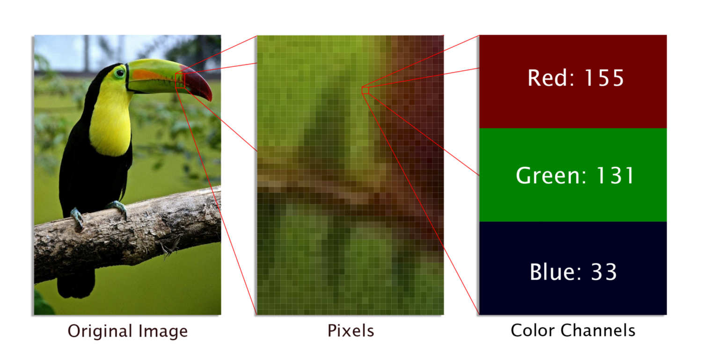

*Fig.1:   2D pixel image[^1]*

Like images, the point cloud is the description of the real 3-dimensional world. However, the difference is that the dimensional of the point cloud is higher than images: Point cloud displays the scene in a 3-dimensional state, while the image is displayed in a 2-dimensional plane. Point clouds are to represent the surface of the object in the 3-dimensional world with data points, and each data point has its XYZ coordinate value in the world coordinate system. Therefore, the point cloud is a collection of the coordinate value of points on the surface of the object. As shown in Fig.2 below, it is a rabbit point cloud, which is scanned from a rabbit model and saved as data points.

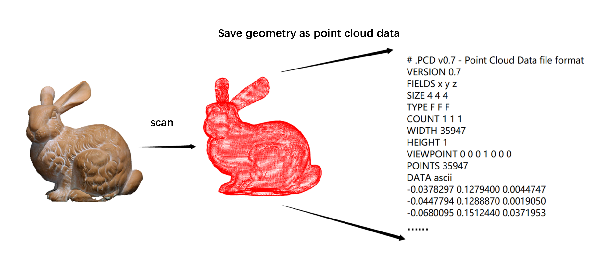

*Fig.2:   Sampling point cloud of rabbit geometry surface*

This document will start from studying the concept of the point cloud, mastering the algorithm of processing point cloud step by step and understanding the application scenarios of the point cloud. Then we can Lay a solid foundation for the subsequent use of point cloud to explore objects.

> Knowledge required for this document：
>
> - C++
> - python
>

​                                                      **——  Let us explore point cloud together!   ——**

##  Chapter1   Basic knowledge of point cloud

The content of this chapter mainly introduces the basic knowledge of point cloud and shows the point cloud to readers through the view, which helps readers to have an intuitive understanding of point cloud.

### What is point cloud?

Concept: Point cloud is a massive **collection of points** expressing **target spatial distribution** and **target surface characteristics** in **the same spatial coordinate system**[^2], which is the **"Sampling of object surface "**.

We can see that this concept has a long modifier, let us explain them one by one:

- **What does the same spatial coordinate system mean?  Why the same? **

  The same spatial coordinate system represents point cloud is the data in 3-dimensional space;

  "The same" means that all points in the point cloud are in the same coordinate system, instead of belonging to multiple coordinate systems, as shown in Fig.1.1:

  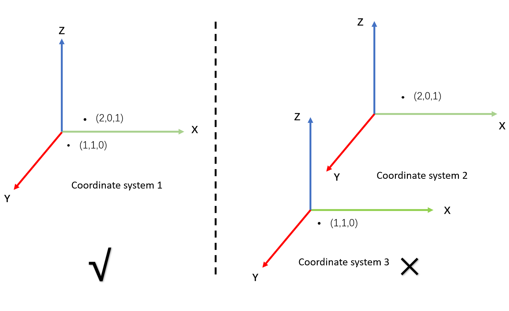

*Fig.1.1:   "The same" coordinate system*

- **What is "target spatial distribution"? What is the spatial distribution?**

  The target refers to our point cloud. Its spatial distribution is the spatial coordinates of each point. According to these coordinates, we can get the position of each point and sum them together to form the overall spatial distribution of the point cloud.

- **What is "target surface characteristics"? What are their characteristics?**

  Target surface characteristics are the characteristics of each point in the point cloud, also called features. So what exactly do these features include? Let us list a few examples:

  - **Color:** It means color of each point itself. Like the picture, point cloud can have true color. For example, in the Fig.1.2 below, we use the point cloud bridge obtained by the scanner. The scanner has a built-in lens. The operational theory of scanner is roughly the same as that of a camera. So the point cloud usually has true color, like a "3D" photo. Each point has its color:

  

  ​       *Fig.1.2:   Color*

  - **Normal:** It means normal of each point itself. It is more common to see normals in the optical system. A beam of light directed to a plane will produce incident light and reflected light, among them is normal, as shown in Fig.1.3. Normals are not only found in the optical system, as long as it is a plane, normals perpendicular to it can be calculated (see more in Chapter 4).

    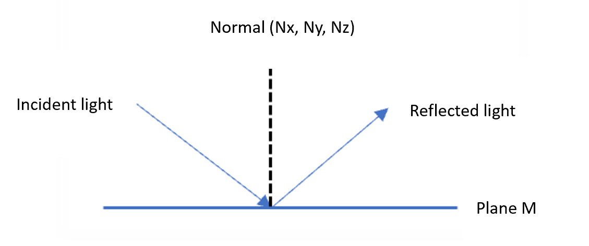

    *Fig.1.3:   Normal in optical system*

    Besides, the light intensity, the curvature can also be reflected in the point cloud as point characteristics, which are so-called target surface characteristics.

The "**cloud**" in "point **cloud**" embodies a collective idea, which shows that the point cloud is a set of many points, so the concept rests on the "collection of points". However, based on this "collection of points", it also contains the space coordinates and many characteristics of each point (That are target spatial distribution and target surface characteristics).

The concept of point cloud not only emphasizes that the point cloud is a "collection of points", more importantly, **the point cloud is a sampling of object surface** —— Sampling refers to the process of getting a sample of individuals from the population. Scanning is to sample the object surface, and the point cloud is **sample points on the object surface**.

After understanding the meaning of the above concepts, let us take a look at a few schematic diagrams of point clouds!

### Point Cloud View

The following figure shows several point cloud views: **rabbit.pcd**, **bridge.bin**, **chair.pcd**, **airplane.pcd**, **bottle.pcd** (see in "files" folder, except **bridge.bin**).  

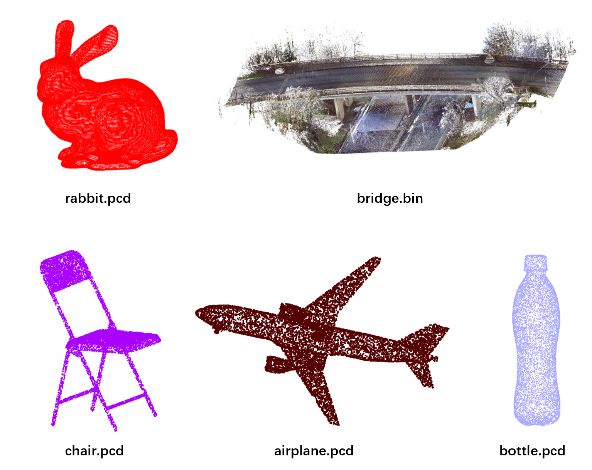

*Fig.1.4:   Point Cloud View*

For these point cloud files, its structure and shape will let us recognize what it is. We can drag files into CloudCompare and zoom in them (see in Chapter 2), and feel the point cloud view intuitively. CloudCompare is an open-source software used to process point cloud. So It can be used for secondary development. It is also powerful and easy to operate. We will introduce it in Chapter 2.

> **Here is a rough introduction to get the point cloud view in CloudCompare, so that visualization is available:**
>
> CloudCompare download link: http://www.cloudcompare.org/, choose Download, then choose the installation file corresponding to the computer system:
>
> 
>
> *Fig.1.5:   Download CloudCompare*
>
> 
>
> After installation, we get CloudCompare：
>
> Open CloudCompare, then drag directly to CloudCompare to see the view (The background of the view here is white, and the background of the original installation should be a gradient dark blue. We will give more details on the color setting in Chapter 2):
>
> 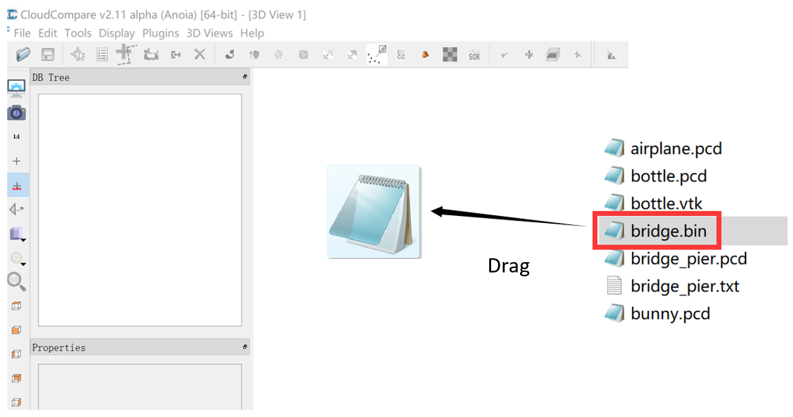*Fig.1.6:   Open file in CloudCompare*

As shown in Fig.1.6, we drag the **bridge.bin** ("bin" is a kind of file format. We will introduce it in Chapter 3. There are many other file formats can save point cloud) into CloudCompare to visualize. 

The point cloud is the sampling of the object surface, as shown in Fig.1.7.

In the real scene of a bridge, what the scanner collects are point data on the surface of the bridge. Fig.1.7 shows a schematic diagram of the bridge surface being sampled by the scanner in the actual scene. Here, red points are used to indicate the scanned part:

*Fig.1.7:   Bridge surface sampling*

As a kind of data in 3-dimensional space, what are the characteristics of a point cloud?

### Features of point cloud

- Translation and rotation in space can not change characteristics of point cloud itself, which can be reflected in the point cloud algorithm many times. The so-called characteristics correspond to the surface characteristics of the target mentioned when we introduced the concept of a point cloud, that is, color, normal vector and so on. Fig.1.8 is a schematic diagram of translation and rotation invariance with color as an example.

  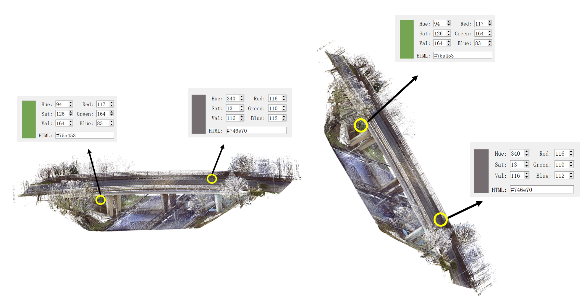

​    *Fig.1.8:   translation and rotation invariance (color)*

> NB：As shown in Fig.1.8, we can get color from Red, Green, Blue. The remaining Hue, Sat, and Val refer to hue, saturation and value (light value), whose abbreviation is HSV. There is no further explanation here.

- What we focus on is the spatial coordinate or color and other information of each point. Thus, the point size and other irrelevant factors do not influence our research. It generally has an impact on the view. Such as the point size is too small (Fig.1.9: small size), we cannot see some specific structures. At this time, we can enlarge the size of the point to facilitate the view (Fig.1.9: big size).

  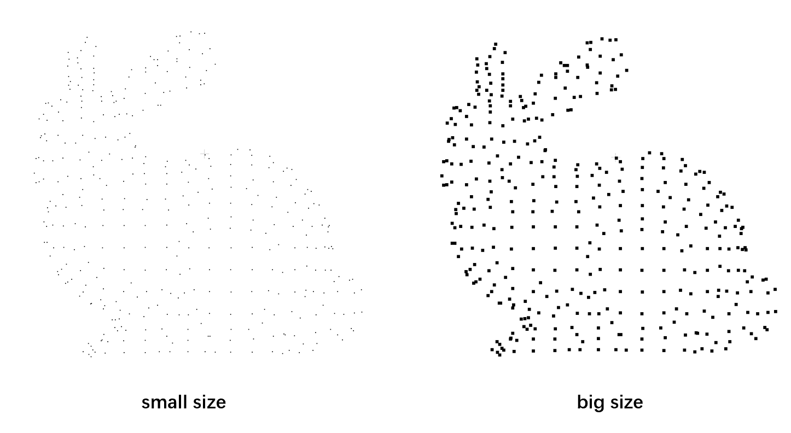

​       *Fig.1.9:   Point size*

- The point cloud collection is non-intrusive. That is, there is no impact or interference on the scene or the building when we use a laser scanner to scan them.

Now we know what a point cloud is, the intuitive view of the point cloud, and the characteristics of the point cloud. So how do we get the point cloud data? 

### How to get point cloud?

#### real point cloud & virtual point cloud

We divide point clouds into real point clouds and virtual point clouds. The real point cloud refers to the point cloud data sampled in the real scene with a laser scanner, while the virtual point cloud refers to the point cloud created artificially through code or software. Virtual point clouds can usually control parameters, such as geometric complexity, noise level, etc., so they are mostly used for preliminary experiments of algorithms.

- **Real point cloud**

  The real point cloud is obtained from the objects in the real scene through some instruments. Such as 3D laser scanner. Scanners from common manufacturers on the market include **Faro Focus**, **Leica**, **Trimble**, etc.

  

  *Fig.1.10:   3D laser scanner products*

  First, we scan objects via a laser scanner or other instruments. Then the scanning results should be processed by supporting software. Finally, we can export point cloud data.

- **Virtual point cloud**

  If we want to generate some simple virtual primitives, here are two ways:

  - **By coding:** Write codes for primitives such as cylinders, cones, etc., and generate virtual point clouds with adjustable geometric parameters;
  - **By software:** Generate virtual point clouds through primitives algorithms in some software;

  > NB: If it is a point cloud of a more complex scene, the virtual approach is very challenging. The virtual point cloud is difficult to simulate the actual situation in the real scene, such as noise, uneven density, and defects. 

If we are unable to achieve the above acquisition methods, we can directly search for existing open datasets.

#### Open datasets

There are also some public point cloud datasets available for download:

- ***The Stanford 3D Scanning Repository***

  link： http://www.cc.gatech.edu/projects/large_models/

  When we are new to the point cloud, we can download many point cloud datasets from this website. Because the point cloud data volume of this website is small, the operation is convenient. Among them, "bunny" (also known as Stanford Bunny) is often used in significant point cloud algorithm examples.

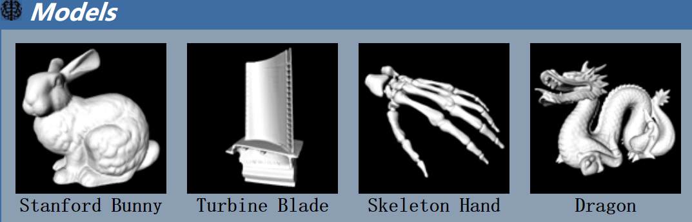

*Fig.1.11:   The Stanford 3D Scanning Repository*

- ***Sydney Urban Objects Dataset***

  link：http://www.acfr.usyd.edu.au/papers/SydneyUrbanObjectsDataset.shtml

  This dataset was acquired using LiDAR in the CBD area of Sydney, Australia, and covers a variety of common urban road objects. Such as all kinds of vehicles on the road, pedestrians, roadside trees, etc., include a total of 631 individual scanned objects. They are mainly used to test matching and classification algorithms.

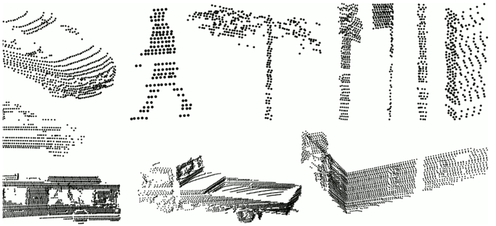

*Fig.1.12:   Sydney Urban Objects Dataset*

- ***ASL Datasets Repository***

  link：https://projects.asl.ethz.ch/datasets/doku.php?id=home

  This dataset contains many point cloud data, which can be used for target detection and matching, point cloud registration, etc.

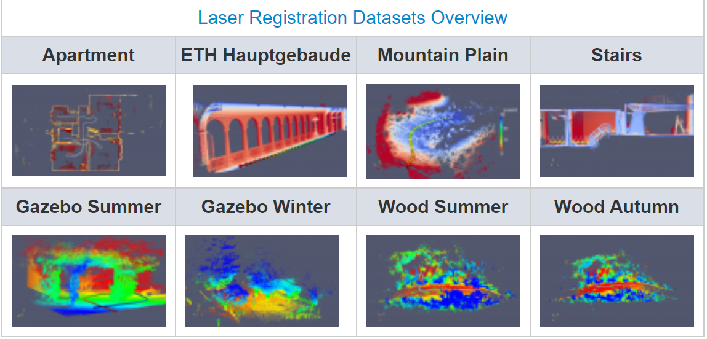

*Fig.1.13:   ASL Datasets Repository*

- ***Large-Scale Point Cloud Classification Benchmark***

  link：http://www.semantic3d.net/

  This one is a large-scale point cloud classification dataset, mainly used in point cloud classification. The dataset contains many natural urban scenes, such as churches, streets, railway tracks, squares, villages, football fields, castles, etc., with a total of more than 4000,000,000 points.

*Fig.1.14:   Large-Scale Point Cloud Classification Benchmark*

- ***RGB-D Object Dataset***

  link：http://rgbd-dataset.cs.washington.edu/index.html

  RGB-D Object Dataset is obtained by Kinect-style 3D camera, including common household objects. In addition to isolated views of 300 objects, the RGB-D object dataset also includes 22 annotated natural scene video sequences. These scenarios cover everyday indoor environments, which includes office workspaces, meeting rooms, and kitchen areas.[^3]

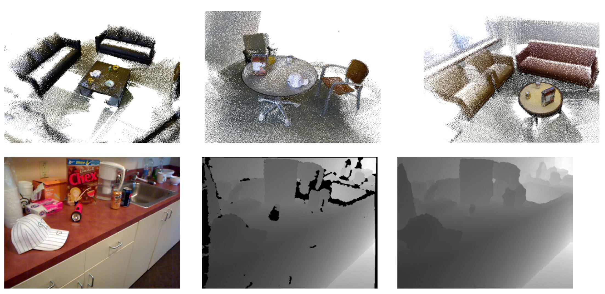

*Fig.1.15:   RGB-D Object Dataset*

- ***NYU-Depth***

  link：https://cs.nyu.edu/~silberman/datasets/

  NYU-Depth includes two sub-datasets, NYU-Depth V1 and NYU-Depth V2. Both of them are composed of video sequences from various indoor scenes, which are recorded by RGB and Depth cameras from Microsoft Kinect[^3]. 

  NYU-Depth V1 contains 64 different indoor scenes and seven types of area[^3].

  NYU-Depth V2 contains 1449 densely labeled aligned RGB and depth image pairs, and 464 new scenes from 3 cities[^3].

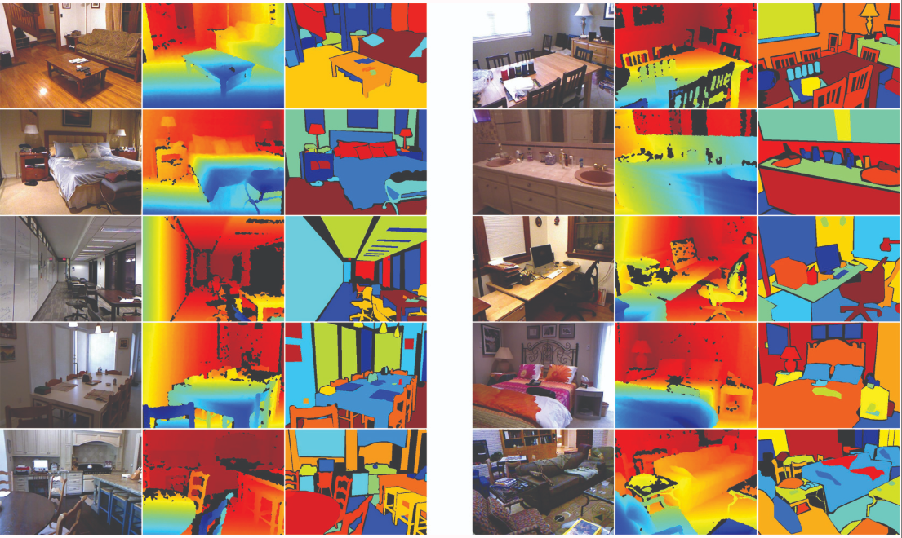

*Fig.1.16:   NYU-Depth*

- ***IQmulus & TerraMobilita Contest***

  link：http://data.ign.fr/benchmarks/UrbanAnalysis/#

  IQmulus & TerraMobilita Contest was generated within the framework of the IQmulus and TerraMobilita projects, and it contains 3DMLS data from the dense urban environment of Paris (France), consists of 300,000,000 points. In this dataset, the entire 3D point cloud is segmented and classified. That is, each point contains a label and a class. Therefore, a point-by-point evaluation of the detection-segmentation-classification method becomes possible.[^3]

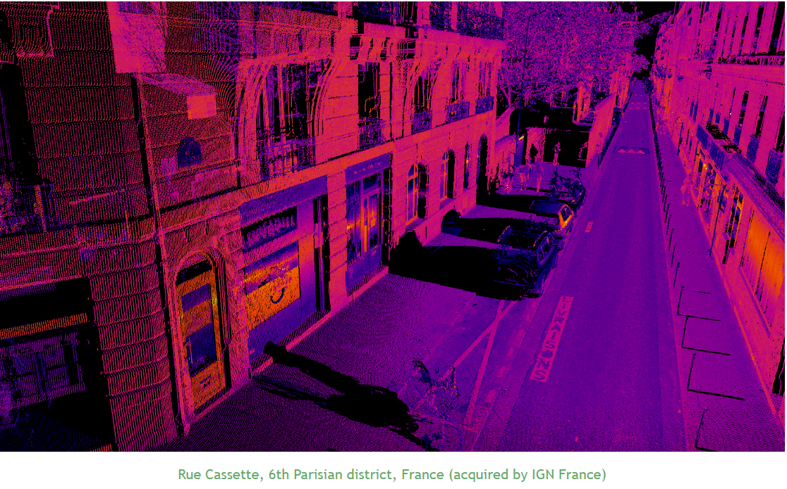

*Fig.1.17:   IQmulus & TerraMobilita Contest*

- ***Oakland 3-D Point Cloud Dataset***

  link：http://www.cs.cmu.edu/~vmr/datasets/oakland_3d/cvpr09/doc/

  The collection site of the database is around Carnegie Mellon University (CMU) in the United States. They use Navlab11 to collect data, which equipped with a side-view SICK LMS laser scanner for push sweep. This dataset contains the complete dataset, test set, training set and validation set[^3].

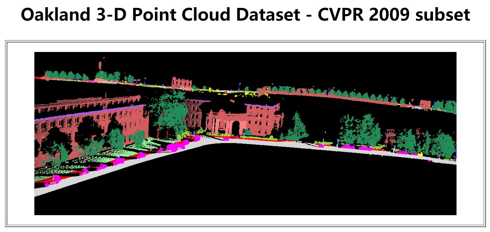

*Fig.1.18:   Oakland 3-D Point Cloud Dataset*

  

- ***The KITTI Vision Benchmark Suite***

  link：http://www.cvlibs.net/datasets/kitti/

  The KITTI Vision Benchmark Suite comes from a project of the Karlsruhe Institute of Technology in Germany. It contains a large number of urban environment point cloud datasets (KITTI) collected by KIT's UGV platform. This dataset not only includes radar, image, GPS, and INS data but also has manually labeled segmentation and tracking results, which can be used to objectively evaluate the effect and performance of large-scale 3D modeling and classification[^3].

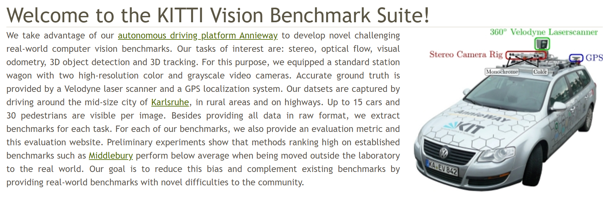

  *Fig.1.19:   The KITTI Vision Benchmark Suite*

 

- ***Robotic 3D Scan Repository***

  link：http://kos.informatik.uni-osnabrueck.de/3Dscans/

  This dataset is more suitable for SLAM and contains a large amount of Riegl and Velodyne radar data[^3].

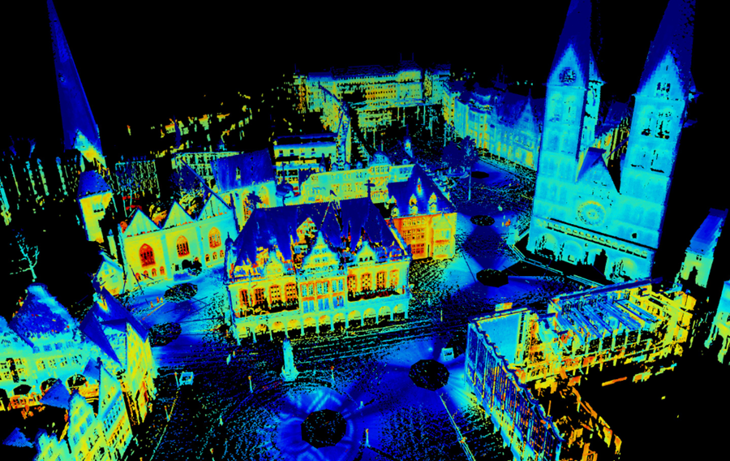

​       *Fig.1.20:   Robotic 3D Scan Repository*

- ***DURAARK dataset***

  link：http://duraark.eu/data-repository/

  DURAARK dataset, mainly including some building point cloud data, IFC format data of BIM model or point cloud data format .e57.

- link:  https://blog.csdn.net/h_____h/article/details/83177259

- link：http://yulanguo.me/dataset.html

  These two links are collections of some existing datasets, which may overlap with the previous link. 

Through the above learning, we have a preliminary understanding of point cloud, and we will discuss point cloud in detail in the following chapters. The application range of point cloud is extensive, including but not limited to the following areas:

### Point cloud application

There is a wide range of point cloud applications, including but not limited to:

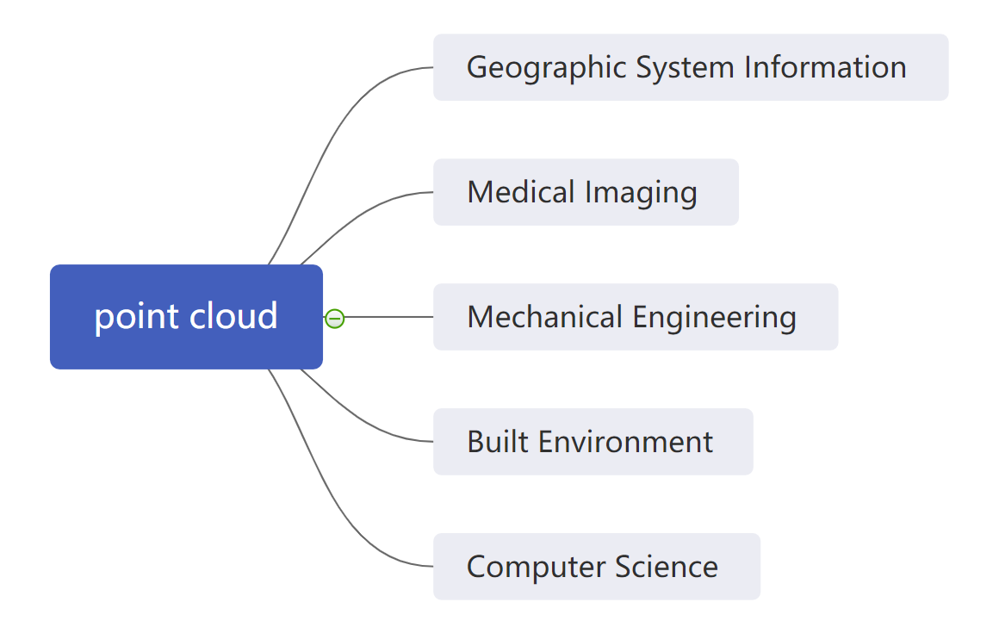

*Fig.1.21:  Application*

The point cloud is widely used in remote sensing technology in geographic information systems, such as airborne remote sensing, surveying terrain, vegetation, etc.;

There are also applications in medical imaging, such as the application of 3D point cloud reconstruction in medical-aided diagnosis to assist doctors to determine the location of the disease;

In the field of mechanical engineering, it is mainly used in reverse engineering, similar to 3D reconstruction;
The field of built environment mainly involves smart cities and digital twins;

The computer science field is closely related to various applications of computer vision, such as UGV, etc.

> At this point, everyone has a basic understanding of point cloud. In the next chapter, we will continue to explore point cloud software. Let us learn together!

### Reference

[^1]:https://medium.com/@vad710/cv-for-busy-developers-image-processing-d93ed4836880
[^2]: 赵翠晓. 倾斜摄影点云数据优化与容积率估算[D]. 2016.
[^3]: https://cloud.tencent.com/developer/article/1475816