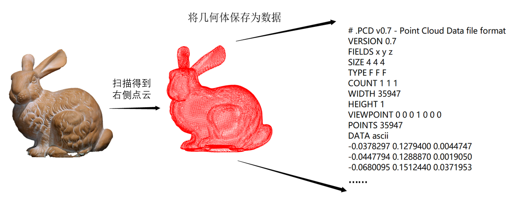
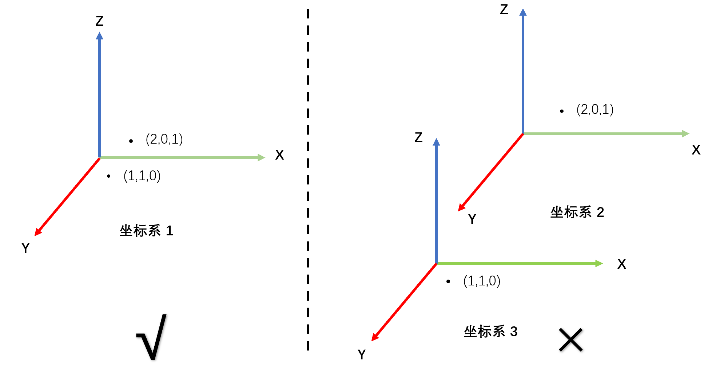
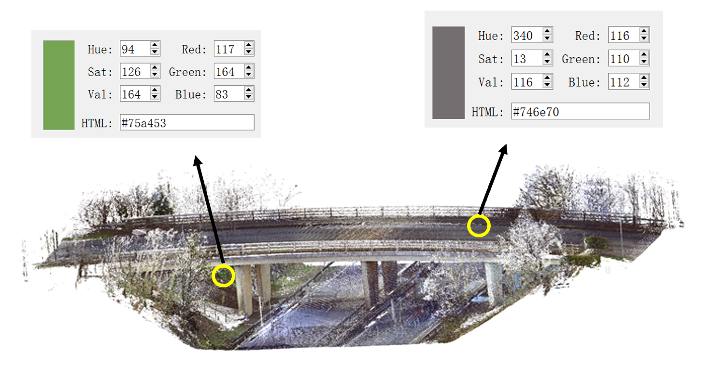
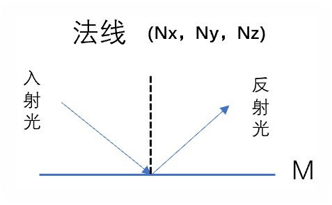
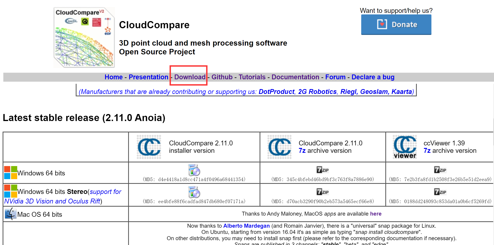
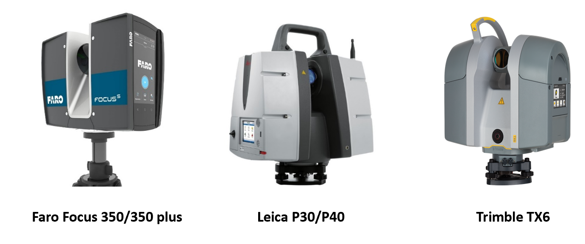
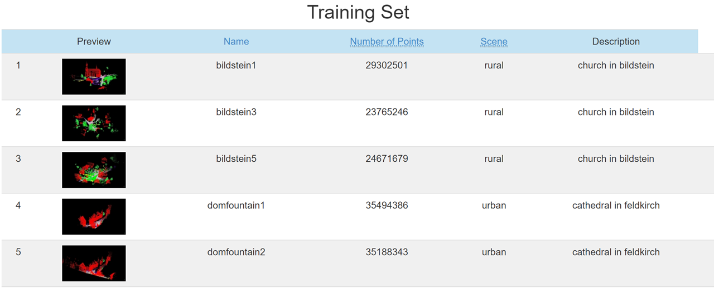
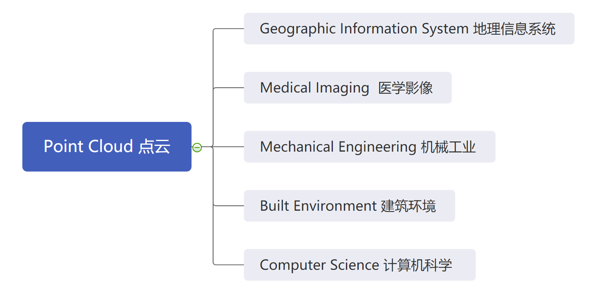

[TOC]

#  点云手册（入门级）

> 作者：徐梦洁 山东大学
>
> 指导老师：吕若丹   郭亮

**“点云，Point Cloud”** ，是我们这本手册的主角。接下来的学习会围绕着这一概念展开，别看它的名字有个 “云”，它跟天上的云彩可没有什么直接关系，也不是现在的 “云平台”，“云计算” 中 “云” 的含义。那么点云的学习背景是什么呢？一起来看看下面的学习引入吧！

## 学习引入

对于专门研究机器视觉或计算机视觉的研究人员来说，点云也许并不陌生，但对于其他学科，如土木工程学，机械工程学等专业的研究者来说，**何为点云？为什么要学习点云？如何学习点云？**都是比较陌生的知识。本文档面向所有非计算机/机器视觉专业的同学，带领大家探讨这些问题，增进大家对点云的了解，以便更好地结合自己的专业知识，灵活处理应用。

我们所生活的世界是由各种各样形形色色的物质组成的，小到微观的原子分子，大到宏观的道路建筑，各种物质都有它自己的结构以及形态。我们对于事物最普遍最直观的认识是在一维到三维的状态下，当然，对于高维状态我们也会在科学研究中进行探索，但日常生活中还是这三种状态最为直观。其中，在三维空间中我们可以清晰全面的观察到一个物体的结构组成，从而更加深刻地去探讨和理解它的运行机制。三维状态下研究问题会得到一维和二维无法得知的重要信息，因此，三维状态显得尤为重要。三维点云就是描述三维空间中物体的一个重要的表达方式之一。它将我们生活中的物体的几何形态和色彩信息等，通过对其表面进行采样，生成点云数据，存储在各种不同格式的点云文件中供我们处理。

可以说，**“万物皆点云”** —— 万物的几何形态都能抽象为点云表示。

实际上，三维点云跟 2D 的图片没有本质区别，都是对真实世界的映射。

我们所看到的 2D 图片其实是由像素组成的，像素就是一些数字。所以，图片的本质是数字，将光转化成二维数组，即所谓的像素。但像素值本身仅仅是一些没有实际意义的数字。相机拍照跟人眼观察世界的不同之处在于：前者只得到像素数字，而后者对场景有理解。

如下图，通过拍摄得到一张彩色 2D 像素图片，存储在图片当中的是一些数字，每个像素格中有三个通道（Color Channels），每个通道有一个对应的数值。我们能轻易理解这是一张巨嘴鸟站在树枝上的照片。同时我们能指出图片中哪里是巨嘴鸟，哪里是树枝，哪里是背景：

​                                                                              图 1：2D 像素图片[^1]

类似图片一样，点云是对真实三维世界场景的描述。不同的是，点云是更高维度的数据：点云将三维空间中的场景通过三维状态显示，而图片则是通过二维平面来展示。而本质上，点云也是将三维世界中的物体的表面用数据点表示，每个数据点有其在世界坐标系中的 XYZ 坐标值。所以，点云实际上是物体表面点的坐标数据的集合。图 2 是由一个兔子模型扫描而成的兔子点云，然后保存为三维数据点的过程。

​                                                             图 2 ：兔子几何体表面采样点云示意图

本文档将从理解点云的概念，一步步掌握处理点云的算法，了解点云的应用场景，培养三维学习思维，为后续利用点云探索物体打下坚实基础。

> 本文档所需知识储备：
>
> - C++ 编程基础；
> - python 编程基础；
> - 计算机视觉基础；
>

​                                                         **——   下面我们一起来探索奇妙的点云吧!   ——**

##  第一章   点云基础知识

本章内容主要介绍点云的基础知识，并通过视图的方式向读者展示点云，有助于读者对点云进行直观的了解。希望大家能够带着对点云概念的思考进行视图和学习。

### 什么是点云？

概念：点云是**同一空间参考系**下表达**目标空间分布**和**目标表面特性**的海量**点的集合**[^2]，是物体**表面的 ”采样“**。

大家看到这个概念有很长的修饰性定语，下面我们来一一解释：

- **同一空间参考系是什么意思？为什么是同一？**

  同一空间参考系即代表着点云是在三维空间当中的数据；

  ”同一“ 代表该点云中所有的点都是在同一个坐标系下，而不是分属多个坐标系；

  

  ​                                                                图 1-1：**同一**坐标系示意图

- **目标空间分布是指什么？什么是空间分布？**

  目标，也就是我们的点云。它的空间分布，实际上就是每个点的空间坐标。根据这些坐标，我们可以得到每个点的位置，汇总到一起，就构成了点云整体的空间分布。

- **目标表面特性又是什么？特性是什么？**

  目标表面特性，实际就是点云中每个点的特性，又称特征。那么这些特征又具体包括什么？下面给大家举几个例子：

  - 颜色（Color）：就是每个点本身的颜色信息。点云跟图片一样，图片可以是真彩。比如下图我们用扫描仪获得的点云桥体，扫描仪有内置镜头，跟相机拍照原理一样，所以点云通常也会带有真彩，像 “3D 的相片”。每个数据点都有其色彩值；
  
  
  
  ​                                                                           图 1-2：颜色示意图
  
  - 法线，又称法向量（Normal）：是每个点的法线信息。相信大家对光学系统中的法线并不陌生，一束光线射向平面 M，称为入射光，经过法线处得到反射光。图 1-3 示意图中间的虚线就是法线。其实，法线不只是在光学研究中会有，只要是一个平面，都可以计算垂直于它的法线（对于法线我们会在后面章节有详细说明，见第四章）；
  
    
  
    ​                                                             图 1-3：光学系统中法线示意图
  

除此之外，光照强度、曲率等都可以作为点的特征体现在点云中，此为目标表面特性。

点云中的 “云” 体现的是一种集合思想，说明点云是众多点的汇聚，因此概念落脚在**点的集合**。点云就是一堆带有信息的点所组成的整体，只不过在这个 “点的集合” 的基础上，还包含每个点的空间坐标和众多特点（也就是概念中的修饰性定语 “目标空间分布” 和 “目标表面特性”），因此点云才有各种形态结构。

而实际上，点云概念不仅仅强调点云是“集合“，更重要的是**点云是物体表面的采样** —— 采样即取样，是指从总体中抽取个体组成样本的过程。扫描是对物体表面进行采样，点云就是**物体表面的样本点**。

### 点云视图

​                                                                        图 1-4：点云视图举例

图 1-4 分别是五个点云文件的示意图，它们分别是：兔子点云 **rabbit.pcd**、桥体点云 **bridge.bin**、椅子点云 **chair.pcd**、飞机点云 **airplane.pcd**、瓶子点云 **bottle.pcd**（文件都在教程文件夹中，除了 **bridge.bin**）。 相信大家都很熟悉这些生活中常见的物体。对于这些点云文件，它的结构形状会让我们一眼就认出它具体是什么。我们可以将点云拖进 CloudCompare（具体操作见 2-1）中并进行放大操作，直观感受点云视图。（ CloudCompare 是一款用来处理点云文件的开源软件，可以进行二次开发，功能强大，操作简便，第二章会介绍它的具体使用）

> **这里先跟大家粗略涉及一点 CloudCompare 的视图知识，方便大家自己尝试点云文件的视图：**
>
> CloudCompare 下载地址：http://www.cloudcompare.org/ ，选择 Download，进入下图界面，选择自己电脑系统对应的安装文件：
>
> 
>
> ​                                                             图 1-5：CloudCompare 下载示意图
>
> 
>
> 安装成功后，CloudCompare 图标为：
>
> 打开 CloudCompare，直接将文件拖入 CloudCompare 即可看到视图（这里的视图背景为白色，大家初次安装背景应该为渐变深蓝色，关于颜色的设置我们会在第二章给大家详述）：
>
> 
>
> ​                                                              图 1-6：在 CloudCompare 中打开文件

比如我们将图 1-4 中的 **bridge.bin** （bin是点云文件的一种文件格式（见第三章 点云的文件格式）。除此之外点云的表示还有其他文件格式）拖入 CloudCompare，即可看到视图。

点云是物体表面的采样，如图 1-7 展示的是实际场景中桥表面被扫描仪采样的示意图，这里用红色点来表示被扫描到的部分：

​                                                                         图 1-7：桥梁表面采样

点云作为一种三维空间中的数据，它有什么特点呢？

### 点云的特点：

- 空间中的平移旋转不会改变点云数据本身的性质，这一特点会在点云算法中多次体现。所谓的点云本身的性质，对应着我们在介绍点云概念时所说的目标表面特性，也即颜色，法向量等。图 1-8 是以颜色为例的平移旋转不变性示意图，图中原始点云（左）经过向右平移和顺时针旋转得到结果点云（右），但这个操作并没有影响对应部位的颜色信息；

​                                                            图 1-8：平移旋转不变性（以颜色为例）

> 注意：图 1-8 中的 RGB 信息体现在 Red，Green，Blue 中；左侧的 Hue，Sat，Val 分别指色调、饱和度以及明度，简称 HSV。这里不做深入解释。

- 我们关注的是每个点的空间坐标，颜色等信息，因此点的大小等其他无关因素对于我们的研究没有影响，它一般是在视图上会有影响：比如点太小（图 1-9：small size），我们看不清楚一些具体结构，这个时候可以通过放大点的大小来方便视图（图 1-9：big size）；

​                                                                               图 1-9：点的大小

- 点云的采集是非侵入式的。也就是说，我们用激光扫描仪扫描一个场景或者一个建筑物，不会对场景或者建筑物造成任何影响和干扰。

现在我们对于点云是什么、点云的直观视图、点云的特点都有所了解，那么如何去获取点云数据呢？学了下面的知识，大家就可以得到自己的点云数据，进行自己的尝试！

### 如何获取点云？

#### 真实点云和虚拟点云：

我们将点云分为真实点云和虚拟点云两类。真实点云是指用激光扫描仪在真实场景中采样得到的点云数据；虚拟点云是指通过代码或者软件，人为创造出的点云。虚拟点云通常可以控制参数，如几何复杂度、噪音水平等，所以多用于算法的初步试验。

- **真实点云：**

  真实点云是我们通过一些仪器从真实场景中的物体中获得的，常用的仪器有三维激光扫描仪，市面上常见厂家的扫描仪有 **Faro Focus**、**Leica**、**Trimble** 等：

  

  ​                                                                            图 1-10：扫描仪产品

  真实点云是通过激光扫描仪等仪器扫描后，再经过配套软件的后续处理，最后导出得到的。具体步骤这里不做详细阐述。

- **虚拟点云：**

  如果我们想要生成一些简单几何原件的虚拟点云，这里列举两种途径：
  
  -  通过代码实现：编写几何元件如圆柱体，椎体等的代码，生成可调整几何参数的虚拟点云；
  -  通过一些软件里自带的几何元件算法来生成虚拟点云；
  
  > 需要注意的是：如果是更复杂场景的点云，虚拟途径是很具挑战的；虚拟点云很难去模拟现实场景中的实际情况，如噪音，密度不均，缺陷等。

#### 点云数据集：

目前还有一些公开的点云数据集可供下载使用：

> 参考自 https://cloud.tencent.com/developer/article/1475816

- ***The Stanford 3D Scanning Repository***

  link： http://www.cc.gatech.edu/projects/large_models/

  刚接触点云时，大家可以多下载该网站的点云数据集，因为该网站的点云数据量小，操作方便。其中用的比较多的兔子点云（又称 Stanford Bunny）经常在各大点云算法示例中见到。
  
  

​                                                    图 1-11：The Stanford 3D Scanning Repository

- ***Sydney Urban Objects Dataset***

  link：http://www.acfr.usyd.edu.au/papers/SydneyUrbanObjectsDataset.shtml

  该数据集是使用 LiDAR 在澳大利亚悉尼的 CBD 区域获取的，涵盖了各种常见的城市道路对象，比如在道路上的各种车辆、往来行人、路旁树木等，一共包括 631个单独的扫描物体。主要用来测试匹配和分类算法。
  
  

​                                                             图 1-12：Sydney Urban Objects Dataset

- ***ASL Datasets Repository***

  link：https://projects.asl.ethz.ch/datasets/doku.php?id=home

  该数据集包含众多点云数据，这些数据可以分别用于目标检测和匹配，点云配准等。
  
  
  
  

​                                                                   图 1-13：ASL Datasets Repository

- ***Large-Scale Point Cloud Classification Benchmark***

  link：http://www.semantic3d.net/

  该数据库是是一个大型点云分类的数据集，主要用在点云分类中。该数据集包含众多自然场景以及城市场景，比如教堂、街道、铁路轨道、广场、村庄、足球场、城堡等，总计超过 4000,000,000 个 点。
  
  

​                                              图 1-14：Large-Scale Point Cloud Classification Benchmark

- ***RGB-D Object Dataset***

  link：http://rgbd-dataset.cs.washington.edu/index.html

  RGB-D 对象数据集是通过 Kinect 风格的 3D 相机获取的，包含常见的家庭对象。除了 300 个对象的孤立视图之外，RGB-D 对象数据集还包括 22 个带有注释的自然场景视频序列。这些场景覆盖了常见的室内环境，包括办公室工作区、会议室和厨房区域[^3]。
  
  

​                                                                图 1-15：RGB-D Object Dataset

- ***NYU-Depth***

  link：https://cs.nyu.edu/~silberman/datasets/

  该数据集包括两个子数据集，分别是 NYU-Depth V1 和 NYU-Depth V2，都是由来自各种室内场景的视频序列组成，这些视频序列由来自 Microsoft Kinect 的 RGB 和 Depth 摄像机记录[^3]。

  NYU-Depth V1 数据集包含有 64 种不同的室内场景、7 种场景类型[^3]。 

  NYU-Depth V2 数据集包含 1449 个密集标记的对齐 RGB 和深度图像对、来自 3 个城市的 464 个新场景[^3]。
  
  

​                                                                              图 1-16：NYU-Depth

- ***IQmulus & TerraMobilita Contest***

  link：http://data.ign.fr/benchmarks/UrbanAnalysis/#

  该数据库是在 iQmulus 和 TerraMobilita 项目框架内产生的，包含来自巴黎（法国）密集城市环境的 3DMLS 数据，由 300,000,000 点组成。在该数据库中，对整个 3D 点云进行分割和分类，即每个点包含一个标签和一个类。因此，对检测-分割-分类方法进行逐点评估成为可能[^3]。
  
  

​                                                       图 1-17：IQmulus & TerraMobilita Contest

- ***Oakland 3-D Point Cloud Dataset***

  link：http://www.cs.cmu.edu/~vmr/datasets/oakland_3d/cvpr09/doc/

  该数据库的采集地点是在美国卡耐基梅隆大学周围，数据采集使用 Navlab11，配备侧视 SICK LMS 激光扫描仪，用于推扫。 其中包含了完整数据集、测试集、训练集和验证集[^3]。
  
  

​                                                        图 1-18：Oakland 3-D Point Cloud Dataset

  

- ***The KITTI Vision Benchmark Suite***

  link：http://www.cvlibs.net/datasets/kitti/

  该数据集来自德国卡尔斯鲁厄理工学院的一个项目，其中包含了利用 KIT 的无人车平台采集的大量城市环境的点云数据集（KITTI），这个数据集不仅有雷达、图像、GPS、INS 的数据，而且有经过人工标记的分割跟踪结果，可以用来客观评价大范围三维建模和精细分类的效果和性能[^3]。
  
  

​                                                   图 1-19：The KITTI Vision Benchmark Suite

 

- ***Robotic 3D Scan Repository***

  link：http://kos.informatik.uni-osnabrueck.de/3Dscans/

  这个数据集比较适合做 SLAM 研究，包含了大量的 Riegl 和 Velodyne 雷达数据[^3]。
  
  

​                                                            图 1-20：Robotic 3D Scan Repository

- ***DURAARK dataset***

  link：http://duraark.eu/data-repository/

  DURAARK 数据集，主要包括一些建筑点云数据，BIM 模型的 IFC 格式数据或点云数据格式 .e57；

- link:  https://blog.csdn.net/h_____h/article/details/83177259

  该数据集是一些现有数据集的合集，与前面的链接可能有所重合，大家可以根据所需下载相关数据集。

- link：http://yulanguo.me/dataset.html

  该数据集也是一些现有数据集的合集，与前面的链接可能有所重合，大家可以根据所需下载相关数据集。
  

通过入门学习，大家都点云有了一个初步了解，我们还将在后面的章节将对点云做详细探讨。点云的应用范围很广，包括但不限于以下领域：

### 点云的应用：

点云应用领域广泛，包括但不限于：

​                                                                       图 1-21：应用领域

点云广泛应用在地理信息系统中的遥感技术上，如机载遥感，勘测地形、植被等；在医学影像中也有应用，如三维点云重构应用在医学辅助诊断中，辅助医生确定病变部位；在机械工程领域主要应用在逆向工程，类似三维重建；建筑环境领域中主要涉及智慧城市和数字孪生；计算机科学领域内与机器视觉的各项应用关联密切，如无人驾驶等。

> 相信到这里，大家对点云都有了的基本认识，接下来的第二章我们将带大家继续探索点云的软件，通过玩转点云软件，激发大家学习点云的兴趣，一起学习吧！

### 参考文献：

[^1]:https://medium.com/@vad710/cv-for-busy-developers-image-processing-d93ed4836880
[^2]:赵翠晓. 倾斜摄影点云数据优化与容积率估算[D]. 2016.
[^3]:https://cloud.tencent.com/developer/article/1475816