[TOC]


## Chapter2   Point Cloud Software

Original point cloud data is usually too large, especially the real point cloud obtained by the scanner or other instruments. There may be millions, tens of millions, or hundreds of millions of points. As mentioned in the point cloud concept in Chapter 1, the point cloud is a set of massive points, which may contain some **messy irrelevant points**. These points may affect the efficiency in the processing of point cloud, and even influence the accuracy of algorithms. As shown in Fig.1, it is the point cloud data of a bridge scene. If we are only interested in the bridge body, then the trees and vehicles in the red frame are irrelevant points.

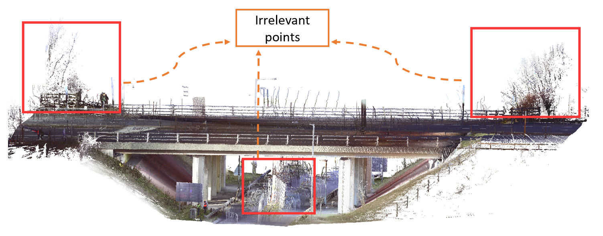

*Fig.1:  Irrelevant points*

Also, the original point cloud is too large and generally not directly used for subsequent processing. Usually, we will first pre-process the data. Pre-processing includes cropping, cutting, cleaning, and downsampling the point cloud (Figure 2), etc..

According to these, we are supposed to do some pre-processing, which includes cutting, cleaning and downsampling, as shown in Fig.2. These operations will be explained further in the document. 

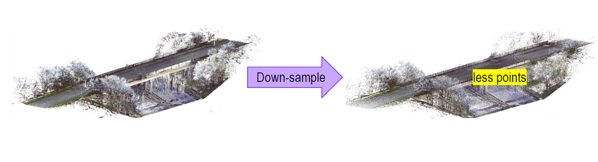

*Fig.2:   Pre-processing*

How to realize these operations?

One of the commonly used methods is to perform rapid and appropriate processing through existing commercial or free software.

This chapter mainly introduces two commonly used free open source software: 

​                                                                  ***CloudCompare & MeshLab***


Both of them have powerful point cloud processing capabilities and are very easy to use. 

Whether in the explanation of this document or our self-study process, we will use this two software extensively to perform pre-processing and visualization of point cloud such as cropping, cutting, cleaning, and downsampling, etc.

​                                            **——  Let's have fun with point cloud software! ——**


### 2-1 ：CloudCompare

------

CloudCompare is a powerful open-source software that can be used to process point cloud and Mesh (mesh data models). It is easy to operate, and it can run on Windows, MacOS and Linux. Because it is open-source, improve and expand the functions of CloudCompare according to users' own needs while learning the software is available. With the rapid development of CloudCompare, the number of points that the software can handle is getting larger. In 2005, it could quickly process more than 10,000,000 points. At the same time, it supports many point cloud algorithms (see in Chapter 4) and essential point cloud operation functions[^1].

Let us take a look at some beautiful views of point cloud with complex structures in CloudCompare, and feel the powerful visual functions of CloudCompare!

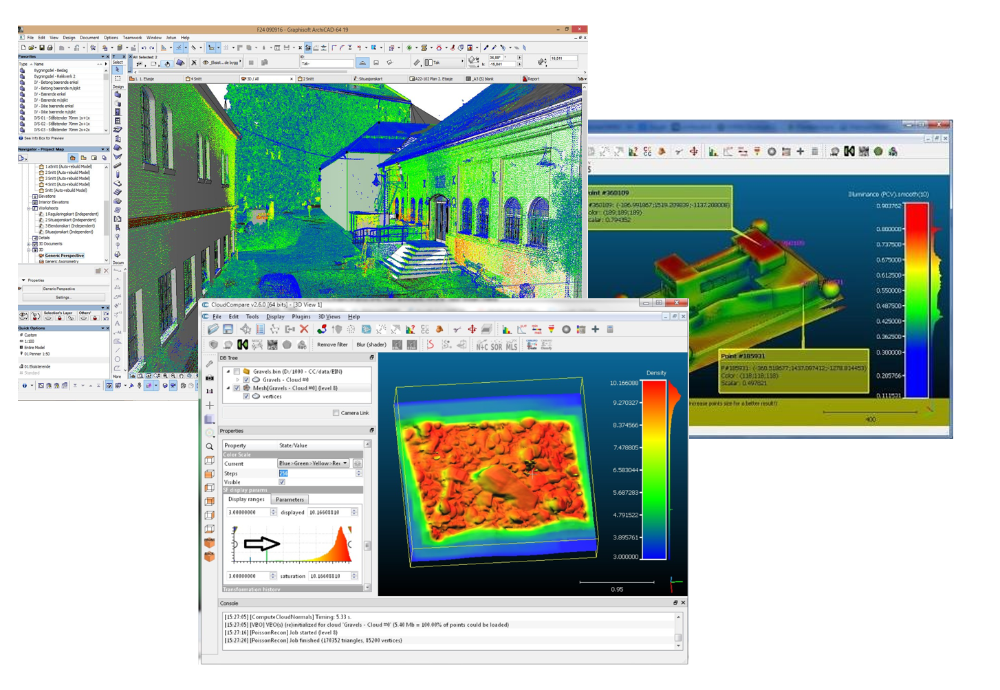

*Fig.2.1:   CloudCompare interface[^2][^3][^4]*

Here are a few small tools:

- CloudCompare source code. After we are very familiar with point cloud processing technology, we can write source code here:

  👉 https://github.com/cloudcompare/cloudcompare

- The following link intuitively introduces the basic operations of CloudCompare in YouTube:

  👉 [https://www.youtube.com/playlist?list=PLBNUxsUA00UAT63O0d95pByrCjtqlXN4_](https://www.youtube.com/playlist?list=PLBNUxsUA00UAT63O0d95pByrCjtqlXN4_)

- The following link is the official user tutorial of CloudCompare:

  👉 [https://www.danielgm.net/cc/doc/qCC/CloudCompare%20v2.6.1%20-%20User%20manual.pdf](https://www.danielgm.net/cc/doc/qCC/CloudCompare v2.6.1 - User manual.pdf)

> NB: The software version will be updated continuously. The following explanations will take the CloudCompare v2.11 alpha (Anoia) [64-bit] version as an example. Although the file operations of other versions are different, they are the same. We should learn to use flexibly.

Let us enter the world of CloudCompare!


#### 2-1-1：Download and install

Download path：

http://www.cloudcompare.org/  → Download:

Fig.2.1.1 is the download interface of CloudCompare. 


*Fig.2.1.1:   CloudCompare download interface*

Please select the corresponding exe file according to our computer system (such as Windows, MacOS, Linux) and install it according to the prompts. The operation is straightforward and does not require any keys or other requirements.

After installation, we can see the icon . This icon is composed of two "C"s, which represent the two "**C**" in **C**loud**C**ompare.

At this time, we open CloudCompare. Fig.2.1.2 is the initial interface of the software. On the left is the information display area of the software, and the gradient blue part on the right is the canvas area where the point cloud is displayed:

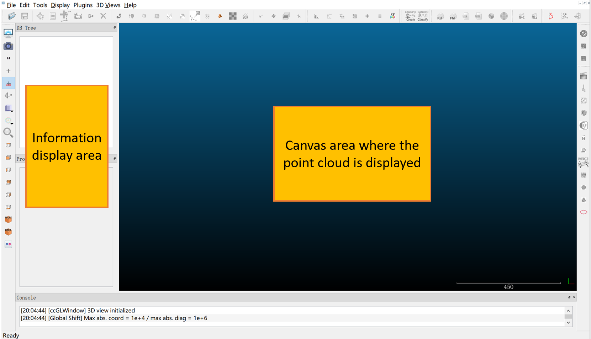

*Fig.2.1.2:   CloudCompare initial interface*

In the following chapters, the CloudCompare canvas color is set to white, which is slightly different from Fig.2.1.2 (gradient blue) (see in section 2-1-4 Color setting).

> Learning software requires us to try it ourselves. Let us open CloudCompare and explore its powerful functions!


#### 2-1-2：Open and view

There are only blank information display area and view canvas area in the initial interface of CloudCompare. Because there is no data import and CloudCompare has no point cloud objects that can be processed. Therefore, to use CloudCompare for point cloud processing, we should first open the file we need to process in the software. That is, "import file into CloudCompare". How to open a point cloud file in CloudCompare?

##### Open

There are two approaches to open file in CloudCompare:

- **Approach 1**: "File → open" or Open icon . Select the path of the file (Here we choose **bridge_pier.pcd** in "files" folder), as shown in Fig2.1.3:

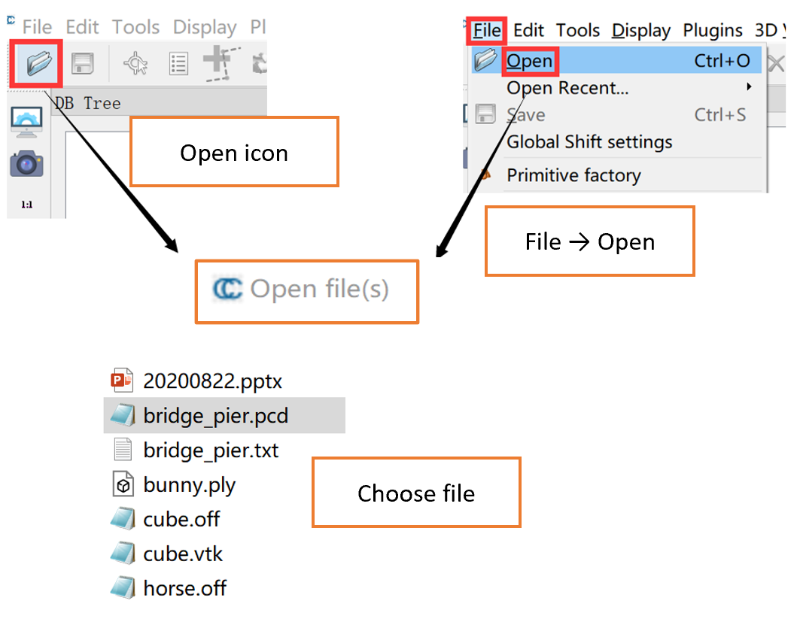

*Fig.2.1.3:   Open approach 1*

- **Approach 2:** Directly drag the file into CloudCompare, as shown in Fig.2.1.4:

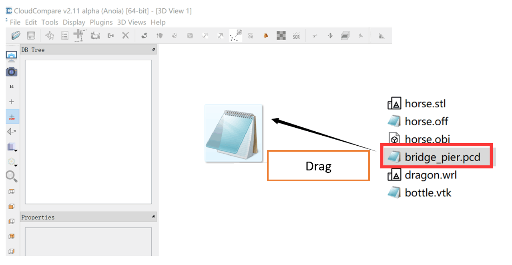

*Fig.2.1.4:   Open approach 2*

Through the above two approaches, we can see the point cloud view in CloudCompare. As shown in Fig.2.1.5:


*Fig.2.1.5: **bridge_pier.pcd** view*

**bridge_pier.pcd** is a point cloud of the bridge pier. It is precisely one of the bridge piers in **bridge.bin** that we have seen in Chapter 1, as shown in the red area in Fig.2.1.6:

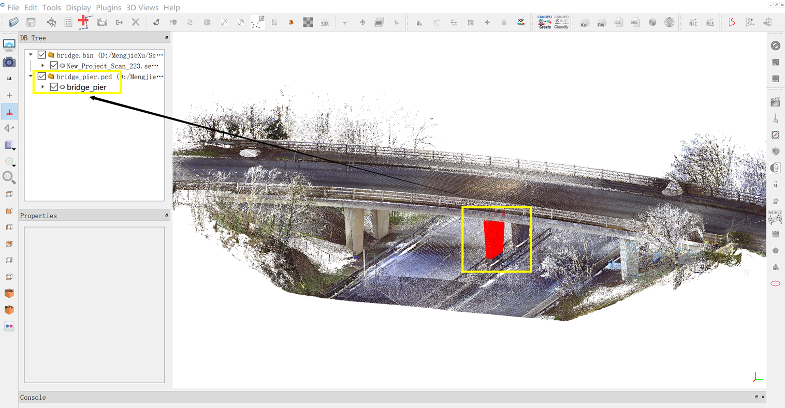

*Fig.2.1.6: Where we get **bridge_pier.pcd*** 

How can a relatively complete bridge pier be separated from the entire bridge body alone?

This operation is effortless. By cutting the bridge body, we can separate the parts we want (see in Section 2-1-5 Cutting). However, if we want to get a cleaner part with fewer noises, it is essential to go through multiple appropriate cutting and filtering (see in Chapter 4).


##### Q&A

> The following problems may be encountered during visualization of point cloud:
>
> Q：When we import two point cloud files into CloudCompare at the same time, why do we only see one of them?
>
> A：This is because
>
> 1. Different point cloud files have different coordinate ranges.
> 2. For example, the coordinate range of point cloud A is: *x: 0-1; y: 0-1; z: 0-1;* the coordinate range of point cloud B is as follows: *x: 99-100; y: 99-100; z: 99-100*. As a result, the coordinates of the two point clouds are too far apart. When they appear in the CloudCompare canvas at the same time, it may only show the point cloud in one of the coordinate ranges, and the other one is too far away from it and exceeds the current canvas area. At this time, we may need to rotate to find another point cloud, which will affect our point cloud view.
> 3. Different point cloud files have different sizes. For instance, a point cloud with the size of 1×1×1 will appear very small or even tricky to observe next to a point cloud with a size of 100×100×100.
>
> As shown below:
>
> 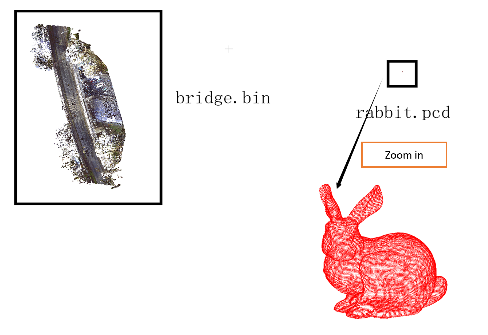
>
> *Fig.2.1.7*
>
> Both **bridge.bin** and **rabbit.pcd** appear in view at the same time, the **rabbit.pcd** on the right can only see a small red dot. **rabbit.pcd** does not have color information. In order to distinguish it from the white canvas, we set a specific color for it (see in section 2-1-4 Color setting).
>
> The above two situations will cause only one clear point cloud to be seen, which will affect our view. So it is recommended that when we do not know the size and coordinate range of each point cloud, try to view only one point cloud in CloudCompare at a time.


##### Bounding Box

After successfully opening and visualizing point cloud, we select "bridge_pier" (see red box in Fig.2.1.8) under DB Tree on the left side of the interface (The display of the point cloud in CloudCompare list is similar to a tree structure, so it is called "DB Tree"). We will find that a red rectangular box wraps the object in the canvas. (The color maybe not red, such as yellow or other colors, which is not big trouble, the color of the cuboid box can be set by ourselves. The specific explanation is in section 2-1-4)


*Fig.2.1.8:   Point cloud view and Bounding Box*

The red cuboid is called "Bounding Box" of the point cloud, which is used as the frame of the whole geometry and roughly gets the size range. So what exactly is Bounding Box?

Bounding Box, as the name suggests, is a box related to the bounding of point cloud. It is established in the coordinate system at the bottom right corner of CloudCompare (see the black box in Fig.2.1.9), that is, the orientation of Bounding Box in all dimension is parallel to the direction of the coordinate system in the black box at the bottom right corner.

- The side length of Bounding Box in the X-axis direction is determined with the X coordinate range of point cloud (x_min ~ x_max);
- The side length of Bounding Box in the Y-axis direction is determined with the Y coordinate range of point cloud (y_min ~ y_max);
- The side length of Bounding Box in the Z-axis direction is determined with the Z coordinate range of point cloud (z_min ~ z_max);

As shown in Fig.2.1.9:


*Fig.2.1.9:   Bounding Box and coordinate system*

**The point cloud** may have a complicated shape and structure, but no matter how complex the point cloud itself is, its **Bounding Box** is always a **regular and straightforward cuboid**. It can help us quickly get the range of the point cloud and facilitate subsequent operations using this range. So what are its application scenarios?

When doing **large area cutting** in CloudCompare, the Bounding Box will come in handy. We will introduce it in section 2-1-5 Cutting.

It should be noted that the Bounding Box in CloudComapre is **Axis-Aligned Bounding Box (AABB)**. In addition to AABB in CloudCompare, there is also a directed Bounding Box, which is called **Oriented Bounding Box (OBB)**. AABB and OBB are both Bounding Box. What is the difference between them?

- **Oriented Bounding Box** is always aligned with the principal component direction of the point cloud (PCA can be used to calculate the principal component direction);
- **Axis-Aligned Bounding Box** is always aligned with the coordinate axis;

In the case of 3D, as shown in Fig.2.1.10. The left side is AABB, and the right side is OBB:


*Fig.2.1.10:   Bounding Box in 3D[^5]*

In the case of 2D, as shown in Fig.2.1.11. The top side is AABB, and the bottom side is OBB:


*Fig.2.1.11:   Bounding Box in 2D[^6]*

Through the above introduction, we can see that **OBB** is more accurate than **AABB** to describe the range of point cloud. **AABB** will frame much invalid space, which will have a particular impact on efficiency in actual algorithm application. When we need a piece of more accurate range information, we generally choose to calculate **OBB**.


##### Files that can be opened in CloudCompare

Now, we have already learned how to open files in CloudCompare and have understood Bounding Box. Thinking about a question: CloudCompare is a software that can process point cloud, certainly not all file formats can be opened, so what formats can be opened in CloudCompare?

The files that can be opened in CloudCompare are related to 3D files, and some are not necessarily strictly point cloud files, as shown in the Tab.2.1:

*Tab.2.1:   File formats (and suffixes) that can be opened in CloudCompare*

| File Format                                 | Suffixes    | File Format                | Suffixes                                   |
| ------------------------------------------- | ----------- | -------------------------- | ------------------------------------------ |
| *CloudCompare entities*                     | *.bin       | *ASCII cloud*              | *.txt *.asc *.neu *.xyz *.pts *.csv        |
| *LAS cloud*                                 | *.las *.laz | *LAS 1.3 or 1.4*           | *.las *.laz                                |
| *E57 cloud*                                 | *.e57       | *PTX cloud*                | *.ptx                                      |
| *Simple binary file*                        | *.sbf       | *PLY mesh*                 | *.ply                                      |
| *OBJ mesh*                                  | *.obj       | *VTK cloud or mesh*        | *.vtk                                      |
| *STL mesh*                                  | *.stl       | *OFF mesh*                 | *.off                                      |
| *FBX mesh*                                  | *.fbx       | *DXF geometry*             | *.dfx                                      |
| *Point Cloud Library cloud*                 | *.pcd       | *SHP entity*               | *.shp                                      |
| *RASTER grid*                               | * . *       | *Riegl files*              | *.rdb *.rsp *.rds                          |
| *DotProduct cloud*                          | *.dp        | *Image*                    | *.bmp *.cur *.gif *.ico *.jpeg *.jpg *.pbm |
| *Photoscan project*                         | *.psz       | *CSV matrix cloud*         | *.csv                                      |
| *Clouds + calibrated images [meta] [ascii]* | *.icm       | *PDMS primitives*          | *.pdms *.pdmsmac *.mac                     |
| *Clouds + sensor info. [meta] [ascii]*      | *.pov       | *Point + Normal cloud*     | *.pn                                       |
| *Point + Value cloud*                       | *.pv        | *Salome Hydro polylines*   | *.poly                                     |
| *Sinusx curve*                              | *.sx        | *Snavely's Bundler output* | *.out                                      |
| *Mensi Soisic cloud*                        | *.soi       | *Image*                    | *.pgm *.png *.ppm *.svg *.svgz *.xbm *.xpm |


> NB: The above table is only the file format that CloudCompare can open under **Windows system**. The file formats that can be opened by other computer systems may be different. The viewing method is as follows:
>
> 1. **File → Open**.
> 2. Observe the suffix drop-down box in the lower right corner of the pop-up box.
> 3. Click the drop-down box, the file format that can be opened by current software is displayed.
>
> As shown in Fig.2.1.12, we can drag the scroll bar to see the remaining file format.
>
> 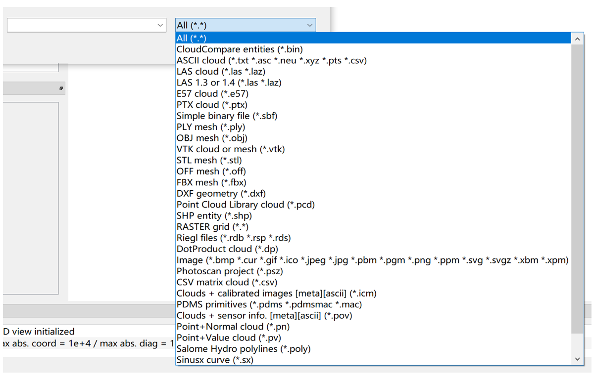
>
> *Fig.2.1.12:   File format view*


There are many file formats can be opened in CloudCompare. Accordingly, these file formats can also be transformed into other file formats by CloudCompare. The issue of file transformation is specified in "Chapter 3 Point Cloud File Format", so we will not go into details here.

After successfully opening the file, we can view the file in all directions in the canvas. What are the view functions in CloudCompare? Let us try together.


##### View in CloudCompare

###### Rotate, translate, zoom in/out

Take **bridge_pier.pcd** as an example:

- **Rotation: Rotation can help us see an all-round view of objects in 3-dimensional space.**

  step1: First, move the mouse arrow to any part of the point cloud geometry. Then click the left mouse button, and the mouse arrow will turn into a small hand shape. As shown in Fig.2.1.13:

  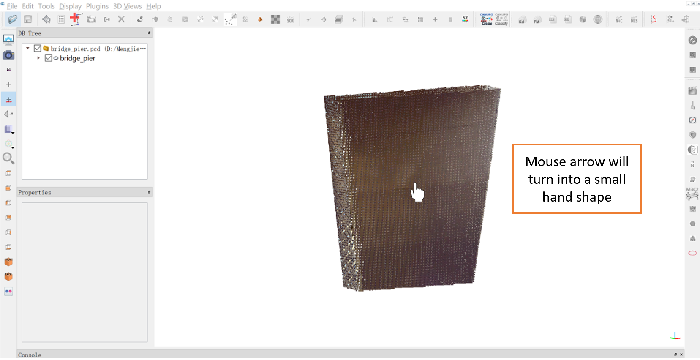

  *Fig.2.1.13:   Rotation step1*

  step2: Drag the mouse and click the left mouse button at the same time. At this time, the open hand becomes a fist-like shape, which means that the point cloud is already "in your grasp". Move the mouse, and then we can view the schematic diagram in all directions at will. As shown in Fig.2.1.14 & Fig.2.1.15:

  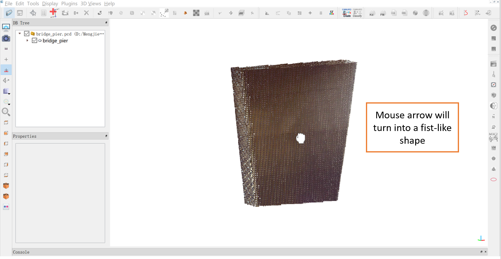

  *Fig.2.1.14:   Rotation step2*

  Fig.2.1.15 are views from different angles:
  
  

​       *Fig.2.1.15:   Different angle views*

- **Translation: Move the point cloud to a suitable canvas position for easy viewing.**

  Move the mouse arrow to any part of the point cloud, click the right mouse button, and the mouse arrow will turn into a cross symbol, as shown in Fig.2.1.16. Always click the right button at this time, do not release it, we can drag the point cloud file to realize translation, as shown in Fig.2.1.17:
  
  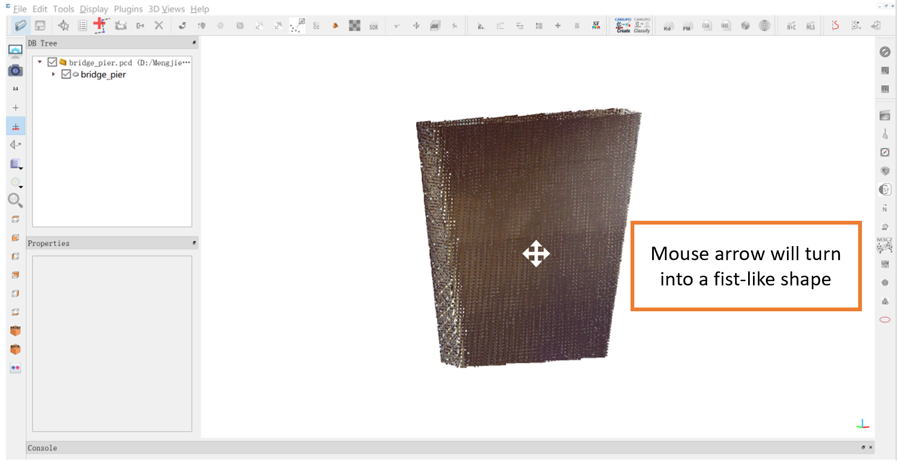

​         *Fig.2.1.16:   Mouse arrow changes*


​       *Fig.2.1.17:   Translation view*

- **Zoom in/out: zoom in or zoom out the point cloud:**

  Slide the mouse wheel, and the point cloud view will be zoomed in by sliding upward. Otherwise, the point cloud view will be zoomed out by sliding downward (Zooming in, we can see the embodiment of the concept of "point collection"; zooming out will see the geometric structure of the entire point cloud). As shown in Fig.2.1.18:

  

​        *Fig.2.1.18:   Zoom in/out view*

###### Orthographic view and Perspective view

CloudCompare has two point cloud view methods: orthographic view and perspective view. The difference between these two views is whether all parallel edges never intersect.

In an orthographic view, parallel edges never intersect. However, in a perspective view, some parallel edges may intersect.

Why do parallel edges still intersect? This situation is pervasive. As shown in Fig.2.1.19, the two parallel roads in real life converge to an intersection in the view:


   *Fig.2.1.19:   Parallel edges intersect*

Take **rabbit.pcd** as an example file (see in "files" folder):

- **Orthographic view:** The parallel edges of the Bounding Box of the point cloud in the orthogonal view never intersect (see the orange line in Fig.2.1.20). The orthographic view is the default view of CloudCompare.

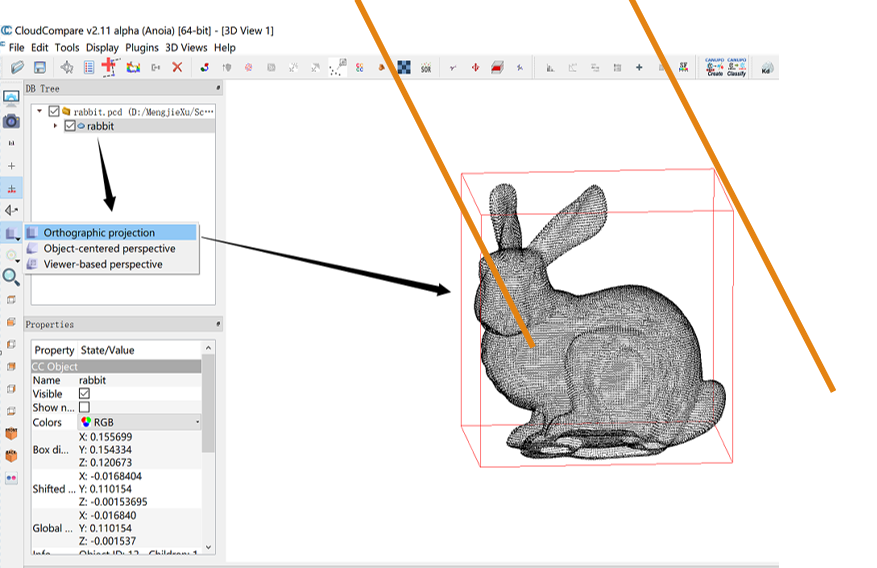

​            *Fig.2.1.20:   Orthographic view*

- **Perspective view:** This view is to project 3D objects onto the 2D interface. Just as the human eye or the camera directly sees it, the parallel edges never intersect, as shown in Fig.2.1.21 and Fig.2.1.22. CloudCompare provides two perspective views.

  The first one is the Object-centered perspective. It means centering on the object. When we click the left mouse button to rotate, the item will move in a fixed viewpoint (such as a camera) coordinate system.

  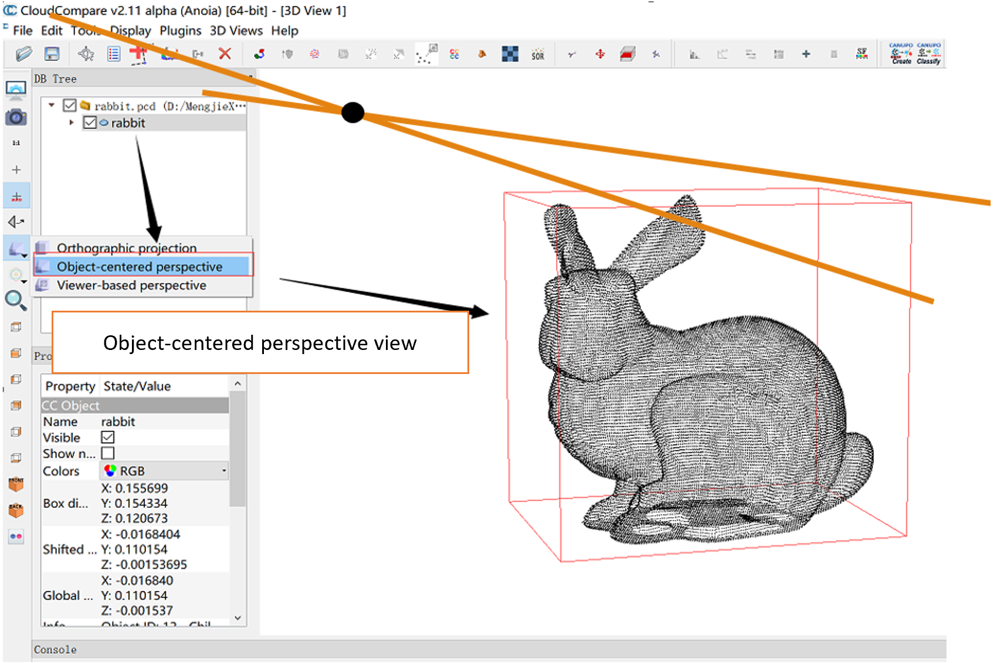

​        *Fig.2.1.21:  Object-centered perspective view*

​        The second one is Viewer-based perspective. It means rotating based on view (such as camera).                               

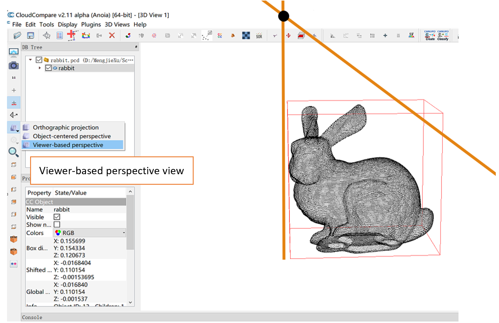

   *Fig.2.1.22:   Viewer-based perspective view*

When we click the mouse to rotate, we are rotating the viewpoint (such as lens, camera), and the mouse wheel controls the distance of the point cloud from the viewpoint.

Doing translation in this perspective view will be different from the orthographic view. When we move the mouse to the right, the point cloud moves to the left. This is because the **viewpoint** shifts to the right instead of the point cloud itself. When the viewpoint changes to the right, the point cloud **relatively** shifts to the left, so a left-shifting effect view appears.

###### Quickly view different views

There is a type of button in CloudCompare that can quickly jump to a specific view (such as Front view, left view, right view, etc.). As shown in the figure below, from top to bottom are **set top view，set front view，set left side view，set back view，set right side view，set bottom view:**

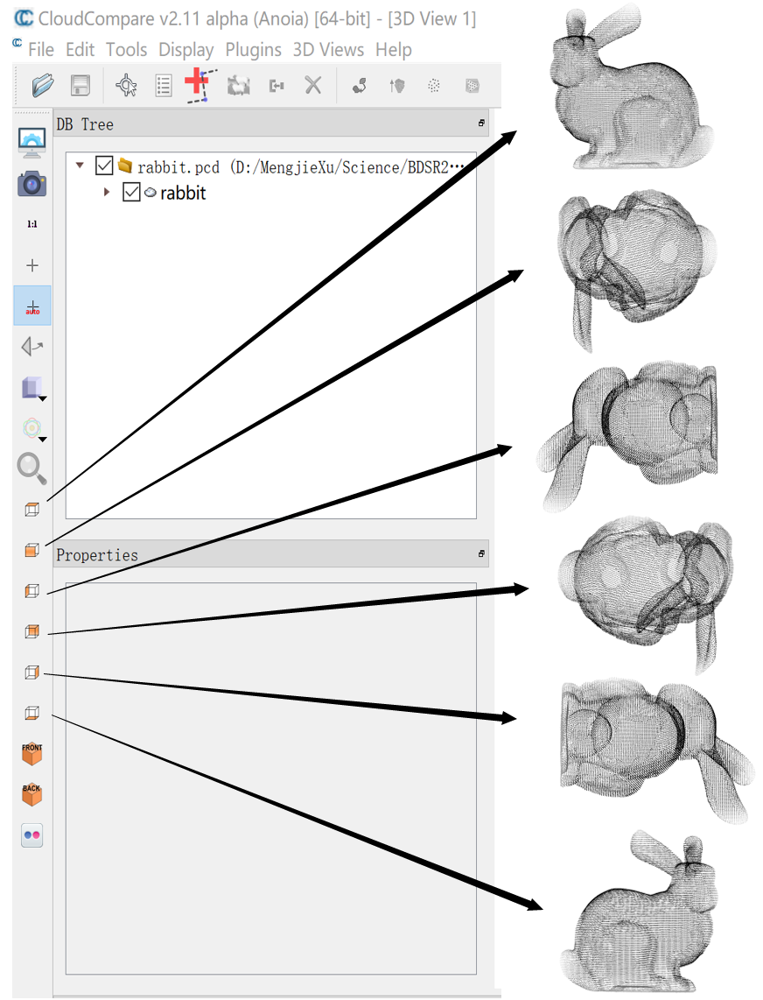

*Fig.2.1.23:   Quickly jump to a certain view*

> NB: These views are not the front, back, left, right, top, and bottom of we artificially distinguished, but are determined according to the coordinate axis and coordinate value of the point in the point cloud. For example, the top view refers to when the point cloud is projected on the XY plane, not the top part of the rabbit head we think is the top view.


#### 2-1-3 ：Read file internal information

In the previous section, we introduced how to open and visualize point cloud files in CloudComapre. Besides, we can also read important information about these files. In this section, we will explain how to read the data inside the file from CloudCompare. Take **bridge_pier.pcd** as an example.

As with viewing the Bounding Box, first select **"bridge_pier"** under **DB Tree** on the left side of CloudCompare, as shown in Fig.2.1.24. In the first purple box at the top left, relevant information about the opened file will appear in the **Properties** below.


*Fig.2.1.24:   Properties in CloudCompare*

The following is an explanation of the essential properties in the red box in **Properties**:

**Name**: The file name，here is "bridge_pier" ；

**Visible**: If selected, it can see that the point cloud in the canvas on the right. If it is not specified, the point cloud view will not be displayed on the right;

**Box dimensions**: The size of the point cloud Bounding Box;

**Shifted box center**: The shifted center of Bounding Box；

**Global box center**: The global center of Bounding Box；

**Points**: The total number of points in this point cloud. Here represents a total of 55,630 points;

**Point size**: It means the size of each point displayed on the right canvas. Here is Default. Click the drop-down button on the right side of "Default" to select point sizes of different sizes. Besides, there is another way to adjust the size of the default point. Move the mouse to the upper left of the canvas, and two lines of green letters will appear, as shown in Fig.2.1.24. Click the "+" or "-" behind the "default point size" in the first line to adjust the default point cloud size.

> NB: "Point size" plays a decisive role in the point size of view；Default point size changes the size of the default point. The default point size will only be reflected when the "Point size" is selected as "Default." If the Point size is 1, no matter how large the Default point size is, the point cloud view will still display a point of size 1.

Point cloud files in other formats are also interpreted in Properties. The premise is that the file format can be viewed in CloudCompare (see in **"Files that can be opened in CloudCompare"**)


#### 2-1-4：Color setting

> Starting from this section, the operations we introduce are all changes to the selected point cloud. If you want to keep the original point cloud, any processes that change the original point cloud with CloudCompare can be directly **saved as** a new point cloud file without overwriting the original one.

Sometimes, point clouds (such as pcd and other files that only store point information or ply and other files that can store point and topological information), Bounding Box, and canvas background colors may not be easily distinguished. Such as all of them are the same color system, which has a particular impact on our view. At this point, we can adjust the color of the canvas/point cloud/Bounding Box to facilitate the view. Take **bridge_pier.pcd** and **horse.ply** as examples (see in "files" folder).

##### Change the canvas background color

If the point cloud color is the focus of our processing, we can adjust it by changing the canvas's background color.

Fig.2.1.25 is the original view:


*Fig.2.1.25:   Original view*

Fig.2.1.26 is the setting process of changing the background color. 


*Fig.2.1.26:   Background color setting*

Fig.2.1.27 is the result view.


*Fig.2.1.27:   Result view*

The color here is just an example. Readers can choose different colors according to their actual situation.

> NB: When setting the background color, you can check the "display gradient background" or uncheck it. If checked, it displays a gradient background. Otherwise, it shows a solid color background.
>
> 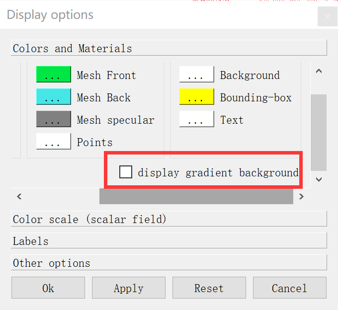
>
> *Fig.2.1.18:   display gradient background*


##### Change point cloud color

If the point cloud color is not the focus of our processing, we can adjust it by changing the point cloud's color. 

Now we take two different file formats as examples. The information stored in the two file formats is distinctive (see in Chapter3).

###### PCD and other files that only store point information

First, we introduce how to change color for pcd files that only store point information, as shown in Fig.2.1.29:

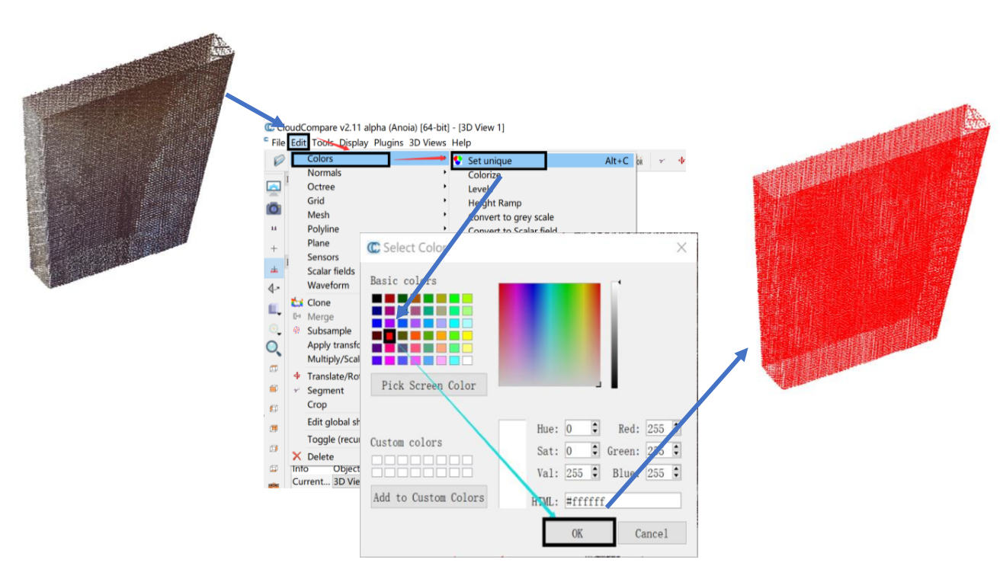

*Fig.2.1.29:   Point Cloud color setting*

On the left is the original point cloud. The process of setting color of the point cloud is in the middle. And on the right is the result point cloud, which turns red in the view. At this time, if you don't save this file and change its color in the view, then the original point cloud will not be altered in color.

###### PLY and other files that can store point and topological information

CloudCompare can also set the color for ply and other files that can store point and topological information, take **horse.ply** as an example (The data stored in **horse.ply** here has another name —— Mesh). There are two methods. The difference between the two ways is to change the view color of the currently selected file or the color of all files.

**Method 1**

**Display → Display settings → Colors and Materials**

By default, the color of Mesh Front is green, and the color of Mesh Back is blue (The front and back are only reflected when the file contains normal. If there is no normal, only the Mesh Front color will be displayed by defaulted). As shown in Fig.2.1.30, you can set the default color through the red box. After setting, all mesh files opened in CloudCompare will change the color:

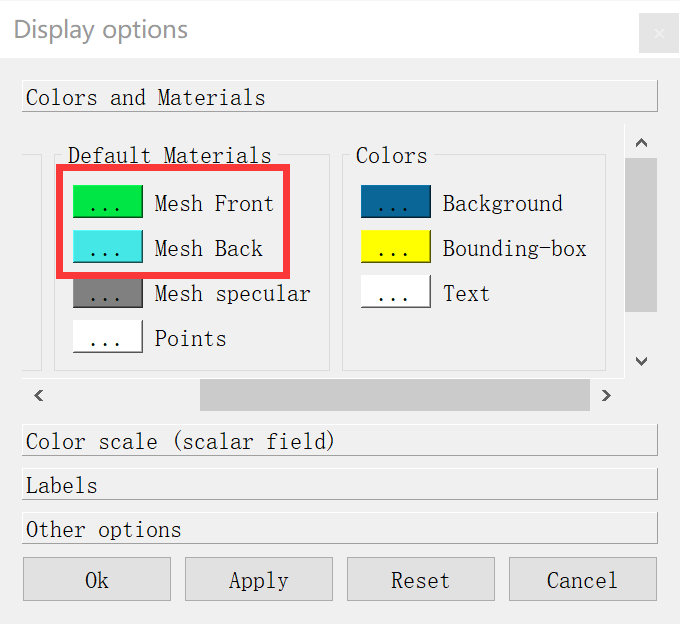

*Fig.2.1.30:   Mesh color setting 1*

**Method 2**

**Select file → Edit → Colors → Set Unique → Select Color → OK**

The file color in the current canvas has changed. Here we select **horse.ply** (the dashed box on the head) to zoom in. It can clearly see the mesh structure (Select Wireframe in Properties).


*Fig.2.1.31:   Mesh color setting 2*

In summary, method 1 applies to all files after changing color; method 2 only changes the currently selected file's color.


##### Change Bounding Box color

For the Bounding Box mentioned in CloudCompare, you can also set its color to see the geometry range more clearly. Fig.2.1.32 shows that the Bounding Box of the bridge pier is set from red to black:

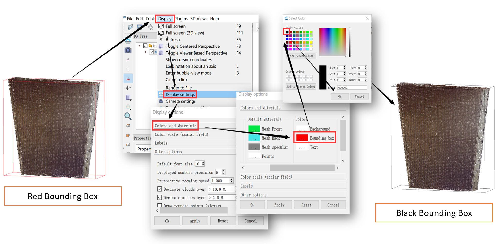

*Fig.2.1.32:   Bounding Box color setting*


#### 2-1-5：Cutting

**Computer Vision** is actually to let the computer automatically understand a picture or a scene. Putting it in the background of the point cloud means that the computer can understand the point cloud like a human. For the point cloud of a car, people can immediately recognize that it is a car based on their knowledge, and can point out that it has wheels and so on. According to our needs, we can find out the Region of Interest (**ROI**), that is, extract a specific point cloud region. ROI varies from situation to situation. It can be a wheel of a car point cloud, a spot on the hood of a car, or some unrelated points next to the vehicle.

It is assuming that we only need a part of the points for subsequent processing, such as a point cloud with only one wheel (Fig.2.1.33). We first need to extract this wheel, that is, ROI. Of course, sometimes, the ROI can also be the point cloud remaining after the noise or irrelevant points we want to remove (Fig.2.1.34). Therefore, we often clean up the point cloud to remove irrelevant points, just like selecting ROI. Because of the above scenarios, **point cloud cutting** can achieve ROI extraction.

> NB: From the perspective of machine vision recognition of monitored objects, it is unnecessary to remove **non-ROI** every time a point cloud is processed. Finding ROI is an identification problem. Here we use cutting to operate this step manually.

For example, in the figure below, our ROI is the rear wheel. So we hope to cut the wheel from the original point cloud and study it separately.

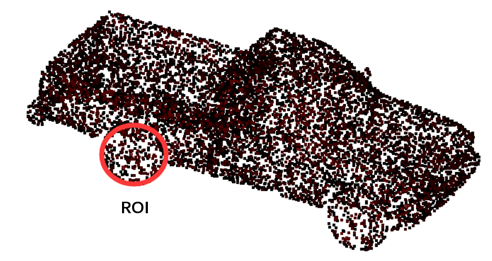

*Fig.2.1.33:   ROI 1*

The following Fig.2.1.34 is a point cloud scene of a table. The black box points are points that have nothing to do with the main point cloud, that is, the table. We hope to select these points and then remove them.

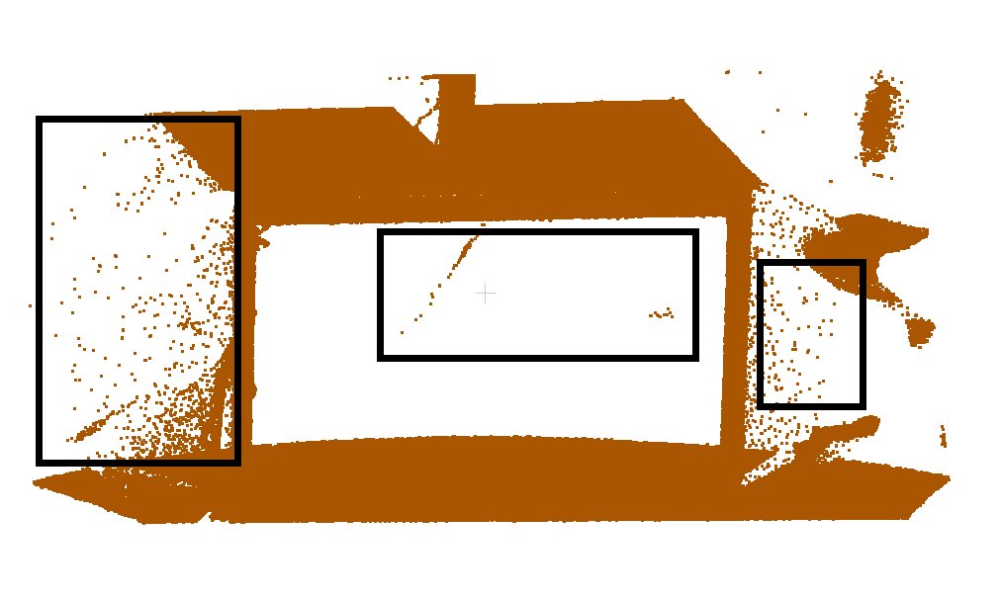

*Fig.2.1.34:   ROI 2*

According to **semantic segmentation**, this idea is also used when we want to segment the point cloud into small individuals. Point cloud processing is essentially the same as the processing of 2D images. Many of the problems of 2D are the same as those of 3D, but the specific processing methods are different. 2D images also have semantic segmentation, aiming to understand the image and divide the image into semantic regions. Such as, given a photo, as shown in Fig.2.1.35, the machine should be able to label cars, buildings, trees, and other objects in different colors after judging:


*Fig.2.1.35:   2D semantic segmentation[^7]*

Similarly, 3D semantic segmentation is the same. We are aiming to understand a 3D scene and divide it into different regions, according to semantics.

As shown in Fig.2.1.36, it is a schematic diagram of the semantic segmentation with many 3D geometries. Different parts are marked with different colors: For the chair in the upper left corner, the back, seat, and leg are marked with purple, blue, and green, respectively.


*Fig.2.1.36:   3D semantic segmentation[^8]*

The point cloud is a crucial way of expressing 3-dimensional objects also to realize semantic segmentation. Fig.2.1.37 is a schematic diagram of the semantic segmentation of a 3D point cloud. The bridge body is divided into different parts (represented by different colors).

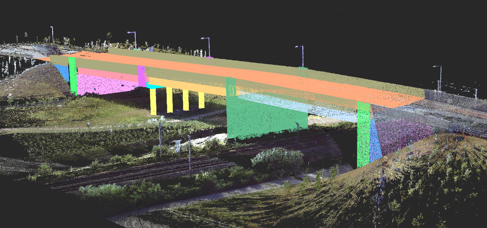

*Fig.2.1.37:   Semantic segmentation*

How to use CloudCompare for point cloud cutting?

##### Approach 1: Cross section

This approach is mainly used for large area trimming of point clouds. Take **bridge.bin** as an example.

First import **bridge.bin** into CloudCompare, click "**bridge**" under **DB Tree**, and select the point cloud file we want to cut. Then click **Cross Section**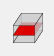, we can see that some colorful 3-dimensional arrows frame the geometry. Rotate the point cloud to see the views from various angles. As shown in Fig.2.1.38:


*Fig.2.1.38:   Cross Section*

We see some roads, trees, and other **non-ROI** areas around the bridge's main body, so we want to use a large site of cutting to delete these irrelevant scenes. The operation is as follows:


*Fig.2.1.39:   Cross Section processing*

By dragging these colored 3D arrows, part of the point cloud can be trimmed neatly.

First, perform step 1 and step 2 to drag the arrow operation. Then click **Export selection as a new cloud** in the red box of step 3. The **bridge.section** in DB Tree is the point cloud file after cutting. We can see that the result point cloud is relatively clean.


##### Approach 2: Segment

For the **bridge.section** after large-area trimming using approach 1. If our ROI at this time is one of the bridge piers, then you can use **Approach 2: Segment** to get, the operation is as follows:

Firstly, click on "**bridge.section**" under **DB Tree**, select the point cloud file we want to segment. Secondly, click on the scissors icon . Thirdly, click the left mouse button multiple times to frame the part you want to cut. Finally click the right mouse button to fix the shape you are framed (Such as the green polygon in the enlarged view in step 1 of Fig.2.1.40). 

After selecting **Segment In** or **Segment Out**, click **Confirm segmentation**, two files will appear in the DB Tree: the segmented file  *.segmented and the remaining file *. remaining.

In Fig.2.1.40, we cut twice:

Step 2 first get **bridge.section.remaining** and **bridge.section.segmented**;

Step 5 is for **bridge.section.segmented**, so get **bridge.section.segmented.remaining** and **bridge.section.segmented. segmented**:


*Fig.2.1.40:   Segment processing*

> NB1: Segment often takes many times to cut out the part we want to divide, as shown in Fig.2.1.40 above. It cuts twice.
>
> - **Segment in** means that the part in the current green box is used as the segmented part, which is the *.segmented file; and the file outside the green box is the reserved file, which is the *.remaining file;
>- **Segment out** means that the part in the current green box is used as the reserved part, which is the *.remaining file; and the file outside the green box is the segmented file, which is the *.segmented file;
> 
>The following figure is a simple *.remaining and *.segmented example. Take **bridge_pier.pcd** as an example:
> 
>
> 
>Fig.2.1.41:   *.remaining and *.segmented
> 
>Here we click on **Segment in**, so the green box is used as the cut point cloud, and the green box outside is the reserved point cloud. That is, **bridge_pier.remaining** corresponds to the remaining right half of the point cloud, and **bridge_pier.segmented** corresponds to the upper left corner of the point cloud framed by the green frame.
> 
>NB2: If we crop multiple times, a very long file name will be generated. ***. segmented. segmented. segmented. segmented... Reminder, this is not recommended. If there are too many cropping operations, the software will easily crash. So it is best to save the intermediate file and then reopen the intermediate file to continue cutting.

For the above two approaches, approach 1 is suitable for large area trimming, and approach 2 is ideal for fine trimming. In terms of frequency of use, approach 2 is more used and more practical.


##### Supplementary: Rotate and translate to change point cloud coordinates

> An application scenario corresponding to this requirement is as follows: Rotate point cloud coordinates
>
> **The coordinate system is the local coordinate system of the red cuboid**
>
> Take **cuboid.pcd** as an example (see in "files" folder):
>
> 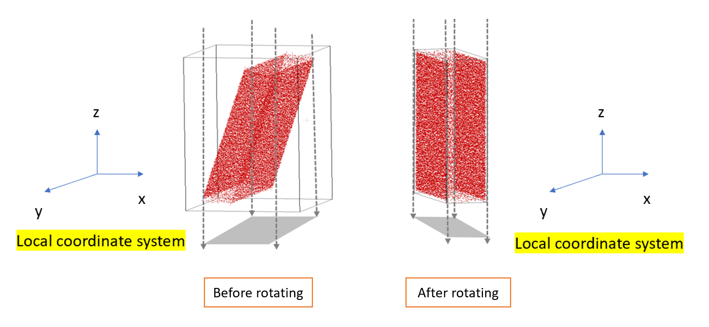
>
> *Fig.2.1.42:   Rotate point cloud coordinates*
>
> Suppose we want to select the xy projection plane in the red cuboid's local coordinate system in Fig.2.1.42 for research. In that case, the vertical projection area (a gray area) before **rotated coordinates** is larger than the vertical projection area after **rotation**, and the two shapes are different. **Before rotation**, the shape of the xy projection surface has changed, which cannot reflect the red cuboid's real structure.
>
> NB: Don't confuse the rotation and translation coordinates here with the rotation and translation of the point cloud view in CloudCompare that we introduced earlier. The rotation and translation introduced in Section 2-1-2 refer to the **relative coordinates** of the point cloud displayed on the canvas for viewing convenience. It can also be understood that it is in the rotating coordinate system. But the coordinates of each point in these point clouds have not changed. And our rotation and translation here are changing the **absolute coordinates** of the point cloud. So after this change, the coordinates of each point in the point cloud will be changed accordingly.
>
> The following describes the operation of changing coordinates: **Select point cloud → icon** 
>
> 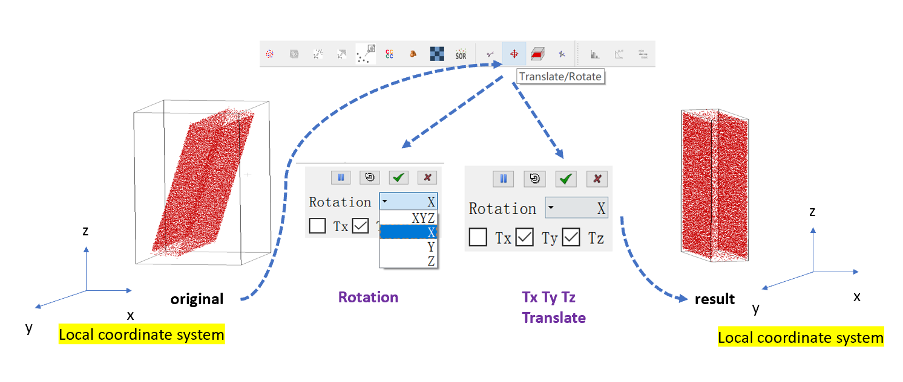
>
> *Fig.2.1.43: Change coordinate operation*                                                                   
>
> Among them, the drop-down box behind Rotation can choose to rotate the coordinates around the three axes of XYZ or the X or Y or Z axis. About Tx, Ty, Tz, we can select any one or two of them or select all, which means that the coordinate can be translated along the chosen axis. The axis directions that are not selected in the two operations cannot be rotated or translated.


#### 2-1-6：Downsampling

Chapter 1 mentioned: The process of acquiring point cloud data by scanning is **sampling** the object surface.

Subsequent point cloud processing can change and adjust the original sampling. There are many operations, which can be roughly divided into **down (sub) sampling, resampling**, and **upsampling**.

- **Down (sub) sampling**: Reduce the number of original point clouds so that the result point cloud of downsampling is a subset of the original point cloud;
- **Resampling**: This operation may change the structural information of the original point cloud. The result of the resampling point cloud is not necessarily a subset of the original point cloud;
- **Upsampling**: As opposed to down (sub) sampling, increasing the number of the original point cloud so that the result point cloud of upsampling has more points than the original point cloud.

Here we focus on downsampling. We will introduce resampling in Section 2-1-7.

**Downsampling** is a critical step in the process of the processing point cloud. Sometimes the point cloud file we get is huge. For example, a real bridge point cloud will have 2G to 3G. If we use this file to perform experiments or develop algorithms, it will significantly reduce efficiency. Therefore, we can choose to downsample to reduce the number of points in the point cloud and facilitate processing.

Downsampling is essentially a process from more to less, and the final point cloud is a subset of the original point cloud. The coordinates and colors of the points obtained by downsampling still correspond to their information in the original point cloud, as shown in Fig.2.1.44:

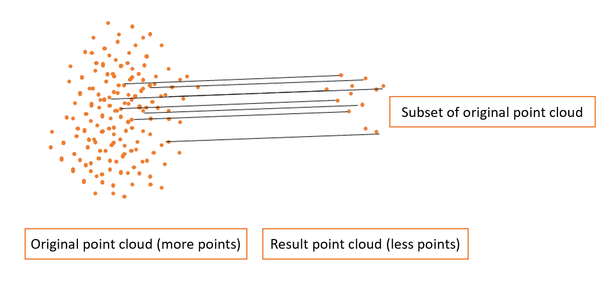

*Fig.2.1.44:   Principle of Downsampling*

Here we first look at how to perform point cloud downsampling in CloudCompare. We still use a bridge pier to explain. Drag **bridge_pier.pcd** (see in "files"  folder) into CloudCompare, then select **bridge_pier.pcd**. Finally, select the **Subsample a point cloud** icon in Fig.2.1.45 .

CloudCompare provides three downsampling methods: Random, Space, Octree. Now we introduce these three downsampling methods, respectively:


##### Random

In random downsampling, we need to set the number of reserved points. Such as **remaining points** in Fig.2.1.45: 10000.

In Fig.2.1.45, the left is the original point cloud containing 55630 points, and the right is the point cloud with 10,000 points after downsampling. We can see that the file on the right is obviously sparse:

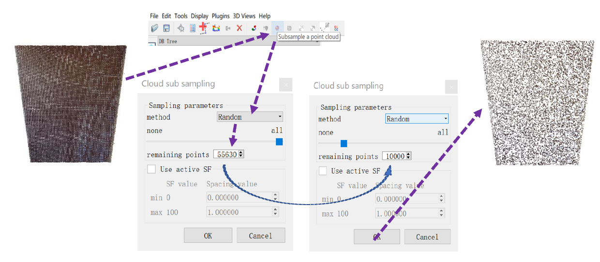

*Fig.2.1.45:   Random downsampling*

**Advantage:** Random downsampling principle is simple. Just set the number of reserved points to select points as the left downsampling result point cloud randomly;

**Disadvantage:** Random downsampling has no focus. Randomly select the entire point cloud so that important information may be lost.


##### Space

Space downsampling is based on **distance**. What we need to set is the minimum distance between points. That is, in the red box in Fig.2.1.46, we set **min. space between points** to 0.1 (unit: m) —— the minimum distance between points is 0.1m (The order of magnitude setting of this parameter can refer to the size range of Bounding Box). The distance between any two points in the downsampling result point cloud must be greater than or equal to 0.1. The left side of the figure below is the original point cloud, and the right side is the point cloud after downsampling by Space:

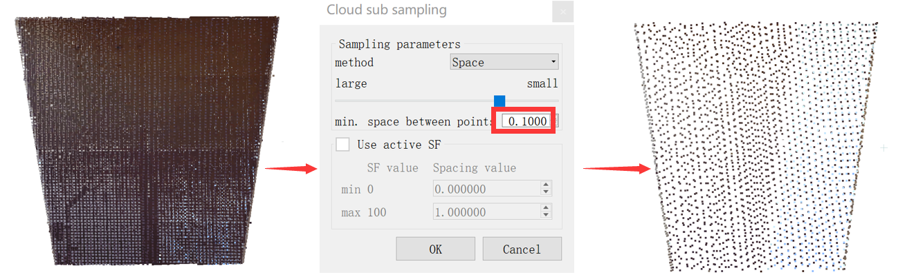

*Fig.2.1.46:   Space downsampling*

**Use active SF**

Space also has an optional box **Use active SF**. SF is Scalar Field. There are many Scalar Fields in the point cloud, such as curvature, confidence, etc. We can set the space distance according to the value of these Scalar Fields instead of setting the same distance for the entire point cloud.

> NB: Only when the point cloud itself contains Scalar Field information, the Use active SF in Space downsampling can be executed. Otherwise, the button is gray. For example, **bridge_pier.pcd** does not collect Scalar Field information, so using active SF is gray and cannot be executed when selecting space downsampling.

The most intuitive example is to set different distance thresholds according to different curvatures. Curvature, generally speaking, is the degree of bending. Some point cloud surface textures are involved, such as sculptures or other objects with uneven surfaces, and the curvature of these areas will be larger than other relatively flat surfaces. The area with large curvature means that it contains richer geometric information. The flat surfaces can be described by a few points or only three points (such as a plane).
In contrast, the more complex and rugged surfaces need more points to describe their geometric properties. In other words, the curvature can be used as an indicator to distinguish the geometric complexity of a surface. The smaller the curvature, the flatter the surface represented by the point cloud, and the lower the geometric complexity. On the contrary, the greater the curvature, the greater the degree of change of the surface represented by the point cloud, the more rugged, and the higher the geometric complexity.
Here are two examples to illustrate Use active SF, where SF is curvature:

***Example 1：***

If the Scalar Field in our file is curvature, then the SF value in FIg.2.1.47 is the curvature value. Spacing value is the minimum distance threshold between the two points corresponding to curvature (unit: m). The setting of Spacing value can refer to the size range of the geometry Bounding Box:

- The distance threshold of the part with large curvature is small: when the SF value is 10.7988 in the figure below, the Spacing value is set to the smaller 0.1;
- The distance threshold of the part with small curvature is large: when the SF value is 1.624 in the figure below, the Spacing value is set to the larger 10;

This can achieve the effect of retaining more points on edge with large curvature and retaining fewer points on the plane with small curvature.

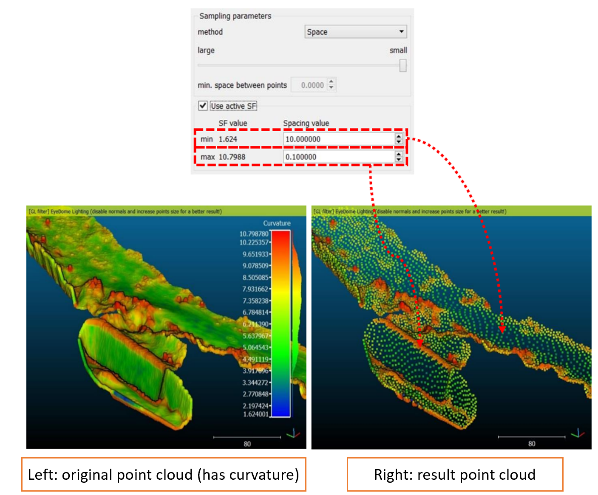

*Fig.2.1.47:   Use active SF example1 [^9]*

***Example 2：***

We use **cuboid_normal.pcd** (see in "files" folder) as the demonstration file, which has the SF curvature. As shown in Fig.2.1.48:


*Fig.2.1.48:   **cuboid_normal.pcd** internal information*

- The distance threshold for parts with small curvature is large: corresponding to the SF value of 1.10697e-5 in the figure below, the Spacing value is set to the larger 0.05;
- The distance threshold for parts with large curvature is small: corresponding to the SF value of 0.154106 in the figure below, the Spacing value is set to the smaller 0.0001;

In the end, an edge with large curvature retains more points, while a plane with small curvature retains fewer points, as shown in Fig.2.1.49:

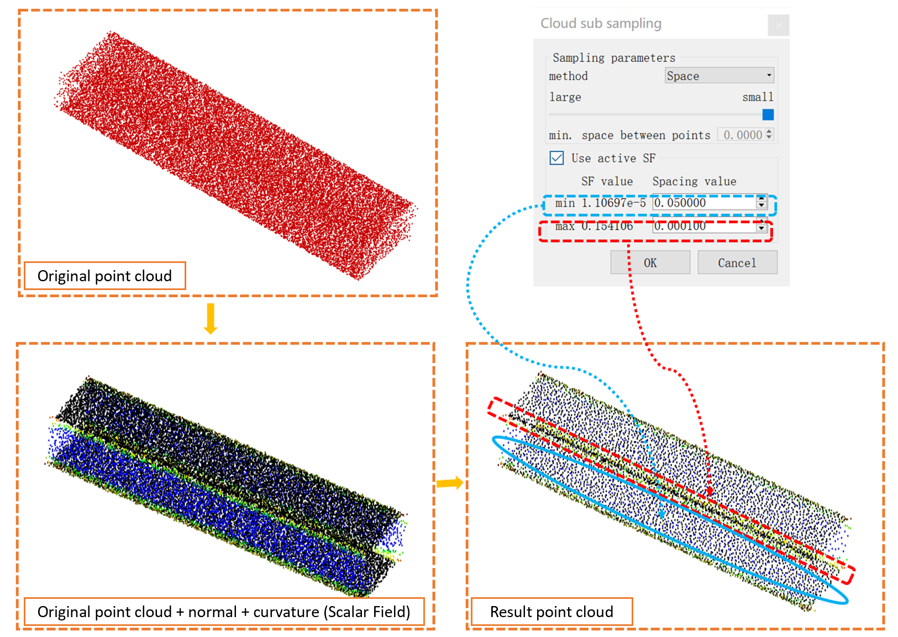

*Fig.2.1.49:   Use active SF example2*

> NB: **"Original point cloud + normal + curvature (Scalar Field)"** in Fig.2.1.49 shows curvature and normal information, as shown in Fig.2.1.50:
>
> 
>
> *Fig.2.1.50:   Curvature (Scalar Field) and normal*
>
> We check Normals in Properties and select Scalar Field for Colors (here Scalar Field is curvature).
>
> The reason why the two information is displayed is that normal must be calculated first to calculate curvature, which we will introduce in detail in Chapter 4.


##### Octree

Octree corresponds to "binary tree": 

Each node of the binary tree has up to 2 child nodes, and each node of the octree has up to 8 child nodes. The process of a continuous division of octree is essentially the process of constant equal division of small cubes, as shown in Fig.2.1.51. These small cubes are also called **"voxels."**

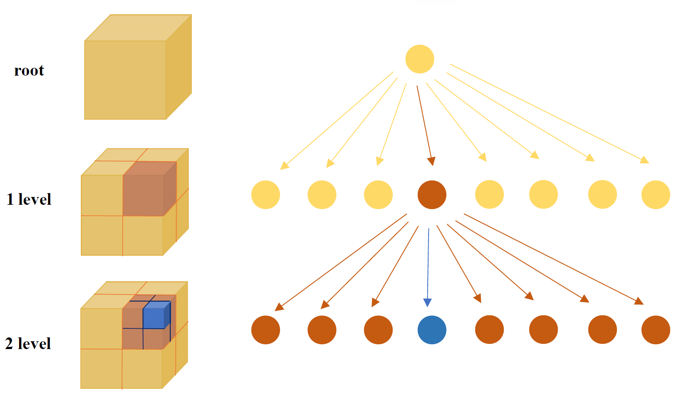

*Fig.2.1.51: Principles of Octree*

The number of cubes on the left side of Fig.2.1.51 corresponds to the number and colors of circles on each layer on the right.


*Fig.2.1.52:   level 1-5*

Fig.2.1.52 is a view of cubes with different levels. It can be seen that as the level increases, the number of cubes increases, and the side length of the small cubes decreases. In addition, some small cubes are eliminated during the sampling process because they do not contain any points in the original point cloud, as shown in Fig.2.1.53 below. Among them, the black point represents the original point, the red point is the geometric center point of each voxel, and the blue point is the reserved point.

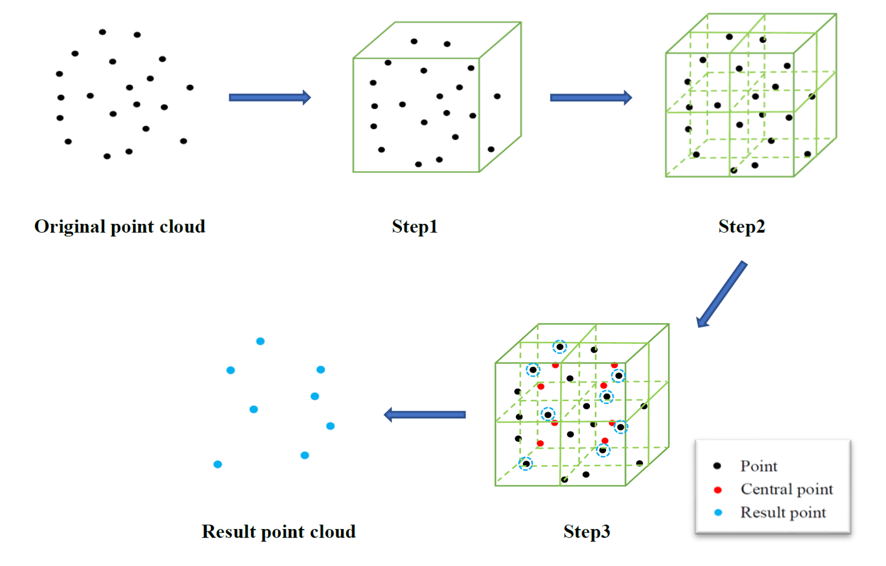

*Fig.2.1.53:   Octree processing*

Step explanation in Fig.2.1.53:

step1: Use a small cube to frame the original point cloud;

step2: Set the Octree level. Here level = 1. This setup divides the big cube into eight small cubes. If there is no point in a small cube, the cube is deleted. The eight small cubes divided by level 1 in Fig.2.1.53 all have points, so they are all kept and not deleted.

Finally, the **Result point cloud** containing eight points is obtained.


*Fig.2.1.54:   Octree downsampling*

Fig.2.1.54 is the downsampling after we set the Octree level in CloudCompare —— that is, where the  **subdivision level** is 5. The original point cloud is on the left, and the result point cloud is on the right. The higher the level, the finer the cube division and the more point cloud points obtained by downsampling.

> NB: Different versions of CloudCompare have different maximum subdivision level. The top-level for 64-bit computer systems is 21; the maximum value for 32-bit computer systems is 10.


#### 2-1-7：Resampling

In CloudCompare, Octree can be used for resampling. The idea of Octree downsampling and Octree resampling is the same. The difference is:

Octree resampling keeps the **center of gravity** of all points in each small cube after division, instead of the closest point to the center of the cube in each cube.

Reference link: [https://www.cloudcompare.org/doc/wiki/index.php?title=Octree%5CResample](https://www.cloudcompare.org/doc/wiki/index.php?title=Octree\Resample)

> NB: Octree resampling is to create a new point cloud that is different from the original one, so it may not retain the critical features of the original point cloud, such as color, normal, curvature, etc. If you want to keep this information, you can consider Octree downsampling.

The following demonstrates how to perform Octree resampling in CloudCompare, taking **rabbit.pcd** as an example:

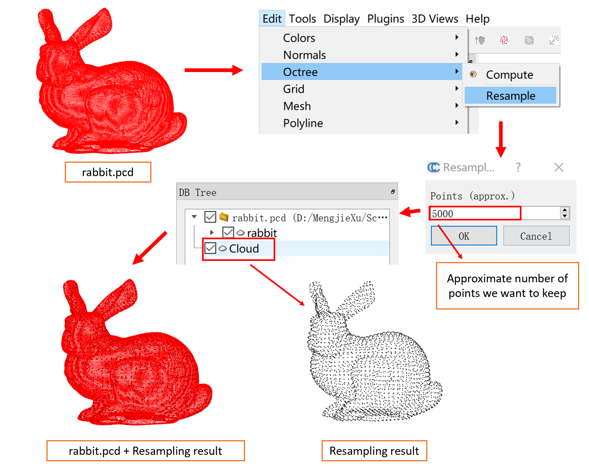

*Fig.2.1.55:   Octree resampling*

From Fig.2.1.55, we can see that the points of the resampling result (black) and the original point cloud (red) have many non-overlapping points. That is, the resampling result is not a subset of the original point cloud.


#### 2-1-8 ：Calculate distance

CloudCompare supports two types of distance calculation: Cloud-to-Cloud and Cloud-to-Mesh. As the name suggests, the former is the distance between two point clouds, and the latter is the distance between a point cloud and a mesh. This distance can often be used to judge the similarity or calculate the Euclidean distance between two files.

##### Cloud-to-Cloud Distance

The figure below shows the principle of Cloud-to-Cloud Distance calculation by CloudCompare. The default distance is to calculate the Euclidean distance between each point and the nearest point in another point cloud, that is, the nearest neighbor distance, as shown in Fig.2.1.56:

**nearest neighbor distance** learning link：https://en.wikipedia.org/wiki/Nearest_neighbor_search

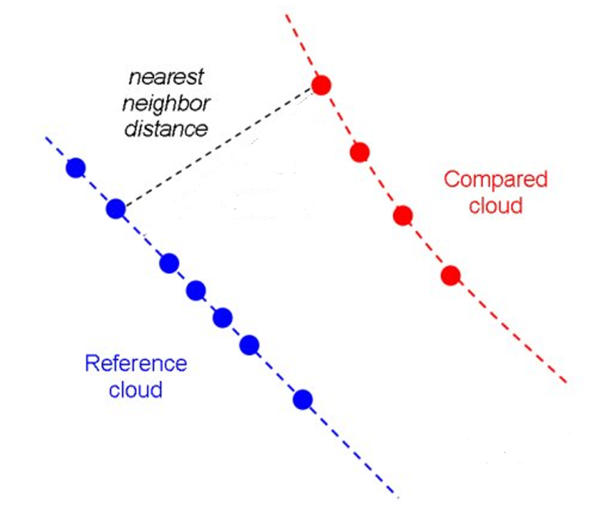

*Fig.2.1.56:   Cloud-to-Cloud Distance[^9]*

About Compared cloud and Reference cloud in Fig.2.1.56:

When we calculate the distance, we look for points in the Reference cloud closest to each point in the Compared cloud, calculate the distance between every two points, and then calculate the average of all distances to get the final Cloud -to-Cloud Distance.

We take the calculation of the distance between **rabbit1.pcd** and **rabbit2.pcd** (see in "files" folder) as an example. As shown in Fig.2.1.57:

> **rabbit1.pcd **obtains **rabbit2.pcd** after Octree resampling. They are similar but not the same.


*Fig.2.1.57:   **rabbit1.pcd** and **rabbit2.pcd***

Fig.2.1.58 is the calculation process of Cloud-to-Cloud distance: First, select two point cloud files (only two can be selected), and then operate according to the arrows. There are two ways to jump to the Choose role interface, namely way1 (Tools → Distances → Cloud/Cloud Dist.) and way2 (Click directly on the icon in the orange box 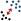) in the Fig.2.1.58. At the bottom of Fig.2.1.58 is the calculation result, where our parameters are set according to the default. It can be seen that the mean distance between **rabbit1.pcd** and **rabbit2.pcd** is 0.000473m, and the calculation time is 0.03s:

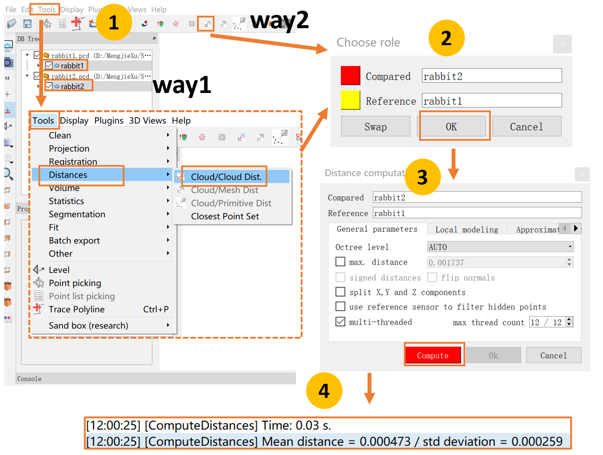

*Fig.2.1.58:   Cloud-to-Cloud* 

The following are some explanations about the step3 of Distance computation in Fig.2.1.58:


*Fig.2.1.59:   Distance computation explanation*

**1.   General parameters:**

*Octree level:* Octree is not only related to downsampling or resampling of the point cloud, but it is also one of the methods for searching for nearest neighbors in the point cloud (see in Chapter 4). The higher the Octree level, the finer the small cubes are divided. If the distance between points is too large when calculating the point cloud distance, it will take a lot of time to find these small cubes, so you can manually set a lower Octree level. But here, we can use the AUTO Octree level automatically generated by CloudCompare. In summary, the change of Octree level will not affect the distance result, only the running time;

*max. distance:* Sometimes, the point-to-point distance between point clouds may be considerable, so it takes a long time to search for the nearest neighbor. We can set a maximum distance threshold. So that when looking for the nearest neighbor, if the distance is greater than this threshold, it will not be calculated but directly replaced by the threshold, which can reduce the amount of calculation and speed up the operation;

**2.   Local modeling:**

*Local model:* All the options in this box are in the orange dotted box above Local modeling in the middle of Fig.2.1.59. If we choose the Local model to be "NONE," it means that we calculate the linear distance between each point in the Compared cloud and the closest point in the Reference cloud when calculating the distance. And when our point cloud contains holes or sparse areas, it may have problems when calculating the nearest neighbor distance:

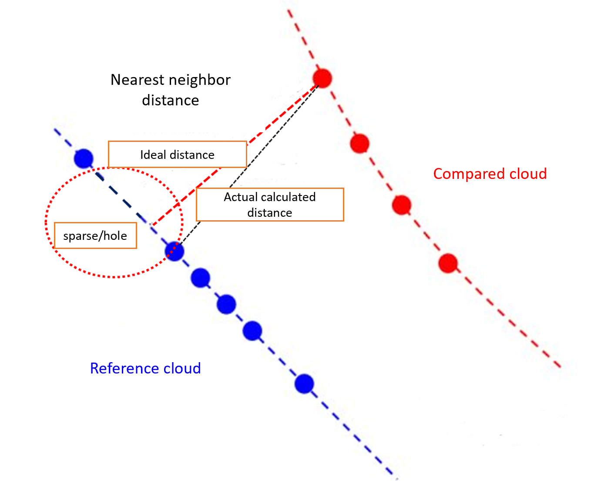

*Fig.2.1.60:   Local model: NONE*

Because there are holes/sparse areas in the Reference cloud, the calculated distance is longer than the actual distance when looking for the neighbors of the compared cloud's point.

If this situation is encountered, we need to fit the plane. At this time, the Local model can choose Least Square Plane or 2D1/2 Triangulation or Quadric. They are all algorithms for fitting planes, and we will not introduce them here. After fitting the plane, Cloud-to-Cloud Distance is converted to calculate the distance from a point in the Compared cloud to this plane in the Reference cloud.

The fitting plane needs to find the neighbors of these holes/sparse points in the Reference cloud. There are two methods:

- *Points (kNN):* Find the k closest points around the point as neighbor points;
- *Radius (Sphere):* Find all points in the sphere with a set radius as neighbor points;

After finding the nearest neighbors, there are several ways to fit the plane: Least Square Plane, 2D 1/2 Triangulation, Quadric.

> Given the above situation, Reference Cloud recommends choosing a point cloud with a higher density and fewer holes.

**3.   Approximate distances：**

This distance is an estimation performed by CloudCompare to set a reasonable Octree level automatically. It is best not to use it as the final distance result —— it is just a reference for setting the Octree level. The actual calculated distance is still to be obtained through the red button in Fig.2.1.58 **Compute**.

##### Cloud-to-Mesh Distance

Cloud-to-Mesh Distance refers to the distance between a point cloud and a mesh. The calculation principle is to calculate the distance between each point and the nearest triangle in the mesh, as shown in Fig.2.1.61:

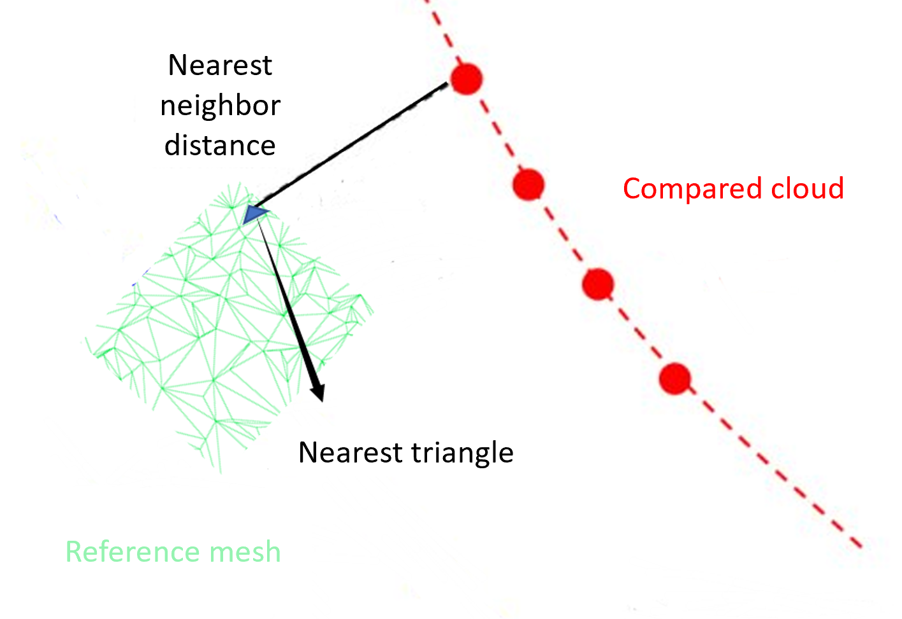

*Fig.2.1.61:   Cloud-to-Mesh Distance[^9]*

Fig.2.1.62 is the process of Cloud-to-Mesh Distance calculation in CloudCompare, taking **bottle2.pcd** (point cloud) and **bottle1.vtk** (mesh) as example files (see in "files" folder):

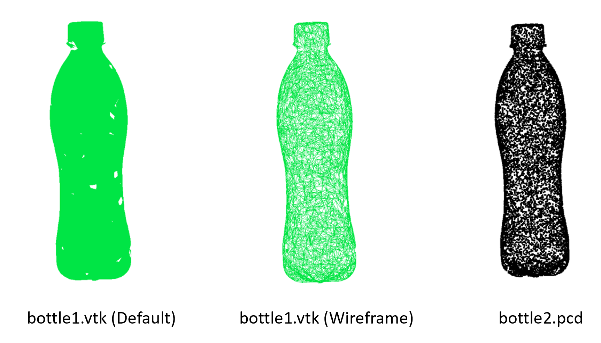

*Fig.2.1.62:   **bottle1.vtk** and **bottle2.pcd***

The operation is as follows: First, select two files and follow the arrows in the figure. There are two ways to jump to the Distance Computation interface: way1 (Tools → Distances → Cloud/Mesh Dist) and way2 (Click directly on the icon in the orange box 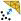). The calculation result is at the bottom of Fig.2.1.63. Here our parameters are set according to the default. It can be seen that the mean distance between **bottle2.pcd** (point cloud) and **bottle1.vtk** (mesh) is 0.000846m, and the calculation time is 0.10s:


*Fig.2.1.63:   Cloud-to-Mesh*

The following are some explanations about the step2 of Distance computation in Fig.2.1.63:

> To calculate Cloud-to-Mesh Distance, CloudCompare automatically uses mesh as Reference and cloud as Compared.


*Fig.2.1.64:   Distance computation explanation*

**1.   General parameters：**

*signed distances:* Whether to bring the normal direction of each triangle when calculating the distance;

*flip normals:* If signed distances are selected when calculating, and the triangle of the mesh needs to be reversed, for example, the order of the vertices forming a triangle changes, then you can select flip normals;

Others have the same meaning as "General parameters" in Cloud-to-Cloud.

**2.   Local modeling：**

Cloud-to-Mesh cannot activate this function.

**3.   Approximate distances：**

Consistent with Cloud-to-Cloud, it is mainly used to set the Octree level.


#### 2-1-9：Compute normal

Normal, like color and spatial coordinates, is an important feature or characteristic of the point cloud, that is, a vector perpendicular to the tangent plane, as shown in Fig.2.1.65:


*Fig.2.1.65:   Normal*

Normal can be applied in scenes such as point cloud rendering. Besides, computing normal is also the basis of algorithms such as triangulation. For related knowledge about normal, see Section 4-6-1.

In addition to computing the point cloud's normal, CloudCompare can also calculate the normal of the mesh file (mesh model) and convert the computed normal direction.


##### Compute point cloud normal

The following figure is a schematic diagram of the process of computing point cloud normals in CloudCompare, taking **rabbit.pcd** as an example:


*Fig.2.1.66:   the process of computing point cloud normals*                                                          

As shown in the figure above, select Edit → Normals → Compute and jump to the Compute normals box. There are two critical parameters in this box:

- **Local surface model:** The normal is computed based on the local surface. Here are three fitting models to estimate the normal: Plane, Quadric, and Triangulation. Here we choose Plane. Other methods will not be explained too much;
- **radius:** When fitting a plane, it is necessary to determine the size of the neighborhood of each point, where “radius” is the radius of the neighborhood that forms the local plane. If the radius is set too small, there may not be enough points to fit the plane. At this time, the normal will default to (0, 0, 1). If the setting is too large, there are too many neighbors, which will make the computation complicated;

After selecting the parameters, click **OK** to get the point cloud after computing the normal. At this time, the point cloud contains normal information displayed on the canvas, as shown in the figure below (multiple angles). The backlight is displayed in black, and the light is displayed in red:

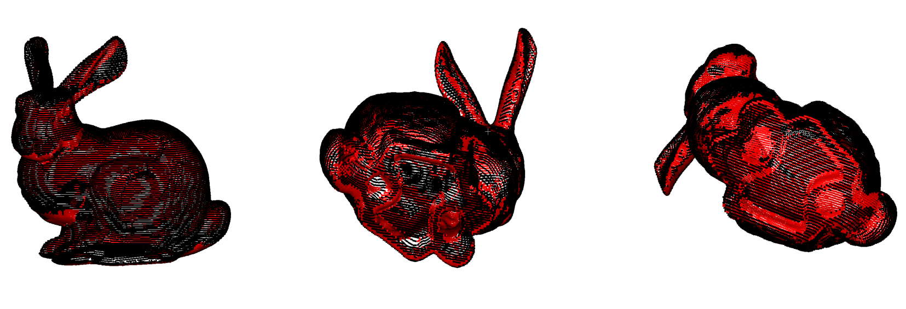

*Fig.2.1.67: The result after computing normal*


##### Compute mesh (vtk etc.) normal

There are two types of normals for mesh in CloudCompare: per-vertex and per-triangle. The following figure is a schematic diagram of computing the mesh normal, taking **bottle1.vtk** as an example:

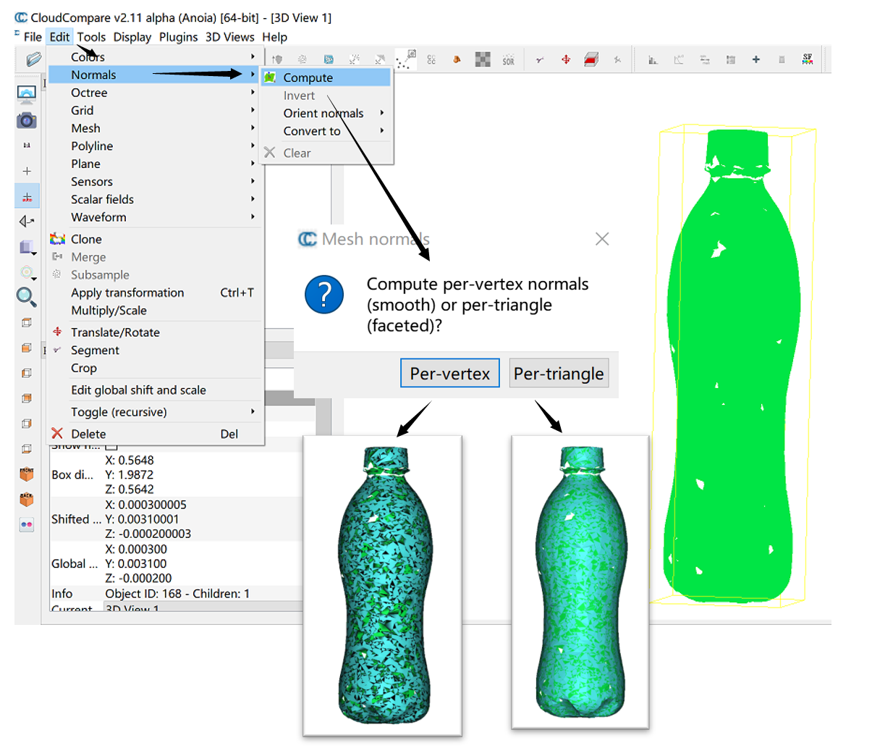

*Fig.2.1.68:   the process of computing mesh normals*                                                          

The operation of mesh normal computing is similar to that of point cloud —— Edit → Normals → Compute. The difference is that mesh pops up a selection box for Mesh normals. The two types are described below.

At the bottom of Fig.2.1.68, the Per-vertex result is on the left, and the Per-triangle consequence is on the right:

- **Per-vertex:** Compute the average normal of multiple triangles where the vertex (orange point) is located as the normal of the point:

  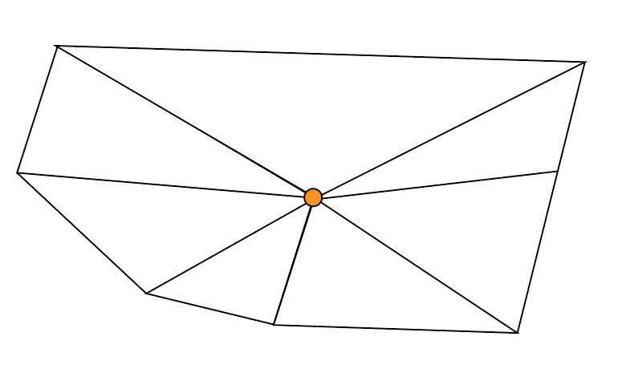

  *Fig.2.1.69:   Per-vertex*

- **Per-triangle:** Compute the normal of each triangle, which is the vector perpendicular to each triangle:

  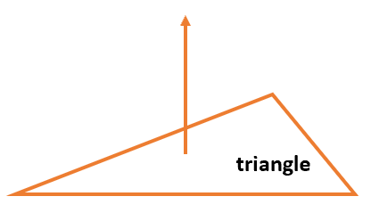

  *Fig.2.1.70:  Per-triangle*


##### Invert normal

The following operations can invert the direction of the normals. Taking the normal of a point cloud as an example, we can see that after the normal is inverted, the black part is swapped with the red part:

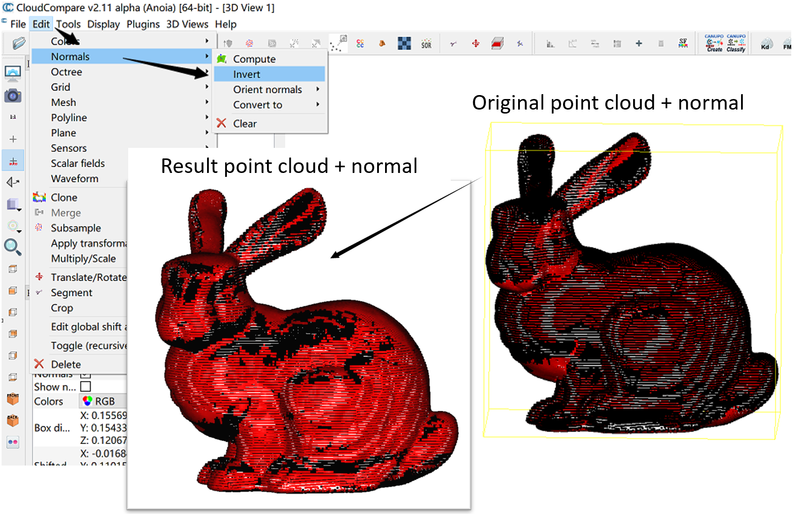

*Fig.2.1.71:   Invert normal*

What if we want to clear the computed normals?


##### Clear normal

If we want to eliminate the computed normal information, we can do the following:

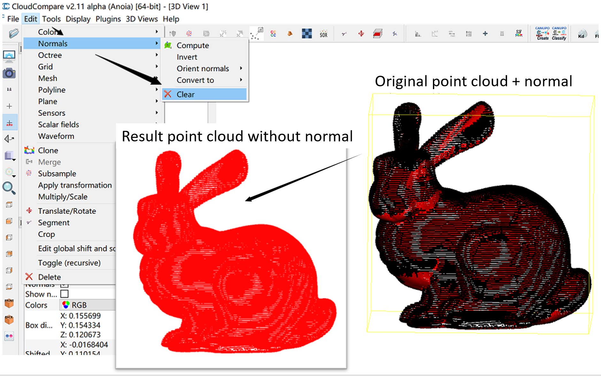

*Fig.2.1.72:   Clear normal*

We can see that the result point cloud has restored the original red point cloud state, and the previous normal information is no longer displayed.


#### 2-1-10：Generate primitives

When we are doing some preliminary experiments of algorithms, we may need some clean and straightforward primitives. In this case, we can generate virtual primitives through code or through software such as CloudCompare that comes with such a primitives generator.

**Primitive Factory** provides users with a simple method to automatically generate virtual geometric components (including planes, spheres, cylinders, etc.) by setting parameters in CloudCompare. The following is a simple example of this operation through the generation of spheres:

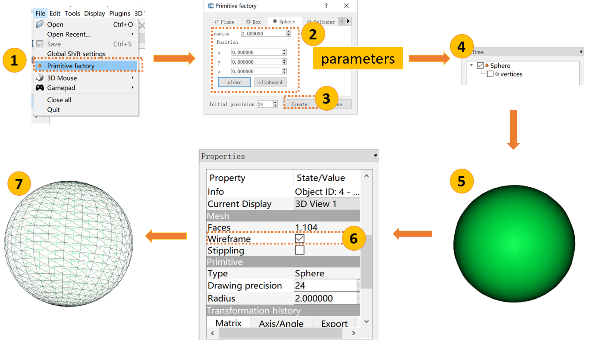

*Fig.2.1.73:   **Primitive Factory***

First, select **File → Primitive Factory**, the **Primitive Factory** box will pop up. In this box, there are several types of primitives: Plane, Box, Sphere, Cylinder, Cone, Torus, and Dish. After each primitive is selected, the parameters to be set will appear. After setting the parameters, click **Create**, and the newly created primitive appears in the **DB Tree** column of the CloudCompare interface. We can continue to click other primitive to generate until you click **Close** in the **Primitive Factory** box in this state. This creation process will end. Then a green ball is observed in the canvas, as shown in step5 in Fig.2.1.73. Click **Sphere** under **DB Tree**, check **Wireframe** in **Properties** to display its mesh structure, as shown in the result view of step7 in Fig.2.1.73.

> NB: The creation principles of other primitives are the same as above.


#### 2-1-11：Fit point cloud based on primitives

CloudCompare also has a vital function, but it is used less because the result is not robust enough. Here is a brief introduction:

Fit point cloud based on primitives: **primitive fitting** (**Plugins → RANSAC Shape Detection**)

The introduction of this function mainly leads to point cloud reconstruction. Point cloud reconstruction is to turn low-level points into higher-level geometric forms. For example, a mesh structure is a higher-level geometric form than points, and a higher-level form is primitive. CloudCompare uses the RANSAC algorithm to fit specified primitives in the target point cloud, including Plane, Sphere, Cylinder, Cone, Torus. In other words, given a point cloud, we can fit it into a plane/sphere/cylinder/cone/torus, as shown in the following figure:


*Fig.2.1.74:   Ransac Shape Detection*

We use a bridge pier **bridge_pier1.bin** as an example (see in "files" folder). The schematic diagram of the bridge pier is as follows:


*Fig.2.1.75:   **bridge_pier1.bin***

For the cylindrical bridge pier **bridge_pier1.bin**, we choose to fit it only with Cylinder.

Fig.2.1.76 is the operation process of using CloudCompare to realize this function:

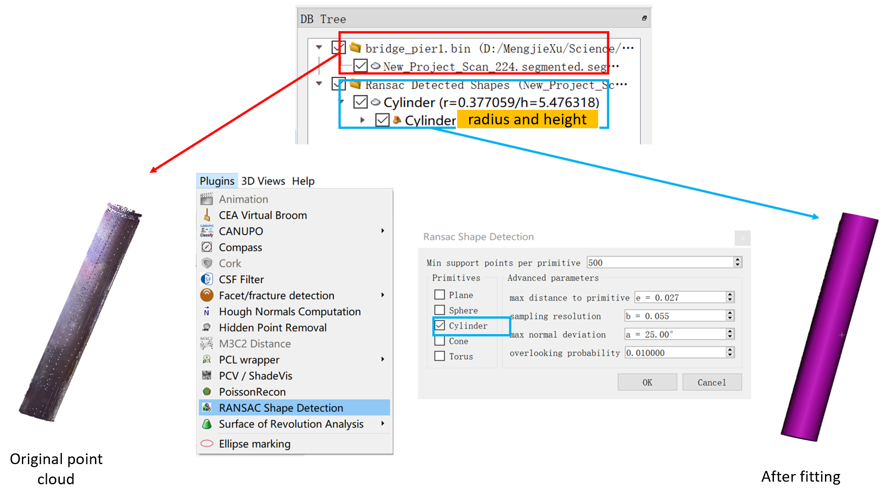

*Fig.2.1.76:   Fit point cloud based on primitives*

Fig.2.1.7 shows that the pier is fitted by a cylindrical primitive. And the information of its radius and height are displayed in the fitting result. These contents are significant for point cloud reconstruction.

However, this operation is not robust enough. If there is a lot of noise or other irrelevant points, or a point cloud containing many geometries, the result will be inaccurate. For example, below, we use the entire bridge **Bridge10.bin** to fit a variety of geometric bodies:

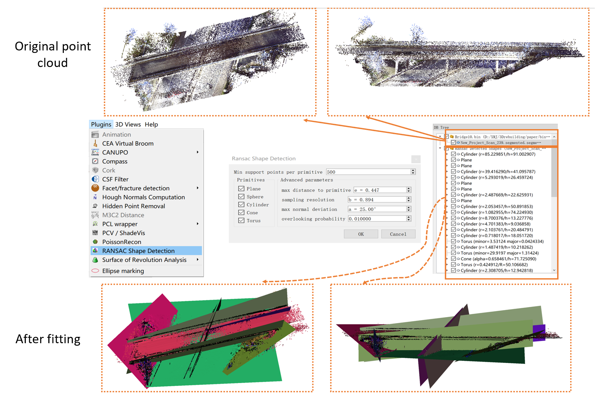

*Fig.2.1.77:   Fitting of the entire bridge*

Here we have checked all the primitives, and the final fitting result is not so ideal, which is far from the original bridge.


#### 2-1-12 ：Registration

Registration is an essential algorithm for the processing point cloud. It is to register or splice multiple point clouds of different local coordinate systems by finding the overlap with each other so that they appear in the same coordinate system. As shown in Fig.2.1.78, (a) and (b) are respectively the point cloud in the two local coordinate systems of the building. After registration, we get (c), that is, (a) and (b) are joined together to form a point cloud of a complete building in a coordinate system:


*Fig.2.1.78:   Registration[^10]*

The well-known algorithm for registering point clouds is Iterative Closest Point (ICP) (which will be introduced in Chapter4). Here is how to implement a simple ICP algorithm in CloudCompare:

##### Prepare for Registration

First, two point clouds in different local coordinate systems are needed, as shown in Fig.2.1.79: Purple point cloud **bunny1.pcd** and blue point cloud **bunny2.pcd** (see in "files" folder).

The registration goal is to register **bunny1.pcd** and **bunny2.pcd**, that is, to stitch these two rabbits into a rabbit in a coordinate system. These two rabbits each lack a part of the structure —**bunny1.pcd** lacks a tail, **bunny2.pcd** lacks ears, as shown below. The essence of their registration is to find the overlap between the two and merge them into one.

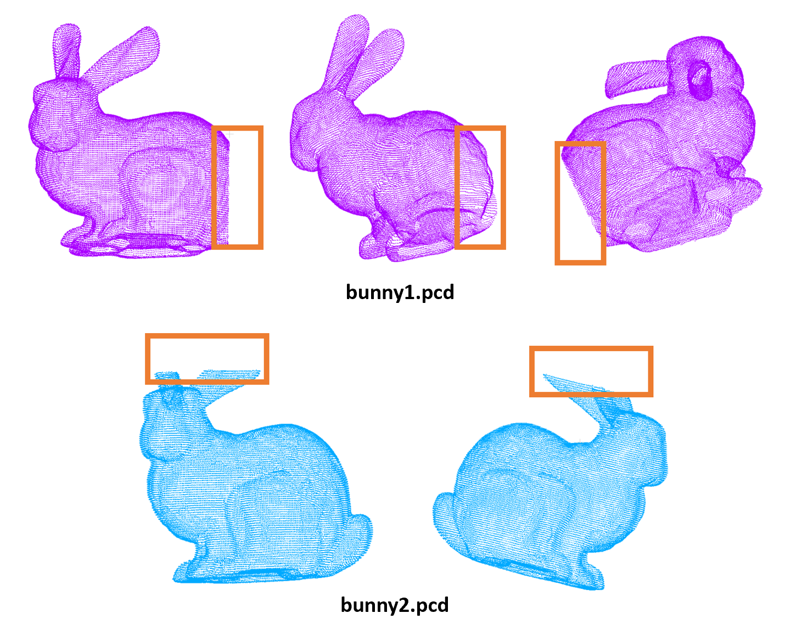

*Fig.2.1.79:   **bunny1.pcd** and **bunny2.pcd***

##### Registration

As shown in Fig.2.1.80, select **bunny1.pcd** and **bunny2.pcd** simultaneously (After selecting a point cloud, press ctrl, and then select another point cloud). Click Tools → Registration → Fine registration (ICP). According to the pop-up box, we can see that **bunny2.pcd** is the target point cloud that we want to register or align with, **bunny1.pcd** is the source point cloud (We can exchange them via swap). After calculation (all the parameters are default), a rigid transformation matrix is obtained. That is, according to this matrix, **bunny1.pcd** can be registered to **bunny2.pcd**:

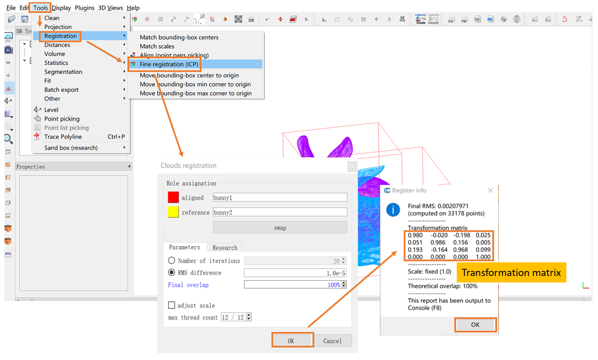

*Fig.2.1.80:   ICP in CloudCompare*

##### Result of Registration

Fig.2.1.81 is the result of registration, which shows the registration result and **bunny2.pcd** at the same time. The two are indistinguishable. Blue and purple inclusions are vaguely seen. This indicates that **bunny1.pcd** has a higher degree of overlap with **bunny2.pcd** after registration. That is, the registration effect is better, and a complete rabbit has been restored:

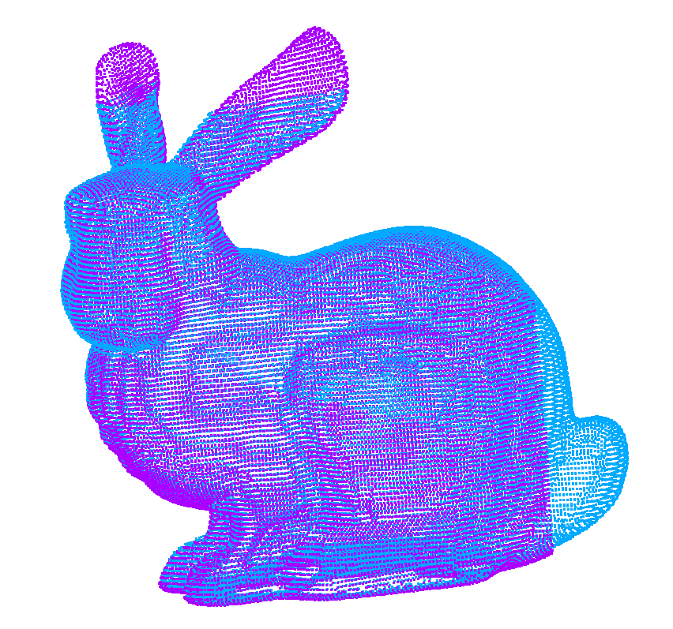

*Fig.2.1.81:   Result of Registration*


#### 2-1-13：Merge multiple point clouds

Merge multiple point clouds means to combine two or more independent point clouds into a new point cloud. Here we merge two point clouds. The sample files are **bottleright.pcd** and **bottleleft.pcd** (see in "files" folder). Fig.2.1.82 shows the views of the two files:


*Fig.2.1.82:   **bottleright.pcd** and **bottleleft.pcd*** 

To merge the two into a whole bottle, you need to use the merge point cloud function button in CloudCompare 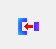. In the red box, as shown in the figure below, first select the point cloud files to be merged (two or more files) at the same time, and then click the merge function button.


*Fig.2.1.83:   Merge point clouds*

The following pop-up box pops up. We choose No —— Scalar Field is not generated:


*Fig.2.1.84:   pop-up box*

The merge process has been completed, the original two files have been deleted, and only the newly generated merge result file **bottleright.pcd** is left. In order not to overlap with the original file name and cause confusion, you can save the file as **bottleresult.pcd**. Fig.2.1.85 shows the merged result:

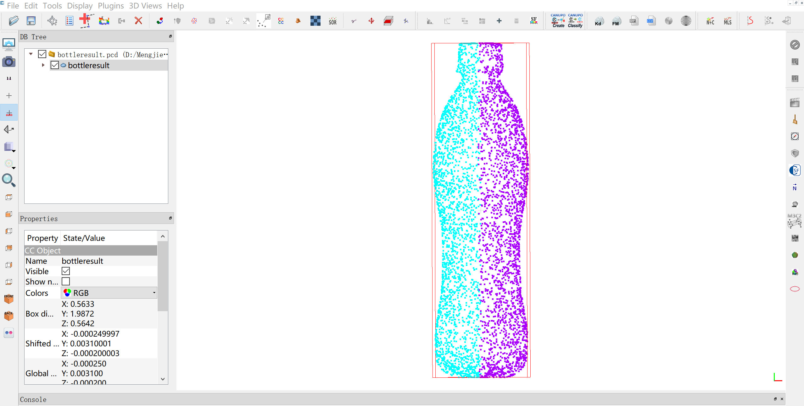

*Fig.2.1.85:   Result of merge*

It can be seen that the merged result retains the respective color information of the two parts and combines the original independent two files.

> We introduce these basic operations of CloudCompare. CloudCompare also has many other functions, which are not presented here. The content already introduced is sufficient to support basic point cloud pre-processing. Readers who want to continue to explore can learn independently according to the link given in the first section!


### 2-2 ：MeshLab

MeshLab is also an open-source 3D processing software convenient for users to supplement and extend the software. This software mainly deals with point cloud and mesh. It provides tools for editing, cleaning, inspecting, and rendering meshes. MeshLab is very powerful. This chapter selects some of the basic operations to show you. Start a hands-on operation!

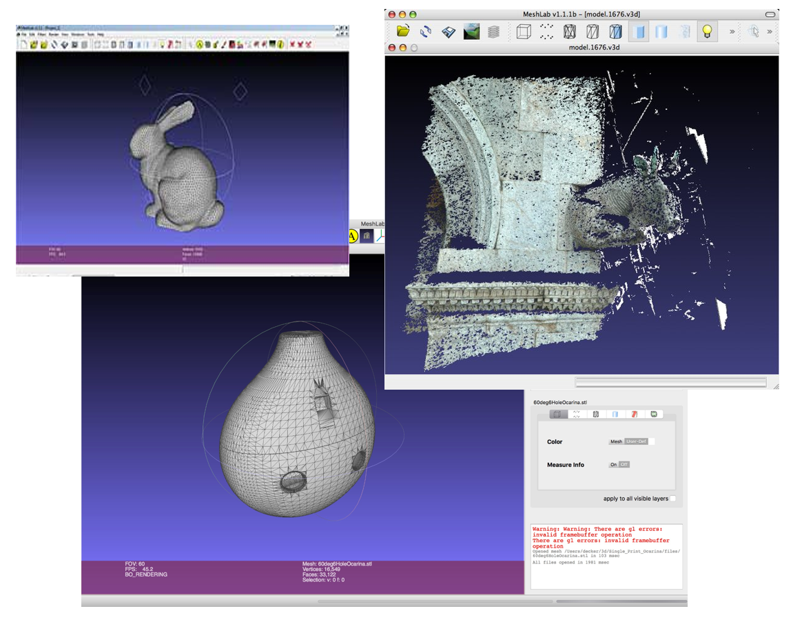                

*Fig.2.2:   MeshLab interface[^11][^12][^13]*


#### 2-2-1：Download and install

Download link：http://www.meshlab.net/#download

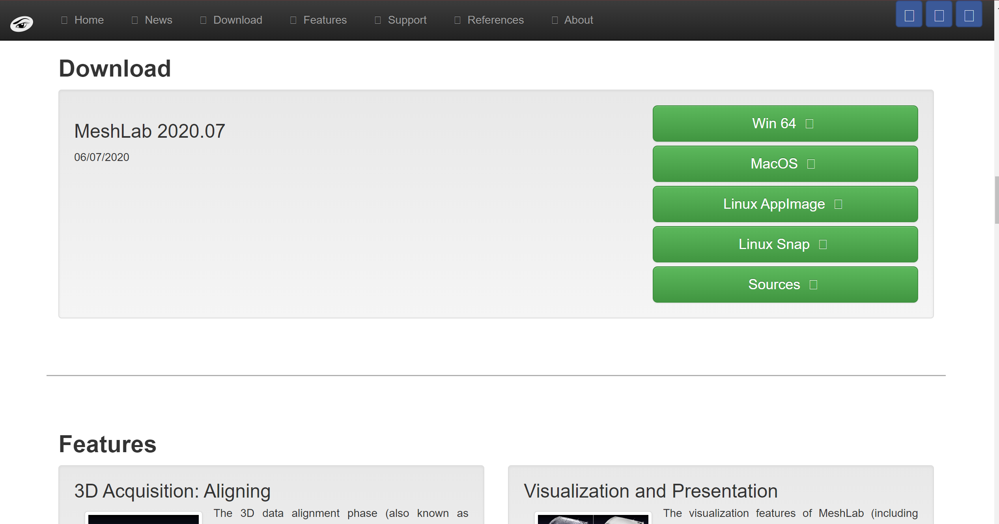

*Fig.2.2.1:    Download MeshLab*

Select the exe file corresponding to our computer system to download and install. After installation, the following interface will be displayed:

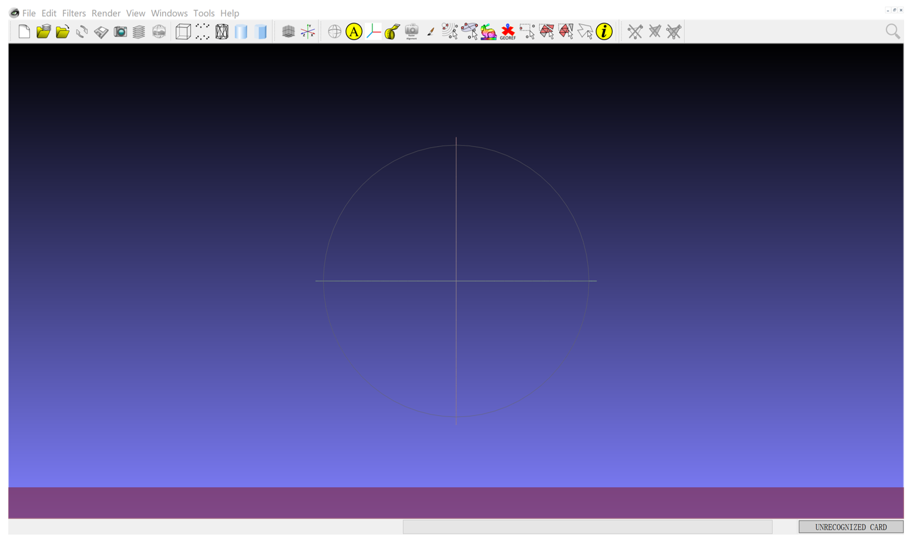

*Fig.2.2.2:   MeshLab initial interface*

Here are a few small tools to assist us in learning:

- MeshLab source code:

  👉 https://github.com/cnr-isti-vclab/meshlab/releases

- The following link intuitively introduces the basic operations of MeshLab in YouTube:

  👉 **Basics：**https://www.youtube.com/playlist?list=PL8B1E816EAE236B4D

  👉 **Features**：https://www.youtube.com/playlist?list=PL60mCsep96JcJz_SIfXblsVmI1TYMsQJc

  👉 **3D Scanning pipeline：**https://www.youtube.com/playlist?list=PL53FAE3EB5734126E

  👉 **Cleaning：**https://www.youtube.com/playlist?list=PLBBF41579E4B65566

- MeshLab tutorial:

  👉 http://www.heritagedoc.pt/doc/Meshlab_Tutorial_iitd.pdf

The explanation of MeshLab mainly takes the mesh model (both point information and topological information).

Let us explore MeshLab together!


#### 2-2-2：Background color setting

The background color of MeshLab is gradient purple by default. As in CloudCompare, we can set different background colors to facilitate our view:


*Fig.2.2.3:   Background color setting in MeshLab*

As shown in Fig.2.2.3:

- 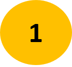 is the default color —— gradient purple;
-  select "Tools → Options...";
-  is the pop-up box after clicking "Options." The selection box includes many settings of the software itself, here we only look at the first two: backgroundBotColor and backgroundTopColor. They are to set the color of the bottom half of the background and the color of the top half of the background. Double-click the orange dashed box and the blue dashed box in  respectively, corresponding to settings  and .  Click the purple area, a color selection box pops up, select white, and click Save and Close in turn.  Click the black area, the color selection box pops up, select white, and click Save and Close in turn;
-  We can see that both backgroundBotColor and backgroundTopColor have become white, then click Close;
-  That is to set the background to a pure white result view.

Here we set the background to pure white, and the subsequent operations will be displayed on the pure white background. Readers can set the background color for convenient viewing.

> NB: The trackball in the view can be canceled, as shown below:


*Fig.2.2.4:   Cancel Trackball*


#### 2-2-3：Open

To use MeshLab for file operations, we first need to open the file we want to process in MeshLab, importing our files into MeshLab.

There are two approaches to open a file in MeshLab. Take **bunny.ply** as an example (see in "files" folder), **bunny.ply** is a file that already contains mesh. We can also use CloudCompare to convert a point cloud file into .ply format (see in Section 2-2-4).

##### Open file in MeshLab

**Approach 1:** Drag the ply file directly into the canvas on the left side of MeshLab, as shown in Fig.2.2.5:


*Fig.2.2.5:   Approach 1*

**Approach 2**: Open the ply file corresponding to the path through the **Import Mesh** icon , as shown in Fig.2.2.6:

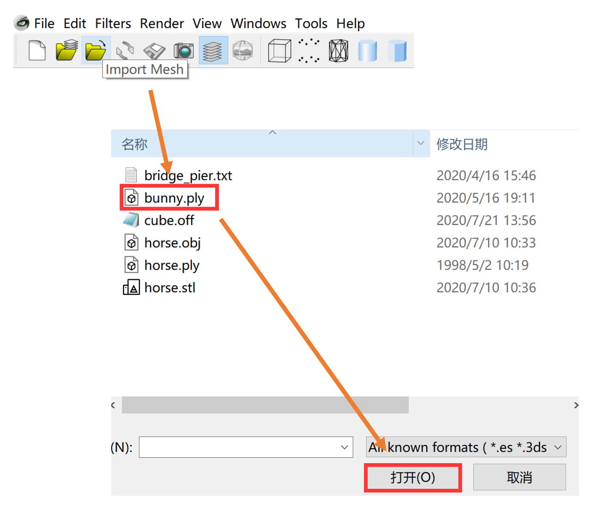

*Fig.2.2.6:   Approach 2*

Through the above two operation approaches, we can see the view of **bunny.ply** in MeshLab, as shown in Fig.2.2.7 (select to display the mesh model "wireframe"):

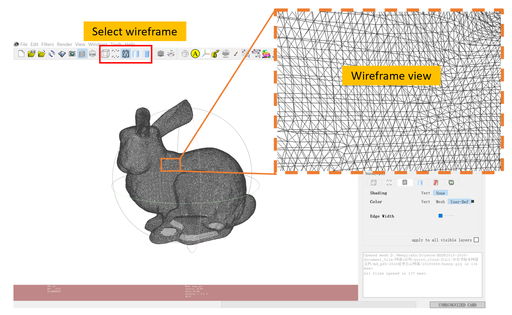

*Fig.2.2.7:   **bunny.ply** (wireframe)*

After zooming in the orange dotted frame, we can see that the file's view is no longer scattered points but a mesh structure. This is because, except for the point information, the ply file also contains topological relationships.

##### Topological relationship

The topological relationship means that the points are connected to form a line, the line is connected to form a surface, and the surface is then formed into a body. The primary topological relationships are shown in the following figure:


 *Fig.2.2.8:   Topological relationships[^14]*


##### Files that can be opened in CloudCompare

- **mesh:**

| File Format                       | Suffixes | File Format                               | Suffixes |
| --------------------------------- | -------- | ----------------------------------------- | -------- |
| *Eisen Script File*               | *.es     | *OpenCTM compressed format*               | *.ctm    |
| *3D-Studio File Format*           | *.3ds    | *Expe's point set(binary)*                | *.pts    |
| *Stanford Polygon File Format*    | *.ply    | *Expe's point set(ascii)*                 | *.apts   |
| *STL File Format*                 | *.stl    | *XYZ Point Cloud(with or without normal)* | *.xyz    |
| *Alias Wavefront Object*          | *.obj    | *Protein Data Bank*                       | *.pdb    |
| *Quad Object*                     | *.qobj   | *TRI(photogrammetric reconstructions)*    | *.tri    |
| *Object File Format*              | *.off    | *ASC(ascii triples of points)*            | *.asc    |
| *PTX File Format*                 | *.ptx    | *TXT(Generic ASCII point list)*           | *.txt    |
| *VCG Dump File Format*            | *.vmi    | *X3D File Format - XML encoding*          | *.x3d    |
| *FBX Autodesk Interchange Format* | *.fbx    | *X3D File Format - VRML encoding*         | *.x3dv   |
| *Breuckmann File Format*          | *.bre    | *VRML 2.0 File Format*                    | *.wrl    |
| *Collada File Format*             | *.dae    |                                           |          |

- **project:**

| Project Format           | Suffixes | Project Format     | Suffixes |
| ------------------------ | -------- | ------------------ | -------- |
| *MeshLab Project*        | *.mlp    | *Bundler Output*   | *.out    |
| *MeshLab Binary Project* | *.mlb    | *VisualSFM Output* | *.nvm    |
| *Align Project*          | *.aln    |                    |          |

- **raster:**

| Raster (Suffixes) |
| :---------------: |
|       *.jpg       |
|       *.png       |
|       *.xpm       |


#### 2-2-4：Mesh point cloud

The **bunny.ply** that we opened in the previous section contains mesh information so that we can see the mesh structure (wireframe). Nevertheless, if it is a ply file containing only point information, we need to operate it in MeshLab to generate its mesh information manually —— that is, mesh point cloud.

Take **bridge.bin** as an example. The file contains too many points, and it takes too long to mesh. Let us select some of the structures for experiments:

##### step1

Open the **bridge.bin** in CloudCompare, select the part of the bridge structure and downsample according to what we have learned in CloudComapre before, save it as a ply file, and get the **bridge_downsample.ply** (see in "files" folder).

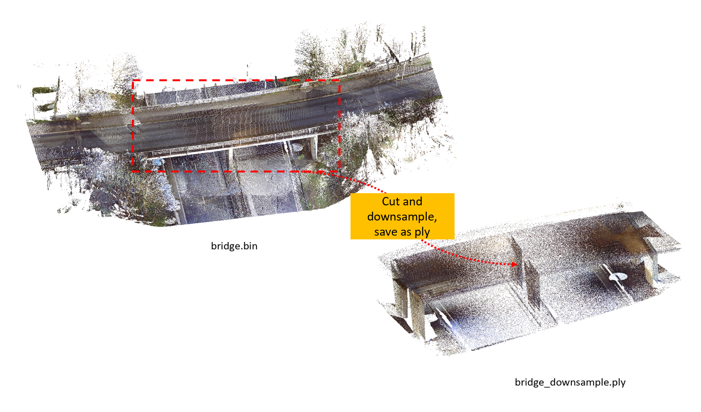

*Fig.2.2.9:   Step1*

##### step2

Open the **bridge_downsample.ply** in MeshLab, and select the presentation status of Shading and Color in the red box at this time. Otherwise, it will show a different color from the real bridge. At present, the ply file only contains point information:


*Fig.2.2.10:   Step2*

The current ply file only contains point information without topological relationships. The specific performance is **Faces 0** in Fig.2.2.11:

Click  in the left side of 


*Fig.2.2.11:   Faces 0*

##### step3

Normal is an essential characteristic of each point of the point cloud. If there is no normal information, it cannot mesh. The process of meshing can also be understood as point cloud reconstruction. That is, the point cloud changes from point (low-level) to a higher-level mesh structure (higher-level). Of course, we can also continue to make the mesh more advanced, such as using a surface to fit a piece of mesh —— We will not discuss this issue in detail here. In short, we need to compute normal first to get the mesh. Therefore, step3 is to compute the normal of the file.

Compute normal of **bridge_downsample.ply**:

**Filters → Normals, Curvatures and Orientation → Compute normals for point sets**


*Fig.2.2.12:   Compute normal step1*

After clicking **Compute normals for point sets**, we can see Fig.2.2.13:

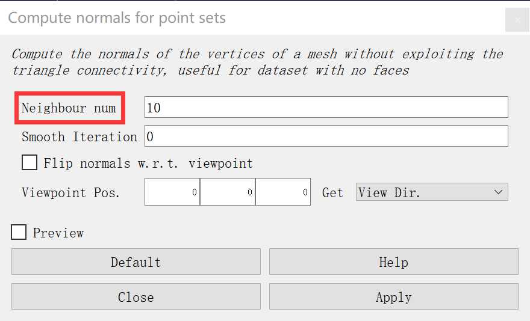

*Fig.2.2.13:   Compute normal step2*

Among them, **Neighbour num** represents the number of points in each point's neighborhood when computing the normal, and the normal can be computed based on the neighborhood. Here we choose the number of neighborhood points as 10. Click **Apply** after setting the neighborhood points.

##### step4

mesh point cloud

**Filters → Remeshing, Simplification and Reconstruction → Surface Reconstruction: Ball Pivoting**


*Fig.2.2.14:   mesh point cloud*

Fig.2.2.15 is Surface Reconstruction: Ball Pivoting pop-up box. Here we set parameter Pivoting Ball radius (perc on (0 .. 37.012)). Then click Apply.


*Fig.2.2.15:   Surface Reconstruction: Ball Pivoting*

Then we get the final meshed **bridge_downsample.ply**. We can see that there are not only points but also faces in the figure below:


*Fig.2.2.16:   Not only points, but also faces*


##### Two different views

The following figures show the views in two different states:

View 1:

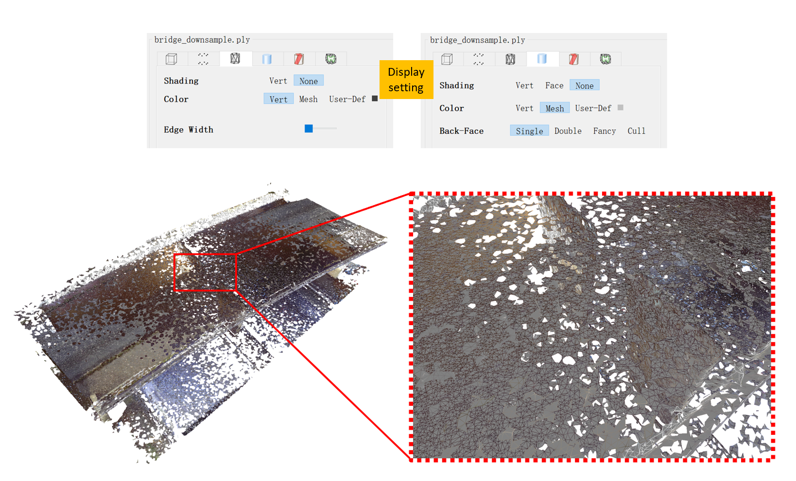

*Fig.2.2.17:   View 1*

View 2:

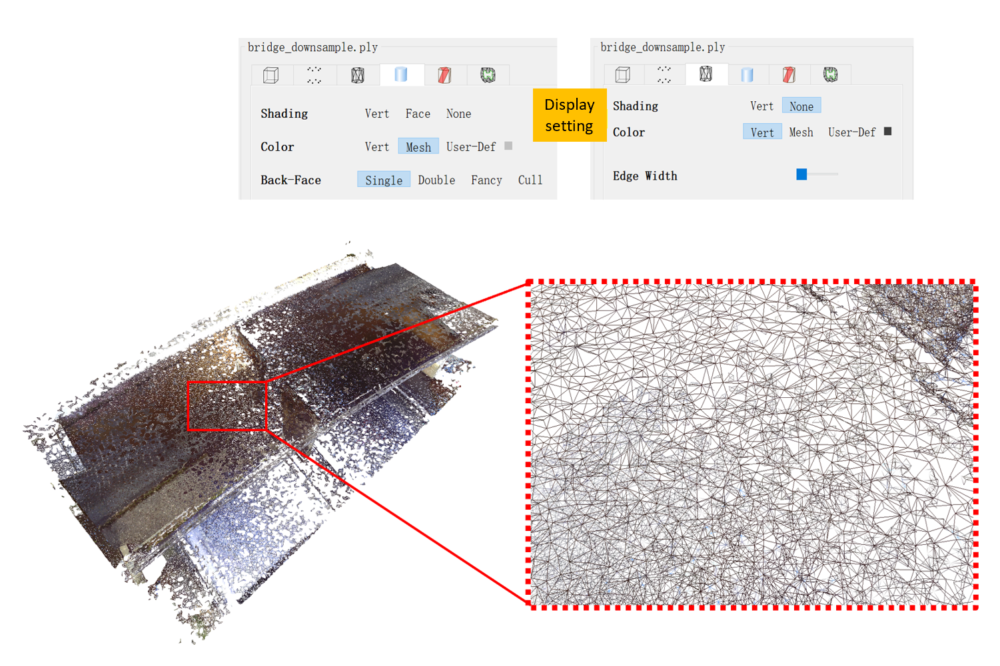

*Fig.2.2.18:   View 2*

Save **bridge_downsample.ply** as **bridge_downsample_mesh.ply**.


*Fig.2.2.19:   Save as **bridge_downsample_mesh.ply***

The saved as **bridge_downsample_mesh.ply** can also be dragged into CloudCompare to view, as shown in Fig.2.2.20:


*Fig.2.2.20:   **bridge_downsample_mesh.ply** in CloudCompare*


#### 2-2-5：Basic operation

Section 2-2-3 describes how to import the mesh file into MeshLab. After importing, it will be displayed on the gradient purple canvas. This section mainly explains the interpretation of the imported interface information and the basic operations of the view in MeshLab:

How to interpret the file information imported into MeshLab?

##### Interpret file information

When we load a file into MeshLab, the interface will display a lot of real-time information about the file. Open the meshed **bridge_downsample_mesh.ply** last section in the software (the processed file is already in the "files" folder):


*Fig.2.2.21:   Interface information*

After opening **bridge_downsample_mesh.ply** into MeshLab, a bridge will be displayed on the interface, and some information can be read at the bottom:

- **FOV**: The Field Of View —— viewpoints similar to the orthographic view and perspective view in CloudCompare. Ortho and 90 are the two extreme values of FOV, and the other values are between them. Ortho corresponds to an orthogonal view, and 90 corresponds to a perspective view;
- **FPS**: Frame Per Second;
- **BO_RENDERING**: A rendering system indication, BO_RENDERING when the mesh file is not unusually large;
- **Mesh**: It means the name of the mesh. Here is **bridge_downsample_mesh.ply**;
- **Vertices**: The number of vertices;
- **Faces**: The number of polygons. If the file is not meshed, Faces displays 0;

When multiple files (**horse.ply**, **bunny.ply**, **dragon.wrl**. All of them are meshed. See in "files" folder) are imported into MeshLab, as shown below:


*Fig.2.2.22:   Multiple files*

Select different file names under Project_1, and the corresponding file information will be displayed at the bottom of the interface: including the FOV, FPS, rendering system indication, current mesh name, and the number of vertices/faces.

Click the eye symbol in front of each file in Project_1. There are two states: 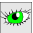 and . The former means seeing the file in the view, and the latter means not displaying it. In Fig.2.2.22, we have selected the former, so these three meshed files all appear in the canvas.


##### Adjust the view

After we imported a meshed file **bridge_downsample_mesh.ply** into MeshLab, we hope to have a comprehensive view of it. At this time, one angle is not enough. Here are a few ways to adjust the view:

- **Rotate**: Move the mouse to the mesh, keep clicking and holding the left button of the mouse without releasing it, drag the mouse, and the file will rotate around the center of the object;


​       *Fig.2.2.23:   Rotate*

- **Pan**: Move the mouse to the mesh object, press ctrl. Click the mesh file with the left mouse button, and drag the mouse to move the mesh file in the view. The trackball is displayed now. The effect of moving to the left refers to the icon at the bottom left :

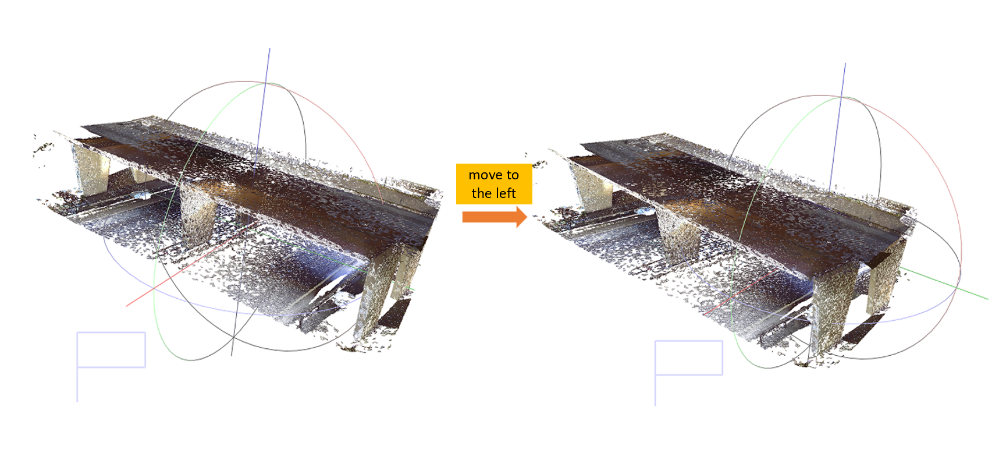

​       *Fig.2.2.24:   Pan*

- **Zoom in/out**: MeshLab has two methods to zoom in or zoom out the file view. One is to slide the mouse wheel directly, slide forward to zoom out, and slide backward to zoom in; the other one is to press the shift key, click the mesh file with the left mouse button, and the mouse icon moves upward to zoom out, and downward to zoom in. The trackball is displayed now. The following figure shows method two (refer to the S-shaped icon at the bottom left for the zoom effect 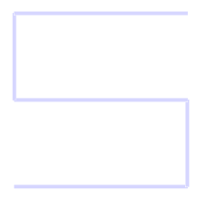).

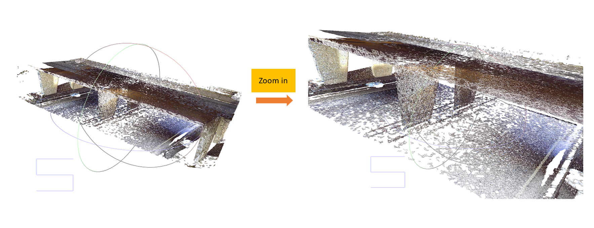

​       *Fig.2.2.25:   Zoom in/out*

- **Zoom in on a specific location**: This operation can adjust the selected part to the center of the coordinate sphere and zoom in. The trackball is displayed now. The operation is as follows: select a part with the left mouse button (here is the leftmost pier, double-click the part), we will find that it jumps to the center of the canvas, double-click again, the part will drive the entire object to zoom in:

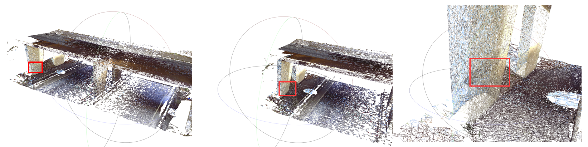

​       *Fig.2.2.26:   Zoom in on a specific location*

- **FOV view**: Similar to the orthogonal view and perspective view in CloudCompare, different visual effects are presented to the user. The trackball is displayed now. The operation is as follows: Press the shift key, slide the mouse wheel upwards, the FOV value will increase to 90 (perspective view); slide downwards, the FOV value will decrease until Ortho (orthogonal view). The following shows the views in two extreme cases:


​      *Fig.2.2.27:   Different FOV views*

The above is the adjustment view operation that is often used in MeshLab to have a comprehensive understanding of the imported mesh file. Through the button below, we can quickly call up the shortcut of the above operation for everyone to view: **Help** → **On screen quick help F1**


*Fig.2.2.28:   On screen quick help*

##### Find related functions

MeshLab itself contains many functions. If we are unsure where these functions are, we can search for keywords through the magnifying glass icon in the upper right corner.

The figure below is an example of using this button to find content related to normals.

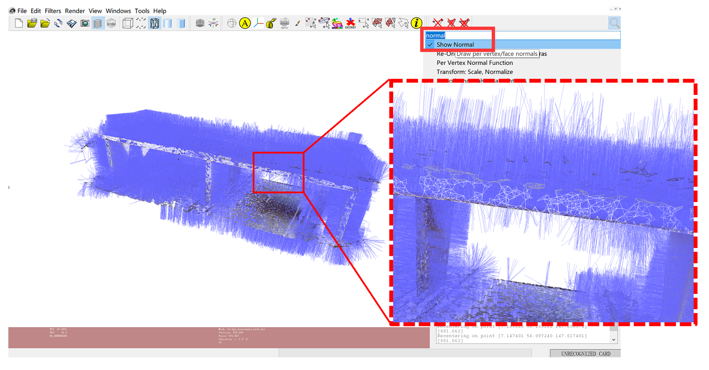

*Fig.2.2.29:   Show Normal*

We computed the normals during the acquisition of **bridge_downsample_mesh.ply**, so the file contains normal information, and the normals can be viewed. As we can see, after we enter “normal” in the search box, a series of normal-related operations will appear. We only need to select the corresponding operation according to our needs. Here we choose Show Normal, that is, show normals —— many purple vectors.


#### 2-2-6：Visualization

In this section, we start to learn how to view the visualization of different states in MeshLab: for example, how the light is reflected, how the Bounding Box is displayed, and the displayed state is point set or mesh or surface information, etc.

How to enrich the visualization in MeshLab?

Here we take **dragon.wrl** as an example.

> **dragon.wrl** itself contains mesh information and normal information. We have not mentioned the wrl file before, but here is to explain these visualization functions through the file.

##### Light

Light is an essential feature of rendered objects:

- Shading: Vert, Face, None; Vert displays more smoothly, Face has more apparent edges and corners, None means not display shadows:

> In order to facilitate the view, set the color of the file to Use-Def in the Color line, that is, the user-defined format, here is gray.


​       *Fig.2.2.30:   Light*

- Back-Face: Single, Double, Fancy, Cull. Only the first two are introduced below.

> NB: To make it easier for everyone to see the yellow light, we reset the original gradient purple background. Readers can also set other colors by themselves, as long as the yellow light can be observed clearly.

Single:

Single means one-way light. Press "Ctrl + Shift" at the same time, and click the left mouse button on the canvas to appear light. The orange arrow is the direction of light. We can see that the left side of the dragon is illuminated, showing a bright color; the left side of the dragon is a shadow area, so it is dark:

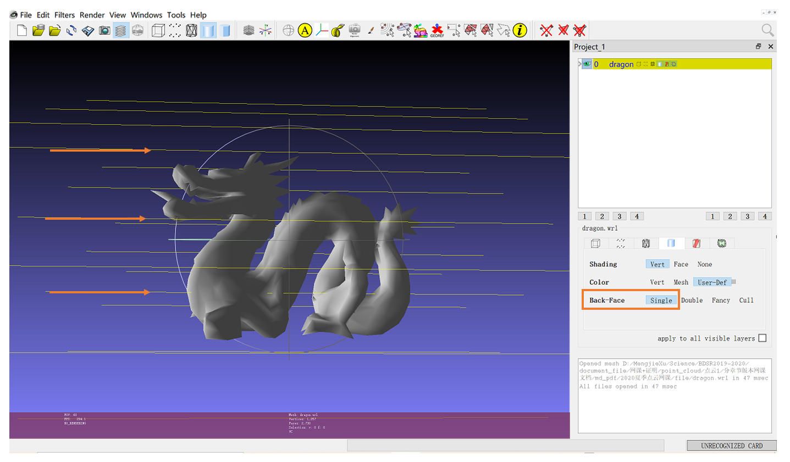

*Fig.2.2.31:   Single*

Double:

Double means two-way light. Press "Ctrl + Shift" at the same time and click the left mouse button on the canvas to show light. No matter how the light rotates, the mesh does not have a complete shadow state because it is two-way illumination. The orange arrow is the direction of light. It can be seen that there are bright color areas on the left and right sides, and the dark color area is the part of the shadow area after the light is irradiated in both directions:


*Fig.2.2.32:   Double*

##### Bounding Box

Similar to the Bounding Box concept in CloudCompare before, there is also a corresponding Bounding Box in MeshLab to frame the mesh:


*Fig.2.2.33:   Bounding Box*

Bounding Box can be displayed through way1 or way2. Here, to display the Bounding Box on a white background, we set the Bounding Box's color to Use-Def, which is the user-defined state, and set it to red. Inside the purple box in Fig2.2.33.

The following figure shows the parameters of the Bounding Box, including color and measurement information:

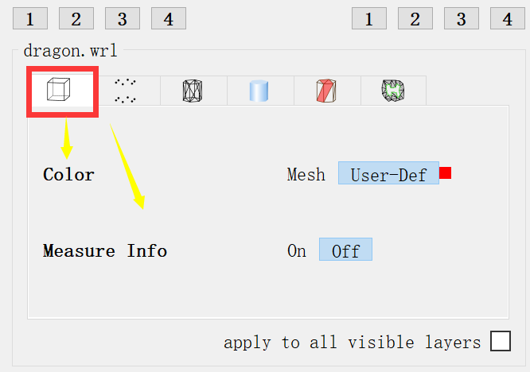

*Fig.2.2.34:   Bounding Box parameters*

Among them, the color can be mesh or user-defined color (click the red square sign on the right of User-Def to set the color yourself); the measurement information can be displayed (On) or not displayed (Off).

##### Points

Display the point information corresponding to the mesh file:

In order to display the Points view better, we set the color of Points to Use-Def, which is the user-defined state, and set it to green. We can set the view of the point through way1 or way2 in Fig.2.2.35.

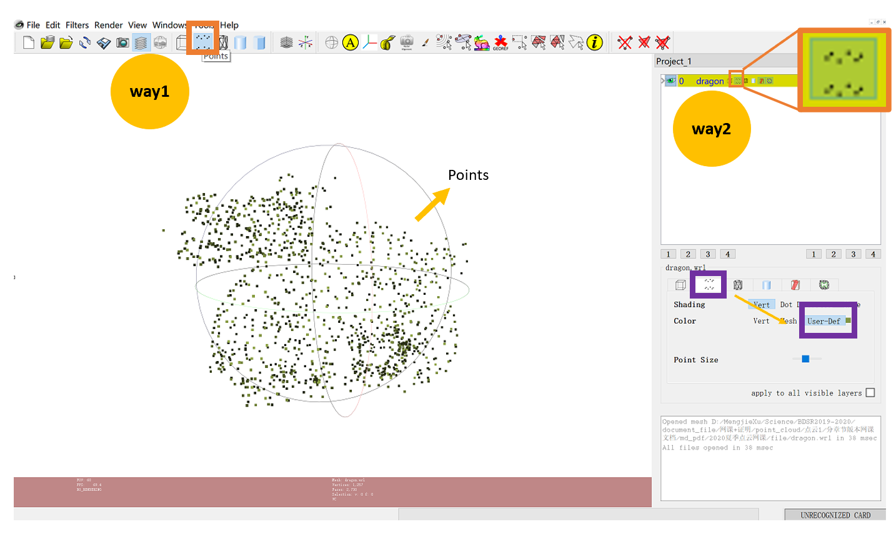

*Fig.2.2.35:   Points*

The following are the parameters for Points, including Shading, Color, and Point Size:


*Fig.2.2.36:   Points parameters*

##### Wireframe

The wireframe is the same as that introduced in CloudCompare. This view category is only available in the mesh file, which is essentially a mesh structure.

Here, to display the Wireframe view better, we set the color to Use-Def, which is the user-defined state, and set it to black. We can view the Wireframe through way1 or way2 in Fig.2.2.37.


*Fig.2.2.37:   Wireframe*

The following is the setting of Wireframe parameters:

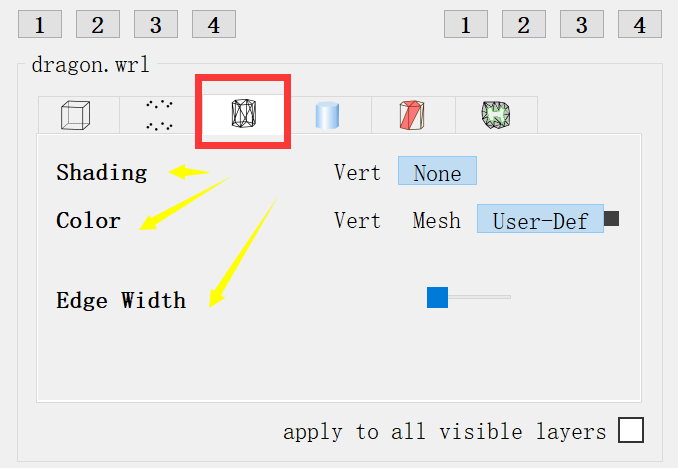

*Fig.2.2.38:   Wireframe parameters*


#### 2-2-7：Downsampling

Same as section 2-1-6: Downsampling, MeshLab also has its own downsampling button:

Here we take **bridge_downsample_mesh.ply** as an example: the downsampling required file contains mesh information

View before downsampling:


*Fig.2.2.39:   Original view before downsampling*

The operation process is as follows: **Filters → Sampling → Poisson-disk Sampling**

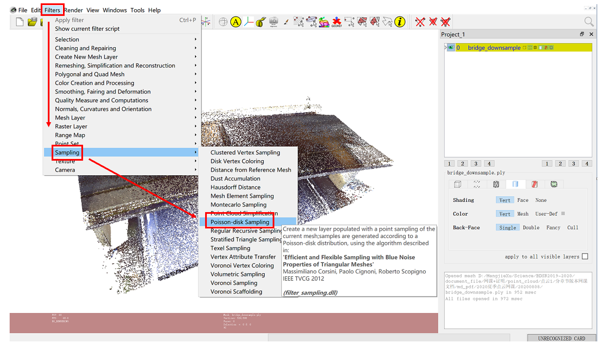

*Fig.2.2.40:   Downsampling step 1*

After selecting Poisson-disk Sampling, the pop-up box in Fig.2.2.41 will pop up:


*Fig.2.2.41:   Downsampling step 2*

In this pop-up box, we can modify **Number of samples** —— the approximate number of points remaining for downsampling (The number of points obtained by the final downsampling is near this number, and may not be precisely equal. For example, we set 10000 points here. The number of points contained in the point cloud of the downsampling result is shown in Fig.2.2.42).


*Fig.2.2.42:   The number of result*

Downsampling result view:


*Fig.2.2.43:   Downsampling result view*

We can see that the view is much sparser than the original view in Fig.2.2.39.


#### 2-2-8：Select and delete

The following briefly introduces several functions used to select or delete some areas in MeshLab.

Take **bridge_downsample_mesh.ply** as an example：

##### Select


*Fig.2.2.44:   Select*

As shown in Fig.2.2.44, the six buttons in the red box are different ways of selecting some areas:

① Select Vertex Clusters : Select vertex set (include all selected points in the set);

② Select Vertices on a Plane : Select vertices on a plane (include points on a plane in the set)

③ Select Vertices : Select the vertices in the cuboid area;

④ Select Faces in a rectangular region : Select a polygonal surface in the cuboid area;

⑤ Select Connected Components in a region : Select the components of the associated area (both points and faces);

⑥ Select Faces/Vertices inside polyline area : Select faces/vertices in irregular areas;


##### Delete

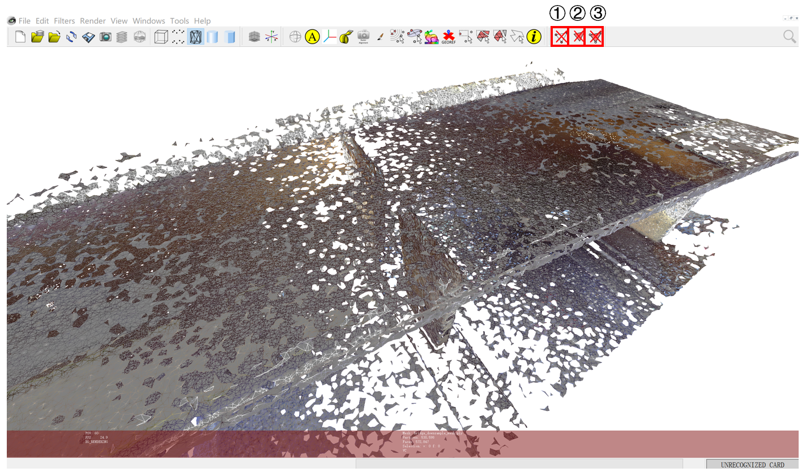

*Fig.2.2.45:   Delete*

As shown in Fig.2.2.45, the three buttons in the red box are different ways to delete some areas:

① : Delete the current set of selected vertices; faces that share one of the deleted vertices are deleted too ;

② : Delete the current set of selected faces, vertices that remains unreferenced are not deleted;

③ 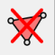: Delete the current set of selected faces and all the vertices surrounded by those faces.

> Interested readers can try it by themselves according to the appropriate files in the "files" folder.


#### 2-2-9: Topological and geometric information

This section mainly introduces how to read the topological and geometric information of the mesh in MeshLab. Compared with the point cloud that only contains the point information, the mesh has more topological information. Therefore, it is useful to learn to view such information. Here is a **brief introduction**, taking the **dragon.wrl** file as an example:

##### Topological information


*Fig.2.2.46:   Topological information*

The topological information is very important for the triangulation of point cloud because the triangulation (described in Chapter4) requires the topological information to form a spatial structure. In the red box on the right side of Fig.2.2.46, we get the topological information. We can see the file contains 1257 vertices; 4095 edges; 2730 faces. The specific topological information is as follows:

```
V: 1257 E: 4095 F: 2730
Unreferenced Vertices 0
Boundary Edges 0
Mesh is composed by 1 connected component(s) 
Mesh is two-manifold 
Mesh has 0 holes
Genus is 55
Applied filter Compute Topological Measures in 58 msec 
```

##### Geometric information

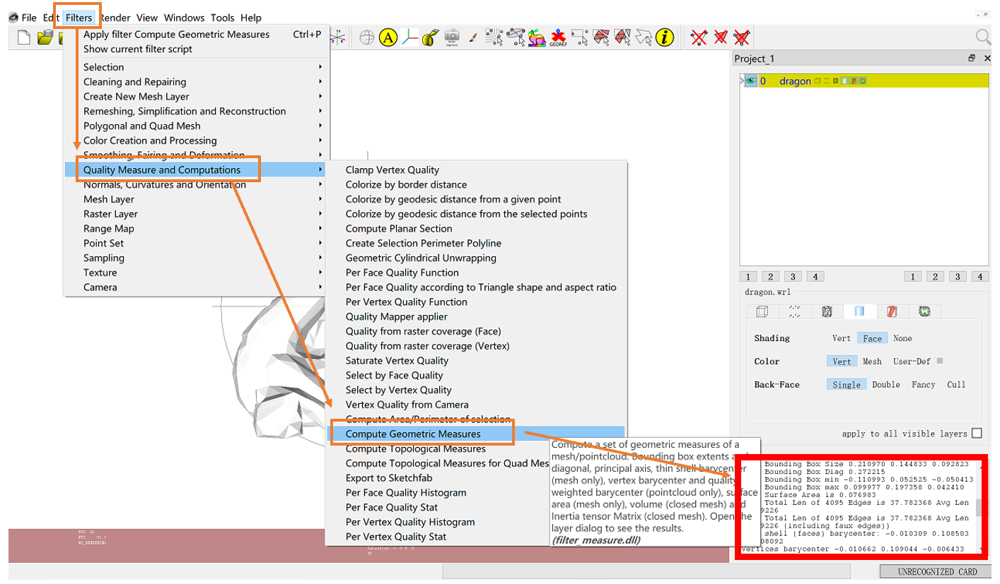

*Fig.2.2.47:   Geometric information*

The geometric information of Mesh is crucial for us to understand the geometric structure of the file. The full geometric information we got in the red box on the right side of Fig.2.2.47 is not displayed here, so we list all the geometric information as follows:

```
Mesh Bounding Box Size 0.210970 0.144833 0.092823
Mesh Bounding Box Diag 0.272215 
Mesh Bounding Box min -0.110993 0.052525 -0.050413
Mesh Bounding Box max 0.099977 0.197358 0.042410
Mesh Surface Area is 0.076983
Mesh Total Len of 4095 Edges is 37.782368 Avg Len 0.009226
Mesh Total Len of 4095 Edges is 37.782368 Avg Len 0.009226 (including faux edges))
Thin shell (faces) barycenter: -0.010309 0.108503 -0.008092
Vertices barycenter -0.010662 0.109044 -0.006433
Mesh Volume is 0.000478
Center of Mass is -0.011976 0.103019 -0.009221
Inertia Tensor is :
| 0.000001 0.000000 0.000000 |
| 0.000000 0.000001 0.000000 |
| 0.000000 0.000000 0.000002 |
Principal axes are :
| 0.979431 -0.201732 -0.004342 |
| 0.198852 0.968651 -0.148907 |
| -0.034245 -0.144981 -0.988842 |
axis momenta are :
| 0.000001 0.000001 0.000002 |
Applied filter Compute Geometric Measures in 84 msec 
```

It includes the Bounding Box's size range, the surface area of the mesh, the volume of the mesh, etc.


> So far, we have learned the simple operations of CloudCompare and MeshLab, and have been able to play with point clouds on our own. In Chapter 3, we will introduce the internal information of these open and view files.
>
> Let us explore the internal composition of these view files together!


### Reference

[^1]: [https://www.danielgm.net/cc/doc/qCC/CloudCompare%20v2.6.1%20-%20User%20manual.pdf](https://www.danielgm.net/cc/doc/qCC/CloudCompare v2.6.1 - User manual.pdf)
[^2]: https://alternativeto.net/software/cloudcompare/
[^3]: https://twitter.com/OddGoderstad/status/791692420085940228/photo/1
[^4]: http://www.danielgm.net/cc/forum/viewtopic.php?t=1524
[^5]: https://blog.csdn.net/u013512448/article/details/52527237/
[^6]: https://stackoverflow.com/questions/40404031/drawing-bounding-box-for-a-rotated-object
[^7]: Jeong, J., Yoon, T. S., & Park, J. B. (2018). Towards a meaningful 3D map using a 3D lidar and a camera. *Sensors*, *18*(8), 2571.
[^8]: https://images.app.goo.gl/AeGVaoXyfJuS82FGA
[^9]: [https://www.danielgm.net/cc/doc/qCC/CloudCompare%20v2.6.1%20-%20User%20manual.pdf](https://www.danielgm.net/cc/doc/qCC/CloudCompare v2.6.1 - User manual.pdf)
[^10]: Pan, Y. (2019). Target-less registration of point clouds: A review. *arXiv preprint arXiv:1912.12756*.

[^11]: https://www.web3.lu/meshlab-3d-software/
[^12]: https://www.researchgate.net/publication/221210477_MeshLab_an_Open-Source_Mesh_Processing_Tool/figures?lo=1
[^13]: https://alternativeto.net/software/meshlab/
[^14]: https://www.pinterest.com/pin/493073859183245037/


