[TOC]


## 第二章   点云软件

原始点云数据往往数量庞大，特别是用扫描仪等仪器获得的真实点云，动辄会有几百万、几千万，上亿个点。正如第一章中点云的概念中所提到的，点云是海量点的集合，可能包含一些**杂乱的无关点**，这些点往往会影响我们处理点云的效率，甚至影响一些算法的准确性。如图 1，是一座桥场景的点云数据，如果我们只感兴趣桥体，那么红框内的树木、车辆等就是无关杂点。

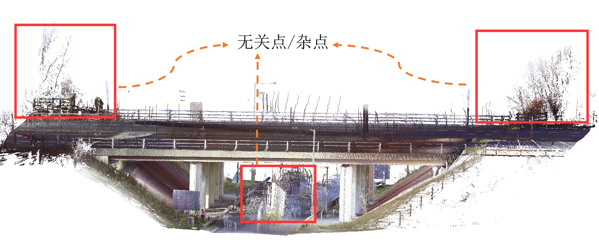

​                                                                        图 1：无关点示意图

除此之外，原始点云过于庞大，一般不会直接用于后续处理。通常我们会首先对数据进行预处理，预处理包括对点云进行裁剪，切割，清理，和降采样（图 2）等：

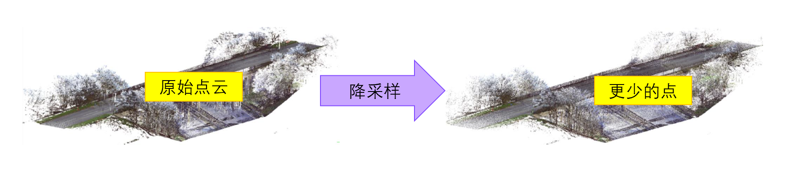

​                                                                          图 2：预处理示意图

如何实现这些操作呢？

其中较为常用的方式是通过现有的商业软件或者免费软件进行快速的适当处理。

本章主要介绍常用的两款免费的开源软件： ***CloudCompare*** 和 ***MeshLab***，这两个软件都具备强大的点云处理能力，且上手容易。在书中和自学过程中，我们会大量使用这两种软件对点云进行裁剪、切割、清理和降采样等预处理以及可视化。


​                                                               **——  一起来玩转点云软件吧！——**


### 2-1 ：CloudCompare

------

CloudCompare 是一款功能强大的开源软件，可以用来处理三维点云以及 mesh 文件（网格数据模型）。它操作简单方便，Windows，MacOS 和 Linux 都可以运行。由于其源代码开源，大家可以在学习该软件的过程中根据自己的需要不断完善拓展 CloudCompare 的功能。随着 CloudCompare 的不断发展，该软件可以处理的点云数量级越来越大，2005 年已经可以快速处理超过 10,000,000 个点，同时支持许多点云算法（部分点云算法会在第四章 PCL 中讲解代码实现）和基本点云操作功能[^1]。

先来看看几个复杂结构点云在 CloudCompare 中的精彩视图，感受 CloudCompare 的强大视觉功能！


​                                                       图 2-1：CloudCompare 界面示意图[^2][^3][^4]

下面提供给大家几个辅助学习的小工具：

- CloudCompare 源代码链接，大家对于点云处理技术非常熟悉后可以在这里进行源代码的编写：

  👉 https://github.com/cloudcompare/cloudcompare

- 下面链接通过 YouTube 视频的形式直观介绍 CloudCompare 的基本操作：

  👉 [https://www.youtube.com/playlist?list=PLBNUxsUA00UAT63O0d95pByrCjtqlXN4_](https://www.youtube.com/playlist?list=PLBNUxsUA00UAT63O0d95pByrCjtqlXN4_)

- 下列文档是 CloudCompare 的官方用户手册：

  👉 [https://www.danielgm.net/cc/doc/qCC/CloudCompare%20v2.6.1%20-%20User%20manual.pdf](https://www.danielgm.net/cc/doc/qCC/CloudCompare v2.6.1 - User manual.pdf)

大家可以在阅读本手册之余，通过上述链接查找自己不明白的地方，或者试着改进这个软件。

> 注意：软件版本会不断更新换代，接下来的讲解都是以 CloudCompare v2.11 alpha（Anoia）[64-bit] 版本为例，其他版本文件操作虽有差异，但基本一致，大家要学会活学活用。

下面，我们一起正式进入 CloudCompare 的世界！


#### 2-1-1：下载并安装

下载路径：

**CloudCompare 官网 http://www.cloudcompare.org/  → Download :**  

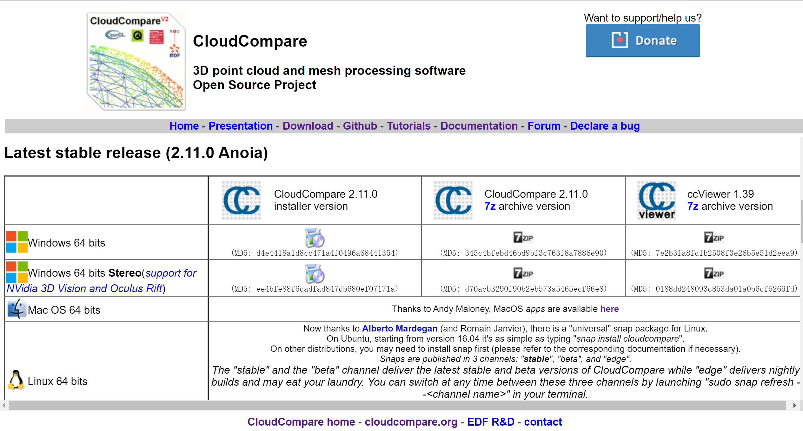

​                                                                  图 2-1-1：CloudCompare 下载界面

图 2-1-1 是 CloudCompare 的下载界面，按照计算机系统（Windows/MacOS/Linux）选择对应的 exe 文件，根据提示来安装即可。操作非常简单，不需要任何的密钥或其他要求。安装好后，可以看到 CloudCompare 图标 ，该图标是由两个 “C” 组成的，代表着 **C**loud**C**ompare 中的两个 “**C**”。


这时我们打开 CloudCompare，图 2-1-2 是软件初始界面。左侧是软件的信息显示区，右侧渐变蓝色部分是显示点云的画布区域：

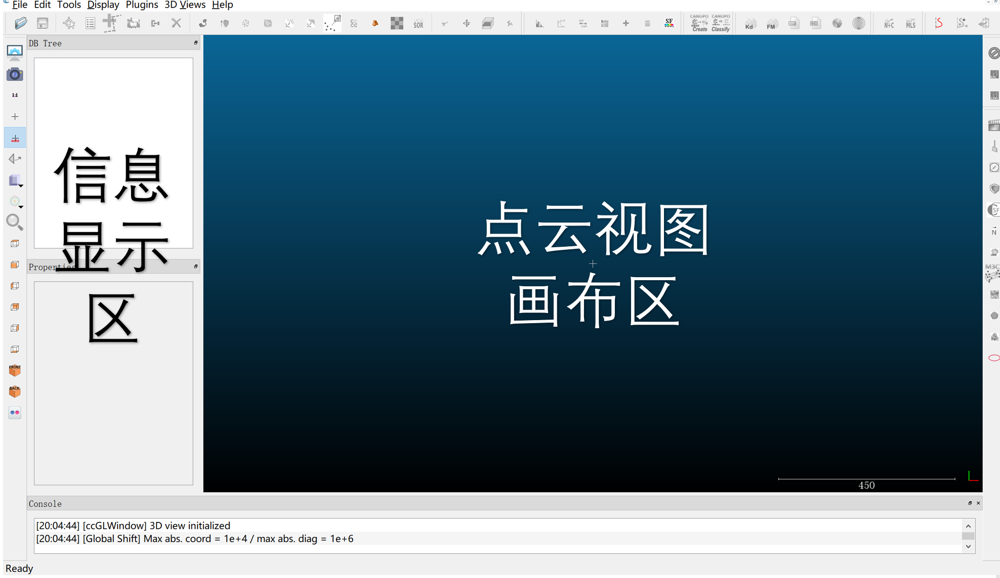

​                                                                 图 2-1-2：CloudCompare 初始界面

接下来的章节给大家演示的 CloudCompare 画布颜色设置为白色，与图 2-1-2 （渐变蓝色）略有差异（颜色设置会在 2-1-4 节介绍）。


> 学习软件就是需要我们自己动手尝试，下面一起打开 CloudCompare，探索它的强大功能吧！


#### 2-1-2：打开文件并视图

CloudCompare 的初始化界面中只有空白的信息显示区和点云视图画布区，这是因为没有数据的导入，CloudCompare 没有可以处理的点云对象。因此，使用 CloudCompare 进行点云处理首先要在软件中打开我们需要处理的文件，也就是 “ 将我们的文件导入 CloudCompare ”，怎么在 CloudCompare 中打开一个点云文件呢？

##### 打开文件的方法：

在 CloudCompare 中打开文件有两种方法：

- **方法 1**：通过 **File → open** 或 Open 图标 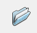，选择所要打开的文件的路径即可（这里我们选择的是教程中的 **bridge_pier.pcd** 文件），如图 2-1-3 所示：


​                                                    图 2-1-3 ：在 CloudCompare 中打开点云方法一

- **方法 2：**直接将文件拖入 CloudCompare 中，如图 2-1-4 所示：

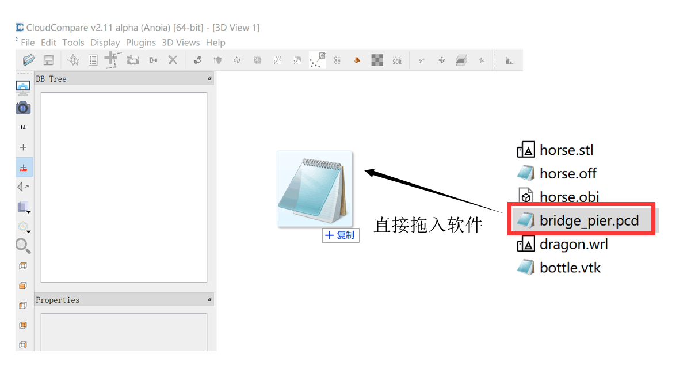

​                                                     图 2-1-4 ：在 CloudCompare 中打开点云方法二

通过上述两种操作，我们均可以在 CloudCompare 中看到点云视图。如图 2-1-5：

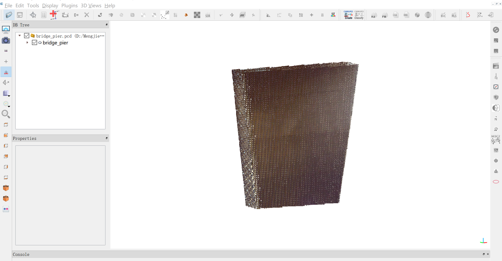

​                                                                  图 2-1-5：**bridge_pier.pcd** 视图

如图 2-1-5 所示，**bridge_pier.pcd** 是一个桥墩的点云实体。它正是第一章我们见过的 **bridge.bin** 中的一个桥墩，如图 2-1-6 中红色区域：

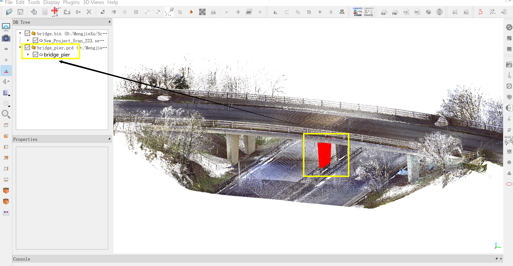

​                                                              图 2-1-6：**bridge_pier.pcd** 来源示意图

大家可能会好奇，如何才能从整个桥体中单独分离出一个较为完整的桥墩呢？

其实这个操作非常简单，通过对桥体进行切割，就可以将自己想要的部位构建分离（关于点云切割我们在 2-1-5 节会介绍）。不过如果要得到较为干净且噪声点较少的部件，需要经过多次合适的切割以及过滤处理（关于过滤，主要是一些点云滤波的应用，我们会在第四章给大家介绍）。


##### Q&A：

> 在打开点云过程中可能会遇到以下问题：
>
> Q：当我们同时将两个点云文件加载到 CloudCompare 中时，为什么只看到其中一个？
>
> A：这是因为：
>
> 1. 不同的点云文件，它的坐标范围不同。比如点云 A 范围如下（x：0-1；y：0-1；z：0-1），点云 B 范围如下（x：99-100；y：99-100；z：99-100）。这样一来，两个点云的坐标相差太远，当同时出现在 CloudCompare 画布中时，可能只会展现其中一个坐标范围的点云，另一个点云由于与它相隔太远，超出当前画布区域。此时我们可能需要通过旋转去寻找另一个点云，会对我们的点云视图造成影响。
> 2. 不同的点云文件，size 不同，也就是点云尺寸不同。比如一个尺寸为 1×1×1 的点云在一个尺寸为 100×100×100 的点云旁边会显得非常渺小甚至难以观测。
>
> 如下图：
>
> 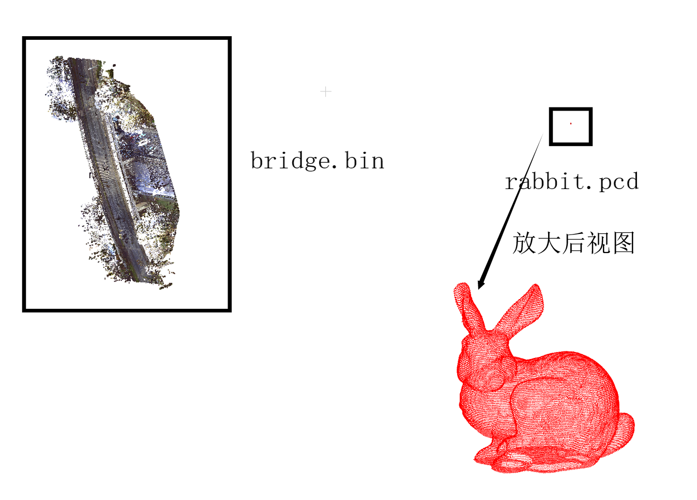
>
> ​                                                                                   图 2-1-7
>
> **bridge.bin** 与 **rabbit.pcd** 同时在视图中出现，右边的 **rabbit.pcd** 只能看到一个隐约的红点。（**rabbit.pcd** 本身不带颜色，这里为了跟白色画布颜色区分，我们给它设置了具体的颜色，关于颜色设置我们在 2-1-4 节中会介绍）
>
> 以上两种情况都会造成只看到一个清晰点云的现象，影响视图。因此建议大家在不知道每个点云的尺寸大小以及坐标范围时，尽量一次只在 CloudCompare 中视图一个点云。


##### Bounding Box：

成功打开点云文件并视图后，我们选中界面左边 **DB Tree**（点云在 CloudCompare 列表中的显示类似于树状结构，因此称为 tree）下的 **"bridge_pier"**（如图 2-1-8 左侧红框内），会发现右边画布中的物体被一个红色长方体框包裹（颜色可能会有差异，可能是黄色或其他颜色，这个不是软件出现问题，该长方体框的颜色可以自行设置，具体讲解在 2-1-4 节）。如图 2-1-8 所示：

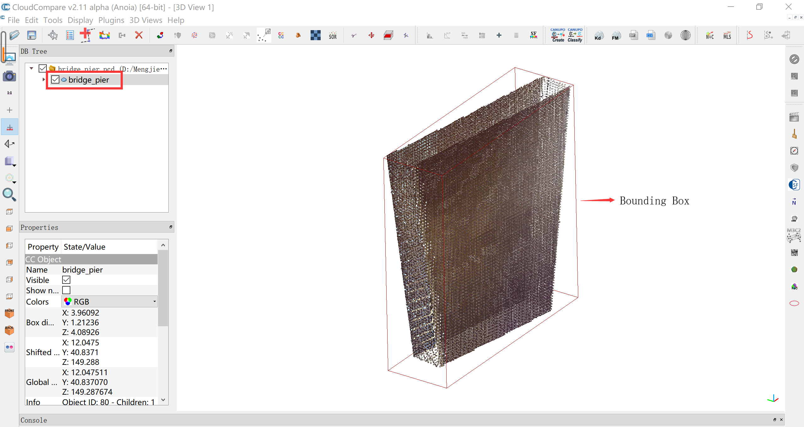

​                                                         图 2-1-8 ：点云视图以及 Bounding Box

这个红色长方体叫做该点云的 Bounding Box，用来框住整个几何体，并大致得到几何体的尺寸范围。那么究竟什么是 Bounding Box 呢？

Bounding Box，顾名思义，是与点云边界（bounding）有关系的一个包围盒（box）。Bounding Box 建立在 CloudCompare 右下角黑框内的坐标系中（如图 2-1-9，Bounding Box 各个方向的朝向都与右下角黑框内坐标系方向平行）：

- 以点云物体的 X 坐标范围（x_min ~ x_max）确定 X 轴方向的 Bounding Box 边长；
- 以点云物体的 Y 坐标范围（y_min ~ y_max）确定 Y 轴方向的 Bounding Box 边长；
- 以点云物体的 Z 坐标范围（z_min ~ z_max）确定 Z 轴方向的 Bounding Box 边长；

如图 2-1-9 所示：

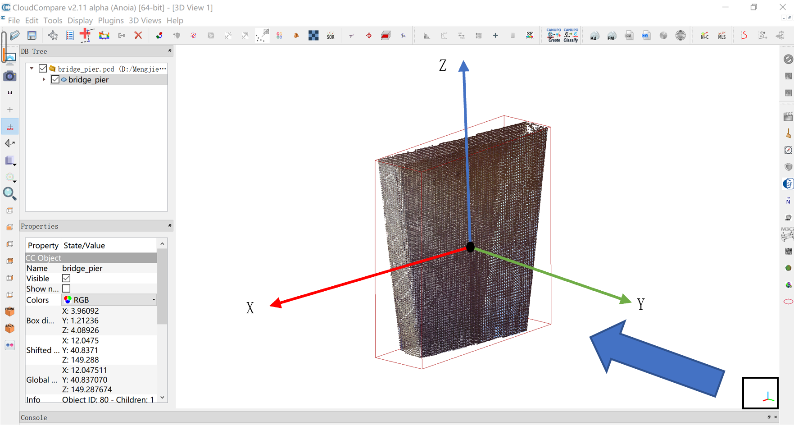

​                                                          图 2-1-9 ：Bounding Box 坐标系说明

我们的**点云**文件可能是**形状结构复杂**的，但无论点云本身有多复杂，它的 **Bounding Box** 始终是一个**简单规则的长方体**。它可以帮助我们快速的确定点云的范围，方便后续利用点云范围进行的一些操作。那么它有什么应用场景呢？

在 CloudCompare 中做**大面积裁剪**的时候，Bounding Box 就会派上用场。具体内容在讲点云切割时给大家补充细节。

需要注意的是， CloudComapre 中的 Bounding Box 实际上是 **Axis-Aligned Bounding Box (AABB)**，除了 CloudCompare 中的 AABB，还有一种有向 Bounding Box，被称为 **Oriented Bounding Box（OBB）**。AABB 与 OBB 都是 Bounding Box，这二者有什么区别呢？

- **Oriented Bounding Box** 始终沿着点云物体的主成分方向（可以利用 PCA 计算主成分方向）；
- **Axis-Aligned Bounding Box** 则始终与坐标轴是对齐的；

3D 情况下如图 2-1-10，左侧为 AABB，右侧为 OBB：

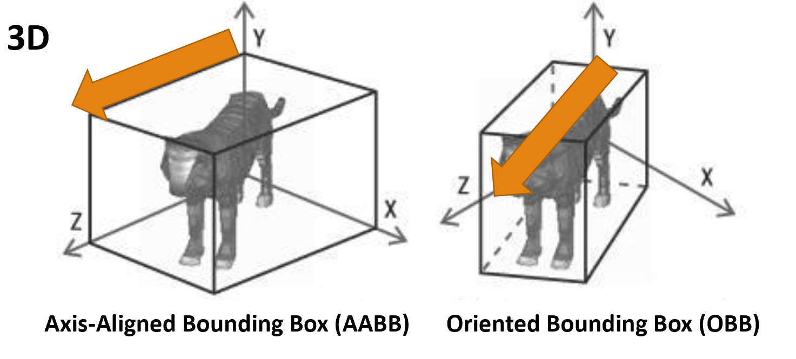

​                                                             图 2-1-10： Bounding Box in 3D[^5]

2D 情况如下图 2-1-11 ，上面是 AABB，下面是 OBB：

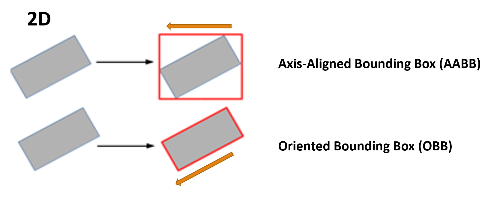

​                                                              图 2-1-11： Bounding Box in 2D[^6]

通过上面的介绍，我们可以看出 **OBB** 比 **AABB** 刻画点云的范围更加精确。**AABB** 会框住很多无效的空间，在实际算法应用中会对效率造成一定影响。当我们需要更加准确的范围依据时一般会选择计算 **OBB**。


##### 可以在 CloudCompare 中打开的文件

现在，我们已经学会在 CloudCompare 中打开一个点云文件，并且了解了 Bounding Box 知识。这里大家思考一个问题，CloudCompare 是一个处理点云的软件，肯定不是所有文件格式都可以打开，那么什么格式的文件才能在 CloudCompare 中打开呢？

可以在 CloudCompare 中打开的文件都与 3D 文件有关，有的不一定是严格的点云文件，如表所示：

​                                           表 2-1：可以在 CloudCompare 中打开的文件格式及其后缀

| 文件类型                                    | 后缀        | 文件类型                   | 后缀                                       |
| ------------------------------------------- | ----------- | -------------------------- | ------------------------------------------ |
| *CloudCompare entities*                     | *.bin       | *ASCII cloud*              | *.txt *.asc *.neu *.xyz *.pts *.csv        |
| *LAS cloud*                                 | *.las *.laz | *LAS 1.3 or 1.4*           | *.las *.laz                                |
| *E57 cloud*                                 | *.e57       | *PTX cloud*                | *.ptx                                      |
| *Simple binary file*                        | *.sbf       | *PLY mesh*                 | *.ply                                      |
| *OBJ mesh*                                  | *.obj       | *VTK cloud or mesh*        | *.vtk                                      |
| *STL mesh*                                  | *.stl       | *OFF mesh*                 | *.off                                      |
| *FBX mesh*                                  | *.fbx       | *DXF geometry*             | *.dfx                                      |
| *Point Cloud Library cloud*                 | *.pcd       | *SHP entity*               | *.shp                                      |
| *RASTER grid*                               | * . *       | *Riegl files*              | *.rdb *.rsp *.rds                          |
| *DotProduct cloud*                          | *.dp        | *Image*                    | *.bmp *.cur *.gif *.ico *.jpeg *.jpg *.pbm |
| *Photoscan project*                         | *.psz       | *CSV matrix cloud*         | *.csv                                      |
| *Clouds + calibrated images [meta] [ascii]* | *.icm       | *PDMS primitives*          | *.pdms *.pdmsmac *.mac                     |
| *Clouds + sensor info. [meta] [ascii]*      | *.pov       | *Point + Normal cloud*     | *.pn                                       |
| *Point + Value cloud*                       | *.pv        | *Salome Hydro polylines*   | *.poly                                     |
| *Sinusx curve*                              | *.sx        | *Snavely's Bundler output* | *.out                                      |
| *Mensi Soisic cloud*                        | *.soi       | *Image*                    | *.pgm *.png *.ppm *.svg *.svgz *.xbm *.xpm |


> 注意：以上表格**只是 Windows 系统**下 CloudCompare 可以打开的文件格式，其他系统可以打开的文件格式可能有所不同。查看方式如下：**File → Open**，观察弹出框中右下角的后缀下拉框，点击下拉框后呈现的是当前软件可以打开的文件格式，如下图（可以拖动滚条看剩余文件格式）：
>
> 
>
> 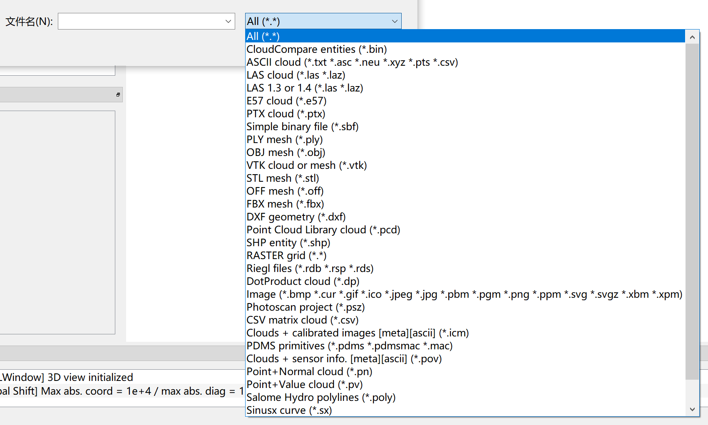
>
> ​                                                                 图 2-1-12：文件格式查看


众多文件格式都可以在 CloudCompare 中打开。相对应地，这些文件之间也可以在 CloudCompare 中直接进行格式转化，关于文件转化问题在 “第三章 点云文件格式” 中具体说明，这里不再赘述。

成功打开文件后，我们可以在画布中对文件的视图进行全方位的查看，CloudCompare 中有哪些视图功能呢？一起来试试吧。


##### 在 CloudCompare 中视图：

###### 旋转、平移、放大/缩小

以 **bridge_pier.pcd** 为例：

- **旋转：旋转可以帮助我们查看三维空间中物体的全方位视图。**

  step1：首先，将鼠标箭头移动到画布任意一个部位，点击鼠标左键，鼠标箭头变成小手状，如图 2-1-13：

  

  ​                                                                       图 2-1-13：旋转 step1

  step2：拖动鼠标，同时始终点击鼠标左键，此时张开的小手变成了握拳状，意味着这 个点云已经在你的 “掌握” 中。移动鼠标，你可以任意查看全方位角度的示意图，如图 2-1-14 和图 2-1-15：

  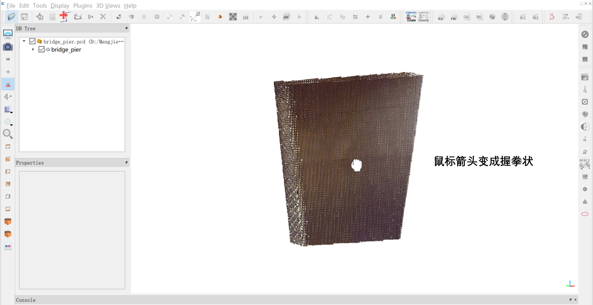

  ​                                                                       图 2-1-14：旋转 step2

  图 2-1-15 是各个角度的视图：
  
  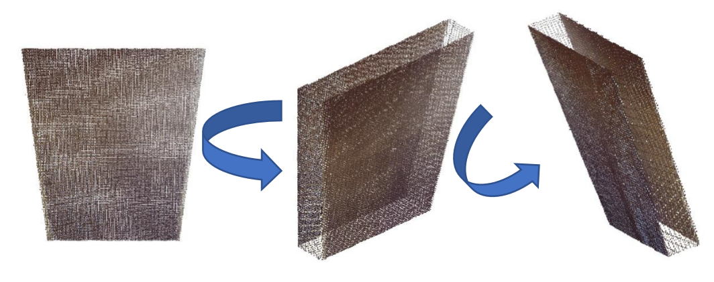

​                                                                             图 2-1-15：各个角度示意图

- **平移：将点云移动到合适的画布位置，方便视图：**

  将鼠标箭头移动到点云任意部位，点击鼠标右键，鼠标箭头变成十字符号，如图 2-1-16：

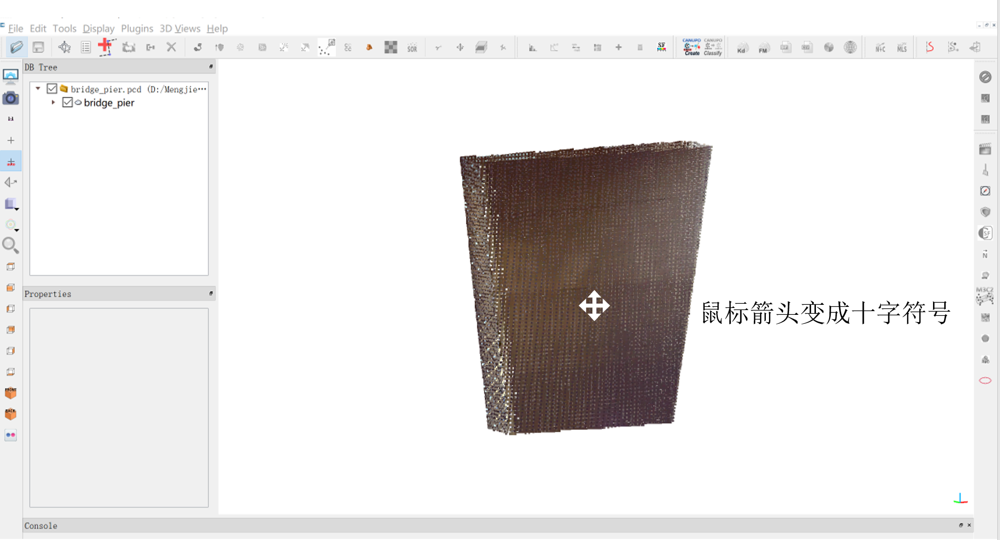

​                                                                       图 2-1-16：鼠标箭头变化

移动鼠标，此时始终点击右键，不要松开，即可拖动点云文件进行平移，如图 2-1-17：

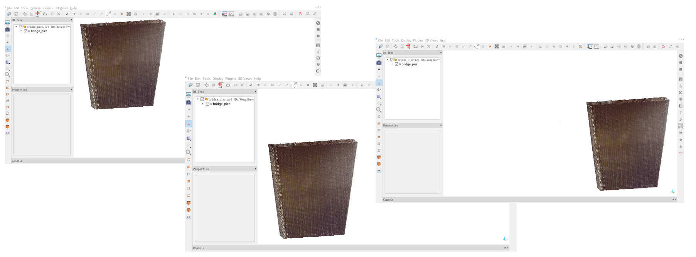

​                                                                            图 2-1-17：平移视图

- **放大/缩小：将点云进行放大或缩小：**

  滑动鼠标滑轮，向上点云视图会被放大，反之，向下点云视图会被缩小（放大我们可以看清楚 “点的集合” 概念的体现；缩小会看清楚整个点云的形态结构）。如图 2-1-18：

  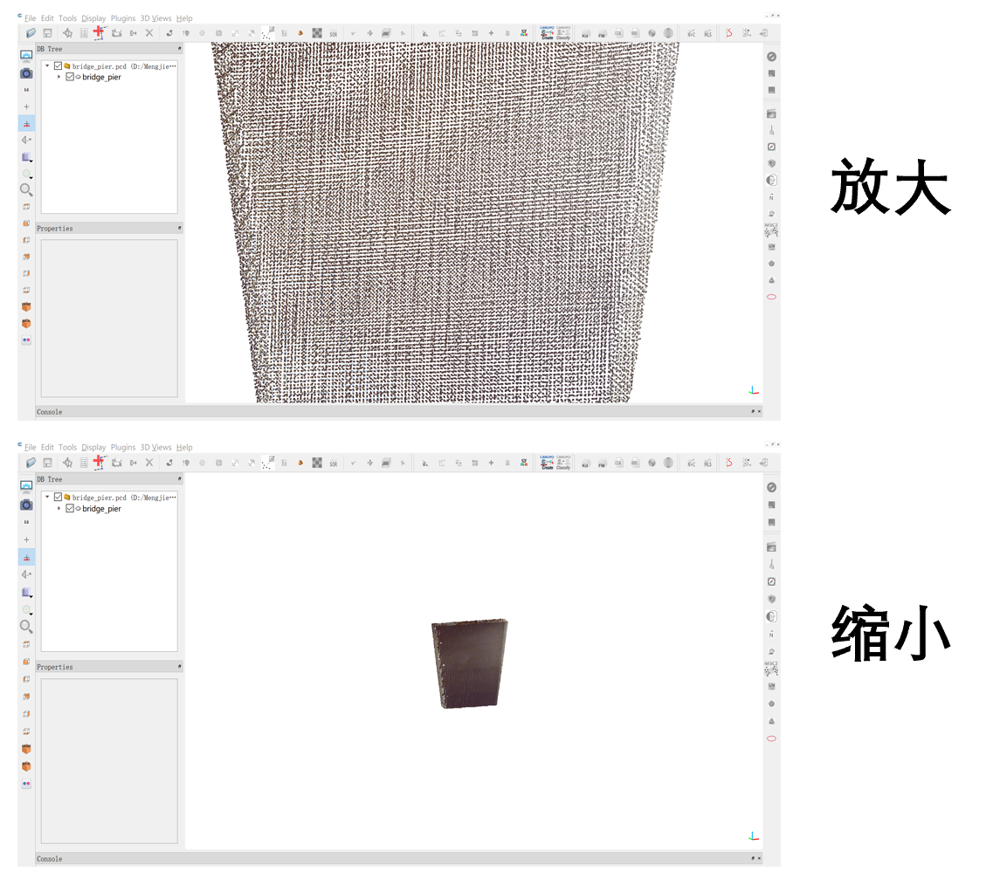

​                                                                 图 2-1-18：放大/缩小视图

###### 正交视图和透视视图

CloudCompare 有两种点云实体视图法：正交视图和透视视图，这两种视图的本质区别在于是否所有的平行棱永不相交：

在正交视图中，平行棱永不相交；然而在透视视图中，有些平行棱会出现相交的情况。

为什么平行棱还会相交？其实这种情况非常普遍。如图 2-1-19，实际生活中平行的道路两边在视图或视角中会汇集到一个交点：


​                                                                     图 2-1-19：平行棱相交示意图 

以 **rabbit.pcd** （见教程文件夹）为示例文件：

- 正交视图：Orthographic view，正交视图下点云的 Bounding Box 的平行棱（如图 2-1-20 中的橙色线）永不相交，正交视图为 CloudCompare 的默认视图：

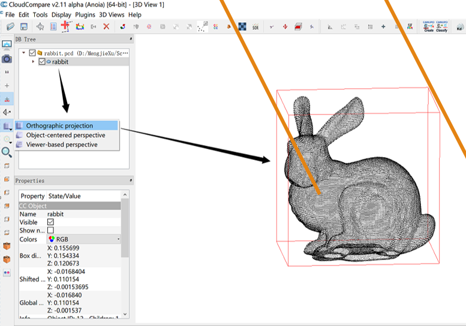

​                                                                      图 2-1-20：正交视图示意图

- 透视视图：Perspective view，将 3D 物体投影到 2D 界面，就像人眼或者摄像机看到的一样，不符合平行棱永不相交。视图情况如图 2-1-21 和 2-1-22，CloudCompare 中提供了两种透视视图：

  第一种透视视图叫做 Object-centered 。它是指以物体为中心，当我们点击鼠标左键进行旋转时，物体会在固定的视点（比如摄像头）坐标系下移动，滑动鼠标滑轮可以放大或缩小物体视图；


​                                                图 2-1-21：透视视图示意图 1 (Object-centered)

第二种透视视图是 Viewer-based。它是指以基于视点（比如摄像头）进行旋转，当我们点击鼠标进行旋转时实际是在旋转视点（镜头，摄像头），鼠标滑轮控制点云实体距离视点的距离。

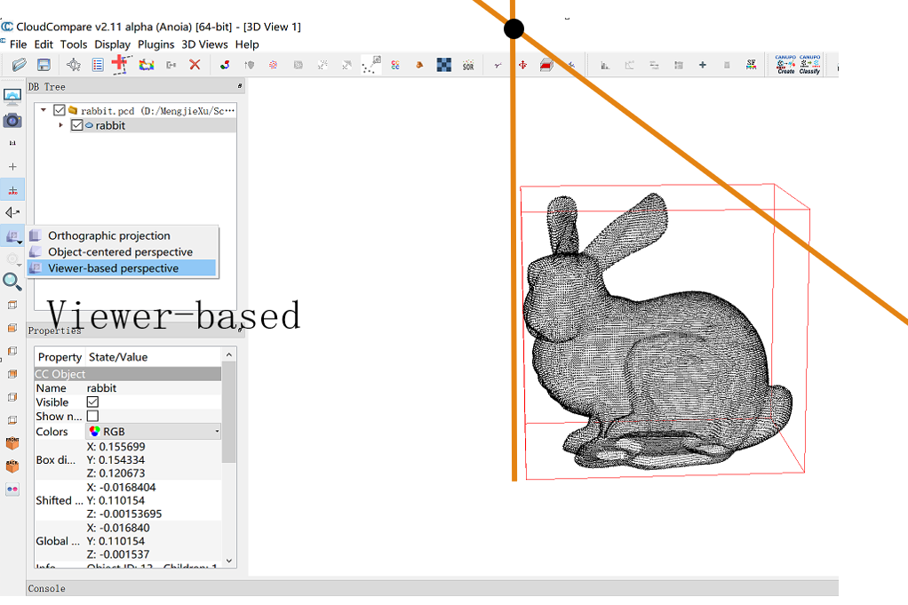

​                                                  图 2-1-22：透视视图示意图 2 (Viewer-based)

在这种透视视图下进行平移操作会与正交视图的平移不同。当我们鼠标右移时，点云却移到左边。这是因为**视点**向右平移而不是点云本身向右平移，当视点向右平移后，点云**相对地**向左平移了，因此会出现左移的效果视图。

最后给大家补充几个快捷操作：

###### 快速查看不同角度视图：

我们可以通过点击鼠标左拖动点云进行各方位的视图，CloudCompare 中有一类按钮可以实现快速地跳转到某个方位视图（正视图，左视图，右视图等）。如下图所示，从上到下依次是 **set top view，set front view，set left side view，set back view，set right side view，set bottom view：**


​                                                       图 2-1-23：快速查看不同角度点云视图

> 注意：这几个视图**不是**我们**人为分辨**的前面、后面、左面、右面、上面、下面，而是根据点云中点的坐标轴和坐标值来确定的。比如 top view 就是指的点云投影在 XY 平面上的点，而不是我们认为的兔子头顶部分就是 top view。
>


#### 2-1-3 ：读取文件内部信息

上一节我们介绍了 CloudCompare 中的打开文件和视图方法，CloudCompare 还可以读取这些文件的重要信息，本节主要讲解如何通过 CloudCompare 读取 2-1-2 中打开的 **bridge_pier.pcd** 文件内部重要信息。

与查看 Bounding Box 的操作一样，首先选中 Cloud Compare 左侧 **DB Tree**下的 **“bridge_pier"**，如图 2-1-24 左上方第一个紫框内，这时下方的 **Properties** 中会出现关于打开的这个文件的相关信息：

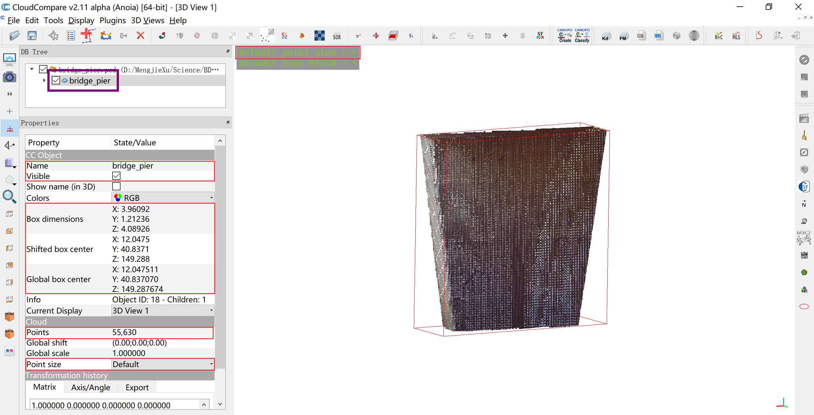

​                                                        图 2-1-24：CloudCompare 视图中点云信息解读

下面是对 **Properties** 中红框内重要属性的解释：

**Name:** 点云文件名称，示例文件的文件名称是 "bridge_pier"；

**Visible：**选中即为在右侧画布中可以看到点云文件，如果没有勾选则右侧不会显示点云文件的视图；

**Box dimensions：**显示右侧点云 Bounding Box 的尺寸大小；

**Shifted box center：** Bounding Box 的旋转移动中心；

**Global box center：**Bounding Box 的全局中心；

**Points：**此点云文件的总点数，这里代表示例文件一共 55630 个点；

**Point size：**显示在右侧画布中的点云文件每个点的大小，这里是 Default，也就是默认值。点击Default 右侧的下拉按钮，可以选择不同 size 的点大小。除此之外，默认点的大小还有另一种调整方式：将鼠标移至画布左上方，会出现两行绿色字母。如图 2-1-24 所示，点击第一行 “default point size” 后面的 “ + ” 或者 “ - ” 都可以调整点云的默认大小。

> 注意：Point size 对于视图时点的大小起到决定作用；Default point size 只是改变了默认点的大小，只有 Point size 选择 Default 时才会体现默认点大小；如果 Point size 选择 1，那么无论 Default point size 改成多大，点云视图中依旧显示 1 大小的点。

其他格式点云文件（前提是该文件格式可以在 CloudCompare 中视图，在 2-1-2 中最后部分介绍过可以用 CloudCompare 打开的点云文件格式）也是在 Properties 进行解读。


#### 2-1-4：设置颜色

> 从本节开始，我们介绍的操作都是对选中的点云进行一些改变。如果想保留原始点云，那么用软件 CloudCompare 做的任何改变原始点云的操作，都可以直接**另存为**一个新的点云文件而不用覆盖原始文件。

有的时候点云文件（pcd 等只存储点信息的文件或 ply 等可以存储点和拓扑信息的文件）、Bounding Box 与画布背景颜色可能区分度不大，比如都是同一色系，给我们的视图造成一定的影响。此时我们可以通过调整画布/点云/ Bounding Box 的颜色，方便视图，以 **bridge_pier.pcd** 和 **horse.ply** 为例（见教程文件夹）：

##### 改变画布背景颜色：

如果点云文件的颜色信息是我们处理的重点，那么我们可以通过改变画布背景颜色进行调整。

图 2-1-25 为原始白色背景下的视图。

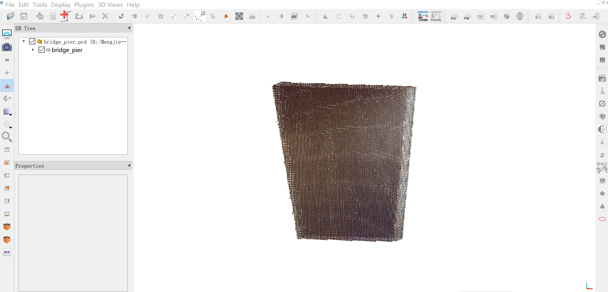

​                                                                             图 2-1-25：原始视图

图 2-1-26 是更改背景颜色的设置过程。

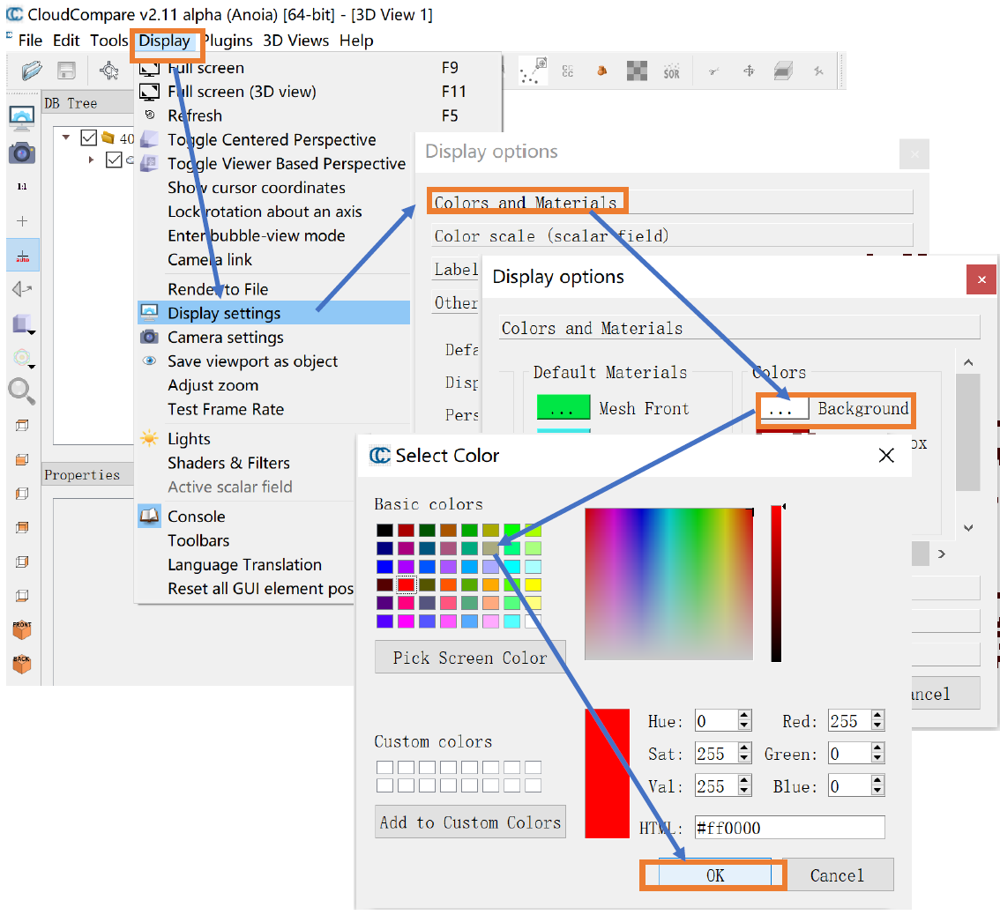

​                                                                         图 2-1-26 ：背景更改设置

图 2-1-27 为更改背景颜色后的视图。

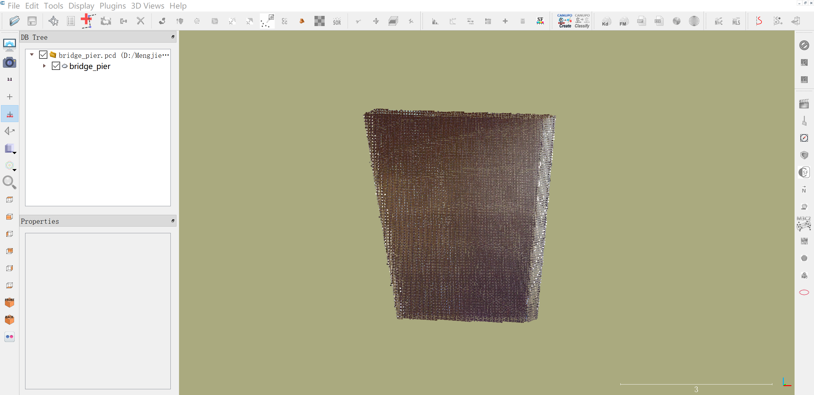

​                                                                     图 2-1-27：更改背景后的视图

这里颜色只是一个举例，可以根据自己的实际情况进行不同颜色的选择。

> 注意：设置背景颜色时可以勾选 display gradient background 或不勾选，如果勾选，会显示渐变背景，否则是纯色背景：
>
> 
>
> ​                                                                     图 2-1-28：渐变颜色设置


##### 改变点云颜色：

如果点云文件的颜色信息并不是我们处理的重点，那么我们可以通过改变点云本身的颜色进行调整。（需注意该操作会**覆盖原始颜色**，如果想保留原始文件颜色，可以将改变颜色后的文件另存为新的文件）。

接下来我们以两种不同的文件格式为例，这两种文件格式所存储的信息有所不同（详细讲解见第三章）。

###### PCD 等只存储点的信息的文件：

首先介绍的是对于只存储点信息的 PCD 文件的颜色设置，如图 2-1-29：


​                                                                       图 2-1-29 ：点云颜色设置

左边是原始桥墩的视图截取；中间是我们处理点云颜色的过程操作；右边是处理之后的点云，即在视图中变成红色。此时如果你不保存这个文件，只是在视图中改变它的颜色，那么原始的点云文件是不会被改变颜色的。

###### PLY 等可以存储点和拓扑信息的文件：

CloudCompare 中针对 PLY 等可以存储点和拓扑信息的文件也可以进行颜色设置，以 **horse.ply** 为例（这里的 **horse.ply** 里存储的这种数据还有另一个名字 —— mesh 文件，即网格模型），有两种方法。两种方法的区别在于改变的是当前选中的文件视图颜色，还是设置之后全部文件颜色都发生变化：

**法一：**

路径：**Display → Display settings → Colors and Materials：**

PLY 等可以存储点和拓扑信息的文件也可以在 CloudCompare 中改变视图颜色。默认存储 mesh 文件的正面颜色（Mesh Front）是绿色，背面（Mesh Back）颜色是蓝色（正面背面是当文件含有法线信息时才会体现，如果没有法线信息，就默认只有正面的颜色）。如图 2-1-30，可以通过红框进行默认颜色设置，设置之后，在 CloudCompare 中打开的所有 mesh 文件都会改变颜色：


​                                                                        图 2-1-30：文件颜色设置 1

**法二：**

**选中文件 → Edit → Colors → Set Unique → Select Color → OK**，当前画布中的文件颜色发生改变。这里我们选取 **horse.ply** 头部虚线框内进行放大，可以清楚地看到网状模型的网格结构（将软件左侧 Properties 中的 Wireframe 打勾）：

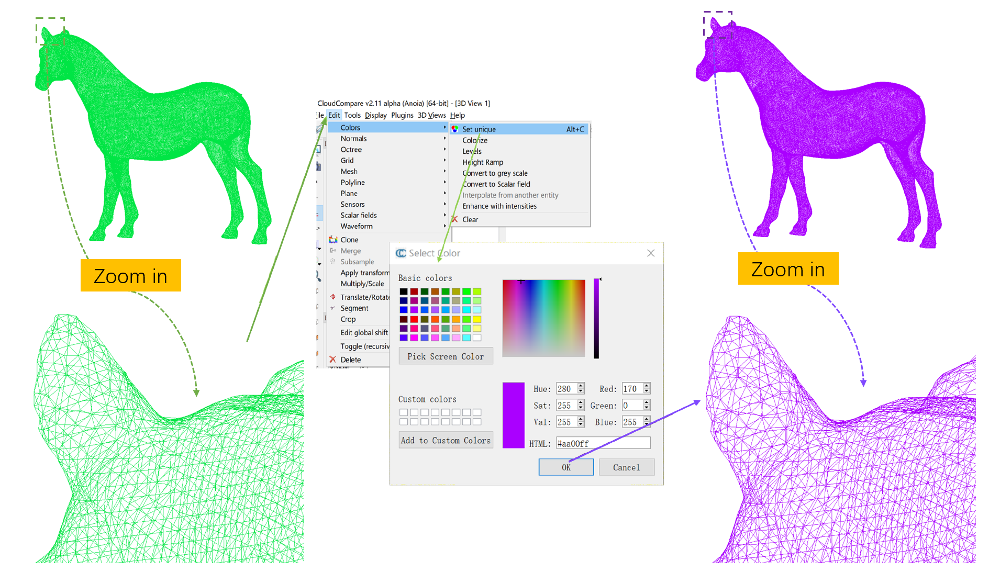

​                                                                     图 2-1-31：文件颜色设置 2

综上，法一适用于改变默认颜色设置后的所有文件；法二只对当前选中的文件起到改变颜色的作用。


##### 设置 Bounding Box 颜色：

对于 CloudCompare 中提及的 Bounding Box，也可以进行颜色的设置，以便更清楚地看到几何体的范围。图 2-1-32 点云的 Bounding Box 从红色设置为黑色：

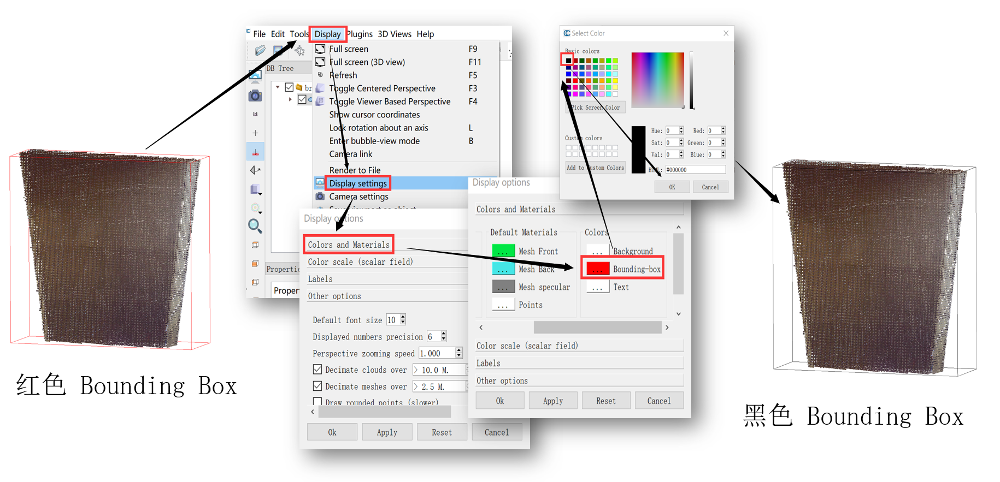

​                                                               图 2-1-32：Bounding Box 颜色设置


#### 2-1-5：点云切割

**Computer Vision** （计算机视觉）其实就是让计算机自动读懂一张图或者一个场景。放在点云背景下，就是让计算机像人一样读懂一个场景的点云。对于一辆车的点云，基于自身储备的知识，人可以马上认出这是一辆车，可以指出它有轮子等等。我们可以根据需求，找出感兴趣区域 (**Region of Interest, ROI**)，即提取出一个特定的点云区域。ROI 因情况而异，可以是一辆车点云的一个轮子，或者车引擎盖的一片点，也或者是车旁边的一些无关点。

假设我们后续处理只需要一部分点，比如只需要一个轮子的点云（如图 2-1-33），那么首先就需要提取这个轮子，即 ROI。当然有时候，ROI 也可以就是我们想移除的噪音／无关点后剩余的点云（如图 2-1-34）。所以，其实很多时候我们清理点云去除无关点，也就是在选择 ROI。鉴于上述场景，**点云切割**便可以实现提取 ROI。

> 注意：从机器视觉识别监测物体的角度来说，不是每次处理点云都非要移除**非 ROI**。其实找 ROI 就是一个识别问题。这里只是用 CloudCompare 手动操作了点云切割这一步。

比如下图中的车，我们的感兴趣区域是后车轮，因此我们希望将车轮从原始点云中切割出来，单独研究。


​                                                                     图 2-1-33：车轮是 ROI

下图 2-1-34 是一张桌子的点云场景，其中黑框内的点是与点云主体即桌子部分无关的点，我们希望能够将这些点选中然后去除。


​                                                                       图 2-1-34：无关点是 ROI

除此之外，当我们希望将点云按照语义分割（**Semantic segmentation**）成小的个体时也会用到这种思路。点云处理其实跟2D 图片的处理本质上是一样的，只是处理方式不同。2D 图片的语义分割旨在理解图片，将图片按语义划分区域。比如给出一张照片，如图 2-1-35，机器判断后应当能够将汽车和建筑物以及树木等物体用不同颜色标注：

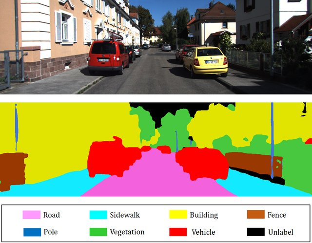

​                                                                       图 2-1-35：2D 语义分割[^7]

同理，3D 语义分割也是一样，旨在理解一个 3D 场景，将其按语义划分区块。

如图 2-1-36 ，是众多 3D 几何体的语义分割示意图，不同部件都用不同的颜色进行了标注：例如左上角的椅子，将椅背（back），座位（seat）以及椅腿（leg）分别用紫色、蓝色和绿色标注。

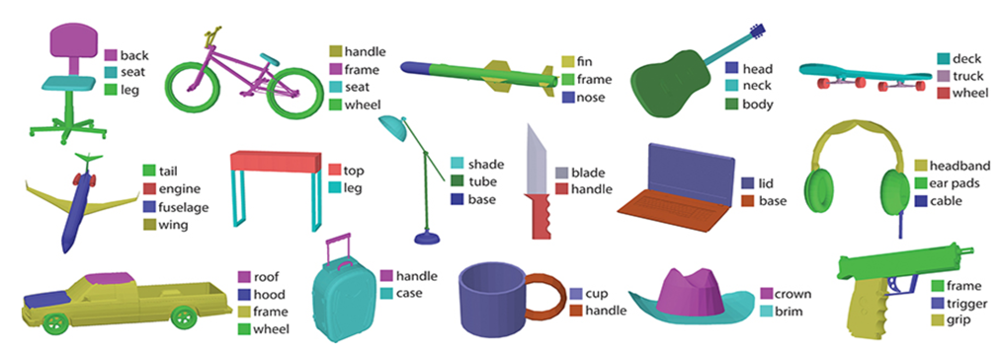

​                                                                       图 2-1-36：3D 语义分割[^8]

三维点云是三维物体的一种重要表达方式之一，因此它也可以实现语义分割。如图 2-1-37 是三维点云的语义分割示意图，桥体部分被分割成了不同部件（由不同颜色表示）。

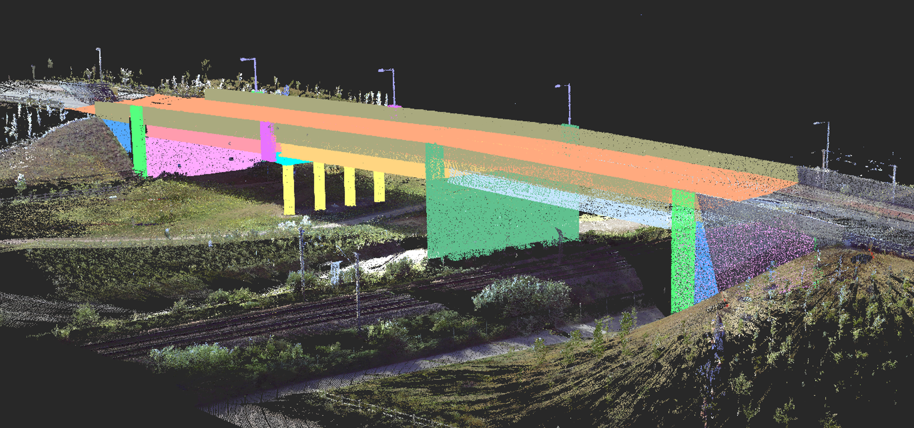

​                                                                       图 2-1-37：语义分割

如何运用 CloudCompare 进行点云切割呢？

##### 方法一：该方法主要使用于对点云进行大面积修剪

首先将 **bridge.bin** 导入 CloudCompare 中，点击 **DB Tree** 下的 “**bridge**"，选中我们要进行 Cropping 的点云文件。点击 **Cross Section**，可以看到几何体被一些彩色的立体箭头框住，可以旋转点云看到各个角度的视图（如图 2-1-38 中左侧 **Rotate point cloud** 视图）。

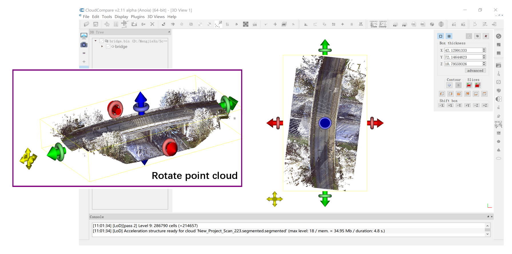

​                                                                   图 2-1-38：Cross Section 视图

我们看到 **bridge.bin** 桥的主体周围还有一些其他的马路，树木等**非 ROI**区域，因此我们想要使用大面积修建将这些无关场景删除，操作如下：

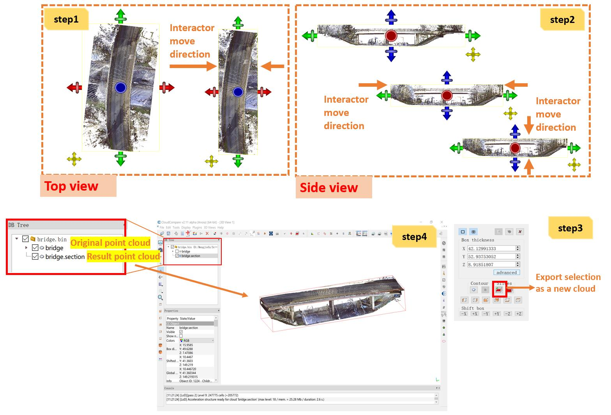

​                                                              图 2-1-39：Cross Section 操作过程

通过拖动这些彩色箭头，便可以整齐的削去部分点云。图 2-1-39 中进行 step1 和 step 2 拖动箭头的操作，将非 ROI 截去后，点击图 2-1-39 中 step3 红色框内的 **Export selection as a new cloud**，DB Tree 中的**bridge.section** 就是切割后的点云文件。可以看到 Result point cloud 已经比较干净。


##### 方法二：该方法主要用于对点云进行精细修剪

对于利用方法一进行大面积修剪后的 **bridge.section**，如果此时我们的 ROI 是其中的一个桥墩，那么可以使用 **方法二：精细修剪** 来得到，操作如下：

首先点击 **DB Tree**下的 “**bridge.section**"，选中我们要进行 Segment 的点云文件；点击软件剪刀图标（**Segment**）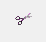；然后多次点击鼠标左键，框住你想要分割的部分；最后点击鼠标右键，固定你所框住的这个形状（比如图 2-1-40 step 1 中放大视图的绿色多边形）。选定 **Segment In** 或者 **Segment Out** 之后，点击 **Confirm segmentation**，会在 DB Tree 中出现两个文件，便是分割好的文件 *.segmented 和保留的文件 *.remaining。

图 2-1-40 中我们进行了两次切割：

step 2 先得到 **bridge.section.remaining** 和 **bridge.section.segmented**；

step 5 是针对 **bridge.section.segmented** 进行，因此得到 **bridge.section.segmented.remaining** 和 **bridge.section.segmented. segmented**：

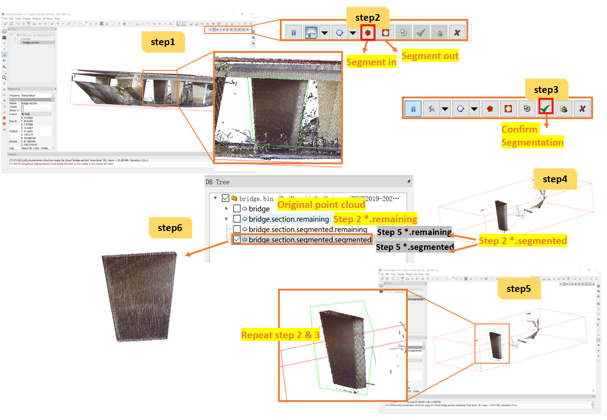

​                                                                 图 2-1-40：Segment 操作过程

> 注意 1：
>
> Segment 往往要多次进行才能将我们想要分割的部分切割出来，如上述图 2-1-40 便切割了两次。
>
> - **Segment in** 是指当前绿色框内的部分作为分割出去的部分，即为 *.segmented 文件；而绿色框外的为保留文件，即为 *.remaining 文件；
> - **Segment out** 是指当前绿色框内的部分作为保留的部分，即为 *.remaining 文件；而绿色框外的为分割出去的文件，即为 *.segmented 文件；
>
> 下图是简单 *.remaining 和 *.segmented 示例，以 **bridge_pier.pcd** 为例：
>
> 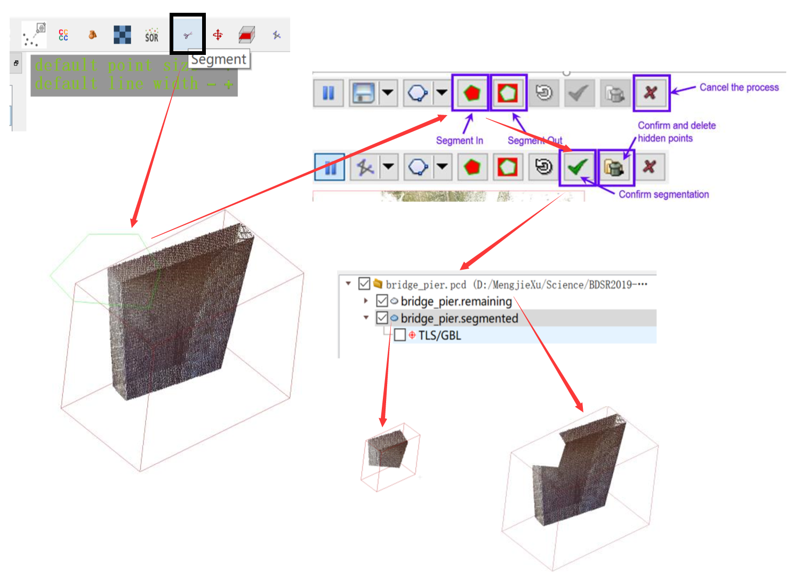
>
> ​                                                   图 2-1-41：*.remaining 和 *.segmented 示例
>
> 这里我们点击的是 Segment in，因此将绿色框内的作为切割的点云，而绿色框外的作为保留点云。即 **bridge_pier.remaining** 对应剩下的右半部分点云，**bridge_pier.segmented** 对应绿色框框住的点云左上角。
>
> 注意 2：如果多次裁剪会生成很长的文件名 ***. segmented. segmented. segmented. segmented…. 提醒一下，这样是不推荐的，如果剪裁操作太多，软件容易崩溃。所以最好存一下中间文件，然后再重新打开中间文件继续裁剪。

对于上述两种方法，方法一适用于大面积修剪，方法二适用于精细修剪。使用频率上来说，方法二用的更多，也更加实用。


##### 补充内容：旋转平移改变点云坐标

> 举例说明这种需求对应的一个应用场景如下：旋转点云坐标
>
> **坐标系均为红色长方体的局部坐标系（Local coordinate system）**
>
> 以文件 **cuboid.pcd** 为示例文件（见教程文件夹）：
>
> 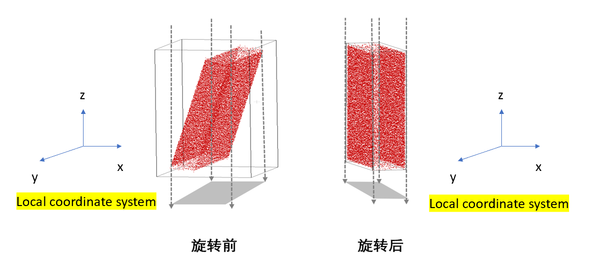
>
> ​                                                                      图 2-1-42：旋转点云坐标
>
> 如果我们想选取图 2-1-42 中的红色长方体局部坐标系下的 xy 投影面进行研究，我们发现**旋转坐标前**的竖直投影区域（灰色区域）大于**旋转后**的竖直投影区域，且二者形状不同，**旋转前**的 xy 投影面已经发生了形状变化，无法实际反应红色长方体的结构信息。
>
> 注意：大家不要把这里的旋转平移坐标与我们之前介绍点云在 CloudCompare 中视图的旋转平移混淆。之前在 2-1-2 节介绍的旋转平移是指的为了方便视图，我们对点云呈现在画布上的**相对坐标**进行了旋转（也可以理解是在旋转坐标系），但这些点云中每个点的坐标没有发生变化；而我们这里的旋转平移是在改变点云的**绝对坐标**，因此经此改动后，点云中每个点的坐标都会发生相应改动。
>
> 下面介绍改变坐标的操作：选中要进行操作的点云 → 按钮 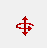
>
> 
>
> ​                                                                      图 2-1-43：改变坐标操作
>
> 其中 Rotation 后面的下拉框可以选择围绕 XYZ 三个轴或 X 或 Y 或 Z 轴旋转坐标；Tx，Ty，Tz 可以勾选其中的任意一个或两个或全选，意思是沿着选定的轴可以进行坐标的平移。两种操作中未选中的轴方向无法旋转或平移。


#### 2-1-6：降采样

第一章提到：通过扫描获取点云数据的过程就是对物体表面进行 **采样** 的过程。

后续点云处理可以对原始采样进行改变和调整，操作有很多种，大致可分为： **降（下）采样、重采样、上采样**。

- **降（下）采样：**减少原始点云数目，使得降采样的结果点云是原始点云的子集；

- **重采样：**对点云进行重新采样，这一操作可能会改变原始点云的结构信息，重采样的结果点云不一定是原始点云的子集；

- **上采样：**与降（下）采样相对，即增加原始点云数目，使得上采样的结果点云比原始点云的点数更多。

这里我们重点介绍降采样，关于重采样我们会在 2-1-7 介绍。

**降采样** 是处理点云过程中一个非常重要的步骤。有的时候我们实际获取的点云文件非常庞大，比如一个真实桥体点云会有 2 到 3 个 G 大，如果我们使用这种文件进行实验或开发算法，会大大降低效率。因此我们可以选择对文件进行降采样，减少点云文件的点数，方便处理。

降采样实质就是一个从点多到点少的过程，最终得到的点云是原始点云的子集。降采样得到的点的坐标、颜色等信息依旧对应它们在原始点云中的信息，如图 2-1-44：

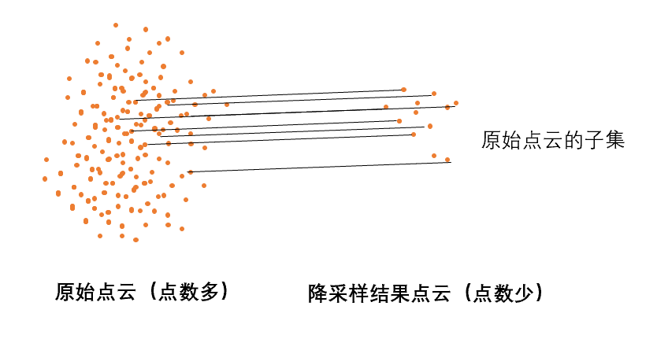

​                                                                        图 2-1-44：降采样示意图

这里我们先看看在 CloudCompare 里如何进行点云降采样。我们还是用一个桥墩来做解释。将 **bridge_pier.pcd** （见教程文件夹）拖入 CloudCompare，选中  **bridge_pier.pcd**，选择图 2-1-45 中 **Subsample a point cloud** 图标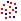 。

CloudCompare 提供了三种降采样方法：Random, Space, Octree。下面我们分别介绍这三种降采样方法：

##### Random：

Random 降采样即随机降采样。我们需要设置保留的点数，如图 2-1-45 中 **remaining points**：10000。

图 2-1-45 中左边是原始包含 55630 个点的点云，右边是降采样后得到了 10000 个点的点云，可以看到右边的文件明显稀疏了:


​                                                                      图 2-1-45：Random 降采样

**优点：**Random 降采样原理简单，随机选择点作为留下的降采样结果点云，只需设置保留点数即可；

**缺点：**Random 降采样没有侧重点，对于整个点云随机选取，重要部分信息可能会丢失。


##### Space：

Space 降采样是根据**距离**进行降采样，需要我们设置的是点与点之间的最小距离：即图 2-1-46 中红色框内我们设置 **min. space between points** 为 0.1（单位：m）—— 也就是点与点之间的距离最小是 0.1m（该参数数量级的设置可参考几何体 Bounding Box 尺寸范围）。降采样的结果点云中任意 2 个点的距离都必须大于等于 0.1。下图中左侧为原始点云，右侧为利用 Space 降采样后的点云：


​                                                                     图 2-1-46：Space 降采样

**Use active SF：**

Space 还有一个可选框 **Use active SF**，SF 是 Scalar Field。点云中有很多 Scalar Field，比如曲率 curvature，置信度 confidence 等。我们可以根据这些 Scalar Field 的值进行 space 距离的设置，而不是对整个点云都进行统一距离的设置。

> 注意：只有点云文件本身含有这些 Scalar Field 信息时，Space 降采样中的 Use active SF 才可以执行，否则这个按钮是灰色的。比如我们的示例文件 **bridge_pier.pcd**，本身不含有 Scalar Field 信息，因此在选择 space 降采样时，Use active SF 是灰色的，无法执行。

最直观的例子是根据不同的 curvature 设置不同的距离阈值：curvature —— 曲率，通俗来讲就是弯曲程度。某些点云表面纹理复杂如雕塑或其他表面不平整的物体，这些区域的曲率会比其他相对平坦的表面大。曲率大的区域意味着其包含的几何信息更丰富。越简单的面可以用少量点，或仅仅用三个点来描述（如平面）；而越复杂崎岖的平面需要越多的点去描述其几何性质。也就是说，曲率可以作为区别表面几何复杂度的一个指标：曲率越小，点云表示的面越平坦，几何复杂度越低；相反，曲率越大，点云表示的面变化度越大，越崎岖，几何复杂度越高。

下面通过两个例子来说明 Use active SF，此时的 SF 是 curvature：

***示例一：***

如果我们的文件中含有的 Scalar Field 为 curvature，则图 2-1-47 中的 SF value 就是 curvature value；Spacing value 就是 curvature 对应的两点之间最小距离的阈值（单位：m），Spacing value 的设置可以参考该几何体 Bounding Box 的尺寸范围：

- 曲率小的部位距离阈值大：对应下图中 SF value 为 1.624 时，Spacing value 设置为较大的 10；
- 曲率大的部位距离阈值小：对应下图中 SF value 为 10.7988 时，Spacing value 设置为较小的 0.1；

达到一种曲率大的边缘保留较多点，而曲率小的平面保留较少点的效果：

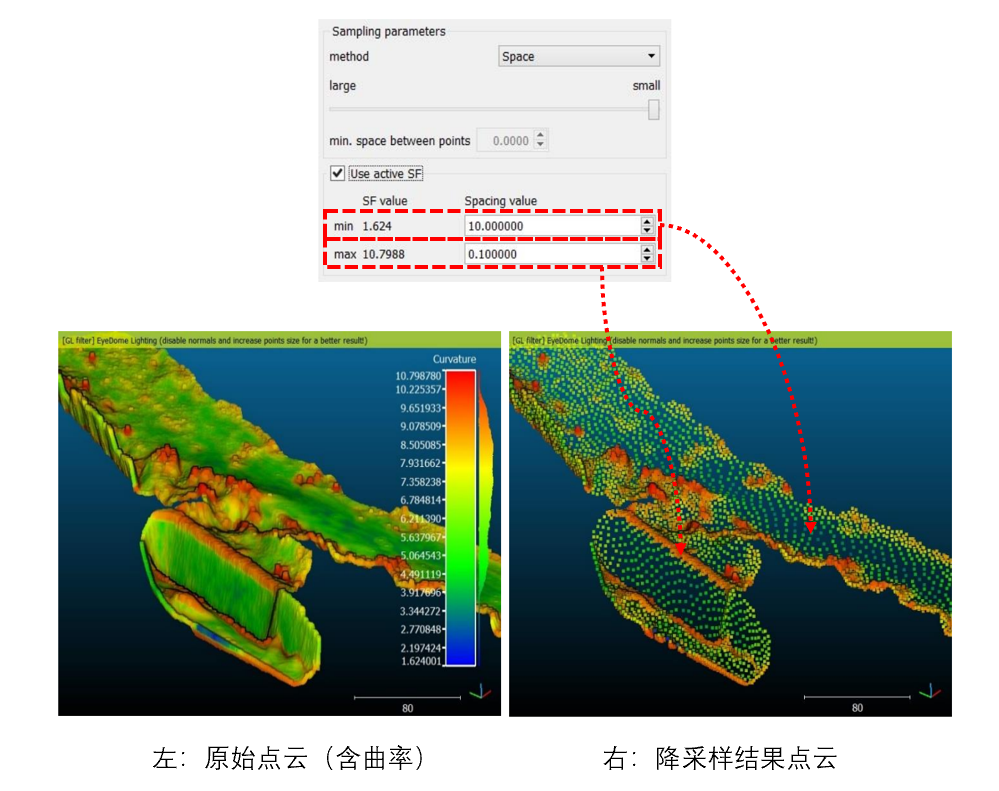

​                                                                图 2-1-47：Use active SF 示例一 [^9]

***示例二：***

我们用一个长方体 **cuboid_normal.pcd** 文件（见教程文件夹）为演示文件，该文件中包含 curvature 这个 SF，如图 2-1-48：

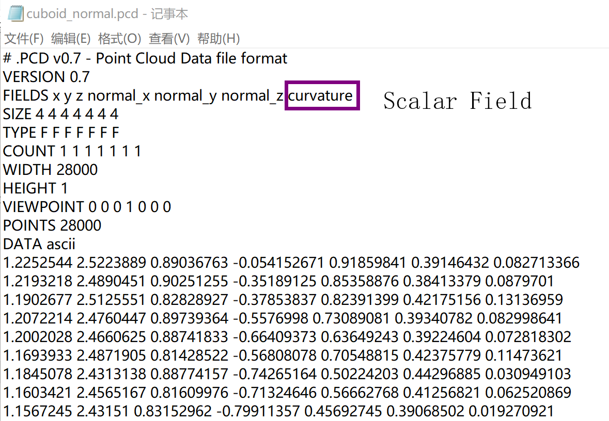

​                                                     图 2-1-48：**cuboid_normal.pcd** 内部信息

- 曲率小的部位距离阈值大：对应下图中 SF value 为 1.10697e-5 时，Spacing value 设置为较大的 0.05；
- 曲率大的部位距离阈值小：对应下图中 SF value 为 0.154106 时，Spacing value 设置为较小的 0.0001；

达到一种曲率大的边缘保留较多点，而曲率小的平面保留较少点的效果，如图 2-1-49：

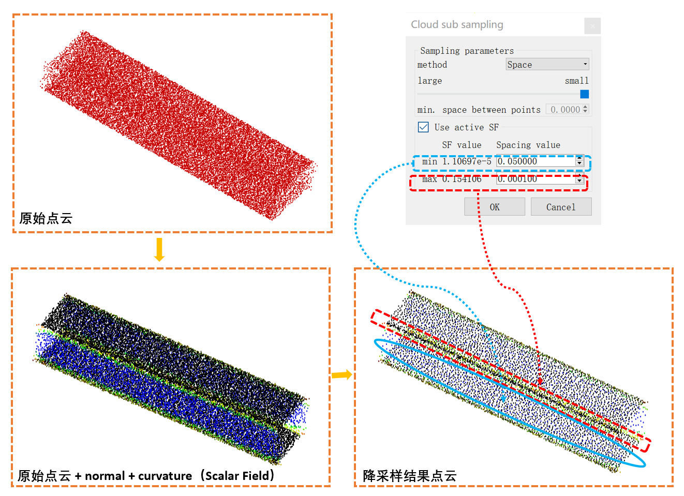

​                                                                       图 2-1-49：Use active SF 示例二

> 注意：图 2-1-49 中的 **“原始点云 + normal + curvature (Scalar Field)“** 颜色呈现的是 curvature 和 normal 的信息，如图 2-1-50：
>
> 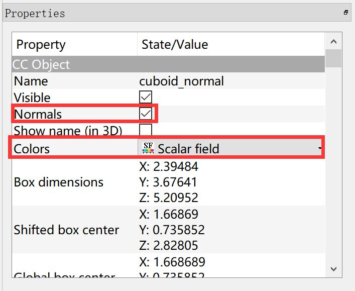
>
> ​                                                         图 2-1-50：normal 和 curvature 显示
>
> 我们在 Properties 中勾选 Normals，并且 Colors 选择 Scalar Field（这里的 Scalar Field 就是 curvature）
>
> 之所以显示二者的信息，是因为要计算 curvature 必须要先计算 normal，我们会在第四章详细介绍。


##### Octree：

Octree 降采样，又称 “八叉树” 降采样，与 “二叉树” 对应：二叉树每个节点的子节点最多有 2 个，而八叉树每个节点最多有 8 个子节点。八叉树的不断划分的过程实质是小立方体不断均分的过程，如图 2-1-51。这些小立方体又被称为 **"体素"**：


​                                                                             图 2-1-51：Octree 原理

图 2-1-51 左侧的立方体个数与右侧每层的圆圈个数和颜色相互对应。

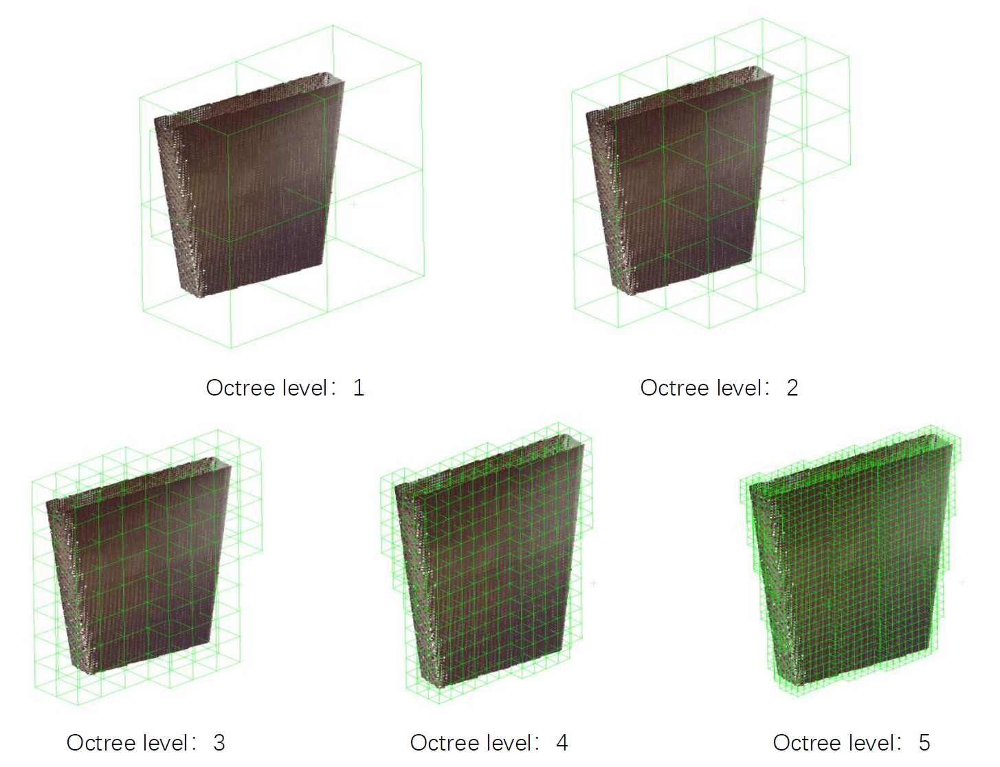

​                                                                             图 2-1-52：level 1-5

图 2-1-52 是不同 level 的立方体视图，可以看到随着 level 的增加，立方体个数不断增加，小立方体边长在不断减小。除此之外，有些小立方体因为本身不包含任何原始点云中的点，在采样过程中被剔除。如下图 2-1-53 所示。其中，黑色点表示原始点，红色点是每个体素的几何中心点，蓝色是保留的点。


​                                                             图 2-1-53：Octree 降采样步骤

图 2-1-53 步骤解释：

step1：用一个小立方体框住原始点云；

step2：设置 Octree level，这里 level = 1，将大立方体划分成了八个小立方体。如果某个小立方体内没有原始点云的点，则该立方体被删除。图 2-1-53 中 level 1 划分的这八个小立方体都有点，因此都被保留下来没有删除。

step3：Octree 降采样核心步骤 —— 在 Octree 降采样的过程中，我们只保留离每个体素中心（图 2-1-53 step3 红点）最近的点（图 2-1-53 step3 蓝色虚线圈内的点），即每个小立方体只保留一个点。

最终得到包含八个点的 **Result point cloud**。

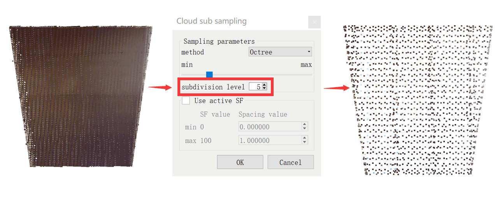

​                                                                      图 2-1-54：Octree 降采样

图 2-1-54 是我们在 CloudCompare 中设置 Octree level —— 也就是这里的 **subdivision level** 为 5 后的降采样：左侧为原始点云，右侧为结果点云。Level 越高，立方体划分越精细，降采样得到的结果点云点数越多。

> 注意：不同版本的 CloudCompare 中 subdivision level 最大值不同，64 位计算机系统对应 level 最大值为 21；而 32 位计算机系统对应最大值为 10。


#### 2-1-7：重采样

在 CloudCompare 中可以通过 Octree 进行重采样，大家一定会联想到 2-1-6 降采样中的 Octree 降采样。Octree 降采样与 Octree 重采样的思路基本一致，区别在于：

Octree 重采样是保留划分后的每个小立方体中所有点的**重心**。而不是每个立方体中距离立方体中心最近的点。

参考链接：[https://www.cloudcompare.org/doc/wiki/index.php?title=Octree%5CResample](https://www.cloudcompare.org/doc/wiki/index.php?title=Octree\Resample)

> 注意：Octree 重采样是新创建了一个与原始点云不同的新点云，因此它可能不会保留原始点云的重要特征，比如颜色、法线、曲率等。如果想要保留这些信息，可以考虑 Octree 降采样。

下面演示如何在 CloudCompare 中进行 Octree 重采样，以 **rabbit.pcd** 为例：

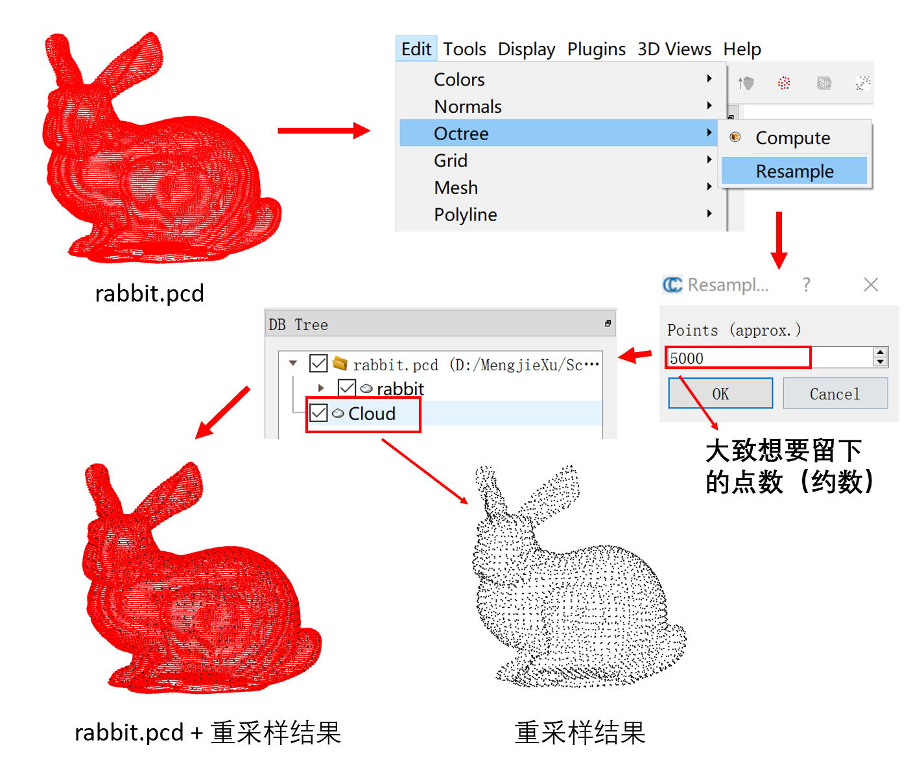

​                                                                          图 2-1-55：Octree 重采样

从图 2-1-55 中我们可以看出，重采样结果的点（黑色）与原始点云（红色）有很多不重叠的点，也即重采样的结果不是原始点云的子集。


#### 2-1-8 ：计算距离

CloudCompare 支持两大类距离计算：Cloud-to-Cloud 和 Cloud-to-Mesh，顾名思义，前者是两个点云之间的距离，后者是一个点云与一个网格模型之间的距离。该距离往往可以用来作为判断相似度，或者计算两个文件之间的欧氏距离。

##### Cloud-to-Cloud Distance：

下图是 CloudCompare 计算 Cloud-to-Cloud Distance 的原理，默认距离是计算每个点与另一个点云距离最近的点之间的欧氏距离，也即 nearest neighbor distance，如图 2-1-56：

nearest neighbor distance 辅助学习链接：https://en.wikipedia.org/wiki/Nearest_neighbor_search

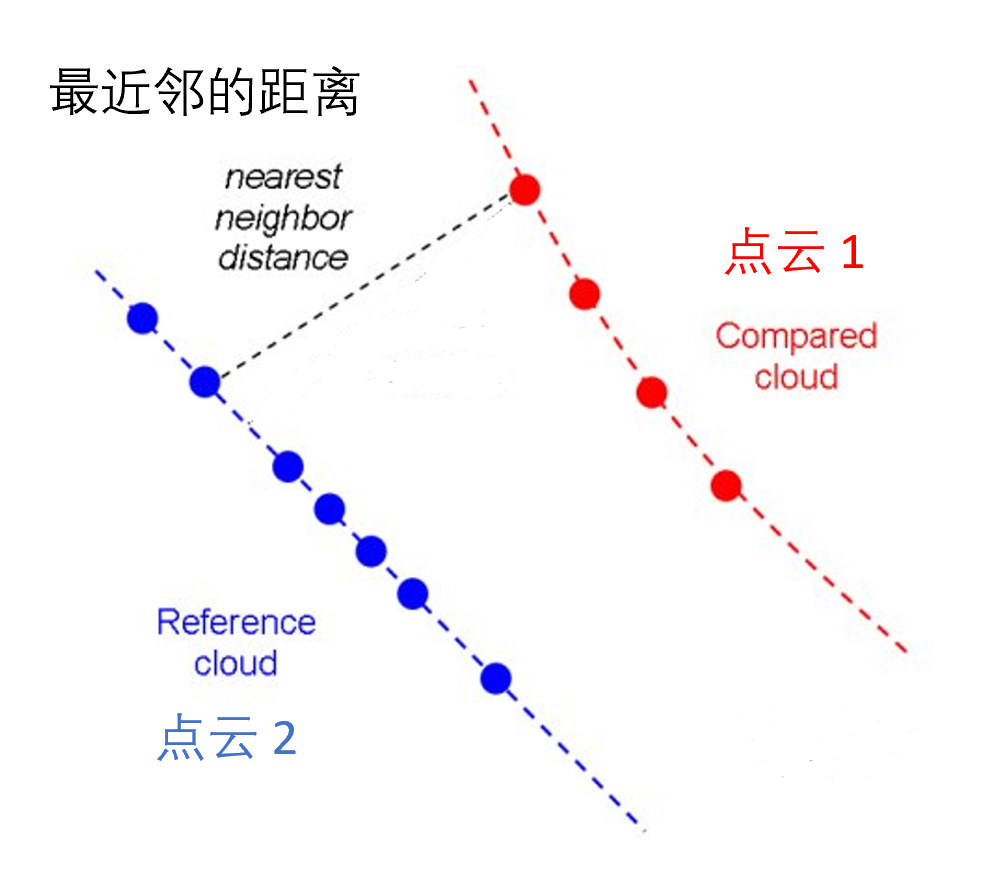

​                                                          图 2-1-56：Cloud-to-Cloud Distance[^9]

图 2-1-56 中的 Compared cloud 与 Reference cloud：

我们计算距离时，是根据 Compared cloud 中的每个点，去寻找 Reference cloud 中距离 Compared cloud 这些点最近的点，计算点与点之间的距离，然后计算全部距离的平均值，得到最终的 Cloud-to-Cloud Distance。

下面我们以计算 **rabbit1.pcd** 与 **rabbit2.pcd** （见教程文件夹）之间的距离为例，如图 2-1-57：

> **rabbit2.pcd** 是 **rabbit1.pcd** 经过 Octree 重采样得到的，二者相似但不完全一样

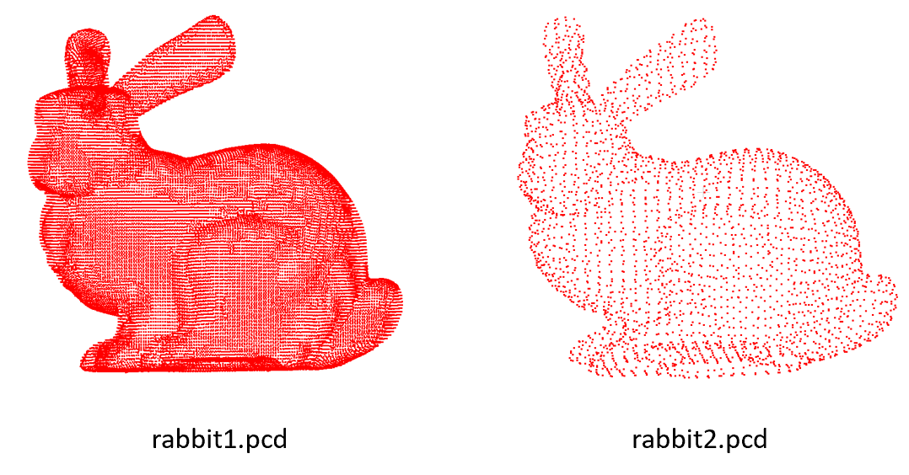

​                                                     图 2-1-57：**rabbit1.pcd** 与 **rabbit2.pcd** 视图

图 2-1-58 是 Cloud-to-Cloud 距离的计算操作过程：首先选中两个点云文件（只能选中两个），然后根据箭头指示操作。其中跳转到 Choose role 界面有两种方式，分别是图中的 way1 （Tools → Distances → Cloud/Cloud Dist.）和 way2（直接点击橙色框内图标）。图 2-1-58 最下方是计算结果，这里我们参数都按照默认参数来设置。可以看到，**rabbit1.pcd** 与 **rabbit2.pcd** 的平均距离是 0.000473m，计算时间是 0.03s：


​                                                                图 2-1-58 ：Cloud-to-Cloud 

下面是关于图 2-1-58 中第三步 Distance computation 的一些说明：

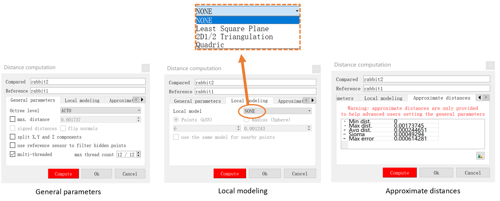

​                                                             图 2-1-59 ：Distance computation 说明

**1.   General parameters：**

*Octree level：* Octree 不仅与点云的降采样/重采样有关，它还是点云中进行近邻搜索的方法之一（详情见第四章）。Octree level 越高，小立方体被划分的越精细。如果计算点云距离时点与点之间距离过大，查找这些小立方体就要花费很多时间，因此可以手动设置较低的 Octree level。不过这里我们完全可以使用 CloudCompare 自动生成的 AUTO 的 Octree level。综上所示，Octree level 的改变不会影响距离结果，影响的只是运行时间；

*max. distance：* 有时点云之间点与点的距离可能很大，这样一来计算最近邻时花费的时间会很长。我们可以设置一个最大距离阈值，使得寻找最近邻时凡是距离大于这个阈值的，就不再计算，而是直接用阈值代替，可以减少计算量，加快运行速度；

**2.   Local modeling：**

*Local model：*该选项框内的所有选项如图 2-1-59 中间 Local modeling 上方的橙色虚线框内。如果我们选择 Local model 为 “NONE”，则意味着计算距离时就是计算 Compared cloud 中的每个点距离 Reference cloud 中最近点的直线距离（欧氏距离）；而当我们的点云中如果不够密集（比如含有空洞或者稀疏区域），在计算最近邻距离时很容易出现问题：

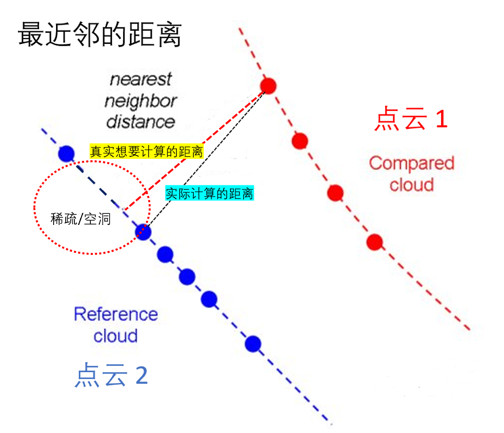

​                                                                 图 2-1-60：NONE 计算距离示意图

由于 Reference cloud 中有空洞/稀疏区域，因此在寻找 Compared cloud 中点的近邻点时，实际计算得到的距离比真实的距离长。

如果遇到这种情况，我们需要拟合平面，此时 Local model 可以选择 Least Square Plane 或者 2D1/2 Triangulation 或者Quadric，它们都是拟合平面的算法，这里不做展开介绍。拟合平面后，Cloud-to-Cloud Distance 转换为计算 Compared cloud 中的点到 Reference cloud 中这个平面的距离。

拟合平面需要寻找 Reference cloud 中这些空洞/稀疏点的近邻，有两种方法：

- *Points（kNN）：*寻找点周围距离最近的 k 个点作为近邻点；

- *Radius（Sphere）：*寻找设定半径的球内所有点作为近邻点；

> 鉴于以上的情况，Reference cloud 建议选择一个密度较大，空洞较少的点云。

**3.   Approximate distances：**

近似距离，该距离是 CloudCompare 为了自动设置较为合理的 Octree level 而进行的一次距离估计，最好不要将其作为最后的距离结果 —— 它只是用来设定 Octree level 的一个参考，最重要计算的距离还是要通过图 2-1-58 **Compute** 红色按钮得出。


##### Cloud-to-Mesh Distance：

Cloud-to-Mesh Distance 是指一个点云与一个 mesh 文件（网格模型）之间的距离，计算原理是计算每个点与 mesh 中距离最近的 triangle 之间的距离，如图 2-1-61：

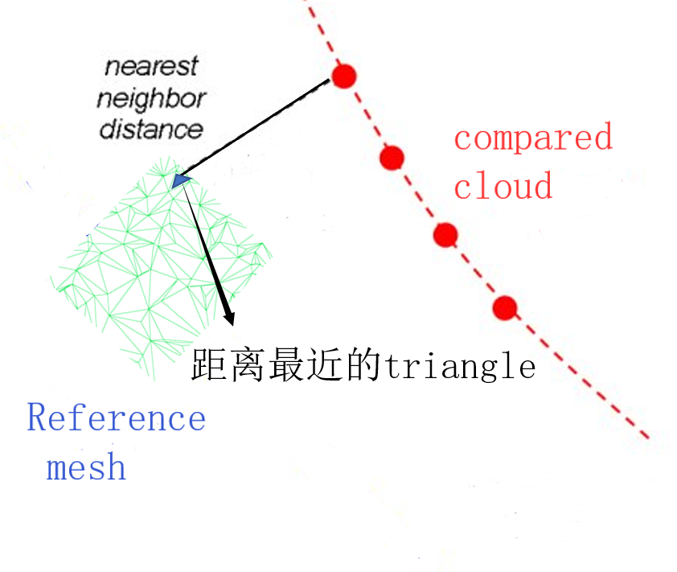

​                                                               图 2-1-61 ：Cloud-to-Mesh Distance[^9]

图 2-1-62 是在 CloudCompare 中进行 Cloud-to-Mesh Distance 计算的过程，以 **bottle2.pcd** （点云）与 **bottle1.vtk** （mesh）为示例文件（见教程文件夹）：

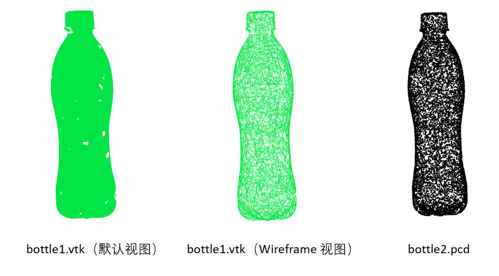

​                                                        图 2-1-62：**bottle1.vtk** 与 **bottle2.pcd** 视图

操作如下：首先选中两个文件，按照图示箭头操作。其中跳转到 Distance Computation 界面有两种方式：way1（Tools → Distances → Cloud/Mesh Dist）和 way2（直接点击橙色框内图标）。图 2-1-63 最下方是计算结果，这里我们参数都按照默认参数来设置。可以看到，**bottle2.pcd** （点云）与 **bottle1.vtk** （mesh）的平均距离是 0.000846m，计算时间是 0.10s：

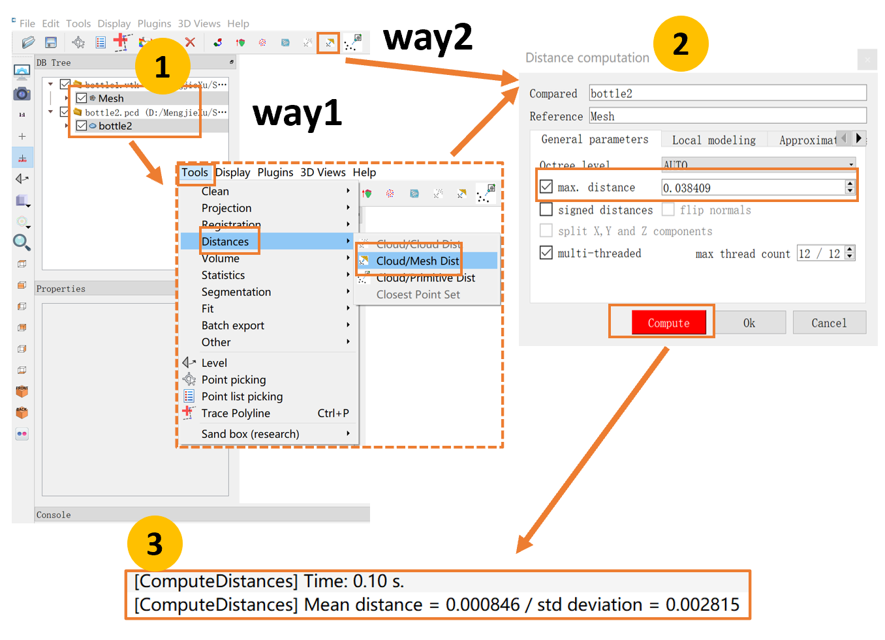

​                                                                      图 2-1-63：Cloud-to-Mesh

下面是关于图 2-1-63 中第二步 Distance computation 的一些说明：

> 计算 Cloud-to-Mesh Distance，CloudCompare 自动将 mesh 作为 Reference，cloud 作为 Compared。

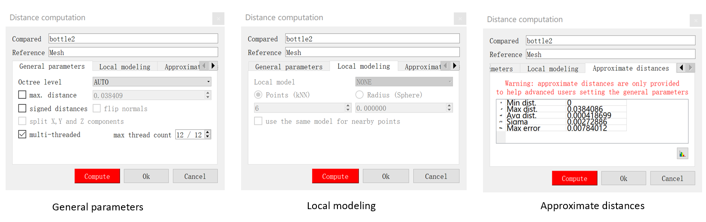

​                                                              图 2-1-64：Distance computation 说明

**1.   General parameters：**

*signed distances：* 计算距离时是否带上每个 triangle 的法线方向；

*flip normals：*如果计算的时候选择了 signed distances，而 mesh 的 triangle 需要翻转方向，比如形成一个 triangle 的顶点顺序发生变化，此时可以选择 flip normals；

其他的与 Cloud-to-Cloud 中的意思一致。

**2.   Local modeling：**

Cloud-to-Mesh 无法启动该功能。

**3.   Approximate distances：**

与 Cloud-to-Cloud 一致，主要用来设定 Octree level。


#### 2-1-9：计算法线

法线与颜色、空间坐标一样，是点云的重要特征或属性，即与所在切面垂直的向量，如图 2-1-65：

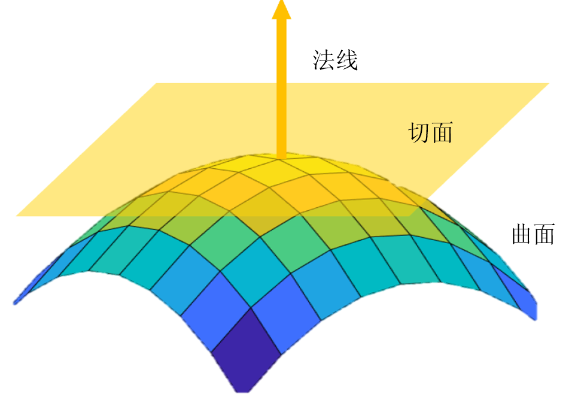

​                                                                          图 2-1-65：法线示意图

法线可以被应用在点云渲染等场景中。除此之外，计算法线还是三角化等算法的基础。关于法线的相关知识见 4-6-1 节。

除了计算点云的法线，CloudCompare 还可以计算 mesh 文件（网格模型）的法线，以及转换计算得到的法线的方向。

##### 计算点云法线：

下图是在 CloudCompare 中计算点云法线的过程示意图，以 **rabbit.pcd** 为例：

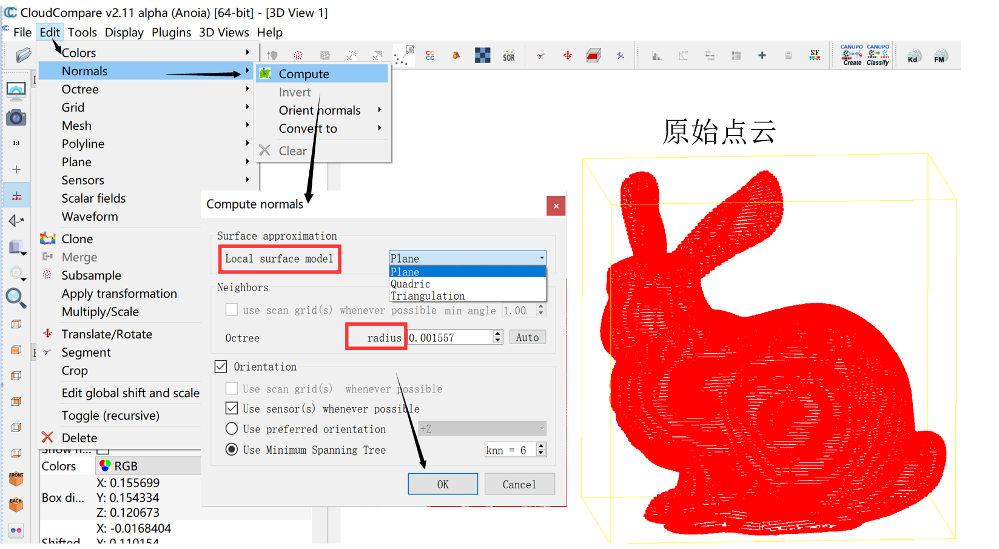

​                                                             图 2-1-66 ：计算点云法线过程示意图

如上图所示，选择 Edit → Normals → Compute，跳至 Compute normals 框，在该框中有两个重要的参数：

- **Local surface model：**法线是根据局部平面（local surface）计算得出，这里提供了三种拟合模型来估计法线：Plane，Quadric 和 Triangulation。我们的实例中选择的是 Plane，其他方法不做过多解释；
- **radius：**拟合平面时需要确定每个点的邻域大小，此处的 radius 即为形成局部平面的邻域半径。该半径设置过小，可能会导致没有足够的点来拟合平面，此时法线会默认为（0，0，1）；如果设置过大，邻域内的点太多，会使得计算量过大，计算时间过长；

选定参数后，点击 **OK**，就可以得到计算法线后的点云。此时该点云包含法线信息，展示在画布中如下图所示（多个角度）：背光的地方显示黑色，向光的地方显示红色：


​                                                                     图 2-1-67：计算点云法线后结果图


##### 计算 mesh （VTK 等文件类型保存的网格模型） 法线：

CloudCompare 中计算 mesh 的法线有两种：per-vertex 和 per-triangle。下图是计算 mesh 法线示意图，以 **bottle1.vtk** 为例：


​                                                             图 2-1-68：计算 mesh 法线示意图

mesh 法线的操作过程与点云法线的操作过程类似，都是 Edit → Normals → Compute。不同的是，mesh 弹出的是一个 Mesh normals 的选择框。下面介绍这两种估计：

图 2-1-68 下方，左侧是 Per-vertex 结果，右侧是 Per-triangle 结果：

- **Per-vertex：**计算该顶点（橙色点）所在的多个 triangle（三角形） 的平均法线作为该点的法线：

  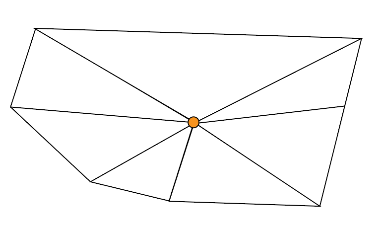

  ​                                                                   图 2-1-69：Per-vertex 示意图

- **Per-triangle：**计算每个 triangle 的法线，即与每个三角形平面分别垂直的向量：

  

  ​                                                                    图 2-1-70：Per-triangle 示意图


##### 反转法线方向：

下列操纵可以转换法线方向，以点云法线为例，可以看到转换法线后，黑色部分基本与红色部分对换：

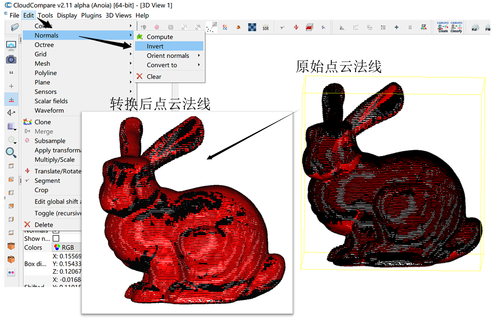

​                                                                          图 2-1-71：转换法线示意图

如果我们想清除计算的法线，该如何操作呢？


##### 清除法线：

如果想要消除计算的法线信息，可以通过以下操作实现：

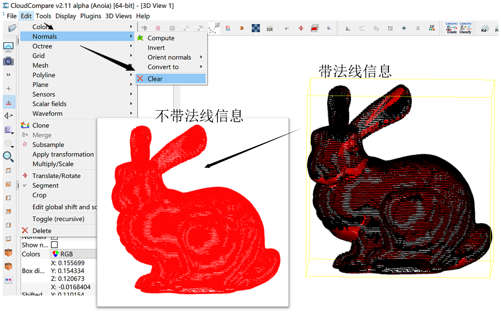

​                                                                              图 2-1-72 ：消除法线

可以看到结果点云恢复了原始红色点云状态，之前的法线信息不再显示。


#### 2-1-10：生成自定义几何元件

当我们在进行一些算法的初步试验时，可能会需要一些结构简单且干净的几何元件点云。对于这种情况，我们可以通过代码生成虚拟几何元件点云，也可以通过软件如 CloudCompare 就自带了这样一种几何元件点云生成器。

**Primitive Factory** 向用户提供了在 CloudCompare 中通过设置参数，自动生成虚拟几何元件（包括平面、球体、圆柱体等）的简单方法，下面通过球体的生成来简单示例该操作：

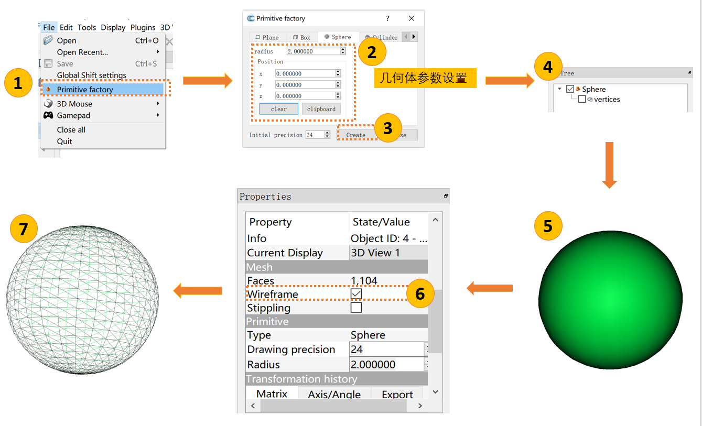

​                                                      图 2-1-73：**Primitive Factory** 使用说明

如上图所示，首先选择 **File → Primitive Factory**，弹出 **Primitive Factory** 对话框，对话框中提供了 Plane，Box，Sphere， Cylinder， Cone，Torus 和 Dish这几种几何元件类型。每种几何体选中后都会出现要设置的参数。设置好参数后，点击 **Create**，此时在 CloudCompare 界面的 **DB Tree** 一栏出现刚刚创建的几何体，在这种状态下你还可以继续点击其他几何体进行生成，直到点击 **Primitive Factory** 对话框中的 **Close**，本次创建过程才会结束。随后在软件画布中观察到一个绿色的球，如图 2-1-73 中第五步的视图。点击 **DB Tree** 下的 **Sphere**，在 **Properties** 中勾选 **Wireframe**，显示其网状结构，如图 2-1-73 中第七步的结果视图。

> 注意：其他几何元件创建原理同上。


#### 2-1-11：根据几何元件拟合点云

CloudCompare 还有一个很重要的功能，不过用的比较少，因为结果鲁棒性不够好。这里做简单介绍：

用几何元件拟合点云方法：**primitive fitting**（**Plugins → RANSAC Shape Detection**）

介绍这个功能主要是引入点云重建。点云重建就是把低级的点变成更高级的几何形态，比如网状结构是一种比点高级的几何形态，更高级一点就是几何元件。CloudCompare 是通过 RANSAC 这个算法在目标点云中去拟合指定的几何元件，包括 Plane, Sphere, Cylinder, Cone, Torus。也就是说，给定一个点云，可以将其拟合成平面/球体/圆柱体/椎体/环形体，如下图所示：

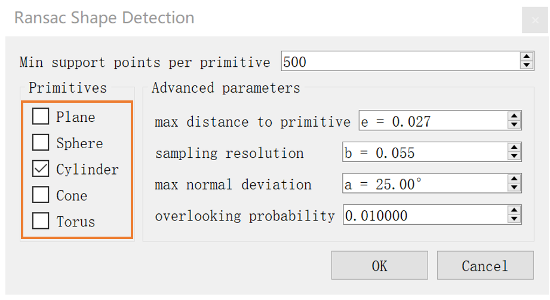

​                                                                         图 2-1-74：几何元件种类

我们用一个桥墩 **bridge_pier1.bin** 作为示例文件（见教程文件夹），该桥墩示意图如下：


​                                                                图 2-1-75：**bridge_pier1.bin** 示意图

对于 **bridge_pier1.bin** 这个圆柱体状的桥墩，我们选择只用 Cylinder 来拟合：

图 2-1-76 是利用 CloudCompare 实现该功能的操作流程：

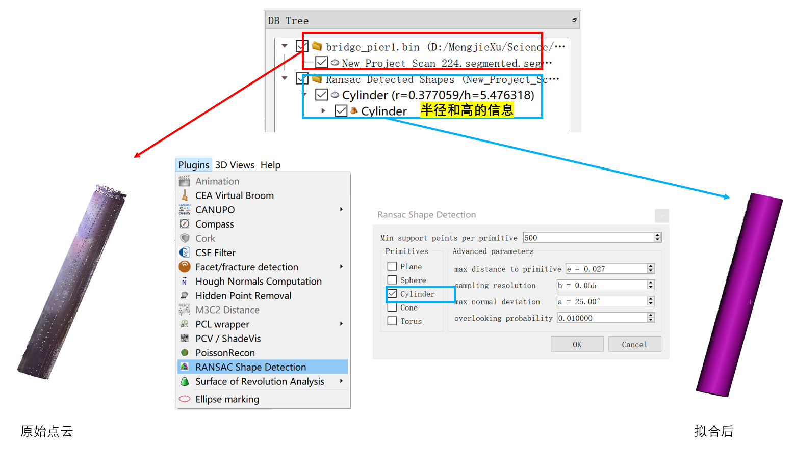

​                                                                 图 2-1-76：几何元件拟合点云

图 2-1-76 是这个桥墩被一个圆柱体的几何元件拟合了。并且在拟合结果中显示了其半径和高的信息。这些内容是点云 3D 重建非常重要的信息。

但是使用 CloudCompare 进行几何元件拟合点云的功能不够鲁棒，如果有很多噪音或者杂点，或者一个点云中包含的几何体很多，结果就会不准确。比如下面我们用整座桥 **Bridge10.bin** 进行多种几何体的拟合：

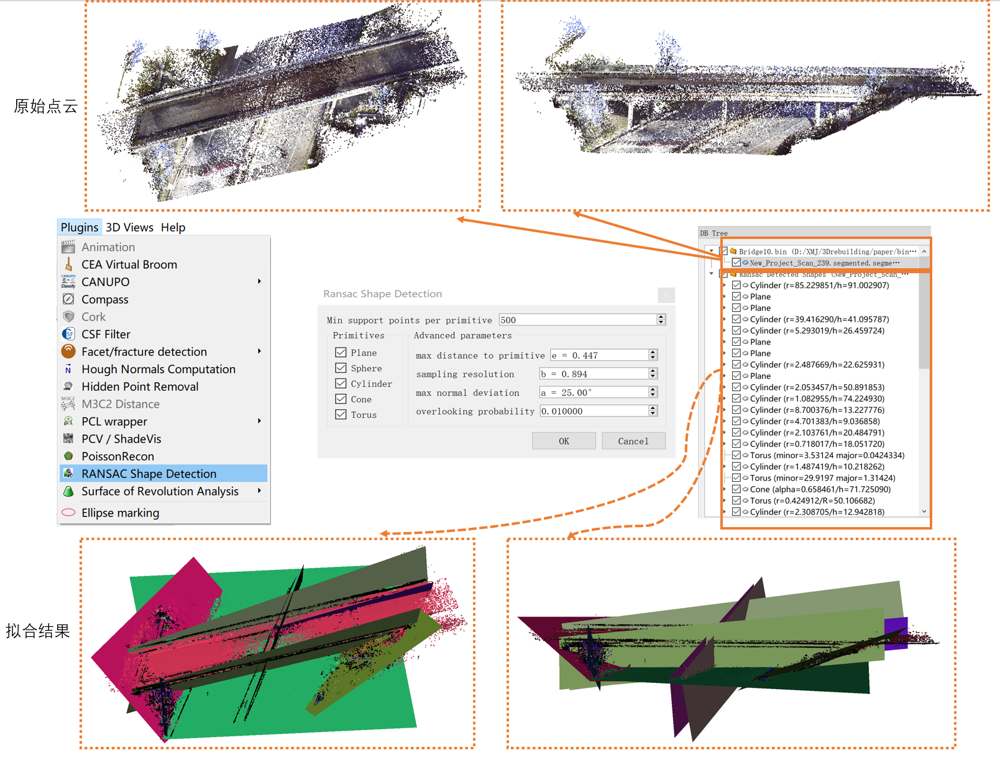

​                                                                               图 2-1-77：桥的拟合

这里我们勾选了所有几何元件，最终生成的拟合结果并不是那么理想，与原始的桥相差甚远。


#### 2-1-12 ：点云配准

Registration （配准）是处理点云的重要算法，简单来讲，就是将多个不同局部坐标系的点云通过找到彼此重合之处进行配准/拼接，使其出现在统一坐标系下。如图 2-1-78，(a) 和 (b) 分别是该建筑物两个局部坐标系下的点云，经过配准操作后得到 (c)，也即 (a) 和 (b) 拼接在一起，形成在一个坐标系中的完整建筑物的点云：

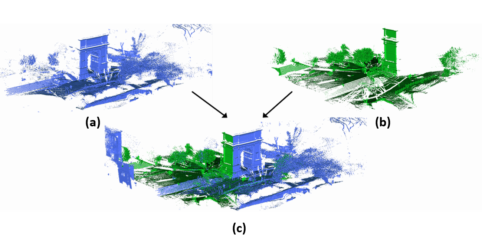

​                                                                       图 2-1-78：配准示意图[^10]

进行两个点云 Registration 的著名算法是 Iterative Closest Point（ICP）（第四章会展开介绍），下面介绍如何在 CloudCompare 中进行简单 ICP 算法的实现：

##### Registration 的准备：

首先需要两个在不同局部坐标系下的点云，如图 2-1-79：紫色点云 **bunny1.pcd** 与蓝色点云 **bunny2.pcd**（见教程文件夹）

Registration 的目标是将 **bunny1.pcd** 与 **bunny2.pcd** 进行配准，也即将这两只兔子拼接成在一个坐标系中的兔子。因为这两只兔子各自缺失一部分结构 —— **bunny1.pcd** 缺失尾巴，**bunny2.pcd** 缺失耳朵，如下图。它们的配准实质是找到将二者进行重叠之处，合二为一。


​                                                      图 2-1-79 ：**bunny1.pcd** 与 **bunny2.pcd** 视图

##### Registration：

如图 2-1-80，同时选中 **bunny1.pcd** 和 **bunny2.pcd**（选中一个点云之后按 ctrl 键，再选中另一个点云），点击Tools → Registration → Fine registration (ICP)，根据弹出框可知 **bunny2.pcd** 是我们要配准到或是与之对齐的目标点云，**bunny1.pcd** 是要进行配准的源点云（点击二者下方的 swap 键可以交换我们的目标点云和源点云），经过运算后（这里全部采用默认参数）得到一个刚性变换矩阵 Transformation matrix，也即根据这个矩阵就可以从 **bunny1.pcd** 配准到 **bunny2.pcd**：

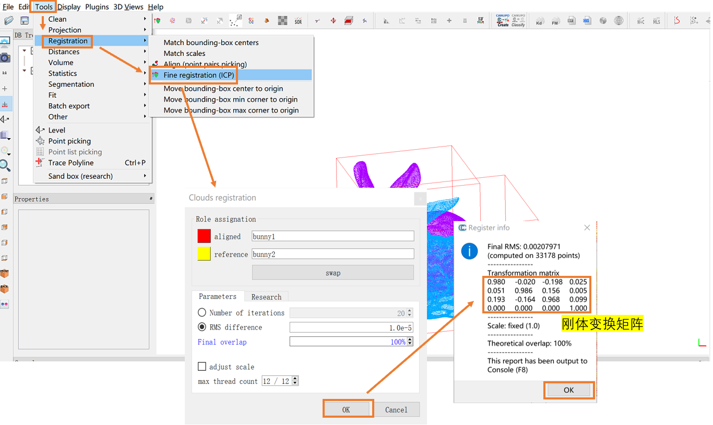

​                                                                        图 2-1-80 ：ICP 示意图

##### Registration 的结果：

如图 2-1-81 为 Registration 的结果，视图是配准结果和 **bunny2.pcd** 同时显示的示意图，此时二者难以区分，隐约看到蓝色紫色夹杂，这说明 **bunny1.pcd** 经过 Registration 后与 **bunny2.pcd** 重叠度较高，也即 Registration 效果较好，已经还原出了一个完整的兔子：


​                                                                 图 2-1-81 ：Registration 结果示意图


#### 2-1-13：合并点云

合并点云，就是将两个或多个独立的点云文件合并成一个新的点云，这里我们合并两个点云。示例文件为 **bottleright.pcd** 和 **bottleleft.pcd** （见教程文件夹），图 2-1-82 为两个文件的视图：

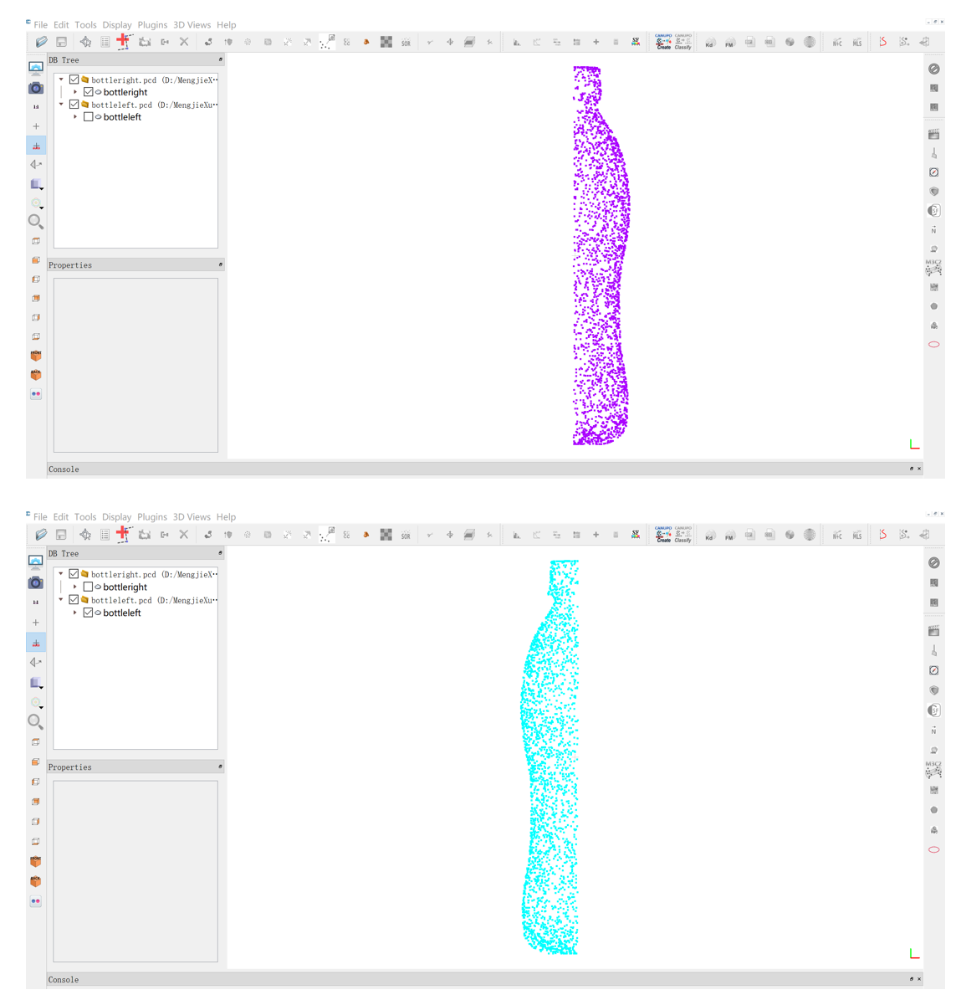

​                                                    图 2-1-82：**bottleright.pcd** 与 **bottleleft.pcd** 视图

要想把二者合并为一个完整的瓶子，需要使用 CloudCompare 中的合并点云功能按钮 ，如下图红框内，首先同时选中需要合并的点云文件（可以是两个或两个以上文件），然后点击合并功能按钮。

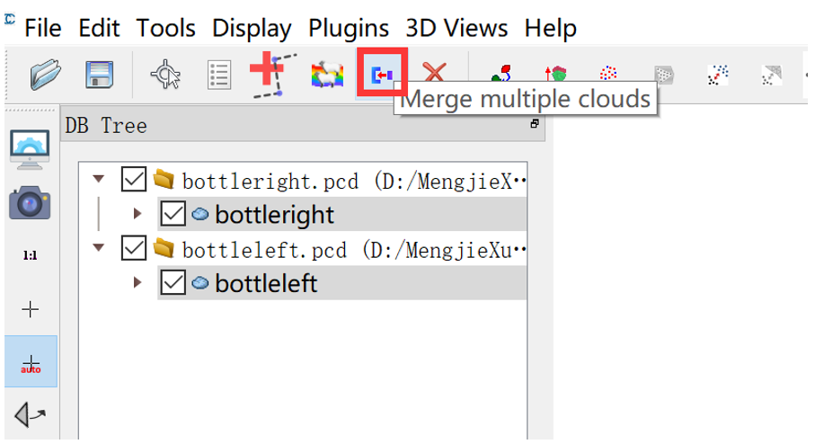

​                                                                         图 2-1-83：合并点云操作

弹出下列弹出框，我们选择 No —— 不生成 Scalar Field：

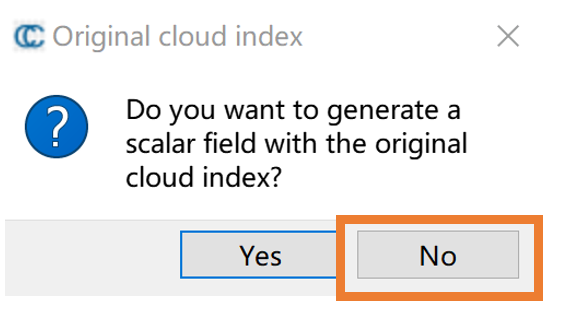

​                                                                         图 2-1-84：弹出框选项

此时，合并过程已经完成，原始的两个文件已被删除，只剩下新生成的合并结果文件 **bottleright.pcd**，为了不与原始文件名称重合，产生混乱，可以将该文件另存为 **bottleresult.pcd** 文件，图 2-1-85 为合并结果：


​                                                                          图 2-1-85：合并结果

可以看到，合并结果保留了两部分各自的颜色信息，将原始独立的两个文件合并在一起。


> 关于 CloudCompare 的基本操作我们就介绍这些。CloudCompare 还有很多其他功能（如一些涉及算法的功能），这里暂不作介绍。已介绍的内容足以支持基本的点云预处理。想要继续探索的读者可以根据第一节给出的链接自主学习！


### 2-2 ：MeshLab

MeshLab 也是一款开源的三维处理软件，方便使用者对该软件进行补充和扩展。该软件主要处理的是点云以及三维网格模型（mesh）。它提供了编辑、清理、检查、渲染网格的工具。MeshLab 功能非常强大，本章挑选其中部分基础操作给大家展示。一起动手操作吧！

                

​                                                                图 2-2：MeshLab 界面视图[^11][^12][^13]


#### 2-2-1：下载并安装：

下载网址：http://www.meshlab.net/#download


​                                                                  图 2-2-1：MeshLab 下载界面

从中选取对应自己电脑系统的 exe 文件进行下载安装。安装成功后显示如下界面：

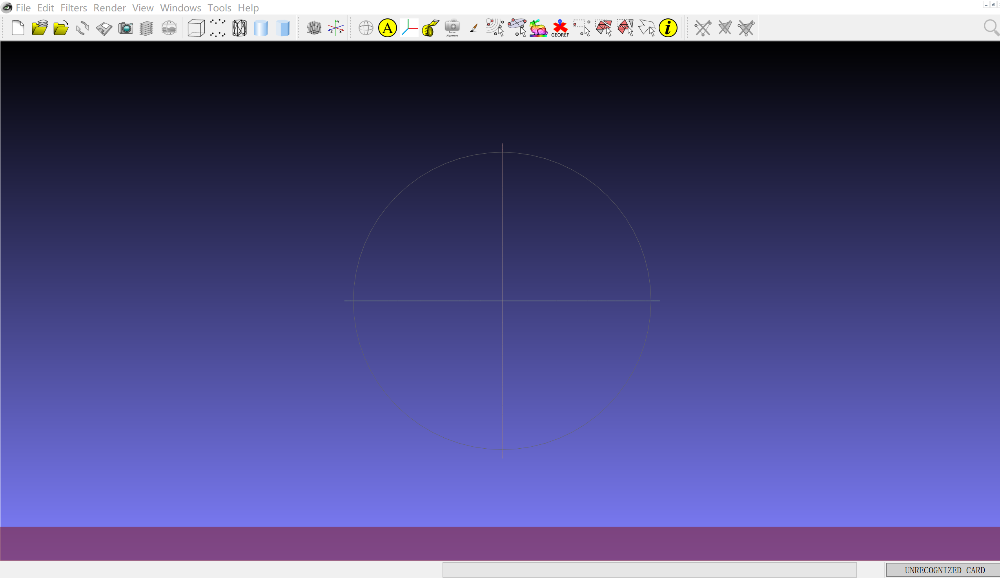

​                                                                图 2-2-2 ：MeshLab 初始界面


下面提供给大家几个辅助学习的小工具：

- MeshLab 源代码链接，大家对于点云处理技术非常熟悉后可以在这里进行源代码的编写：

  👉 https://github.com/cnr-isti-vclab/meshlab/releases

   

- 下面链接通过 YouTube 视频的形式直观介绍 MeshLab 的基本操作：

  👉 **Basics：**https://www.youtube.com/playlist?list=PL8B1E816EAE236B4D

  👉 **Features**：https://www.youtube.com/playlist?list=PL60mCsep96JcJz_SIfXblsVmI1TYMsQJc

  👉 **3D Scanning pipeline：**https://www.youtube.com/playlist?list=PL53FAE3EB5734126E

  👉 **Cleaning：**https://www.youtube.com/playlist?list=PLBBF41579E4B65566

  

- 下列文档是 MeshLab 的官方用户手册：

  👉 http://www.heritagedoc.pt/doc/Meshlab_Tutorial_iitd.pdf


大家可以在阅读本手册之余，通过上述链接查找自己不明白的地方，或者试着改进这个软件。

下面一起来探索 MeshLab 吧！

对于 MeshLab 的讲解主要以网格模型（既有点的信息，又包含拓扑信息）—— mesh 为例。


#### 2-2-2：设置背景颜色：

MeshLab 的背景颜色默认是渐变紫色，与 CloudCompare 中一样，我们可以设置不同的背景颜色来方便视图：

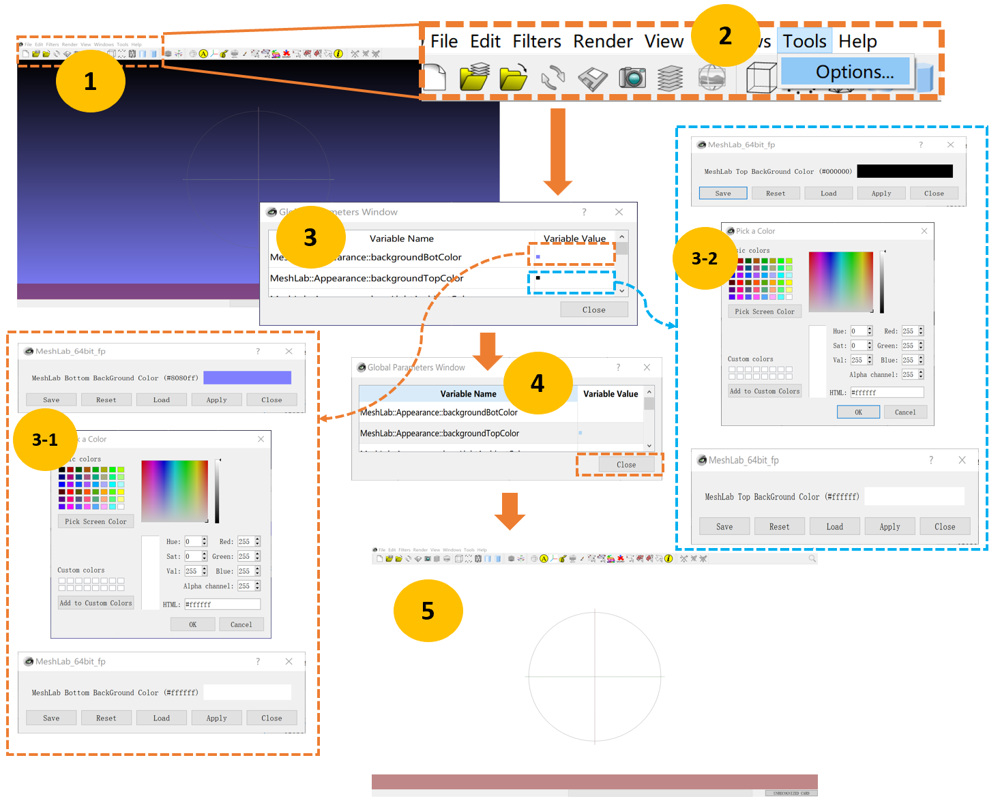

​                                                             图 2-2-3：改变 MeshLab 背景操作流程

如图 2-2-3 所示：

-  是默认背景视图 —— 渐变紫色；
- 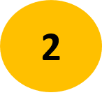选择 “Tools → Options..."；
- 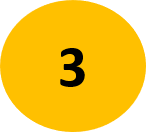 是点击 ”Options“ 之后弹出的选择框，该选择框包括很多软件本身的设置，这里我们只看前两个：backgroundBotColor 和 backgroundTopColor，分别是设置背景下半部分颜色和背景上半部分颜色；分别双击  中的橙色虚线框和蓝色虚线框，对应设置 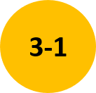 和 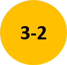； 单击紫色区域，弹出颜色选择框，选择白色，依次点击 Save 和 Close； 单击黑色区域，弹出颜色选择框，选择白色，依次点击 Save 和 Close；
- 可以看到 backgroundBotColor 和 backgroundTopColor 都变成了白色，点击 Close；
-  即将背景设置为纯白色的结果视图。

在这里我们将背景设置为纯白色，之后的操作都将在纯白色背景下展示，读者可以自行设置方便视图的背景颜色。

> 注意：视图中的 trackball 可以取消显示，如下图：


​                                                          图 2-2-4：取消视图中的 trackball 操作


#### 2-2-3：打开文件：

使用 MeshLab 进行文件的操作，首先需要在 MeshLab 中打开我们要处理的文件，也就是将我们的文件**导入 MeshLab**。

在 MeshLab 中打开一个点云文件有两种方法，以 **bunny.ply** 为例（见教程文件夹），**bunny.ply** 是一个已经含有 mesh 的文件。大家也可以通过CloudCompare将一个点云文件转化为.ply格式（见 2-2-4）。

##### MeshLab 打开文件

**方法一：**直接将 ply 文件拖入 MeshLab左侧画布中，如图 2-2-5 所示：

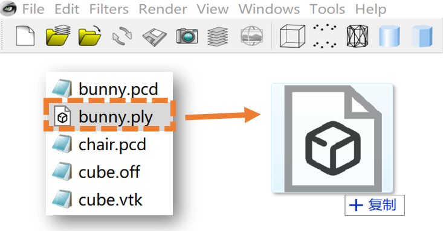

​                                                             图 2-2-5：MeshLab 打开点云文件方法一

**方法二：** 通过 **Import Mesh** 图标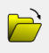打开对应路径的 ply 文件，如图 2-2-6 所示：


​                                                           图 2-2-6：MeshLab 打开点云文件方法二

通过上述两种操作方式，可以看到 **bunny.ply** 在 MeshLab 中视图如图 2-2-7（选择显示网格模型 wireframe）：

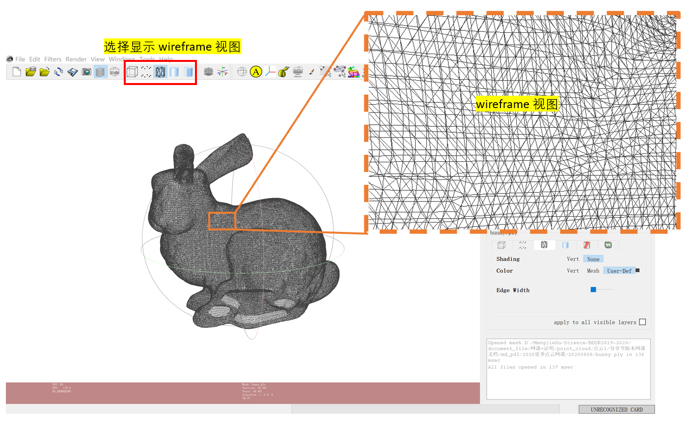

​                                                            图 2-2-7：**bunny.ply** 视图（wireframe）

将橙色虚线框内放大后视图，我们可以看到该文件的视图不再是零零散散的点，而是网状结构。这是因为该 ply 文件中除了点的信息之外，还包含拓扑关系。

##### 拓扑关系：

拓扑关系是指点连接成线，线连接成面，面再组成体。主要拓扑关系如下图所示：

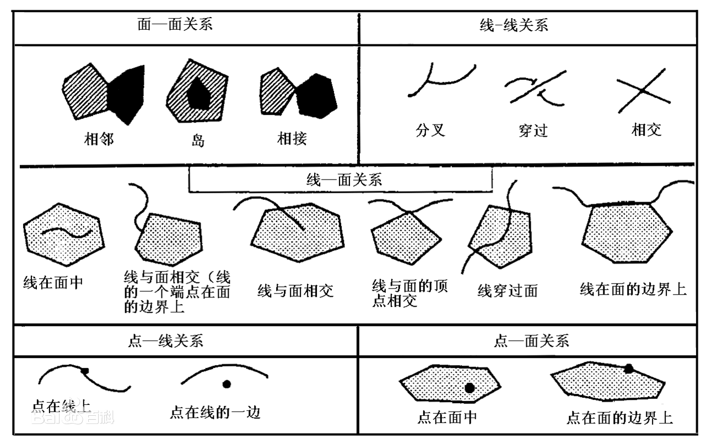

​                                                                        图 2-2-8：拓扑关系示意图[^14]


##### 可以打开的文件格式：

- **mesh 文件：**

| 文件格式                          | 后缀   | 文件格式                                  | 后缀   |
| --------------------------------- | ------ | ----------------------------------------- | ------ |
| *Eisen Script File*               | *.es   | *OpenCTM compressed format*               | *.ctm  |
| *3D-Studio File Format*           | *.3ds  | *Expe's point set(binary)*                | *.pts  |
| *Stanford Polygon File Format*    | *.ply  | *Expe's point set(ascii)*                 | *.apts |
| *STL File Format*                 | *.stl  | *XYZ Point Cloud(with or without normal)* | *.xyz  |
| *Alias Wavefront Object*          | *.obj  | *Protein Data Bank*                       | *.pdb  |
| *Quad Object*                     | *.qobj | *TRI(photogrammetric reconstructions)*    | *.tri  |
| *Object File Format*              | *.off  | *ASC(ascii triples of points)*            | *.asc  |
| *PTX File Format*                 | *.ptx  | *TXT(Generic ASCII point list)*           | *.txt  |
| *VCG Dump File Format*            | *.vmi  | *X3D File Format - XML encoding*          | *.x3d  |
| *FBX Autodesk Interchange Format* | *.fbx  | *X3D File Format - VRML encoding*         | *.x3dv |
| *Breuckmann File Format*          | *.bre  | *VRML 2.0 File Format*                    | *.wrl  |
| *Collada File Format*             | *.dae  |                                           |        |

- **project：**

| project 格式             | 后缀  | project 格式       | 后缀  |
| ------------------------ | ----- | ------------------ | ----- |
| *MeshLab Project*        | *.mlp | *Bundler Output*   | *.out |
| *MeshLab Binary Project* | *.mlb | *VisualSFM Output* | *.nvm |
| *Align Project*          | *.aln |                    |       |

- **raster：**

| Raster 格式（后缀） |
| :-----------------: |
|        *.jpg        |
|        *.png        |
|        *.xpm        |


#### 2-2-4：mesh 化点云

上一节我们打开的 **bunny.ply** 本身含有 mesh 信息，因此可以看到网格模型（wireframe）。但如果是只含有点信息的 ply 文件，则需要我们在  MeshLab 中手动操作，去生成它的 mesh 信息 —— 也即 mesh 化点云。

以 **bridge.bin** 为例，该文件包含的点数太多，mesh 化花费时间过长，我们截取其中部分结构进行实验：

##### step1：

在 CloudCompare 中打开 **bridge.bin** 文件，根据我们之前在 CloudComapre 中学习的裁剪点云操作截取部分桥结构并降采样，另存为 ply 文件，得到 **bridge_downsample.ply** 文件（处理后的这个文件已经在教程文件夹中）：

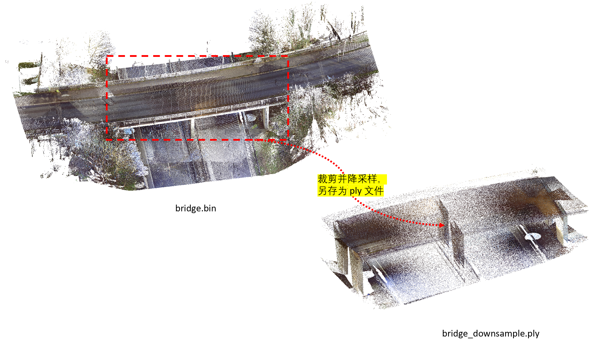

​                                                                      图 2-2-9：step1 示意图

##### step2：

在 MeshLab 中打开 **bridge_downsample.ply** 文件，此时选择红框内 Shading 和 Color 的呈现状态，否则会呈现跟真实桥体不同的颜色。目前该 ply 文件只包含点的信息：

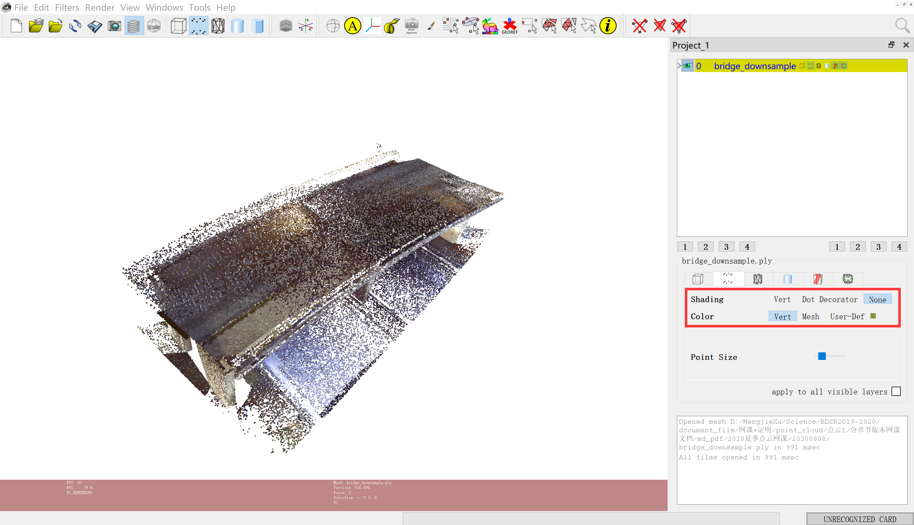

​                                                                        图 2-2-10：step2 示意图

目前的 ply 文件只包含点的信息，没有拓扑关系，具体表现为图 2-2-11 中 **Faces 0**：

点击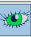左边的 ：

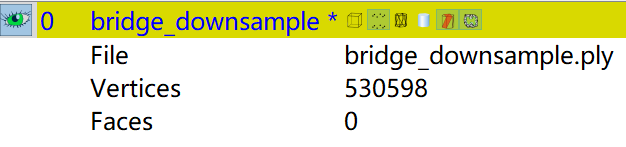

​                                                             图 2-2-11：“只包含点的信息” 示意图

##### step3：

法线是点云每个点的重要信息，如果没有法线信息，就无法计算 mesh。计算 mesh 这个过程也可以理解为点云重建， 即将点云从点（low-level）变成了高级一些的 mesh 网状结构（higher-level）；当然我们还可以将 mesh 继续变得更高级，比如用一个面去拟合一片 mesh —— 这里我们不深入讨论这个问题。总之，需要先计算 normal 才能得到 mesh。因此第三步计算文件的法线：

计算 **bridge_downsample.ply** 文件的法线：

**Filters → Normals,Curvatures and Orientation → Compute normals for point sets**

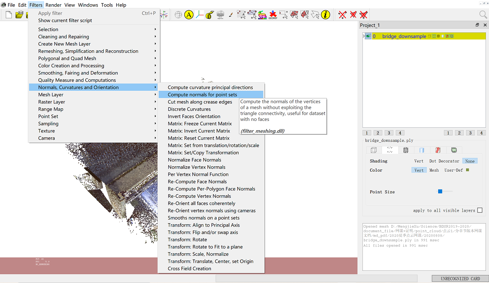

​                                                                  图 2-2-12：计算法线过程示意图 1

点击 **Compute normals for point sets** 之后，会出现下列界面：


​                                                                 图 2-2-13：计算法线过程示意图 2

其中，**Neighbour num** 表示计算法线时每个点的邻域包括点的个数，根据邻域才可以计算法线。这里我们选择邻域点个数为 10。设置好邻域点数后点击 **Apply**。

##### step4：

mesh 化点云

**Filters → Remeshing，Simplification and Reconstruction → Surface Reconstruction：Ball Pivoting**

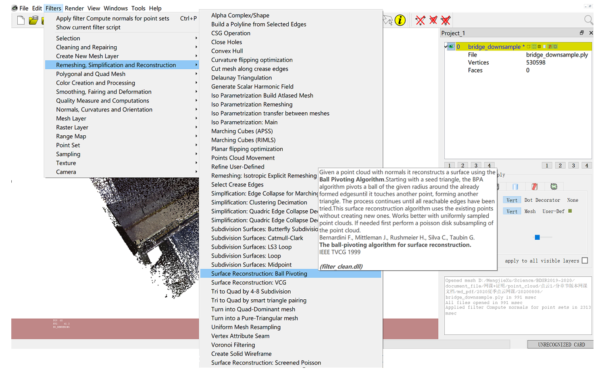

​                                                                          图 2-2-14：mesh 化示意图

Surface Reconstruction：Ball Pivoting 弹出框，在该弹出框中设置参数 Pivoting Ball radius（perc on(0 .. 37.012)），点击 Apply：

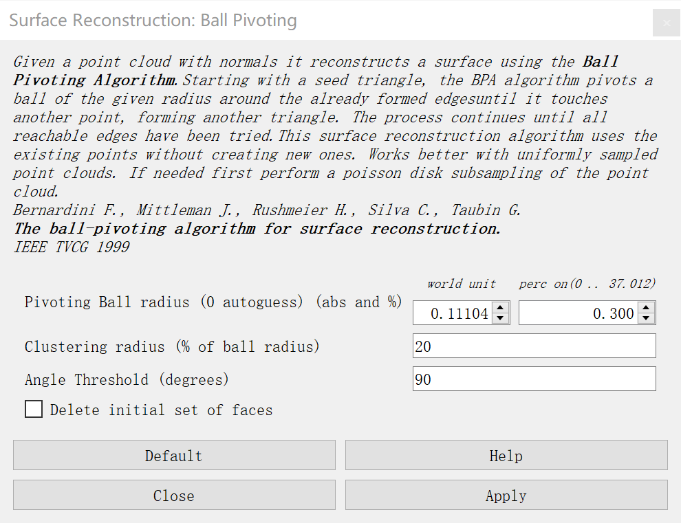

​                                                                              图 2-2-15：设置参数

得到最终 mesh 化的 **bridge_downsample.ply**，可以通过下图中的 Faces 看到这里不只有点的信息：

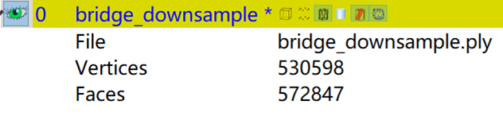

​                                                                   图 2-2-16：“不只点的信息” 示意图

下面显示两种不同状态的视图：

##### 两种不同的视图：

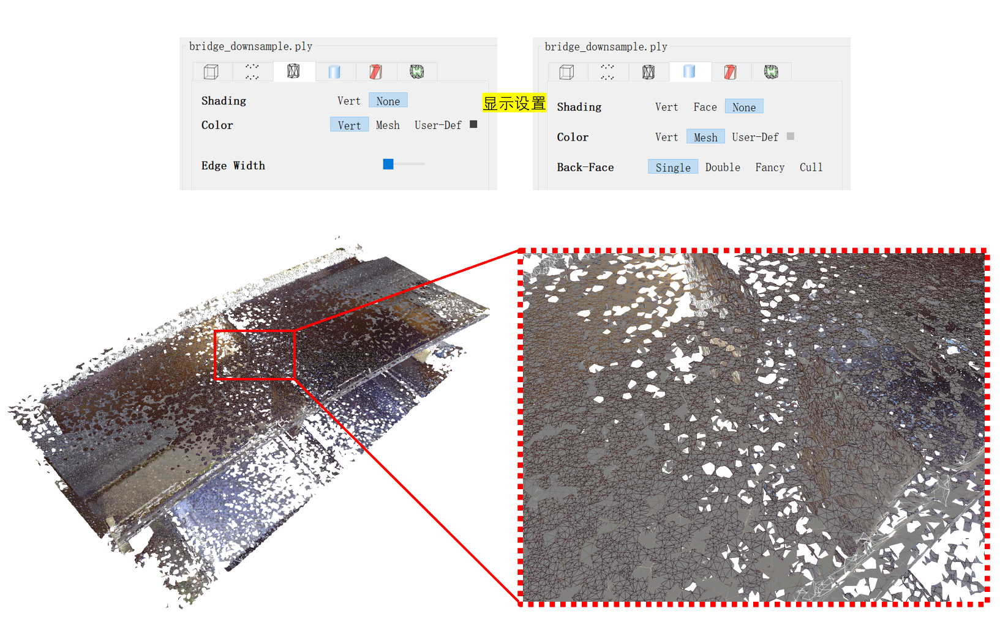

​                                                                                    图 2-2-17：视图 1

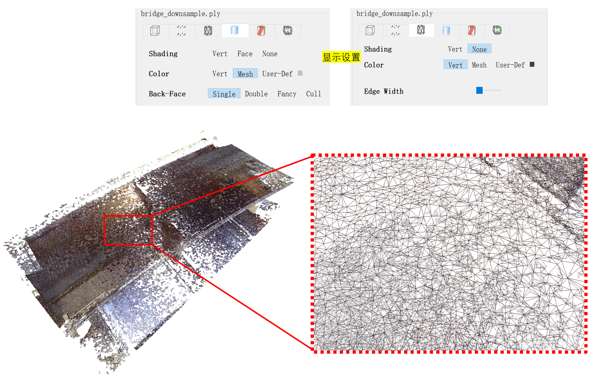

​                                                                                    图 2-2-18：视图 2

将 mesh 化的 **bridge_downsample.ply** 另存为 **bridge_downsample_mesh.ply** 。

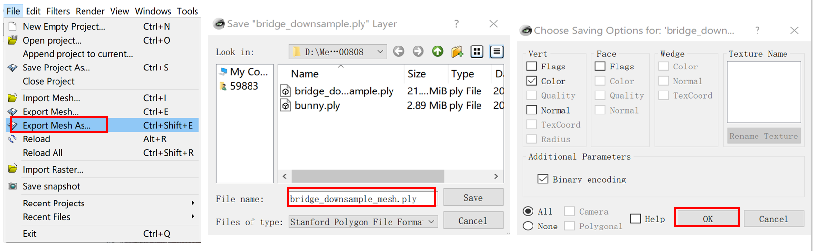

​                                                     图 2-2-19：另存为 **bridge_downsample_mesh.ply**

另存为的 **bridge_downsample_mesh.ply** 也可以拖入 CloudCompare 进行视图，如图 2-2-20：


​                                     图 2-2-20： **bridge_downsample_mesh.ply** 的 CloudCompare 视图


#### 2-2-5：MeshLab 基础操作

2-2-3 节讲述了如何将 mesh 文件导入 MeshLab，导入之后会在渐变紫色画布显示。本节主要讲解导入后的界面信息解读以及 MeshLab 中视图的基本操作：

如何解读导入 MeshLab 的文件信息呢？

##### 解读界面信息：

当我们将一个文件加载到 MeshLab 中时，界面会显示很多该文件的实时信息，在软件中打开上一节我们 mesh 化的 **bridge_downsample_mesh.ply**（处理好的该文件已在教程文件夹中）：

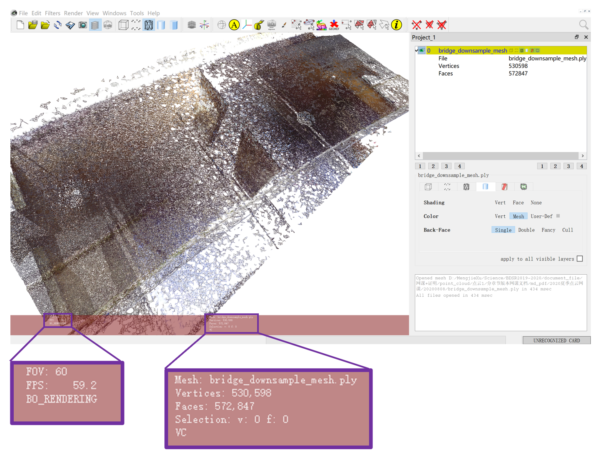

​                                                                         图 2-2-21 ：界面信息

将 **bridge_downsample_mesh.ply** 文件读入到 MeshLab 中后，会在界面显示一座桥，界面下方可以读取一些信息，其中：

- **FOV：**The Filed OF View —— 视点，类似于 CloudCompare 中的正交视图和透视视图。Ortho 和 90 是 FOV 的两个极端值，其他的数值介于二者之间，Ortho 对应正交视图，90 对应透视视图；
- **FPS：**Frame Per Second；
- **BO_RENDERING：**一种渲染系统指示，当 mesh 文件不是特别大时为 BO_RENDERING；
- **Mesh：**显示 mesh 文件名称，这里是 **bridge_downsample_mesh.ply**；
- **Vertices：**mesh 顶点个数；
- **Faces：**mesh 多边形个数。如果文件没有被 mesh 化，则 Faces 显示 0；

当 MeshLab 中导入多个文件时（**horse.ply**，**bunny.ply**，**dragon.wrl**，这三个文件本身都已被 mesh 化，见教程文件夹），如下图所示：

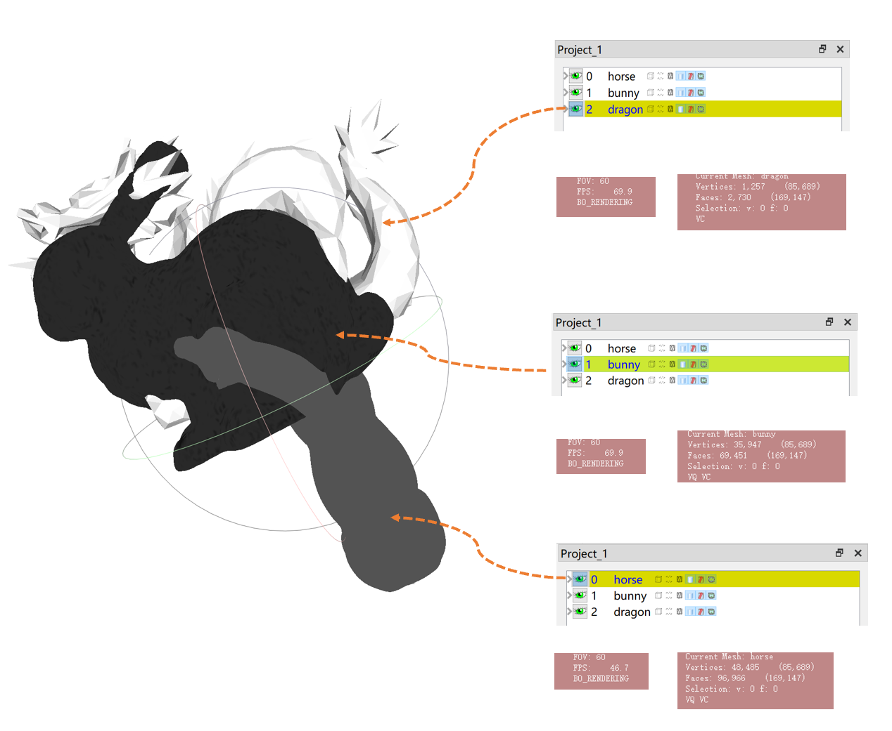

​                                                                       图 2-2-22： 多个文件视图

选中 Project_1 下面的不同文件名，会在界面下方显示对应文件的信息：包括当前选中文件的 FOV、FPS、渲染指示、Current mesh 文件名以及当前 mesh 化文件的顶点和面的个数。

点击 Project_1 每个文件前面的眼睛符号，有两种状态：和，前者代表在视图中看到该文件，后者代表不显示。图 2-2-22 中我们都选择了前者，因此这三个 mesh 化文件都出现在画布当中。

##### 调整查看视图：

当我们将一个 mesh 化的文件 **bridge_downsample_mesh.ply** 加载到 MeshLab 中后，我们希望对它进行一个全方位的查看，此时一个角度是不够的。下面介绍调整视图的几个方法：

- **旋转视图：**将鼠标挪至 mesh 上，一直点击住鼠标左键不松开，拖动鼠标，此时文件会绕着物体中心旋转；

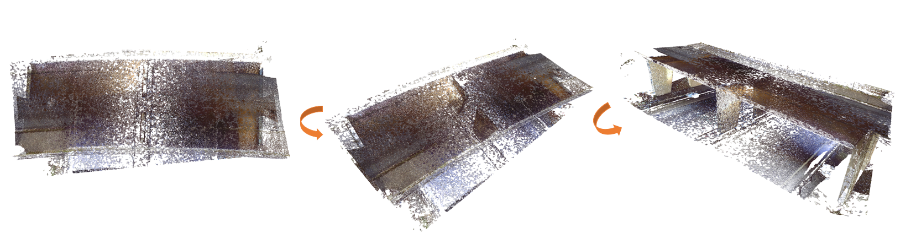

​                                                                        图 2-2-23 ：不同角度视图

- **移动视图：**将鼠标挪至 mesh 物体上，按 ctrl 键，鼠标左键点击 mesh 文件，拖动鼠标即可在视图中上下左右移动 mesh 文件。此时显示 Trackball。向左移动效果参照左下方图标 ：

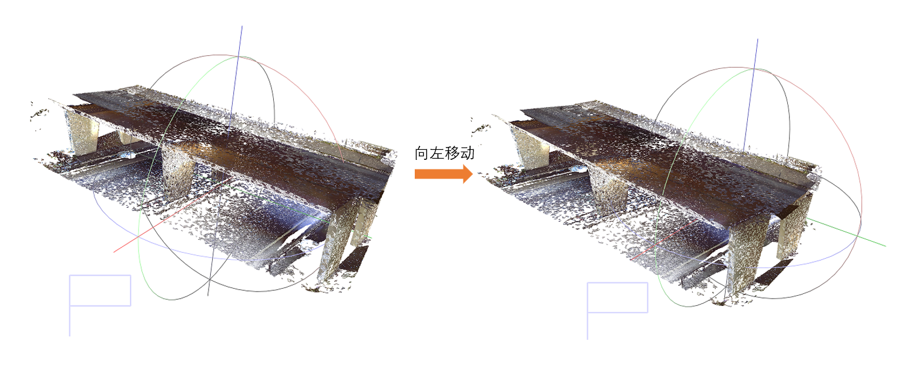

​                                                                           图 2-2-24 ：移动视图

- **放大缩小视图：** MeshLab 有两种方法可以放大或缩小文件视图，其一是直接滑动鼠标滚轮，向前滑动为缩小，向后滑动为放大；其二是通过按 shift 键，鼠标左键点击 mesh 文件，鼠标图标向上是缩小，向下是放大。此时显示 Trackball。下图展示方法二（放大效果参照左下方 S 型图标 ）：

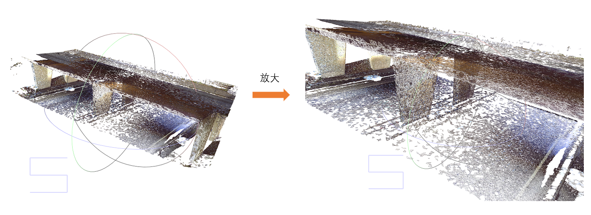

​                                                                          图 2-2-25 ：放大缩小视图

- **放大特定位置：**该操作可以将选中部位调至坐标球中心，进行放大。此时显示 Trackball。操作如下：鼠标左键选中某个部位（这里选中的是最左侧桥墩，双击该部位），会发现其跳转至画布中央，再次双击，该部位会带动整个物体一起放大：


​                                                                         图 2-2-26 ：放大特定位置视图

- **FOV 视图：**类似于 CloudCompare 中的正交视图和透视视图，即呈现给用户不同的视觉效果。此时显示 Trackball。操作如下：按 shift 键，滑动鼠标滚轮，向上滑，FOV 值会变大直到 90（透视视图）；向下滑，FOV 的值会变小，直到 Ortho（正交视图）。下面展示两种极端情况下的视图：

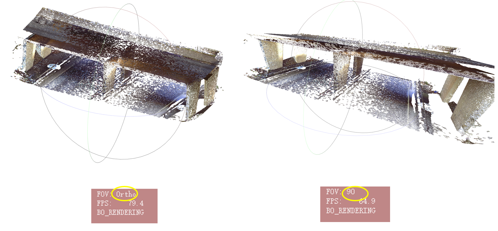

​                                                                          图 2-2-27 ：不同 FOV 视图

以上是 MeshLab 中常会用到的调整视图操作，方便我们对导入的 mesh 文件有一个全方位的了解。通过下面的按钮可以快速调出上述操作的快捷方式，供大家查看：**Help** → **On screen quick help    F1**


​                                                                           图 2-2-28 ：快捷帮助

##### 查找相关操作：

MeshLab 本身含有很多功能。如果你不清楚这些功能具体在哪里，可以通过右上角的放大镜图标来进行关键字的查找：


​                                                                   图 2-2-29：查找法线示意图

上图是通过该按钮查找与法线相关内容的示例。

**bridge_downsample_mesh.ply** 的获得过程中我们计算了法线，因此该文件含有法线信息，可以进行法线的视图。可以看到，我们在搜索框中输入 normal（法线）后，会出现一系列跟法线相关的操作，我们只根据自己的需要去选择对应的操作即可。这里我们选择的是 Show Normal，即显示法线 —— 众多紫色向量。


#### 2-2-6：MeshLab 可视化

本节来学习如何在 MeshLab 查看不同状态的可视化：比如光线如何体现、Bounding Box 如何显示、显示的状态为点集/网状/含有表面信息等。

如何在 MeshLab 中丰富可视化呢？

以 **dragon.wrl** 为例，分为以下几部分：

> **dragon.wrl** 本身含有 mesh 信息以及法线信息。wrl 文件我们之前没有提及到，这里只是通过该文件讲解这些可视化功能的视图。

##### 光线：

光线是渲染物体的重要特征：

- Shading：Vert、Face、None；Vert 显示更加平滑，Face 有较明显棱角，None 不显示阴影：

  > 为了方便视图，将文件的颜色在 Color 一行中设置为 Use-Def，即用户自定义格式，为灰色

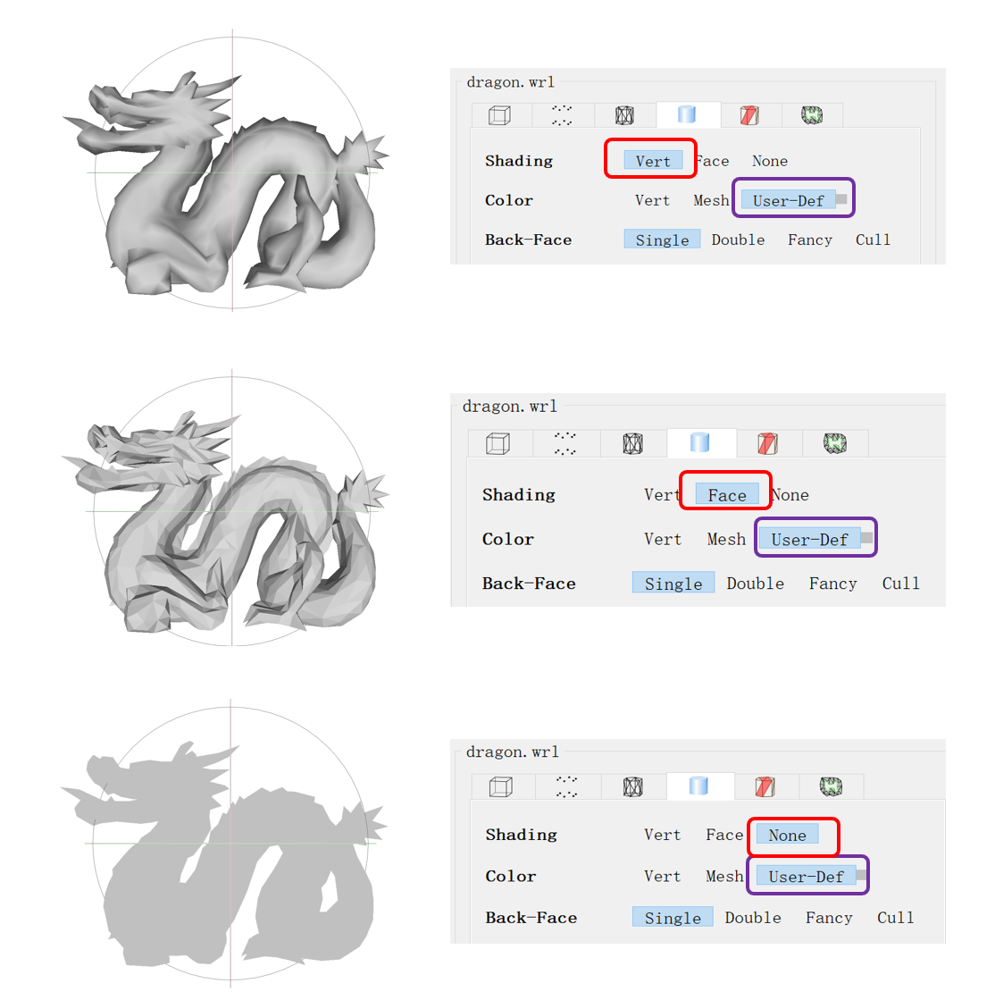

​                                                                       图 2-2-30：shading 示意图

- Back-Face：Single、Double、Fancy、Cull。下面只介绍前两种比较常见的：

> 注意：为了方便大家看到黄色的光线，我们将背景重设为最初的渐变紫色，读者也可以自行设置其他颜色，只要能观察到黄色光线即可。

Single：

Single，即单向光线，同时按 Ctrl + Shift 键，鼠标左键点击画布即可出现光线。橘色箭头是光线方向。可以看到龙左侧被照亮，呈现亮色；龙左侧是阴影区，因此呈暗色：


​                                                                  图 2-2-31 ：Single 光线示意图

Double：

Double，即双向光线，同时按 Ctrl + Shift 键，鼠标左键点击画布即可出现光线。不管光线如何转动，由于它是双向照射，因此 mesh 没有完全的阴影状态。橘色箭头是光线方向。可以看到左侧和右侧都有亮色区，暗色区是两个方向光线照射后都为阴影区域的部分：

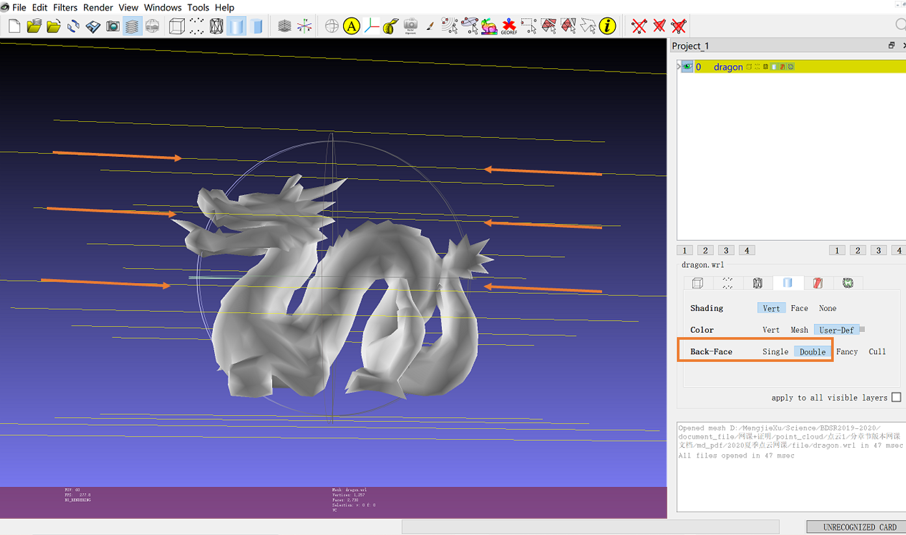

​                                                                  图 2-2-32 ：Double 光线示意图

##### Bounding Box：

同之前 CloudCompare 中的 Bounding Box 概念类似，MeshLab 中也有对应的 Bounding Box 来框住 mesh ：

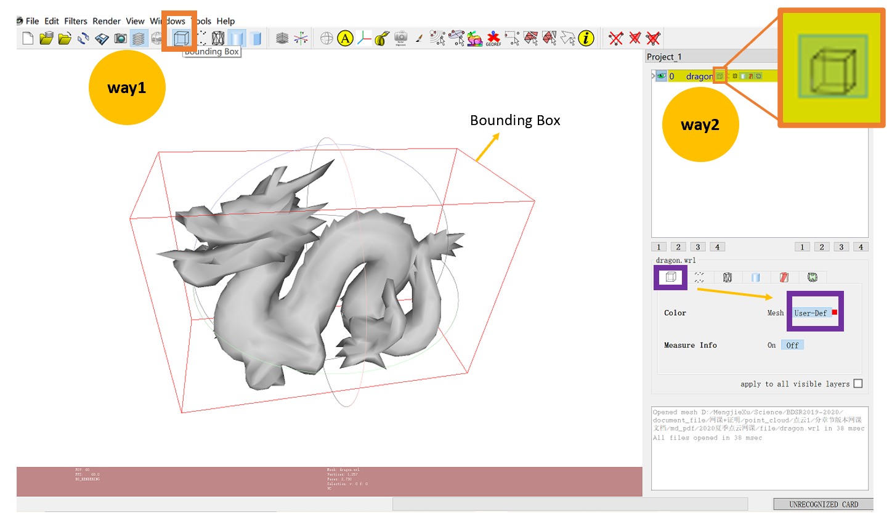

​                                                                 图 2-2-33 ：Bounding Box 示意图

可以通过 way1 或者 way2 来显示 Bounding Box。这里为了在白色背景中显示 Bounding Box，我们将 Bounding Box 的颜色设置为 Use-Def，即用户自定义状态，设置为红色。如图 2-2-33 中紫色框内。

下图是对 Bounding Box 设置参数，包括颜色以及测量信息等：


​                                                                图 2-2-34 ：Bounding Box 参数设置

其中，颜色可以是 mesh，也可以是用户自定义的颜色（点击 User-Def 右侧的红色正方形标志即可自行设置颜色）；测量信息可以选择显示（On），也可以选择不显示（Off）。

##### Points：

显示该 mesh 文件对应的点信息：

这里为了在显示 Points 视图效果更好，我们将 Points 的颜色设置为 Use-Def，即用户自定义状态，设置为绿色。


​                                                                         图 2-2-35 ：Points 示意图

可以通过图 2-2-35 中 way1 或者 way2 来设置呈现点的视图。

下面是对 Points 设置参数，包括 Shading、Color、Point Size：

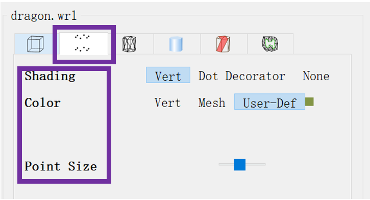

​                                                                       图 2-2-36 ：Points 参数设置

##### Wireframe：

Wireframe 同 CloudCompare 中介绍的一致，在 mesh 文件中才有该视图类别，实质就是网状结构：

这里为了在显示 Wireframe 视图效果更好，我们将颜色设置为 Use-Def，即用户自定义状态，设置为黑色。


​                                                                      图 2-2-37 ：Wireframe 示意图

可以通过图 2-2-37 中的 way1 或者 way2 来视图 Wireframe。

下面是关于 Wireframe 参数的设置：


​                                                                  图 2-2-38 ：Wireframe 参数设置


#### 2-2-7：点云降采样：

同 2-1-6：降采样一致，MeshLab 也有自己的降采样按钮：

以 **bridge_downsample_mesh.ply** 为例：接下来介绍的降采样需要文件含有 mesh 信息

降采样之前视图：

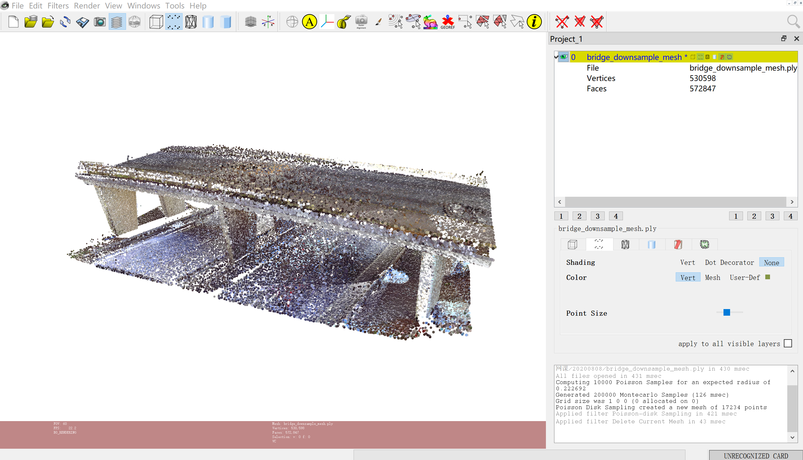

​                                                                        图 2-2-39：原始视图

操作流程如下： **Filters → Sampling → Poisson-disk Sampling**


​                                                                     图 2-2-40：点云降采样过程 1

选中 Poisson-disk Sampling 之后，弹出图 2-2-41 中间弹出框：

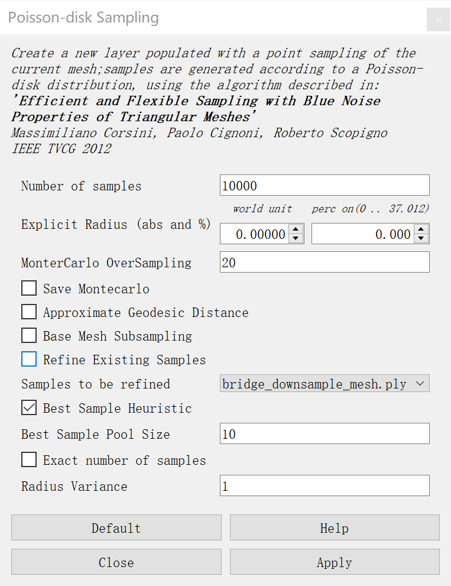

​                                                                       图 2-2-41：点云降采样过程 2

在该弹出框中，可以修改 **Number of samples** —— 降采样剩下的大概点数（最终降采样得到的点数在该点数附近，不一定正好等于。比如我们这里设置的是 10000 个点，降采样结果点云中含有的点数如图 2-2-42）。

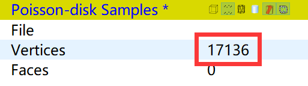

​                                                                           图 2-2-42：结果点数

降采样结果视图：

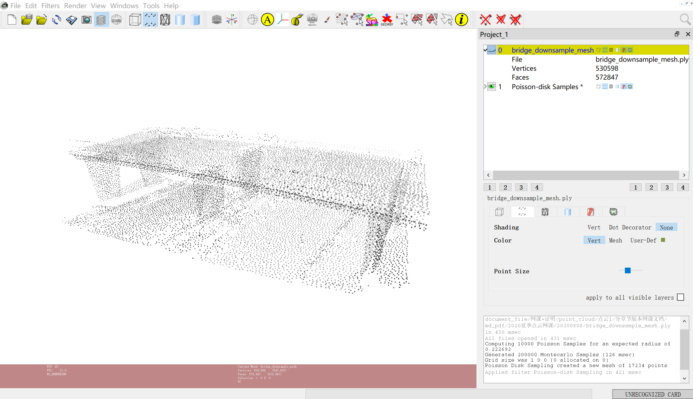

​                                                                       图 2-2-43：降采样结果视图

可以看到视图相较原始视图图 2-2-39 稀疏了很多。


#### 2-2-8：选取和删除

下面简单介绍 MeshLab 中几个用来选取或删除部分区域的功能键。

以 **bridge_downsample_mesh.ply** 为例：

##### 选取部分区域：


​                                                                      图 2-2-44：选取部分区域

如图 2-2-44 所示，红色框中的六个按钮都是选取部分区域的不同方式：

① Select Vertex Clusters 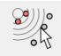：选择顶点集合（将选中部分的点全部包括在集合中）；

② Select Vertices on a Plane ：选择在一个平面上的顶点（将在一个平面上的点包括在集合中）；

③ Select Vertices 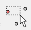：选择长方体区域内的顶点；

④ Select Faces in a rectangular region 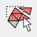：选择一个长方体区域内的多边形面；

⑤ Select Connected Components in a region ：选择相关联区域的成分（点和面）；

⑥ Select Faces/Vertices inside polyline area 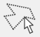：选择不规则区域内的面/顶点；

##### 删除部分区域：


​                                                                     图 2-2-45：删除部分区域

如图 2-2-45 所示，红色框中的三个按钮都是删除部分区域的不同方式：

① Delete the current set of selected vertices; faces that share one of the deleted vertices are deleted too ：删除当前选定的顶点集; 共享被删除顶点之一的面也被删除；

② Delete the current set of selected faces, vertices that remains unreferenced are not deleted ：

删除当前选定的面集，顶点不会被删除；

③ Delete the current set of selected faces and all the vertices surrounded by that faces ：删除当前选定面集和该面涉及到的所有顶点。

> 感兴趣的同学可以根据教程文件夹中合适的文件自己进行尝试。


#### 2-2-9: 拓扑和几何信息的读取

本节主要介绍如何在 MeshLab 中读取 mesh 文件的拓扑和几何信息。 Mesh 文件相较只包含点的信息的点云文件来说，多了拓扑结构信息。因此，学会查看此类信息非常重要，这里做**简单介绍**，以 **dragon.wrl** 文件为例：

##### 拓扑信息：

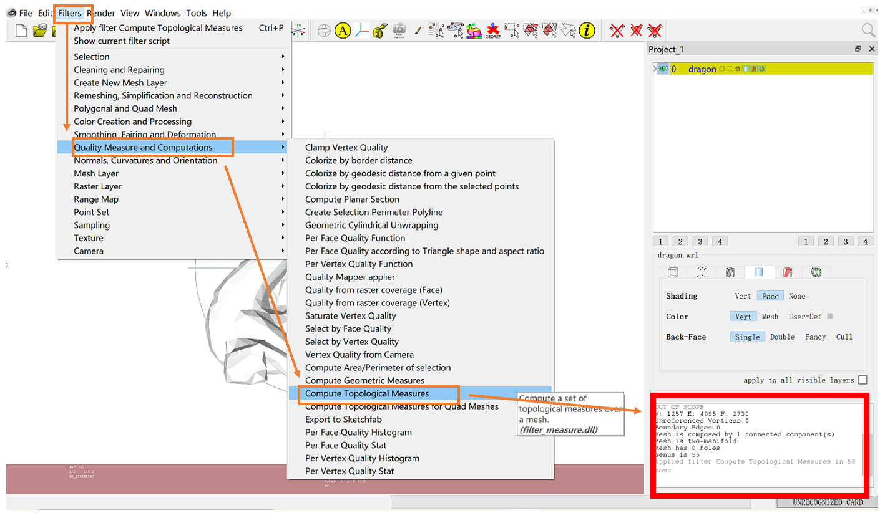

​                                                                     图 2-2-46 ：拓扑信息的获得

Mesh 文件的拓扑信息对于点云的三角化非常重要，因为三角化（第四章会介绍）需要点云之间的拓扑信息才能形成空间结构。在图 2-2-46 右侧红框内即我们得到的拓扑信息，可以看到这个文件本身包含 1257 个顶点；4095 个边缘；2730 个面等信息，具体拓扑信息如下：

```
V: 1257 E: 4095 F: 2730
Unreferenced Vertices 0
Boundary Edges 0
Mesh is composed by 1 connected component(s) 
Mesh is two-manifold 
Mesh has 0 holes
Genus is 55
Applied filter Compute Topological Measures in 58 msec 
```


##### 几何信息：


​                                                                    图 2-2-47 ：几何信息的获得

Mesh 文件的几何信息对于我们了解该文件的几何结构来说非常重要。在图 2-2-47 右侧红框内即我们得到的几何信息，这里没有显示全，因此我们将全部几何信息列举如下：

```
Mesh Bounding Box Size 0.210970 0.144833 0.092823
Mesh Bounding Box Diag 0.272215 
Mesh Bounding Box min -0.110993 0.052525 -0.050413
Mesh Bounding Box max 0.099977 0.197358 0.042410
Mesh Surface Area is 0.076983
Mesh Total Len of 4095 Edges is 37.782368 Avg Len 0.009226
Mesh Total Len of 4095 Edges is 37.782368 Avg Len 0.009226 (including faux edges))
Thin shell (faces) barycenter: -0.010309 0.108503 -0.008092
Vertices barycenter -0.010662 0.109044 -0.006433
Mesh Volume is 0.000478
Center of Mass is -0.011976 0.103019 -0.009221
Inertia Tensor is :
| 0.000001 0.000000 0.000000 |
| 0.000000 0.000001 0.000000 |
| 0.000000 0.000000 0.000002 |
Principal axes are :
| 0.979431 -0.201732 -0.004342 |
| 0.198852 0.968651 -0.148907 |
| -0.034245 -0.144981 -0.988842 |
axis momenta are :
| 0.000001 0.000001 0.000002 |
Applied filter Compute Geometric Measures in 84 msec 
```

包括 Bounding Box 的大小范围，mesh 表面面积，mesh 的体积等。


> 目前我们已经学习了 CloudCompare 和 MeshLab 的简单操作，已经能够自己初步玩转点云。下面第三章我们会介绍这些打开和视图的文件内部信息。
>
> 让我们一起探索这些视图文件的内部构成吧！


### 参考文献：

[^1]: [https://www.danielgm.net/cc/doc/qCC/CloudCompare%20v2.6.1%20-%20User%20manual.pdf](https://www.danielgm.net/cc/doc/qCC/CloudCompare v2.6.1 - User manual.pdf)
[^2]: https://alternativeto.net/software/cloudcompare/
[^3]: https://twitter.com/OddGoderstad/status/791692420085940228/photo/1
[^4]: http://www.danielgm.net/cc/forum/viewtopic.php?t=1524
[^5]: https://blog.csdn.net/u013512448/article/details/52527237/
[^6]: https://stackoverflow.com/questions/40404031/drawing-bounding-box-for-a-rotated-object
[^7]: Jeong, J., Yoon, T. S., & Park, J. B. (2018). Towards a meaningful 3D map using a 3D lidar and a camera. *Sensors*, *18*(8), 2571.
[^8]: https://images.app.goo.gl/AeGVaoXyfJuS82FGA
[^9]: [https://www.danielgm.net/cc/doc/qCC/CloudCompare%20v2.6.1%20-%20User%20manual.pdf](https://www.danielgm.net/cc/doc/qCC/CloudCompare v2.6.1 - User manual.pdf)
[^10]: Pan, Y. (2019). Target-less registration of point clouds: A review. *arXiv preprint arXiv:1912.12756*.

[^11]: https://www.web3.lu/meshlab-3d-software/
[^12]: https://www.researchgate.net/publication/221210477_MeshLab_an_Open-Source_Mesh_Processing_Tool/figures?lo=1
[^13]: https://alternativeto.net/software/meshlab/
[^14]: Dabaghian, Y. (2019). Through synapses to spatial memory maps via a topological model. *Scientific reports*, *9*(1), 1-13.


