[TOC]


## Chapter4   Point Cloud Library

So far, we have learned the basic knowledge of point cloud, the use of point cloud software (CloudCompare & MeshLab), and the file format of the point cloud. These are all primary knowledge reserves for point cloud algorithms. If we want to learn more about point clouds and reflect the value of point cloud, we have to mention the related processing algorithms of point clouds. Fig.4.1 summarizes some point cloud algorithms, summarized by category, including point cloud sampling, registration, feature extraction, filtering, clustering, and segmentation, object recognition, and detection, surface reconstruction, and points Cloud fitting. Each category includes many algorithms:

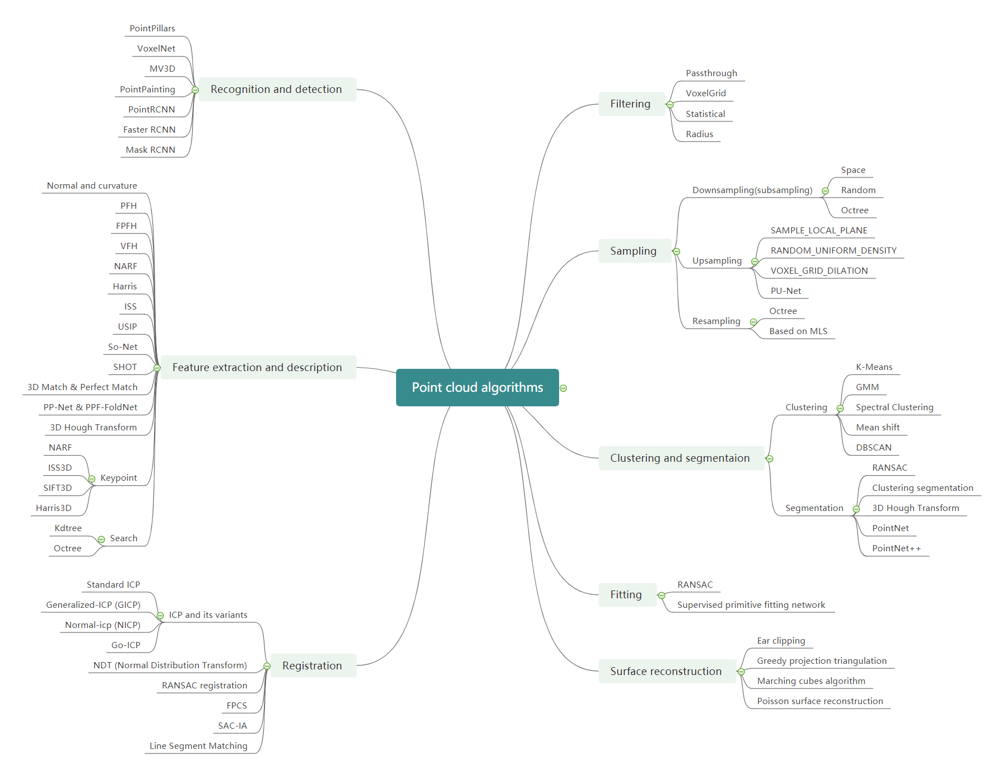

*Fig.4.1:   Point cloud algorithms*

The continuous update and advent of these algorithms enable us to perform various analyses and operations on the point cloud. To learn point cloud algorithms systematically, "**Point Cloud Library (PCL)**" is our first choice. It is a 3D point cloud library written in C++, which contains many processing point cloud algorithms. After learning this chapter, we can implement some necessary processing on the point cloud file by ourselves. This chapter's algorithm is based on PCL, and readers need to have a specific foundation in C++.


​                                                              **—— Point Cloud Library tour ——**


### 4-1 ：Introduction to Point Cloud Library

**Point Cloud Library (PCL)** is an extensive cross-platform open-source C++ 3D point cloud library. Its official point cloud file format is PCD (introduced in Chapter3). The PCL contains many algorithms, covering **write and read point cloud, filtering, feature extraction, key point extraction, point cloud registration, point cloud search (kdtree and octree), point cloud cutting, point cloud recognition**, and other modules.

PCL official website: http://pointclouds.org/, Fig.4.1.1 is the home page of PCL official website:


*Fig.4.1.1:   The home page of PCL*

We can click any module in Fig.4.1.2 to view the usage of the related classes or functions:

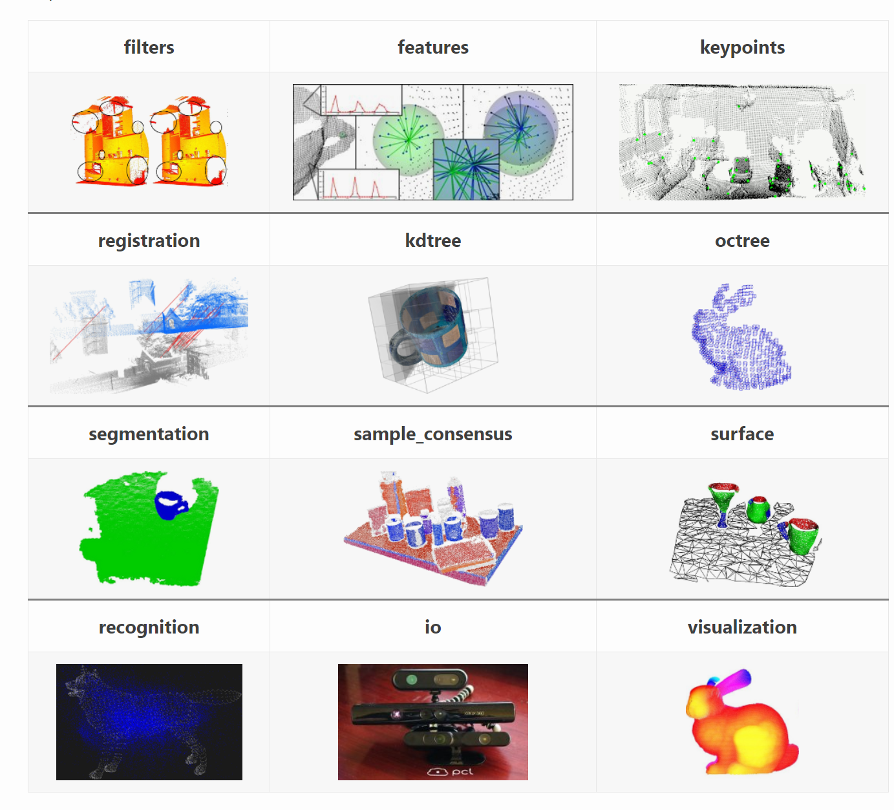

*Fig.4.1.2:   PCL modules*

The following is the link to the PCL official study manual:

https://pcl.readthedocs.io/projects/tutorials/en/latest/


*Fig.4.1.3:   PCL tutorial*

The existing algorithms in the PCL need to configure the computer environment to use the source code of these algorithms successfully. How to configure the environment?

In Section 4-2, we will introduce two configuration methods:

- **4-2-1:** PCL 1.9.1 configuration in Visual Studio 2017;
- **4-2-2:** Use CMake to compile the code.

> We use the method in Section 4-2-1 for the code in Section 4-3 and later, and interested readers can try the method in Section 4-2-2 on their own.


### 4-2：Environment configuration

#### 4-2-1 ：PCL 1.9.1 configuration in Visual Studio 2017

PCL is a large cross-platform open-source C++ programming library, and Visual Studio is an integrated development environment (IDE) for writing C++ code. Here we introduce the configuration of PCL **1.9.1** in VS **2017** (Visual Studio **2017**).

> NB: Different versions have different configurations. The content of this chapter is based on PCL 1.9.1 and Visual Studio 2017. Other combinations of versions may not apply to the following introduction process. If it is another version of PCL or Visual Studio, we need to find the corresponding configuration process.

##### VS 2017

First, install VS 2017 on our computer:

Way1: Official website download: https://visualstudio.microsoft.com/zh-hans/vs/older-downloads/

> NB: Download the **2017** version!

Way2: WeChat public account download: https://mp.weixin.qq.com/s/MHbkGslWpX80xe6VoIDs8w

Fig.4.2.1 shows the initial interface of VS 2017:


*Fig.4.2.1:   VS 2017 initial interface*

##### PCL 1.9.1

###### PCL 1.9.1 download

PCL download website: https://github.com/PointCloudLibrary/pcl/releases/tag/pcl-1.9.1

The black boxes in Fig.4.2.2 are the two files that need to be downloaded:

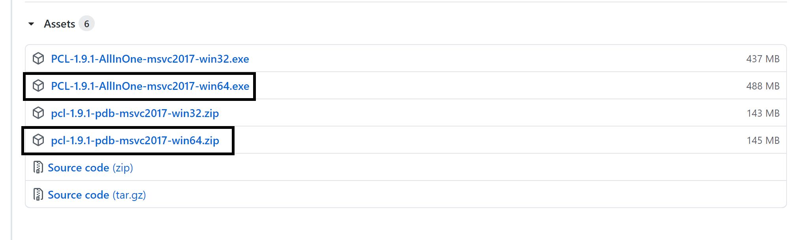

*Fig.4.2.2:   PCL 1.9.1 download interface*

###### PCL 1.9.1 installation

step1: Install **PCL-1.9.1-AllInOne-msvc2017-win64.exe**

Select "Add PCL to the system PATH for all users" in the pop-up installation box:

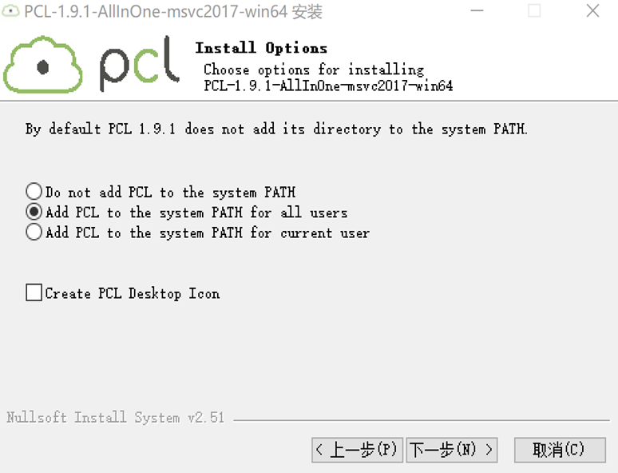

*Fig.4.2.3:   “Add PCL to the system PATH for all users”*

Next, set the installation path to disk D or the path the reader wants to save, and the system will automatically create a "PCL 1.9.1" folder:


*Fig.4.2.4:   Installation path setting*

step2: The OpenNI installation interface will pop up during the installation process. Select the path (D:\PCL 1.9.1\3rdParty\OpenNI2) to install. Note that its installation path is consistent with the previous installation of PCL 1.9.1. For example, we are all disk D here, then OpenNI is also under the PCL 1.9.1 folder in disk D:


*Fig.4.2.5:   OpenNI installation path setting*

After the installation is complete, unzip **pcl-1.9.1-pdb-msvc2017-win64.zip**, and copy the unzipped **\*.pdb** file to "D:\PCL 1.9.1\bin".

step3: Set environment variables: right-click the computer icon, click properties, the interface shown in Fig.4.2.6 appears. Select **"高级系统设置 (Advanced System Settings)"**:


*Fig.4.2.6:   environment variables setting 1*

Select **环境变量 (Environment Variables)** in the pop-up box, then select the **Path** column in the system variables, and click **编辑 (Edit)**:

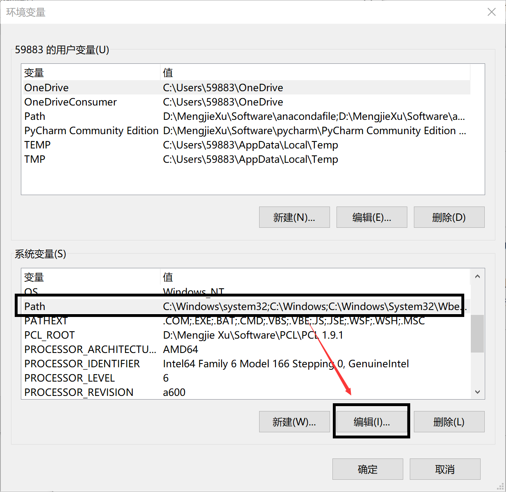

*Fig.4.2.7:   environment variables setting 2*

Add the path in the following box and **restart the computer** after completion:


*Fig.4.2.8:   environment variables setting 3*

###### PCL 1.9.1 environment configuration

> NB: This part must be done every time a new project is created, and the previous PCL installation and environment variable setting operations can be done once!

step1: **"Create a new project... (创建新项目...)"**, as shown in Fig.4.2.9:


*Fig.4.2.9:   Create a new project*

step2: For the new project category, select **"Console Application (控制台应用)"**, and set the path and name as shown in Fig.4.2.10:

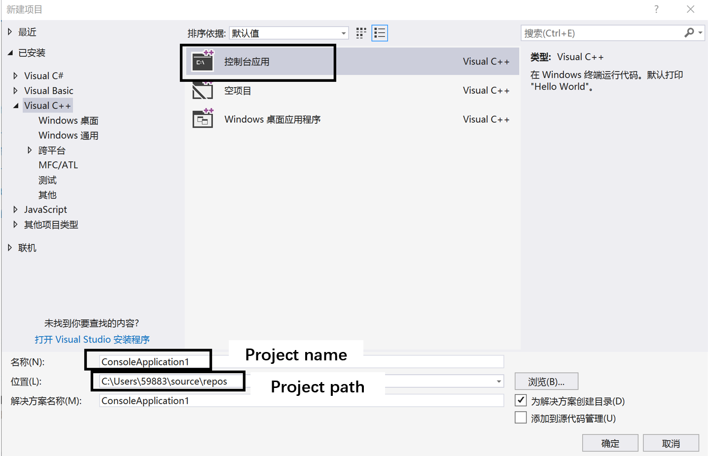

*Fig.4.2.10:   Console Application*

step3: Select Release and x64：

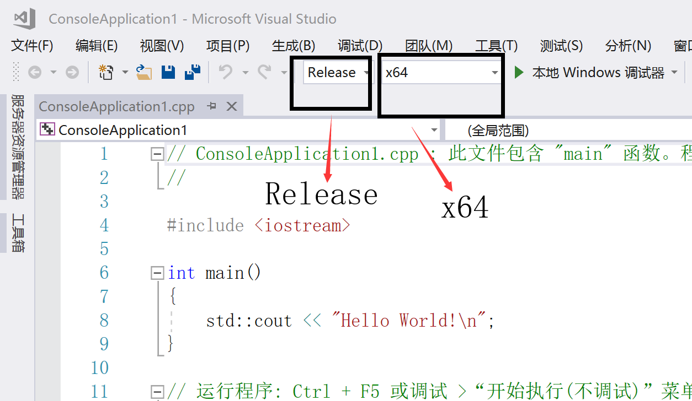

*Fig.4.2.11:   Release and x64*

step4: Right-click the console application name and select "Properties (属性)":


*Fig.4.2.12:   Properties*

step5: VC++ directory — include directory (包含目录), add 7 paths:

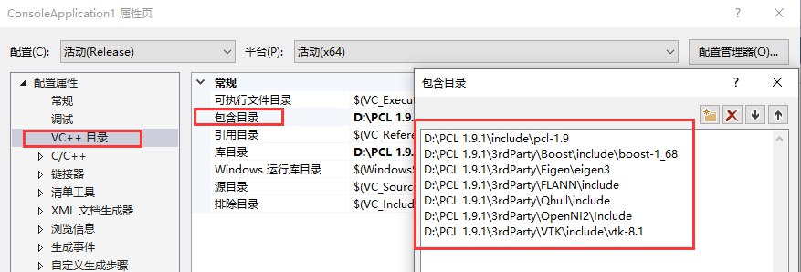

*Fig.4.2.13:   Include directory*

step6: VC++ directory — library directory (库目录), add 6 paths:


*Fig.4.2.14:   Library directory*

step7: C/C++ — 常规 — SDL 检查 — 否 (/sdl-)：


*Fig.4.2.15:   SDL*

step8: "Linker (链接器)" — "input (输入)" — "additional dependencies (附加依赖项)" — Add PCL and VTK related lib files:

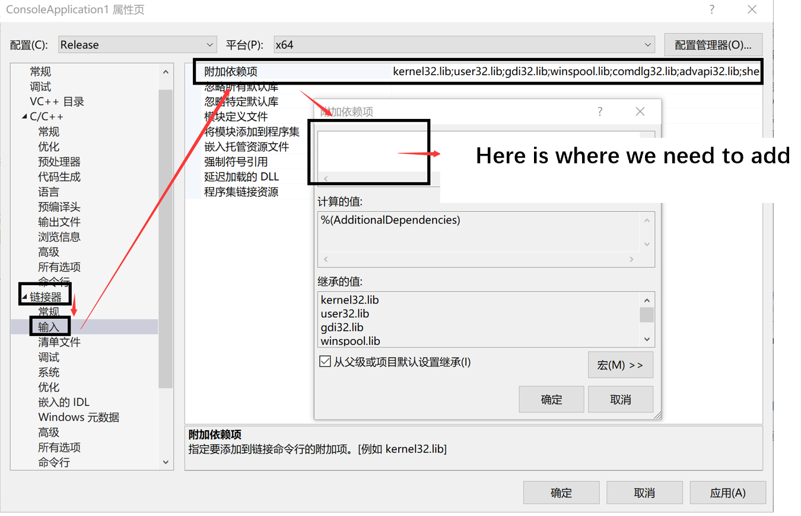

*Fig.4.2.16:   Additional dependencies*

The additional dependencies to be added are as follows:

```
pcl_common_release.lib
pcl_features_release.lib
pcl_filters_release.lib
pcl_io_ply_release.lib
pcl_io_release.lib
pcl_kdtree_release.lib
pcl_keypoints_release.lib
pcl_ml_release.lib
pcl_octree_release.lib
pcl_outofcore_release.lib
pcl_people_release.lib
pcl_recognition_release.lib
pcl_registration_release.lib
pcl_sample_consensus_release.lib
pcl_search_release.lib
pcl_segmentation_release.lib
pcl_stereo_release.lib
pcl_surface_release.lib
pcl_tracking_release.lib
pcl_visualization_release.lib
vtkalglib-8.1.lib
vtkChartsCore-8.1.lib
vtkCommonColor-8.1.lib
vtkCommonComputationalGeometry-8.1.lib
vtkCommonCore-8.1.lib
vtkCommonDataModel-8.1.lib
vtkCommonExecutionModel-8.1.lib
vtkCommonMath-8.1.lib
vtkCommonMisc-8.1.lib
vtkCommonSystem-8.1.lib
vtkCommonTransforms-8.1.lib
vtkDICOMParser-8.1.lib
vtkDomainsChemistry-8.1.lib
vtkexoIIc-8.1.lib
vtkexpat-8.1.lib
vtkFiltersAMR-8.1.lib
vtkFiltersCore-8.1.lib
vtkFiltersExtraction-8.1.lib
vtkFiltersFlowPaths-8.1.lib
vtkFiltersGeneral-8.1.lib
vtkFiltersGeneric-8.1.lib
vtkFiltersGeometry-8.1.lib
vtkFiltersHybrid-8.1.lib
vtkFiltersHyperTree-8.1.lib
vtkFiltersImaging-8.1.lib
vtkFiltersModeling-8.1.lib
vtkFiltersParallel-8.1.lib
vtkFiltersParallelImaging-8.1.lib
vtkFiltersPoints-8.1.lib
vtkFiltersProgrammable-8.1.lib
vtkFiltersSelection-8.1.lib
vtkFiltersSMP-8.1.lib
vtkFiltersSources-8.1.lib
vtkFiltersStatistics-8.1.lib
vtkFiltersTexture-8.1.lib
vtkFiltersTopology-8.1.lib
vtkFiltersVerdict-8.1.lib
vtkfreetype-8.1.lib
vtkGeovisCore-8.1.lib
vtkgl2ps-8.1.lib
vtkhdf5-8.1.lib
vtkhdf5_hl-8.1.lib
vtkImagingColor-8.1.lib
vtkImagingCore-8.1.lib
vtkImagingFourier-8.1.lib
vtkImagingGeneral-8.1.lib
vtkImagingHybrid-8.1.lib
vtkImagingMath-8.1.lib
vtkImagingMorphological-8.1.lib
vtkImagingSources-8.1.lib
vtkImagingStatistics-8.1.lib
vtkImagingStencil-8.1.lib
vtkInfovisCore-8.1.lib
vtkInfovisLayout-8.1.lib
vtkInteractionImage-8.1.lib
vtkInteractionStyle-8.1.lib
vtkInteractionWidgets-8.1.lib
vtkIOAMR-8.1.lib
vtkIOCore-8.1.lib
vtkIOEnSight-8.1.lib
vtkIOExodus-8.1.lib
vtkIOExport-8.1.lib
vtkIOExportOpenGL-8.1.lib
vtkIOGeometry-8.1.lib
vtkIOImage-8.1.lib
vtkIOImport-8.1.lib
vtkIOInfovis-8.1.lib
vtkIOLegacy-8.1.lib
vtkIOLSDyna-8.1.lib
vtkIOMINC-8.1.lib
vtkIOMovie-8.1.lib
vtkIONetCDF-8.1.lib
vtkIOParallel-8.1.lib
vtkIOParallelXML-8.1.lib
vtkIOPLY-8.1.lib
vtkIOSQL-8.1.lib
vtkIOTecplotTable-8.1.lib
vtkIOVideo-8.1.lib
vtkIOXML-8.1.lib
vtkIOXMLParser-8.1.lib
vtkjpeg-8.1.lib
vtkjsoncpp-8.1.lib
vtklibharu-8.1.lib
vtklibxml2-8.1.lib
vtklz4-8.1.lib
vtkmetaio-8.1.lib
vtkNetCDF-8.1.lib
vtknetcdfcpp-8.1.lib
vtkoggtheora-8.1.lib
vtkParallelCore-8.1.lib
vtkpng-8.1.lib
vtkproj4-8.1.lib
vtkRenderingAnnotation-8.1.lib
vtkRenderingContext2D-8.1.lib
vtkRenderingContextOpenGL-8.1.lib
vtkRenderingCore-8.1.lib
vtkRenderingFreeType-8.1.lib
vtkRenderingGL2PS-8.1.lib
vtkRenderingImage-8.1.lib
vtkRenderingLabel-8.1.lib
vtkRenderingLIC-8.1.lib
vtkRenderingLOD-8.1.lib
vtkRenderingOpenGL-8.1.lib
vtkRenderingVolume-8.1.lib
vtkRenderingVolumeOpenGL-8.1.lib
vtksqlite-8.1.lib
vtksys-8.1.lib
vtktiff-8.1.lib
vtkverdict-8.1.lib
vtkViewsContext2D-8.1.lib
vtkViewsCore-8.1.lib
vtkViewsInfovis-8.1.lib
vtkzlib-8.1.lib
```

Add the above additional dependencies to be added to the location shown in Fig.4.2.16 "Here is where we need to add" to complete the entire configuration process of PCL 1.9.1.

Then delete the content in the black box in Fig.4.2.17 (the black box is some instructions for use. We can read it when we use it for the first time), and we can write our code here:

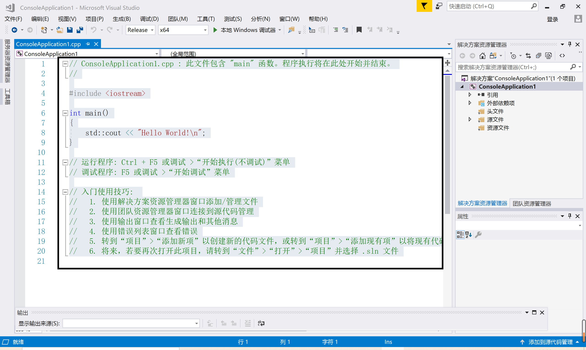

*Fig.4.2.17:   Prepare for writing code*


#### 4-2-2：Use CMake to compile the code

Another way to run is to use CMake to compile some algorithms in PCL. What is CMake?

"CMake is an open-source, cross-platform family of tools designed to build, test and package software. CMake is used to control the software compilation process using simple platform and compiler independent configuration files, and generate native makefiles and workspaces that can be used in the compiler environment of your choice."[^1]

CMake is used to control the software compilation process using a simple platform and a configuration file independent of the compiler and facilitate running code across IDE. It only needs a code file and CMakeList.txt.

The specific steps are as follows:

1. **Download and install VS 2017**
2. **Download and install PCL 1.9.1**
3. **Download and install CMake**
4. **Use CMake to compile the code**

Among them, **"Download and install VS 2017"** and **"Download and install PCL 1.9.1"** are the same as in Section 4-2-1, except the third part of **"Download and install PCL 1.9.1"** (PCL 1.9.1 environment configuration) does not need to be carried out.

> NB:
>
> - Step 1-3 only need to be performed once, but step 4 must be performed once every time a new project is compiled;
> - When compiling with CMake, we do not have to use the 2017 version of Visual Studio and the 1.9.1 version of PCL. We only need to correct the version when setting CMake.

##### Step1: see in [4-2-1](# —— VS 2017)

##### Step2: see in  [4-2-1](# —— PCL 1.9.1)

##### Step3: Download and install CMake

###### step 3-1: 

CMake download: https://cmake.org/download/. The installation package in the black box (corresponding to the system version of computer)

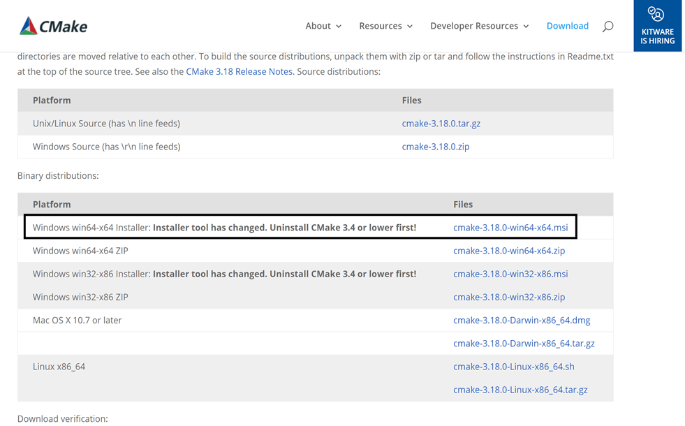

*Fig.4.2.18:   CMake download*

###### step 3-2: 

Double-click the downloaded msi file and install it as shown in the figure below:


*Fig.4.2.19:   Installation 1*


*Fig.4.2.20:   Installation 2*


*Fig.4.2.21:   Installation 3*

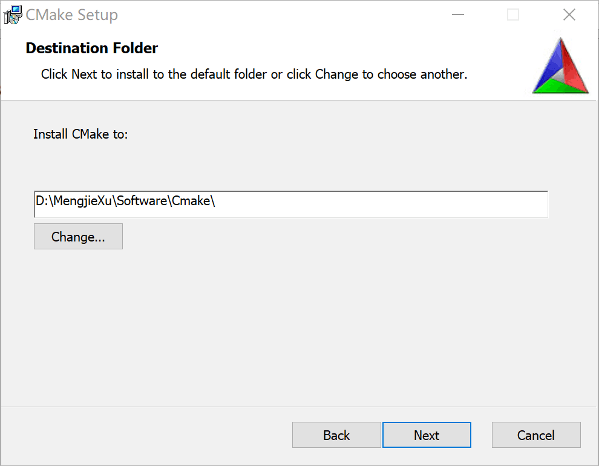

*Fig.4.2.22:   Installation 4*


*Fig.4.2.23:   Installation 5*

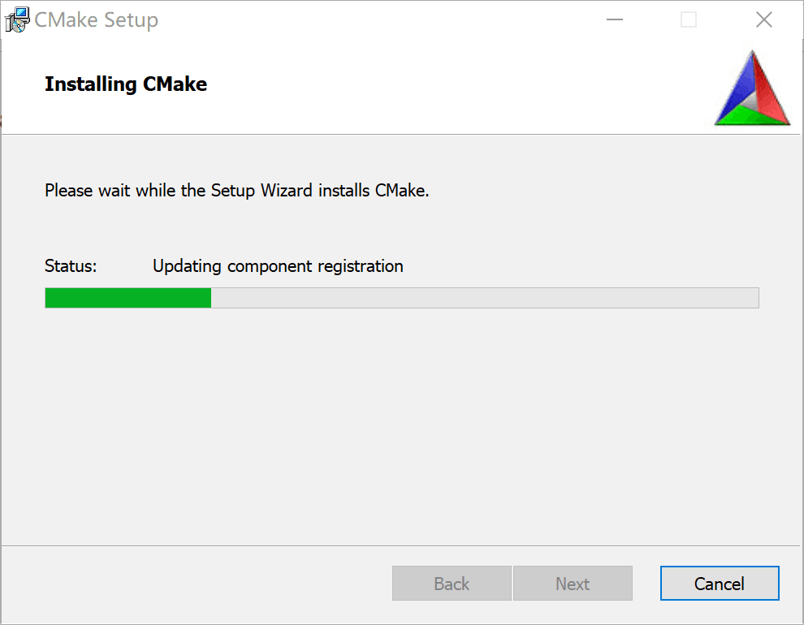

*Fig.4.2.24:   Installation 6*

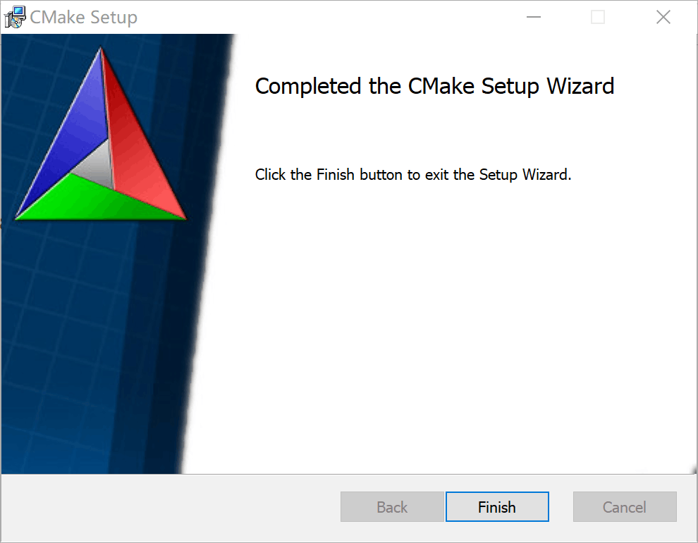

*Fig.4.2.25:   Installation 7*

The CMake installation is complete.

##### Step4: Use CMake to compile code

> NB: Step 4 is repeated every time a new project is compiled.

###### step 4-1: 

Create a new **cmake_bin** and **source** folders under the folder where you want to write cpp code.

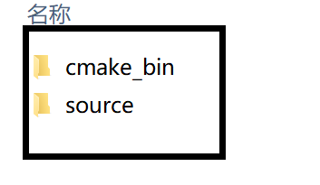

*Fig.4.2.26:   Create new folders*

###### step 4-2:

Create a new code file **.cpp** we want to run under the source folder (here is **test1.cpp**) and the CMake configuration file **CMakeList.txt** (**.cpp** file and **CMakeList.txt** are in "files" folder).


*Fig.4.2.27:   Create **.cpp** and **CMakeList.txt***

The **.cpp** file is the point cloud algorithm in PCL that we want to run. The algorithm will be explained in detail later. Here we only demonstrate how to run it with CMake;

The more important one is the **CMakeList.txt** writing rules, as shown in Fig.4.2.28:

Reference website: https://pcl.readthedocs.io/projects/tutorials/en/latest/using_pcl_pcl_config.html#using-pcl-pcl-config

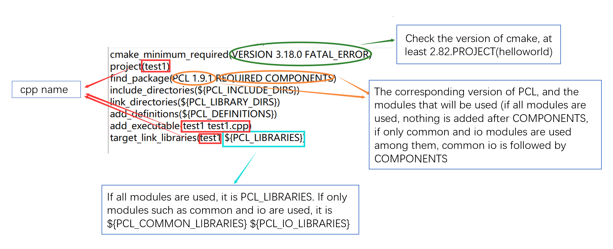

*Fig.4.2.28:   **CMakeList.txt** writing rules*

###### step 4-3: 

Open , set the relevant path:

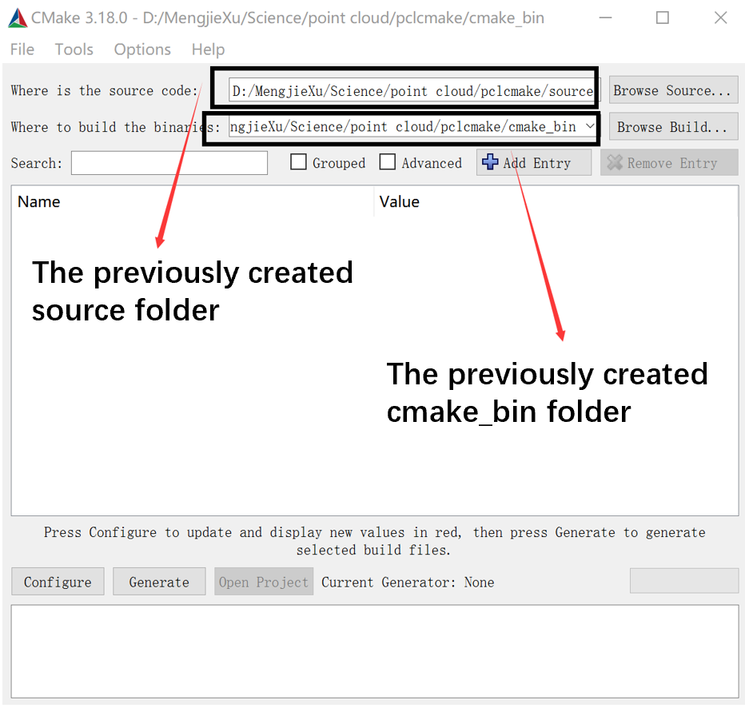

*Fig.4.2.29:   Select path*

###### step 4-4: 

Configure


*Fig.4.2.30:   Configure and setting*

Wait for the completion of compilation, and **Configuring done** appears:


*Fig.4.2.31:   Configure completed*

###### step 4-5:

Click Generate to run the file until **Generating done** is displayed under **Configuring done**


*Fig.4.2.32:   Generate*


*Fig.4.2.33:   Generating done*

###### step 4-6:

After the above operations, a series of files will be generated in the cmake_bin folder. Find the newly generated **ALL_BUILD.vcxproj** file in the cmake_bin folder (see in Fig.4.2.34):

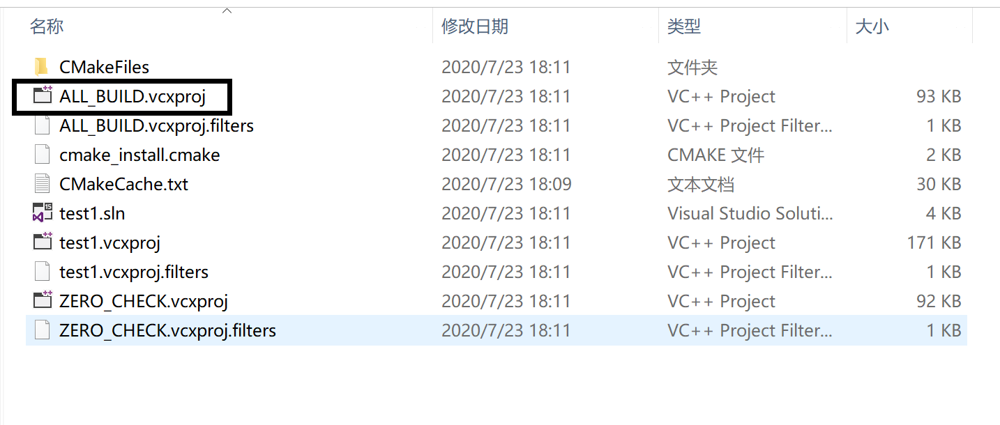

*Fig.4.2.34:   **ALL_BUILD.vcxproj***

Open it with Visual Studio, right-click ALL_BUILD, select Generate, and debug the file:


*Fig.4.2.35:   Debug **ALL_BUILD.vcxproj***

The view of successful debugging is as follows:

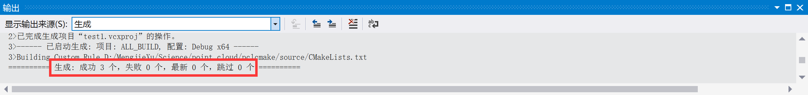

*Fig.4.2.36:   Debug the **ALL_BUILD.vcxproj** file successfully*

###### step 4-7: 

After debugging, click the Debug folder under the cmake_bin folder, and the **test1.exe** file will appear, as shown in Fig.4.2.37. At this time, click the win+R key, search for cmd, and follow the fig.4.2.38 to see the running result:


*Fig.4.2.37:   Generate exe* 

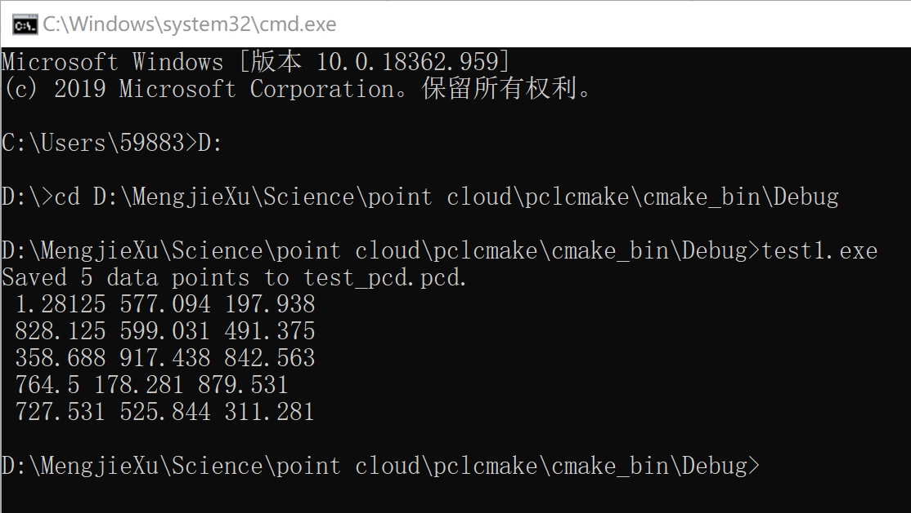

*Fig.4.2.38:   CMake compilation is complete*

The content of **test1.exe** executed is to generate a point cloud containing five points based on random, save it in the **test_pcd.pcd** file and output its data. There will be a detailed introduction in Section 4-3 I/O.

At this point, we can successfully use the algorithms in the PCL to process point cloud. Below we specifically explain how to call the PCL algorithm to write code.


### 4-3 ： I/O

Starting from this part, we will introduce the specific processing of point cloud and some PCL algorithms, which requires readers to have basic C++ programming knowledge. Besides, an in-depth understanding of PCL algorithms needs to be based on a specific linear algebra and machine vision. Readers are advised to learn by themselves. The complete code of each section is in [Appendix](# Appendix).

Reading and writing are the most fundamental issues in dealing with any file. Similarly, to process point cloud files using PCL, we first need to read the point cloud files and learn to output and save the processed point cloud files. So this section introduces point cloud I/O, that is, point cloud input and output.


#### 4-3-1 ： Read pcd file

Because the pcd file is the officially designated file format of PCL, this section introduces the reading of the pcd file in PCL:

##### Example

Take **bunny.pcd** (see in "files" folder) as an example. This file is the front of a rabbit, as shown in Fig.4.3.1. The code **pcd_read.cpp** is for reading data in **bunny.pcd**. For the complete code **pcd_read.cpp** see in  [Appendix —— 4.3.1 Read pcd file](# 4.3.1 ：Read pcd file):


*Fig.4.3.1:   **bunny.pcd***

A detailed explanation of the **pcd_read.cpp**:

The following three lines are the header files needed to read a point cloud file.

```C++
// Input and output related header file in the standard C++ library
#include <iostream>   
// pcd reads and writes related header file in PCL
#include <pcl/io/pcd_io.h>  
// Point type header file supported in PCL
#include <pcl/point_types.h>     
```

Among them: <iostream> means input (**i**n) output (**o**ut) stream (**stream**).

> What is the header file?
>
> The header file, as a carrier file containing declarations of functions and data interfaces, is mainly used to save program declarations [^2][^3].
>
> The content of the header file is also the C++ source code, similar to the content of the .cpp file, but the header file does not need to be compiled. We put all the function declarations that will be used into a header file. When a certain .cpp source file needs them, they can be included in the .cpp file through a macro command "#include" to include them. The content of this header file merged into the .cpp file. When the .cpp file is compiled, these included header files play a role[^4].
>
> Among them, "include" is a macro command, which will work when the compiler is pre-compiled. The function of "#include" is to directly copy the content of the file behind it to the current file, which is a simple text replacement. Therefore, "#include <pcl/io/pcd_io.h>" in the pcd_read.cpp file will be replaced with the content of the pcd_io.h file before compilation. That is, when the compilation process is about to start, the content of pcd_read.cpp has changed [^4].
>

------


From this part, we will enter the main function, and the code in all subsequent chapters is also the same: after the header file part is imported, enter the main function:

```C++
int
main()
{
......   —— Where to write the code
}
```

------


The following line of code creates a PointCloud<PointXYZ> boost shared pointer and instantiates it. In general, it creates a point cloud object "cloud" containing the XYZ information of each point (the name of the point cloud object can be self-made, here named "cloud").

```C++
  pcl::PointCloud<pcl::PointXYZ>::Ptr cloud (new pcl::PointCloud<pcl::PointXYZ>);
```

Among them, PointXYZ is one of the available Point types in PCL, including 25 types. We can search based on the following and use the appropriate Point type when creating a new object:

```
1. PointXYZ:   XYZ coordinate;
2. PointXYZI:   XYZ coordinate + Indensity(I);
3. PointXYZRGBA:   XYZ coordinate + RGBA;
4. PointXYZRGB:   XYZ coordinate + RGB;
5. PointXY:   XY coordinate;
6. InterestPoint:   XYZ coordinate + strength;
7. Normal:   Normal_xyz coordinate + curvature;
8. PointNormal:   XYZ coordinate + Normal_xyz coordinate + curvature;
9. PointXYZRGBNormal:   XYZ coordinate + RGB + Normal_xyz coordinate + curvature;
10. PointXYZINormal:   XYZ coordinate + Intensity + Normal_xyz coordinate + curvature;
11. PointWithRange:   XYZ coordinate + range;
12. PointWithViewPoint:   XYZ coordinate + viewpoint;
13. MomentInvariants:   The point type of 3 invariant moments on the front sampled           surface, describing the mass distribution of the surface;
14. PrincipalRadiiRSD:   Contains two RSD radius on the surface block: r_min, r_max;
15. Boundary:   A simple point type of whether a point lies on the boundary of the           surface;
16. PrincipalCurvatures:   Principal curvature of a given point;
17. PFHSignature125:   PFH at a given point;
18. FPFHSignature33:   FPFH at a given point;
19. VFHSignature308:   VFH at a given point;
20. Narf36:   NARF at a given point;
21. BorderDescription:   The boundary type of a given point;
22. IntensityGradient:   The gradient of the intensity of a given point;
23. Histogram:   General purpose n-dimensional histogram;
24. PointWithScale:   XYZ coordinate + The scale at which a point is applied to geometric     operations;
25. PointSurfel:   XYZ coordinate + Normal_xyz coordinate + RGB + Radius + confidence +       curvature;
```

------


The following code loads PointCloud data from the computer path (replace "..." with the path where the file is located).

```C++
 if (pcl::io::loadPCDFile<pcl::PointXYZ> (".../bunny.pcd", *cloud) == -1) 
  {
    PCL_ERROR ("Couldn't read file bunny.pcd \n");
    return (-1);
  }
```

Among them:

- “loadPCDFile” is to load pcd files;
- The <PointXYZ> after "loadPCDFile" means that the XYZ information of each point in the file is read;
- In parentheses after <PointXYZ >: (the file to be read, the name of the point cloud object where the file is saved), here save our **bunny.pcd** file to the "cloud" object created by the previous code. Because "cloud" is a pointer type point cloud object, add a "*" in front of cloud;
- If it is successfully loaded, nothing will be output. Continue with the following code;
- If one of the situations of "file not created/path error/file invalid" occurs, then pcl::io::loadPCDFile <PointXYZ> (".../bunny.pcd", *cloud) == -1 is true, it will output "Couldn't read file bunny.pcd".

------


The following code outputs the number of points in **bunny.pcd**, and outputs the x, y, and z coordinates of each point through the "for" loop.

```C++
std::cout << "Loaded "
            << cloud->width * cloud->height     // the number of points
            << " data points from bunny.pcd with the following fields: "
            << std::endl;
  for (std::size_t i = 0; i < cloud->points.size (); ++i)
    std::cout << "    " << cloud->points[i].x      // x coordinate
              << " "    << cloud->points[i].y      // y coordinate
              << " "    << cloud->points[i].z      // z coordinate
              << std::endl;  
```

Among them:

"std::cout <<" is followed by the output content, and the output content can be connected with "<<";

cloud->width is the width of the point cloud, cloud->height is the height of the point cloud, multiplying the two is the total number of point cloud. The data in **bunny.pcd** already exists in the cloud, so the output is the corresponding information of **bunny.pcd**;

"std::endl" is the end mark of each output part;

cloud->points.size() is the total number of points in the point cloud object "cloud";

cloud->points[i].x is the x coordinate value of the point with sequence number i in "cloud";

cloud->points[i].y is the y coordinate value of the point with sequence number i in "cloud";

cloud->points[i].z is the z coordinate value of the point with sequence number i in "cloud";

------


If the reading is successful, it will output:

```C++
Loaded 397 data points from bunny.pcd with the following fields:
    0.0054216 0.11349 0.040749
    -0.0017447 0.11425 0.041273
    -0.010661 0.11338 0.040916
    0.026422 0.11499 0.032623
    0.024545 0.12284 0.024255
    0.034137 0.11316 0.02507
......  // "......" represents the remaining data displayed, but here as an example, not all are shown
```

Among them:

The "397" output in the first line is obtained by "cloud->width * cloud->height";

The rest of the green data is the XYZ coordinate value of each point in **bunny.pcd**.

Fig.4.3.2 shows part of the results printed by the console (the first ten rows of data):


*Fig.4.3.2:   Screenshot of running results*

------


If the **bunny.pcd** file does not exist, it will display:


```c++
Couldn't read file bunny.pcd
```


#### 4-3-2 ：Write pcd file

##### Example

This section will introduce how to save point cloud data in a new pcd file. We will explain an example. The purpose is to save five randomly generated data points as a new pcd file.

The following is a detailed explanation of the code, the complete code **pcd_write.cpp** see in [Appendix —— 4.3.2 Write pcd file](# 4.3.2 ：Write pcd file).

The following three lines of code are the header files needed to write the pcd file.


```c++
// Input and output related header file in the standard C++ library
#include <iostream>   
// pcd reads and writes related header file in PCL
#include <pcl/io/pcd_io.h>  
// Point type header file supported in PCL
#include <pcl/point_types.h>
```

------


The following line of code describes the template class PointCloud that we will instantiate and instantiates it as a point cloud object "cloud". The data type of each point is set to "pcl:: PointXYZ", which means that the point cloud file contains the x, y, z information of the point.

What is introduced in Section 4-3-1 is a method of creating by **pointer**, and here is a method of **common creation**:


```C++
  pcl::PointCloud<pcl::PointXYZ> cloud;
```

The following summarizes the two methods of point cloud object creation, both of which create a point cloud object named "cloud":

​      **A.  Pointer creation**

```c++
  pcl::PointCloud<pcl::PointXYZ>::Ptr cloud (new pcl::PointCloud<pcl::PointXYZ>);
```

​      **B. Common creation**

```
  pcl::PointCloud<pcl::PointXYZ> cloud;
```

------


The following code fills the point cloud object "cloud" with random point values and sets the appropriate parameters (width, height, is_ dense):

```C++
  // Fill point cloud data
  cloud.width  = 5;  // Point cloud width
  cloud.height = 1;   // Point cloud height (if 1, unorganized point cloud)
  cloud.is_dense = false;    // Point cloud contains Inf/NaN
  cloud.points.resize (cloud.width * cloud.height);
  // Random number assignment
  for (std::size_t i = 0; i < cloud.points.size (); ++i)
  {
    cloud.points[i].x = 1024 * rand () / (RAND_MAX + 1.0f);
    cloud.points[i].y = 1024 * rand () / (RAND_MAX + 1.0f);
    cloud.points[i].z = 1024 * rand () / (RAND_MAX + 1.0f);
  }
```

Among them:

The width and height are explained in the previous explanation of the content format of pcd. They correspond to the width and height of the point cloud and have different meanings in different point clouds;

The difference between cloud.width and cloud->width: The former means that the cloud is created by common creation, the latter is created by pointers. cloud.height, cloud.is_dense, cloud.points.resize(), cloud.points[i]. x, cloud.points[i].y, cloud.points[i].z, cloud.points.size() are the same;

"is_dense" is used to judge whether the data in points is finite: finite is true, which means that the point cloud does not contain Inf/NaN. In other words, it is to judge whether the point in the point cloud contains the value of Inf/NaN (the inclusion is false);

cloud.points.resize is to set the structure of cloud by width and height;

------


The following line of code stores PointCloud object data in the **test_pcd. pcd** file under the corresponding path:

```C++
  pcl::io::savePCDFileASCII (".../test_pcd.pcd", cloud);
```

Among them:

savePCDFileASCII means to save the data as a PCD file whose encoding method is ASCII. The first parameter in brackets is the path and name of the new file, and the second parameter is the name of the point cloud object (if it is a point cloud object created by pointer type, then we should write "*cloud" here; if it is a common creation, write cloud as in the above).

The saved PCD has four formats:

savePCDFile: save the point cloud as a PCD file. The default is ASCII format;

savePCDFileASCII: save the point cloud data as a PCD file in ASCII format;

savePCDFileBinary: save the point cloud data as a PCD file in Uncompressed Binary format;

savePCDFileBinaryCompressed: Save the point cloud data as a PCD file in Compressed Binary format.

------


The following code outputs the contents of the stored point cloud file **test_pcd.pcd**, including the number of points in the point cloud and the XYZ coordinate value of each point.


```C++
  std::cout << "Saved " << cloud.points.size () << " data points to test_pcd.pcd." << std::endl;   // output number of points

  for (std::size_t i = 0; i < cloud.points.size (); ++i)
    std::cout << "    " << cloud.points[i].x << " " 
                        << cloud.points[i].y << " " 
                        << cloud.points[i].z 
                        << std::endl;    // xyz coordiante
```

------


The result after successful operation shows:


```C++
Saved 5 data points to test_pcd.pcd.
 1.28125 577.094 197.938
 828.125 599.031 491.375
 358.688 917.438 842.563
 764.5 178.281 879.531
 727.531 525.844 311.281
```


*Fig.4.3.3: Running results*

------


Open the generated **test_pcd.pcd** file, we can see the file content is as follows. We can compare the PCD content explained in the file format introduced in Chapter 3 to understand:


```c++
# .PCD v0.7 - Point Cloud Data file format
VERSION 0.7
FIELDS x y z
SIZE 4 4 4
TYPE F F F
COUNT 1 1 1
WIDTH 5
HEIGHT 1
VIEWPOINT 0 0 0 1 0 0 0
POINTS 5
DATA ascii
1.28125 577.09375 197.9375
828.125 599.03125 491.375
358.6875 917.4375 842.5625
764.5 178.28125 879.53125
727.53125 525.84375 311.28125
```


*Fig.4.3.4:   **test_pcd.pcd***


#### 4-3-3 ：Combine pcd files

Concatenating files, that is, combining files, sometimes we need to combine multiple files. There are two situations for concatenating two point cloud files:

① **The type and dimension of the fields in the two data sets are the same**, and the result of connecting two point clouds is that the total number of points in the point cloud file **increases**;

② **The number of points in the two data sets is the same**. We are connecting two different point cloud fields (such as color, normal, curvature, etc.) (normal and curvature will be explained in detail in the following algorithm). This connection is that **the number of points in the point cloud file has not changed**, but the **dimensionality has increased**.

As shown in Fig.4.3.5: The left one is corresponding to situation ①, which both have the same fields —— X, Y, Z. The result is that the total number of points increases, while the right one is corresponding to situation ②, which both have three points. The number of points has not changed, but the dimensionality has increased to X, Y, Z, N_x, N_y, N_z, curvature.


*Fig.4.3.5:   Two situations*

##### Example

Here we explain an example **pcd_combine.cpp**, to introduce how to realize the above two methods of connecting point clouds: how to connect two point clouds to increase the number of new point clouds and connect two point clouds to increase dimension. See [Appendix —— Combine pcd files](# 4.3.3 ：Combine pcd files) for the complete code:

The following three lines of code are the header files needed to connect two pcd files.


```c++
// Input and output related header file in the standard C++ library
#include <iostream>   
// pcd reads and writes related header file in PCL
#include <pcl/io/pcd_io.h>  
// Point type header file supported in PCL
#include <pcl/point_types.h>  
```

------


The following code initialization defines five point cloud objects, which are all created in common way.


```c++
  // Create five objects
  pcl::PointCloud<pcl::PointXYZ> cloud_a, cloud_b, cloud_c; 
  pcl::PointCloud<pcl::Normal> n_cloud_b;
  pcl::PointCloud<pcl::PointNormal> p_n_cloud_c;
```

Among them:

cloud_a, cloud_b, cloud_c are point cloud objects in pcl::PointXYZ format, that is, these three point cloud objects contain the x, y, z coordinate information;

n_cloud_b is a point cloud object in pcl::Normal format, that is, this point cloud object contains the normal and curvature information;

p_n_cloud_c is a point cloud object in pcl::PointNormal format, that is, this point cloud object contains the x, y, z coordinate, normal and curvature information;

------


The following three lines of code set the width and height of the point cloud "cloud_a", and use resize to determine the structure and number of points to be stored in the point cloud object "cloud_a". Here, the heights of cloud_a, cloud_b and n_cloud_b are all set to 1, which means that these three point clouds are all **unorganized point clouds**.


```c++
  // Set cloud_a specific format
  cloud_a.width = 5;
  cloud_a.height = cloud_b.height = n_cloud_b.height = 1;
  cloud_a.points.resize(cloud_a.width * cloud_a.height);
```

------


The following two code lines use "resize" to determine the number of points to be stored in the point cloud object "cloud_b" by setting the width.


```c++
  // Set cloud_b specific format
  cloud_b.width = 3;
  cloud_b.points.resize(cloud_b.width * cloud_b.height);
```

------


Same as the setting of "cloud_b", the following two lines of code only set the width of "n_cloud_b". Because the unordered format has been set together in the operation of setting "cloud_a". See the specific format of setting "cloud_a".


```c++
   // Set n_cloud_b specific format
  n_cloud_b.width = 5;
  n_cloud_b.points.resize(n_cloud_b.width * n_cloud_b.height);
```

------


The following code sequentially fills in the point cloud objects cloud_a, cloud_b, and n_cloud_b that have been formatted by generating random numbers and a “for” loop.

> NB: Although the type of n_cloud_b includes normal and curvature, n_cloud_b here does not give the value of curvature, so the generated data only has normal information and no curvature information.

cloud_a.points.size(), cloud_b.points.size(), n_cloud_b.points.size() represent the total number of cloud_a, cloud_b, and n_cloud_b respectively.


```c++
  // Fill in cloud_a, cloud_b, n_cloud_b
  for (std::size_t i = 0; i < cloud_a.points.size(); ++i)
  {
      cloud_a.points[i].x = 1024 * rand() / (RAND_MAX + 1.0f);
	  cloud_a.points[i].y = 1024 * rand() / (RAND_MAX + 1.0f);
	  cloud_a.points[i].z = 1024 * rand() / (RAND_MAX + 1.0f);
  }

  for (std::size_t i = 0; i < cloud_b.points.size(); ++i)
  {
	  cloud_b.points[i].x = 1024 * rand() / (RAND_MAX + 1.0f);
	  cloud_b.points[i].y = 1024 * rand() / (RAND_MAX + 1.0f);
	  cloud_b.points[i].z = 1024 * rand() / (RAND_MAX + 1.0f);
  }

  for (std::size_t i = 0; i < n_cloud_b.points.size(); ++i)
  {
   n_cloud_b.points[i].normal[0] = 1024 * rand() / (RAND_MAX + 1.0f);
   n_cloud_b.points[i].normal[1] = 1024 * rand() / (RAND_MAX + 1.0f);
   n_cloud_b.points[i].normal[2] = 1024 * rand() / (RAND_MAX + 1.0f);
  }
```

------


The following code displays the x, y, z data of cloud_a and cloud_b, and the normal of n_cloud_b:

```C++
// Output point cloud information
std::cout << "Cloud A: " << std::endl;
	for (std::size_t i = 0; i < cloud_a.points.size(); ++i)
		std::cout << "    " << cloud_a.points[i].x << " " 
                            << cloud_a.points[i].y << " " 
                            << cloud_a.points[i].z << std::endl;

	std::cout << "Cloud B: " << std::endl;
	for (std::size_t i = 0; i < cloud_b.points.size(); ++i)
		std::cout << "    " << cloud_b.points[i].x << " " 
                            << cloud_b.points[i].y << " " 
                            << cloud_b.points[i].z << std::endl;
	
	std::cout << "Cloud n_B: " << std::endl;
	for (std::size_t i = 0; i < n_cloud_b.points.size(); ++i)
		std::cout << "    " << n_cloud_b.points[i].normal[0] << " "                                           << n_cloud_b.points[i].normal[1] << " "                                           << n_cloud_b.points[i].normal[2] 
                            << std::endl;
```

Among them:

n_cloud_b.points[i].normal[0] represents the x coordinate value of the normal of the i-th point in n_cloud_b;

n_cloud_b.points[i].normal[1] represents the y coordinate value of the normal of the i-th point in n_cloud_b;

n_cloud_b.points[i].normal[2] represents the z coordinate value of the normal of the i-th point in n_cloud_b.

------


If we need to connect **point cloud number**, the following code connects cloud_a and cloud_b to create cloud_c.


```C++
// Do not change the data of cloud_a, use cloud_c for subsequent addition   
cloud_c  = cloud_a; 
// cloud_c = cloud_c + cloud_b
cloud_c += cloud_b;
```

------


If we want to **connect fields**, the following code uses **pcl:: concatenateFields** to connect the cloud_a and n_cloud_b fields to create p_n_cloud_c;

The first two parameters in brackets are the point cloud files to be connected, and the last one is the result file.


```C++
    pcl::concatenateFields (cloud_a, n_cloud_b, p_n_cloud_c);
```

------


The following code is used to display the contents of cloud_c and p_n_cloud_c in the output.


```c++
	std::cout << "Cloud C: " << std::endl;
	for (std::size_t i = 0; i < cloud_c.points.size(); ++i)
		std::cout << "    " << cloud_c.points[i].x << " " 
                            << cloud_c.points[i].y << " " 
                            << cloud_c.points[i].z << " " 
                            << std::endl 
        
	std::cout << "Cloud p_n_C: " << std::endl;
	for (std::size_t i = 0; i < p_n_cloud_c.points.size(); ++i)
		std::cout << "    " << p_n_cloud_c.points[i].x << " " 
                            << p_n_cloud_c.points[i].y << " " 
                            << p_n_cloud_c.points[i].z << " " 
                            << p_n_cloud_c.points[i].normal[0] << " "                                         << p_n_cloud_c.points[i].normal[1] << " "                                         << p_n_cloud_c.points[i].normal[2] 
                            << std::endl;  
```

------


After the code runs successfully, it will display:

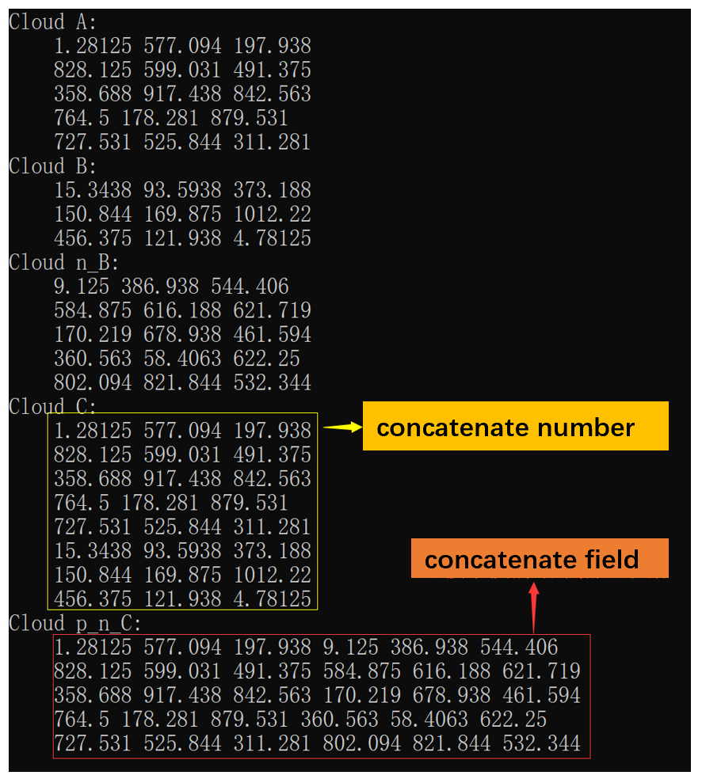

*Fig.4.3.6:   Running result*

As shown in Fig.4.3.6:

- The yellow box is the number of connected point clouds. The final result is that the number of points increases, but the dimension is still three;
- The red box is the dimension of the connected point cloud we said. The final result is that the dimension becomes six (coordinate_x, coordinate_y, coordinate_z, normal_x, normal_y, normal_z), and the number of points has not changed.


#### 4-3-4 ：Conversion between TXT and PCD

Chapter 3 introduces several point cloud file formats. When we are doing some specific point cloud processing, we can convert the file format as needed. Here we mainly introduce the conversion between txt and pcd, and other conversions can be done quickly in the software (see Section 3-8).

##### Convert TXT to PCD

###### Example

Convert a txt file (here we only consider the XYZ coordinate information of each point) into a pcd file. Take **chair.txt** as an example (Fig.4.3.7, see in "files" folder). Note that since **chair.txt** does not contain color information, it will display white by default when viewed in CloudComapre. If the canvas background is white, the point cloud view cannot be seen. At this time, refer to Chapter2 to set the color of the point cloud to distinguish the point cloud and the background for easy viewing. For the complete code **txt_to_pcd.cpp**, see in [Appendix —— Convert TXT to PCD](# 4.3.4: Convert TXT to PCD).


*Fig.4.3.7:   **chair.txt***

The following lines of code are the header files needed to convert txt to pcd.

"Using namespace std" means to call all the identifiers defined in the namespace std, such as "cout". By using namespace std, we do not need to write std::cout, write cout:


```c++
// Input and output related header file in the standard C++ library
#include <iostream>   
// "F"ile stream
#include <fstream> 
// pcd reads and writes related header file in PCL
#include <pcl/io/pcd_io.h>  
// Point type header file supported in PCL
#include <pcl/point_types.h>
// namespace std
using namespace std;  
```

------


The following code starts to implement the conversion from txt to pcd:

1. Create an object modelRead that reads txt files;
2. Use common creation methods to create a point cloud object "cloud" (PointXYZ means that the point cloud only contains XYZ coordinate information);
3. Create a point cloud "pclPnt" for each point:

```c++
fstream modelRead;
pcl::PointCloud<pcl::PointXYZ> cloud;
pcl::PointXYZ pclPnt;
```

------


The following code first opens the **chair.txt**, and then uses the while loop to push each point in the txt into the point cloud, in the order of x, y, z;

ios_base::in means to read the previous **chair.txt** into the current code program;

The while(!modelRead.eof()) sentence is used to judge whether the current file pointer has reached the end of the file (**e**nd **o**f **f**ile) position. If it has not reached the end of the file, continue Loop, otherwise end the loop;


```c++
modelRead.open(".../chair.txt", ios_base::in);
while(!modelRead.eof())
{
    modelRead >> pclPnt.x >> pclPnt.y >> pclPnt.z;
    cloud.push_back(pclPnt);
}
modelRead.close();
```

------


The following code saves each point in the cloud to **chair.pcd** under the corresponding path.


```c++
pcl::io::savePCDFile(".../chair.pcd",cloud);
```

------


**chair.txt** and **chair.pcd** are as follows:


*Fig.4.3.8:   **chair.txt** and **chair.pcd***

##### Convert PCD to TXT

###### Example

Convert a pcd file (here we only consider the XYZ coordinate information of each point) into a txt file, take **airplane.pcd** as an example (Fig.4.3.9, see in "files" folder). For the complete code **pcd_to_txt.cpp**, see in [Appendix —— Convert TXT to PCD](# 4.3.4: Convert TXT to PCD).


*Fig.4.3.9:   **airplane.pcd***

The following code is the header file needed to convert pcd to txt, and the namespace call:


```c++
// Input and output related header file in the standard C++ library
#include <iostream>   
// "F"ile stream
#include <fstream> 
// pcd reads and writes related header file in PCL
#include <pcl/io/pcd_io.h>  
// Point type header file supported in PCL
#include <pcl/point_types.h>
// namespace std
using namespace std;           
```

------


The following code first creates a cloud object that stores the point cloud and loads **airplane.pcd** into the cloud:


```c++
    pcl::PointCloud<pcl::PointXYZ>::Ptr cloud(new pcl::PointCloud<pcl::PointXYZ>);
    pcl::io::loadPCDFile<pcl::PointXYZ>(".../airplane.pcd", *cloud);
```

------


The following code sets the number of points Num in the txt file according to the size of the point cloud cloud. Because the pcd file here only has XYZ coordinate information, three arrays containing Num double elements are dynamically created, namely X, Y, Z;

double *X = new double[Num] {0}; 

double *Y = new double[Num] {0}; 

double *Z = new double[Num] {0};

The above three lines create an array dynamically because the common creation method cannot create an array of unknown length. Only through dynamic creation can an array of Num elements to be created. Num is a variable.


```c++
    int Num = cloud->points.size();
    double *X = new double[Num] {0};
    double *Y = new double[Num] {0};
    double *Z = new double[Num] {0};
```

------


The following code adds points in "cloud" to the created X, Y, Z array through a "for" loop:


```c++
    for (size_t i = 0; i < cloud->points.size(); ++i)
	{
		X[i] = cloud->points[i].x;
		Y[i] = cloud->points[i].y;
		Z[i] = cloud->points[i].z;
	}
```

------


The following code creates **airplane.txt** and writes the contents of the arrays X, Y, and Z into the txt file through a "for" loop to complete the conversion:


```c++
    ofstream zos(".../airplane.txt");
    for (int i = 0; i < Num; i++)
	{
		zos << X[i] << " " << Y[i] << " " << Z[i] << " " << endl;
	}
```

------


**airplane.pcd** and **airplane.txt** are as follows:

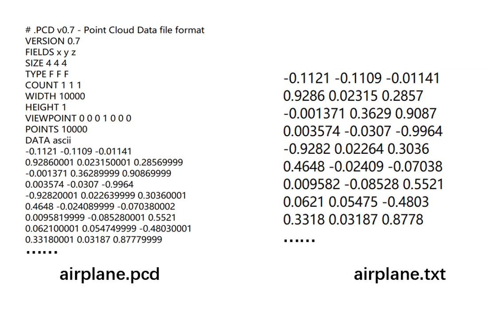

*Fig.4.3.10:   **airplane.pcd** and **airplane.txt***


### 4-4 ：Range Image

This section will introduce a new concept: **Range Image**, that is, **depth image**. As shown in its name, a range image is an image which includes **range (depth) information**. So what is range information exactly?

Here the range information indicates the **distance** between viewpoint(such as camera or scanner) and a point in scenario (As shown in Fig.4.4.1, the distance from red to blue corresponds to 0.3m — 1.5m. Redder, closer; bluer, farther. The red chair and dog are closer to us, while the yellow-green table and blue region are farther to us). So the information in the range image is richer (The range is also called depth). Fig.4.4.1 is a range image.

- We can make conversion between a range image and point cloud data. That is, the point cloud can be converted to range image, and vice versa. This operation can help us to obtain what data format we want to use. 
- The difference between range image and point cloud is that the former has range information while the latter does not have.


*Fig.4.4.1:   Range Image[^5]*

Here may be a question. The XYZ coordinate values can also indicate the location in 3D space. We can compute the distance between each point and another fixed point (such as viewpoint). Why do we need to use range image to get the distance between the viewpoint and a scenario?

The difference is:

① What information included in the point cloud is the coordinate information of each point, which can be computed to distance between viewpoints and points. But the coordinate information and distance are two different kinds of information before conversion;

② The coordinate information let point cloud can be converted to range image. Besides, the range image can show where it is nearer to us and where it is farther to us, while many point clouds can not do this.
Since the information in the point cloud and range image is different, the scenario will be different.


#### 4-4-1：Basic of Range Image

##### Get Range Image

How to get range image?

There are generally two ways to get range image: **Passive sensing** **&** **Active sensing**.

###### Passive sensing

The commonly used ways for passive sensing is **Binocular stereo vision**: 

Scanning the same scenario (Object/$P_w$ in Fig.4.4.2) by two cameras ($O_l$ and $O_r$ in Fig.4.4.2, which are separated by a certain distance), then we get two images. Next, finding the corresponding pixels between the two images, computing the disparity information. Based on this disparity information, we can get the distance from objects to the camera. that is, the depth information, as shown in Fig.4.4.2:

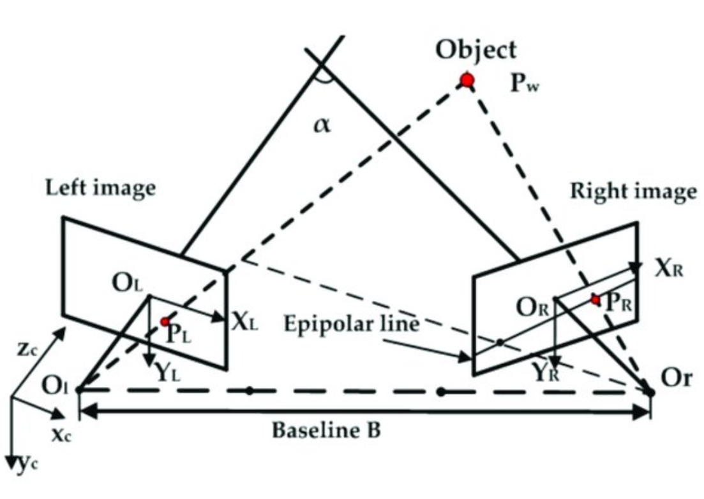

*Fig.4.4.2:   Binocular stereo vision[^6]*

###### Active sensing

The commonly used ways for active sensing are TOF (Time of Flight), structured light, laser scanner, etc.

**TOF**: By continuously emitting infrared light pulses of specific wavelengths to the object, then using the sensor to receive the signal from the target object, calculate the light phase difference, and then obtain the range information of each part of the object. This method usually used in the mobile camera, as shown in Fig.4.4.3:

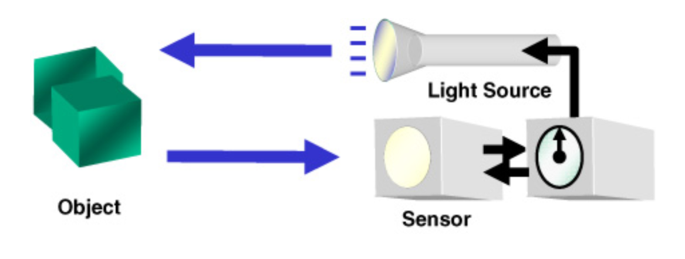

*Fig.4.4.3:   TOF (Time of Flight)[^5]*

**Structured light**: By emitting structured light to the object and then using an infrared camera to receive the light signal, calculate range information. As shown in Fig.4.4.4: 


*Fig.4.4.4:   Structured light[^7]*

**Laser scanner**: By emitting the laser to the scene space where the object is located at regular intervals and the time for each scanning point's signal to be reflected from the laser radar to the measured object and back to the laser radar is recorded. Finally, the range information of the object surface is calculated.

##### Range image view

The following figure is about range image view:

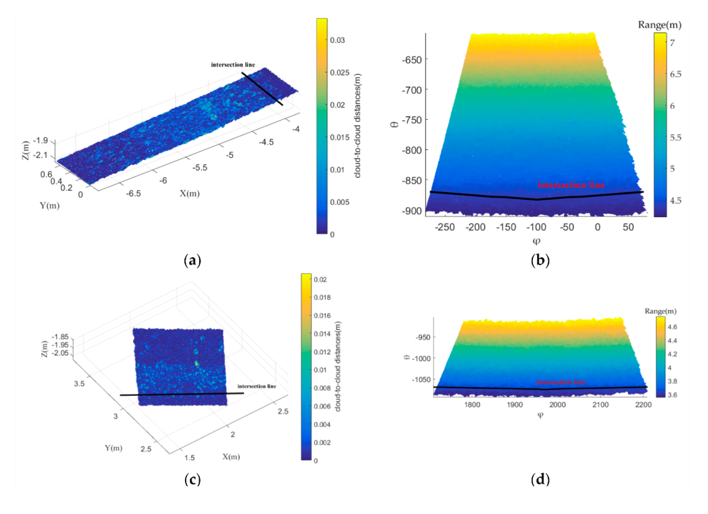

*Fig.4.4.5:   Range Image view[^8]*

As shown in Fig.4.4.5, (a) and (c) are the two different slope point clouds with different inclination angles; (b) and (d) are the corresponding range images for (a) and (c). We can see that from the icon "Range(m)" when the color is from blue to yellow, the distance is from closer to farther. That is to say, although visually we look at (b) and (d) as two trapezoids respectively, in fact, we add range information to the view, and we will feel that the dark blue part at the bottom is closer to us (or camera) than the yellow area at the top.


#### 4-4-2：How to create a range image from the point cloud

Sometimes, we have a point cloud, but we want to use **range information** to process subsequent operations. So we need to create a range image from the point cloud and to get range information. This section will introduce **how to create a range image from the point cloud**.

##### Example

Generating a range image from a rectangular point cloud. For the complete code **create_rangeimage.cpp**, see in [Appendix —— How to create a range image from the point cloud](# 4.4.2 ：How to create a range image from the point cloud)

The following is a detailed explanation of the **create_rangeimage.cpp**:

The following lines of code are the header files needed to create a range image.

```c++
#include <pcl/range_image/range_image.h> // range image header file
#include <pcl/io/pcd_io.h>   // pcd reads and writes related header file in PCL
```

------


The following code creates a rectangular point cloud and is saved in **rectangle.pcd**. The view of this file is in Fig.4.4.6.


```c++
	// create point cloud object "pointCloud"
    pcl::PointCloud<pcl::PointXYZ> pointCloud;   
	// create a rectangular point cloud, and saved in rectangle.pcd
	for (float y = -0.5f; y <= 0.5f; y += 0.01f) {
		for (float z = -0.5f; z <= 0.5f; z += 0.01f) {
			pcl::PointXYZ point;
			point.x = 2.0f - y;      // add the value of x in a loop
			point.y = y;             // add the value of y in a loop
			point.z = z;             // add the value of z in a loop
            // Pushback refers to insert a point from the current end
			pointCloud.points.push_back(point); 
		}
	}
    // set width of point cloud
	pointCloud.width = pointCloud.points.size(); 
    // set height of point cloud, we can get that this point cloud is unorganized
	pointCloud.height = 1;   

	pcl::io::savePCDFileASCII(".../rectangle.pcd", pointCloud);
```

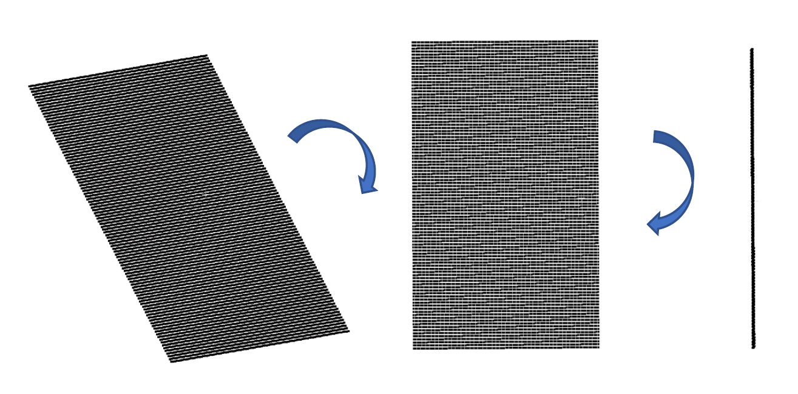

*Fig.4.4.6:   Rectangular point cloud view*

------


The following code sets parameters for range image. The detailed explanation for the range image is below the code*:


```c++
    // Set parameters for range image
	float angularResolution = (float)(1.0f * (M_PI / 180.0f)); 
 	float maxAngleWidth = (float)(360.0f * (M_PI / 180.0f)); 
	float maxAngleHeight = (float)(180.0f * (M_PI / 180.0f)); 
	Eigen::Affine3f sensorPose = (Eigen::Affine3f)Eigen::Translation3f(0.0f, 0.0f, 0.0f);
	pcl::RangeImage::CoordinateFrame coordinate_frame = pcl::RangeImage::CAMERA_FRAME;
	float noiseLevel = 0.00;
	float minRange = 0.0f;
	int borderSize = 1;
```

The explanation for parameters:

- **angularResolution**: The angular resolution for the sensor, that is, the angle corresponding to each pixel (shown in radian);
- **maxAngleWidth**: The horizontal viewing angle range for sensor (shown in radian);
- **maxAngleHeight**: The vertical viewing angle range for sensor (shown in radian);
- **sensorPose**: Sensor pose or collection location;
- **coordinate_frame**: Coordinate system. For CAMERA_FRAME (default), the X-axis is right, Y-axis is down, and Z-axis is forward. For LASER_FRAME, the X-axis is forward, Y-axis is left, and Z-axis is up;
- **noiseLevel**: The max distance from search point and nearest neighbors. Range information is computed based on the nearest neighbor of the search point;
- **minRange**: The minimum viewing range (default is 0). When the value is greater than 0, the blind zone is smaller than the minRange value;
- **borderSize**: The size of the point cloud boundary (default is 0);

------


The following code creates a range image object "rangeImage" and creates range image via parameters, then output the range image's content. Finally, save the range image into a new pcd file called **rectangle_range.pcd**.


```c++
    // create range image object "rangeImage"    
    pcl::RangeImage rangeImage; 

    // create rangeImage by parameters
	rangeImage.createFromPointCloud(pointCloud, angularResolution, maxAngleWidth, maxAngleHeight, sensorPose, coordinate_frame, noiseLevel, minRange, borderSize);

    // output the content of range image
	std::cout << rangeImage << "\n"; 
    
    // save range image in a new pcd file
	pcl::io::savePCDFileASCII(".../rectangle_range.pcd", rangeImage); 
```

------

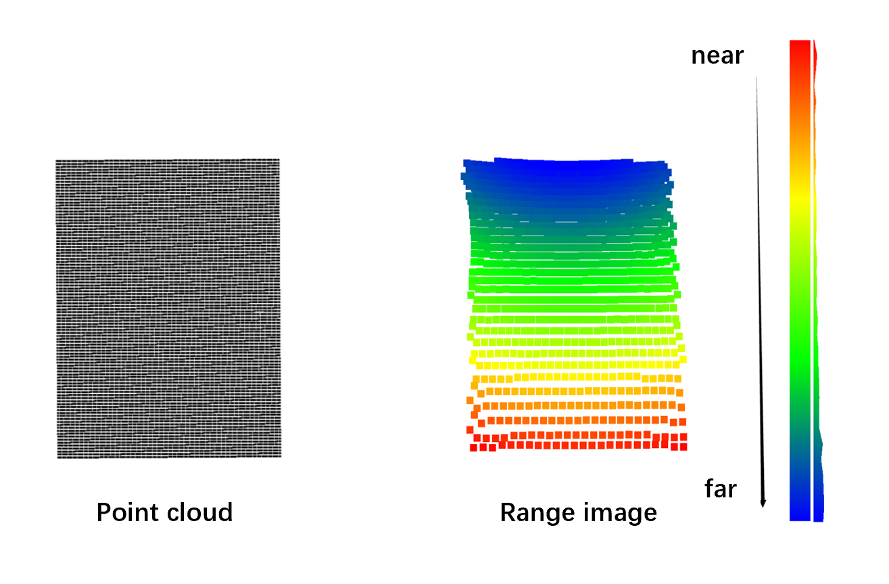

*Fig.4.4.7:   Point cloud and Range image*

As shown in Fig.4.4.7, the color in "Range image" is corresponding to the right icon "Range(m)", indicating that the blue part is farther from the viewpoint than the red part. If we only look at the point cloud, we would think that this is a rectangle parallel to the paper, but the lower point is closer to us, and the upper point is farther away.

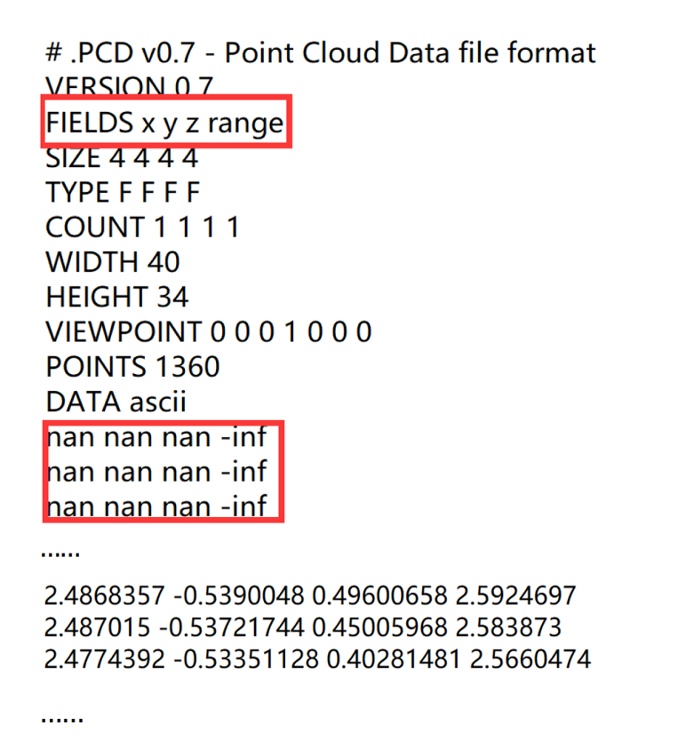

*Fig.4.4.8:   the content of range image* 

As shown in Fig.4.4.8, the fields of **rectangle_range.pcd** are x, y, z, and range, corresponding to XYZ coordinates and range information for each point. There are usually three types of data in range image pcd files:

① the value of range is more than 0, as shown in the three rows of data at the bottom of Fig.4.4.8, which means these are **effective points**, that is, visible points;

② x, y, z are all "nan", range is "-inf", as shown in the three rows of data in rea box of Fig.4.4.8, which means this kind of points are **not in the current viewpoint range**;

③ x, y, z are all "nan", range is "inf", which means these points are **too far away from the viewpoint and are invisible**;

> NB: Pay attention to ② and ③. The points are not in the current viewpoint range, not means they are too far away from the viewpoint. Sometimes they may be very close to the viewpoint, but the viewpoint has a range. The points are more than the range.

There are only ① and ② in **rectangle_range.pcd**.


The running results are as shown in Fig.4.4.9. Outputting width, height, and resolution, etc. of range image. 

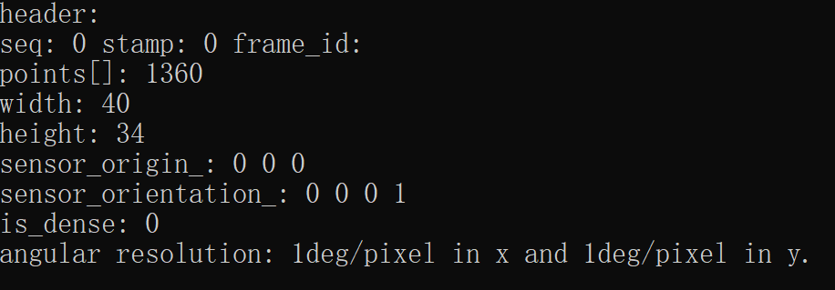

*Fig.4.4.9:   Running results*

The explanations for running results:

**header** is a structure that includes "seq", "stamp", and "frame_id". They are related to the laser scanner, usually see in ROS:

- **seq**: ID sequence with increasing scan order;
- **stamp**: Timestamp, a character sequence representing time, marking that the data has existed and can be verified before a certain time;
- **frame_id: **Data name, here our data is randomly generated, not obtained by the actual instrument, so no name is set;

**points[ ]**: The total number of points in range image;

**width & height**: They are the width and height of the range image. The height is not 1, which implies that the range image corresponds to the structure of an organized point cloud;

**sensor_origin_**: Corresponds to the sensorPose of the previous parameter setting part, so the value is "0 0 0":

```
Eigen::Affine3f sensorPose =(Eigen::Affine3f)Eigen::Translation3f(0.0f, 0.0f, 0.0f);
```

**sensor_orientation_**: The orientation of the sensor;

**is_dense**: Indicates whether the data is limited, here is 0, which means that the data contains inf/NaN;

**angular resolution**: The angular resolution in the XY direction is output.


#### 4-4-3：How to extract borders in range image

In image processing, **border** is an important concept. We can get the approximate shape or range of the object through its border, extract it from the background, and provide processing range for other algorithms. Sometimes, some key points are exactly borders (see in Section 4-5-1). This section will introduce "**how to extract borders in range image**".

##### Example

Extract borders from the created range image. For the complete code **extract_rangeimageborder.cpp** see in [Appendix —— 4.4.3：How to extract borders in range image](# 4.4.3 ：How to extract borders in range image)：

The following lines of code are the header files needed to extract borders from the range image.

"using namespace std;" It means namespace is std;

"typedef pcl::PointXYZ PointType;" It means use PointType to replace PointXYZ;


```C++
// input and output related header file in the standard C++ library
#include <iostream>   
// pcd reads and writes related header file in PCL
#include <pcl/io/pcd_io.h>  
// range image header file
#include <pcl/range_image/range_image.h> 
// extract borders from range image related header file
#include <pcl/features/range_image_border_extractor.h>  
using namespace std;   
typedef pcl::PointXYZ PointType;  
```

------


The following lines of code first create a rectangular point cloud object "point_cloud", filling data points through two for loops:

```C++
    // ------------------------
	// ---create point cloud---
	// ------------------------
	pcl::PointCloud<PointType> point_cloud;
	std::cout << "Generating example point cloud.\n\n";

	for (float x = -0.5f; x <= 0.5f; x += 0.01f)
	{
		for (float y = -0.5f; y <= 0.5f; y += 0.01f)
		{
			PointType point;  
            point.x = x;  
            point.y = y;  
            point.z = 2.0f - y;
			point_cloud.points.push_back(point);
		}
	}
	point_cloud.width = point_cloud.points.size();
    point_cloud.height = 1;
```

------


The following code implements the creation of range Image from the point cloud, see in Section 4-4-2, and save it in **rectangle_range.pcd**:

```C++
    // --create range image from point cloud--
    float angular_resolution = 0.5f;
	Eigen::Affine3f scene_sensor_pose(Eigen::Affine3f::Identity());
    pcl::RangeImage::CoordinateFrame coordinate_frame = pcl::RangeImage::CAMERA_FRAME;
    bool setUnseenToMaxRange = false;
	float noise_level = 0.0;
	float min_range = 0.0f;
	int border_size = 1;
	pcl::RangeImage::Ptr range_image_ptr(new pcl::RangeImage);
	pcl::RangeImage& range_image = *range_image_ptr;
	range_image.createFromPointCloud(point_cloud, pcl::deg2rad(angular_resolution), pcl::deg2rad(360.0f), pcl::deg2rad(180.0f),
		scene_sensor_pose, coordinate_frame, noise_level, min_range, border_size);
	if (setUnseenToMaxRange)
		range_image.setUnseenToMaxRange();

	// save range image
	pcl::io::savePCDFileASCII(".../rectangle_range.pcd", range_image);
```

*Parameters explanation:

- **angular_resolution**: The angular difference between the two beams represented by adjacent pixels (Non-radian representation);
- **scene_sensor_pose**: Sensor pose or collection location;
- **coordinate_frame**: Coordinate system. For CAMERA_FRAME (default), the X-axis is right, Y-axis is down, and Z-axis is forward. For LASER_FRAME, the X-axis is forward, Y-axis is left, and Z-axis is up;
- **setUnseenToMaxRange**: Whether to treat all unobservable points as the farthest points;
- **noiseLevel**: The max distance from search point and nearest neighbors. Range information is computed based on the nearest neighbor of the search point;
- **minRange**: The minimum viewing range (default is 0). When the value is greater than 0, the blind zone is smaller than the minRange value;
- **borderSize**: The size of the point cloud boundary (default is 0);

------


The following code first creates an extraction object "border_extractor" for the borders of the range image "range_image", then creates a border description sub-object "border_descriptions", and finally calculates the descriptor of the border extraction object and outputs the descriptions of the borders.


```c++
     // ------------------------------------------
     // -----Extract borders from range image-----
     // ------------------------------------------
     pcl::RangeImageBorderExtractor border_extractor(&range_image);
     pcl::PointCloud<pcl::BorderDescription> border_descriptions;
     border_extractor.compute(border_descriptions);

     // output descriptions of borders
     cout << border_extractor.getBorderDescriptions() << endl;
```

------


Fig.4.4.10 is the running results:

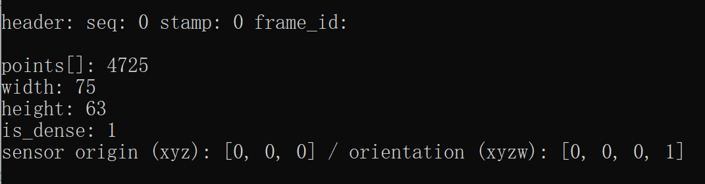

*Fig.4.4.10:   Running results*


### 4-5 ：Keypoints

Keypoints, also called interest points, which refers to points we are interested in. This concept is prevalent in the 2D image. After the image is rotated, enlarged or reduced, and distorted, Keypoints' relative position in the image is **almost unchanged**. Given this feature, we can apply it in scenes such as **2D pose estimation**, as shown in the following figure:

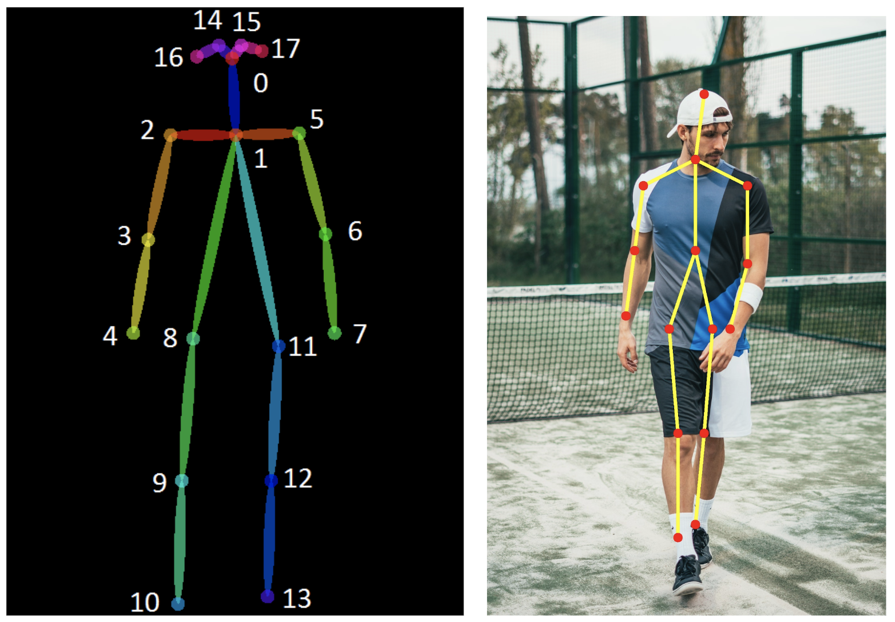

*Fig.4.5.1:   2D Pose estimation and Keypoints[^10]*

The red points in the right figure of Fig.4.5.1 are the Keypoints we used in 2D Pose estimation, which has essential information. In 2D computer vision, representative Keypoints algorithms are **SIFT**[^11], **SURF**[^12], **MSER** [^13], and **SUSAN**[^14]. Corresponding to 2D images, the application of Keypoints in 3D point clouds is becoming more critical.

"Keypoints" is a significant concept in the point cloud. Extracting Keypoints can transfer the points that need to be analyzed from all the points to a part of the point cloud. This part usually can represent the whole point cloud. Keypoints extraction is the low-level vision in the point cloud (that is, it is still based on "points" as the unit, which can be understood as "feature points"). There is a higher-level vision named the feature (That is, a more complex and advanced structure composed of "points") (see in Section 4-6). Combining Keypoints with Feature can process the original point cloud more effectively to obtain Descriptor, thereby significantly improving the point cloud processing algorithm's efficiency. The following figure is a schematic diagram of Keypoints detection in the point cloud. The marked color part is the detected Keypoints area:


*Fig.4.5.2:   Keypoints detection[^15]*

When we successfully detect Keypoints in a point cloud, we have learned some vital information in this point cloud, which can help us extract higher-level features. We can operate Object Detection, Classification, Matching, and Registration, etc. 
The common Keypoints extraction ways are ISS3D, Harris3D, and NARF, etc[^16]. Among them, NARF is used widely, so that this section will introduce NARF. What is NARF? Furthermore, what are the characteristics of NARF?


#### 4-5-1 : Introduction to NARF

##### NARF

NARF (Normal Aligned Radial Feature) is mainly used in Object Detection. Mainly for the feature description of the points of the range image. As shown in Fig.4.5.3, the white points are NARFs for this image. It can be seen that most of these NARFs come from the **boundary** of the geometry.

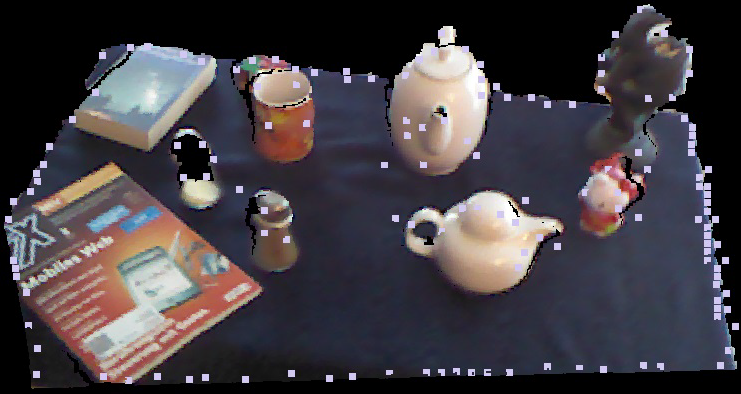

*Fig.4.5.3:   NARF[^17]*

Characteristics[^17]：

- NARF is extracted in a stable surface area (this can ensure the reliability of normal computation), and the neighborhood of this area varies greatly, which makes NARF mostly located in local areas with important geometric structures;
- The computation of NARF considers the border, which has a significant influence on the generated Keypoints. Because through the border, we can roughly know the external shape of an object.


##### The steps of algorithm[^17]：

step1: Convert point cloud to range image;

step2: Compute the normal of the edge area point;

step3: Compute the principle curvature of non-edge area points;

step4: Combine step 2 & 3 to calculate points of interest;

step5: Get NARF Keypoints.


#### 4-5-2 ：How to extract NARF Keypoints in range image

This section will introduce how to extract NARF Keypoints in the range image. Border can affect the extraction of NARF, so if we want to extract NARF accurately, we should first extract border in range image accurately (see in Section 4-4-3)

##### Example

The NARF Keypoints are extracted based on the borders extracted in the range image. Take **airplane.pcd** as an example:


*Fig.4.5.4:   **airplane.pcd***

For the complete code **extract_NARF_Keypoints_rangeimage.cpp** see in [Appendix —— 4.5.2 : How to extract NARF Keypoints in range image](# 4.5.2 ：How to extract NARF Keypoints in range image).

The following five lines of code are the header files needed to extract NARF Keypoints from range image.

"typedef pcl::PointXYZ PointType;": It means use PointType to replace PointXYZ.

```c++
// input and output related header file in the standard C++ library
#include <iostream>   
// pcd reads and writes related header file in PCL
#include <pcl/io/pcd_io.h>
// range image header file
#include <pcl/range_image/range_image.h> 
// extract border in range image related header file
#include <pcl/features/range_image_border_extractor.h>  
// narf keypoints header file
#include <pcl/keypoints/narf_keypoint.h>   
typedef pcl::PointXYZ PointType;
```

------


The following code creates a point cloud object "point_cloud", and loads **airplane.pcd** (see in "files" folder) into point_cloud:

```c++
    pcl::PointCloud<PointType> point_cloud;
	pcl::io::loadPCDFile(".../airplane.pcd", point_cloud);
```

------


The following code creates a range_image object that stores range image information:

```c++
	pcl::RangeImage range_image;
```

------


The following are the parameter settings in the process of creating range images. For details, refer to Section 4-4-2 and 4-4-3.

```c++
    float angular_resolution = 0.5f;
	float support_size = 0.2f;
	pcl::RangeImage::CoordinateFrame coordinate_frame = pcl::RangeImage::CAMERA_FRAME;
	float noise_level = 0.0;
	float min_range = 0.0f;
	int border_size = 1;
	Eigen::Affine3f scene_sensor_pose(Eigen::Affine3f::Identity());
	bool setUnseenToMaxRange = true;
```

------


The following code writes the above setting parameters into the function of creating a range image to create and save the range image:

```c++
    range_image.createFromPointCloud(point_cloud, pcl::deg2rad(angular_resolution), pcl::deg2rad(360.0f), pcl::deg2rad(180.0f),
		scene_sensor_pose, coordinate_frame, noise_level, min_range, border_size);
	if (setUnseenToMaxRange)
		range_image.setUnseenToMaxRange();

	pcl::io::savePCDFileASCII(".../airplane_range.pcd", range_image);
```

------


The following code implements the extraction of NARF Keypoints from range image: first, create the border extraction object "range_image_border_extractor" of range image, then create the NARF detection object "narf_keypoint_detector", and finally calculate the NARF Keypoints and save them in **airplane_narf.pcd**:

```c++
    // --------------------------------
	// -----extract NARF Keypoints-----
	// --------------------------------
	pcl::RangeImageBorderExtractor range_image_border_extractor;
	pcl::NarfKeypoint narf_keypoint_detector(&range_image_border_extractor);
	narf_keypoint_detector.setRangeImage(&range_image);
	narf_keypoint_detector.getParameters().support_size = support_size;

	pcl::PointCloud<int> keypoint_indices;
	narf_keypoint_detector.compute(keypoint_indices);
	std::cout << "Found " << keypoint_indices.points.size() << " key points.\n" << std::endl;
	pcl::io::savePCDFileASCII(".../airplane_narf.pcd", narf_keypoint_detector.getInterestPoints());
```

------


Fig.4.5.5 is the running result. We can see that **airplane.pcd** has detected 100 NARF Keypoints.


*Fig.4.5.5:   Running result*

Fig.4.5.6 is the content of **airplane_narf.pcd** and the view of NARF Keypoints (The black points are NARF Keypoints, and the multicolor is range image). The 100 NARF Keypoints in **airplane_narf.pcd** correspond to the black points in the NARF view. NARF Keypoints are concentrated on the border. Some are are the upper and lower surfaces of the head, tail, or both wings of the aircraft. We can visualize it through CloudCompare by rotating.

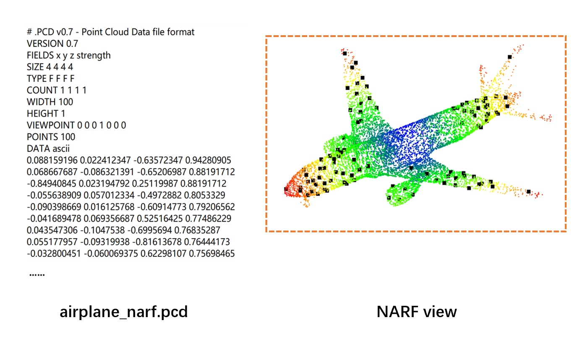

*Fig.4.5.6:   **airplane_narf.pcd** and NARF view*


### 4-6 ：Feature

For people, seeing a point cloud can quickly determine whether it is a rabbit, a bridge, or a pier, etc. because we can use common sense and knowledge to draw conclusions through experience. However, a point cloud is just a set of three-dimensional data points for a computer, and there is no other more meaningful information. Thus, we are supposed to create some judgment rules, write some knowledge, tell the computer how to read the point cloud, and finally can automatically classify and cut the point cloud. These discriminative judgment criteria and knowledge are "features", which need to be further extracted from the point cloud.

The Keypoints introduced earlier are the key points for extracting the point cloud itself, which can also be understood as "feature points", and its unit is still "point". The Feature introduced in this section is more advanced than Keypoints, which requires further calculations based on the point cloud itself. We can perform point cloud recognition and reconstruction by extracting Feature from the point cloud. In the recognition problem, the generation and extraction of point cloud features are essential for recognizing objects in the point cloud. The better the key features have higher discrimination (judgment) and distinguish the target object from other objects in the point cloud. Therefore, how to design a useful Feature and calculate Feature needs to be discussed in depth. In this section, we mainly introduce several common features: 

normal, PFH descriptor, FPFH descriptor, VFH descriptor.


#### 4-6-1：Estimate surface normals in a point cloud

##### The concept of normal

The point cloud's surface normal is a fundamental attribute, which is reflected in the pcd file as one of the point cloud dimensions (Fields). The same can be used as dimensions, such as color, light intensity (described below), and so on. The main idea is to find the tangent plane of the point, **compute the normal of the tangent surface as the normal of the point**, the normal of the tangent surface is the vector perpendicular to this surface, as shown in Fig.4.6.1:

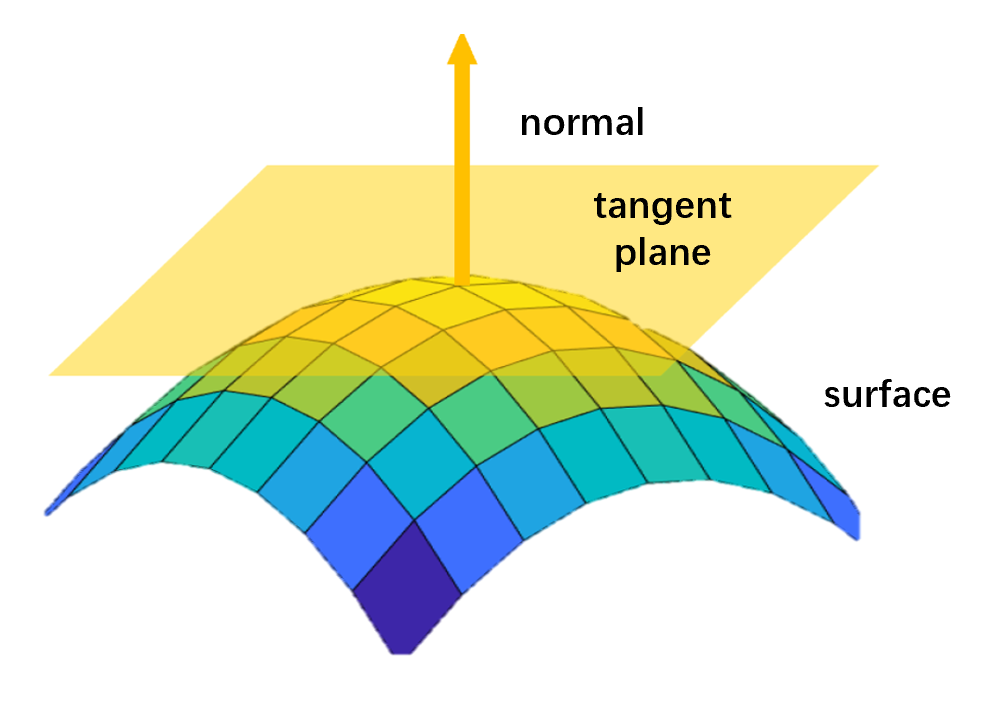

*Fig.4.6.1:   Normal*

##### The application of normal

**① Point cloud rendering,** also known as shading (reflecting the sense of three-dimensionality). Conversely, point cloud rendering can be used to check the correctness of the normal direction, as shown in Fig.4.6.2:


*Fig.4.6.2:   Without or with normal*

As shown in Fig.4.6.2, (a) is a rendered view without normal information. We can see that the horse only has a flat feel. While (b) looks more three-dimensional because of the normal information, and the color is darker where the curvature is larger.

**② Cutting:** The normal is a vector. That is, it has a direction, which is a vital attribute. We can use the direction of points to construct higher-level features to cut point clouds better.

**③ Computing curvature:** We can compute curvature based on normal. Here, the result obtained by our example will contain normals and curvatures. Curvature is a value indicating the degree of bending, and areas with massive surface changes tend to have large curvature values.


##### The visualization of normal

To intuitively visualize normals, we draw them on the original point cloud. As shown in Fig.4.6.3: The left one is the original point cloud without normal information, while the right one has normals information and visualizes them. The black arrowed vectors are normals of each point.

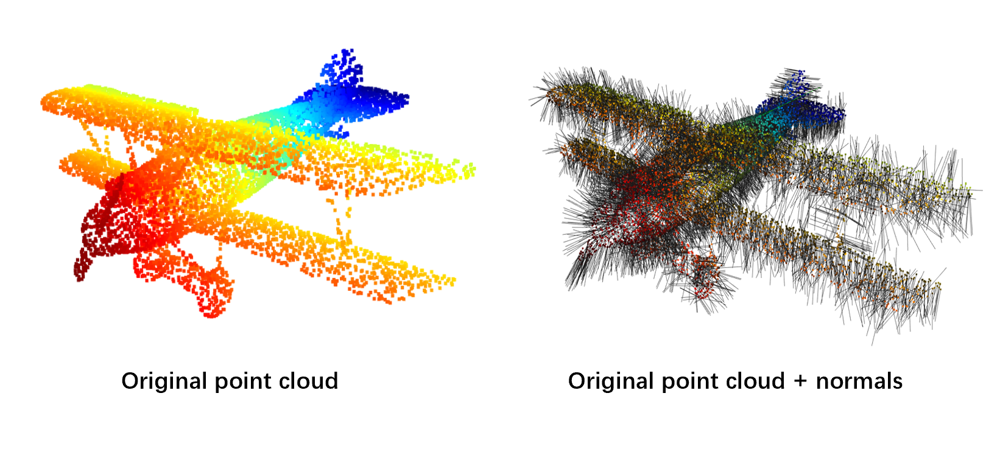

*Fig.4.6.3:   The visualization of normal*


##### The principle of normal computation

**Take point A as an example:** Search the nearest neighbors of point A in point cloud (see in Section 4-7), and use them to fit a plane, then we compute the normal pf this plane as the normal of point A. Same for other points in the point cloud.

Among them, fitting a plane needs to use the least square method to estimate, and the relevant knowledge of the least square method can refer to the following link:

-  http://mediatum.ub.tum.de/doc/800632/941254.pdf

According to the least square method, it can be known that the process of fitting a plane is finding the eigenvalues and eigenvectors of a covariance matrix. The calculation of the covariance is based on the selected point and its neighborhood points. For each point $P_i$, the covariance matrix is:
$$
C=\frac{1}{k} \sum_{i=1}^{k} \cdot\left(P_{i}-\bar{P}\right) \cdot\left(P_{i}-\bar{P}\right)^{\mathrm{T}}, C \cdot \vec{v}_{j}=\lambda_{i} \cdot \vec{v}_{i}, j \in\{0,1,2\}
$$
$k$ is the total number of neighbors of $P_i$,  $\bar{P}$ is the center of mass of neighbors, and $\lambda_{i}$ is the $ith$ eigenvalue of covariance matrix, $v_j$ is the $jth$ eigenvector of covariance matrix. According to these, we can also get curvature —— it can indicate the degree of bending, and areas with large surface changes tend to have large curvature values. The corresponding computation of curvature $\sigma$ is as follows:
$$
\sigma=\frac{\lambda_{0}}{\lambda_{0}+\lambda_{1}+\lambda_{2}}
$$


##### Example

Estimate surface normals in a point cloud, take **cuboid.pcd** as an example (see in the "files" folder):


*Fig.4.6.4:   **cuboid.pcd** (three angles)*

For the complete code **estimate_normal.cpp** see in [Appendix —— Estimate surface normals in a point cloud](# 4.6.1 ：Estimate surface normals in a point cloud).

The following five code lines are the header files needed to estimate surface normals in a point cloud.

```C++
// Input and output related header file in the standard C++ library
#include <iostream>   
// pcd reads and writes related header file in PCL
#include <pcl/io/pcd_io.h>  
// Point type header file supported in PCL
#include <pcl/point_types.h>
// Kdtree 
#include <pcl/search/kdtree.h>   
// estimate normals
#include <pcl/features/normal_3d.h>  
```

------


The following code creates a series of objects that need to be used when estimating the surface normal of the point cloud, including the input original point cloud object "cloud", the normal estimation object "ne", the normal output data set object "pcNormal". The kdtree object "tree" is used to estimate the normal.

```C++
    // create point cloud object cloud，load pcd to cloud
    pcl::PointCloud<pcl::PointXYZ>::Ptr cloud(new pcl::PointCloud<pcl::PointXYZ>);
    pcl::io::loadPCDFile(".../cuboid.pcd", *cloud);
 
    // create normal estimation object ne
    pcl::NormalEstimation<pcl::PointXYZ, pcl::Normal> ne;
 
    // Create a stored normal output dataset pcNormal
    pcl::PointCloud<pcl::Normal>::Ptr pcNormal(new pcl::PointCloud<pcl::Normal>);

    // Create an empty kdtree object and pass it to the normal estimation object
    pcl::search::KdTree<pcl::PointXYZ>::Ptr tree(new pcl::search::KdTree<pcl::PointXYZ>);
```

Among them, what needs to be emphasized is the normal estimation class — **NormalEstimation**. In the above code, we use this class to create a normal estimation object “ne”. Its principle is the principle of calculating the surface normal of the point cloud:

***step1***: Find the nearest neighbors of the point $p$ in the point cloud where the normal is to be calculated (we can find K points around p **(K-NN)** or find the point whose distance to $p$ is less than or equal to R **(Radius-NN)**, then get the set of neighbor points). In the following figures, point $p$ is the red point, and the green points are the neighbors we obtained according to two different methods:

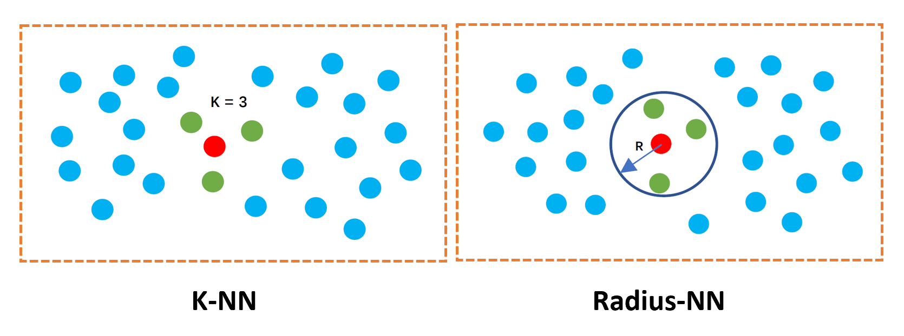

*Fig.4.6.5:   K-NN and Radius-NN*

***step2***: For this set of neighbor points to fit a plane (least square), calculate the normal of the plane;

***step3***: Check whether the normal direction is consistent with the viewpoint, and flip it if it is not consistent.

------


The following code performs the actual calculation part of the point cloud surface normal estimation:

```C++
	tree->setInputCloud(cloud);
	ne.setInputCloud(cloud);
	ne.setSearchMethod(tree);
    // Select 50 surrounding points as neighbors
	ne.setKSearch(50);  
    // or use all points with a radius within 3cm of the query point as neighbors
    // ne.setRadiusSearch (0.03); 
	// compute normals
	ne.compute(*pcNormal);
```

Among them:

- Input the previously created point cloud object "cloud" into the normal estimation object "ne";

- Set search method of "ne" to kdtree object "tree";

- Set the number of neighbors search to 50. Here we can also search by setting the radius of neighbors;

- Compute normals;

------


The following code generates and stores a point cloud file with **coordinate information** and **normal information**:

```C++
    // combine pcNormal and cloud    
	pcl::PointCloud<pcl::PointNormal>::Ptr cloud_with_normals(new pcl::PointCloud<pcl::PointNormal>);
	pcl::concatenateFields(*cloud, *pcNormal, *cloud_with_normals);
    
    // save cloud_with_normals in cuboid.pcd
    pcl::io::savePCDFileASCII(".../cuboid_normal.pcd", *cloud_with_normals);
```

Among them:

First, create a PointNormal type object "cloud_with_normals" that can contain coordinate information and normal information;

Then connect cloud and pcNormal using concatenateFields (see in Section 4.3.3), and store the connected result point cloud in cloud_with_normals;

Finally, output cloud_with_normals in the **cuboid_normal.pcd**.

------


Now the point cloud surface normal estimation has been completed, and **cuboid_normal.pcd** after generating the normal information is as follows:

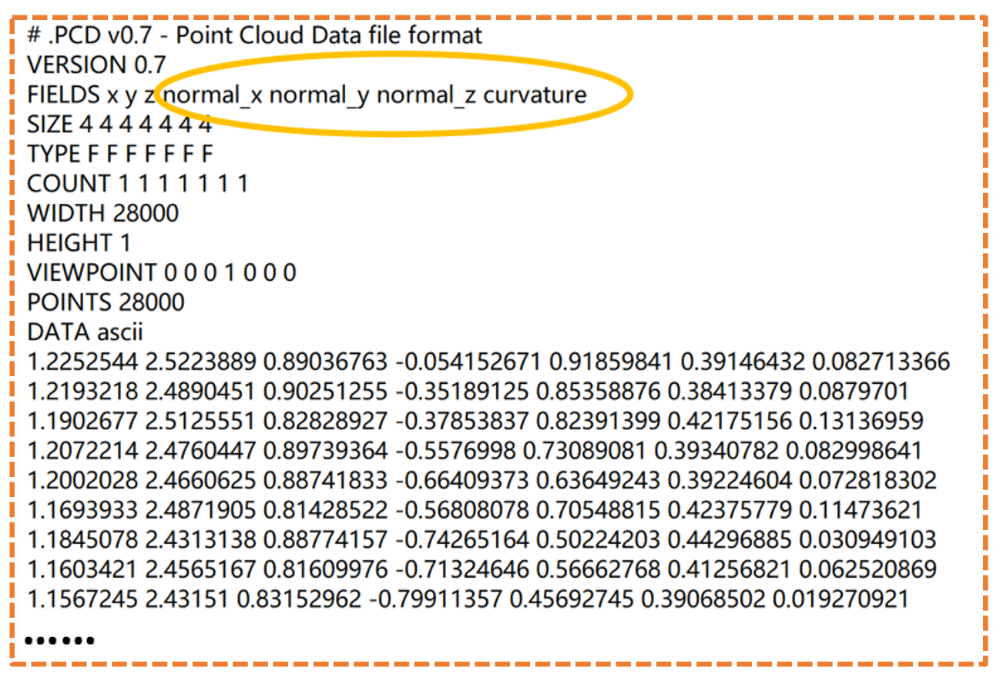

*Fig.4.6.6:   **cuboid_normal.pcd***

The view of **cuboid_normal.pcd** in CloudCompare after calculating the normal is as follows:

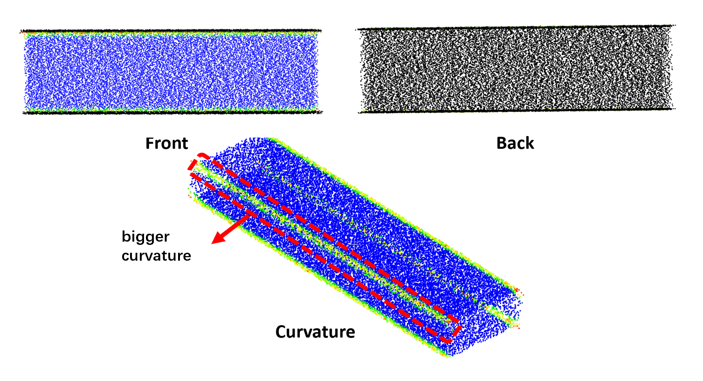

*Fig.4.6.7:   **cuboid_normal.pcd***

Among them, Front and Back are important views that reflect the normal because after calculating the normal information, the geometry has a direction. The front can be understood as the side illuminated by light (displayed in blue), and the Back is the side that is not illuminated by light (Displayed in black).

According to Fig.4.6.6, we find that **cuboid_normal.pcd** after calculating the normal has not only the normal_x, normal_y, and normal_z information, but also curvature value. Curvature is a value indicating the degree of bending. Areas with massive surface changes tend to have large curvature values, reflected in **Curvature** in Fig.4.6.7: the color of the area with large curvature is green, and the color of the area with small curvature is blue. The **edge** of the **cuboid.pcd** is an area with large surface changes, so it appears green. It can be seen from this that normals and curvatures are very useful for cutting point clouds. For example, we can continue to use the curvature change to cut this cuboid into four faces according to the edges.


#### 4-6-2：Normal Estimation Using Integral Images

We have mentioned the organized and unorganized point cloud in Section 3-1. For an organized point cloud, we can also use integral images to estimate normals.

> NB: Integral images are not suitable for an unorganized point cloud. Therefore, we should judge whether our point cloud is unorganized or organized at the first of processing.

Why should we introduce integral images to compute normals for an organized point cloud? Because we are supposed to search for the nearest neighbors for each point to estimate normal. For an organized point cloud, the nearest neighbor search is more convenient than an unorganized point cloud, which can accelerate computing normals' speed. Integral images are based on this characteristic.


##### Integral image

In an integral image (an image containing gray values, not a range image), every pixel is the summation of the pixels above and to the left of it[^18].

As shown in Fig.4.6.8, the "9" in the integral image is the summation of the pixels above and to the left of it (Integral means sum):
$$
2 + 3 + 3 + 1 = 9
$$


*Fig.4.6.8:   Integral image*


##### Example

Take **table_scene_mug_stereo_textured.pcd** as an example (see in the "files" folder, which is an organized point cloud):


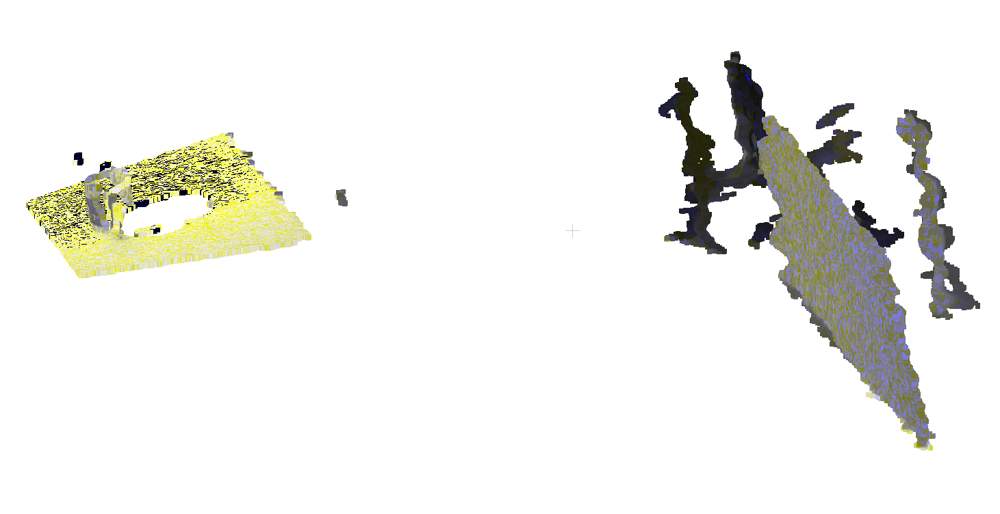

*Fig.4.6.9:   **table_scene_mug_stereo_textured.pcd***

For the complete code **estimate_integral_normal.cpp** see in [Appendix —— Normal Estimation Using Integral Images](# 4.6.2 ：Normal Estimation Using Integral Images).

The following three lines of code are the header files used for normal estimation using the integral image.

```c++
// read and write related header file in PCL
#include <pcl/io/io.h>
// pcd reads and writes related header file in PCL
#include <pcl/io/pcd_io.h>
// calculate the file header of the normal with integral graph method
#include <pcl/features/integral_image_normal.h>
```

------


The following two code lines create a point cloud object "cloud", and the second line reads **table_scene_mug_stereo_textured.pcd** into the created "cloud".

```c++
pcl::PointCloud<pcl::PointXYZ>::Ptr cloud (new pcl::PointCloud<pcl::PointXYZ>);
pcl::io::loadPCDFile (".../table_scene_mug_stereo_textured.pcd", *cloud);
```

------


The following code creates the normal storage object "normals", the integral image normal estimation object "ne". Then sets the estimation method, the maximum depth change coefficient, the neighborhood size considered when optimizing the normal direction, the input organized point cloud, and the normal estimation execution. Then store the result in normals.

```c++
// estimate normals
pcl::PointCloud<pcl::Normal>::Ptr normals (new pcl::PointCloud<pcl::Normal>);
pcl::IntegralImageNormalEstimation<pcl::PointXYZ, pcl::Normal> ne;
// estimation method
ne.setNormalEstimationMethod (ne.AVERAGE_3D_GRADIENT);  
// the maximum depth change coefficient
ne.setMaxDepthChangeFactor(0.02f);      
// the neighborhood size considered when optimizing the normal direction
ne.setNormalSmoothingSize(10.0f);
// input organized point cloud
ne.setInputCloud(cloud);      
// compute normals
ne.compute(*normals);                  
```


The following are the available normal estimation methods*. In the above code, we use **AVERAGE_3D_GRADIENT**:

```c++
enum NormalEstimationMethod
{
  COVARIANCE_MATRIX,
  AVERAGE_3D_GRADIENT,
  AVERAGE_DEPTH_CHANGE
};
```

*normal estimation methods: 

**COVARIANCE_MATRIX**: Create nine integral images and use the covariance matrix of the local neighborhood of a point to compute the normal of this point；

 **AVERAGE_3D _GRADIENT**: Create six integral images, computes the smoothed 3-dimensional gradients in the horizontal and vertical directions, and uses the vector product between the two gradients to compute the normal;

**AVERAGE_DEPTH_CHANGE**: Create one integral image and compute the normal from the change in average depth; 

------


The following code combines "cloud" with xyz and "normals" with normal into "cloud_with_normals", and stores "cloud_with_normals" in **table_scene_mug_stereo_textured_normals.pcd**.

```c++
   pcl::PointCloud<pcl::PointNormal>::Ptr cloud_with_normals(new pcl::PointCloud<pcl::PointNormal>);
   pcl::concatenateFields(*cloud, *normals, *cloud_with_normals);
   pcl::io::savePCDFile(".../table_scene_mug_stereo_textured_normals.pcd", *cloud_with_normals);
```

The following figure is the CloudCompare view of **table_scene_mug_stereo_textured_normals.pcd** containing the XYZ and normal information of the point:


*Fig.4.6.10:   View after computing normal*

As shown in Fig.4.6.10, the color of the boundary (larger curvature) area is darker than that of the plane, and the view looks more 3-dimensional than the original view in Fig.4.6.9, which is the intuitive effect after adding normals. The normal estimation using this method is only suitable for organized point clouds, and other methods can only be used for unorganized point clouds.


#### 4-6-3：Point Feature Histogram (PFH) descriptors

The normal of the point cloud surface can be quickly obtained by computing the neighborhood of the point. To better describe and analyze the point cloud, we can also extract other features — based on computing the surface normal. We can further compute the point feature histogram (PFH) descriptors.

Point Feature Histogram (PFH), whose essence is to obtain a histogram.

##### Histogram

The histogram is a way of presenting the distribution of the reflected data. Divide the data value into several intervals (the range of bin), count the number of data in each interval, and draw a histogram. The following fig.4.6.11 shows 30 data, which are divided into different intervals according to their size (1-5, 15-20, etc.), and count the number of data falling in each interval:

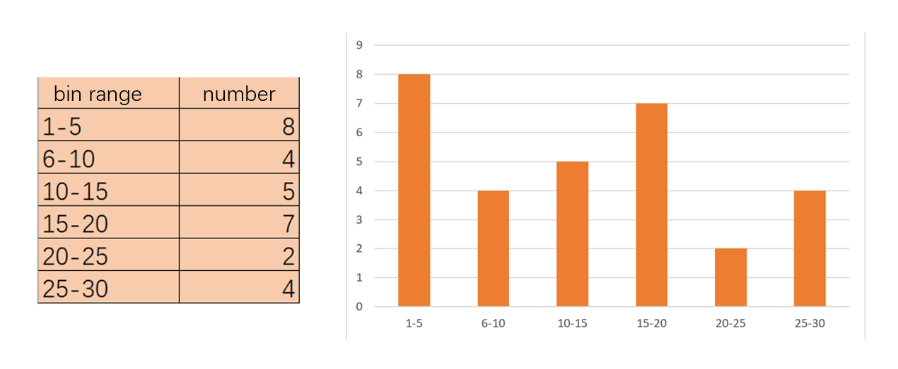

*Fig.4.6.11:   Histogram*

Divide 1-30 into six bins. The range of each bin is shown in the left table in Fig.4.6.11. The number of elements in each bin is 8, 4, 5, 7, 2, 4. In the histogram on the right in Fig.4.6.11, the horizontal axis is the bin range, and the vertical axis is the number of elements corresponding to each bin.

As shown in Fig.4.6.12, the red histogram can describe the geometric information of points and their neighbors. The purpose is to convert this geometric information to a higher-dimensional histogram to obtain high-dimensional data, providing more information than normal. Note that the calculation of PFH will be based on the estimation of the normal (which will be explained in detail later), and the change of the point cloud surface will be extracted as much as possible through the normal to describe its geometric characteristics. PFH has translation and rotation invariance (that is, the same descriptor can be obtained by rotating and translating point clouds), and PFH is also robust to the density of point clouds and noise.

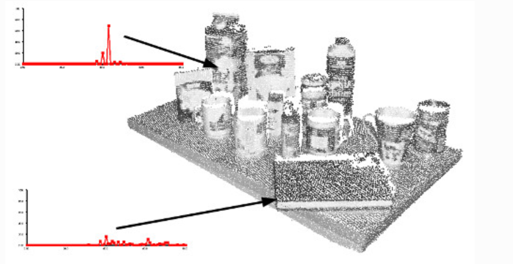

*Fig.4.6.12:   PFH[^19]*


##### PFH calculation principle

For each point in the point cloud file, select its neighborhood. For every two points in this neighborhood (one is the query point, and the other is the neighborhood point of the query point), the following pairing and calculation are performed:

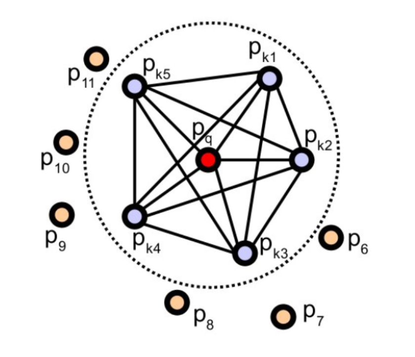

*Fig.4.6.13:   PFH computation[^19]*

As shown in Fig.4.6.13, when we use $P_q$ as search point and find its neighbors in dashed circle, we connect every two points in this neighborhood (as shown by the black line), and perform the following operations:

First, to calculate the deviation between the two points and their normals, a fixed coordinate system is built on one of the points.


*Fig.4.6.14:   Build coordinate system[^19]*

The calculation formula for the indicator is as follows:
$$
\begin{array}{c}
d=\left\|p_{t}-p_{s}\right\|_{2} \\
\alpha=v \cdot n_{t} \\
\phi=u \cdot \frac{p_{t}-p_{s}}{\left\|p_{t}-p_{s}\right\|_{2}} \\
\theta=\arctan \left(w \cdot n_{t}, u \cdot n_{t}\right)
\end{array}
$$
As shown in Fig.4.6.14, take $P_s$ and $P_t$ as examples. Take $n_s$ (the normal direction of $P_s$) as the **u** of coordinate system. The **v** is obtained by the distance between two points. The **w** is obtained by **u** and **v**. Translate this coordinate system to point $P_t$, with point $P_t$ as the origin, we can compute the angles between coordinate system and the normal of $P_t$: **α** and **θ**, and the angle between the normal of $P_s$ and two-point connection vector: **Φ**. Now, we get the three angles. Besides, add the Euclidean distance **d** between the two points $P_s$ and $P_t$. These four elements constitute the PFH descriptor. However, in some cases (such as when scanning with lidar), the distance **d** between adjacent points will vary according to the viewpoint. When the local point density in the scan affects the feature, practice has proved to be beneficial to omit **d**.


##### Example

Take **bridge_pier.pcd** as an example (see in the "files" folder). For the complete code **pfh.cpp** see in [Appendix —— Point Feature Histogram (PFH) descriptors](# 4.6.3 ：Point Feature Histogram (PFH) descriptors).


*Fig.4.6.15:   **bridge_pier.pcd***

The following lines of code are the header files used for PFH descriptors.

```c++
// Input and output related header file in the standard C++ library
#include <iostream>   
// pcd reads and writes related header file in PCL
#include <pcl/io/pcd_io.h>  
// Point type header file supported in PCL
#include <pcl/point_types.h> 
// Kdtree 
#include <pcl/search/kdtree.h>    
// normal estimation 
#include <pcl/features/normal_3d.h>   
// pfh
#include <pcl/features/pfh.h>     
```

------


The following code first estimates the normal of **bridge_pier.pcd**, see in Section 4-6-1, and provide normal information for the subsequent calculation of the PFH descriptor.

```c++
    pcl::PointCloud<pcl::PointXYZ>::Ptr cloud(new pcl::PointCloud<pcl::PointXYZ>);
	pcl::io::loadPCDFile(".../bridge_pier.pcd", *cloud);

	// create normal estimation object "ne"
	pcl::NormalEstimation<pcl::PointXYZ, pcl::Normal> ne;
	// save normal in "pcNormal"
	pcl::PointCloud<pcl::Normal>::Ptr pcNormal(new pcl::PointCloud<pcl::Normal>);
	// create an empty kdtree object and pass it to the normal estimation object
	pcl::search::KdTree<pcl::PointXYZ>::Ptr tree1(new pcl::search::KdTree<pcl::PointXYZ>);
	tree1->setInputCloud(cloud);
	ne.setInputCloud(cloud);
	ne.setSearchMethod(tree1); 
    // use all points with a radius within 3cm of the query point as neighbors
    ne.setRadiusSearch (0.03); 
    // or select 50 surrounding points as neighbors
	// ne.setKSearch(50); 
	// compute normals
	ne.compute(*pcNormal);

	// combine pcNormal and cloud    
	pcl::PointCloud<pcl::PointNormal>::Ptr cloud_with_normals(new pcl::PointCloud<pcl::PointNormal>);
	pcl::concatenateFields(*cloud, *pcNormal, *cloud_with_normals);
```

------


From this part, we enter the PFH calculation stage. The first three lines of code below first create a PFH estimation object "pfh":

```c++
    // create PFH estimation object "pfh"，pass cloud and normals to "pfh"
	pcl::PFHEstimation<pcl::PointXYZ, pcl::Normal, pcl::PFHSignature125> pfh;
	pfh.setInputCloud(cloud);
	pfh.setInputNormals(pcNormal);

	// create an empty kdtree object and pass it to the PFH object
	pcl::search::KdTree<pcl::PointXYZ>::Ptr tree2(new pcl::search::KdTree<pcl::PointXYZ>());
	pfh.setSearchMethod(tree2);

	// create "pfhs" to store PFH
	pcl::PointCloud<pcl::PFHSignature125>::Ptr pfhs(new pcl::PointCloud<pcl::PFHSignature125>());
```

PFHSignature125 is used when creating the PFH estimation object. **Why is PFHSignature125?**

Here we have selected three angles as descriptors for each point pair. Each angle will have a histogram, and the default number of bins for each histogram is 5. That is, it can be understood as three dimensions. Each dimension is a coordinate axis. Each coordinate axis is divided into five sub-intervals. The PFH description space is converted into $5^3 = 125$ sub-spaces. Then count the information of the points that fall in each space separately. That is, three angles are regarded as coordinate values and recorded in the corresponding small cube, and then the whole cube is flattened to get $5^3 = 125$ result data (when calculating a point, each point pair in its neighborhood will be calculated, assuming that there are K points in the neighborhood, $K ^2$ [$\alpha, \theta, \phi$] will be calculated eventually. What we need to do is to put these data on the relevant cube corresponding to the coordinate axis):


*Fig.4.6.16:   125 sub-spaces*

Use the XYZ axes in Fig.4.6.16 to correspond to the selected three angles, and each axis is divided into five sub-intervals. 125 cubes represent 125 sub-spaces, and then the point cloud object "cloud" and the normal object "pcNormal" are passed into "pfh". Then create a second kdtree object (note: distinguished from tree1 estimated by the previous normal) tree2, and set the nearest neighbor search method to tree2. Finally, create an object "pfhs" to store PFH information.


**Class PFHEstimation**

step1:   Get nearest neighbors of point p;

step2:   Calculate three angles for each pair of points;

step3:   Distribute all the results in the histogram.

------


The following code first sets the search radius, as marked in the code, the radius here must be greater than the radius of the normal calculated in the previous step, then calculate the PFH, and finally save the PFH information in **bridge_pier_pfh.pcd**:

```c++
   	// Use all neighbors within a radius of 5cm. 
    // Note: The radius used here must be larger than the radius used when estimating the      surface normal!! Here we calculate the radius of the surface normal to be 0.03
	pfh.setRadiusSearch(0.05);

	// compute pfh
	pfh.compute(*pfhs);

	// save pfh in bridge_pier_pfh.pcd
	pcl::io::savePCDFileASCII(".../bridge_pier_pfh.pcd", *pfhs);
```

The following figure is the generated internal information of **bridge_pier_pfh.pcd**:


*Fig.4.6.17:   **bridge_pier_pfh.pcd***

Each line in the **bridge_pier_pfh.pcd** represents a point, and each point has 125 PFH values.


#### 4-6-4：Fast Point Feature Histogram (FPFH) descriptors

The previous section introduced the point feature histogram descriptors (PFH descriptors). This section introduces a further fast point feature histogram descriptors (FPFH descriptors) based on PFH. Fig.4.6.18 below shows an example of FPFH:


*Fig.4.6.18:   FPFH[^20]*

The reason for introducing FPFH is that PFH has the following shortcomings:

① **High computational complexity**: If there are n points in the point cloud, it is assumed that each point can select k neighbors on average within its neighborhood radius r. Because the connection must be made between two points, the actual number of point clouds is large, resulting in a considerable calculation.

② **Heavy recalculation**: Since the PFH is calculated after pairing two points, that is, all points are calculated more than once, as shown in Fig.4.6.19 for the point pairs connected by red lines:

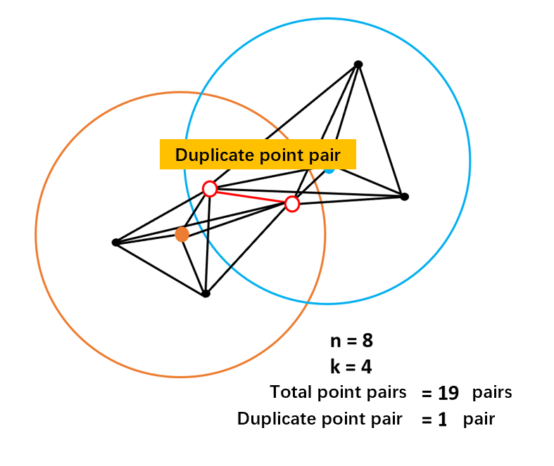

*Fig.4.6.19:   Duplicate point pair*

The figure above shows the connection of the points in the orange box with the orange point as the center and the blue box with the blue point as the center. We can see that two points (marked as the red frame and white center circle) are included twice in the area where the two circles intersect, so the calculation between them will be repeated.


##### The principle of FPFH computation

Because of the above shortcomings, we need to improve PFH, and FPFH appears:

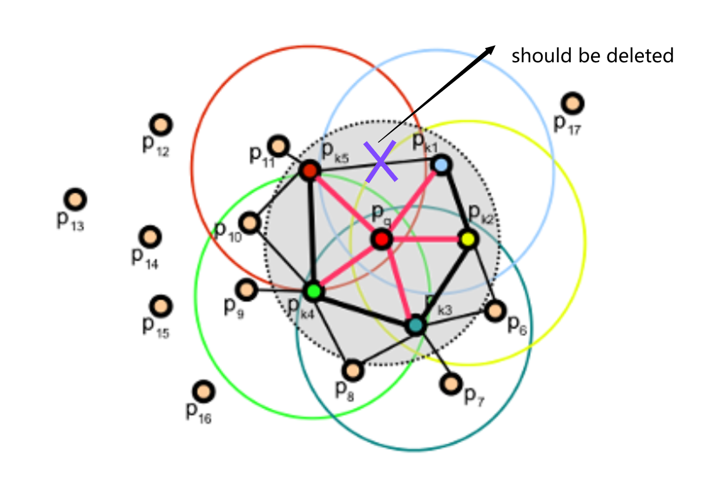

*Fig.4.6.20:   FPFH computation[^21]*

FPFH no longer calculates between two points in the neighborhood of each point (here, select $p_q$ as the search point), but only performs pairing calculations on each search point and its neighbor points (as shown in Fig.4.6.20, the red line). The computational complexity is significantly reduced.

This pairwise interconnection relationship between the lack of neighboring points and neighboring points is called a simplified point feature histogram — Simple Point Feature Histogram, or SPFH for short. In this way, the SPFH of $p_q$ and its neighbors $p_k$ are obtained, and the final FPFH calculation formula of $p_q$ is:
$$
 $FPFH (p_q) = SPFH (p_q) + \frac{1}{k}\sum_{i=1}^{k}{\frac{1}{w_k} SPFH (p_k)}$
$$
$w_k$ is the distance between $p_q$ and its neighbor $p_k$, as weights[^22].

> NB: Some lines in Fig.4.6.20 are bolded because they are calculated twice.
>
> The line between $p_{k5}$ and $p_{k1}$ marked with a purple cross should be deleted because it is not included in the search area of the corresponding radius.


##### Example

Compute FPFH of **bridge_pier.pcd**. For the complete code **fpfh.cpp** see in [Appendix —— Fast Point Feature Histogram (FPFH) descriptors](# 4.6.4 ：Fast Point Feature Histogram (FPFH) descriptors).

The following six lines of code are the header files needed to extract the FPFH descriptors.

```c++
// Input and output related header file in the standard C++ library
#include <iostream>   
// pcd reads and writes related header file in PCL
#include <pcl/io/pcd_io.h>  
// Point type header file supported in PCL
#include <pcl/point_types.h> 
// fpfh
#include <pcl/features/fpfh.h>   
// Kdtree
#include <pcl/search/kdtree.h>  
// normal estimation
#include <pcl/features/normal_3d.h>   
```

------


The following code first estimate the normals of **bridge_pier.pcd**, see in Section 4-6-1, which can provide normal information for later computation for FPFH.

```c++
	pcl::PointCloud<pcl::PointXYZ>::Ptr cloud(new pcl::PointCloud<pcl::PointXYZ>);
	pcl::io::loadPCDFile(".../bridge_pier.pcd", *cloud);

	// create normal estimation object "ne"
	pcl::NormalEstimation<pcl::PointXYZ, pcl::Normal> ne;

	// create pcNormal to store normal
	pcl::PointCloud<pcl::Normal>::Ptr pcNormal(new pcl::PointCloud<pcl::Normal>);

	// create an empty kdtree object "tree1", pass it to normal object
	pcl::search::KdTree<pcl::PointXYZ>::Ptr tree1(new pcl::search::KdTree<pcl::PointXYZ>);
	tree1->setInputCloud(cloud);
	ne.setInputCloud(cloud);
	ne.setSearchMethod(tree1);
	// use all points with a radius within 3cm of the query point as neighbors
    ne.setRadiusSearch (0.03); 
    // or select 50 surrounding points as neighbors
	// ne.setKSearch(50); 
	// compute normals
	ne.compute(*pcNormal);

	// combine pcNormal and cloud    
	pcl::PointCloud<pcl::PointNormal>::Ptr cloud_with_normals(new pcl::PointCloud<pcl::PointNormal>);
	pcl::concatenateFields(*cloud, *pcNormal, *cloud_with_normals);
```

------


Similar to calculating PFH, after obtaining the normal information, enter the formal calculation of FPFH. The following three lines of code first create an FPFH estimation object "fpfh". Here, FPFHSignature33 is used when creating the FPFH estimation object.

```c++
	// create FPFH estimation object "fpfh", pass cloud and normals to it
	pcl::FPFHEstimation<pcl::PointXYZ, pcl::Normal, pcl::FPFHSignature33> fpfh;
	fpfh.setInputCloud(cloud);
	fpfh.setInputNormals(pcNormal);

    // create an empty Kdtree object "tree2", pass it to "fpfh"． 
	pcl::search::KdTree<pcl::PointXYZ>::Ptr tree2(new pcl::search::KdTree<pcl::PointXYZ>);
	fpfh.setSearchMethod(tree2);

	// create output dataset
	pcl::PointCloud<pcl::FPFHSignature33>::Ptr fpfhs(new pcl::PointCloud<pcl::FPFHSignature33>());
```

**Why is FPFHSignature33?** 

Here FPFH still includes the three angles of PFH. Each angle is used as a dimensional coordinate axis. The interval where it is located is divided into 11 (default) parts and then merged to obtain a 33-element feature vector. 

> NB: Different from the calculation of PFH, the histogram here is calculated separately for each dimension and finally connected together, while PFH directly calculates the joint histogram of three different dimensions, so PFH is $5^3 =125$, and FPFH is $11 * 3 = 33$. We can compare Fig.4.6.18. The histogram corresponding to each point has three peaks, which reflects that three small histograms merge the histogram.

Pass point cloud object "cloud" and the normal object "pcNormal" are to "fpfh". Then create the Kdtree object "tree2" (distinguished from "tree1" that calculated the normal before), set the nearest neighbor search method of "fpfh" to "tree2", and create the output object "fpfhs".

------


The following code demonstrates the specific process of calculating FPFH: first set the search radius, as marked in the code. The radius here must be greater than the normal calculated radius in the previous step, and finally, save the PFH information in **bridge_pier_fpfh.pcd**.

```c++
	// Use all neighbors within a radius of 5cm. 
    // Note: The radius used here must be larger than the radius used when estimating the      surface normal!! Here we calculate the radius of the surface normal to be 0.03
	fpfh.setRadiusSearch(0.05);

	// compute fpfh 
	fpfh.compute(*fpfhs);

    // only the fpfh of the first point
	cout << fpfhs->points[0].histogram[0] << endl;
	// output all fpfhs
	/*for (int i = 0; i < fpfhs->size(); i++) {
		pcl::FPFHSignature33 descriptor = fpfhs->points[i];
		cout << descriptor << endl;
	}*/
    
	// save fpfh in bridge_pier_fpfh.pcd
	pcl::io::savePCDFileASCII(".../bridge_pier_fpfh.pcd", *fpfhs);
```

------

The following figure is the generated internal information of **bridge_pier_fpfh.pcd**:


*Fig.4.6.21:   **bridge_pier_fpfh.pcd***

Each line in **bridge_pier_fpfh.pcd** represents a point, and each point has 33 FPFH values.

##### The difference between FPFH and PFH[^22]

- FPFH only performs feature calculation between the search point and the neighboring points, and may miss some important point pairs compared to PFH;
- Since FPFH use weight $w_k$ to supplement the SPFH of neighbors $p_k$ the formula, the crucial information of neighboring points can be captured again;
- FPFH reduce the complexity of PFH and be more widely used in real life;
- FPFH simplifies the histogram by decomposing triples, draws them separately for each feature dimension, and then connects them.


#### 4-6-5：Viewpoint Feature Histogram (VFH) descriptors

##### Introduction to VFH

Based on FPFH, a new feature representation was born, which is the **Viewpoint Feature Histogram (VFH) descriptor**. From its name, we can know that the feature descriptor's calculation needs to use the **view variable**. Because it is based on the FPFH descriptor, the **normal estimation information** is also used in the calculation process.

##### The application of VFH

VFH is generally used in point cloud clustering and pose estimation. Point cloud clustering will be introduced later not to explain here; pose estimation is an essential content in computer vision, mainly used to detect the position or direction of an object [^23].

In order to be able to perform point cloud clustering and pose estimation, the following two aspects are adopted to calculate VFH:

① From FPFH and expand FPFH: Extend from a partial point set to the entire point cloud. The previous calculation of FPFH is to calculate the neighborhood of a point, but here is the calculation of the point cloud center point (the average value of the spatial coordinates xyz can be calculated) and all other points of the point cloud object as the calculation unit when calculating FPFH, as shown in Fig.4.6.22:


*Fig.4.6.22:   Extend FPFH to the entire point cloud*

From Fig.4.6.22 we can see that after selecting the center point $C$ of the point cloud, calculate the FPFH of all point pairs between $C$ and other points. The coordinates on the right reflect the FPFH coordinate system setting between $C$ and one of the points, and the calculation of the three angle indicators.

② In the calculation of FPFH, the viewpoint variable is added to the calculation of the relative normal angle, which is reflected in Fig.4.6.23:


*Fig.4.6.23:   Viewpoint and normal*

As shown in Fig.4.6.23, $V_p$ is the viewpoint variable of center point $C$. What we need to calculate is the angle between the vector connecting each point in the point cloud with $V_p$ and the normal of the point. In the above figure, we take the point $P_8$ as an example. The angle between the $P_8-V_p$ and $n_8$ is α.

Therefore, VFH includes two features: the expanded FPFH and the angle between the normal and the viewpoint. The two constitute the VFH, as shown in Fig.4.6.24. The main difference between VFH, PFH, and FPFH descriptors is that a point cloud file has only one VFH feature, and the number of PFH and FPFH features is equal to the number of points in the point cloud.

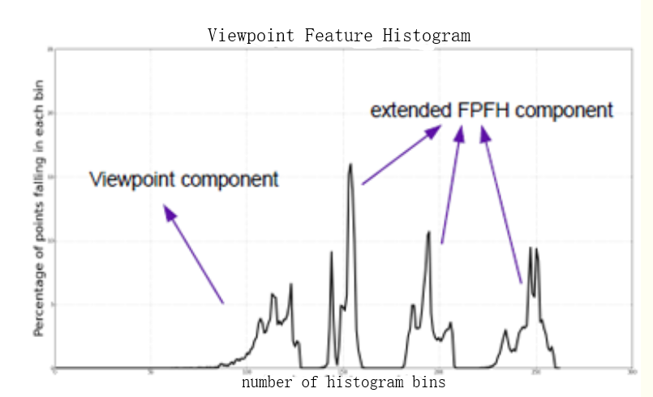

*Fig.4.6.24:   VFH[^24]*

##### Example

Take **bridge_pier.pcd** as an example. For the complete code **vfh.cpp** see in [Appendix —— Viewpoint Feature Histogram (VFH) descriptors](# 4.6.5 ：Viewpoint Feature Histogram (VFH) descriptors).

The following code is the header file needed to estimate the VFH of a point cloud file.

```c++
// Input and output related header file in the standard C++ library
#include <iostream>   
// pcd reads and writes related header file in PCL
#include <pcl/io/pcd_io.h>  
// Point type header file supported in PCL
#include <pcl/point_types.h> 
// VFH
#include <pcl/features/vfh.h>    
// Kdtree
#include <pcl/search/kdtree.h>   
// normal estimation
#include <pcl/features/normal_3d.h>   
```

------


The following code creates the point cloud object "cloud", the normal estimation object "ne", the normal output object "normals", and the neighbor search kdtree object "tree1":

```c++
    // create point cloud object "cloud", load bridge_pier.pcd to "cloud"   
    pcl::PointCloud<pcl::PointXYZ>::Ptr cloud(new pcl::PointCloud<pcl::PointXYZ>);
	pcl::io::loadPCDFile(".../bridge_pier.pcd", *cloud);

	// create normal estimation ne
	pcl::NormalEstimation<pcl::PointXYZ, pcl::Normal> ne;

	// create normals to store normal information
	pcl::PointCloud<pcl::Normal>::Ptr normals(new pcl::PointCloud<pcl::Normal>());

	// create an empty kdtree object "tree1"
	pcl::search::KdTree<pcl::PointXYZ>::Ptr tree1(new pcl::search::KdTree<pcl::PointXYZ>);
```

------


The following code sets the input point cloud for normal estimation, input the normal object, the nearest neighbor search object, and the nearest neighbor search radius, and finally calculates the normal:

```c++
    // Enter the normal object into tree1 and set the neighbor search object and the            search radius (or the number of neighbor searches) respectively  
    tree1->setInputCloud(cloud);
	ne.setInputCloud(cloud);
	ne.setSearchMethod(tree1);
	// use all points with a radius within 3cm of the query point as neighbors
    ne.setRadiusSearch (0.03); 
    // or select 50 surrounding points as neighbors
	// ne.setKSearch(50); 
	// compute normals
	ne.compute(*normals);
```

------


The following code starts to estimate the VFH.

- First, create a VFH estimation object "vfh", and pass the input dataset "cloud" and "normals" to it;
- Create an empty Kdtree object "tree2" (distinguish from the previous estimation of normals tree1) and pass it to the VFH estimation object "vfh";
- Create the output data object "vfhs" of the VFH information;
- Calculate the feature value, and finally, save the object "vfhs" in **bridge_pier_vfh.pcd**.

There is only one VFH information in the result file. This VFH information contains 308 data, corresponding to 308 in VFHSignature308:

```c++
    // create VFH estimation object "vfh", pass cloud and normals to it 
	pcl::VFHEstimation<pcl::PointXYZ, pcl::Normal, pcl::VFHSignature308> vfh;
	vfh.setInputCloud(cloud);
	vfh.setInputNormals(normals);

	// create an empty kdtree object "tree2", pass it to "vfh
	pcl::search::KdTree<pcl::PointXYZ>::Ptr tree2(new pcl::search::KdTree<pcl::PointXYZ>());
	vfh.setSearchMethod(tree2);

	// create "vfhs" to save VFH information
	pcl::PointCloud<pcl::VFHSignature308>::Ptr vfhs(new pcl::PointCloud<pcl::VFHSignature308>());

	// compute VFH
	vfh.compute(*vfhs);

	// save VFH in bridge_pier_vfh.pcd
	pcl::io::savePCDFile(".../bridge_pier_vfh.pcd", *vfhs);
```

**Why is VFHSignature308 ?** 

VFH includes two parts. On the one hand, it is an extension of FPFH, which has 45 sub-spaces in default. We can compute four features in each sub-space (three angles and a distance between neighbors and search point). There are $4* 45 = 180$ elements. On the other hand, it is the feature between viewpoint and normal, which has 128 sub-spaces in default, so it has 128 elements. Combine them, and we can finally get $180+128 = 308$ elements.

------

The figure below is the internal information of **bridge_pier_vfh.pcd**:


*Fig.4.6.25:   **bridge_pier_vfh.pcd***

As shown in Fig.4.6.25, although the data part shows three rows, it does not mean that three points correspond to the VFH, but a VFH value containing 308 elements, arranged in three rows. Similarly, we can also look at POINTS 1 and COUNT 308 in the red box in the picture (review the introduction of these file headers when the internal information of the pcd file was introduced).


### 4-7：Registration

##### Background

When we use a scanner to acquire data, each scan is carried out from a fixed angle and orientation, and only a part of the scene (that is, the scanned object) can be captured. Moreover, due to the terrain and actual conditions around the scene, some parts of the scene are blocked, or there are blind corners. Therefore, to have a point cloud covering the scene as much as possible, we usually need multiple cameras, multiple angles, and orientations to scan around the scene. Each angle and azimuth scan will get a scan once, so there will be a series of scans after scanning the entire scene. As shown below:


*Fig.4.7.1:   Multiple scans[^25]*

For a target object, we usually scan it from different angles (Normally, the default 360-degree full-view scan is used for scanning every time. The green fan-shaped area in the picture above is the scan range of each scanner's position (they are not 360-degree scanning because the area is fan-shaped)).

To obtain an entire point cloud, we need to find the overlap between scans and stitch them, that is, registration. The result of registration is the entire point cloud after stitching. The registration process is a complex transformation (it will be introduced later) because each angle and the degree of rotation between the scans obtained are different.

In Fig.4.7.2, (a) and (b) are registered to the complete building in (c):


*Fig.4.7.2:   Registration[^26]*

In general, registration is the process of finding the overlap in scans and then splicing/merging scans to get a whole point cloud.

##### The general idea of registration

Through a series of operations such as rotation and translation, multiple point clouds are integrated into a unified coordinate system. What we need to calculate is the rotation matrix and translation vector during the operation.

> NB: The algorithm in this Section involves the knowledge of computer vision, and readers need to add it by themselves, so we will not explain it in detail here.


#### 4-7-1 : Concepts related to registration in PCL

##### ① pairwise registration

As the name implies, it is the registration between two point clouds, as shown in Fig.4.7.3: Two rabbits with different spatial positions and different geometric structures are used for point cloud registration.


*Fig.4.7.3:   Pairwise registration[^27]*

**Steps**

- step1: Extract NARF Keypoints from the two point clouds according to **consistent Keypoints selection criteria**;


- step2: Calculate the NARF feature descriptor for all selected Keypoints;


- step3: Estimate the corresponding relationship based on the similarity of the NARF feature descriptor positions of the two point clouds to obtain a preliminary estimate of the corresponding point pair;


- step4: Noise reduction, remove the wrong point pair;


- step5: Estimate the rigid transformation based on the remaining correct corresponding points, that is, translation and rotation operations (among which, the extraction of Keypoints and feature descriptors of step1 and step2 is very important for the rigid transformation here, and the accuracy of the previous extraction will make the accuracy of rigid transformation calculation improve), the rigid transformation will be briefly introduced later, and the registration is now complete.


##### ② correspondences estimation

Use PCL to search for the correspondence between the point clouds for registration. Step 3 in the pairwise registration, and estimate the correspondence according to the similarity of features, as shown in Fig.4.7.4:

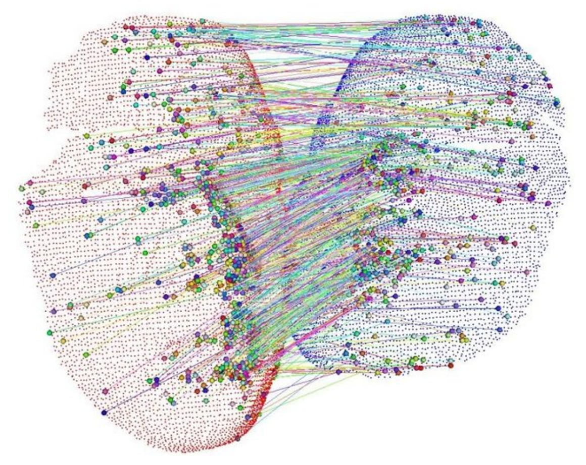

*Fig.4.7.4:   Correspondences estimation[^28]*

There are two corresponding estimates:

1. Direct correspondence estimation (default): Search for a corresponding point in another point cloud B for each point in point cloud A;
2. Correspondence estimation: first search for each point in point cloud A for a point in another point cloud B; then conversely, search for the corresponding point in point cloud A for each point in point cloud B, and finally take both Intersections.

Correspondence estimation should use different methods according to the type of feature. There are two features: one is the coordinate feature of the point, and the other is the point's neighborhood feature. The following are two estimation methods:

- The coordinate feature of the point, using the XYZ coordinates of the point as the feature value:

​       (1) brute force matching;

​       (2) Kdtree nearest neighbor search (FLANN);

​       (3) Search in the image space of organized point cloud;

​       (4) Search in the index space of an unorganized point cloud.

- The neighborhood feature of a point is determined by the neighborhood of the point, such as normal, etc.:

​       (1) brute force matching;

​       (2) Kdtree nearest neighbor search (FLANN);

##### ③ correspondences rejection

There will be much noise in the point cloud. Suppose we keep the wrong point pairs caused by the noise. In that case, it will have an adverse effect on estimating the subsequent rigid transformation, so removing the wrong correspondence is essential, which can improve the accuracy of the final rigid transformation and improve the efficiency of the calculation by reducing the corresponding point pairs. The commonly used method of correspondence removal is the Random Sample Consensus (RANSAC) estimation.

NB: There is a one-to-many correspondence. That is, a point in the target model corresponds to several points in the source. We can filter out other pseudo-correspondences by taking only the corresponding points closest to it or filtering out other pseudo-correspondences according to some filtering methods. [^22]

##### ④ transformation estimation

The transformation matrix here is the rigid transformation we mentioned earlier, which is a critical part of the registration. Only when calculating the matrix that transforms the original point cloud is accurate can we finally successfully register. The specific steps are as follows:

step1: Evaluate some wrong metrics based on the calculation of the corresponding relationship;

step2: Estimate a rigid transformation under the camera pose and minimization metrics;

step3: Optimize the structure of points;

step4: Use the calculated rigid transformation to rotate or translate the original point cloud so that all the point clouds to be registered are in the same coordinate system, and the internal ICP loop is performed (see ICP in Section 4-7-2);

step5: Use the ICP loop to iterate until the convergence criterion is met.


#### 4-7-2 ：Iterative Closest Point

##### Iterative Closest Point (ICP)

ICP is a commonly used algorithm for point cloud registration. According to the registration definition, find the optimal rigid transformation (rotation matrix and translation vector) that meets the convergence conditions. Point clouds from different viewpoints (different observation points) can be converted to the unified coordinate system.

##### Steps

**step1:** Divide multiple point clouds into a source point cloud and target point clouds (the coordinate system where the target point cloud is located is the coordinate system we need to unify in the final registration. There can only be one target, while there can be multiple source point clouds). For each point in the target point cloud, search for the corresponding point in the source point cloud, that is, the point with the smallest difference, to obtain a large number of corresponding point pairs;

**step2:** Compute rigid transformation so that the root mean square (RMS) of the corresponding point pair obtained in step 1 is the smallest, and use the rigid transformation to transform the point cloud coordinates;

**step3:** Iterate, repeat the above operation until the absolute value of the root mean square difference of two adjacent iterations is less than a certain threshold, then terminate the algorithm. Obtain a rigid transformation that finally meets the convergence condition.


*Fig.4.7.5:   Point cloud registration[^29]*

A shown in Fig.4.7.5, the white rabbit point cloud (target point cloud for registration) and the green rabbit point cloud (source point cloud) on the left are two point clouds that need to be registered. On the right is the result of the registration after using ICP. The red is the point cloud after registration, which shows a small difference from the white rabbit.

> About "source point cloud" and "target point cloud":
>
> - The source point cloud is the operation point cloud that we want to rotate and translate, and it is to be registered;
> - The target point cloud is the point cloud we want to register, and it is the target of our registration;
> - What we want to see in the end is that the source point cloud is registered from the current position to the target point cloud position, and the same parts overlap.


##### Example

Use **bunny3.pcd** and **bunny4.pcd** (see in "files" folder) for point cloud registration (application of ICP).

For the complete code **ICP_registration.cpp**, see in [Appendix —— Iterative Closest Point](# 4.7.2 ：Iterative Closest Point).

Put **bunny3.pcd** into CloudCompare for viewing:

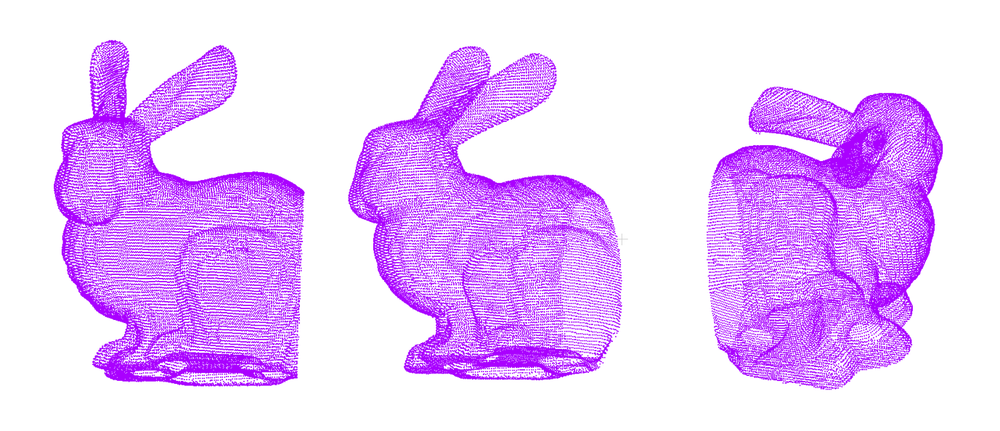

*Fig.4.7.6:   **bunny3.pcd***

Put **bunny4.pcd** into CloudCompare for viewing:


*Fig.4.7.7:   **bunny4.pcd***

We can be seen that **bunny3.pcd** lacks a tail, **bunny4.pcd** lacks ear, and the two do not overlap spatially. What we have to do next is to register **bunny3.pcd** (source point cloud) to the coordinate system where **bunny4.pcd** (target point cloud) is located so that the two are stitched together into a complete rabbit.

- The following four lines of code are the header files required for point cloud registration using ICP.

```c++
// Input and output related header file in the standard C++ library
#include <iostream>   
// pcd reads and writes related header file in PCL
#include <pcl/io/pcd_io.h>  
// Point type header file supported in PCL
#include <pcl/point_types.h> 
// registration using ICP
#include <pcl/registration/icp.h>
```

------


The following code creates two point cloud objects "cloud1" and "cloud2", and loads **bunny3.pcd** and **bunny4.pcd** into these two point cloud objects, respectively:

```c++
    pcl::PointCloud<pcl::PointXYZ>::Ptr cloud1(new pcl::PointCloud<pcl::PointXYZ>);
	pcl::PointCloud<pcl::PointXYZ>::Ptr cloud2(new pcl::PointCloud<pcl::PointXYZ>);

	pcl::io::loadPCDFile(".../bunny3.pcd", *cloud1);
	pcl::io::loadPCDFile(".../bunny4.pcd", *cloud2);
```

------


The following code is divided into two parts. The first part performs the actual operation of ICP (including the creation of the ICP object "icp" and the setting of parameters); the second part creates a point cloud object to store the result after registration. Set parameters after the code*

```c++
    // set parameters
    pcl::IterativeClosestPoint<pcl::PointXYZ, pcl::PointXYZ> icp;
	icp.setInputSource(cloud1);
	icp.setInputTarget(cloud2);
	icp.setMaxCorrespondenceDistance(1.5);
	icp.setMaximumIterations(100);
	icp.setTransformationEpsilon(1e-10);
	icp.setEuclideanFitnessEpsilon(0.01);
    
    // create "Final" to save result
	pcl::PointCloud<pcl::PointXYZ> Final;
	icp.align(Final);
```

*Among them, the parameters that need to be set are[^30]:

**setInputSource**: Input the source point cloud "cloud1" into icp;

**setInputTarget**: Input the target point cloud "cloud2" into icp;

**setMaxCorrespondenceDistance**: Points within this range will be selected into the consideration range of the corresponding point pair;

**setMaximumIterations**: The first constraint, the number of iterations, may appear in dozens or hundreds;

**setTransformationEpsilon**: The second constraint, which is generally set to 1e-6 or less;

**setEuclideanFitnessEpsilon**: The third constraint, which is the difference between the error of the two iterations;

Finally, the registration result point cloud is obtained through icp.align.

------


The following code outputs the scoring result of ICP after setting the parameters for the point cloud we input: the larger the value of "getFitnessScore", the worse the effect because this value represents the distance between the registered and the target point cloud. The smaller the distance, the more accurate the registration. Then create a matrix object "transformation" to store the rigid transformation matrix and output it, and finally save the registration result in **bunny_registration.pcd**.

```c++
    std::cout << "has converged:" << icp.hasConverged() << " score: " <<
		icp.getFitnessScore() << std::endl;

	Eigen::Matrix4f transformation = icp.getFinalTransformation();
	std::cout << transformation << std::endl;

	pcl::io::savePCDFile(".../bunny_registration.pcd", Final);
```

------

The figure below is the result of registration: The purple one is **bunny4.pcd**, and the black one is **bunny_registration.pcd**, that is, the result point cloud after registration for **bunny3.pcd**. When dragging the result into CloudCompare to view, we can see that **bunny_registration.pcd** overlaps with **bunny4.pcd** in most places and supplements the missing ear part **bunny4.pcd** to a certain extent. Nevertheless, there are double walls (see in Section 4-11).


*Fig.4.7.8:   The result of registration*

As shown in Fig.4.7.8, the target point cloud **bunny4.pcd** and the registered result point cloud **bunny_registration.pcd** overlap to a certain extent (not wholly overlapped. There are double walls). Similarly, we can output the ICP score and rigid transformation matrix through this code, as shown in Fig。4.7.9:

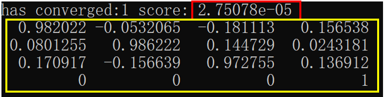

*Fig.4.7.9:   The results of running*

Fig.4.7.9 shows that the ICP registration score is 2.75078e-05 in the red box, which is small, so the registration result is roughly okay. The yellow box in the figure is the matrix of rigid transformation.

The 4 × 4 rigid transformation matrix, which represents rotation and translation, can be divided into:

$$
\left(\begin{array}{cc}\boldsymbol{R}_{3 \times 3} & \boldsymbol{t}_{3 \times 1} \\ \mathbf{0}_{1 \times 3} & 1\end{array}\right)
$$
$\boldsymbol{R}_{3 \times 3}$ is the rotation matrix，$\boldsymbol{t}_{3 \times 1}$ is the translation vector. More specific calculation can refer to following link: https://zhuanlan.zhihu.com/p/35901184.

After calculating the rigid transformation matrix, the formula which can move from one point $Q(q_{x},q_{y},q_{z})$ to another point $P(p_{x},p_{y},p_{z} )$ is as follows:
$$
\left(\begin{array}{l}q_{x} \\ q_{y} \\ q_{z} \\ 1\end{array}\right)=\left(\begin{array}{cc}\boldsymbol{R}_{3 \times 3} & \boldsymbol{t}_{3 \times 1} \\ \mathbf{0}_{1 \times 3} & 1\end{array}\right)\left(\begin{array}{c}p_{x} \\ p_{y} \\ p_{z} \\ 1\end{array}\right)
$$


### 4-8 ：Search

Three-dimensional point cloud data is different from one-dimensional data and two-dimensional image information:

One-dimensional data is to find points in other positions based on shifting the current position to the left or right, as shown in Fig.4.8.1:


*Fig.4.8.1:   One-dimensional search*

Two-dimensional image is indexed according to the pixel position, as shown in Fig.4.8.2:


*Fig.4.8.2:   Two-dimensional search[^31]*

Three-dimensional point cloud data is Irregular. So we introduce the point cloud spatial search method, that is, search by neighbors. The most commonly used methods are Octree and Kdtree. Before introducing them, we first mention **Nearest Neighbor Search** and **Binary Search Tree**.


#### 4-8-1 ：Nearest Neighbor Search (NNS)

When it comes to search, it is worth mentioning that Nearest Neighbor Search (NNS). NNS is used widely, such as Normal estimation, Noise filtering, Sampling, Clustering, Deep learning, and Feature detection/description. NNS usually includes two search methods: K-NN and Fixed Radius-NN.

##### K-NN

There is a set of points $S$ in space $M$. For a search point q in $M$, find the $K$ points closest to it in the point set $S$.

As shown in Fig.4.8.3, the red point is the search point $q$. When K = 3, what we search is the nearest 3 points from $q$, that is, the three green points.


*Fig.4.8.3:   K-NN*

##### Fixed Radius-NN

There is a set of points $S$ in space $M$. For a search point $q$ in $M$, find the points in the point set $S$ whose distance from $q$ is less than or equal to $R$, where $R$ is the search radius.

As shown in Fig.4.8.4, the red point is the search point $q$, while the green points are the points in the point set $S$ whose distance from $q$ is less than or equal to $R$, that is, the points that meet the conditions we searched for using Fixed Radius-NN.

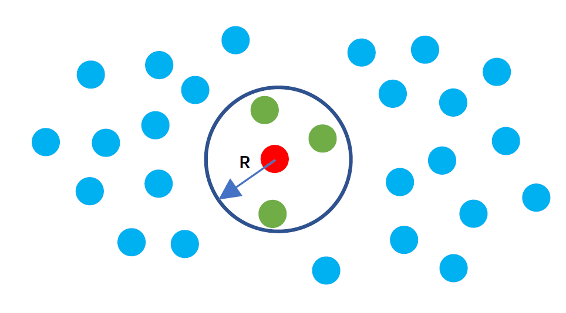

*Fig.4.8.4:   Fixed Radius-NN*


#### 4-8-2 ：Binary Search Tree (BST)

In the previous section, we introduced the Nearest Neighbor Search (NNS), widely used in many situations. Nevertheless, for point clouds, Nearest Neighbor Search has some difficulties:

- For 2D images, the neighbor of a pixel is to add a variable $x+\Delta x, y+\Delta y$ to the coordinates of the point.


​       *Fig.4.8.5:   Pixels*

- But for point cloud: 


1. 1. the point cloud is irregular, not based on a grid;
   2. most point cloud files have a large amount of data, which makes the number of calculations too many;

In order to use NNS to search for point clouds more conveniently, we introduce two tree structure data — Octree and Kdtree, which allow us to find neighbors in a large number of points quickly. In contrast, Binary Search Tree (BST) is the basis of Kdtree. Now we first introduce BST.

##### The concept of BST

**Tree:** A data structure, a hierarchical collection composed of n (n>=1) finite nodes. It is called a "tree" because it looks like an upside-down tree, which means its roots facing up and its leaves facing down. It has the following characteristics:

- Each node has 0 or more child nodes.

- The node without a parent node is called the root node.

- Every non-root node only has one parent node.

- Except for the root node, each child node can be divided into multiple disjoint subtrees[^32].

Binary Search Tree (BST) is mainly used to handle 1-dimensional data, which is based on Kdtree. BTS is a tree data structure based on the node, as shown in Fig.4.8.6:

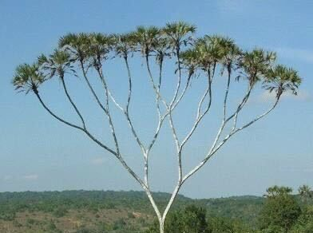

*Fig.4.8.6:   “Wild upside-down binary tree”[^33]*

Fig.4.8.6 is a vivid example, using a natural tree whose bifurcation happens to have two forks to deepen the understanding of binary trees.

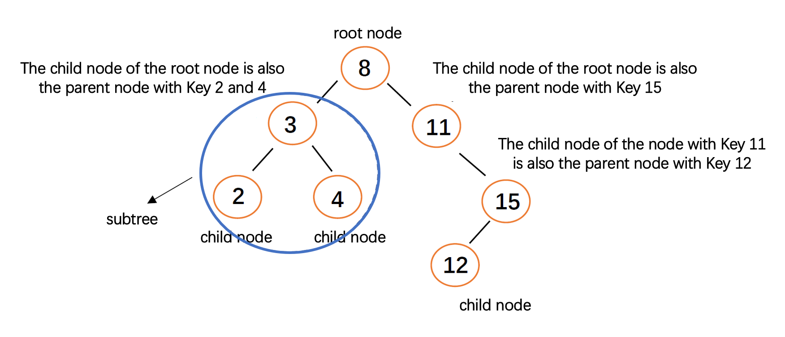

*Fig.4.8.7:   BST*

Fig.4.8.7 is an example of BST, which is the approximate upside-down representation of Fig.4.8.6. The orange circle is called the node; the number on the node is the key of node; the node with key 8 at the top is called the root node, and the node at the next level is called its child node; the child node with key 3 and its own child nodes (key 2 and key 4) form the root node subtree. Other child nodes and subtrees can be deduced by analogy.

##### The rules of BST

BST follows the following rules:

- The subtree on the left of the node contains a key smaller than the key of the node;
- The subtree on the right of the node contains a key larger than the key of the node;
- The subtree to the left/right of the node is also a BST;

As shown in Fig.4.8.7: The key of the root node is 8, the key of subtree on the left is 3, which is smaller than 8, while the key of subtree on the right is 4, which is larger than 3. Other nodes and subtrees can be deduced by analogy.

##### The calculation of BST

The following example describes the calculation of BST:

Given a row of ordered data: [80, 20, 400, 15, 25, 30], construct BST as follows. Fig.4.8.8 is a schematic diagram of the construction process:


*Fig.4.8.8:   BST construction process*

As shown in Fig.4.8.8, since our data has been arranged in order, we start the construction of BST according to the arrangement of the data itself:

Firstly, the first data 80 is used as the root node of BST;

Secondly, look at the second data 20. According to the three principles of BST, 20<80, so the child node with key 20 should be on the left side of the root node;

Thirdly, the next third data 400>80, so it is on the right side of the root node;

Lastly, the fourth data 15<80, walk to the left of the root node, and find that the child node has occupied the left child node of the root node at this time with key 20, then continue to the child node of 20, because 15<20, Therefore, the child node with key 15 is on the left of the node with key 20;

The other child nodes can be deduced by analogy and finally get the final version of BST, which is the BST of the given data we require.


#### 4-8-3 ： Kdtree

The previous two sections introduced the basic knowledge of NNS and BST, among which BST is the basis of Kdtree in this section. The reason for saying this is that Kdtree performs a BST in each dimension.

##### The concept of Kdtree

"K" refers to the K dimension, and "d" is the first letter of "dimensional", which means dimension. Kdtree is also a K-dimensional tree, usually divided according to the median of the data on the split axis (the median is reflected in the subsequent Kdtree establishment).

As a data structure based on space division, it is often used in the high-dimensional search. If only the point cloud's spatial coordinates are used as the dimension, then the Kdtree is a 3-dimensional tree when applied to the point cloud. The result of BST's division described earlier is that there is only one data or no data in the leaf node, but Kdtree has a leaf_size. The number of data in the child node at the end of the final division can be set. leaf_size = n indicates that if the last child node's data is less than or equal to n, it is a leaf node, and this child node is no longer divided. Otherwise, the division continues.

##### The construction of Kdtree

There are two conventions for the construction of Kdtree:

**A.** When dividing, the dividing line passes through the data;

**B.** When dividing, the dividing line bypasses the data;


*Fig.4.8.9:   Two conventions for the construction of Kdtree[^34]*

Since the two-dimensional view is more convenient than the higher-dimensional, we use a two-dimensional tree (K in Kdtree is 2) as an example. As shown in Fig.4.8.9, the left side is the division under the type A convention, and we can see that the dividing lines (blue and red) of each division pass through our data points; while the type B convention on the right happens to bypass the data points for the division. Here we choose type A conventions to explain.

The establishment of Kdtree involves the issue of the division axis selected for each division. Here are two selection methods:

- **Adaptive**. Choose the dimension with the largest variance, that is, the axis with the most scattered data distribution in our vision;


​        *Fig.4.8.10:   Adaptive*

A shown in Fig.4.8.10: In the example on the left, the Y-axis data is more scattered than the data on the X-axis. If we calculate the variance of the data on each axis, the Y-axis variance is larger, so the Y-axis is divided, and the dividing line is the red dashed line in the figure. Opposite to the right. Generally, the initial selection of the split axis is based on this adaptive method.

- Switch the coordinate axis in turn. For example, if our data is 2-dimensional, the division axis's selection order can be x-y-x-y-x...; if the data is 3-dimensional, the selection order of the division axis can be x-y-z-x-y-z-x...

Next, introduce the Kdtree establishment process (take the example in Wikipedia):

Given a column of 2-dimensional data: {(2, 3), (5, 4), (9, 6), (4, 7), (8, 1), (7, 2)}, leaf_size = 1. Fig.4.8.11 is the Kdtree (on the right) and the schematic diagram of the plane division (on the left) we established for the given 2-dimensional data:


*Fig.4.8.11:   Kdtree construction[^34]*

Since the X-axis variance is greater than that of the Y-axis, the first division axis is the X-axis, and the median of the X values of the six data is 7. Therefore, the first red division line runs through (7, 2 ), (7, 2) is what we call the root node; after the division, the left subtree of the root node includes {(2, 3), (5, 4), (4, 7)}, right subtree includes {(9, 6), (8, 1)}. Then the subtree is divided, and the division axis is switched to the Y-axis at this time, and the median of the Y value of the left subtree is 4, so the division axis is the blue line passing through (5, 4) in the left figure. At this time, the left and right subtrees of (5, 4) only contain one data, which meets the leaf_size setting, so the division ends. The division of the right subtree of the root node can be deduced by analogy. Presented in the tree structure is the schematic diagram on the right side of Fig.4.8.11.

##### Kdtree search

We have introduced NNS in Section 4-8-1, including K-NN and Fixed Radius-NN. Kdtree also can use these two methods.

###### Example

Kdtree search on randomly generated point cloud data (including K-NN and Fixed Radius-NN). For the complete code **kdtree.cpp** see in [Appendix —— Kdtree](# 4.8.3 ： Kdtree).

The following five lines of code are the header files needed for Kdtree search:

```C++
// point cloud header file
#include <pcl/point_cloud.h>         
// Kdtree header file
#include <pcl/kdtree/kdtree_flann.h>  
// Input and output related header file in the standard C++ library
#include <iostream>                   
// vector header file
#include <vector>                     
// Get and manipulate date and time header file
#include <ctime>                      
```

------


The following line of code means to set the seed of the random number, where the parameter in srand () is time so that the seed number will change with the computer's built-in time, and the random number generated each time is different:

```C++
	srand(time(NULL));
```

------


The following code uses random numbers and a for loop to create a point cloud. The total number of point clouds is 1000:

```C++
	pcl::PointCloud<pcl::PointXYZ>::Ptr cloud(new pcl::PointCloud<pcl::PointXYZ>);

	// Generate pointcloud data
	cloud->width = 1000;
	cloud->height = 1;
	cloud->points.resize(cloud->width * cloud->height);

	for (std::size_t i = 0; i < cloud->points.size(); ++i)
	{
		cloud->points[i].x = 1024.0f * rand() / (RAND_MAX + 1.0f);
		cloud->points[i].y = 1024.0f * rand() / (RAND_MAX + 1.0f);
		cloud->points[i].z = 1024.0f * rand() / (RAND_MAX + 1.0f);
	}
```

------


The following code first creates a Kdtree object "kdtree", then uses the previously generated point cloud object "cloud" as the input point cloud to be searched by Kdtree, then creates a point "searchPoint" containing XYZ information, which is the search point. What we want to search is the neighboring point of this point, and random numbers also generate " searchPoint":

```C++
	pcl::KdTreeFLANN<pcl::PointXYZ> kdtree;
	kdtree.setInputCloud(cloud);
	pcl::PointXYZ searchPoint;
	searchPoint.x = 1024.0f * rand() / (RAND_MAX + 1.0f);
	searchPoint.y = 1024.0f * rand() / (RAND_MAX + 1.0f);
	searchPoint.z = 1024.0f * rand() / (RAND_MAX + 1.0f);
```

------


The following is the specific code of using K-NN to search: first set K in K-NN, that is, we want to search for K points around searchPoint, here is to search for 10 points, then create the index vector "pointIdxNKNSearch" of the K-NN search result point and the vector "pointNKNSquaredDistance" of the square distance between the K-NN search result point and searchPoint; finally output the XYZ value and K value of searchPoint:

```C++
    // K nearest neighbor search
	int K = 10;
	std::vector<int> pointIdxNKNSearch(K);
	std::vector<float> pointNKNSquaredDistance(K);
	std::cout << "K nearest neighbor search at (" << searchPoint.x
		<< " " << searchPoint.y
		<< " " << searchPoint.z
		<< ") with K=" << K << std::endl;
```

------


Next, input searchPoint, K, pointIdxNKNSearch, pointNKNSquaredDistance into kdtree.nearestKSearch (); execute K-NN search to determine whether the search is successful. If successful, the function returns a value> 0, output the XYZ value of each search result point, and the distance squared between searchPoint:

```C++
    if (kdtree.nearestKSearch(searchPoint, K, pointIdxNKNSearch, pointNKNSquaredDistance) > 0)
	    {
		    for (std::size_t i = 0; i < pointIdxNKNSearch.size(); ++i)
			    std::cout << "    " << cloud->points[pointIdxNKNSearch[i]].x
			    << " " << cloud->points[pointIdxNKNSearch[i]].y
			    << " " << cloud->points[pointIdxNKNSearch[i]].z
			    << " (squared distance: " << pointNKNSquaredDistance[i] << ")" <<     std::endl;
	    }
```

------


The following is the specific code for searching using Fixed Radius-NN: first, use a random number to set the search's radius. Then create each search result point index vector "pointIdxRadiusSearch", and the vector "pointRadiusSquaredDistance" of the distance squared between each search result point and searchPoint. Output the XYZ value of searchPoint and radius value:

```C++
    // Neighbors within radius search
	float radius = 256.0f * rand() / (RAND_MAX + 1.0f);
	std::vector<int> pointIdxRadiusSearch;
	std::vector<float> pointRadiusSquaredDistance;
	std::cout << "Neighbors within radius search at (" << searchPoint.x
		<< " " << searchPoint.y
		<< " " << searchPoint.z
		<< ") with radius=" << radius << std::endl;
```

------


Next, by inputting searchPoint, radius, pointIdxRadiusSearch, and pointRadiusSquaredDistance into kdtree.nearestKSearch (), perform a Fixed Radius-NN search to determine whether the search is successful; if successful, the function returns a value> 0 and outputs the XYZ value of each search result point and the square of the distance between each of them and searchPoint:

```C++
    if (kdtree.radiusSearch(searchPoint, radius, pointIdxRadiusSearch, pointRadiusSquaredDistance) > 0)
	    {
	    	for (std::size_t i = 0; i < pointIdxRadiusSearch.size(); ++i)
			    std::cout << "    " << cloud->points[pointIdxRadiusSearch[i]].x
			    << " " << cloud->points[pointIdxRadiusSearch[i]].y
			    << " " << cloud->points[pointIdxRadiusSearch[i]].z
			    << " (squared distance: " << pointRadiusSquaredDistance[i] << ")"     << std::endl;
	    }
```

------

Fig.4.8.12 is the result of running:

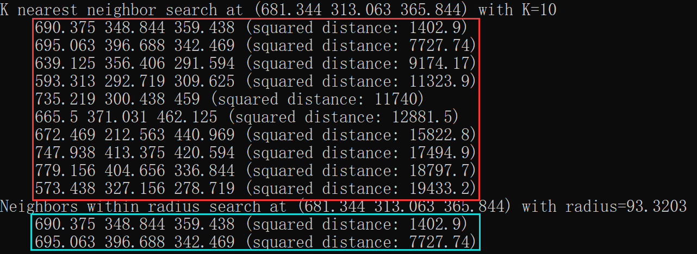

*Fig.4.8.12:   The result of Kdtree search*

As shown in Fig.4.8.12: The red part is the result of the K-NN search. The first line indicates that the randomly generated searchPoint is (681.344, 313.063, 365.844). Because K is set to 10, 10 neighbors of the searchPoint are searched, and the square of the distance between each point and searchPoint is output in the brackets after each point; The blue part is the result of Fixed Radius-NN search. The first line indicates that the randomly generated searchPoint is also (681.344, 313.063, 365.844). Because we only set searchPoint once in the code, the searchPoint of the two search methods is the same. There are two neighbors searched by this method, and their distance from searchPoint is less than the radius (93.3203). Similarly, the square of the distance between each point and searchPoint is output in brackets after each point.


#### 4-8-4 ：Octree

In addition to Kdtree, Octree is also an important search method.

##### The concept of Octree

Octree uses the cube to divide space.

##### The characteristics of Octree

- Each node has up to eight child nodes, which is different from the BST mentioned earlier, each node of BST contains up to two child nodes;

- Applied in three-dimensional space (because Octree divides each dimension. Cut each dimension of the cube. The final cut result of three-dimensional data is $2^3 = 8$, so it is called "eight" fork tree — Octree);
- The basic unit of Octree division is octant, which is a small cube.

Fig.4.8.13 and Fig.4.8.14 are Octrees. We can see that each node has up to eight child nodes in Fig.4.8.13, and the right is the tree structure of Octree. On the left of Fig.4.8.14, we can see the child nodes in each division. There are different colors in each division, which is the intuitive representation of division in three-dimensional space. 


*Fig.4.8.13:   Octree 1*

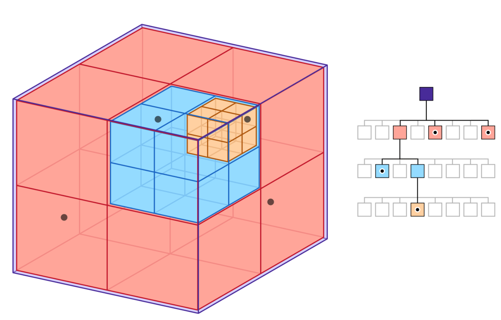

*Fig.4.8.14:   Octree 2[^35]*

##### Octree search

Fig.4.8.13 and Fig.4.8.14 are Octrees. We can see that each node has up to 8 child nodes in Fig.4.8.13, and the right is the tree structure of Octree. On the left of Fig.4.8.14, we can see the child nodes in each division. There are different colors in each division, which is the intuitive representation of division in three-dimensional space. 

###### Example

Use random numbers to generate point clouds, and use three search methods to search for Octree nearest neighbors. The three methods are:

- Neighbors within Voxel Search
- K-NN
- Fixed Radius-NN

For the complete code **Octree.cpp** see in [Appendix —— Octree](# 4.8.4 ： Octree).

The following lines of code are the header files needed to implement Octree search:

```c++
// point cloud header file
#include <pcl/point_cloud.h>            
// octree search header file
#include <pcl/octree/octree_search.h>   
// Input and output related header file in the standard C++ library
#include <iostream>        
// Get and manipulate date and time header file
#include <ctime>                        
```

------


The following line of code means to set the seed of the random number, where the parameter in srand () is time so that the seed number will change with the computer's built-in time, and the random number generated each time is different:

```C++
	srand(time(NULL));
```

------


The following code uses random numbers and a for loop to create a point cloud. The total number of point cloud points is 1000:

```C++
	pcl::PointCloud<pcl::PointXYZ>::Ptr cloud(new pcl::PointCloud<pcl::PointXYZ>);

	// Generate pointcloud data
	cloud->width = 1000;
	cloud->height = 1;
	cloud->points.resize(cloud->width * cloud->height);

	for (std::size_t i = 0; i < cloud->points.size(); ++i)
	{
		cloud->points[i].x = 1024.0f * rand() / (RAND_MAX + 1.0f);
		cloud->points[i].y = 1024.0f * rand() / (RAND_MAX + 1.0f);
		cloud->points[i].z = 1024.0f * rand() / (RAND_MAX + 1.0f);
	}
```

------


The following code first sets the resolution of Octree cube (that is, small voxel) to 128.0 f, then enters the resolution and creates the Octree search object "octree" accordingly. Input the point cloud generated by random numbers into the octree, add the point of the input point cloud to the octree object, and create a search point object "searchPoint" containing XYZ coordinates. Random numbers also generate the XYZ coordinates of the search point:

```C++
    float resolution = 128.0f;
	pcl::octree::OctreePointCloudSearch<pcl::PointXYZ> octree(resolution);
	octree.setInputCloud(cloud);
	octree.addPointsFromInputCloud();
	pcl::PointXYZ searchPoint;
	searchPoint.x = 1024.0f * rand() / (RAND_MAX + 1.0f);
	searchPoint.y = 1024.0f * rand() / (RAND_MAX + 1.0f);
	searchPoint.z = 1024.0f * rand() / (RAND_MAX + 1.0f);
```

------


- **Neighbors within Voxel Search** 

First, create a vector "pointIdxVec" of the search result point index, then input "searchPoint" and "pointIdxVec" into the octree.voxelSearch () function to perform a neighbor search within a voxel to determine whether the search is successful. If successful, output the XYZ coordinate value of the searchPoint, and loop output the XYZ coordinate value of the search result point:

```C++
    // Neighbors within voxel search
	std::vector<int> pointIdxVec;
	if (octree.voxelSearch(searchPoint, pointIdxVec))
	{
		std::cout << "Neighbors within voxel search at (" << searchPoint.x
			<< " " << searchPoint.y
			<< " " << searchPoint.z << ")"
			<< std::endl;
		for (std::size_t i = 0; i < pointIdxVec.size(); ++i)
			std::cout << "    " << cloud->points[pointIdxVec[i]].x
			<< " " << cloud->points[pointIdxVec[i]].y
			<< " " << cloud->points[pointIdxVec[i]].z << std::endl;
	}
```

------


Starting from this part, it is the implementation of K-NN and Fixed Radius-NN, which are similar to the previous Kdtree code:

- **K-NN**

First, set K in K-NN. That is, we want to search for K points around searchPoint, here is to search for 10 points. Then create the index vector "pointIdxNKNSearch" of the K-NN search result point and the vector "pointNKNSquaredDistance" of the squared distance between the K-NN search result point and searchPoint. Finally, output the XYZ value and K value of searchPoint:

```C++
    // K nearest neighbor search
	int K = 10;
	std::vector<int> pointIdxNKNSearch;
	std::vector<float> pointNKNSquaredDistance;
	std::cout << "K nearest neighbor search at (" << searchPoint.x
		<< " " << searchPoint.y
		<< " " << searchPoint.z
		<< ") with K=" << K << std::endl;
```


Next, by inputting "searchPoint", "K", "pointIdxNKNSearch", and "pointNKNSquaredDistance" into octree.nearestKSearch (), execute the K-NN search to determine whether the search is successful. If successful, the function returns a value> 0 and outputs the xyz value of each search result point and the square of the distance between each of them and searchPoint:

```C++
  if (octree.nearestKSearch(searchPoint, K, pointIdxNKNSearch, pointNKNSquaredDistance) > 0)
	{
		for (std::size_t i = 0; i < pointIdxNKNSearch.size(); ++i)
			std::cout << "    " << cloud->points[pointIdxNKNSearch[i]].x
			<< " " << cloud->points[pointIdxNKNSearch[i]].y
			<< " " << cloud->points[pointIdxNKNSearch[i]].z
			<< " (squared distance: " << pointNKNSquaredDistance[i] << ")" << std::endl;
	}
```

------


- **Fixed Radius-NN**

First, use a random number to set the radius of the search, then create each search result point index vector "pointIdxRadiusSearch" and the vector "pointRadiusSquaredDistance" of the squared distance between each search result point and searchPoint, and output the xyz value and radius value of searchPoint:

```C++
    // Neighbors within radius search
	float radius = 256.0f * rand() / (RAND_MAX + 1.0f);
	std::vector<int> pointIdxRadiusSearch;
	std::vector<float> pointRadiusSquaredDistance;
	std::cout << "Neighbors within radius search at (" << searchPoint.x
		<< " " << searchPoint.y
		<< " " << searchPoint.z
		<< ") with radius=" << radius << std::endl;
```


Next, by inputting "searchPoint", "K", "pointIdxNKNSearch", and "pointNKNSquaredDistance" into octree.nearestKSearch (), execute the K-NN search to determine whether the search is successful. If successful, the function returns a value> 0 and outputs the XYZ value of each search result point as well as the square of the distance between point and searchPoint:

```C++
    if (octree.radiusSearch(searchPoint, radius, pointIdxRadiusSearch, pointRadiusSquaredDistance) > 0)
	    {
		    for (std::size_t i = 0; i < pointIdxRadiusSearch.size(); ++i)
			    std::cout << "    " << cloud->points[pointIdxRadiusSearch[i]].x
			    << " " << cloud->points[pointIdxRadiusSearch[i]].y
			    << " " << cloud->points[pointIdxRadiusSearch[i]].z
			    << " (squared distance: " << pointRadiusSquaredDistance[i] << ")" << std::endl;
	    }
```

------

The following is the running result:


*Fig.4.8.15:   The running result of Octree*

As shown in Fig.4.8.15:

The red part is the search result of Neighbors within Voxel Search. The first line indicates that the randomly generated searchPoint is (323.563, 918.906, 881.594), and the red box indicates that a total of three points have been searched within the range of the voxel resolution we set.

The blue part is the search result of K-NN. The first line indicates that the randomly generated searchPoint is also (323.563, 918.906, 881.594). Since the K is 10, a total of 10 neighbors of the searchPoint are searched, and the square of the distance between each point and searchPoint is output in the brackets after each point.

The yellow part is the search result of Fixed Radius-NN. The first line indicates that the randomly generated searchPoint is also (323.563, 918.906, 881.594). Because we only set searchPoint once in the code, the searchPoint of the three search methods is the same. There are two neighbors searched by this method, and their distance from the searchPoint is less than the radius (74.2422). Similarly, the square of the distance between each point and searchPoint is output in brackets after each point.

The yellow part is the search result of Fixed Radius-NN. The first line indicates that the randomly generated searchPoint is also (323.563, 918.906, 881.594). Because we only set searchPoint once in the code, the "searchPoint"s of the three search methods are the same. There are two neighbors searched by this method, and their distance from the searchPoint is less than the radius (74.2422). Similarly, the square of the distance between each point and searchPoint is output in brackets after each point.


### 4-9 ： Filtering

As the name shows, point cloud filtering is to use some specific filtering methods to filter the point cloud. Due to:

- **The original point cloud contains many noise points and irrelevant points.**

  The accuracy of the equipment we obtain the point cloud, the operating environment, and the structural characteristics of the measured object itself will cause the final point cloud to produce some noises (as shown in Fig.4.9.1) and outliers (as shown in Fig.4.9.2), which will have an adverse effect on our subsequent further processing and analysis of the point cloud;


​       *Fig.4.9.1:   noises[^36]*

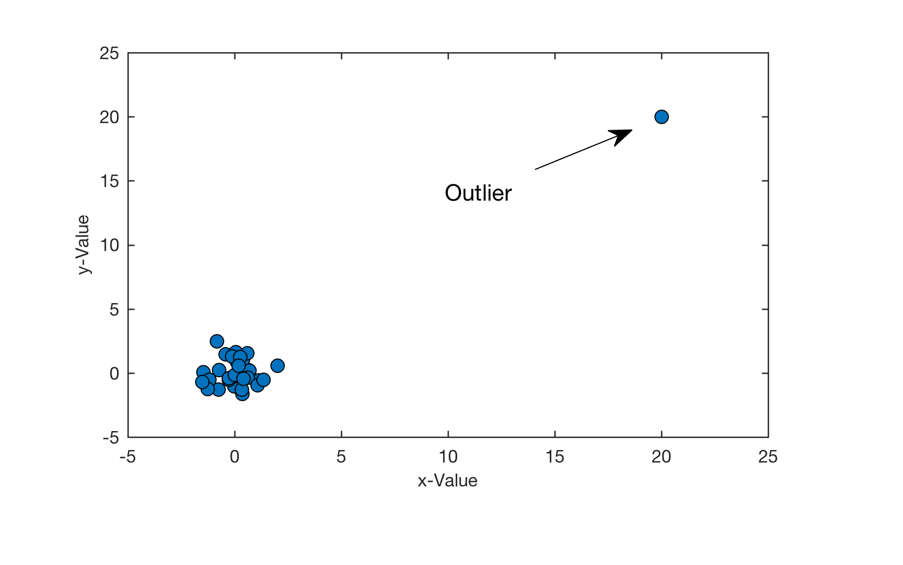

​        *Fig.4.9.2:   Outliers[^37]*

- **The original point cloud is huge.**

  Therefore, we usually need to downsample huge point clouds (the background of point cloud downsampling is introduced in Chapter2) to improve computing efficiency;

- **Our ROI is part of the current point cloud.** We only need a part of the current point cloud, so we need to crop the point cloud (the background of point cloud cutting is introduced in Chapter2).

Therefore, we often need to pre-process the point cloud before further processing the point cloud, point cloud filtering. The module used for point cloud filtering in PCL provides many filtering algorithms. Each filtering algorithm relies on the filter to implement the filtering. There are mainly the following filters: PassThrough Filter, VoxelGrid Filter, Statistical Filter, Radius Filter, etc.

- The PassThrough Filter is mostly used for large-area cropping of point clouds;
- The VoxelGrid Filter is mostly used to simplify the number of point clouds (similar to the resampling of the downsampling effect);
- The Statistical Filter is mostly used for outlier filtering on point clouds;
- The Radius Filter is also mostly used for outlier filtering on point clouds.


#### 4-9-1 ： PassThrough Filter

##### The concept of PassThrough Filter

PassThrough Filter selects the coordinate axis (X-axis or Y-axis or Z-axis) to be filtered and then set the range of the axis to be retained or filtered. It is mainly used to perform a rough filter. Similar to the extensive area cropping we learned in CloudCompare.

##### Example

Take **airplane.pcd** as an example for filtering. Perform passthrough filtering on the point cloud, and the filter axis is the Z-axis. It is expected that the final result is that the Z-axis direction will be cut off:


*Fig.4.9.3:   **airplane.pcd***

The complete code **passthrough.cpp** see in [Appendix —— passthrough](# 4.9.1 ： Passthrough).

The following lines of code are the header files needed for filtering using the PassThrough Filter:

```c++
// pcd reads and writes related header file in PCL
#include <pcl/io/pcd_io.h>  
// Point type header file supported in PCL
#include <pcl/point_types.h> 
// PassThrough Filter header file
#include <pcl/filters/passthrough.h>  
```

------


The following code creates two point cloud objects: "cloud" and "cloud_filtered". The former is used to save the original point cloud (to be filtered), and the latter is used to save the result point cloud. Finally, we can get the number of points in the original point cloud and fields at each point. Then we load **airplane.pcd** into "cloud".

```c++
pcl::PointCloud<pcl::PointXYZ>::Ptr cloud(new pcl::PointCloud<pcl::PointXYZ>);
pcl::PointCloud<pcl::PointXYZ>::Ptr cloud_filtered(new pcl::PointCloud<pcl::PointXYZ>);
pcl::io::loadPCDFile(".../airplane.pcd", *cloud);
std::cout << "PointCloud before filtering: " << cloud->width * cloud->height
		<< " data points (" << pcl::getFieldsList(*cloud) << ")." << std::endl;
```

------


First, create a PassThrough object "pass", then input the original point cloud (to be filtered) into the "pass", set the filter axis to "Z" (setFilterFieldName), and set the retained range of the axis to (0.0, 1.0). Then perform filtering pass.filter, store the filtered results in cloud_filtered, output the number of points in the filtered point cloud, and the fields (x, y, z) at each point. Finally, save the filtered results in **airplane_passthourgh.pcd**. Related parameters see the back of this code for the setting introduction*:

```c++
// Create the filtering object
pcl::PassThrough<pcl::PointXYZ> pass;
pass.setInputCloud(cloud);
pass.setFilterFieldName("z");
pass.setFilterLimits(0.0, 1.0);
//pass.setFilterLimitsNegative (true);  // It means setFilterLimitsNegative = false
pass.filter(*cloud_filtered);
std::cout << "PointCloud after filtering: " << cloud_filtered->width * cloud_filtered->height
		<< " data points (" << pcl::getFieldsList(*cloud_filtered) << ")." << std::endl;
pcl::io::savePCDFileASCII(".../airplane_passthourgh.pcd", *cloud_filtered);
```

*Parameters:

**setFilterFieldName:** Set the filter axis (X/Y/Z);

**setFilterLimits:** Set filter restrictions, the format is (minimum, maximum);

**setFilterLimitsNegative:** Set the point cloud of the final filtering result to filter out or keep the part encircled by “setFilterFieldName” and “setFilterLimits”. If the parameter is set to true, the encircled part will be filtered. Otherwise, it will be kept. The default parameter is false, so in the above code, When we do not set this parameter (// pass.setFilterLimitsNegative (true)), the filtering result is to retain the points of the Z-axis (0.0, 1.0) range.

------

The following is the running result. It can be seen that the original number of points is 10000, and it is 4696 points after filtering:

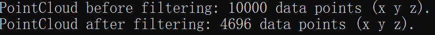

*Fig.4.9.4:   The result of running*

Fig.4.9.5 is the view before and after filtering:


*Fig.4.9.5:   The view before and after filtering*

As shown in Fig.4.9.5: The left is **airplane.pcd** 

On the left is the original unfiltered **airplane.pcd**, and on the right is the result of passthrough filtering after setting the filter axis and the on-axis range, we can see that it is neatly retained on the right-wing as well as the tail part. By viewing **airplane_passthourgh.pcd**, we can see that all points' z coordinate values are in the range of (0.0, 1.0). Therefore, passthrough filtering is like cutting off a part neatly in a specific direction, so it is often used as a rough pre-processing for filtering point clouds. More advanced filtering requires other filtering methods.


#### 4-9-2 ： VoxelGrid Filter

##### The concept of VoxelGrid Filter

VoxelGrid Filter, as the name suggests, uses small voxels to filter the point cloud. Small voxels are small cubes, and the side length is the parameter we need to set when we filter the voxel grid. VoxelGrid mainly acts as a point cloud downsampling effect.

First, create a 3-dimensional voxel grid (as shown in Fig.4.9.6 (a)) based on the original point cloud, find the center of gravity of all points in each small voxel (take Fig.4.9.6(b) as an example), keep the center of gravity (as shown in Fig.4.9.6 (c)), and filter other points.


*Fig.4.9.6:   VoxelGrid Filter 1[^38]*

In this way, each voxel's previous point is replaced by the center of gravity of the corresponding voxel, which achieves the effect of downsampling to a certain extent. It should be noted that, unlike the PassThrough filter, VoxelGrid filter is mainly used to resample the point cloud for downsampling effect (reducing the number of points) because the final point may not be the point in the original point cloud (the center of gravity is not necessarily the point in the original point cloud).


*Fig.4.9.7:   VoxelGrid Filter 2 [^39]*

As shown in Fig.4.9.7, the left blue point is the original point cloud that we need to filter. We build a three-dimensional voxel grid based on it (here are two small voxels), so the final filtered point is the center of gravity of the two small voxels' original points, and two points are obtained after the final filtering.

##### Example

Take **chair.pcd** as an example (see in the "files" folder). Fig.4.9.8 is the view of **chair.pcd**:


*Fig.4.9.8:   **chair.pcd***

For the complete code **voxelgrid.cpp** see in [Appendix —— VoxelGrid](# 4.9.2 ： VoxelGrid).

The following lines of code are the header files needed for VoxelGrid Filter:

```c++
// Input and output related header file in the standard C++ library
#include <iostream>   
// pcd reads and writes related header file in PCL
#include <pcl/io/pcd_io.h>  
// Point type header file supported in PCL
#include <pcl/point_types.h>  
// VoxelGrid Fiter header file
#include <pcl/filters/voxel_grid.h> 
```

------


Next, create two point cloud objects "cloud" and "cloud_filtered", load **chair.pcd** into "cloud", and finally output the total points of the point cloud and the fields (x, y, z) contained in each point:

```c++
pcl::PointCloud<pcl::PointXYZ>::Ptr cloud(new pcl::PointCloud<pcl::PointXYZ>);
pcl::PointCloud<pcl::PointXYZ>::Ptr cloud_filtered(new pcl::PointCloud<pcl::PointXYZ>);
pcl::io::loadPCDFile(".../chair.pcd", *cloud);
std::cout << "PointCloud before filtering: " << cloud->width * cloud->height
		<< " data points (" << pcl::getFieldsList(*cloud) << ")."<< std::endl;
```

------


The following is the implementation code part of voxel grid filtering: first create a VoxelGrid object "sor", and input "cloud" into "sor"; then set the side length (setLeafSize) of each small voxel to 0.05f; finally perform the filtering operation:

```c++
// Create the filtering object
pcl::VoxelGrid<pcl::PointXYZ> sor;
sor.setInputCloud(cloud);
sor.setLeafSize(0.05f, 0.05f, 0.05f);
sor.filter(*cloud_filtered);
```

------


The following outputs the number of points of the filtered point cloud and the fields contained in each point (here are x, y, z), and finally save the filtered result in **chair_downsampling.pcd**:

```c++
std::cout << "PointCloud after filtering: " << cloud_filtered->width * cloud_filtered->height << " data points (" << pcl::getFieldsList(*cloud_filtered) << ")." << std::endl;
pcl::io::savePCDFileASCII(".../chair_downsampling.pcd", *cloud_filtered);
```

------

The following is the running result:

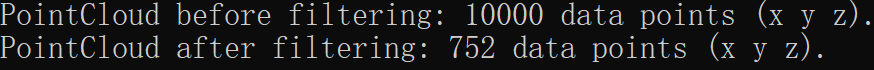

*Fig.4.9.9:   The result of running*

As shown in Fig.4.9.9: The number of points in the original point cloud is 10,000, while after filtering, the number changed to 752, so it can be said that the point cloud is simplified. However, because the operation of preserving the center of gravity makes the final point cloud not all points in the original point cloud (because the center of gravity is not necessarily in the original point cloud), this operation is a kind of resampling.

Fig.4.9.10 is a comparison between the original point cloud and the filtered point cloud: we can see that the filtered point cloud on the right is much sparser than the left, and the distribution of points is relatively neat. This is because we created the voxel grid neatly, and each voxel retains the center of gravity of the original point so that the result will be slightly neater.


*Fig.4.9.10:   Original (left) and Result (right)*


#### 4-9-3 ： Statistical Filter

##### The concept of Statistical Filter

Statistical Filter uses statistical methods to filter outliers in the point cloud. As mentioned in the previous introduction of filtering, due to the equipment's different accuracy to obtain the point cloud, the different operating methods of the operator, the collection environment, and other factors. The first-hand point cloud data we get often contains many noises or outliers ( Special points deviating from most points), as shown in Fig.4.9.11:


*Fig.4.9.11:   Outlier[^37]*

The main idea of Statistical Filter: Based on the distribution of the average distance between each point and its neighbors, assuming that the distribution is a Gaussian distribution with a specific mean and variance. If the average distance between a point and its neighbors is within a certain standard of the distribution (Determined by the global average distance and variance), the point is regarded as an outlier[^40].

##### Example

Take **table.pcd** as an example (see in the "files" folder), as shown in Fig.4.9.12 (The black circle is the approximate outlier part).


*Fig.4.9.12:   **table.pcd** and outliers*

For the complete code **statistical.cpp** see in [Appendix —— Statistical](# 4.9.3 ： Statistical).

The following lines of code are the header files needed for Statistical Filter:

```c++
// Input and output related header file in the standard C++ library
#include <iostream>   
// pcd reads and writes related header file in PCL
#include <pcl/io/pcd_io.h>  
// Point type header file supported in PCL
#include <pcl/point_types.h> 
// Statistical Fiter header file
#include <pcl/filters/statistical_outlier_removal.h>   
```

------


The following first creates two point cloud objects "cloud" (store the original point cloud) and "cloud_filtered" (store the filtered point cloud), and then load **table.pcd** into "cloud":

```c++
pcl::PointCloud<pcl::PointXYZ>::Ptr cloud(new pcl::PointCloud<pcl::PointXYZ>);
pcl::PointCloud<pcl::PointXYZ>::Ptr cloud_filtered(new pcl::PointCloud<pcl::PointXYZ>);
pcl::io::loadPCDFile(".../table.pcd", *cloud);
```

------


The following is the specific operation code for Statistical Filter: First, create the statistical filter object "sor"; then input "cloud" into "sor", set the parameters*, and perform the filtering operation. Finally, save "cloud_filtered" (the point cloud after filtering out the outlier) into **table_inliers.pcd**:

```c++
// Create the filtering object
pcl::StatisticalOutlierRemoval<pcl::PointXYZ> sor;
sor.setInputCloud(cloud);
sor.setMeanK(50);
sor.setStddevMulThresh(1.0);
sor.filter(*cloud_filtered);
pcl::io::savePCDFile(".../table_inliers.pcd", *cloud_filtered, false);
```

*Parameters:

**setMeanK**: The setting of 50 here means that the set of neighboring points of each point is the 50 points closest to it;

**setStddevMulThresh**: Here is set to 1 means that the criteria for dividing into outlier are as follows:

The average distance between the point and its neighbors > (1 standard deviation of the average distance between all points and its neighbors + the average distance between all points and its neighbors).

------


Next, save the outlier we just filtered out, perform the filtering operation, and save the final outlier in **table_outliers.pcd**:

```c++
sor.setNegative(true);      // after this line, cloud_filtered saves outliers
sor.filter(*cloud_filtered);
pcl::io::savePCDFile(".../table_outliers.pcd", *cloud_filtered, false);
```

------

Fig.4.9.13 is a schematic diagram of the point cloud during processing: (a) is the original point cloud, in which outlier points are marked in the black circle. (b) is the inlier part after filtering out the outlier, we can see that the outliers in the black circle have been filtered. (c) is the outlier we filtered out, (b) and (c) are combined to form (a).

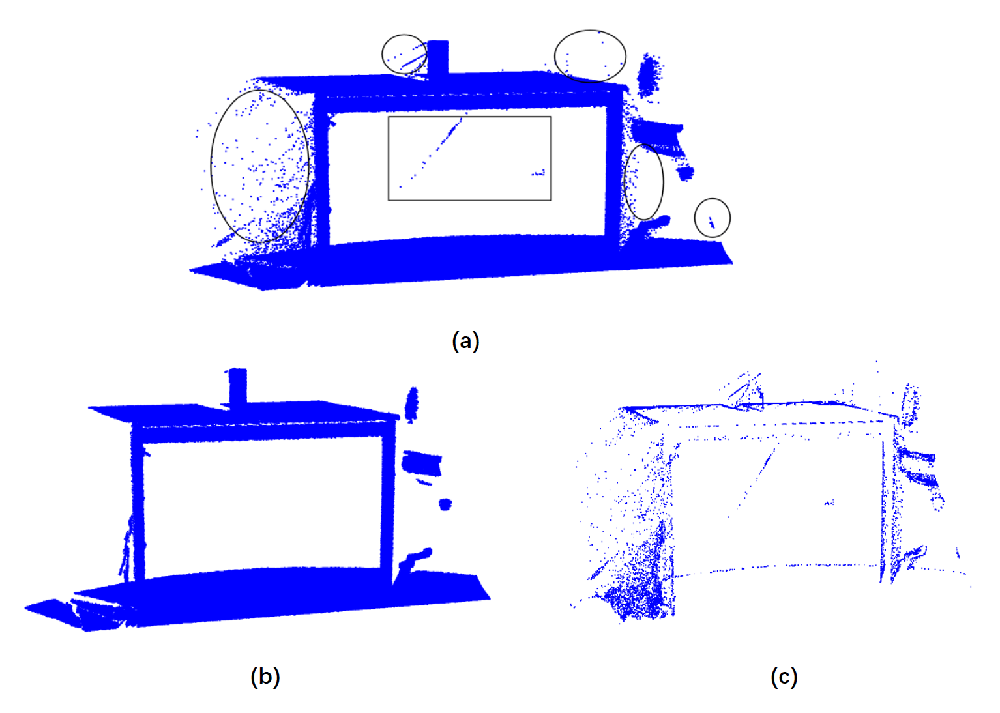

*Fig.4.9.13:   **table.pcd** (a)  **table_inliers.pcd** (b)  **table_outliers.pcd** (c)* 


#### 4-9-4 ：Radius Filter

##### The concept of Radius Filter

Radius Filter is the same as Statistical Filter and is mainly used for outlier filtering. The difference is that the radius filter's filtering method is not based on statistical distribution but based on an artificially set radius and the number of points within the radius to divide and filter outlier and inlier.

Fig.4.9.14 shows the principle of Radius Filter: set the radius R of the neighborhood, the minimum number of points within the radius is K = 5, and if the number of points within the radius of R is less than K, it will be regarded as an outlier. The number of points in the yellow point neighborhood is 7 > 5; the number of points in the neighborhood of the red point is 1 < 5. Therefore the red point is an outlier and should be filtered out.

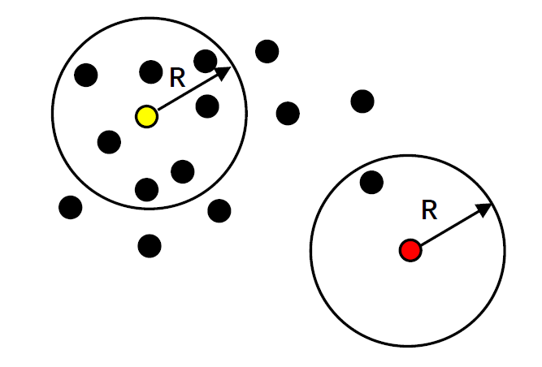

*Fig.4.9.14:   Radius Filter*

##### Example

Take **table.pcd** as an example (see in the "files" folder). As shown in Fig.4.9.15:

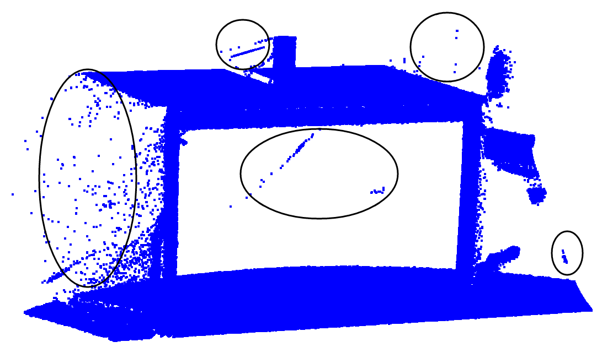

*Fig.4.9.15:   **table.pcd** and outliers*

For the complete code **radius.cpp** see in [Appendix —— Radius](# 4.9.4 ： Radius).

The following lines are the header files needed for Radius Filter:

```c++
// Input and output related header file in the standard C++ library
#include <iostream>   
// pcd reads and writes related header file in PCL
#include <pcl/io/pcd_io.h>  
// Point type header file supported in PCL
#include <pcl/point_types.h>
// Radius Filter header file
#include <pcl/filters/radius_outlier_removal.h>   
```

------


Next, create two point cloud objects "cloud" and "cloud_filtered". The former stores the original point cloud, the latter stores the filtered point cloud, and then loads **table.pcd** into "cloud":

```c++
pcl::PointCloud<pcl::PointXYZ>::Ptr cloud(new pcl::PointCloud<pcl::PointXYZ>);
pcl::PointCloud<pcl::PointXYZ>::Ptr cloud_filtered(new pcl::PointCloud<pcl::PointXYZ>);
pcl::io::loadPCDFile(".../table.pcd", *cloud);
```

------


The specific code implementation of Radius Filter is as follows: first create a RadiusOulierRemoval object "outrem", then input "cloud" into "outrem", set radius filtering parameters setRadiusSearch and setMinNeighborsInRadius*, perform filtering operation, and finally store the filtered point cloud in **table_RadiusOutlierRemoval.pcd**:

```c++
pcl::RadiusOutlierRemoval<pcl::PointXYZ> outrem;
// build the filter
outrem.setInputCloud(cloud);
outrem.setRadiusSearch(0.05);
outrem.setMinNeighborsInRadius(200);
// apply filter
outrem.filter(*cloud_filtered);	

pcl::io::savePCDFile(".../table_RadiusOutlierRemoval.pcd", *cloud_filtered);
```

*Parameters:

**setRadiusSearch**: Set the radius of neighbor search;

**setMinNeighborsInRadius**: Set the minimum number of points within the above radius. If the number of neighbors within the radius of a point is less than this value, then the point is judged to be an outlier.

------

Fig.4.9.16 is the view comparison before and after filtering: we can see that the right view is cleaner than the left view, and most of the outliers in the original point cloud on the left are removed.

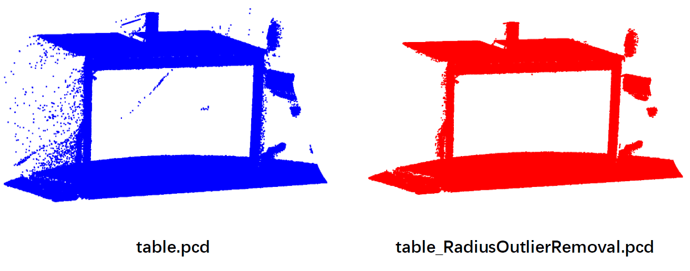

*Fig.4.9.16:   View comparison before and after filtering*


### 4-10 ：Segmentation

##### Background

This Section mainly introduces the related content of **segmentation**. Segmentation is related to classification, clustering, and detection. In many cases, their way of dealing with problems is very similar. For example, we need to detect objects in a scene and classify them, which is similar to the segmentation of objects. Let us focus on the segmentation below.

In 2D and 3D scenes, segmentation is crucial. It is a significant part of understanding images and scenes: a picture (identifying Person1-Person5 in Fig.4.1.1), or a 3D object (identifying Fig.4.10.2 parts of each object). It is easy for the human eye to understand what the contents of pictures and 3D objects are, and it is also easy to divide and recognize the things and parts contained in pictures or 3D objects. The computer is the same as the data we receive. However, the computer itself has no knowledge reserves and experience, so it cannot directly judge and understand the received data and process it. For it, a 2D picture is just a bunch of pixels. What we have to do is teach the computer to understand 2D and 3D scenes. Therefore, segmentation is usually understood as semantic segmentation, and many rules need to be written to realize this function of the computer.

*Fig.4.10.1:   2D Segmentation[^41]*


*Fig.4.10.2:   3D Segmentation[^42]*

The level of semantic in semantic segmentation can be different. As shown in Fig.4.10.2, different parts of each object are marked with corresponding colors to reflect the segmentation. From the figure's segmentation results, the semantic level of segmentation can be a component (the leftmost aircraft is divided into tail, engine, fuselage, and wing). Alternatively, it can be a plane (red in the car below the left is the roof, purple is the plane of the front of the car), etc.

Similar to the segmentation problem of 2D and 3D scenes, point cloud segmentation is both an important method and purpose for processing 3D point clouds. Since the point cloud data we obtain first-hand is usually just a bunch of data points without any meaningful semantic information, point cloud segmentation can classify and summarize the point cloud, give it semantics, and help understand the point cloud scene. Specifically, point cloud segmentation aims to divide point clouds into sub-categories semantically based on their spatial characteristics, and point clouds in the same category have similar characteristics. Commonly used segmentation methods are consistent segmentation based on RANSAC and cluster segmentation.

##### The application of segmentation

- In point cloud reconstruction, point cloud semantic cutting is the most critical step;
- The unmanned car's vision system will rely on the radar system to identify roadblocks and pedestrians when performing road recognition. In this process, a processing method similar to Detection or Segmentation will be used;
- Medical image segmentation can help doctors better diagnose diseases;
- In geological detection, the problem of land coverage in the area is often detected by semantic segmentation of satellite images[^43];
- In agriculture, weeds and crops in images can be segmented to determine the use of herbicides and other products [^43].


#### 4-10-1 ：Consistent segmentation based on RANSAC

##### Random Sample Consensus (RANSAC)

RANSAC is a probabilistic random sampling method. It is a fundamental algorithm in point cloud processing methods, mostly used to fit point clouds to planes, curved surfaces, and some simple geometric elements to achieve segmentation. It can estimate the mathematical model's parameters iteratively from a set of data containing outliers and iterate continuously to increase the probability of obtaining good results (reasonable model parameters).

Fig.4.10.3 are two simple examples: the first row in the figure is to fit a straight line, and the second row is to fit a parabola. Red is the result of least square fitting, and green is the result of RANSAC. By comparison, we can see that RANSAC is closer to the trend of most points, while the least square fitting will try to include all points, which is easily affected by outliers and deviates from the trend of the data points themselves. However, the result of RANSAC is not necessarily correct. Because it is a probabilistic algorithm, to make our fitting results more reasonable, we must increase the number of iterations and carefully set the algorithm parameters.

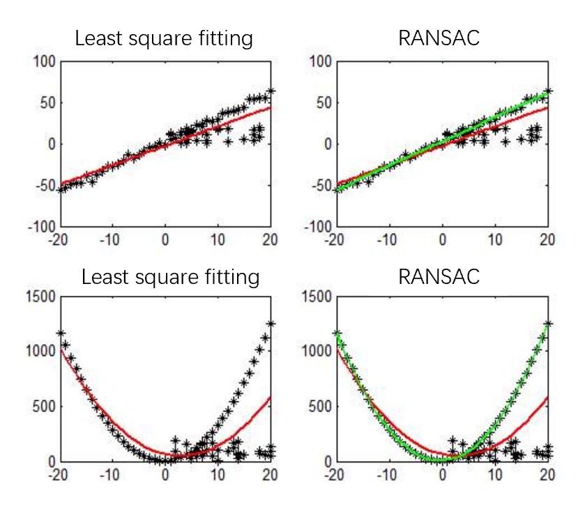

*Fig.4.10.3:   RANSAC and Least square fitting[^44]*

##### RANSAC steps[^45]:

step1: Randomly sample K points from all data points as inliers;

step2: Perform model fitting on K points selected in step1;

step3: Calculate the distance from the remaining points to the model fitted by step2, then set a threshold value. If the distance is less than the threshold value, it will be included in the inliers, expand the inliers, and then count the number of inliers. Points greater than the threshold are outliers;

step4: Repeat step 1 to 3 M times until the best model with the most inliers is found;

step5: Re-fit the inliers contained in the best model found in step 4.

The following takes a fitted straight line as an example for illustration, where step1 randomly selects K = 2 points as initial inliers, and steps2-5 correspond to the above steps:

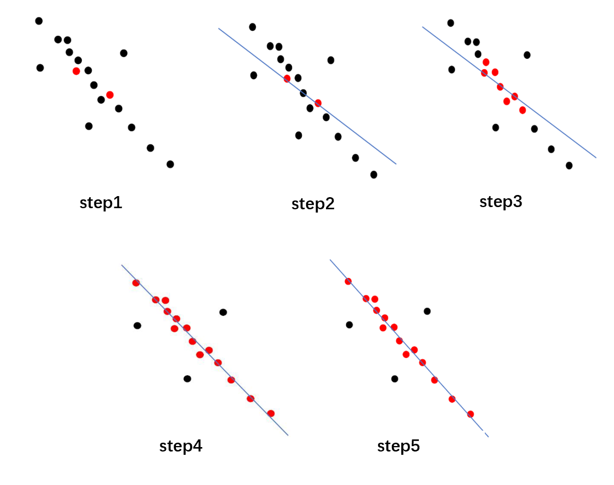

*Fig.4.10.4:   RANSAC steps*


##### Segmentation based on RANSAC

###### Example1: Plane model segmentation

We randomly create a point cloud, part of the point cloud is on a plane, and some points are outliers. The purpose of this example is to use RANSAC to extract the hidden plane from the point cloud and separate it from outliers. Fig.4.10.5 is a point cloud we randomly fabricated for plane extraction. The gray is the hidden plane "z = 1", The outliers artificially set for us in the red circle.

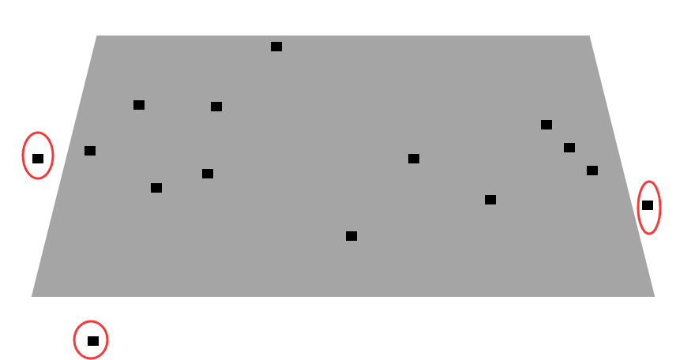

*Fig.4.10.5:   Point cloud created with random numbers*

For the complete code **extract_plane_ransac.cpp** see in [Appendix —— Plane segmentation based on RANSAC](# 4.10.1 ： Plane segmentation based on RANSAC).

The following lines are the header files required for the plane segmentation based on RANSAC:

```c++
// Input and output related header file in the standard C++ library
#include <iostream>   
// pcd reads and writes related header file in PCL
#include <pcl/io/pcd_io.h>  
// Point type header file supported in PCL
#include <pcl/point_types.h>
// sample method head file
#include <pcl/sample_consensus/method_types.h> 
// model type head file
#include <pcl/sample_consensus/model_types.h>  
// RANSAC head file
#include <pcl/segmentation/sac_segmentation.h> 
```

------


Next, create a point cloud object "cloud", use a random method and for loop to fill the x and y coordinate values, and then fix z = 1 so that the point cloud is on the "z = 1" plane:

```c++
pcl::PointCloud<pcl::PointXYZ> cloud;
// Fill in the cloud data
cloud.width = 15;
cloud.height = 1;
cloud.points.resize(cloud.width * cloud.height);
// Generate the data
for (size_t i = 0; i < cloud.points.size(); ++i)
{
	cloud.points[i].x = 1024 * rand() / (RAND_MAX + 1.0f);
	cloud.points[i].y = 1024 * rand() / (RAND_MAX + 1.0f);
	cloud.points[i].z = 1.0;   // which ensures point cloud is on "z = 1" plane
}
```

------


The following sets some outliers for the point cloud generated above to deviate from the "z = 1" plane, that is, points that are not on the z = 1 plane (the z coordinates of the points with index 0, 3, and 6 are set to 2.0, -2.0, 4.0, respectively). Then output the coordinates of each point in the cloud after the Z-axis has been processed for comparison with the subsequent segmented point cloud, and save the points in "cloud" in **random_sample.pcd**:

```c++
// Set a few outliers
cloud.points[0].z = 2.0;
cloud.points[3].z = -2.0;
cloud.points[6].z = 4.0;
std::cout << "Point cloud data: " << cloud.points.size() << " points" << std::endl;
for (size_t i = 0; i < cloud.points.size(); ++i)
	std::cout << "    " << cloud.points[i].x << " "
	<< cloud.points[i].y << " "
	<< cloud.points[i].z << std::endl;
pcl::io::savePCDFile(".../random_sample.pcd", cloud);
```

------


The following is the specific implementation part based on RANSAC: First, create the model coefficient object "coefficients" required for segmentation, then create the collection object "inliers" storing the index of inliers; create the segmentation object "seg". Perform related parameter settings*, use "cloud" as the input point cloud, execute the segmentation operation. Finally, store the divided inliers index results in "inliers", and store the plane model coefficients in "coefficients":

```c++
pcl::ModelCoefficients::Ptr coefficients(new pcl::ModelCoefficients);
pcl::PointIndices::Ptr inliers(new pcl::PointIndices);
// Create the segmentation object
pcl::SACSegmentation<pcl::PointXYZ> seg;
// Optional
seg.setOptimizeCoefficients(true);
// Mandatory
seg.setModelType(pcl::SACMODEL_PLANE);
seg.setMethodType(pcl::SAC_RANSAC);
seg.setDistanceThreshold(0.01);
seg.setInputCloud(cloud.makeShared());
seg.segment(*inliers, *coefficients);
```

*Parameters:

**setModelType**: The type of segmentation model, the plane model SACMODEL_PLANE is selected here.

> NB: When the point cloud composition is more complicated, for example, there are many noises in the point cloud, if we want to segment the plane model from the point cloud, we will use normal information so that SACMODEL_NORMAL_PLANE will be used;

**setMethodType**: Random parameter estimation method, here is the RANSAC;

**setDistanceThreshold**: Distance threshold. Data points are considered inliers if the distance estimation model (here z = 1 plane model) is less than the threshold. Otherwise, they are outliers.

------


The following is the output of the segmentation result. First, output the plane model coefficients, and then output the coordinate values of the inliers after segmentation:

```c++
std::cout << "Model coefficients: " << coefficients->values[0] << " "
	<< coefficients->values[1] << " "
	<< coefficients->values[2] << " "
	<< coefficients->values[3] << std::endl;

std::cout << "Model inliers: " << inliers->indices.size() << std::endl;
for (size_t i = 0; i < inliers->indices.size(); ++i)
	std::cout << inliers->indices[i] << "    " 
              << cloud.points[inliers->indices[i]].x << " " 
              << cloud.points[inliers->indices[i]].y << " "
              << cloud.points[inliers->indices[i]].z << std::endl;
```

------

The following is the running results:

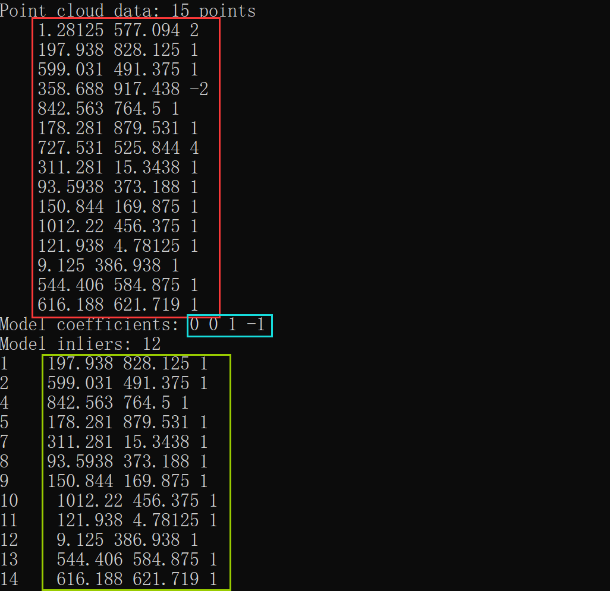

*Fig.4.10.6:   The result of running*

From Fig.4.10.6, we can see that the red box is the point cloud we want to segment, the "z" value of most of the points are 1, but a little points "z" are not 1. The green box is the divided inliers. It can be seen that their "z" values are all 1. That is, we successfully segmented the "z = 1" plane part of the original point cloud; the coefficients of the "z = 1" plane model in the blue box, 0, 0, 1, -1, The corresponding is: 
$$
0*x + 0*y + 1*z-1 = 0
$$
That is, z = 1.

Fig.4.10.7 is the schematic diagram before and after segmentation: the gray plane represents z = 1, and the red circles are outliers; the right side is the point cloud view after segmentation. It can be seen that all the remaining points are on the gray z = 1 plane.

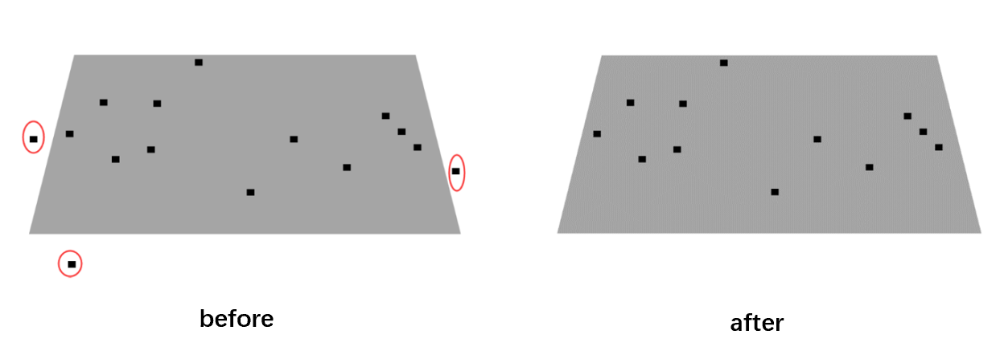

*Fig.4.10.7:   before and after segmentation*

###### Example 2: Cylinder model segmentation

Segment the cylinder model from the point cloud: first perform a series of pre-processing (filtering, etc.) on the original point cloud, and then extract the cylinder part in **table_scene_mug_stereo_textured.pcd**:


*Fig.4.10.8:   **table_scene_mug_stereo_textured.pcd***

For the complete code **extract_cylinder_ransac.cpp** see in [Appendix —— Cylinder segmentation based on RANSAC](# 4.10.1 ： Cylinder segmentation based on RANSAC).

The following lines are the header files required for segmentation of the cylinder model, as well as the namespace and renaming settings:

```c++
// pcd reads and writes related header file in PCL
#include <pcl/io/pcd_io.h>  
// Point type header file supported in PCL
#include <pcl/point_types.h>
// filter header file
#include <pcl/filters/extract_indices.h>  
// PassThrough header file
#include <pcl/filters/passthrough.h>      
// estimate normal header file
#include <pcl/features/normal_3d.h>       
// sample method header file
#include <pcl/sample_consensus/method_types.h>  
// model type header file
#include <pcl/sample_consensus/model_types.h>   
// RANSAC segmentation header file
#include <pcl/segmentation/sac_segmentation.h>  
// namespace
using namespace std;    
// use PointT to replace pcl::PointXYZ
typedef pcl::PointXYZ PointT;   
```

------


The following code creates functional objects: read point cloud object "reader", pass filter object "pass", normal estimation object "ne", perform RANSAC segmentation object "seg" from normal information, write point cloud object "writer", extract point cloud object "extract", extract point cloud normal object "extract_normals", and Kdtree search object "tree":

```c++
// All the objects needed
pcl::PCDReader reader;
pcl::PassThrough<PointT> pass;
pcl::NormalEstimation<PointT, pcl::Normal> ne;
pcl::SACSegmentationFromNormals<PointT, pcl::Normal> seg;
pcl::PCDWriter writer;
pcl::ExtractIndices<PointT> extract;
pcl::ExtractIndices<pcl::Normal> extract_normals;
pcl::search::KdTree<PointT>::Ptr tree(new pcl::search::KdTree<PointT>());
```

------


The following code creates the data objects needed for the code implementation: the original point cloud object "cloud", the point cloud "cloud_filtered" filtered by the PassThrough Filter, the point cloud "cloud_normals" that calculates the normal, the point cloud "cloud_filtered2" after removing the plane, the point cloud "cloud_normals2" after the "cloud_filtered" normal is calculated, Plane model coefficients object "coefficients_plane", cylindrical model coefficients object "coefficients_cylinder", plane model inner points object "inliers_plane", cylindrical model inner points object "inliers_cylinder":

```c++
// Datasets
pcl::PointCloud<PointT>::Ptr cloud(new pcl::PointCloud<PointT>);
pcl::PointCloud<PointT>::Ptr cloud_filtered(new pcl::PointCloud<PointT>);
pcl::PointCloud<pcl::Normal>::Ptr cloud_normals(new pcl::PointCloud<pcl::Normal>);
pcl::PointCloud<PointT>::Ptr cloud_filtered2(new pcl::PointCloud<PointT>);
pcl::PointCloud<pcl::Normal>::Ptr cloud_normals2(new pcl::PointCloud<pcl::Normal>);
pcl::ModelCoefficients::Ptr coefficients_plane(new pcl::ModelCoefficients), coefficients_cylinder(new pcl::ModelCoefficients);
pcl::PointIndices::Ptr inliers_plane(new pcl::PointIndices), inliers_cylinder(new pcl::PointIndices);
```

------


The following line is to read **table_scene_mug_stereo_textured.pcd** to the cloud using the reader point cloud object "reader", and output the point information:

```c++
// Read in the cloud data
reader.read(".../table_scene_mug_stereo_textured.pcd", *cloud);
cout << "PointCloud has: " << cloud->points.size() << " data points." << endl;
```

------


The following is to filter the Z-axis using a PassThrough Filter (see in Section 4-9-1): set cloud as the input point cloud of the PassThrough Filter pass, set the filter axis to the Z-axis, then set the filter range from 0 to 1.5, perform filtering. Finally, output the number of filtered point cloud:

```c++
// Build a passthrough filter to remove spurious NaNs
pass.setInputCloud(cloud);
pass.setFilterFieldName("z");
pass.setFilterLimits(0, 1.5);
pass.filter(*cloud_filtered);
cout << "PointCloud after filtering has: " << cloud_filtered->points.size() << " data points." << endl;
```

------


The following is to filter the Z-axis using a PassThrough Filter (see in Section 4-9-1):

- Set cloud as the input point cloud of the PassThrough Filter pass, set the filter axis to the Z-axis.
- Set the filter range from 0 to 1.5.
- Perform filtering.
- Finally, output the number of filtered point cloud:

```c++
// Estimate point normals
ne.setSearchMethod(tree);
ne.setInputCloud(cloud_filtered);
ne.setKSearch(50);
ne.compute(*cloud_normals);
```

------


The following code is to segment the plane model: First, set the parameters*, and then use the "cloud_filtered" as the input point cloud of the segmentation object "seg", and use the estimated normal point cloud "cloud_normals" as the input normal information of the segmentation object "seg":

```c++
// Create the segmentation object for the planar model and set all the parameters
seg.setOptimizeCoefficients(true);
seg.setModelType(pcl::SACMODEL_NORMAL_PLANE);
seg.setNormalDistanceWeight(0.1);
seg.setMethodType(pcl::SAC_RANSAC);
seg.setMaxIterations(100);
seg.setDistanceThreshold(0.03);
seg.setInputCloud(cloud_filtered);
seg.setInputNormals(cloud_normals);
```

*Parameters:

**setOptimizeCoefficients**: Whether to optimize the estimated model coefficients, true means to optimize, false means not to optimize;

**setModelType**: Set the segmentation model. The model used here is SACMODEL_NORMAL_PLANE, which is a plane model. In Example 1, SACMODEL_PLANE is used for plane model segmentation. Here the point cloud structure is more complicated, so we choose the normal-based segmentation method SACMODEL_NORMAL_PLANE; 

**setNormalDistanceWeight**: Set the weight coefficient of the surface normal;

**setMethodType**: Set the model segmentation method. Here is the RANSAC;

**setMaxIterations**: Set the maximum number of iterations;

**setDistanceThreshold**: Set the maximum allowable distance between the inliers and the model. If it is greater than this threshold, it will be outliers.

------


The following code obtains the coefficients of the plane model and the inliers on the plane according to the parameters set by the code above and then outputs the plane coefficients:

```c++
// Obtain the plane inliers and coefficients
seg.segment(*inliers_plane, *coefficients_plane);
std::cout << "Plane coefficients: " << *coefficients_plane << std::endl;
```

------


The following code extracts the plane: create a point cloud object "cloud_plane" to store the plane points. Set the input point cloud as "cloud_filtered" filtered by the PassThrough Filter, set the segmented interior points as the point set to be extracted, and set the extraction interior points and non-external points. Finally, execute extraction:

```c++
// Extract the planar inliers from the input cloud
pcl::PointCloud<PointT>::Ptr cloud_plane(new pcl::PointCloud<PointT>());
extract.setInputCloud(cloud_filtered);
extract.setIndices(inliers_plane);
extract.setNegative(false);
extract.filter(*cloud_plane);
```

------


The following code stores the point on the split plane to point cloud file, outputs the number of points in "cloud_plane", and writes the split plane points into **table_scene_mug_stereo_textured_plane.pcd**:

```c++
// Write the planar inliers to disk
cout << "PointCloud representing the planar component: " << cloud_plane->points.size() << " data points." << endl;
writer.write(".../table_scene_mug_stereo_textured_plane.pcd", *cloud_plane, false);	
```

------


The following code removes the planar part and extracts the remaining part:

```c++
// Remove the planar inliers, extract the rest
extract.setNegative(true);		  // Set to extract outliers
extract.filter(*cloud_filtered2); // Extract output and store to cloud_filtered2
extract_normals.setNegative(true);
extract_normals.setInputCloud(cloud_normals);
extract_normals.setIndices(inliers_plane);
extract_normals.filter(*cloud_normals2);
```

------


The following code is the main implementation code for extracting the cylinder part, and the parameter settings are shown in the code comments:

```c++
// Create the segmentation object for cylinder segmentation and set parameters
// Set the estimated model coefficients to be optimized
seg.setOptimizeCoefficients(true);       
// Set the segmentation model to cylinder
seg.setModelType(pcl::SACMODEL_CYLINDER); 
// Set the parameter estimation method to RANSAC
seg.setMethodType(pcl::SAC_RANSAC);       
// Set surface normal weight coefficient
seg.setNormalDistanceWeight(0.1);         
// Set the maximum number of iterations is 10,000
seg.setMaxIterations(10000);              
// Set the maximum allowable distance from the interior point to the model
seg.setDistanceThreshold(0.05);           
// Set the estimated radius range of the cylindrical model
seg.setRadiusLimits(0, 0.1);              
// Set the point cloud to be segmented out of the cylinder to cloud_filtered2
seg.setInputCloud(cloud_filtered2);       
// Set the input normal information to cloud_normals2
seg.setInputNormals(cloud_normals2);      
```

------


The following code obtains the segmented cylinder part and cylinder model coefficients and outputs the cylinder model coefficients:

```c++
// Obtain the cylinder inliers and coefficients
seg.segment(*inliers_cylinder, *coefficients_cylinder);
cout << "Cylinder coefficients: " << *coefficients_cylinder << endl;
```

------


Store the cylinder part in **table_scene_mug_stereo_textured_cylinder.pcd**, and output the points of the cylinder model:

```c++
// Write the cylinder inliers to disk
extract.setInputCloud(cloud_filtered2);
extract.setIndices(inliers_cylinder);
extract.setNegative(false);
pcl::PointCloud<PointT>::Ptr cloud_cylinder(new pcl::PointCloud<PointT>());
extract.filter(*cloud_cylinder);
cout << "PointCloud representing the cylindrical component: " << cloud_cylinder->points.size() << " data points." << endl;
writer.write(".../table_scene_mug_stereo_textured_cylinder.pcd", *cloud_cylinder, false);
```

------

The following is the running result:


*Fig.4.10.9:   The result of running*

As shown in Fig.4.10.9: The number of points in the original point cloud is 307,200, while the number of points in the filtered point cloud is 139,897. The number of points in the segmented plane is 116,300, and the number of points in cylinder model is 11,462. There are also the coefficients of the plane model and cylinder model in the running result:

For the plane model, the result is: 
$$
0.0161902*x - 0.837667*y - 0.545941*z + 0.528862 = 0
$$
For the cylinder model, the meanings of coefficients values from 0 to 6 are as follows: values[0], values[1], and values[2] represent the coordinates of any point on the central axis of the cylinder. values[3], values[4], and values[5] represent the direction vector of the central axis of the cylinder. values[6] represents the radius of the cylinder.

The following Fig.4.10.10 draws a virtual schematic diagram before and after the segmentation for easy understanding: (a) represents the original point cloud, (b) represents the process of PassThrough filtering, remove the gray part that is not within the set Z-axis range, and keep the left side — the blue plane and yellow cup, (c) represents the filtered result of the PassThrough Filter, (d) represents the extracted plane part, and (e) represents the final extracted cylinder part.


*Fig.4.10.10:   Before and after segmentation (virtual)*

The following Fig.4.10.11 is the comparison view before and after the actual point cloud segmentation: Due to the complicated structure of the original point cloud, the final cylinder is not as perfect as the virtual schematic diagram. However, the actual point cloud processing and final purpose are consistent with the schematic diagram in Fig.4.10.10.

The process is as follows: First, filter out the gray part on the right side of the original point cloud **table_scene_mug_stereo_textured.pcd** through a PassThrough Filter, and divide the remaining table and cup into plane and cylinder to obtain the plane part **table_scene_mug_stereo_textured_plane.pcd** and the final extraction target — the cylinder part **table_scene_mug_stereo_textured_cylinder.pcd**.

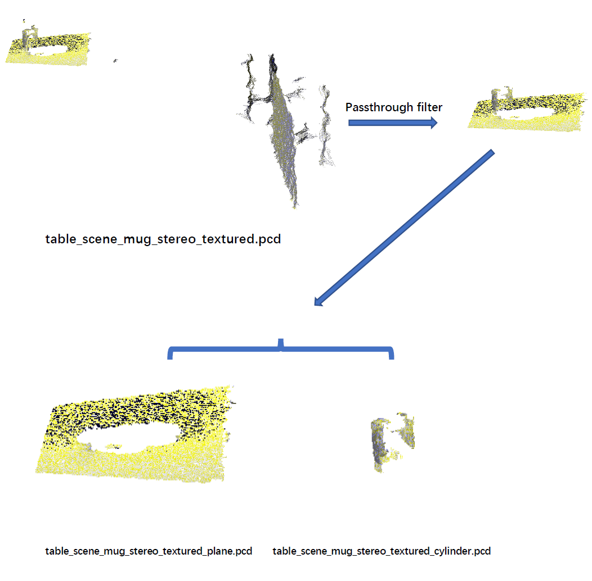

*Fig.4.10.11:   Before and after segmentation (actual)*


#### 4-10-2 ：Clustering segmentation

##### The concept of clustering segmentation

Clustering segmentation is to segment point cloud by clustering. 

Clustering segmentation is to segment the point cloud by clustering. Common clustering methods include K-Means, maximum likelihood, fuzzy clustering, and Euclidean clustering. Among them, K-Means will be explained in detail in Chapter5.

##### The principle of clustering segmentation

Inspect m data points, define some clustering between points in m-dimensional space. Suppose that m data points form n classes, combining the two classes with the smallest distance into one class. Recalculate the distance between the classes, and iterate until the distance between any two classes is greater than the specified threshold, or the number of the class is less than the specified number, and the partition is completed [^22].

Here we are using Euclidean clustering, which is clustering based on Euclidean distance (the straight-line distance between two points). Points whose distance reaches a certain threshold are clustered into one category. Otherwise, they are of different categories.

##### Example

Take **table.pcd** as an example. Firstly, the point cloud is filtered through VoxelGrid to achieve the down-sampling effect, reduce the number of point clouds, and improve the accuracy. Then use the RANSAC to extract the plane part and then separate the remaining part.

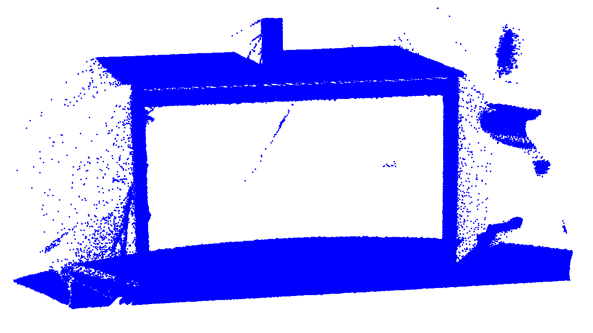

*Fig.4.10.12:   **table.pcd***

For the complete code **clustering_segmentation.cpp** see in [Appendix —— Clustering segmentation](# 4.10.2 ： Clustering segmentation).

The following are the header files needed for the Euclidean clustering segmentation of the point cloud. 

> NB: RANSAC-based segmentation will also be used:

```c++
// pcd reads and writes related header file in PCL
#include <pcl/io/pcd_io.h>  
// Point type header file supported in PCL
#include <pcl/point_types.h>
// filter header file
#include <pcl/filters/extract_indices.h>       
// VoxelGrid header file
#include <pcl/filters/voxel_grid.h>           
// normal estimation header file
#include <pcl/features/normal_3d.h>           
// kdtree header file
#include <pcl/kdtree/kdtree.h>                
// sample method header file
#include <pcl/sample_consensus/method_types.h> 
// sample model header file
#include <pcl/sample_consensus/model_types.h>  
// RANSAC segmentation header file
#include <pcl/segmentation/sac_segmentation.h> 
// Euclidean clustering segmentation header file
#include <pcl/segmentation/extract_clusters.h> 
```

------


The following code first creates the point cloud reading object "reader", then creates three point cloud objects: "cloud" (original point cloud), "add_cloud", "cloud_f" (the intermediate output result point cloud for subsequent segmentation), loads the content of **table.pcd** into "cloud", and finally output the number of points in "cloud", that is, the number of points in point cloud before filtering:

```c++
pcl::PCDReader reader;
pcl::PointCloud<pcl::PointXYZ>::Ptr add_cloud(new pcl::PointCloud<pcl::PointXYZ>);
pcl::PointCloud<pcl::PointXYZ>::Ptr cloud(new pcl::PointCloud<pcl::PointXYZ>), cloud_f(new pcl::PointCloud<pcl::PointXYZ>);
reader.read(".../table.pcd", *cloud);
std::cout << "PointCloud before filtering has: " << cloud->points.size() << " data points." << std::endl; 
```

------


The following is the use of VoxelGrid for downsampling: First, create a VoxelGrid object "vg", then create a point cloud object "cloud_filtered" to store the filtered point cloud, use "cloud" as the input point cloud of "vg", set the voxel side length in VoxelGrid to 0.01m, execute Filter. Finally, output the filtered point cloud points:

```c++
pcl::VoxelGrid<pcl::PointXYZ> vg;
pcl::PointCloud<pcl::PointXYZ>::Ptr cloud_filtered(new pcl::PointCloud<pcl::PointXYZ>);
vg.setInputCloud(cloud);
vg.setLeafSize(0.01f, 0.01f, 0.01f);
vg.filter(*cloud_filtered);
std::cout << "PointCloud after filtering has: " << cloud_filtered->points.size() << " data points." << std::endl; 
```

------


The following is the specific code implementation of segmenting the plane model from the point cloud as a whole, extracting the plane model from the point cloud (refer to Section 4-10-1 Example 1): First, create the RANSAC segmentation object "seg". Then create the cluster index object "inliers", create the plane model coefficients object "coefficients", create the point cloud object "cloud_plane" to store the extracted plane model part. After creating the plane model segmentation object, set the parameters*:

```c++
// create plane model segmentation object
pcl::SACSegmentation<pcl::PointXYZ> seg;
// set the inner point index of the cluster
pcl::PointIndices::Ptr inliers(new pcl::PointIndices); 
// the coefficients of plane model
pcl::ModelCoefficients::Ptr coefficients(new pcl::ModelCoefficients);
pcl::PointCloud<pcl::PointXYZ>::Ptr cloud_plane(new pcl::PointCloud<pcl::PointXYZ>());
// set parameters
pcl::PCDWriter writer;
seg.setOptimizeCoefficients(true);
// segmentation model
seg.setModelType(pcl::SACMODEL_PLANE);    
// RANSAC
seg.setMethodType(pcl::SAC_RANSAC);       
// the maximum number of iterations
seg.setMaxIterations(100);               
// set threshold
seg.setDistanceThreshold(0.02);           
```

*Parameters:

- **setOptimizeCoefficients** is true, that is, optimize the coefficients;
- **setModelType** sets the segmentation model is the plane model "SACMODEL_PLANE";
- **setMethodType** sets the random parameter estimation method to "RANSAC";
- **setMaxIterations** sets the maximum number of iterations to 100;
- **setDistanceThreshold **sets the threshold for judging whether it is an inlier to 0.02m.

------


The following uses a "while" loop to output the plane parts of the filtered point cloud one by one: the judgment condition in while means that if the number of points identified in the plane model part is greater than 0.3 times the number of points in cloud_filtered that were only filtered by VoxelGrid initially. Then the loop continues. Otherwise, it is deemed not to belong to the plane model. Inside the loop, the largest plane model is first segmented from the current cloud_filtered, and the inliers and plane model coefficients are obtained, the plane model is obtained, and the number of points it contains will be output:

```c++
int i = 0, nr_points = (int)cloud_filtered->points.size(); // after VoxelGrid filtering
while (cloud_filtered->points.size() > 0.3 * nr_points)
{
	// Segment the largest plane component from the remaining point cloud
	seg.setInputCloud(cloud_filtered);
	seg.segment(*inliers, *coefficients);

	// Extract the intliers of the plane model from the input point cloud
	pcl::ExtractIndices<pcl::PointXYZ> extract;
	extract.setInputCloud(cloud_filtered);
    // Extract the index of the inner points and store them
	extract.setIndices(inliers);        
	extract.setNegative(false);
    
	// Obtain the point cloud data associated with the plane surface
	extract.filter(*cloud_plane);
	std::cout << "PointCloud representing the planar component: " << cloud_plane->points.size() << " data points." << std::endl;
```

------


The following code splits the plane model extracted earlier, then loads the remaining point cloud to "cloud_filtered" (note: cloud_filtered here is different from the cloud_filtered that has just been filtered by VoxelGrid at the beginning, and the first plane model is already extracted). Then output and save the extracted plane model **table_cloud_plane_i.pcd** (i is the plane index), and terminate the loop until the while judgment condition is not satisfied. In this example, we have looped through two planes (which will be marked in the result view). The cloud_filtered after this part of the code is the remaining point cloud after removing all planes:

```c++
// Remove the points inside the plane and extract the remaining point cloud
extract.setNegative(true);
extract.filter(*cloud_f);
*cloud_filtered = *cloud_f;

std::stringstream ss1;
ss1 << ".../table_cloud_plane_" << i << ".pcd";
writer.write<pcl::PointXYZ>(ss1.str(), *cloud_plane, false); 
i++;
}
```

------


The following code is the specific code implementation of Euclidean clustering segmentation for the remaining point cloud after removing the plane. First, create the Kdtree nearest neighbor search object "tree", use the remaining point cloud "cloud_filtered" after removing all the planes (note that it is different from the initial cloud_filtered) as the input point cloud for search. Create the index object "cluster_indices", create the Euclidean cluster object "ec", then set the parameters*. Execute the Euclidean clustering segmentation and extract the segmented part, and save the point cloud index in "cluster_indices":

```c++
// create kdtree object "tree"
pcl::search::KdTree<pcl::PointXYZ>::Ptr tree(new pcl::search::KdTree<pcl::PointXYZ>);
tree->setInputCloud(cloud_filtered);
std::vector<pcl::PointIndices> cluster_indices;
pcl::EuclideanClusterExtraction<pcl::PointXYZ> ec;   // Euclidean clustering object
ec.setClusterTolerance(0.02); 
ec.setMinClusterSize(100);    
ec.setMaxClusterSize(25000);  
ec.setSearchMethod(tree);     // Set the point cloud search mechanism
ec.setInputCloud(cloud_filtered);
// Extract clusters from the point cloud and save the point cloud index in "cluster_indices"
ec.extract(cluster_indices);  
```

*Parameters:

**setClusterTolerance**:  The maximum distance between points in a cluster;

**setMinClusterSize**: The minimum number of points for a cluster;

**setMaxClusterSize**: The maximum number of points for a cluster.

------


The following code loops cluster_indices through a for loop to output and save the results of Euclidean clustering segmentation in order from the beginning of the index to the end of the index. At the same time, each cluster's points are output, and each cluster is saved in **table_cloud_cluster_j.pcd** (j is the index of each cluster after splitting). Merge these clusters to get **table_add_cloud.pcd**:

```c++
// iterative access point cloud index "cluster_indices"
int j = 0;
for (std::vector<pcl::PointIndices>::const_iterator it = cluster_indices.begin(); it != cluster_indices.end(); ++it)
{ // iterate the point cloud index in the container and save the indexed point cloud separately
	pcl::PointCloud<pcl::PointXYZ>::Ptr cloud_cluster(new pcl::PointCloud<pcl::PointXYZ>);
	for (std::vector<int>::const_iterator pit = it->indices.begin(); pit != it->indices.end(); ++pit)
		// Set the attribute of saving point cloud
		cloud_cluster->points.push_back(cloud_filtered->points[*pit]); 
	cloud_cluster->width = cloud_cluster->points.size();
	cloud_cluster->height = 1;
	cloud_cluster->is_dense = true;
	std::cout << "PointCloud representing the Cluster: " << cloud_cluster->points.size() << " data points." << std::endl;
	std::stringstream ss2;
	ss2 << ".../table_cloud_cluster_" << j << ".pcd";
	writer.write<pcl::PointXYZ>(ss2.str(), *cloud_cluster, false); 
	j++;
	*add_cloud += *cloud_cluster;
	pcl::io::savePCDFileASCII(".../table_add_cloud.pcd", *add_cloud);
}
```

------

The following is the running result:

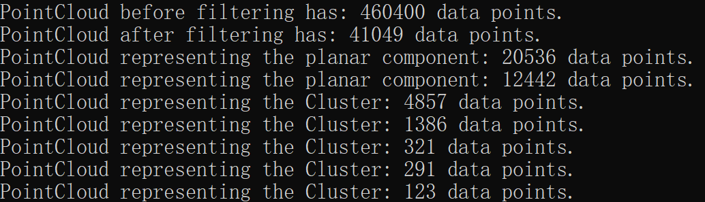

*Fig.4.10.13:   The result of running*

From Fig.4.10.13, the information we can obtain is as follows:

1. The number of points before filtering by VoxelGrid (or original point cloud) is 460,400;
2. After filtering with VoxelGrid, the number of points is 41,049;
3. The number of the first plane points extracted is 20,536;
4. The number of the second plane points extracted is 12,442;
5. After removing the plane, the five cluster points obtained by Euclidean clustering segmentation are 4,857, 1,386, 321, 291, and 123, respectively.

Fig.4.10.14 shows the division situation intuitively:


*Fig.4.10.14:   The view of Euclidean clustering segmentation*

From the above figure, we can see

1. (a) represents the original point cloud,
2. (b) represents the point cloud filtered by VoxelGrid,
3. (c) represents the two plane parts divided by RANSAC (yellow and pink are each plane),
4. (d) represents the result of using Euclidean clustering to segment the remaining part after removing the plane part.

There are five colors in the figure, divided into five clusters (different colors represent different clusters). It can be seen that the role of Euclidean clustering segmentation is mainly to gather points that are closer together into one cluster. 


### 4-11：Surface Reconstruction

Surface reconstruction is an important technology for point cloud processing. The main idea is to upgrade the point cloud from data points to surfaces (including planes and curved surfaces) through a reconstruction process. Surface reconstruction aims to make the reconstructed surface fit the original point cloud and approximate the original point cloud's geometry as much as possible.

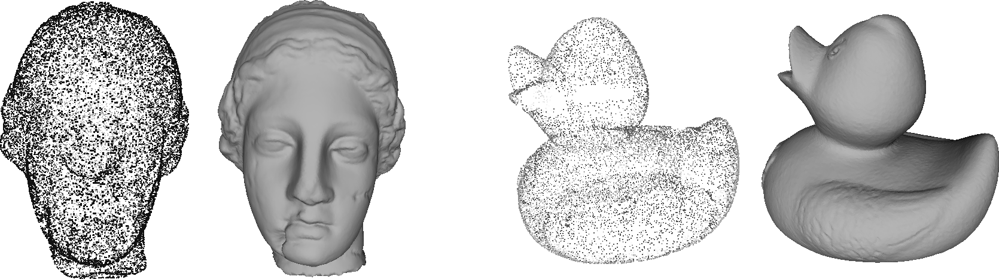

*Fig.4.11.1:   Surface reconstruction[^46]*

As shown in Fig.4.11.1: The two images on the left are schematic diagrams of the point cloud and surface reconstruction of the portrait. The two images on the right are schematic diagrams of the point cloud and the little duck's surface reconstruction. It can be seen that the point cloud diagrams are all discrete points, and the result of surface reconstruction outlines the surface shape of the represented geometry.


#### 4-11-1：Concept and algorithm

This section first introduces some concepts and existing algorithms for surface reconstruction included in PCL. The concepts we mentioned include the Voronoi diagram and the algorithms introduced include Ear Clipping Triangulation, Greedy Projection Triangulation, Marching Cubes Algorithm, and Poisson Surface Reconstruction.

##### The concept of surface reconstruction

**Voronoi:** The continuous polygon formed by the vertical line connecting the adjacent points, which is a basic data structure for space division [^47], and is a structure often used in the surface reconstruction process.

As shown in Fig.4.11.2: X1-X15 are 15 points, choose X5 and X6 in the black circle as examples, where red is the line between adjacent points, and blue is  the perpendicular bisector of the connection between adjacent points:

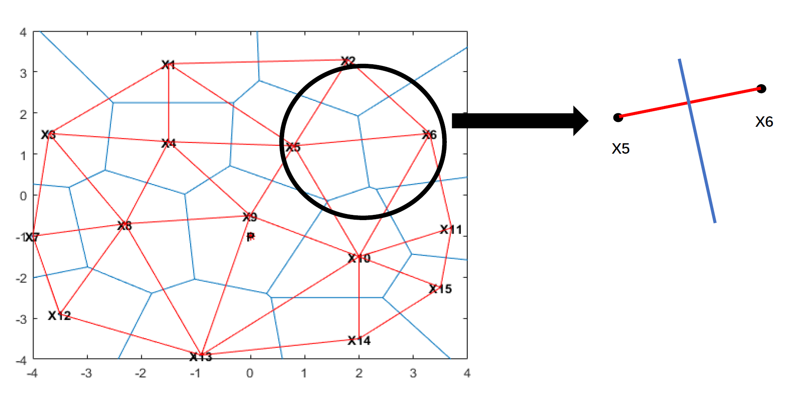

*Fig.4.11.2:   Voronoi 1[^48]*

Other adjacent points are also connected according to this rule to find the perpendicular bisector, and finally, the perpendicular bisector connecting all the adjacent points is obtained and connected. The final blue part is the Voronoi diagram (Fig.4.11.3).


*Fig.4.11.3:   Voronoi 2*

##### The algorithms of surface reconstruction

Below we introduce four common surface reconstruction algorithms:

1. Ear Clipping triangulation;

2. Greedy Projection Triangulation;

3. Marching Cubes Algorithm;

4. Poisson Surface Reconstruction;

   

###### 1. Ear Clipping triangulation

Fig.4.11.4 is a schematic diagram of the Ear Clipping triangulation algorithm process. The triangulation algorithm is an algorithm to get some triangles from the point cloud. It is called Ear Clipping triangulation because the process of triangulation is like dividing the "ear" continuously:

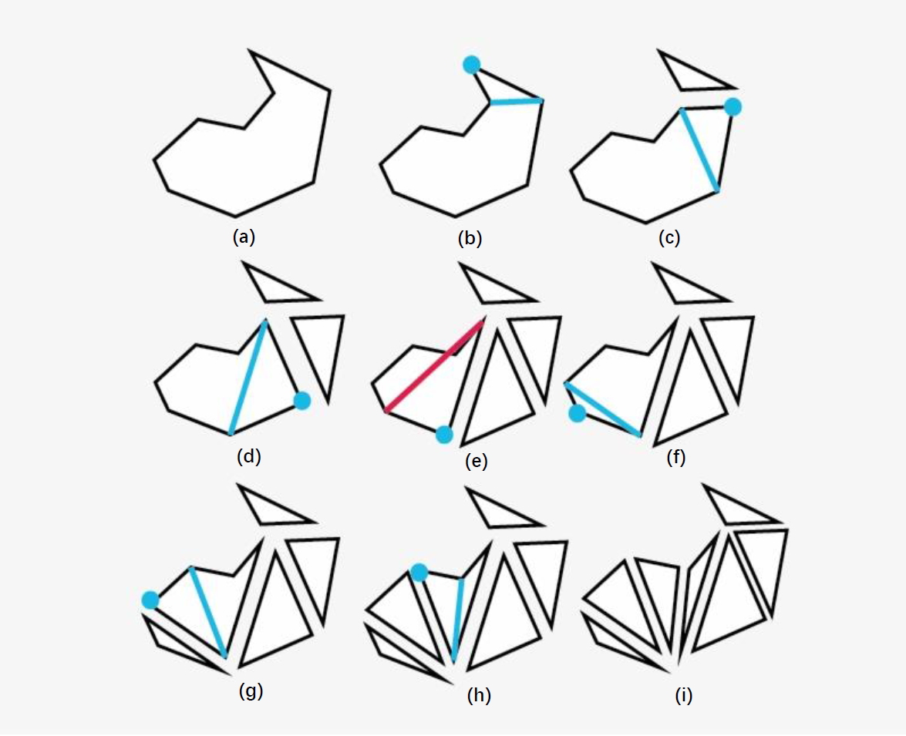

*Fig.4.11.4:   Ear Clipping triangulation[^49]*

The specific process of triangulation is as follows:

**(a)**: Initial state;

**(b)**: Select a vertex of the polygon and its two adjacent points to form a triangle. It can be seen that the selected point is marked blue, and the triangle formed by its adjacent points is marked blue, too;

**(c)**: It shows that the triangle (an ear) we marked in (b) has been removed;

**(d) - (h)**: Continue to remove the remaining polygons according to this rule and repeat the operation;

**(i)**: Until the end, there are only three vertices left, and the final triangle is the result of Ear Clipping triangulation.


###### 2. Greedy Projection Triangulation

Greedy Projection Triangulation is also a surface reconstruction algorithm (Fig.4.11.5):


*Fig.4.11.5:   Greedy Projection Triangulation[^50]*

The specific process of greedy projection triangulation is as follows:

**(a)**: Initial state;

**(b)**: Project all point clouds on a plane;

**(c)**: According to the Delaunay (mathematician of the former Soviet Union) space area growth algorithm, the projection points are triangulated on the plane;

**(d)**: According to the connection relationship between each projection point, the topological structure is reconstructed.


###### 3. Marching Cubes Algorithm

Marching Cubes Algorithm is an algorithm for surface reconstruction based on **isosurfaces**. 

The isosurface (Fig.4.11.6) is a curved surface in space. On this surface, the function $F(x,y,z)$ is a fixed value. That is, the function value is equal on this surface, so it is called equal-value surface — isosurface. As shown in Fig.4.11.6: $K_L$ is what we call the function $F(x,y,z)$. In the figure, five isosurfaces are drawn with different colors: $K_L = 0.5$, $K_L = 1.0$, $K_L = 1.5$, $K_L = 2.0$, and $K_L = 2.5$.

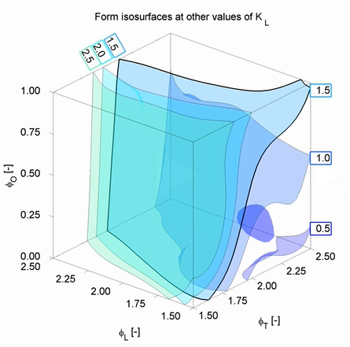

*Fig.4.11.6:   Isosurfaces[^51]*

The idea of Marching cubes algorithm

**(a)**: First, divide the area where the point cloud is located with neat small cubes (the side length of the cube is a parameter that can be set), as shown in Fig.4.11.7;

**(b)**: Find all the small cubes (These small cubes are also called voxels, as mentioned in Section 4-8-4) that intersect (Intersection means that some vertices of the small cube are in the isosurface and some vertices are outside the isosurface) the isosurface (At this time, the isosurface does not exist intuitively, here we only have the function $F(x,y, z)$ as the judgment function);

**(c)**: Calculate the intersection of the isosurface and the small cube as the equivalence point, and connect the triangles or polygons between the equivalence points according to the division method in Fig.4.11.9 to obtain the isosurface. 

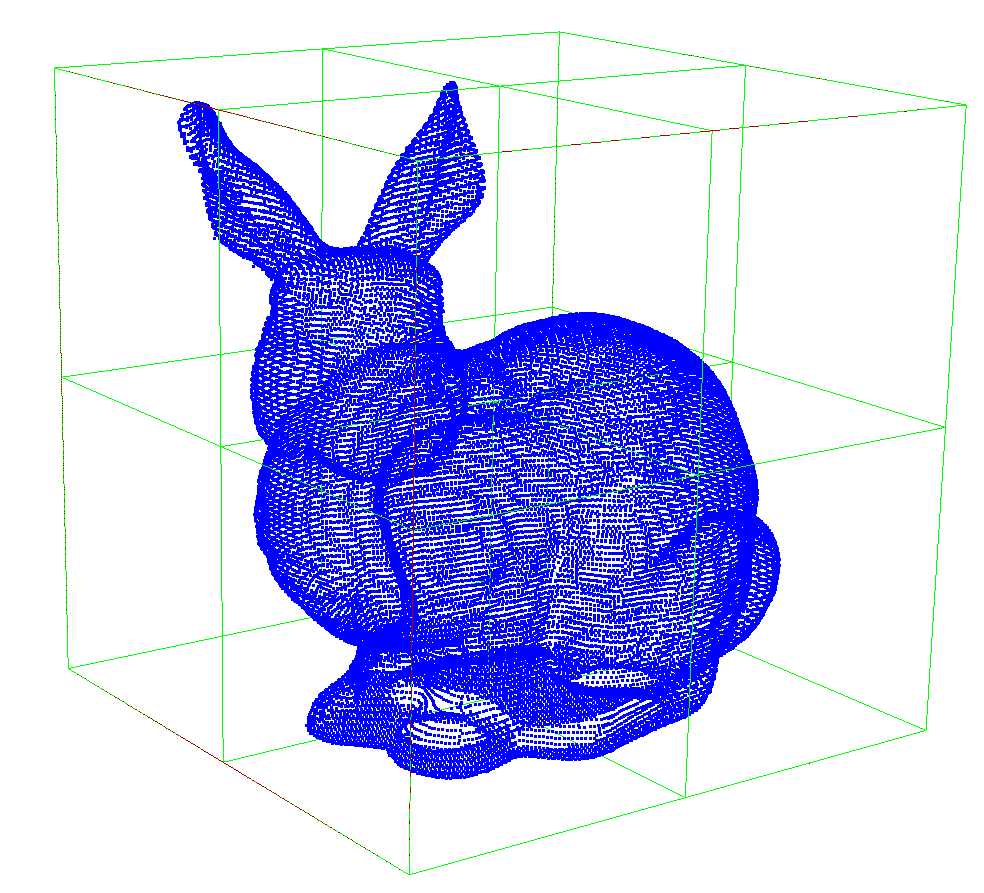

*Fig.4.11.7:   Spatial division*

Among them, the relationship between each point and the isosurface is as follows (the surface in Fig.4.11.8 is $F(x,y,z) = H$):

Situation 1: If the function value of the vertex is greater than the isosurface function value, it is defined that the vertex is in the isosurface (blue points in Fig.4.11.8);

Situation 2:  If the function value of the vertex is less than the isosurface function value, it is defined that the vertex is out of the isosurface (red points in Fig.4.11.8);

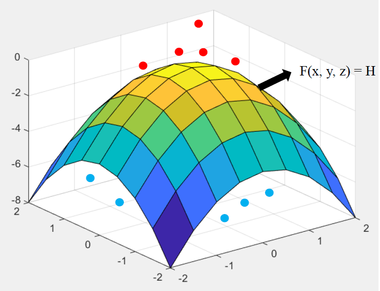

*Fig.4.11.8:   Points on both sides of the isosurface*

In view of the above two situations, we will analyze the possible situation of each vertex of each small cube after the point cloud is neatly divided into small cubes (in the isosurface or outside the isosurface): Each small cube has eight vertices, and each vertex has two possible results (in the isosurface or out the isosurface), so there are $2^8 = 256$ possible combinations. Due to the symmetry of the cube itself, the 256 situations can be summarized into 15 kinds, as shown in Fig.4.11.9:

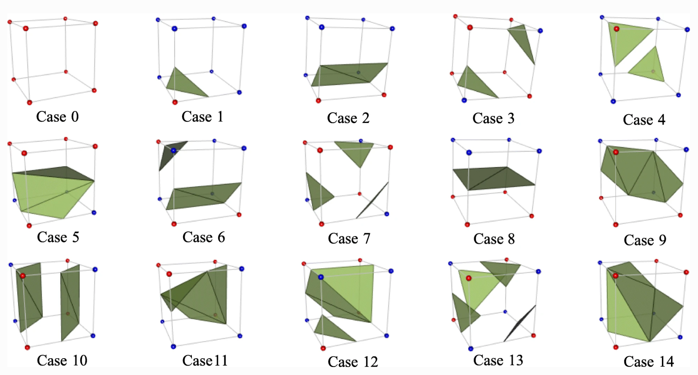

*Fig.4.11.9:   Marching cubes algorithm[^52]*

In Fig.4.11.9:

- The red point is the out-of-isosurface point (its value is less than the isosurface).
- The blue point is the in-isosurface point (its value is greater than the isosurface).
- The green surface is the isosurface drawn according to whether each vertex is inside or outside the isosurface.


###### 4. Poisson Surface Reconstruction

Poisson Surface Reconstruction is a triangular mesh reconstruction algorithm based on implicit functions. This type of method obtains an approximate surface through optimized interpolation of point cloud[^22]. The algorithm is briefly mentioned here without a detailed explanation.

- The input data of Poisson Surface Reconstruction is a point cloud containing normal information, assuming that all points are located on or near the surface of an unknown model (set to M). The algorithm's goal is to estimate the model's indicator function, extract the isosurface, and then use the marching cubes algorithm to complete the surface reconstruction based on the indicator function and isosurface. The final output is the surface model data[^22], as shown on the right in Fig.4.11.10:


*Fig.4.11.10:   Poisson surface reconstruction[^53]*


#### 4-11-2：Smooth resampling of point cloud based on Moving Least Squares

Sometimes the original point cloud cannot be directly used for surface reconstruction. In the following two situations, we need to pre-process the original point cloud first:

##### Situation 1

The point cloud sometimes has local noise or outlier (as shown in Fig.4.11.11 (a)), which will cause the reconstructed surface to contain holes or not smooth. We want to smooth the point cloud, also called smooth resampling. The commonly used method of point cloud smoothing is moving least squares (MLS).

> NB: To execute curve or surface fitting in a discrete point cloud, we cannot simply connect these points directly. If we know the specific form of the curve and surface, such as a quadratic curve, we can use the least square method to estimate the parameters, but if the form of the surface is unknown (in most cases, it is unknown), at this time moving least squares (MLS) can be used. The mathematical representation of the algorithm involves many mathematical concepts.

As shown in Fig.4.11.11: (a) is a cup point cloud we collected. The part inside the red circle in the figure is noise. (b) is the result obtained after point cloud smoothing. It can be seen that the surface of (b) is smoother than (a), and the noise points in the red circle are basically removed.


*Fig.4.11.11:   Comparison of point cloud before and after smoothing[^54]*


##### Situation 2

The point clouds of all complete objects are obtained by registration unless there is only one scan. The result of point cloud registration is not ideal, the overlap between scans is not entirely overlapped, and double walls (double wall/double shadow phenomenon) are likely to appear. There is initially only one surface. After registration, two or even multiple surfaces appear and cannot be overlapped, as shown in the red circle in Fig.4.11.12. Double walls will seriously affect the surface reconstruction and need to be pre-processed with point cloud smooth resampling.


*Fig.4.11.12:   double wall*

##### Example

Take **milk.pcd** as an example (see in "files" folder). **milk.pcd** is not a completely closed milk box point cloud. It only contains two sides of the milk box, as shown in Fig.4.11.13. This example aims to smoothly resample the point cloud of **milk.pcd** to make its surface smoother than the original point cloud, which is easy for surface reconstruction:


*Fig.4.11.13:   **milk.pcd***

For the complete code **mls_smooth.cpp** see in [Appendix —— Smooth resampling of point cloud based on MLS](# 4.11.2 ：Smooth resampling of point cloud based on MLS).

The following lines of code are the header files required for smooth resampling of the point cloud based on MLS:

```c++
// pcd reads and writes related header file in PCL
#include <pcl/io/pcd_io.h>  
// Point type header file supported in PCL
#include <pcl/point_types.h>
// kdtree header file
#include <pcl/kdtree/kdtree_flann.h>  
// MLS header file
#include <pcl/surface/mls.h>         
```

------


The following code creates a point cloud object "cloud", and loads **milk.pcd** into "cloud":

```c++
    // Load input file into a PointCloud<T> with an appropriate type
	pcl::PointCloud<pcl::PointXYZRGB>::Ptr cloud(new pcl::PointCloud<pcl::PointXYZRGB>());
	pcl::io::loadPCDFile(".../milk.pcd", *cloud);
```

------


The following code creates an object related to point cloud smoothing:

- First, create a neighbor search object "tree" (used to search for each point's neighbor points.
- Use MLS to calculate normals based on these neighbors to achieve smoothing).
- Create a point cloud object "mls_points" with normal information.
- Finally, create the MLS object "mls":

```c++
    // Create a KD-Tree
	pcl::search::KdTree<pcl::PointXYZRGB>::Ptr tree(new pcl::search::KdTree<pcl::PointXYZRGB>);
	// Output has the PointNormal type in order to store the normals calculated by MLS
	pcl::PointCloud<pcl::PointXYZRGBNormal> mls_points;
	// Init object (second point type is for the normals, even if unused)
	pcl::MovingLeastSquares<pcl::PointXYZRGB, pcl::PointXYZRGBNormal> mls;
```

------


The following code first uses MLS to calculate the normal of each point, takes "cloud" as the input point cloud for point cloud smoothing, and then sets the MLS point cloud smoothing parameters*, resamples point cloud, and saves the smooth resampling result in **milk_mls.pcd**:

```c++
    mls.setComputeNormals(true);
	mls.setInputCloud(cloud);
	mls.setPolynomialFit(true);
	mls.setSearchMethod(tree);
	mls.setSearchRadius(0.05);
	mls.process(mls_points);
	// Save output
	pcl::io::savePCDFile(".../milk_mls.pcd", mls_points);
```

*Parameters:

**setPolynomialFit**: Whether to use polynomial fitting to improve accuracy, true means that polynomial fitting is used to improve accuracy;

**setSearchMethod**: Set the nearest neighbor search method;

**setSearchRadius**: Set the radius of the neighbors search.

------

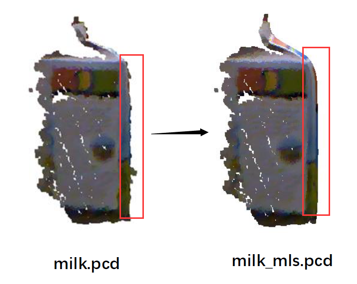

*Fig.4.11.14:   Before and after smoothing*

As shown in Fig.4.11.14, the red box on the right of **milk.pcd** is rugged, and some points affect the point cloud reconstruction. After smooth resampling by MLS, the red frame of **milk_mls.pcd** becomes very smooth, which is the intuitive result of MLS smooth resampling.


#### 4-11-3：Rapid triangulation of unorganized point cloud

##### Greedy Projection Triangulation

This section mainly introduces the rapid triangulation of an unorganized point cloud (see in Section 3-1) — Greedy Projection Triangulation (see in Section 4-11-1). 

The specific steps of the algorithm have been introduced before. The general idea is mainly: project the directed point cloud (the point cloud after calculating the normal) to a 2-dimensional plane (Fig.4.11.15 (b)). Then the plane points are triangulated (Delaunay spatial region growth algorithm) (Fig.4.11.15 (c)). Then the final triangle mesh is obtained according to the topological relationship of the plane triangulation result (Fig.4.11.15 (d)).

> NB: This algorithm also has limitations. It is more suitable when the sampled point cloud comes from a continuous smooth surface, and the point cloud density changes relatively uniformly 22. It cannot be smoothed or filling holes at the same time as the triangulation. Suppose some areas are not smooth or have large density changes. In that case, the process of obtaining a triangular mesh based on the topological relationship of the planar triangulation result will be inaccurate.
>

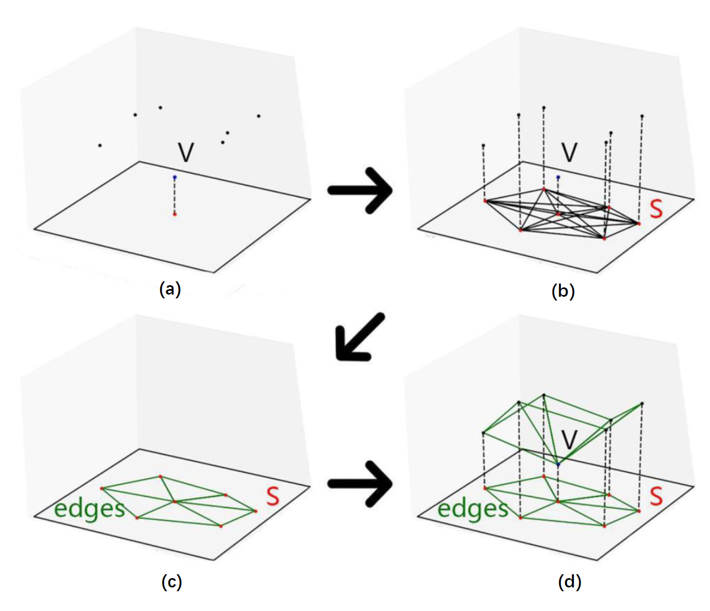

*Fig.4.11.15:   Greedy Projection Triangulation[^50]*

The following specific example shows how to use Greedy Projection Triangulation to quickly triangulate an unorganized point cloud to obtain the triangular mesh result. The result is saved in the form of a vtk file because vtk can save information about polygons (see in Section 3-3):

##### Example

Take **bottle.pcd** as an example (see in the "files" folder). **bottle.pcd** is a bottle. The point cloud's surface is continuous and smooth, and the density of the point cloud changes evenly.

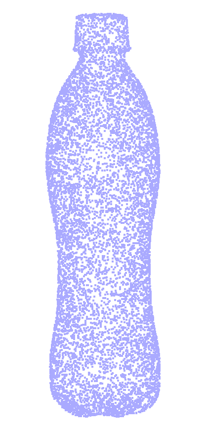

*Fig.4.11.16:   **bottle.pcd***

For the complete code **greedy projection triangulation.cpp** see in [Appendix —— Rapid triangulation of unorganized point cloud](# 4.11.3 ：Rapid triangulation of unorganized point cloud).

The following lines are the header files required for Greedy Projection Triangulation:

```c++
#include <iostream>
// Point type header file supported in PCL
#include <pcl/point_types.h>
// pcd reads and writes related header file in PCL
#include <pcl/io/pcd_io.h>
// kdtree header file
#include <pcl/kdtree/kdtree_flann.h>  
// normal estimation header file
#include <pcl/features/normal_3d.h>   
// greedy projection triangulation header file
#include <pcl/surface/gp3.h>         
// vtk header file
#include <pcl/io/vtk_io.h>            
```

------


The following code first creates a point cloud object "cloud" to store the original point cloud **bottle.pcd**, then estimates normal, creates a normal estimation object "n", then creates a normal storage object "normals", and finally creates a Kdtree nearest neighbor search object "tree", use "cloud" as the input point cloud of "tree":

```c++
    //Load input file into a PointCloud<T> with an appropriate type
	pcl::PointCloud<pcl::PointXYZ>::Ptr cloud(new pcl::PointCloud<pcl::PointXYZ>); 
	pcl::io::loadPCDFile(".../bottle.pcd", *cloud);	
	//Normal estimation
	pcl::NormalEstimation<pcl::PointXYZ, pcl::Normal> n; 
	pcl::PointCloud<pcl::Normal>::Ptr normals(new pcl::PointCloud<pcl::Normal>); 
	pcl::search::KdTree<pcl::PointXYZ>::Ptr tree(new pcl::search::KdTree<pcl::PointXYZ>); 
	tree->setInputCloud(cloud); 
```

------


The following code first estimates the normal of the point cloud (set the parameters setInputCloud, setSearchMethod, setKSearch) (see in Section 4-6-1). It stores the result of the normal estimation in "normals". Then merge the original point cloud containing XYZ information and normals from which the normal information is calculated to obtain a point cloud containing XYZ and normal information, and store it in "cloud_with_normals":

```c++
    n.setInputCloud(cloud); 
	n.setSearchMethod(tree); 
	n.setKSearch(35); 
	n.compute(*normals); 
	//Concatenate the XYZ and normal fields*
	pcl::PointCloud<pcl::PointNormal>::Ptr cloud_with_normals(new pcl::PointCloud<pcl::PointNormal>);
	pcl::concatenateFields(*cloud, *normals, *cloud_with_normals); 
```

------


The following code first creates a new Kdtree search object "tree2", takes "cloud_with_normals" containing normal information as its input point cloud for neighbor search. Then defines the triangulation model: first, create the triangulation object "gp3", and then create the triangulation mesh model result storage object "triangles":

```c++
    //Create search tree*
	pcl::search::KdTree<pcl::PointNormal>::Ptr tree2(new pcl::search::KdTree<pcl::PointNormal>);
	tree2->setInputCloud(cloud_with_normals); 
	//Initialize objects
	pcl::GreedyProjectionTriangulation<pcl::PointNormal> gp3; 
	pcl::PolygonMesh triangles; 
```

------


Now enter the parameter setting part of the triangulation*:

```c++
    //Set the parameters
	gp3.setSearchRadius(1.0); 
	gp3.setMu(3.0);
	gp3.setMaximumNearestNeighbors(100); 
	gp3.setMaximumSurfaceAngle(M_PI / 4);
	gp3.setMaximumAngle(2 * M_PI / 3); 
	gp3.setMinimumAngle(M_PI / 18);
	gp3.setNormalConsistency(true);
```

*Parameters:

**setSearchRadius**: Set the maximum side length of all triangles finally obtained;

**setMu**: Set the longest distance for the sample point to search for its neighbors;

**setMaximumNearestNeighbors**: Set the number of neighbors that the sample can search;

**setMaximumSurfaceAngle**: Set the maximum angle that the normal direction of a point deviates from the normal direction of the sample point, here is 45 degrees;

**setMaximumAngle**: Set the maximum angle of the triangle inner angle after triangulation, here is 120 degrees;

**setMinimumAngle**: Set the minimum angle of the triangle inner angle after triangulation, here is 10 degrees;

**setNormalConsistency**: Set this parameter to ensure whether the normals are in the same direction. True means consistent, false otherwise.

------


Let "cloud_with_normals" be the input point cloud of "gp3", and "tree2" is the search method of "gp3", execute triangulation, and store the final result in **bottle.vtk**:

```c++
    //Get result
	gp3.setInputCloud(cloud_with_normals); 
	gp3.setSearchMethod(tree2); 
	gp3.reconstruct(triangles); 
	//Sava data and output
	pcl::io::saveVTKFile(".../bottle.vtk", triangles);
```

------

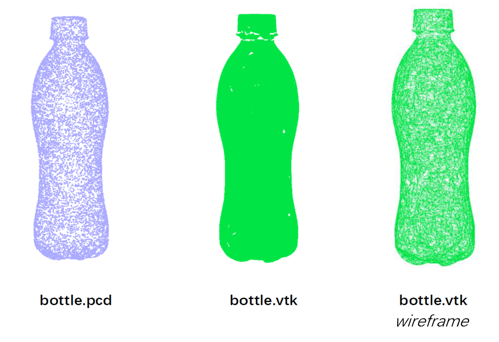

*Fig.4.11.17:   Before and after Greedy Projection Triangulation*

As shown in Fig.4.11.17, the **bottle.vtk** and the wireframe diagram (see the introduction of wireframe in Section 3-3) are the Greedy Projection Triangulation results. However, the form is different. The difference is that the former fills all triangles with green, while the latter only reflects the triangle's outline, so the mesh structure is more obvious. The default diagram of the vtk file in CloudCompare is green, so **bottle.vtk** all display green.

We cut the **bottle.vtk** of the wireframe view in half, and then zoom in partly, we can see that it is composed of multiple small triangles (Fig.4.11.18):

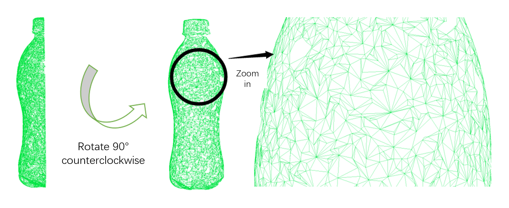

*Fig.4.11.18:   Triangulation*


> The above is the entire content of Chapter 4. In the following chapters, we will introduce algorithms for processing point clouds in addition to PCL.
>


### Appendix

#### 4.3.1 ：Read pcd file

**pcd_read.cpp：**

```c++
// Input and output related header file in the standard C++ library
#include <iostream>   
// pcd reads and writes related header file in PCL
#include <pcl/io/pcd_io.h>  
// Point type header file supported in PCL
#include <pcl/point_types.h> 

int
main ()
{
  pcl::PointCloud<pcl::PointXYZ>::Ptr cloud (new pcl::PointCloud<pcl::PointXYZ>);

  if (pcl::io::loadPCDFile<pcl::PointXYZ> (".../bunny.pcd", *cloud) == -1) //* load the file
  {
    PCL_ERROR ("Couldn't read file bunny.pcd \n");
    return (-1);
  }
  std::cout << "Loaded "
            << cloud->width * cloud->height
            << " data points from bunny.pcd with the following fields: "
            << std::endl;
  for (std::size_t i = 0; i < cloud->points.size (); ++i)
    std::cout << "    " << cloud->points[i].x
              << " "    << cloud->points[i].y
              << " "    << cloud->points[i].z << std::endl;

  return 0;
}
```


#### 4.3.2 ：Write pcd file

**pcd_write.cpp：**

```c++
// Input and output related header file in the standard C++ library
#include <iostream>   
// pcd reads and writes related header file in PCL
#include <pcl/io/pcd_io.h>  
// Point type header file supported in PCL
#include <pcl/point_types.h> 

int
main ()
{
  pcl::PointCloud<pcl::PointXYZ> cloud;

  // Fill in the cloud data
  cloud.width    = 5;
  cloud.height   = 1;
  cloud.is_dense = false;
  cloud.points.resize (cloud.width * cloud.height);

  for (std::size_t i = 0; i < cloud.points.size (); ++i)
  {
    cloud.points[i].x = 1024 * rand () / (RAND_MAX + 1.0f);
    cloud.points[i].y = 1024 * rand () / (RAND_MAX + 1.0f);
    cloud.points[i].z = 1024 * rand () / (RAND_MAX + 1.0f);
  }

  pcl::io::savePCDFileASCII (".../test_pcd.pcd", cloud);
  std::cout << "Saved " << cloud.points.size () << " data points to test_pcd.pcd." << std::endl;

  for (std::size_t i = 0; i < cloud.points.size (); ++i)
    std::cout << "    " << cloud.points[i].x << " " 
                        << cloud.points[i].y << " " 
                        << cloud.points[i].z << std::endl;
  return 0;
}
```


#### 4.3.3 ：Combine pcd files

**pcd_combine.cpp：**

```c++
// Input and output related header file in the standard C++ library
#include <iostream>   
// pcd reads and writes related header file in PCL
#include <pcl/io/pcd_io.h>  
// Point type header file supported in PCL
#include <pcl/point_types.h> 

int
main()
{	
	pcl::PointCloud<pcl::PointXYZ> cloud_a, cloud_b, cloud_c;
	pcl::PointCloud<pcl::Normal> n_cloud_b;
	pcl::PointCloud<pcl::PointNormal> p_n_cloud_c;

	// Fill in the cloud data
	cloud_a.width = 5;
	cloud_a.height = cloud_b.height = n_cloud_b.height = 1;
	cloud_a.points.resize(cloud_a.width * cloud_a.height);
	
	cloud_b.width = 3;
	cloud_b.points.resize(cloud_b.width * cloud_b.height);
	
	n_cloud_b.width = 5;
	n_cloud_b.points.resize(n_cloud_b.width * n_cloud_b.height);
	
	for (std::size_t i = 0; i < cloud_a.points.size(); ++i)
	{
		cloud_a.points[i].x = 1024 * rand() / (RAND_MAX + 1.0f);
		cloud_a.points[i].y = 1024 * rand() / (RAND_MAX + 1.0f);
		cloud_a.points[i].z = 1024 * rand() / (RAND_MAX + 1.0f);
	}
	
	for (std::size_t i = 0; i < cloud_b.points.size(); ++i)
	{
		cloud_b.points[i].x = 1024 * rand() / (RAND_MAX + 1.0f);
		cloud_b.points[i].y = 1024 * rand() / (RAND_MAX + 1.0f);
		cloud_b.points[i].z = 1024 * rand() / (RAND_MAX + 1.0f);
	}

	for (std::size_t i = 0; i < n_cloud_b.points.size(); ++i)
	{
		n_cloud_b.points[i].normal[0] = 1024 * rand() / (RAND_MAX + 1.0f);
		n_cloud_b.points[i].normal[1] = 1024 * rand() / (RAND_MAX + 1.0f);
		n_cloud_b.points[i].normal[2] = 1024 * rand() / (RAND_MAX + 1.0f);
	}

	std::cout << "Cloud A: " << std::endl;
	for (std::size_t i = 0; i < cloud_a.points.size(); ++i)
		std::cout << "    " << cloud_a.points[i].x << " " 
                            << cloud_a.points[i].y << " " 
                            << cloud_a.points[i].z << std::endl;

	std::cout << "Cloud B: " << std::endl;
	for (std::size_t i = 0; i < cloud_b.points.size(); ++i)
		std::cout << "    " << cloud_b.points[i].x << " " 
                            << cloud_b.points[i].y << " " 
                            << cloud_b.points[i].z << std::endl;
	
	std::cout << "Cloud n_B: " << std::endl;
	for (std::size_t i = 0; i < n_cloud_b.points.size(); ++i)
		std::cout << "    " << n_cloud_b.points[i].normal[0] << " " 
                            << n_cloud_b.points[i].normal[1] << " " 
                            << n_cloud_b.points[i].normal[2] << std::endl;

	// Copy the point cloud data
	cloud_c = cloud_a;
	cloud_c += cloud_b;
	std::cout << "Cloud C: " << std::endl;
	for (std::size_t i = 0; i < cloud_c.points.size(); ++i)
		std::cerr << "    " << cloud_c.points[i].x << " " 
                            << cloud_c.points[i].y << " " 
                            << cloud_c.points[i].z << " " << std::endl;	

	pcl::concatenateFields(cloud_a, n_cloud_b, p_n_cloud_c);
	std::cout << "Cloud p_n_C: " << std::endl;
	for (std::size_t i = 0; i < p_n_cloud_c.points.size(); ++i)
		std::cout << "    " << p_n_cloud_c.points[i].x << " " 
                            << p_n_cloud_c.points[i].y << " " 
                            << p_n_cloud_c.points[i].z << " " 
                            << p_n_cloud_c.points[i].normal[0] << " " 
                            << p_n_cloud_c.points[i].normal[1] << " " 
                            << p_n_cloud_c.points[i].normal[2] << std::endl;

	return 0;
}
```


#### 4.3.4 ：Convert TXT to PCD

**txt_to_pcd.cpp：**

```c++
// Input and output related header file in the standard C++ library
#include <iostream>   
// "F"ile stream
#include <fstream> 
// pcd reads and writes related header file in PCL
#include <pcl/io/pcd_io.h>  
// Point type header file supported in PCL
#include <pcl/point_types.h>
using namespace std;   // name space std

int main()
{
	fstream modelRead;
	pcl::PointCloud<pcl::PointXYZ> cloud;
	pcl::PointXYZ pclPnt;

	modelRead.open(".../chair.txt", ios_base::in);
	while (!modelRead.eof())
	{
		modelRead >> pclPnt.x >> pclPnt.y >> pclPnt.z;
		cloud.push_back(pclPnt);
	}
	modelRead.close();
	pcl::io::savePCDFile(".../chair.pcd", cloud);
	return 0;
}
```


#### 4.3.4 ：Convert PCD to TXT

**pcd_to_txt.cpp：**

```c++
// Input and output related header file in the standard C++ library
#include <iostream>   
// "F"ile stream
#include <fstream> 
// pcd reads and writes related header file in PCL
#include <pcl/io/pcd_io.h>  
// Point type header file supported in PCL
#include <pcl/point_types.h>
using namespace std;           

int main()
{
	pcl::PointCloud<pcl::PointXYZ>::Ptr cloud(new pcl::PointCloud<pcl::PointXYZ>);
    pcl::io::loadPCDFile<pcl::PointXYZ>(".../airplane.pcd", *cloud);
    int Num = cloud->points.size();
    double *X = new double[Num] {0};
    double *Y = new double[Num] {0};
    double *Z = new double[Num] {0};
    for (size_t i = 0; i < cloud->points.size(); ++i)
	{
		X[i] = cloud->points[i].x;
		Y[i] = cloud->points[i].y;
		Z[i] = cloud->points[i].z;
	}
    ofstream zos(".../airplane.txt");
    for (int i = 0; i < Num; i++)
	{
		zos << X[i] << " " << Y[i] << " " << Z[i] << " " << endl;
	}
	return 0;
}
```


#### 4.4.2 ：How to a create range image from the point cloud

**create_rangeimage.cpp**

```c++
#include <pcl/range_image/range_image.h>
#include <pcl/io/pcd_io.h>

int
main() 
{
	pcl::PointCloud<pcl::PointXYZ> pointCloud;

	// 生成矩形点云，保存在 rectangle.pcd 文件中
	for (float y = -0.5f; y <= 0.5f; y += 0.01f) {
		for (float z = -0.5f; z <= 0.5f; z += 0.01f) {
			pcl::PointXYZ point;
			point.x = 2.0f - y;
			point.y = y;
			point.z = z;
			pointCloud.points.push_back(point);
		}
	}
	pointCloud.width = pointCloud.points.size();
	pointCloud.height = 1;

	pcl::io::savePCDFileASCII(".../rectangle.pcd", pointCloud);

    // 现在开始从点云中创建深度图像
    // 深度图像参数的设置
	float angularResolution = (float)(1.0f * (M_PI / 180.0f)); // 弧度1度
	float maxAngleWidth = (float)(360.0f * (M_PI / 180.0f)); // 弧度360度
	float maxAngleHeight = (float)(180.0f * (M_PI / 180.0f)); // 弧度180度
	Eigen::Affine3f sensorPose = (Eigen::Affine3f)Eigen::Translation3f(0.0f, 0.0f, 0.0f);
	pcl::RangeImage::CoordinateFrame coordinate_frame = pcl::RangeImage::CAMERA_FRAME;
	float noiseLevel = 0.00;
	float minRange = 0.0f;
	int borderSize = 1;

	pcl::RangeImage rangeImage; // 创建深度图像对象 rangeImage
	rangeImage.createFromPointCloud(pointCloud, angularResolution, maxAngleWidth, maxAngleHeight, sensorPose, coordinate_frame, noiseLevel, minRange, borderSize);

	std::cout << rangeImage << "\n";
    
    // 保存深度图像于一个新的 pcd 文件中
	pcl::io::savePCDFileASCII(".../rectangle_range.pcd", rangeImage); 
	return 0;
}
```


#### 4.4.3 ：How to extract borders in range image

**create_rangeimage.cpp**

```C++
#include <iostream>
#include <pcl/io/pcd_io.h>
#include <pcl/range_image/range_image.h>
#include <pcl/features/range_image_border_extractor.h>
using namespace std;
typedef pcl::PointXYZ PointType;

int
main()
{
	// --------------------
	// -----创建点云文件-----
	// --------------------
	pcl::PointCloud<PointType> point_cloud;
	std::cout << "Generating example point cloud.\n\n";
	for (float x = -0.5f; x <= 0.5f; x += 0.01f)
	{
		for (float y = -0.5f; y <= 0.5f; y += 0.01f)
		{
			PointType point;  point.x = x;  point.y = y;  point.z = 2.0f - y;
			point_cloud.points.push_back(point);
		}
	}
	point_cloud.width = (int)point_cloud.points.size();  point_cloud.height = 1;

	// ---------------------------
	// -----从点云中创建深度图像--
	// ---------------------------
	float angular_resolution = 0.5f;
	Eigen::Affine3f scene_sensor_pose(Eigen::Affine3f::Identity());
	pcl::RangeImage::CoordinateFrame coordinate_frame = pcl::RangeImage::CAMERA_FRAME;
	bool setUnseenToMaxRange = false;
	float noise_level = 0.0;
	float min_range = 0.0f;
	int border_size = 1;
	pcl::RangeImage::Ptr range_image_ptr(new pcl::RangeImage);
	pcl::RangeImage& range_image = *range_image_ptr;
	range_image.createFromPointCloud(point_cloud, pcl::deg2rad(angular_resolution), pcl::deg2rad(360.0f), pcl::deg2rad(180.0f),
		scene_sensor_pose, coordinate_frame, noise_level, min_range, border_size);
	if (setUnseenToMaxRange)
		range_image.setUnseenToMaxRange();

	//保存深度图像
	pcl::io::savePCDFileASCII(".../rectangle_range.pcd", range_image);

	// -------------------------
	// -----提取深度图像边界------
	// -------------------------
	pcl::RangeImageBorderExtractor border_extractor(&range_image);
	pcl::PointCloud<pcl::BorderDescription> border_descriptions;
	border_extractor.compute(border_descriptions);

	//输出边界点的描述
	cout << border_extractor.getBorderDescriptions() << endl;

	return 0;
}
```


#### 4.5.2 ：How to extract NARF Keypoints in range image

**extract_NARF_Keypoints_rangeimage.cpp**

```c++
#include <iostream>
#include <pcl/range_image/range_image.h>
#include <pcl/io/pcd_io.h>
#include <pcl/features/range_image_border_extractor.h>
#include <pcl/keypoints/narf_keypoint.h>
typedef pcl::PointXYZ PointType;


int
main()
{
	pcl::PointCloud<PointType> point_cloud;
	pcl::io::loadPCDFile(".../airplane.pcd", point_cloud);

	// ---------------------------
	// -----从点云中创建深度图像--
	// ---------------------------
	pcl::RangeImage range_image;

	float angular_resolution = 0.5f;
	float support_size = 0.2f;
	pcl::RangeImage::CoordinateFrame coordinate_frame = pcl::RangeImage::CAMERA_FRAME;
	float noise_level = 0.0;
	float min_range = 0.0f;
	int border_size = 1;
	Eigen::Affine3f scene_sensor_pose(Eigen::Affine3f::Identity());
	bool setUnseenToMaxRange = true;
	
	range_image.createFromPointCloud(point_cloud, pcl::deg2rad(angular_resolution), pcl::deg2rad(360.0f), pcl::deg2rad(180.0f),
		scene_sensor_pose, coordinate_frame, noise_level, min_range, border_size);
	if (setUnseenToMaxRange)
		range_image.setUnseenToMaxRange();

	pcl::io::savePCDFileASCII(".../airplane_range.pcd", range_image);

	// ------------------------
	// -----提取 NARF 关键点-----
	// ------------------------
	pcl::RangeImageBorderExtractor range_image_border_extractor;
	pcl::NarfKeypoint narf_keypoint_detector(&range_image_border_extractor);
	narf_keypoint_detector.setRangeImage(&range_image);
	narf_keypoint_detector.getParameters().support_size = support_size;

	pcl::PointCloud<int> keypoint_indices;
	narf_keypoint_detector.compute(keypoint_indices);
	std::cout << "Found " << keypoint_indices.points.size() << " key points.\n" << std::endl;
	pcl::io::savePCDFileASCII(".../airplane_narf.pcd", narf_keypoint_detector.getInterestPoints());

	return 0;
}
```


#### 4.6.1 ：Estimate surface normals in a point cloud

**estimate_normal.cpp**

```C++
#include <iostream>
#include <pcl/point_types.h>
#include <pcl/io/pcd_io.h>
#include <pcl/search/kdtree.h>    // Kdtree 头文件
#include <pcl/features/normal_3d.h>   // 法线估计头文件

int
main()
{
	pcl::PointCloud<pcl::PointXYZ>::Ptr cloud(new pcl::PointCloud<pcl::PointXYZ>);
	pcl::io::loadPCDFile(".../bridge_pier.pcd", *cloud);
    
    // 创建法线估计对象 ne
	pcl::NormalEstimation<pcl::PointXYZ, pcl::Normal> ne;
	// 存储法线输出数据集 pcNormal
	pcl::PointCloud<pcl::Normal>::Ptr pcNormal(new pcl::PointCloud<pcl::Normal>);
	// 创建一个空的 kdtree 对象，并把它传递给法线估计对象
	// 基于给出的输入数据集，kdtree 将被建立
	pcl::search::KdTree<pcl::PointXYZ>::Ptr tree(new pcl::search::KdTree<pcl::PointXYZ>);
	tree->setInputCloud(cloud);
	ne.setInputCloud(cloud);
	ne.setSearchMethod(tree);
    ne.setRadiusSearch (0.03);// 使用半径在查询点周围3厘米范围内的所有近邻元素
	//或者 ne.setKSearch(50);  根据点周围50个点进行平面拟合（选取周围50个点作为近邻点）

	// 计算特征值
	ne.compute(*pcNormal);

    // 合并带有法线信息的 pcNormal 和带有每个点x，y，z信息的 cloud    
	pcl::PointCloud<pcl::PointNormal>::Ptr cloud_with_normals(new pcl::PointCloud<pcl::PointNormal>);
	pcl::concatenateFields(*cloud, *pcNormal, *cloud_with_normals);
    
    // 将含有xyz和法线信息的点云 cloud_with_normals 存储在 bridge_normal.pcd 中
    pcl::io::savePCDFileASCII(".../bridge_pier_normal.pcd", *cloud_with_normals);

	return 0;
}
```


#### 4.6.2 ：Normal Estimation Using Integral Images

**estimate_integral_normal.cpp**

```c++
    #include <pcl/io/io.h>
    #include <pcl/io/pcd_io.h>
    #include <pcl/features/integral_image_normal.h>   // 用积分图法计算法线的文件头

     int
     main ()
     {
     // 加载点云文件
     pcl::PointCloud<pcl::PointXYZ>::Ptr cloud (new pcl::PointCloud<pcl::PointXYZ>);
     pcl::io::loadPCDFile (".../table_scene_mug_stereo_textured.pcd", *cloud);

     // 估计法线
     pcl::PointCloud<pcl::Normal>::Ptr normals (new pcl::PointCloud<pcl::Normal>);

     pcl::IntegralImageNormalEstimation<pcl::PointXYZ, pcl::Normal> ne;
     ne.setNormalEstimationMethod (ne.AVERAGE_3D_GRADIENT);
     ne.setMaxDepthChangeFactor(0.02f);
     ne.setNormalSmoothingSize(10.0f);
     ne.setInputCloud(cloud);
     ne.compute(*normals);

     //将点的xyz信息和normals中的法线信息合并到cloud_with_normals中
     pcl::PointCloud<pcl::PointNormal>::Ptr cloud_with_normals(new pcl::PointCloud<pcl::PointNormal>);
     pcl::concatenateFields(*cloud, *normals, *cloud_with_normals);
     pcl::io::savePCDFile(".../table_scene_mug_stereo_textured_normals.pcd", *cloud_with_normals);
  
     return 0;
  }
```


#### 4.6.3 ：Point Feature Histogram (PFH) descriptors

**pfh.cpp**

```c++
#include <iostream>
#include <pcl/point_types.h>
#include <pcl/io/pcd_io.h>
#include <pcl/search/kdtree.h>    // Kdtree 头文件
#include <pcl/features/normal_3d.h>   // 法线估计头文件
#include <pcl/features/pfh.h>   //PFH 特征估计类头文件

int
main()
{
   pcl::PointCloud<pcl::PointXYZ>::Ptr cloud(new pcl::PointCloud<pcl::PointXYZ>);
   pcl::io::loadPCDFile(".../bridge_pier.pcd", *cloud);

   // 创建法线估计对象 ne
   pcl::NormalEstimation<pcl::PointXYZ, pcl::Normal> ne;
   // 存储法线输出数据集 pcNormal
   pcl::PointCloud<pcl::Normal>::Ptr pcNormal(new pcl::PointCloud<pcl::Normal>);
   // 创建一个空的 kdtree 对象，并把它传递给法线估计对象
	// 基于给出的输入数据集，kdtree 将被建立
	pcl::search::KdTree<pcl::PointXYZ>::Ptr tree1(new pcl::search::KdTree<pcl::PointXYZ>);
	tree1->setInputCloud(cloud);
	ne.setInputCloud(cloud);
	ne.setSearchMethod(tree1);
	ne.setRadiusSearch(0.03);// 使用半径在查询点周围3厘米范围内的所有近邻元素
	//或者 ne.setKSearch(50);  根据点周围50个点进行平面拟合（选取周围50个点作为近邻点）

	// 计算特征值
	ne.compute(*pcNormal);

	// 合并带有法线信息的 pcNormal 和带有每个点x，y，z信息的 cloud    
	pcl::PointCloud<pcl::PointNormal>::Ptr cloud_with_normals(new pcl::PointCloud<pcl::PointNormal>);
	pcl::concatenateFields(*cloud, *pcNormal, *cloud_with_normals);

	//下面进行 PFH 的计算
	// 创建 PFH 估计对象 pfh，并将输入点云数据集 cloud 和法线 normals 传递给它 
	pcl::PFHEstimation<pcl::PointXYZ, pcl::Normal, pcl::PFHSignature125> pfh;
	pfh.setInputCloud(cloud);
	pfh.setInputNormals(pcNormal);

	// 创建一个空的 Kd 树表示法，并把它传递给 PFH 估计对象
	// 基于已给的输入数据集，建立 kd-tree 
	pcl::search::KdTree<pcl::PointXYZ>::Ptr tree2(new pcl::search::KdTree<pcl::PointXYZ>());
	pfh.setSearchMethod(tree2);

	// 输出数据集
	pcl::PointCloud<pcl::PFHSignature125>::Ptr pfhs(new pcl::PointCloud<pcl::PFHSignature125>());

	// 使用半径在 5cm 范围内的所有邻元素． 
	// 注意：此处使用的半径必须要大于估计表面法线时使用的半径!! 在这里我们计算表面法线的半径是 0.03
	pfh.setRadiusSearch(0.05);

	// 计算 PFH 特征值
	pfh.compute(*pfhs)

	//保存含有 PFH 的点云文件
	pcl::io::savePCDFileASCII(".../bridge_pier_pfh.pcd", *pfhs);

	return 0;
}
```


#### 4.6.4 ：Fast Point Feature Histogram (FPFH) descriptors

**fpfh.cpp**

```c++
#include <iostream>
#include <pcl/point_types.h>
#include <pcl/io/pcd_io.h>
#include <pcl/features/fpfh.h>  // FPFH 特征估计类头文件声明 
#include <pcl/search/kdtree.h>    // Kdtree 头文件
#include <pcl/features/normal_3d.h>   // 法线估计头文件

int
main()
{
	pcl::PointCloud<pcl::PointXYZ>::Ptr cloud(new pcl::PointCloud<pcl::PointXYZ>);
	pcl::io::loadPCDFile(".../bridge_pier.pcd", *cloud);

	// 创建法线估计对象 ne
	pcl::NormalEstimation<pcl::PointXYZ, pcl::Normal> ne;
	// 存储法线输出数据集 pcNormal
	pcl::PointCloud<pcl::Normal>::Ptr pcNormal(new pcl::PointCloud<pcl::Normal>);
	// 创建一个空的 kdtree 对象，并把它传递给法线估计对象
	// 基于给出的输入数据集，kdtree 将被建立
	pcl::search::KdTree<pcl::PointXYZ>::Ptr tree1(new pcl::search::KdTree<pcl::PointXYZ>);
	tree1->setInputCloud(cloud);
	ne.setInputCloud(cloud);
	ne.setSearchMethod(tree1);
	ne.setRadiusSearch(0.03);// 使用半径在查询点周围3厘米范围内的所有近邻元素
	//或者 ne.setKSearch(50);  根据点周围50个点进行平面拟合（选取周围50个点作为近邻点）

	// 计算特征值
	ne.compute(*pcNormal);

	// 合并带有法线信息的 pcNormal 和带有每个点 x，y，z 信息的 cloud    
	pcl::PointCloud<pcl::PointNormal>::Ptr cloud_with_normals(new pcl::PointCloud<pcl::PointNormal>);
	pcl::concatenateFields(*cloud, *pcNormal, *cloud_with_normals);

	// 创建 FPFH 估计对象 fpfh，并把输入数据集 cloud 和法线 normals 传递给它 
	pcl::FPFHEstimation<pcl::PointXYZ, pcl::Normal, pcl::FPFHSignature33> fpfh;
	fpfh.setInputCloud(cloud);
	fpfh.setInputNormals(pcNormal);

	// 创建一个空的 Kd 树对象tree2，并把它传递给 FPFH 估计对象． 
	// 基于已知的输入数据集，建立 kdtree
	pcl::search::KdTree<pcl::PointXYZ>::Ptr tree2(new pcl::search::KdTree<pcl::PointXYZ>);
	fpfh.setSearchMethod(tree2);

	// 输出数据集
	pcl::PointCloud<pcl::FPFHSignature33>::Ptr fpfhs(new pcl::PointCloud<pcl::FPFHSignature33>());

	// 使用所有半径在 5 cm 范围内的邻元素 
	// 注意：此处使用的半径必须要大于估计表面法线时使用的半径！！！
	fpfh.setRadiusSearch(0.05);

	// 计算获取特征向量 
	fpfh.compute(*fpfhs);
    
    // only the fpfh of the first point
	cout << fpfhs->points[0].histogram[0] << endl;
	// output all fpfhs
	/*for (int i = 0; i < fpfhs->size(); i++) {
		pcl::FPFHSignature33 descriptor = fpfhs->points[i];
		cout << descriptor << endl;
	}*/
    
	//保存含有 FPFH 的点云文件
	pcl::io::savePCDFileASCII(".../bridge_pier_fpfh.pcd", *fpfhs);

	return 0;
}
```


#### 4.6.5 ：Viewpoint Feature Histogram (VFH) descriptors

**vfh.cpp**

```c++
#include <iostream>              // 标准 C++ 库中的输入输出类相关头文件
#include <pcl/io/pcd_io.h>       // pcd 读写类相关的头文件
#include <pcl/point_types.h>     // pcl 中支持的点类型的头文件
#include <pcl/features/vfh.h>    //VFH 特征估计类头文件
#include <pcl/search/kdtree.h>   // Kdtree 头文件
#include <pcl/features/normal_3d.h>   // 法线估计头文件

int
main()
{
    // 创建一个点云对象 cloud ，并将 bridge_pier.pcd 加载到 cloud 中   
    pcl::PointCloud<pcl::PointXYZ>::Ptr cloud(new pcl::PointCloud<pcl::PointXYZ>);
	pcl::io::loadPCDFile(".../bridge_pier.pcd", *cloud);

	// 创建法线估计对象 ne
	pcl::NormalEstimation<pcl::PointXYZ, pcl::Normal> ne;

	// 存储法线输出数据集 normals
	pcl::PointCloud<pcl::Normal>::Ptr normals(new pcl::PointCloud<pcl::Normal>());

	// 创建一个空的 kdtree 对象 tree1
	pcl::search::KdTree<pcl::PointXYZ>::Ptr tree1(new pcl::search::KdTree<pcl::PointXYZ>);
    
    // 将法线对象输入到 tree1 中 ，分别设置近邻搜索对象和搜索半径（或近邻搜索个数）  
    tree1->setInputCloud(cloud);
	ne.setInputCloud(cloud);
	ne.setSearchMethod(tree1);
	ne.setRadiusSearch(0.03);// 使用半径在查询点周围3厘米范围内的所有近邻元素
	//或者 ne.setKSearch(50);  根据点周围50个点进行平面拟合（选取周围50个点作为近邻点）

	// 计算特征值
	ne.compute(*normals);
    
    // 创建 VFH 估计对象 vfh，并把输入数据集 cloud 和法线 normals 传递给它 
	pcl::VFHEstimation<pcl::PointXYZ, pcl::Normal, pcl::VFHSignature308> vfh;
	vfh.setInputCloud(cloud);
	vfh.setInputNormals(normals);

	// 创建一个空的 kd-tree 对象，并把它传递给 VFH 估计对象
	pcl::search::KdTree<pcl::PointXYZ>::Ptr tree2(new pcl::search::KdTree<pcl::PointXYZ>());
	vfh.setSearchMethod(tree2);

	// 输出数据集 
	pcl::PointCloud<pcl::VFHSignature308>::Ptr vfhs(new pcl::PointCloud<pcl::VFHSignature308>());

	// 计算特征值
	vfh.compute(*vfhs);
	// vfhs->points.size () 的大小应该是 1 ，即 vfh 描述子是针对全局的特征描述

	// 保存 VFH 信息
	pcl::io::savePCDFile(".../bridge_pier_vfh.pcd", *vfhs);

	return 0;
}
```


#### 4.7.2 ：Iterative Closest Point

 **ICP_registration.cpp**

```c++
#include <iostream>
#include <pcl/io/pcd_io.h>
#include <pcl/point_types.h>
#include <pcl/registration/icp.h>

int
main()
{
	pcl::PointCloud<pcl::PointXYZ>::Ptr cloud1(new pcl::PointCloud<pcl::PointXYZ>);
	pcl::PointCloud<pcl::PointXYZ>::Ptr cloud2(new pcl::PointCloud<pcl::PointXYZ>);

	pcl::io::loadPCDFile(".../bunny3.pcd", *cloud1);
	pcl::io::loadPCDFile(".../bunny4.pcd", *cloud2);

	pcl::IterativeClosestPoint<pcl::PointXYZ, pcl::PointXYZ> icp;
	icp.setInputSource(cloud1);
	icp.setInputTarget(cloud2);
	icp.setMaxCorrespondenceDistance(1.5);
	icp.setMaximumIterations(100);
	icp.setTransformationEpsilon(1e-10);
	icp.setEuclideanFitnessEpsilon(0.01);

	pcl::PointCloud<pcl::PointXYZ> Final;
	icp.align(Final);

	std::cout << "has converged:" << icp.hasConverged() << " score: " <<
		icp.getFitnessScore() << std::endl;

	Eigen::Matrix4f transformation = icp.getFinalTransformation();
	std::cout << transformation << std::endl;

	pcl::io::savePCDFile(".../bunny_registration.pcd", Final);

	return 0;
}
```


#### 4.8.3 ： Kdtree

**kdtree.cpp**

```c++
#include <pcl/point_cloud.h>
#include <pcl/kdtree/kdtree_flann.h>
#include <iostream>
#include <ctime>

int
main ()
{
  srand (time (NULL));

  pcl::PointCloud<pcl::PointXYZ>::Ptr cloud (new pcl::PointCloud<pcl::PointXYZ>);

  // Generate pointcloud data
  cloud->width = 1000;
  cloud->height = 1;
  cloud->points.resize (cloud->width * cloud->height);

  for (std::size_t i = 0; i < cloud->points.size (); ++i)
  {
    cloud->points[i].x = 1024.0f * rand () / (RAND_MAX + 1.0f);
    cloud->points[i].y = 1024.0f * rand () / (RAND_MAX + 1.0f);
    cloud->points[i].z = 1024.0f * rand () / (RAND_MAX + 1.0f);
  }

  pcl::KdTreeFLANN<pcl::PointXYZ> kdtree;
  kdtree.setInputCloud (cloud);
  pcl::PointXYZ searchPoint;

  searchPoint.x = 1024.0f * rand () / (RAND_MAX + 1.0f);
  searchPoint.y = 1024.0f * rand () / (RAND_MAX + 1.0f);
  searchPoint.z = 1024.0f * rand () / (RAND_MAX + 1.0f);

  // K nearest neighbor search

  int K = 10;
  std::vector<int> pointIdxNKNSearch(K);
  std::vector<float> pointNKNSquaredDistance(K);
  std::cout << "K nearest neighbor search at (" << searchPoint.x 
            << " " << searchPoint.y 
            << " " << searchPoint.z
            << ") with K=" << K << std::endl;

  if ( kdtree.nearestKSearch (searchPoint, K, pointIdxNKNSearch, pointNKNSquaredDistance) > 0 )
  {
    for (std::size_t i = 0; i < pointIdxNKNSearch.size (); ++i)
      std::cout << "    "  <<   cloud->points[ pointIdxNKNSearch[i] ].x 
                << " " << cloud->points[ pointIdxNKNSearch[i] ].y 
                << " " << cloud->points[ pointIdxNKNSearch[i] ].z 
                << " (squared distance: " << pointNKNSquaredDistance[i] << ")" << std::endl;
  }

  // Neighbors within radius search

  std::vector<int> pointIdxRadiusSearch;
  std::vector<float> pointRadiusSquaredDistance;
  float radius = 256.0f * rand () / (RAND_MAX + 1.0f);
  std::cout << "Neighbors within radius search at (" << searchPoint.x 
            << " " << searchPoint.y 
            << " " << searchPoint.z
            << ") with radius=" << radius << std::endl;


  if ( kdtree.radiusSearch (searchPoint, radius, pointIdxRadiusSearch, pointRadiusSquaredDistance) > 0 )
  {
    for (std::size_t i = 0; i < pointIdxRadiusSearch.size (); ++i)
      std::cout << "    "  <<   cloud->points[ pointIdxRadiusSearch[i] ].x 
                << " " << cloud->points[ pointIdxRadiusSearch[i] ].y 
                << " " << cloud->points[ pointIdxRadiusSearch[i] ].z 
                << " (squared distance: " << pointRadiusSquaredDistance[i] << ")" << std::endl;
  }
  return 0;
}
```


#### 4.8.4 ： Octree

**Octree.cpp**

```c++
#include <pcl/point_cloud.h>
#include <pcl/octree/octree_search.h>
#include <iostream>
#include <ctime>

int
main()
{
	srand(time(NULL));

	pcl::PointCloud<pcl::PointXYZ>::Ptr cloud(new pcl::PointCloud<pcl::PointXYZ>);

	// Generate pointcloud data
	cloud->width = 1000;
	cloud->height = 1;
	cloud->points.resize(cloud->width * cloud->height);

	for (std::size_t i = 0; i < cloud->points.size(); ++i)
	{
		cloud->points[i].x = 1024.0f * rand() / (RAND_MAX + 1.0f);
		cloud->points[i].y = 1024.0f * rand() / (RAND_MAX + 1.0f);
		cloud->points[i].z = 1024.0f * rand() / (RAND_MAX + 1.0f);
	}

	float resolution = 128.0f;
	pcl::octree::OctreePointCloudSearch<pcl::PointXYZ> octree(resolution);
	octree.setInputCloud(cloud);
	octree.addPointsFromInputCloud();
	pcl::PointXYZ searchPoint;
	searchPoint.x = 1024.0f * rand() / (RAND_MAX + 1.0f);
	searchPoint.y = 1024.0f * rand() / (RAND_MAX + 1.0f);
	searchPoint.z = 1024.0f * rand() / (RAND_MAX + 1.0f);

	// Neighbors within voxel search
	std::vector<int> pointIdxVec;
	if (octree.voxelSearch(searchPoint, pointIdxVec))
	{
		std::cout << "Neighbors within voxel search at (" << searchPoint.x
			<< " " << searchPoint.y
			<< " " << searchPoint.z << ")"
			<< std::endl;
		for (std::size_t i = 0; i < pointIdxVec.size(); ++i)
			std::cout << "    " << cloud->points[pointIdxVec[i]].x
			<< " " << cloud->points[pointIdxVec[i]].y
			<< " " << cloud->points[pointIdxVec[i]].z << std::endl;
	}

	// K nearest neighbor search
	int K = 10;
	std::vector<int> pointIdxNKNSearch;
	std::vector<float> pointNKNSquaredDistance;
	std::cout << "K nearest neighbor search at (" << searchPoint.x
		<< " " << searchPoint.y
		<< " " << searchPoint.z
		<< ") with K=" << K << std::endl;
	if (octree.nearestKSearch(searchPoint, K, pointIdxNKNSearch, pointNKNSquaredDistance) > 0)
	{
		for (std::size_t i = 0; i < pointIdxNKNSearch.size(); ++i)
			std::cout << "    " << cloud->points[pointIdxNKNSearch[i]].x
			<< " " << cloud->points[pointIdxNKNSearch[i]].y
			<< " " << cloud->points[pointIdxNKNSearch[i]].z
			<< " (squared distance: " << pointNKNSquaredDistance[i] << ")" << std::endl;
	}

	// Neighbors within radius search
	float radius = 256.0f * rand() / (RAND_MAX + 1.0f);
	std::vector<int> pointIdxRadiusSearch;
	std::vector<float> pointRadiusSquaredDistance;
	std::cout << "Neighbors within radius search at (" << searchPoint.x
		<< " " << searchPoint.y
		<< " " << searchPoint.z
		<< ") with radius=" << radius << std::endl;
	if (octree.radiusSearch(searchPoint, radius, pointIdxRadiusSearch, pointRadiusSquaredDistance) > 0)
	{
		for (std::size_t i = 0; i < pointIdxRadiusSearch.size(); ++i)
			std::cout << "    " << cloud->points[pointIdxRadiusSearch[i]].x
			<< " " << cloud->points[pointIdxRadiusSearch[i]].y
			<< " " << cloud->points[pointIdxRadiusSearch[i]].z
			<< " (squared distance: " << pointRadiusSquaredDistance[i] << ")" << std::endl;
	}
	return 0;
}
```


#### 4.9.1 ： Passthrough

**passthrough.cpp**

```c++
#include <pcl/point_types.h>
#include <pcl/io/pcd_io.h>
#include <pcl/filters/passthrough.h>

int
main()
{
	pcl::PointCloud<pcl::PointXYZ>::Ptr cloud(new pcl::PointCloud<pcl::PointXYZ>);
	pcl::PointCloud<pcl::PointXYZ>::Ptr cloud_filtered(new pcl::PointCloud<pcl::PointXYZ>);
    pcl::io::loadPCDFile(".../airplane.pcd", *cloud);

    std::cerr << "PointCloud before filtering: " << cloud->width * cloud->height
		<< " data points (" << pcl::getFieldsList(*cloud) << ")." << std::endl;


	// Create the filtering object
	pcl::PassThrough<pcl::PointXYZ> pass;
	pass.setInputCloud(cloud);
	pass.setFilterFieldName("z");
	pass.setFilterLimits(0.0, 1.0);
	//pass.setFilterLimitsNegative (true);
	pass.filter(*cloud_filtered);
    std::cerr << "PointCloud after filtering: " << cloud_filtered->width * cloud_filtered->height
		<< " data points (" << pcl::getFieldsList(*cloud_filtered) << ")." << std::endl;

	pcl::io::savePCDFileASCII(".../airplane_passthourgh.pcd", *cloud_filtered);

	return 0;
}
```


#### 4.9.2 ： VoxelGrid

**voxelgrid.cpp**

```c++
#include <iostream>
#include <pcl/io/pcd_io.h>
#include <pcl/point_types.h>
#include <pcl/filters/voxel_grid.h>

int
main()
{
	pcl::PointCloud<pcl::PointXYZ>::Ptr cloud(new pcl::PointCloud<pcl::PointXYZ>);
	pcl::PointCloud<pcl::PointXYZ>::Ptr cloud_filtered(new pcl::PointCloud<pcl::PointXYZ>);

	pcl::io::loadPCDFile(".../chair.pcd", *cloud);

	std::cerr << "PointCloud before filtering: " << cloud->width * cloud->height
		<< " data points (" << pcl::getFieldsList(*cloud) << ")." << std::endl;

	// Create the filtering object
	pcl::VoxelGrid<pcl::PointXYZ> sor;
	sor.setInputCloud(cloud);
	sor.setLeafSize(0.05f, 0.05f, 0.05f);
	sor.filter(*cloud_filtered);

	std::cerr << "PointCloud after filtering: " << cloud_filtered->width * cloud_filtered->height
		<< " data points (" << pcl::getFieldsList(*cloud_filtered) << ")." << std::endl;

	pcl::io::savePCDFileASCII(".../chair_downsampling.pcd", *cloud_filtered);

	return 0;
}
```


#### 4.9.3 ： Statistical

 **statistical.cpp**

```c++
#include <iostream>
#include <pcl/io/pcd_io.h>
#include <pcl/point_types.h>
#include <pcl/filters/statistical_outlier_removal.h>

int
main()
{
	pcl::PointCloud<pcl::PointXYZ>::Ptr cloud(new pcl::PointCloud<pcl::PointXYZ>);
	pcl::PointCloud<pcl::PointXYZ>::Ptr cloud_filtered(new pcl::PointCloud<pcl::PointXYZ>);

	pcl::io::loadPCDFile(".../table.pcd", *cloud);

	// Create the filtering object
	pcl::StatisticalOutlierRemoval<pcl::PointXYZ> sor;
	sor.setInputCloud(cloud);
	sor.setMeanK(50);
	sor.setStddevMulThresh(1.0);
	sor.filter(*cloud_filtered);

	pcl::io::savePCDFile(".../table_inliers.pcd", *cloud_filtered, false);

	sor.setNegative(true);
	sor.filter(*cloud_filtered);
	pcl::io::savePCDFile(".../table_outliers.pcd", *cloud_filtered, false);

	return 0;
}
```


#### 4.9.4 ： Radius

**radius.cpp**

```c++
#include <iostream>
#include <pcl/io/pcd_io.h>
#include <pcl/point_types.h>
#include <pcl/filters/radius_outlier_removal.h>

int
main()
{
	pcl::PointCloud<pcl::PointXYZ>::Ptr cloud(new pcl::PointCloud<pcl::PointXYZ>);
	pcl::PointCloud<pcl::PointXYZ>::Ptr cloud_filtered(new pcl::PointCloud<pcl::PointXYZ>);

	pcl::io::loadPCDFile(".../table.pcd", *cloud);

	pcl::RadiusOutlierRemoval<pcl::PointXYZ> outrem;
	// build the filter
	outrem.setInputCloud(cloud);
	outrem.setRadiusSearch(0.05);
	outrem.setMinNeighborsInRadius(200);
	// apply filter
	outrem.filter(*cloud_filtered);
		
	pcl::io::savePCDFile(".../table_RadiusOutlierRemoval.pcd", *cloud_filtered);

	return 0;
}
```


#### 4.10.1 ： Plane segmentation based on RANSAC

**extract_plane_ransac.cpp** 

```c++
#include <iostream>
#include <pcl/io/pcd_io.h>
#include <pcl/point_types.h>
#include <pcl/sample_consensus/method_types.h>
#include <pcl/sample_consensus/model_types.h>
#include <pcl/segmentation/sac_segmentation.h>

int main()
{
	pcl::PointCloud<pcl::PointXYZ> cloud;

	// Fill in the cloud data
	cloud.width = 15;
	cloud.height = 1;
	cloud.points.resize(cloud.width * cloud.height);

	// Generate the data
	for (size_t i = 0; i < cloud.points.size(); ++i)
	{
		cloud.points[i].x = 1024 * rand() / (RAND_MAX + 1.0f);
		cloud.points[i].y = 1024 * rand() / (RAND_MAX + 1.0f);
		cloud.points[i].z = 1.0;
	}

	// Set a few outliers
	cloud.points[0].z = 2.0;
	cloud.points[3].z = -2.0;
	cloud.points[6].z = 4.0;

	std::cout << "Point cloud data: " << cloud.points.size() << " points" << std::endl;
	for (size_t i = 0; i < cloud.points.size(); ++i)
		std::cout << "    " << cloud.points[i].x << " "
		<< cloud.points[i].y << " "
		<< cloud.points[i].z << std::endl;

	pcl::io::savePCDFile(".../random_sample.pcd", cloud);

	pcl::ModelCoefficients::Ptr coefficients(new pcl::ModelCoefficients);
	pcl::PointIndices::Ptr inliers(new pcl::PointIndices);
	// Create the segmentation object
	pcl::SACSegmentation<pcl::PointXYZ> seg;
	// Optional
	seg.setOptimizeCoefficients(true);
	// Mandatory
	seg.setModelType(pcl::SACMODEL_PLANE);
	seg.setMethodType(pcl::SAC_RANSAC);
	seg.setDistanceThreshold(0.01);

	seg.setInputCloud(cloud.makeShared());
	seg.segment(*inliers, *coefficients);

	std::cout << "Model coefficients: " << coefficients->values[0] << " "
		<< coefficients->values[1] << " "
		<< coefficients->values[2] << " "
		<< coefficients->values[3] << std::endl;

	std::cout << "Model inliers: " << inliers->indices.size() << std::endl;
	for (size_t i = 0; i < inliers->indices.size(); ++i)
		std::cout << inliers->indices[i] << "    " << cloud.points[inliers->indices[i]].x << " "
		<< cloud.points[inliers->indices[i]].y << " "
		<< cloud.points[inliers->indices[i]].z << std::endl;

	return 0;
}
```


#### 4.10.1 ： Cylinder segmentation based on RANSAC

**extract_cylinder_ransac.cpp** 

```c++
#include <pcl/io/pcd_io.h>
#include <pcl/point_types.h>
#include <pcl/filters/extract_indices.h>
#include <pcl/filters/passthrough.h>
#include <pcl/features/normal_3d.h>
#include <pcl/sample_consensus/method_types.h>
#include <pcl/sample_consensus/model_types.h>
#include <pcl/segmentation/sac_segmentation.h>
using namespace std;
typedef pcl::PointXYZRGB PointT;

int main()
{
	// All the objects needed
	pcl::PCDReader reader;
	pcl::PassThrough<PointT> pass;
	pcl::NormalEstimation<PointT, pcl::Normal> ne;
	pcl::SACSegmentationFromNormals<PointT, pcl::Normal> seg;
	pcl::PCDWriter writer;
	pcl::ExtractIndices<PointT> extract;
	pcl::ExtractIndices<pcl::Normal> extract_normals;
	pcl::search::KdTree<PointT>::Ptr tree(new pcl::search::KdTree<PointT>());

	// Datasets
	pcl::PointCloud<PointT>::Ptr cloud(new pcl::PointCloud<PointT>);
	pcl::PointCloud<PointT>::Ptr cloud_filtered(new pcl::PointCloud<PointT>);
	pcl::PointCloud<pcl::Normal>::Ptr cloud_normals(new pcl::PointCloud<pcl::Normal>);
	pcl::PointCloud<PointT>::Ptr cloud_filtered2(new pcl::PointCloud<PointT>);
	pcl::PointCloud<pcl::Normal>::Ptr cloud_normals2(new pcl::PointCloud<pcl::Normal>);
	pcl::ModelCoefficients::Ptr coefficients_plane(new pcl::ModelCoefficients), coefficients_cylinder(new pcl::ModelCoefficients);
	pcl::PointIndices::Ptr inliers_plane(new pcl::PointIndices), inliers_cylinder(new pcl::PointIndices);

	// Read in the cloud data
	reader.read(".../table_scene_mug_stereo_textured.pcd", *cloud);
	std::cout << "PointCloud has: " << cloud->points.size() << " data points." << std::endl;

    // Build a passthrough filter to remove spurious NaNs
	pass.setInputCloud(cloud);
	pass.setFilterFieldName("z");
	pass.setFilterLimits(0, 1.5);
	pass.filter(*cloud_filtered);
	cout << "PointCloud after filtering has: " << cloud_filtered->points.size() << " data points." << endl;

	// Estimate point normals
	ne.setSearchMethod(tree);
	ne.setInputCloud(cloud_filtered);
	ne.setKSearch(50);
	ne.compute(*cloud_normals);

	// Create the segmentation object for the planar model and set parameters
	seg.setOptimizeCoefficients(true);
	seg.setModelType(pcl::SACMODEL_NORMAL_PLANE);
	seg.setNormalDistanceWeight(0.1);
	seg.setMethodType(pcl::SAC_RANSAC);
	seg.setMaxIterations(100);
	seg.setDistanceThreshold(0.03);
	seg.setInputCloud(cloud_filtered);
	seg.setInputNormals(cloud_normals);

	// Obtain the plane inliers and coefficients
	seg.segment(*inliers_plane, *coefficients_plane);
	std::cout << "Plane coefficients: " << *coefficients_plane << std::endl;

	// Extract the planar inliers from the input cloud
	pcl::PointCloud<PointT>::Ptr cloud_plane(new pcl::PointCloud<PointT>());
	extract.setInputCloud(cloud_filtered);	    // 设置输入点云
	extract.setIndices(inliers_plane);			// 设置分割后的内点为需要提取的点集
	extract.setNegative(false);					// 设置提取内点而非外点
	extract.filter(*cloud_plane);				// 提取输出存储到 cloud_plane

	// Write the planar inliers to disk
	std::cout << "PointCloud representing the planar component: " << cloud_plane->points.size() << " data points." << std::endl;
	writer.write(".../table_scene_mug_stereo_textured_plane.pcd", *cloud_plane, false);

	// Remove the planar inliers, extract the rest
	extract.setNegative(true);					// 设置提取外点
	extract.filter(*cloud_filtered2);			// 提取输出存储到 cloud_filtered2
	extract_normals.setNegative(true);
	extract_normals.setInputCloud(cloud_normals);
	extract_normals.setIndices(inliers_plane);
	extract_normals.filter(*cloud_normals2);

    // Create the segmentation object for cylinder segmentation and set parameters
	seg.setOptimizeCoefficients(true);        // 设置对估计的模型系数需要进行优化
	seg.setModelType(pcl::SACMODEL_CYLINDER); // 设置分割模型为圆柱型
	seg.setMethodType(pcl::SAC_RANSAC);       // 设置采用 RANSAC 作为算法的参数估计方法
	seg.setNormalDistanceWeight(0.1);         // 设置表面法线权重系数
	seg.setMaxIterations(10000);              // 设置迭代的最大次数10000
	seg.setDistanceThreshold(0.05);           // 设置内点到模型的距离允许最大值
	seg.setRadiusLimits(0, 0.1);              // 设置估计出的圆柱模型的半径范围
	seg.setInputCloud(cloud_filtered2);
	seg.setInputNormals(cloud_normals2);

	// Obtain the cylinder inliers and coefficients
	seg.segment(*inliers_cylinder, *coefficients_cylinder);
	std::cout << "Cylinder coefficients: " << *coefficients_cylinder << std::endl;

    // Write the cylinder inliers to disk
	extract.setInputCloud(cloud_filtered2);
	extract.setIndices(inliers_cylinder);
	extract.setNegative(false);
	pcl::PointCloud<PointT>::Ptr cloud_cylinder(new pcl::PointCloud<PointT>());
	extract.filter(*cloud_cylinder);
	if (cloud_cylinder->points.empty())
		std::cout << "Can't find the cylindrical component." << std::endl;
	else
	{
		std::cout << "PointCloud representing the cylindrical component: " << cloud_cylinder->points.size() << " data points." << std::endl;
		writer.write(".../table_scene_mug_stereo_textured_cylinder.pcd", *cloud_cylinder, false);
	}
	return 0;
}
```


#### 4.10.2 ： Clustering segmentation

**clustering_segmentation.cpp**

```c++
#include <pcl/point_types.h>
#include <pcl/io/pcd_io.h>
#include <pcl/filters/extract_indices.h>
#include <pcl/filters/voxel_grid.h>
#include <pcl/features/normal_3d.h>
#include <pcl/kdtree/kdtree.h>
#include <pcl/sample_consensus/method_types.h>
#include <pcl/sample_consensus/model_types.h>
#include <pcl/segmentation/sac_segmentation.h>
#include <pcl/segmentation/extract_clusters.h>

int
main()
{
	// 读取文件
	pcl::PCDReader reader;
	pcl::PointCloud<pcl::PointXYZ>::Ptr add_cloud(new pcl::PointCloud<pcl::PointXYZ>);
	pcl::PointCloud<pcl::PointXYZ>::Ptr cloud(new pcl::PointCloud<pcl::PointXYZ>), cloud_f(new pcl::PointCloud<pcl::PointXYZ>);
	reader.read(".../table.pcd", *cloud);
	std::cout << "PointCloud before filtering has: " << cloud->points.size() << " data points." << std::endl; 
	// 下采样，体素边长为 0.01
	pcl::VoxelGrid<pcl::PointXYZ> vg;
	pcl::PointCloud<pcl::PointXYZ>::Ptr cloud_filtered(new pcl::PointCloud<pcl::PointXYZ>);
	vg.setInputCloud(cloud);
	vg.setLeafSize(0.01f, 0.01f, 0.01f);
	vg.filter(*cloud_filtered);
	std::cout << "PointCloud after filtering has: " << cloud_filtered->points.size() << " data points." << std::endl; 									 
    // 创建平面模型分割的对象并设置参数
	pcl::SACSegmentation<pcl::PointXYZ> seg;
	pcl::PointIndices::Ptr inliers(new pcl::PointIndices); // 设置聚类的内点索引
	pcl::ModelCoefficients::Ptr coefficients(new pcl::ModelCoefficients);// 平面模型的因子
	pcl::PointCloud<pcl::PointXYZ>::Ptr cloud_plane(new pcl::PointCloud<pcl::PointXYZ>());
	pcl::PCDWriter writer;
	seg.setOptimizeCoefficients(true);
	seg.setModelType(pcl::SACMODEL_PLANE);    // 分割模型
	seg.setMethodType(pcl::SAC_RANSAC);       // 随机参数估计方法
	seg.setMaxIterations(100);                // 最大的迭代的次数
	seg.setDistanceThreshold(0.02);           // 设置阀值

	int i = 0, nr_points = (int)cloud_filtered->points.size(); // 剩余点云的数量
	while (cloud_filtered->points.size() > 0.3 * nr_points)
	{
		// 从剩余点云中再分割出最大的平面分量 （因为我们要处理的点云的数据是两个平面的存在的）
		seg.setInputCloud(cloud_filtered);
		seg.segment(*inliers, *coefficients);
		// 从输入的点云中提取平面模型的内点
		pcl::ExtractIndices<pcl::PointXYZ> extract;
		extract.setInputCloud(cloud_filtered);
		extract.setIndices(inliers);        // 提取内点的索引并存储在其中
		extract.setNegative(false);
		// 得到与平面表面相关联的点云数据
		extract.filter(*cloud_plane);
		std::cout << "PointCloud representing the planar component: " << cloud_plane->points.size() << " data points." << std::endl;
		// 移去平面局内点，提取剩余点云
		extract.setNegative(true);
		extract.filter(*cloud_f);
		*cloud_filtered = *cloud_f;
		std::stringstream ss1;
		ss1 << "table_cloud_plane_" << i << ".pcd";
		writer.write<pcl::PointXYZ>(ss1.str(), *cloud_plane, false); 
		i++;
	}
	// 创建用于提取搜索方法的kdtree树对象
	pcl::search::KdTree<pcl::PointXYZ>::Ptr tree(new pcl::search::KdTree<pcl::PointXYZ>);
	tree->setInputCloud(cloud_filtered);
	std::vector<pcl::PointIndices> cluster_indices;
	pcl::EuclideanClusterExtraction<pcl::PointXYZ> ec;   
	ec.setClusterTolerance(0.02);                    
	ec.setMinClusterSize(100);               
	ec.setMaxClusterSize(25000);              
	ec.setSearchMethod(tree);                    
	ec.setInputCloud(cloud_filtered);
	ec.extract(cluster_indices);          
	// 迭代访问点云索引 cluster_indices,直到分割处所有聚类
	int j = 0;
	for (std::vector<pcl::PointIndices>::const_iterator it = cluster_indices.begin(); it != cluster_indices.end(); ++it)
	{ // 迭代容器中的点云的索引，并且分开保存索引的点云
		pcl::PointCloud<pcl::PointXYZ>::Ptr cloud_cluster(new pcl::PointCloud<pcl::PointXYZ>);
		for (std::vector<int>::const_iterator pit = it->indices.begin(); pit != it->indices.end(); ++pit)
			// 设置保存点云的属性问题
			cloud_cluster->points.push_back(cloud_filtered->points[*pit]); 
		cloud_cluster->width = cloud_cluster->points.size();
		cloud_cluster->height = 1;
		cloud_cluster->is_dense = true;
		std::cout << "PointCloud representing the Cluster: " << cloud_cluster->points.size() << " data points." << std::endl;
		std::stringstream ss2;
		ss2 << "table_cloud_cluster_" << j << ".pcd";
		writer.write<pcl::PointXYZ>(ss2.str(), *cloud_cluster, false); 
		j++;
		*add_cloud += *cloud_cluster;
		pcl::io::savePCDFileASCII(".../table_add_cloud.pcd", *add_cloud);
	}
	return 0;
}
```


#### 4.11.2 ：Smooth resampling of point cloud based on MLS

**mls_smooth.cpp**

```c++
#include <pcl/point_types.h>
#include <pcl/io/pcd_io.h>
#include <pcl/kdtree/kdtree_flann.h>
#include <pcl/surface/mls.h>

int
main(int argc, char** argv)
{
	// Load input file into a PointCloud<T> with an appropriate type
	pcl::PointCloud<pcl::PointXYZRGB>::Ptr cloud(new pcl::PointCloud<pcl::PointXYZRGB>());
	pcl::io::loadPCDFile(".../milk.pcd", *cloud);
	// Create a KD-Tree
	pcl::search::KdTree<pcl::PointXYZRGB>::Ptr tree(new pcl::search::KdTree<pcl::PointXYZRGB>);
	// Output has the PointNormal type in order to store the normals calculated by MLS
	pcl::PointCloud<pcl::PointXYZRGBNormal> mls_points;
	// Init object (second point type is for the normals, even if unused)
	pcl::MovingLeastSquares<pcl::PointXYZRGB, pcl::PointXYZRGBNormal> mls;

	mls.setComputeNormals(true);
	mls.setInputCloud(cloud);
	mls.setPolynomialFit(true);
	mls.setSearchMethod(tree);
	mls.setSearchRadius(0.05);
	mls.process(mls_points);
	// Save output
	pcl::io::savePCDFile(".../milk_mls.pcd", mls_points);

	return 0;
}
```


#### 4.11.3 ：Rapid triangulation of unorganized point cloud

**greedy projection triangulation.cpp**

```c++
#include<iostream>
#include<pcl/point_types.h>
#include<pcl/io/pcd_io.h>
#include<pcl/kdtree/kdtree_flann.h>
#include<pcl/features/normal_3d.h>
#include<pcl/surface/gp3.h>
#include<pcl/io/vtk_io.h>


int
main(int agrc, char**argv)
{
	//Load input file into a PointCloud<T> with an appropriate type
	pcl::PointCloud<pcl::PointXYZ>::Ptr cloud(new pcl::PointCloud<pcl::PointXYZ>); 
	pcl::io::loadPCDFile(".../bottle.pcd", *cloud);	
	//Normal estimation
	pcl::NormalEstimation<pcl::PointXYZ, pcl::Normal> n; 
	pcl::PointCloud<pcl::Normal>::Ptr normals(new pcl::PointCloud<pcl::Normal>); 
	pcl::search::KdTree<pcl::PointXYZ>::Ptr tree(new pcl::search::KdTree<pcl::PointXYZ>); 
	tree->setInputCloud(cloud); 
	n.setInputCloud(cloud); 
	n.setSearchMethod(tree); 
	n.setKSearch(35);
	n.compute(*normals);
	//Concatenate the XYZ and normal fields*
	pcl::PointCloud<pcl::PointNormal>::Ptr cloud_with_normals(new pcl::PointCloud<pcl::PointNormal>);
	pcl::concatenateFields(*cloud, *normals, *cloud_with_normals); 
	//Create search tree*
	pcl::search::KdTree<pcl::PointNormal>::Ptr tree2(new pcl::search::KdTree<pcl::PointNormal>);
	tree2->setInputCloud(cloud_with_normals);
	//Initialize objects 定义三角化模型
	pcl::GreedyProjectionTriangulation<pcl::PointNormal> gp3;
	pcl::PolygonMesh triangles; 
	//Set the parameters
	gp3.setSearchRadius(1.0); 
	gp3.setMu(3.0); 
	gp3.setMaximumNearestNeighbors(100); 
	gp3.setMaximumSurfaceAngle(M_PI / 4); 
	gp3.setMaximumAngle(2 * M_PI / 3); 
	gp3.setMinimumAngle(M_PI / 18);  
	gp3.setNormalConsistency(true); 
	//Get result
	gp3.setInputCloud(cloud_with_normals); 
	gp3.setSearchMethod(tree2); 
	gp3.reconstruct(triangles); 
	//Sava data and output
	pcl::io::saveVTKFile(".../bottle.vtk", triangles);
	//Finish
	return 0;
}
```


### Reference

[^1]: https://cmake.org/
[^2]: 谭浩强 ． C程序设计（第4版） ：清华大学出版社，2010.6
[^3]: 李普曼 ． C++ Primer中文版 ： 电子工业出版社，2013.9
[^4]: https://blog.csdn.net/weixin_42018112/article/details/82357002
[^5]:http://www.idl.rie.shizuoka.ac.jp/study/project/tof/index_e.html
[^6]: Zhao, H., Xu, L., Shi, S., Jiang, H., & Chen, D. (2018). A high throughput integrated hyperspectral imaging and 3D measurement system. *Sensors*, *18*(4), 1068.
[^7]: https://images.app.goo.gl/U4HYCGerEATQh1oTA
[^8]: Shen, Yueqian; Wang, Jinguo; Lindenbergh, Roderik; Hofland, Bas; G. Ferreira, Vagner. 2018. "Range Image Technique for Change Analysis of Rock Slopes Using Dense Point Cloud Data." *Remote Sens.* 10, no. 11: 1792.
[^9]:https://vml.sakura.ne.jp/koeda/PCL/tutorials/html/range_image_border_extraction.html
[^10]:https://nanonets.com/blog/human-pose-estimation-2d-guide/
[^11]:Lowe, D. G. (2004). Distinctive image features from scale-invariant keypoints. *International journal of computer vision*, *60*(2), 91-110.
[^12]: Bay, H., Tuytelaars, T., & Van Gool, L. (2006, May). Surf: Speeded up robust features. In *European conference on computer vision* (pp. 404-417). Springer, Berlin, Heidelberg.
[^13]:Matas, J., Chum, O., Urban, M., & Pajdla, T. (2004). Robust wide-baseline stereo from maximally stable extremal regions. *Image and vision computing*, *22*(10), 761-767.
[^14]:Smith, S. M., & Brady, J. M. (1997). SUSAN—a new approach to low level image processing. *International journal of computer vision*, *23*(1), 45-78.
[^15]: https://www.fernuni-hagen.de/mci/research/2_CompVis/keypoints
[^16]: https://blog.csdn.net/xiaoxiaowenqiang/article/details/79575126
[^17]: Hänsch, R., Weber, T., & Hellwich, O. (2014). Comparison of 3D interest point detectors and descriptors for point cloud fusion. *ISPRS Annals of the Photogrammetry, Remote Sensing and Spatial Information Sciences*, *2*(3), 57.
[^18]: https://www.mathworks.com/help/images/integral-image.html
[^19]: http://pointclouds.org/documentation/tutorials/pfh_estimation.php#pfh-estimation
[^20]: Yang, B., Liu, Y., Liang, F., & Dong, Z. (2016). USING MOBILE LASER SCANNING DATA FOR FEATURES EXTRACTION OF HIGH ACCURACY DRIVING MAPS. *International Archives of the Photogrammetry, Remote Sensing & Spatial Information Sciences*, *41*.
[^21]: http://pointclouds.org/documentation/tutorials/fpfh_estimation.php#fpfh-estimation
[^22]: 朱德海. (2012). *点云库PCL学习教程*. 北京航空航天大学出版社.
[^23]: https://paperswithcode.com/task/pose-estimation
[^24]: https://pcl-tutorials.readthedocs.io/en/latest/vfh_estimation.html#vfh-estimation
[^25]: https://www.o2a-studio.com/?attachment_id=11992
[^26]: Pan, Y. (2019). Target-less registration of point clouds: A review. *arXiv preprint arXiv:1912.12756*.
[^27]: Zhang, X., Jian, L., & Xu, M. (2018). Robust 3D point cloud registration based on bidirectional Maximum Correntropy Criterion. *PloS one*, *13*(5).
[^28]: Hsieh, C. T. (2012, November). An efficient development of 3D surface registration by Point Cloud Library (PCL). In *2012 International Symposium on Intelligent Signal Processing and Communications Systems* (pp. 729-734). IEEE.
[^29]: https://blog.csdn.net/wokaowokaowokao12345/article/details/73741957
[^30]: https://blog.csdn.net/u012337034/article/details/38307219
[^31]: https://images.app.goo.gl/gJ7dsanK1eEchcai9
[^32]: https://zhihu.com/topic/19680489
[^33]: https://www.zhihu.com/question/35161407/answer/61772020
[^34]: https://en.m.wikipedia.org/wiki/K-d_tree
[^35]: https://images.app.goo.gl/Cbgb4Uzz6GLKstHp8
[^36]: Swatantran, Anu, Hao Tang, Terence Barrett, Phil DeCola, and Ralph Dubayah. "Rapid, high-resolution forest structure and terrain mapping over large areas using single photon lidar." *Scientific reports* 6 (2016): 28277.
[^37]: http://mres.uni-potsdam.de/index.php/2017/02/14/outliers-and-correlation-coefficients/
[^38]: https://images.app.goo.gl/Xks7Dt2WB8ZhkGph9
[^39]: https://images.app.goo.gl/XEeJmHcWigfwA46U6
[^40]: http://pointclouds.org/documentation/tutorials/statistical_outlier.php
[^41]:  https://images.app.goo.gl/iMKqKx9bfp7QNdXu8
[^42]: https://images.app.goo.gl/AeGVaoXyfJuS82FGA
[^43]: https://www.jianshu.com/p/77ebf030e9cb
[^44]: https://ss2.bdstatic.com/70cFvnSh_Q1YnxGkpoWK1HF6hhy/it/u=3548411807,1471078261&fm=26&gp=0.jpg
[^45]: https://zhuanlan.zhihu.com/p/45532306
[^46]: https://images.app.goo.gl/4o99TPGa5p8QMhzYA
[^47]: 刘金义, 刘爽. Voronoi图应用综述[J]. 工程图学学报, 2004(02):131-138.
[^48]:  https://images.app.goo.gl/vXyRShSQsKLE117F9
[^49]: https://images.app.goo.gl/r5YjEZ1jtdnYr9jW8
[^50]: https://images.app.goo.gl/XrPoxAPqTcW7SXDC6
[^51]: https://www.youtube.com/watch?v=KEsCklTuBWs
[^52]: Custodio, L., Pesco, S., & Silva, C. (2019). An extended triangulation to the Marching Cubes 33 algorithm. *Journal of the Brazilian Computer Society*, *25*(1), 1-18.
[^53]: https://doc.cgal.org/latest/Poisson_surface_reconstruction_3/index.html
[^54]: https://images.app.goo.gl/cbbkeUY1pJRqQAUX8