[TOC]


## 第四章   Point Cloud Library

到目前为止，我们已经学习了点云的**基础知识**、点云的**软件使用**（CloudCompare & MeshLab）、点云的**文件格式**，这些都是为点云算法准备的基础知识储备。要想再深入地学习点云，体现点云的价值，就不得不提一提点云的相关处理算法。图 4-1 是关于点云部分算法的总结，按类别进行了归纳，包括点云采样、点云配准、特征提取、点云滤波、聚类与分割、物体识别与检测、曲面重建和点云拟合，每一类都包括很多算法：

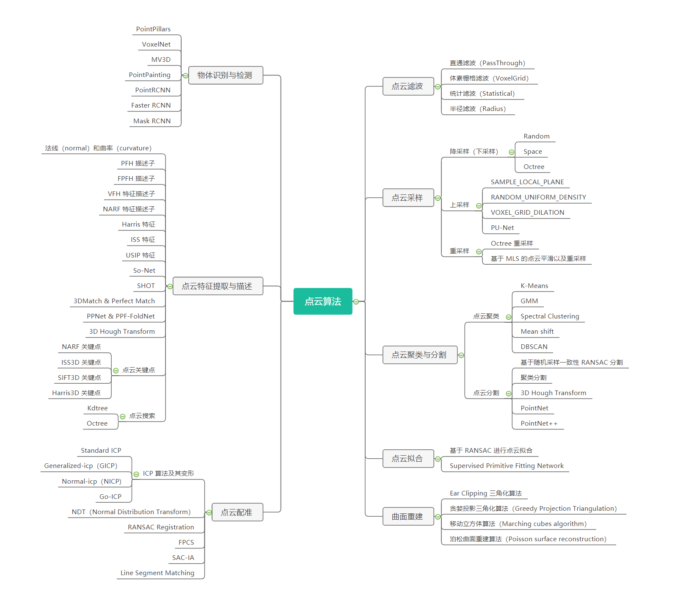

​                                                                             图 4-1：点云算法

正是这些算法的不断更新和问世，才使得我们可以对点云进行各种各样的分析和操作。要想系统地学习点云算法，“点云算法库：**Point Cloud Library（PCL）** ” 是我们的首选。它是由 C++ 编写的三维点云库，在这个点云库中包含众多处理点云的算法。学习了这一章的知识，我们可以自己实现对点云文件进行一些比较基本的处理。本章的算法基于 PCL，需要读者对 C++ 有一定的基础。


​                                                              **—— Point Cloud Library 之旅 ——**


### 4-1 ：Point Cloud Library 简介

**Point Cloud Library（PCL）**是一个大型跨平台开源 C++ 三维点云库，它的官方指定点云文件格式是 PCD（在第三章中介绍过）。PCL 库包含众多算法，涵盖了点云的**写入读取，滤波，特征提取，关键点提取，点云配准，点云搜索方法，点云切割，点云识别**等模块。

PCL 官网：http://pointclouds.org/，图 4-1-1 是 PCL 官网首页，图 4-1-2 是 PCL 的众多模块：


​                                                                           图 4-1-1：PCL 官网首页


​                                                                               图 4-1-2：PCL 模块

下面是 PCL 官方学习手册链接：

https://pcl.readthedocs.io/projects/tutorials/en/latest/


​                                                                        图 4-1-3：官方手册示意图

PCL 库中的现有算法需要在计算机中配置环境，才可以成功使用这些算法的源代码。如何配置环境呢？

4-2 节我们会介绍两种配置方法：

- **4-2-1：**PCL 1.9.1 在 Visual Studio 2017 中的配置；
- **4-2-2：**利用 cmake 进行代码编译。

> 4-3 节及其之后的代码部分我们使用 4-2-1 节中的方法，感兴趣的读者可以自主尝试 4-2-2 节的方法。


### 4-2：环境配置

#### 4-2-1 ：PCL1.9.1 在 VS 2017 的配置

PCL 是大型跨平台开源 C++ 编程库，Visual Studio 是编写 C++ 代码的集成开发环境（IDE）。在这里我们介绍的是 PCL **1.9.1** 在 VS **2017** （Visual Studio **2017**）中的配置。

> 不同版本的配置会有不同。此章节的内容是基于 1.9.1 版本的 PCL 和 2017 版本的 Visual Studio。其他版本的组合也许不适用接下来的介绍流程。
>
> 如果是其他版本的 PCL 或者 Visual Studio，需自行寻找其相应的配置过程。

##### VS 2017

首先自己的电脑中要安装好 VS 2017：

方法 1：官网下载  https://visualstudio.microsoft.com/zh-hans/vs/older-downloads/

> 注意：下载 **2017** 版本！

方法 2：公众号下载 https://mp.weixin.qq.com/s/MHbkGslWpX80xe6VoIDs8w

图 4-2-1 展示的是 VS 2017 的初始界面：

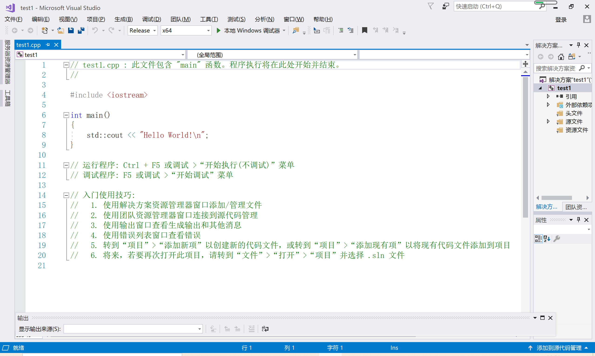

​                                                                      图 4-2-1：VS 2017 初始界面

##### PCL 1.9.1

###### PCL 1.9.1 下载

PCL 下载网址：https://github.com/PointCloudLibrary/pcl/releases/tag/pcl-1.9.1

图 4-2-2 中的黑框内为需要下载的两个文件：


​                                                                      图 4-2-2：PCL 1.9.1 下载界面


###### PCL 1.9.1 安装

step1：安装 **PCL-1.9.1-AllInOne-msvc2017-win64.exe**

在弹出的安装框中选择 “Add PCL to the system PATH for all users”：

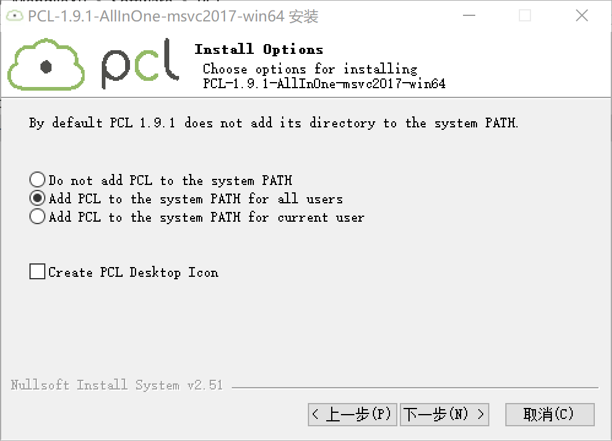

​                                                 图 4-2-3：“Add PCL to the system PATH for all users”

接下来将安装路径设置到 D 盘或读者希望保存的路径，系统会自动创建一个 “PCL 1.9.1” 文件夹：

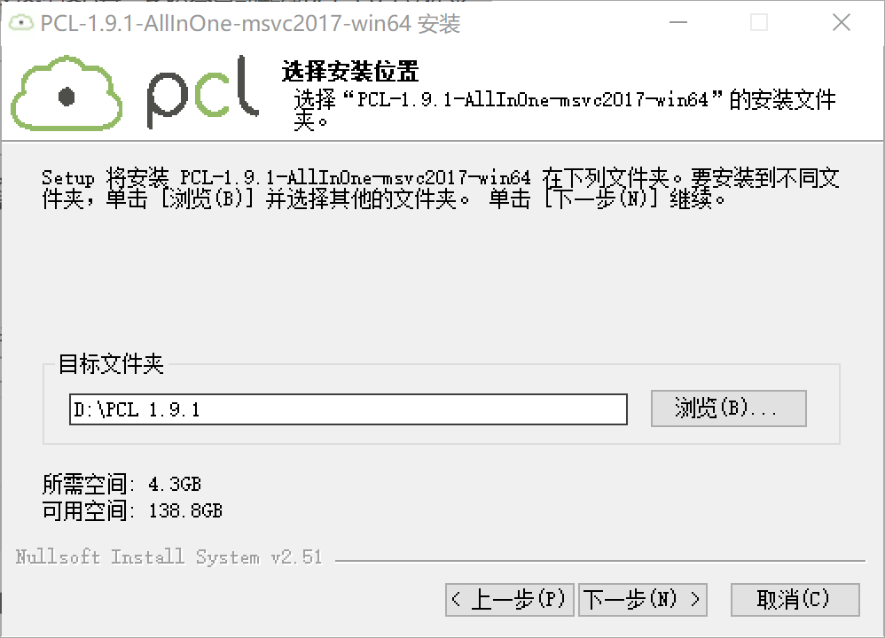

​                                                                       图 4-2-4：安装路径设置

step2：安装过程中会弹出 OpenNI 的安装界面，选择路径（D:\PCL 1.9.1\3rdParty\OpenNI2）安装。注意它的安装路径跟之前安装 PCL 1.9.1 的一致：比如我们这里都是 D 盘，那么 OpenNI 也是在 D 盘中的 PCL 1.9.1 文件夹下：

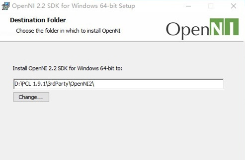

​                                                                图 4-2-5：OpenNI 安装路径说明

安装完成后，将 **pcl-1.9.1-pdb-msvc2017-win64.zip** 解压，解压后的 **\*.pdb** 文件复制到 ”D:\PCL 1.9.1\bin“ 中。

step3：设置环境变量：右键点击计算机图标，点击属性，出现图 4-2-6 界面，选择 **”高级系统设置“**：

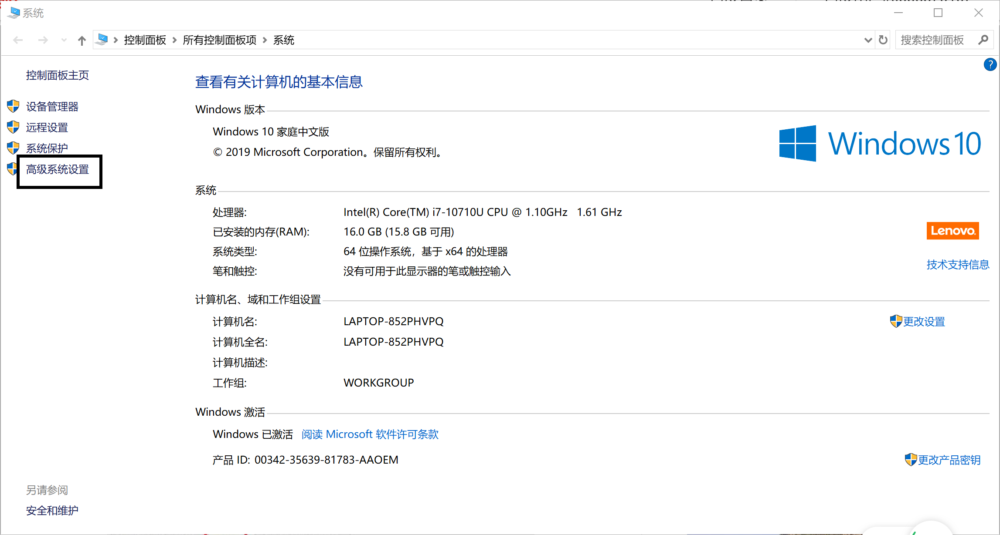

​                                                                         图 4-2-6：环境变量设置 1

在弹出框中选择**环境变量**，然后在系统变量中选择 **Path** 一栏，点击**编辑**：


​                                                                       图 4-2-7：环境变量设置 2

添加下列框内的路径，完成后**重启计算机**：

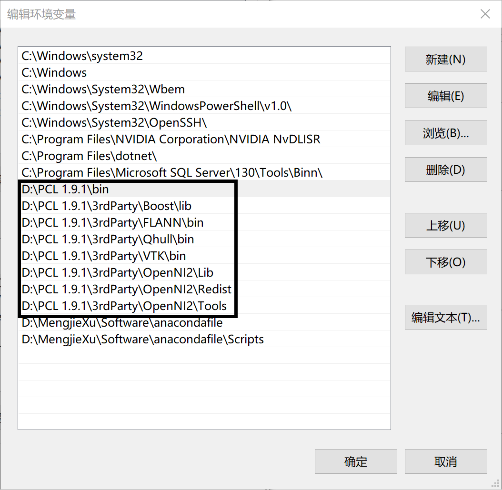

​                                                                        图 4-2-8：环境变量设置 3

###### PCL 1.9.1 环境配置

> 注意：这一部分每次创建一个新项目都要进行一次，之前的 PCL 安装和环境变量设置操作进行一次即可！

step1：**“创建新项目...”**，如图 4-2-9：


​                                                                        图 4-2-9：创建新项目

step2：新项目类别选择 **“控制台应用”**，路径和名称分别如图 4-2-10 所示设置：

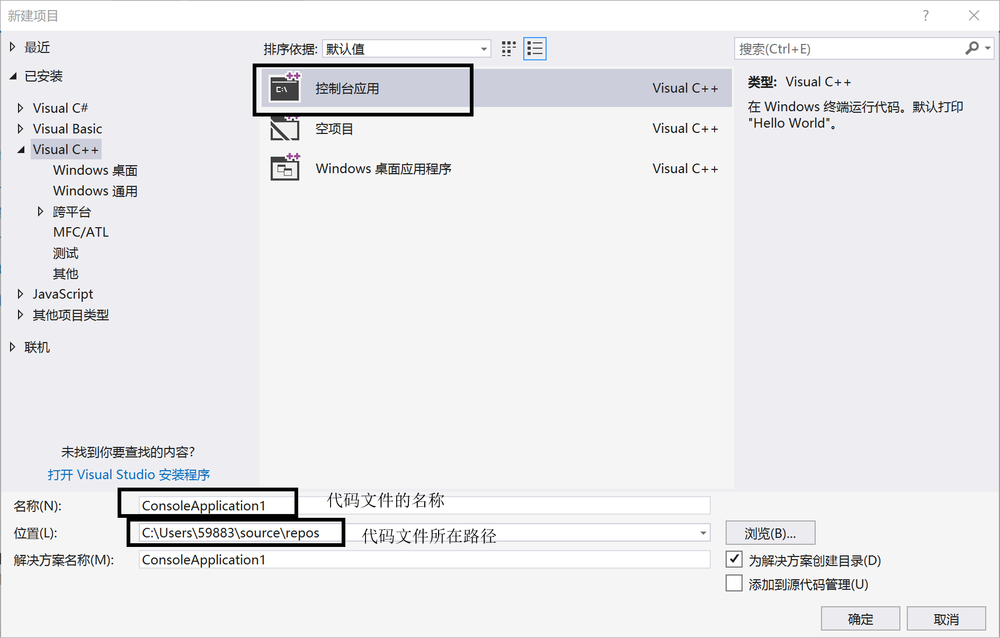

​                                                                       图 4-2-10：控制台应用

step3：选择 Release 和 x64：


​                                                                     图 4-2-11：Release 和 x64

step4：右键单击控制台应用名称，选择 “属性”：

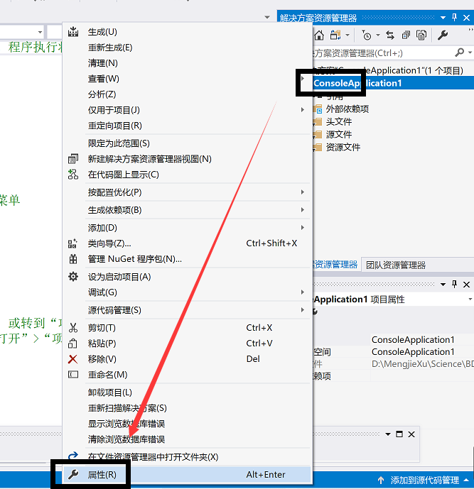

​                                                                                 图 4-2-12：属性

step5：VC++ 目录 — 包含目录，添加 7 个路径：


​                                                                         图 4-2-13：包含目录设置

step6：VC++ 目录 — 库目录，添加 6 个路径：

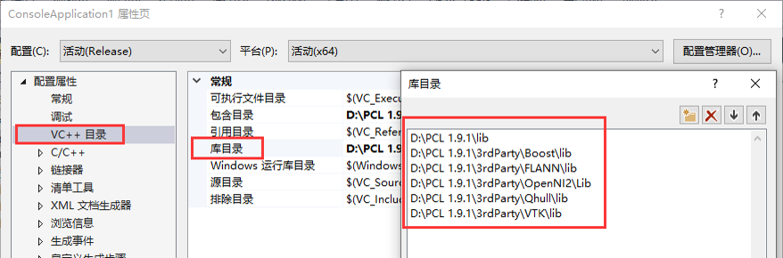

​                                                                         图 4-2-14：库目录设置

step7：C/C++ — 常规 — SDL 检查 — 否：


​                                                                      图 4-2-15：SDL 检查设置

step8：链接器 — 输入 — 附加依赖项 — 添加 PCL 和 VTK 的相关 lib 文件：

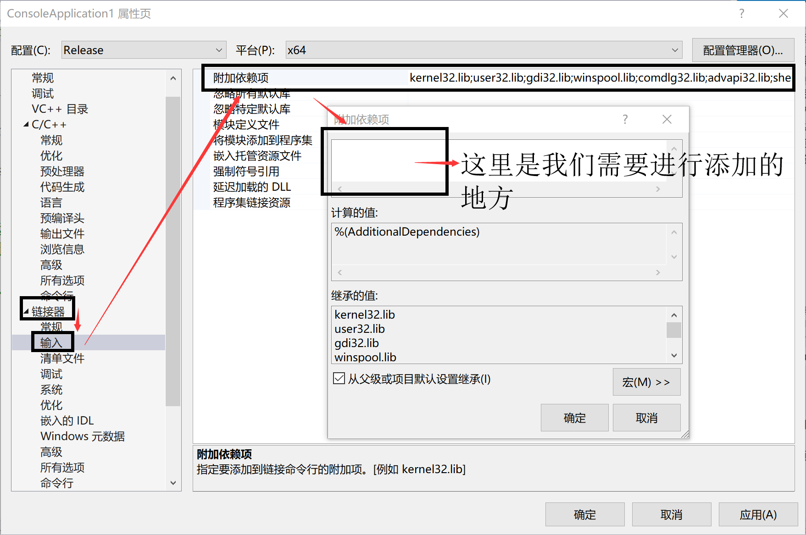

​                                                                  图 4-2-16：附加依赖项添加路径

要进行添加的附加依赖项如下：

```
pcl_common_release.lib
pcl_features_release.lib
pcl_filters_release.lib
pcl_io_ply_release.lib
pcl_io_release.lib
pcl_kdtree_release.lib
pcl_keypoints_release.lib
pcl_ml_release.lib
pcl_octree_release.lib
pcl_outofcore_release.lib
pcl_people_release.lib
pcl_recognition_release.lib
pcl_registration_release.lib
pcl_sample_consensus_release.lib
pcl_search_release.lib
pcl_segmentation_release.lib
pcl_stereo_release.lib
pcl_surface_release.lib
pcl_tracking_release.lib
pcl_visualization_release.lib
vtkalglib-8.1.lib
vtkChartsCore-8.1.lib
vtkCommonColor-8.1.lib
vtkCommonComputationalGeometry-8.1.lib
vtkCommonCore-8.1.lib
vtkCommonDataModel-8.1.lib
vtkCommonExecutionModel-8.1.lib
vtkCommonMath-8.1.lib
vtkCommonMisc-8.1.lib
vtkCommonSystem-8.1.lib
vtkCommonTransforms-8.1.lib
vtkDICOMParser-8.1.lib
vtkDomainsChemistry-8.1.lib
vtkexoIIc-8.1.lib
vtkexpat-8.1.lib
vtkFiltersAMR-8.1.lib
vtkFiltersCore-8.1.lib
vtkFiltersExtraction-8.1.lib
vtkFiltersFlowPaths-8.1.lib
vtkFiltersGeneral-8.1.lib
vtkFiltersGeneric-8.1.lib
vtkFiltersGeometry-8.1.lib
vtkFiltersHybrid-8.1.lib
vtkFiltersHyperTree-8.1.lib
vtkFiltersImaging-8.1.lib
vtkFiltersModeling-8.1.lib
vtkFiltersParallel-8.1.lib
vtkFiltersParallelImaging-8.1.lib
vtkFiltersPoints-8.1.lib
vtkFiltersProgrammable-8.1.lib
vtkFiltersSelection-8.1.lib
vtkFiltersSMP-8.1.lib
vtkFiltersSources-8.1.lib
vtkFiltersStatistics-8.1.lib
vtkFiltersTexture-8.1.lib
vtkFiltersTopology-8.1.lib
vtkFiltersVerdict-8.1.lib
vtkfreetype-8.1.lib
vtkGeovisCore-8.1.lib
vtkgl2ps-8.1.lib
vtkhdf5-8.1.lib
vtkhdf5_hl-8.1.lib
vtkImagingColor-8.1.lib
vtkImagingCore-8.1.lib
vtkImagingFourier-8.1.lib
vtkImagingGeneral-8.1.lib
vtkImagingHybrid-8.1.lib
vtkImagingMath-8.1.lib
vtkImagingMorphological-8.1.lib
vtkImagingSources-8.1.lib
vtkImagingStatistics-8.1.lib
vtkImagingStencil-8.1.lib
vtkInfovisCore-8.1.lib
vtkInfovisLayout-8.1.lib
vtkInteractionImage-8.1.lib
vtkInteractionStyle-8.1.lib
vtkInteractionWidgets-8.1.lib
vtkIOAMR-8.1.lib
vtkIOCore-8.1.lib
vtkIOEnSight-8.1.lib
vtkIOExodus-8.1.lib
vtkIOExport-8.1.lib
vtkIOExportOpenGL-8.1.lib
vtkIOGeometry-8.1.lib
vtkIOImage-8.1.lib
vtkIOImport-8.1.lib
vtkIOInfovis-8.1.lib
vtkIOLegacy-8.1.lib
vtkIOLSDyna-8.1.lib
vtkIOMINC-8.1.lib
vtkIOMovie-8.1.lib
vtkIONetCDF-8.1.lib
vtkIOParallel-8.1.lib
vtkIOParallelXML-8.1.lib
vtkIOPLY-8.1.lib
vtkIOSQL-8.1.lib
vtkIOTecplotTable-8.1.lib
vtkIOVideo-8.1.lib
vtkIOXML-8.1.lib
vtkIOXMLParser-8.1.lib
vtkjpeg-8.1.lib
vtkjsoncpp-8.1.lib
vtklibharu-8.1.lib
vtklibxml2-8.1.lib
vtklz4-8.1.lib
vtkmetaio-8.1.lib
vtkNetCDF-8.1.lib
vtknetcdfcpp-8.1.lib
vtkoggtheora-8.1.lib
vtkParallelCore-8.1.lib
vtkpng-8.1.lib
vtkproj4-8.1.lib
vtkRenderingAnnotation-8.1.lib
vtkRenderingContext2D-8.1.lib
vtkRenderingContextOpenGL-8.1.lib
vtkRenderingCore-8.1.lib
vtkRenderingFreeType-8.1.lib
vtkRenderingGL2PS-8.1.lib
vtkRenderingImage-8.1.lib
vtkRenderingLabel-8.1.lib
vtkRenderingLIC-8.1.lib
vtkRenderingLOD-8.1.lib
vtkRenderingOpenGL-8.1.lib
vtkRenderingVolume-8.1.lib
vtkRenderingVolumeOpenGL-8.1.lib
vtksqlite-8.1.lib
vtksys-8.1.lib
vtktiff-8.1.lib
vtkverdict-8.1.lib
vtkViewsContext2D-8.1.lib
vtkViewsCore-8.1.lib
vtkViewsInfovis-8.1.lib
vtkzlib-8.1.lib
```

将上述要进行添加的附加依赖项添加到图 4-2-16 所示位置 “需要进行添加的地方” 即可完成 PCL 1.9.1 的全部配置过程。

随后将图 4-2-17 中黑色框内的内容删除（黑色框内是一些使用说明，第一次使用时可以看一下），在此处编写自己的代码即可：


​                                                                      图 4-2-17：编写代码准备

> 注意： 这里提供另一种版本组合：PCL 1.11.1 与 Visual Studio 2019 的环境配置
>
> step1：首先在 https://github.com/PointCloudLibrary/pcl/releases 这个页面下载 PCL-1.11.1-AllInOne-msvc2019-win64.exe 和 pcl-1.11.1-pdb-msvc2019-win64.zip，如图 4-2-18：
>
> 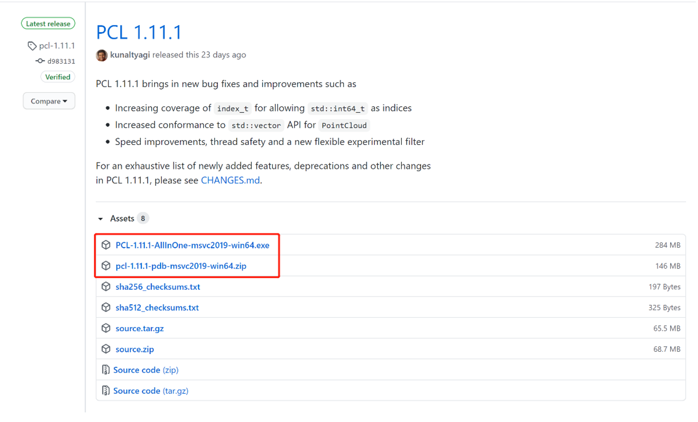                            
>
> ​                                                               图 4-2-18：PCL 1.11.1 下载界面
>
> step 2：安装 PCL-1.11.1-AllInOne-msvc2019-win64.exe，步骤与之前介绍的 PCL-1.9.1-AllInOne-msvc2017-win64.exe 基本一致，这里不再赘述。安装完成后，把 pcl-1.11.1-pdb-msvc2019-win64.zip 解压后的 *.pdb文件复制到 “...\PCL 1.11.1\bin” 目录中。
>
> step 3：打开 “...\PCL 1.11.1\3rdParty\OpenNI2” 目录，双击 OpenNI-Windows-x64-2.2.msi 并选择安装路径为 "...\PCL 1.11.1\3rdParty\OpenNI2"
>
> PS：如果提示已安装，目录下却没有文件，查看下面的链接以解决此问题
>
> https://www.pianshen.com/article/89511548300/
>
> step 4：设置环境变量，与之前 PCL 1.9.1 基本一致，路径添加如下：
>
> 注意：C:\Program Files\ 是根据我们自己安装 PCL 时设置的路径，根据自己的情况修改即可，后文中出现的该路径同理。
>
> 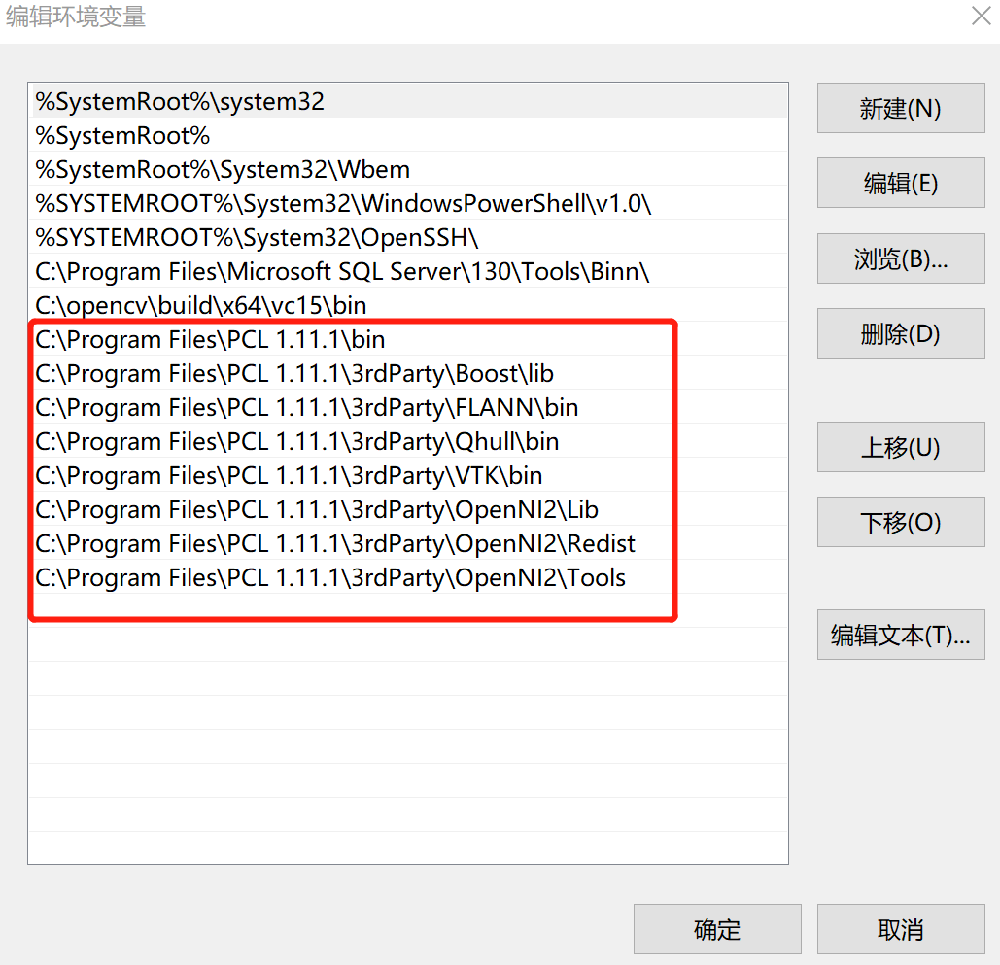
>
> ​                                                                  图 4-2-19：环境变量设置
>
> step 5：在具体的 C++ 项目中配置环境（注意：从 step 5 开始的每一步都要在新建一个项目时重新进行一次）。首先在 Visual Studio 2019 中创建一个新项目，与 Visual Studio 2017 类似，创建成功后选择 Release 和 x64：
>
> 
>
> ​                                                                 图 4-2-20：Release 与 x64 
>
> step 6：设置属性。属性查看与 VS 2017 一致。
>
> step 7：打开属性页，设置 VC++ 目录 —— 包含目录
>
> 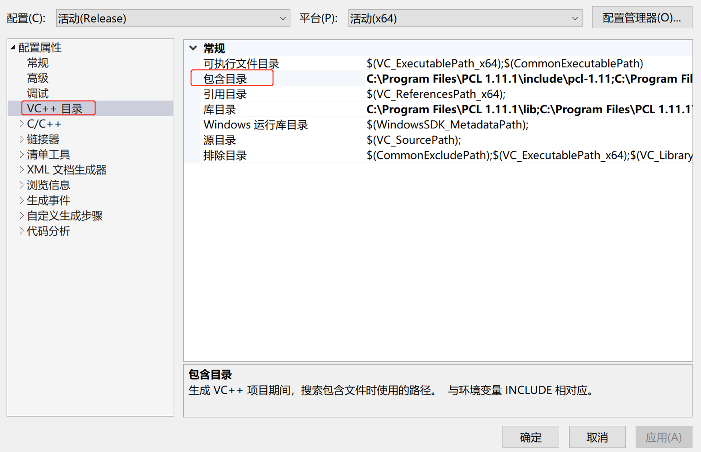
>
> ​                                                                 图 4-2-21：包含目录添加 1
>
> 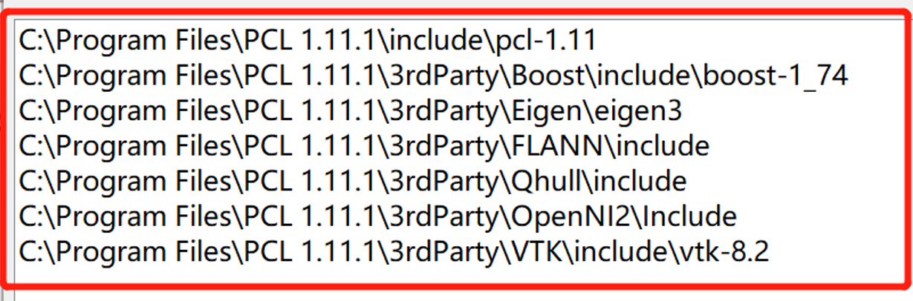
>
> ​                                                                 图 4-2-22：包含目录添加 2
>
> step 8：打开属性页，设置 VC++目录 —— 库目录
>
> 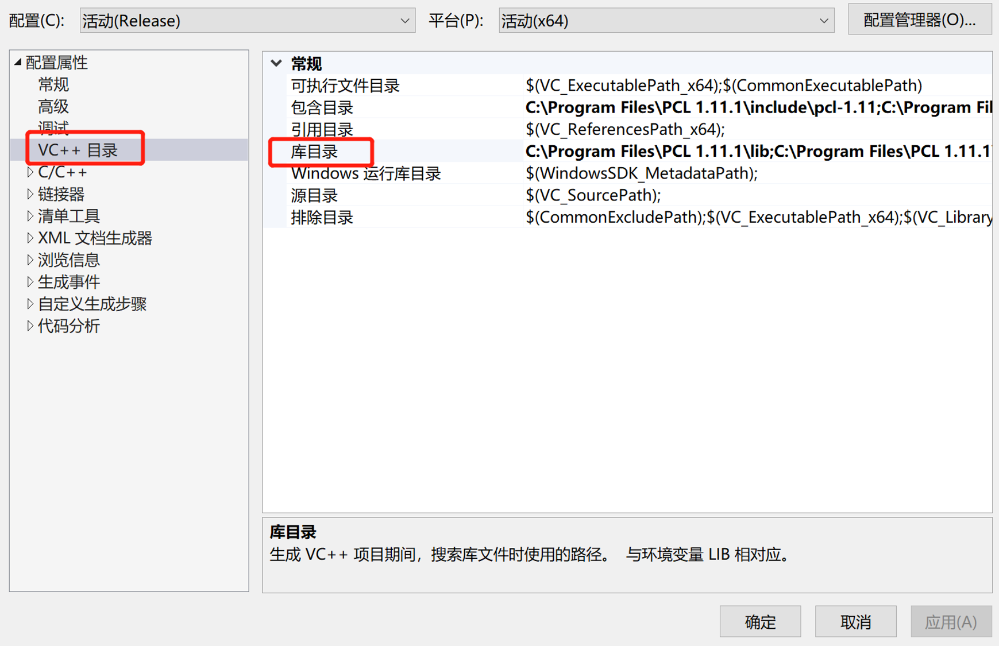
>
> ​                                                                   图 4-2-23：库目录添加 1
>
> 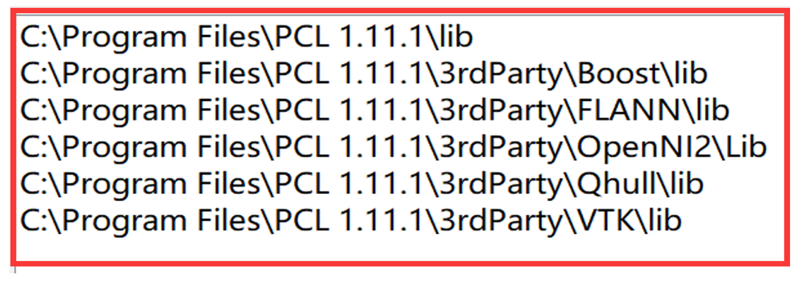
>
> ​                                                                   图 4-2-24：库目录添加 2
>
> step 9：C/C++ — 常规 — SDL 检查 — 否：
>
> 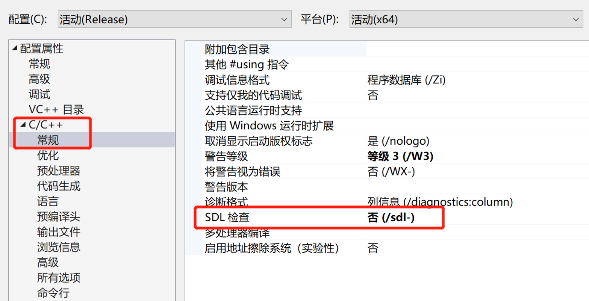
>
> ​                                                                       图 4-2-25：SDL 检查
>
> step 10：链接器 — 输入 — 附加依赖项 — 添加 PCL 和 VTK 的相关 lib 文件：
>
> 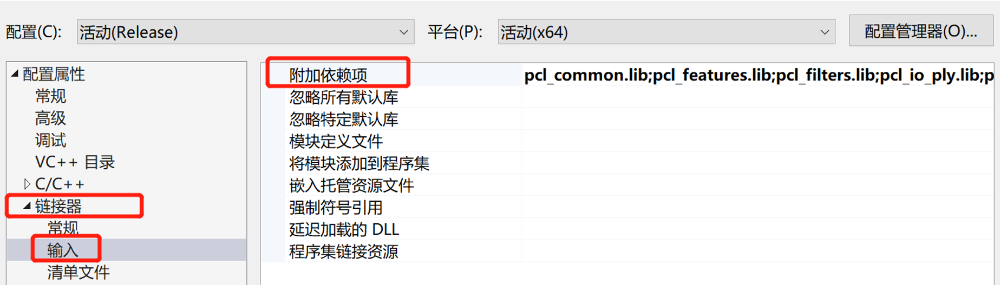
>
> ​                                                                      图 4-2-26：附加依赖项
>
> 需要添加的附加依赖项如下，与 PCL 1.9.1 版本略有不同：
>
> ```
> pcl_common.lib
> pcl_features.lib
> pcl_filters.lib
> pcl_io_ply.lib
> pcl_io.lib
> pcl_kdtree.lib
> pcl_keypoints.lib
> pcl_ml.lib
> pcl_octree.lib
> pcl_outofcore.lib
> pcl_people.lib
> pcl_recognition.lib
> pcl_registration.lib
> pcl_sample_consensus.lib
> pcl_search.lib
> pcl_segmentation.lib
> pcl_stereo.lib
> pcl_surface.lib
> pcl_tracking.lib
> pcl_visualization.lib
> vtkChartsCore-8.2.lib
> vtkCommonColor-8.2.lib
> vtkCommonComputationalGeometry-8.2.lib
> vtkCommonCore-8.2.lib
> vtkCommonDataModel-8.2.lib
> vtkCommonExecutionModel-8.2.lib
> vtkCommonMath-8.2.lib
> vtkCommonMisc-8.2.lib
> vtkCommonSystem-8.2.lib
> vtkCommonTransforms-8.2.lib
> vtkDICOMParser-8.2.lib
> vtkDomainsChemistry-8.2.lib
> vtkDomainsChemistryOpenGL2-8.2.lib
> vtkdoubleconversion-8.2.lib
> vtkexodusII-8.2.lib
> vtkexpat-8.2.lib
> vtkFiltersAMR-8.2.lib
> vtkFiltersCore-8.2.lib
> vtkFiltersExtraction-8.2.lib
> vtkFiltersFlowPaths-8.2.lib
> vtkFiltersGeneral-8.2.lib
> vtkFiltersGeneric-8.2.lib
> vtkFiltersGeometry-8.2.lib
> vtkFiltersHybrid-8.2.lib
> vtkFiltersHyperTree-8.2.lib
> vtkFiltersImaging-8.2.lib
> vtkFiltersModeling-8.2.lib
> vtkFiltersParallel-8.2.lib
> vtkFiltersParallelImaging-8.2.lib
> vtkFiltersPoints-8.2.lib
> vtkFiltersProgrammable-8.2.lib
> vtkFiltersSelection-8.2.lib
> vtkFiltersSMP-8.2.lib
> vtkFiltersSources-8.2.lib
> vtkFiltersStatistics-8.2.lib
> vtkFiltersTexture-8.2.lib
> vtkFiltersTopology-8.2.lib
> vtkFiltersVerdict-8.2.lib
> vtkfreetype-8.2.lib
> vtkGeovisCore-8.2.lib
> vtkgl2ps-8.2.lib
> vtkglew-8.2.lib
> vtkGUISupportMFC-8.2.lib
> vtkhdf5-8.2.lib
> vtkhdf5_hl-8.2.lib
> vtkImagingColor-8.2.lib
> vtkImagingCore-8.2.lib
> vtkImagingFourier-8.2.lib
> vtkImagingGeneral-8.2.lib
> vtkImagingHybrid-8.2.lib
> vtkImagingMath-8.2.lib
> vtkImagingMorphological-8.2.lib
> vtkImagingSources-8.2.lib
> vtkImagingStatistics-8.2.lib
> vtkImagingStencil-8.2.lib
> vtkInfovisCore-8.2.lib
> vtkInfovisLayout-8.2.lib
> vtkInteractionImage-8.2.lib
> vtkInteractionStyle-8.2.lib
> vtkInteractionWidgets-8.2.lib
> vtkIOAMR-8.2.lib
> vtkIOAsynchronous-8.2.lib
> vtkIOCityGML-8.2.lib
> vtkIOCore-8.2.lib
> vtkIOEnSight-8.2.lib
> vtkIOExodus-8.2.lib
> vtkIOExport-8.2.lib
> vtkIOExportOpenGL2-8.2.lib
> vtkIOExportPDF-8.2.lib
> vtkIOGeometry-8.2.lib
> vtkIOImage-8.2.lib
> vtkIOImport-8.2.lib
> vtkIOInfovis-8.2.lib
> vtkIOLegacy-8.2.lib
> vtkIOLSDyna-8.2.lib
> vtkIOMINC-8.2.lib
> vtkIOMovie-8.2.lib
> vtkIONetCDF-8.2.lib
> vtkIOParallel-8.2.lib
> vtkIOParallelXML-8.2.lib
> vtkIOPLY-8.2.lib
> vtkIOSegY-8.2.lib
> vtkIOSQL-8.2.lib
> vtkIOTecplotTable-8.2.lib
> vtkIOVeraOut-8.2.lib
> vtkIOVideo-8.2.lib
> vtkIOXML-8.2.lib
> vtkIOXMLParser-8.2.lib
> vtkjpeg-8.2.lib
> vtkjsoncpp-8.2.lib
> vtklibharu-8.2.lib
> vtklibxml2-8.2.lib
> vtklz4-8.2.lib
> vtklzma-8.2.lib
> vtkmetaio-8.2.lib
> vtkNetCDF-8.2.lib
> vtkogg-8.2.lib
> vtkParallelCore-8.2.lib
> vtkpng-8.2.lib
> vtkproj-8.2.lib
> vtkpugixml-8.2.lib
> vtkRenderingAnnotation-8.2.lib
> vtkRenderingContext2D-8.2.lib
> vtkRenderingContextOpenGL2-8.2.lib
> vtkRenderingCore-8.2.lib
> vtkRenderingExternal-8.2.lib
> vtkRenderingFreeType-8.2.lib
> vtkRenderingGL2PSOpenGL2-8.2.lib
> vtkRenderingImage-8.2.lib
> vtkRenderingLabel-8.2.lib
> vtkRenderingLOD-8.2.lib
> vtkRenderingOpenGL2-8.2.lib
> vtkRenderingVolume-8.2.lib
> vtkRenderingVolumeOpenGL2-8.2.lib
> vtksqlite-8.2.lib
> vtksys-8.2.lib
> vtktheora-8.2.lib
> vtktiff-8.2.lib
> vtkverdict-8.2.lib
> vtkViewsContext2D-8.2.lib
> vtkViewsCore-8.2.lib
> vtkViewsInfovis-8.2.lib
> vtkzlib-8.2.lib
> ```


#### 4-2-2：利用 cmake 进行代码编译

另一种运行方法是借助 cmake 来编译 PCL 中的一些算法代码，什么是 cmake？

“CMake is an open-source, cross-platform family of tools designed to build, test and package software. CMake is used to control the software compilation process using simple platform and compiler independent configuration files, and generate native makefiles and workspaces that can be used in the compiler environment of your choice.”[^1]

CMake 用于使用简单平台和独立于编译器的配置文件来控制软件编译过程，方便跨 IDE 运行代码。因为它只需要一个代码文件和 CMakeList.txt 文件。

具体操作步骤如下：

1. **下载并安装 VS 2017**
2. **下载并安装 PCL 1.9.1**
3. **下载并安装 cmake**
4. **通过 cmake 进行编译**

其中，**“下载 VS 2017”** 与 **”下载并安装 PCL 1.9.1“** 与 4-2-1 中一致，只不过  **”下载并安装 PCL 1.9.1“** 的第三部分（PCL 1.9.1 环境配置）不需要进行。

> 注意：
>
> - 步骤 1-3 只需要进行一次，而步骤 4 每次编译一个新项目时都要进行一次；
> - 利用 cmake 进行编译时可以不用必须使用 2017 版本的 Visual Studio 和 1.9.1 版本的 PCL ，只需要在 cmake 设置时将版本对应正确即可。

##### 步骤 1：见 [4-2-1](# —— VS 2017)

##### 步骤 2：见 [4-2-1](# —— PCL 1.9.1)

下面重点介绍我们没有接触过的步骤 3 和步骤 4：

##### 步骤 3：下载并安装 cmake

###### step 3-1：

cmake 下载网址 https://cmake.org/download/，64 位的 Windows 系统下载图 4-2-27 黑色框中的安装包（对应自己电脑的系统版本即可）

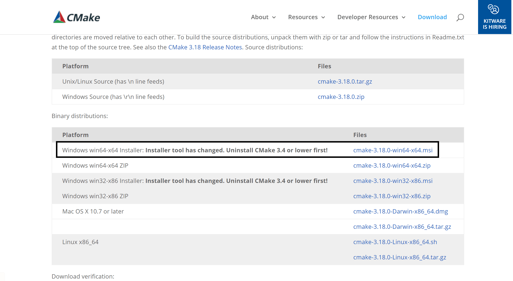

​                                                                          图 4-2-27：cmake 下载示意图

###### step 3-2：

双击下载好的 msi 文件，按照下图所示进行安装：


​                                                                                 图 4-2-28：安装 1


​                                                                                 图 4-2-29：安装 2

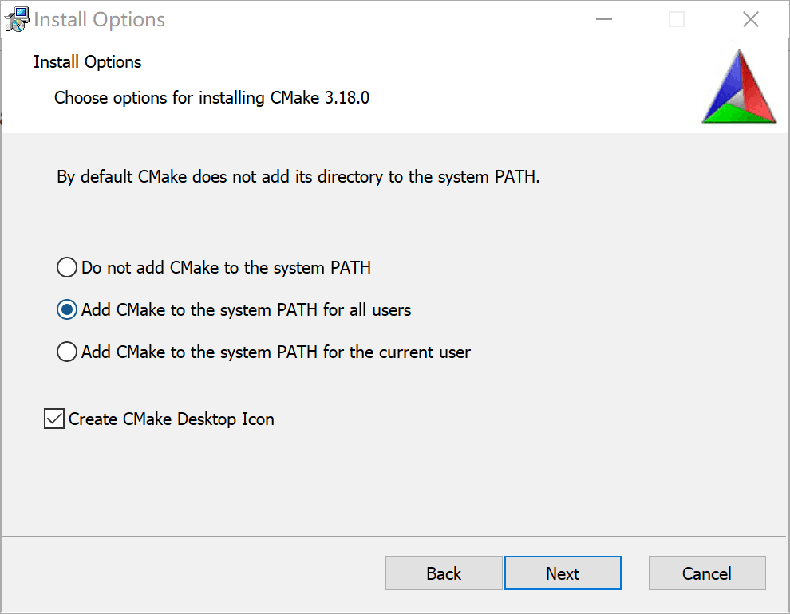

​                                                                                   图 4-2-30：安装 3


​                                                                                 图 4-2-31：安装 4


​                                                                                 图 4-2-32：安装 5


​                                                                                 图 4-2-33：安装 6


​                                                                                 图 4-2-34：安装 7

至此，cmake 的安装全部完成。

##### 步骤 4：利用 cmake 进行代码编译

> 注意：步骤 4 在每次编译一个新项目时都要重复进行

###### step 4-1：

在你要进行 cpp 代码编写的文件夹下新建 **cmake_bin** 和 **source** 文件夹


​                                                                    图 4-2-35：新建文件夹

###### step 4-2：

在 source 文件夹下新建你要运行的代码文件 **.cpp**（这里举例 **test1.cpp**） 和 cmake 配置文件 **CMakeList.txt** 文件（**.cpp** 文件和 **CMakeList.txt** 在教程文件夹中）

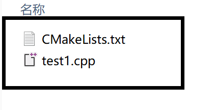

​                                                     图 4-2-36：新建 **.cpp** 和 **CMakeList.txt** 文件

**.cpp** 文件是我们要运行的点云算法，该算法内容会在后面详细讲解，这里只演示如何借助 cmake 运行；

其中比较重要的是 **CMakeList.txt** 书写规则，如图 4-2-37：

参考网址：https://pcl.readthedocs.io/projects/tutorials/en/latest/using_pcl_pcl_config.html#using-pcl-pcl-config

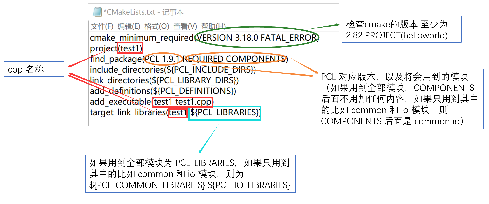

​                                                                图 4-2-37：**CMakeList.txt** 文件书写规范

###### step 4-3：

打开安装好的 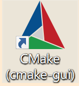，设置相关路径：

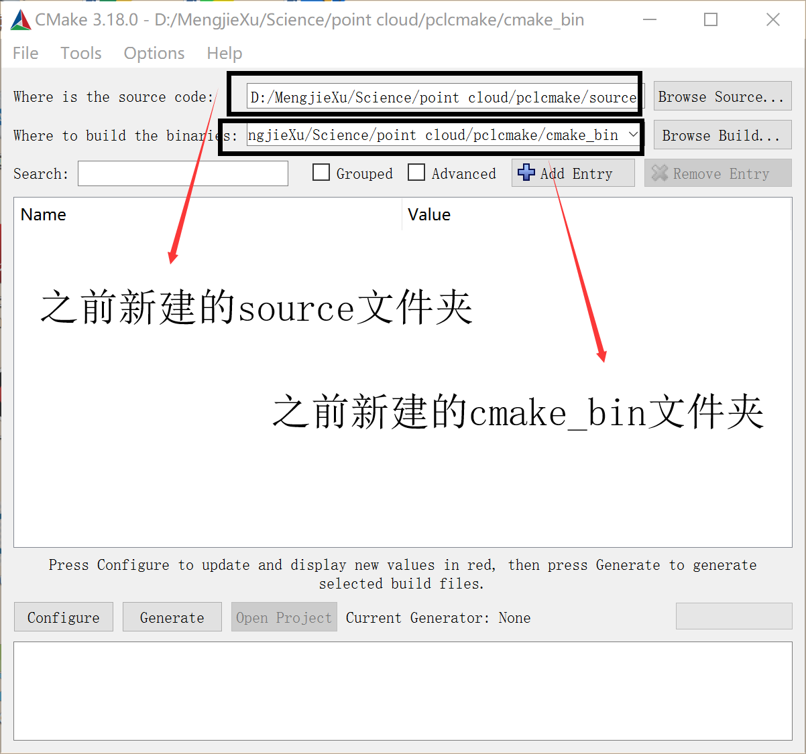

​                                                                             图 4-2-38：路径选择

###### step 4-4：

Configure

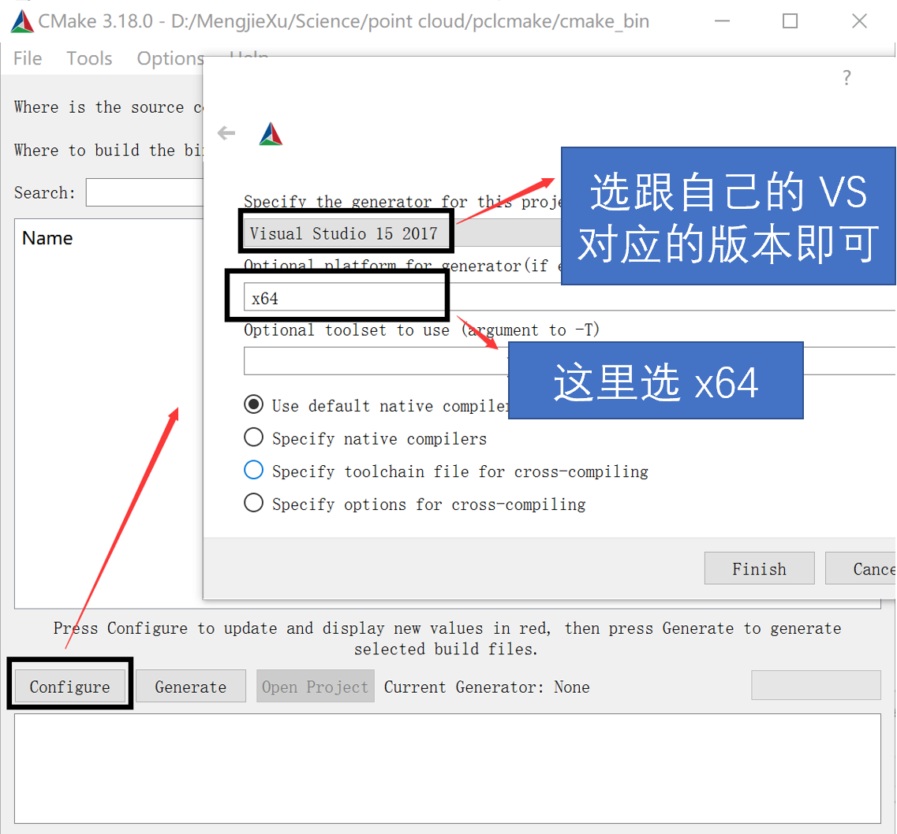

​                                                                     图 4-2-39：Configure 以及设置

等待编译结束，出现 **Configuring done**：


​                                                                      图 4-2-40：Configure 完成

###### step 4-5：

Generate 运行文件，直到 **Configuring done** 下方显示 **Generating done**


​                                                                                  图 4-2-41：生成

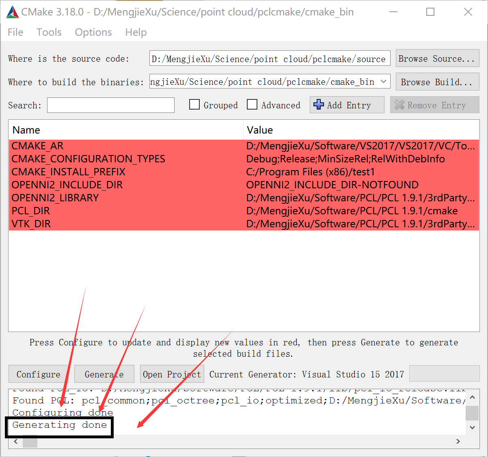

​                                                                         图 4-2-42：生成完毕

###### step 4-6：

经过上述操作后，cmake_bin 中会生成一系列文件，找到 cmake_bin 文件夹下新生成的 **ALL_BUILD.vcxproj** 文件（图 4-2-43）：


​                                                               图 4-2-43：**ALL_BUILD.vcxproj** 文件

用 Visual Studio 打开，并右键点击 ALL_BUILD，选择生成，进行该文件的调试：

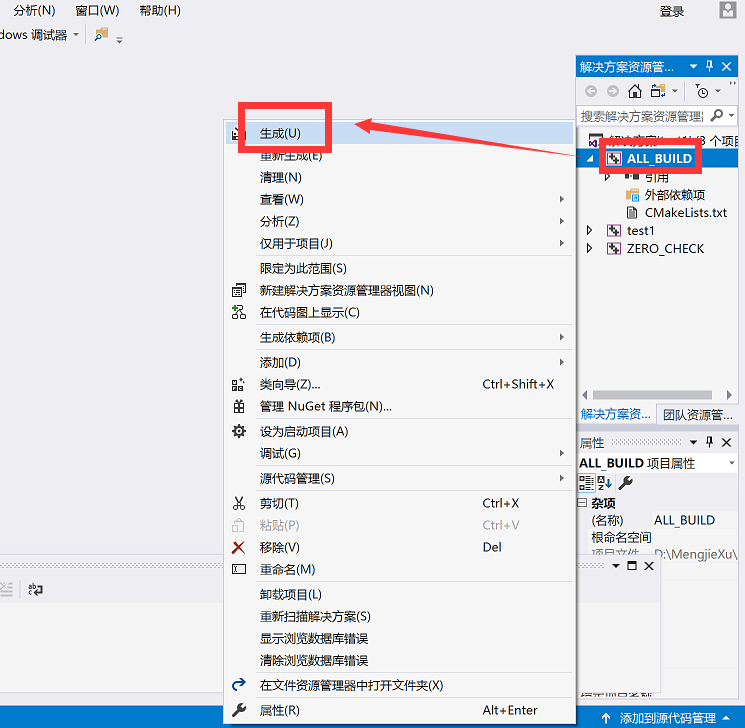

​                                                         图 4-2-44：调试 **ALL_BUILD.vcxproj** 文件

调试成功视图如下：


​                                                         图 4-2-45：调试 **ALL_BUILD.vcxproj** 文件成功

###### step 4-7：

调试完成后点击 cmake_bin 文件夹下的 Debug 文件夹，会出现 **test1.exe** 文件，如图 4-2-46。此时点击 win+R 键，查找 cmd，按照图 4-2-47 即可看到运行结果：

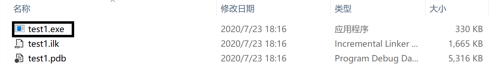

​                                                                           图 4-2-46：exe 文件生成


​                                                                       图 4-2-47：cmake 编译完成

**test1.exe** 执行的代码内容是根据随机数生成一个包含五个点的点云，保存在 **test_pcd.pcd** 文件中，并将其数据输出，4-3 I/O 中会有详细介绍。

到这里，我们就可以成功使用 PCL 库中算法来处理点云文件了。下面我们具体讲解如何调用 PCL 的算法编写代码，处理点云。


### 4-3 ： I/O

从此部分开始介绍 PCL 中对点云的具体处理以及一些算法，需要读者具备基础的 C++ 编程知识；除此之外，对 PCL 的算法的深入理解，很多是需要建立在有一定的线性代数和机器视觉基础上的。建议读者自行学习。每小节的完整代码在 [附录](# 附录) 中。

读取和写入是处理任何文件的最基础问题。同样地，利用 PCL 处理点云文件，首先需要读取点云文件，并学会将处理后的点云文件输出并保存。因此本节介绍点云 I/O（ Input/Output），点云输入和输出。

#### 4-3-1 ： 如何读取 pcd 文件：

因为 pcd 文件是 PCL 的官方指定文件格式，因此本部分介绍 pcd 文件在 PCL 中的读取：

##### 实例：

以 **bunny.pcd** （见教程文件夹）为例，此文件是一只兔子的正面，如图 4-3-1 所示，代码  **pcd_read.cpp** 目的是读取 **bunny.pcd** 中的数据。完整代码 **pcd_read.cpp** 见 [附录——4.3.1 如何读取 PCD 文件](# 4.3.1：如何读取 PCD 文件： )：


​                                                                               图 4-3-1：**bunny.pcd**

下面是 **pcd_read.cpp** 代码详解：

下面三行是读取一个点云文件需要用到的头文件。

```C++
#include <iostream>              // 标准 C++ 库中的输入输出类相关头文件
#include <pcl/io/pcd_io.h>       // pcd 读写类相关的头文件
#include <pcl/point_types.h>     // pcl 中支持的点类型的头文件
```

其中：< iostream >意思是输入（**i**n）输出（**o**ut）流（**stream**）。

> 头文件是什么？
>
> 头文件作为一种包含功能函数、数据接口声明的载体文件，主要用于保存程序的声明[^2][^3]。
>
> 头文件的内容也是 C++ 的源代码，与 .cpp 文件的内容类似，但头文件不用被编译。我们把所有会用到的函数声明全部放进一个头文件中，当某一个 .cpp 源文件需要它们时，它们就可以通过一个宏命令 “#include” 包含进这个 .cpp 文件中，从而把它们的内容合并到 .cpp 文件中去。当 .cpp 文件被编译时，这些被包含进去的头文件的作用便发挥了[^4]
>
> 其中，include 是一个宏命令，它在编译器预编译的时候就会起作用。#include 的作用是把它后面那个文件的内容直接复制到当前的文件中，就是简单的文本替换。因此，pcd_read.cpp 文件中的 “#include <pcl/io/pcd_io.h>”，在编译之前就会被替换成 pcd_io.h 文件的内容。即在编译过程将要开始的时候，pcd_read.cpp 内容已经发生了改变[^4]。

------


从此部分开始进入 main 函数主体部分，后面所有章节的代码也是如此：头文件部分导入结束后进入 main 函数主体部分：

```C++
int
main()
{
......   ——书写后续代码的位置
}
```

------


下面一行代码创建一个 PointCloud< PointXYZ > boost 共享指针并进行实例化，通俗来说就是创建了一个包含每个点的 xyz 信息的点云对象 cloud（点云对象名称可自拟，这里命名为 cloud）。

```C++
  pcl::PointCloud<pcl::PointXYZ>::Ptr cloud (new pcl::PointCloud<pcl::PointXYZ>);
```

其中，PointXYZ 是 PCL 中的一种可用的 Point 类型，包括以下 25 种。大家可以根据下面内容进行查找，新建一个对象时可以使用恰当的 Point 类型：

```
1. PointXYZ：只包含每个点的三维 XYZ 坐标信息；
2. PointXYZI：包含每个点的 XYZ 坐标 + Indensity（I）；
3. PointXYZRGBA：包含每个点的 XYZ 坐标和 RGBA 信息（RGBA 信息被包含在一个整型变量中）；
4. PointXYZRGB：包含每个点的 XYZ 坐标和 RGB 信息（RGB 信息被包含在一个浮点型变量中）；
5. PointXY：简单的二维 X-Y point 结构；
6. InterestPoint：每个点的 XYZ 坐标 + strength（关键点强度的测量值）；
7. Normal：法线方向 + 对应曲率的测量值；
8. PointNormal：XYZ 信息 + 法线方向 + 曲率；
9. PointXYZRGBNormal：XYZ 信息 + RGB（1 个 float）+法线方向 + 曲率；
10. PointXYZINormal： XYZ 信息 + Intensity + 法线方向 + 曲率；
11. PointWithRange：XYZ 信息 + 从所获得视点到采样点的距离测量值；
12. PointWithViewPoint：XYZ 信息 + 所获得的视点；
13. MomentInvariants：包含采样曲面上面片 3 个不变矩的 point 类型，描述面片质量分布情况；
14. PrincipalRadiiRSD：包含曲面块上两个 RSD 半径，r_min，r_max；
15. Boundary：一个点是否位于曲面边界上的简单 point 类型；
16. PrincipalCurvatures：给定点主曲率；
17. PFHSignature125：给定点的 PFH（点特征直方图）；
18. FPFHSignature33：给定点的 FPFH（快速点特征直方图）；
19. VFHSignature308：给定点的 VFH（视点特征直方图）；
20. Narf36：给定点的 NARF（归一化对齐半径特征）；
21. BorderDescription：给定点边界类型；
22. IntensityGradient：给定点强度的梯度；
23. Histogram：一般用途的 n 维直方图；
24. PointWithScale：XYZ 信息 + 某点应用于几何操作的尺度；
25. PointSurfel：XYZ 信息 +法线信息 + RGB + 半径 + 可信度 + 曲率；
```

------


下面代码从计算机路径 (将 ... 替换为文件所在路径) 中加载 PointCloud 数据。

```C++
 if (pcl::io::loadPCDFile<pcl::PointXYZ> (".../bunny.pcd", *cloud) == -1) 
  {
    PCL_ERROR ("Couldn't read file bunny.pcd \n");
    return (-1);
  }
```

其中：

“loadPCDFile” 就是加载 PCD 文件；

“loadPCDFile” 后面的 < PointXYZ > 说明读取的是文件中每个点的 xyz 信息；

< PointXYZ > 后面括号内：（要读取的文件，文件被保存到的点云对象名称），这里将我们的 **bunny.pcd** 文件保存到上一句代码创建的 cloud 点云对象中。因为 cloud 是一个指针类型的点云对象，因此 cloud 前面加一个 * ；

若成功加载则不输出任何内容，继续下面的代码；

若出现 “ 文件未被创建/路径错误/文件失效 ” 的情况之一，则 pcl::io::loadPCDFile < pcl::PointXYZ > ("File Path/bunny.pcd", *cloud) == -1成立，会输出 "Couldn't read file bunny.pcd"。

------


下面代码输出 **bunny.pcd** 的点数，以及通过 for 循环输出每个点的 x，y，z 坐标值。

```C++
std::cout << "Loaded "
            << cloud->width * cloud->height     // 点云文件的点数
            << " data points from bunny.pcd with the following fields: "
            << std::endl;
  for (std::size_t i = 0; i < cloud->points.size (); ++i)
    std::cout << "    " << cloud->points[i].x      // 每个点的 x 坐标值
              << " "    << cloud->points[i].y      // 每个点的 y 坐标值
              << " "    << cloud->points[i].z      // 每个点的 z 坐标值
              << std::endl;  
```

其中：

"std::cout <<"  后面是输出的内容，输出内容可以用 "<<" 连接；

cloud->width 是点云 cloud 的宽度，cloud->height 是点云 cloud 的高度，二者相乘就是点云 cloud 总数。cloud 中已经有了 **bunny.pcd** 中的数据，因此输出的就是 **bunny.pcd** 的相应信息；

"std::endl" 是每个输出部分的结束标志；

cloud->points.size() 是点云对象 cloud 中的点的总数；

cloud->points[i].x 是 cloud 中序号为 i 的点的 x 坐标值；

cloud->points[i].y 是 cloud 中序号为 i 的点的 y 坐标值；

cloud->points[i].z 是 cloud 中序号为 i 的点的 z 坐标值。

------


如果读取成功，则会输出：

```C++
Loaded 397 data points from bunny.pcd with the following fields:
    0.0054216 0.11349 0.040749
    -0.0017447 0.11425 0.041273
    -0.010661 0.11338 0.040916
    0.026422 0.11499 0.032623
    0.024545 0.12284 0.024255
    0.034137 0.11316 0.02507
......  // 省略号代表显示的剩余数据，但在这里作为示例，就不全部展示了
```

其中：

第一行输出的 397 即通过 cloud->width * cloud->height 得到的；

其余的绿色数据部分就是输出的 cloud 也就是 **bunny.pcd** 中的每个点的 xyz 坐标值。

图 4-3-2 展示控制台打印出的部分结果（前 10 行数据）：


​                                                                      图 4-3-2：运行结果部分截图

------


如果 **bunny.pcd** 文件不存在，则会显示：


```c++
Couldn't read file bunny.pcd
```


#### 4-3-2 ：如何写入 pcd 文件：

##### 实例：

本节将介绍如何将点云数据保存在一个新的 pcd 文件中。下面我们讲解一个例子，目的是将随机生成的 5 个数据点保存为一个新的 pcd 文件。

下面是代码详解，完整代码 **pcd_write.cpp** 见 [附录——4.3.2 如何写入 pcd 文件](# 4.3.2：如何写入 PCD 文件：)

下面三行代码是写入 pcd 文件需要用到的头文件。


```c++
#include <iostream>             // 标准 C++ 库中的输入输出类相关头文件
#include <pcl/io/pcd_io.h>      // pcd 读写类相关的头文件
#include <pcl/point_types.h>    // pcl 中支持的点类型的头文件
```

------


下面一行代码描述我们将要实例化的模板类 PointCloud，将其实例化为 cloud 点云对象。每一个点的数据类型都被设置成 “pcl:: PointXYZ”，表示这个点云文件中包含点的 x，y，z 信息。

4-3-1 中介绍的是一种通过**指针创建**的方式，而我们这里是一种**普通创建**方法：


```C++
  pcl::PointCloud<pcl::PointXYZ> cloud;
```

​       下面总结一下点云对象创建的两种方法，都是创建了名为 cloud 的点云对象：

​      **A.  指针创建：**

```c++
  pcl::PointCloud<pcl::PointXYZ>::Ptr cloud (new pcl::PointCloud<pcl::PointXYZ>);
```

​      **B. 普通创建：**

```
  pcl::PointCloud<pcl::PointXYZ> cloud;
```

------


下面代码用随机点的值填充点云对象 cloud，并设置适当的参数（width、height、is_ dense）：

```C++
  // 填充点云数据
  cloud.width  = 5;   // 点云宽度，也即点云总数（无序点云）
  cloud.height = 1;   // 无序点云的代表（如果 height为 1, 则是无序点云）
  cloud.is_dense = false;    // 点云中包含 Inf/NaN
  cloud.points.resize (cloud.width * cloud.height);
  // 随机数赋值
  for (std::size_t i = 0; i < cloud.points.size (); ++i)
  {
    cloud.points[i].x = 1024 * rand () / (RAND_MAX + 1.0f);
    cloud.points[i].y = 1024 * rand () / (RAND_MAX + 1.0f);
    cloud.points[i].z = 1024 * rand () / (RAND_MAX + 1.0f);
  }
```

其中：

width 和 height 在之前讲解 pcd 文件内容格式时有过说明，分别对应点云的宽度和高度，且在不同点云中有不同的含义；

cloud.width 与 cloud->width 的区别：前者说明 cloud 是普通创建的，后者 cloud 是指针创建的，cloud.height、cloud.is_dense、cloud.points.resize()、cloud.points[i].x、cloud.points[i].y、cloud.points[i].z、cloud.points.size() 也是同理；

is_dense 则是用来判断 points 中的数据是否是有限的：有限为 true，有限的意思是点云中不包含 Inf/NaN 类型的数据，都是有限的数字数据。或者说是判断点云中的点是否包含  Inf/NaN 这种值（包含为 false）；

cloud.points.resize 是通过 width 和 height 设置 cloud 的结构；

------


下面一行代码把 PointCloud 对象数据存储在相应路径下的 **test_pcd. pcd** 文件中：

```C++
  pcl::io::savePCDFileASCII (".../test_pcd.pcd", cloud);
```

其中：

savePCDFileASCII 意思是将数据保存为编码方式是 ASCII 的 PCD 文件，括号内的第一个参数是新建文件的路径以及名称，第二个参数是点云对象名称（如果是指针类型创建的点云对象，则这里应该写 *cloud；如果是普通创建，则跟着里一样，写 cloud 即可）。

保存的 PCD 有四种格式：

savePCDFile：将点云保存为 PCD 文件，默认为 ASCII 格式；

savePCDFileASCII：将点云数据保存为 ASCII 格式的 PCD 文件；

savePCDFileBinary：将点云数据保存为 Uncompressed Binary 格式的 PCD 文件；

savePCDFileBinaryCompressed：将点云数据保存为 Compressed Binary 格式的PCD 文件。

------


下面代码输出存储的点云文件 **test_pcd.pcd** 的内容，包括点云的点数和每个点的 xyz  坐标值。


```C++
  std::cout << "Saved " << cloud.points.size () << " data points to test_pcd.pcd." << std::endl;   //输出点数

  for (std::size_t i = 0; i < cloud.points.size (); ++i)
    std::cout << "    " << cloud.points[i].x << " " 
                        << cloud.points[i].y << " " 
                        << cloud.points[i].z 
                        << std::endl;    //输出每个点的 x，y，z 坐标值
```

------


运行成功后的结果显示：


```C++
Saved 5 data points to test_pcd.pcd.
 1.28125 577.094 197.938
 828.125 599.031 491.375
 358.688 917.438 842.563
 764.5 178.281 879.531
 727.531 525.844 311.281
```

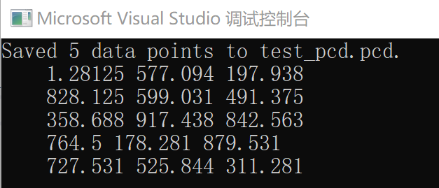

​                                                                         图 4-3-3：运行结果示意图

------


打开生成的 **test_pcd.pcd** 文件，可以看到文件内容如下，可以对照第三章介绍的文件格式中讲解的 PCD 内容进行理解：


```c++
# .PCD v0.7 - Point Cloud Data file format
VERSION 0.7
FIELDS x y z
SIZE 4 4 4
TYPE F F F
COUNT 1 1 1
WIDTH 5
HEIGHT 1
VIEWPOINT 0 0 0 1 0 0 0
POINTS 5
DATA ascii
1.28125 577.09375 197.9375
828.125 599.03125 491.375
358.6875 917.4375 842.5625
764.5 178.28125 879.53125
727.53125 525.84375 311.28125
```

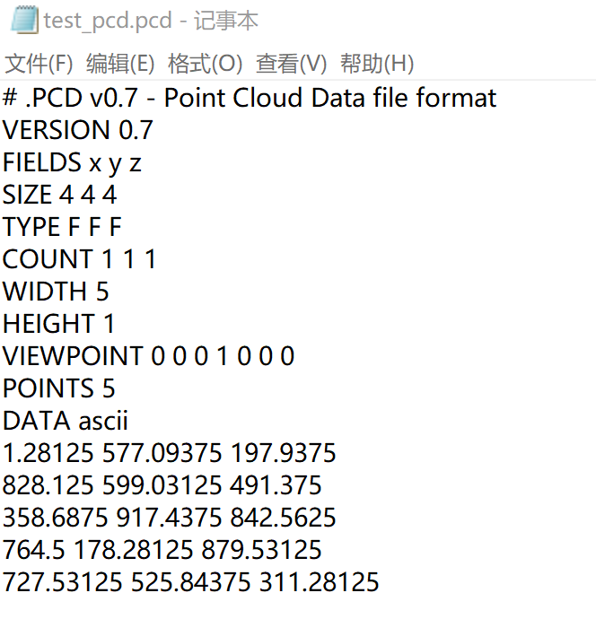

​                                                           图 4-3-4：**test_pcd.pcd** 用记事本打开


#### 4-3-3 ：如何连接两个 pcd 文件：

##### 分类：

连接文件，也就是合并文件，有时我们需要对多个文件进行合并。连接两个点云文件有两种情况：

① 两个数据集中字段的**类型和维度都相等**，连接两个点云的结果是点云文件**点的总数增加**；

② 两个数据集中**点的数目一样**，我们连接的是两个不同点云的字段（如颜色，法线，曲率等）（法线和曲率会在后面的算法中详细讲解），这样的连接的结果是点云文件的**点数没有变化**，但是**维度增加**了。

如图 4-3-5，左侧对应情况 1，两个数据集的维度都是 X，Y，Z，合并之后数目相加；右侧对应情况 2，点数都是 3，合并之后维度增加，为 X，Y，Z，N_x，N_y，N_z，curvature：

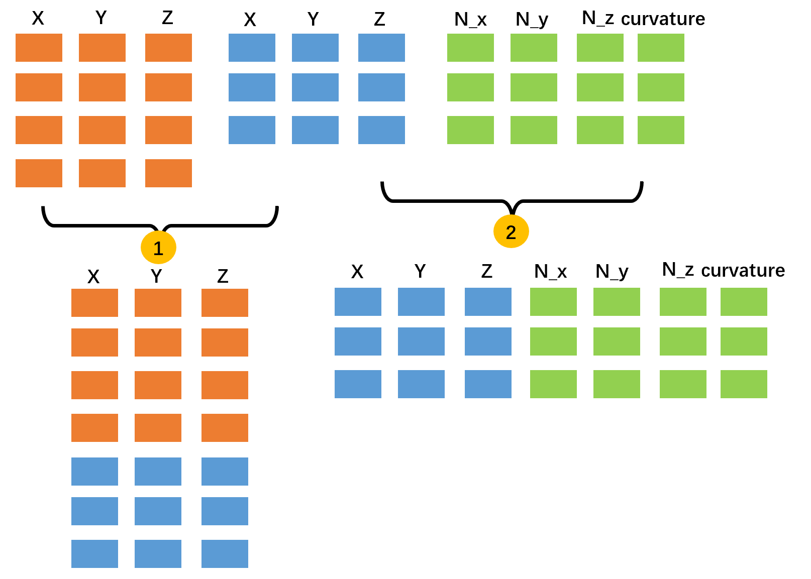

​                                                                图 4-3-5：两种连接情况示意图


##### 实例：

下面我们详解一个例子 **pcd_combine.cpp**，来介绍如何实现上述两种连接点云的方法，即如何连接 2 个点云使新点云点数增加；以及如何连接 2 个点云使新点云维度增加。完整代码见 [附录——连接两个 PCD 文件](# 4.3.3：如何连接两个 PCD 文件：)：

下面三行代码是连接两个 pcd 文件需要用到的头文件。


```c++
#include <iostream>              // 标准 C++ 库中的输入输出类相关头文件
#include <pcl/io/pcd_io.h>       // pcd 读写类相关的头文件
#include <pcl/point_types.h>     // pcl 中支持的点类型的头文件
```

------


下面代码初始化定义了五个点云对象，都是普通创建。


```c++
  // 新建五个有关的点云对象
  pcl::PointCloud<pcl::PointXYZ> cloud_a, cloud_b, cloud_c; 
  pcl::PointCloud<pcl::Normal> n_cloud_b;
  pcl::PointCloud<pcl::PointNormal> p_n_cloud_c;
```

其中：

cloud_a，cloud_b，cloud_c 是 pcl::PointXYZ 格式的点云对象，也即这三个点云对象包含点云的 x，y，z 坐标信息；

n_cloud_b 是 pcl::Normal 格式的点云对象，也即此点云对象包含点云的 normal 信息和 curvature 信息：normal 是指法线信息，包括法线的 x，y，z 坐标信息，curvature 是曲率；

p_n_cloud_c 是 pcl::PointNormal 格式的点云对象，也即此点云对象包含点云的 x，y，z 坐标信息、normal 信息和 curvature 信息；

------


下面三行代码通过设置点云 cloud_a 的 width，height，使用 resize 确定点云对象 cloud_a 中将要存放的点的结构以及个数。这里将 cloud_a，cloud_b 与 n_cloud_b 的 height 都设为 1，也就是这三个点云都是**无序点云**。


```c++
  // 设置点云对象 cloud_a 具体格式
  cloud_a.width = 5;
  cloud_a.height = cloud_b.height = n_cloud_b.height = 1;
  cloud_a.points.resize(cloud_a.width * cloud_a.height);
```

------


下面两行代码通过设置点云文件的 width，使用 resize 确定点云对象 cloud_b 中将要存放的点的个数（无序格式已在上面代码设置 cloud_a 的操作中一起设置，见设置点云对象 cloud_a 具体格式部分代码）。


```c++
  // 设置点云对象 cloud_b 具体格式
  cloud_b.width = 3;
  cloud_b.points.resize(cloud_b.width * cloud_b.height);
```

------


同 cloud_b 的设置一样，下面两行代码也是只设置了 n_cloud_b 的 width，因为无序格式已在设置 cloud_a 的操作中一起设置，见设置点云对象 cloud_a 具体格式部分代码。


```c++
   // 设置点云对象 n_cloud_b 具体格式
  n_cloud_b.width = 5;
  n_cloud_b.points.resize(n_cloud_b.width * n_cloud_b.height);
```

------


下面代码通过产生随机数和 for 循环的方式依次向已经设置好格式的点云对象 cloud_a，cloud_b 以及 n_cloud_b 中填充点云数据。

> 注意：虽然 n_cloud_b 的类型包含 normal 和 curvature，但这里为 n_cloud_b 赋值时并没有给出 curvature 的数值，所以生成的数据中只有 normal 的信息，没有 curvature 的信息。

cloud_a.points.size()、cloud_b.points.size()、n_cloud_b.points.size() 分别代表的是 cloud_a、cloud_b、n_cloud_b 的点云总数。


```c++
  // 填充点云对象 cloud_a, cloud_b, n_cloud_b
  for (std::size_t i = 0; i < cloud_a.points.size(); ++i)
  {
      cloud_a.points[i].x = 1024 * rand() / (RAND_MAX + 1.0f);
	  cloud_a.points[i].y = 1024 * rand() / (RAND_MAX + 1.0f);
	  cloud_a.points[i].z = 1024 * rand() / (RAND_MAX + 1.0f);
  }

  for (std::size_t i = 0; i < cloud_b.points.size(); ++i)
  {
	  cloud_b.points[i].x = 1024 * rand() / (RAND_MAX + 1.0f);
	  cloud_b.points[i].y = 1024 * rand() / (RAND_MAX + 1.0f);
	  cloud_b.points[i].z = 1024 * rand() / (RAND_MAX + 1.0f);
  }

  for (std::size_t i = 0; i < n_cloud_b.points.size(); ++i)
  {
   n_cloud_b.points[i].normal[0] = 1024 * rand() / (RAND_MAX + 1.0f);
   n_cloud_b.points[i].normal[1] = 1024 * rand() / (RAND_MAX + 1.0f);
   n_cloud_b.points[i].normal[2] = 1024 * rand() / (RAND_MAX + 1.0f);
  }
```

------


下面述代码把 cloud_a 和 cloud_b  的 x，y，z 数据和 n_cloud_b 法线的 x，y，z 数据显示输出：

```C++
// 输出点云信息
std::cout << "Cloud A: " << std::endl;
	for (std::size_t i = 0; i < cloud_a.points.size(); ++i)
		std::cout << "    " << cloud_a.points[i].x << " " 
                            << cloud_a.points[i].y << " " 
                            << cloud_a.points[i].z << std::endl;

	std::cout << "Cloud B: " << std::endl;
	for (std::size_t i = 0; i < cloud_b.points.size(); ++i)
		std::cout << "    " << cloud_b.points[i].x << " " 
                            << cloud_b.points[i].y << " " 
                            << cloud_b.points[i].z << std::endl;
	
	std::cout << "Cloud n_B: " << std::endl;
	for (std::size_t i = 0; i < n_cloud_b.points.size(); ++i)
		std::cout << "    " << n_cloud_b.points[i].normal[0] << " "                                           << n_cloud_b.points[i].normal[1] << " "                                           << n_cloud_b.points[i].normal[2] 
                            << std::endl;
```

其中：

n_cloud_b.points[i].normal[0] 代表 n_cloud_b 第 i 个点法线的 x 坐标值；

n_cloud_b.points[i].normal[1] 代表 n_cloud_b 第 i 个点法线的 y 坐标值；

n_cloud_b.points[i].normal[2] 代表 n_cloud_b 第 i 个点法线的 z 坐标值。

------


如果我们需要连接**点云个数**，下面代码把 cloud_a 和 cloud_b 连接在一起创建了 cloud_c。


```C++
    cloud_c  = cloud_a;    // 不改变 cloud_a 的数据，利用 cloud_c 进行后续加和
    cloud_c += cloud_b;    // cloud_c = cloud_c + cloud_b
```

------


如果要**连接字段**，下面代码通过 **pcl:: concatenateFields** 把 cloud_a 和 n_cloud_b 字段连接在一起创建了 p_n_cloud_c；

括号内前两个参数是要进行连接的点云文件，最后一个是结果文件。


```C++
    pcl::concatenateFields (cloud_a, n_cloud_b, p_n_cloud_c);
```

------


下面代码中的一段用来把 cloud_c 和 p_n_cloud_c 的内容显示在输出中。


```c++
    // 输出合并后的点云信息
    // 输出 cloud_c 每个点的 XYZ
	std::cout << "Cloud C: " << std::endl;
	for (std::size_t i = 0; i < cloud_c.points.size(); ++i)
		std::cout << "    " << cloud_c.points[i].x << " " 
                            << cloud_c.points[i].y << " " 
                            << cloud_c.points[i].z << " " 
                            << std::endl 
        
    // 输出 p_n_cloud_c 的 x，y，z 以及 normal 的 x，y，z
	std::cout << "Cloud p_n_C: " << std::endl;
	for (std::size_t i = 0; i < p_n_cloud_c.points.size(); ++i)
		std::cout << "    " << p_n_cloud_c.points[i].x << " " 
                            << p_n_cloud_c.points[i].y << " " 
                            << p_n_cloud_c.points[i].z << " " 
                            << p_n_cloud_c.points[i].normal[0] << " "                                         << p_n_cloud_c.points[i].normal[1] << " "                                         << p_n_cloud_c.points[i].normal[2] 
                            << std::endl;  
```

------


程序运行成功后会显示：

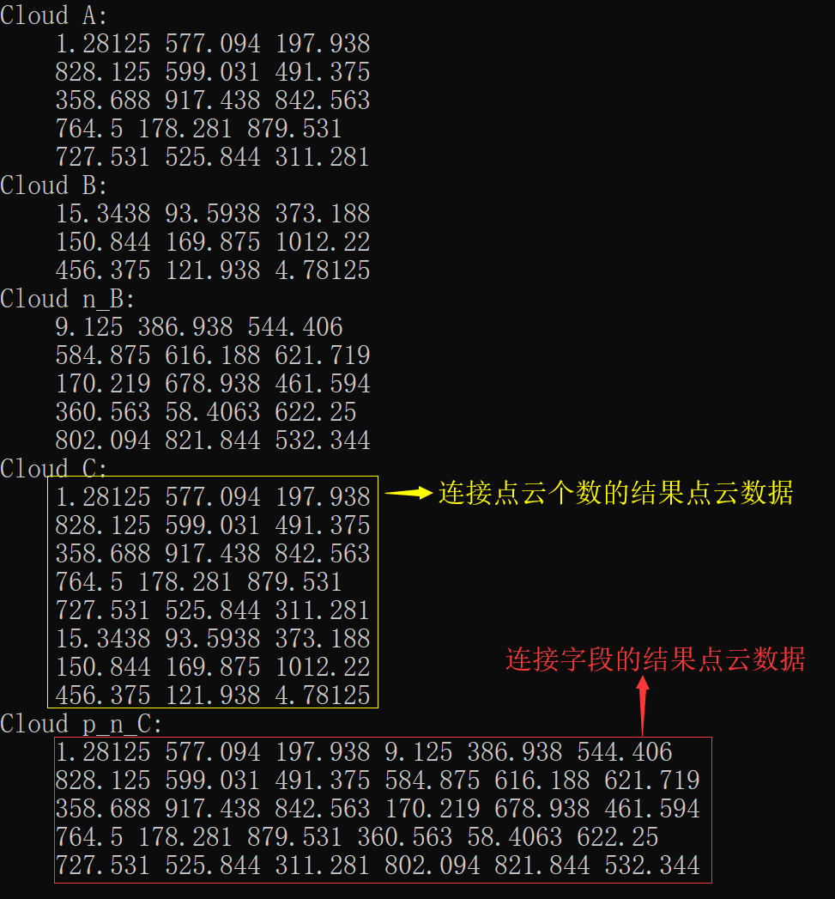

​                                                                          图 4-3-6 ：运行结果

如图 4-3-6：

- 黄框内就是我们说的连接点云个数，最终结果就是点数增加，而维度依旧是三个；

- 红框内是我们说的连接点云维度，最终结果是维度变成六个（coordinate_x、coordinate_y、coordinate_z、normal_x、normal_y、normal_z），而点数没有变化。


#### 4-3-4 ：TXT 与 PCD 文件的相互转换：

第三章介绍了几种点云文件格式，当我们在进行一些具体的点云处理时，可以根据需要对原始文件进行文件格式转换。这里主要介绍 txt 与pcd 之间的转换，其他转换在软件中就可以轻松完成（见第三章 3-8：不同文件格式的转换）。

##### TXT 转换为 PCD：

实例：将一个 txt 文件（这里我们只考虑包含每个点的 xyz 坐标信息）转换为 pcd 文件，以 **chair.txt** 为例（图 4-3-7，见教程文件夹）。注意，由于 **chair.txt** 不含颜色信息，当在 CloudComapre 中视图时会默认显示白色。如果你的画布背景是白色，则点云视图无法看到，这时参考第二章为点云设置颜色，区分点云和背景，方便视图。完整代码 **txt_to_pcd.cpp** 见 [附录——TXT 转换为 PCD](# 4.3.4：TXT 向 PCD 转换：)。


​                                                     图 4-3-7：**chair.txt** 在 CloudCompare 中的视图

下面几行代码是将 txt  转换为 pcd 需要的头文件，

using namespace std 意思是调用命名空间 std 内定义的所有标识符，比如 cout。有了 using namespace std，就不用写 std::cout，直接写 cout 即可：


```c++
#include <iostream>      // 标准 C++ 库中的输入输出类相关头文件
#include <fstream>       // 提供文件流操作 “F”ile stream
#include <pcl/io/pcd_io.h>   // pcd 读写类相关的头文件
#include <pcl/point_types.h>   // pcl 中支持的点类型的头文件
using namespace std;   // 命名空间 std
```

------


下面代码开始具体实现 txt 向 pcd 的转换：


1. 创建读取 txt 文件的对象 modelRead；
2. 利用普通创建方法创建点云存储对象 cloud（PointXYZ 表示该点云只包含 xyz 坐标信息）；
4. 创建点云每个点对象 pclPnt：

```c++
fstream modelRead;
pcl::PointCloud<pcl::PointXYZ> cloud;
pcl::PointXYZ pclPnt;
```

------


下面代码首先打开 **chair.txt** 文件，然后利用 while 循环将 txt 中的每个点对应 push 进点云中，按照 x，y，z 的顺序;

ios_base::in 代表将前面的 **chair.txt** 读入当前代码程序；

while(!modelRead.eof()) 一句用来判断当前文件指针是否已经到达文件结束 (**e**nd **o**f **f**ile) 位置，若未到达文件结尾则继续循环，否则结束循环；


```c++
modelRead.open(".../chair.txt", ios_base::in);
while(!modelRead.eof())
{
    modelRead >> pclPnt.x >> pclPnt.y >> pclPnt.z;
    cloud.push_back(pclPnt);
}
modelRead.close();
```

------


下面代码将 cloud 中的每个点保存到对应路径下的 **chair.pcd** 中。


```c++
pcl::io::savePCDFile(".../chair.pcd",cloud);
```

------


**chair.txt** 与 **chair.pcd** 示意图如下：

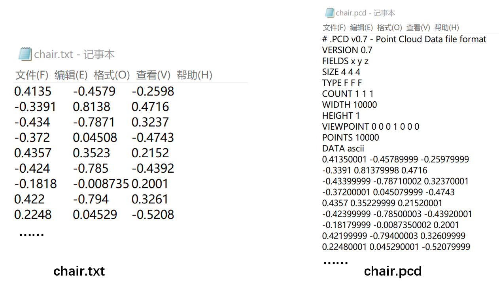

​                                                      图 4-3-8：**chair.txt** 与 **chair.pcd** 部分截图


##### PCD 转换为 TXT：

实例：将一个 pcd 文件（这里我们只考虑包含每个点的 xyz 坐标信息）转换为 txt 文件，以 **airplane.pcd** 为例（图 4-3-9，见教程文件夹）。注意，由于 **airplane.pcd** 不含颜色信息，当在 CloudComapre 中视图时会默认显示白色。如果你的画布背景是白色，则点云视图无法看到，这时参考第二章为点云设置颜色，区分点云和背景，方便视图）。完整代码 **pcd_to_txt.cpp** 见 [附录—— PCD 转换为 TXT](# 4.3.4：PCD 向 TXT 转换：)。


​                                                   图 4-3-9：**airplane.pcd** 在 CloudCompare 中的视图

下面代码是将 pcd 转换为 txt 需要用到的头文件，以及命名空间的调用：


```c++
#include <iostream>      // 标准 C++ 库中的输入输出类相关头文件
#include <fstream>       // 提供文件流操作 “F”ile stream
#include <pcl/io/pcd_io.h>   // pcd 读写类相关的头文件
#include <pcl/point_types.h>   // pcl 中支持的点类型的头文件
using namespace std;           // 命名空间 std
```

------


下面代码首先指针创建一个存储点云的 cloud 对象，将 **airplane.pcd** 加载到 cloud 中：


```c++
    pcl::PointCloud<pcl::PointXYZ>::Ptr cloud(new pcl::PointCloud<pcl::PointXYZ>);
    pcl::io::loadPCDFile<pcl::PointXYZ>(".../airplane.pcd", *cloud);
```

------


下面代码根据点云 cloud 的 size 设置 txt 文件中点的数目 Num，由于这里 pcd 文件只有 xyz 坐标信息，因此动态创建三个包含 Num 个 double 元素的数组，分别是 X、Y、Z；

double *X = new double[Num] {0}; 

double *Y = new double[Num] {0}; 

double *Z = new double[Num] {0};

上述三行是动态创建数组，因为普通创建方法是无法创建一个未知长度数组的，只有通过动态创建才可以实现创建 Num 个元素的数组，Num 是一个变量。


```c++
    int Num = cloud->points.size();
    double *X = new double[Num] {0};
    double *Y = new double[Num] {0};
    double *Z = new double[Num] {0};
```

------


下面代码通过 for 循环向创建的 X，Y，Z 数组中添加 cloud 内的点：


```c++
    for (size_t i = 0; i < cloud->points.size(); ++i)
	{
		X[i] = cloud->points[i].x;
		Y[i] = cloud->points[i].y;
		Z[i] = cloud->points[i].z;
	}
```

------


下面代码创建 **airplane.txt** ，并通过 for 循环将数组 X，Y，Z 的内容写入 txt 文件，完成转换：


```c++
    ofstream zos(".../airplane.txt");
    for (int i = 0; i < Num; i++)
	{
		zos << X[i] << " " << Y[i] << " " << Z[i] << " " << endl;
	}
```

------


**airplane.pcd** 与 **airplane.txt** 示意图如下：

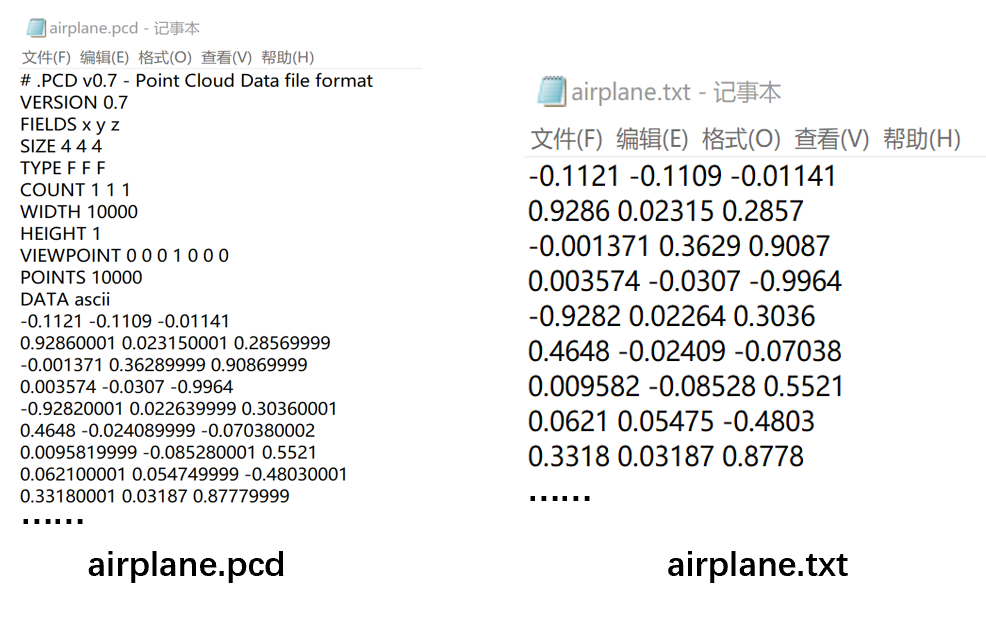

​                                                 图 4-3-10：**airplane.pcd** 与 **airplane.txt** 示意图


### 4-4 ：Range Image

本节我们将介绍一个新的概念：**Range Image，即深度图像**。顾名思义，深度图像就是包含**深度信息**的图像，什么是深度信息呢？

这里的深度信息是指摄像场景范围中某一点距离摄像机的**远近距离**（用颜色体现：如图 4-4-1，从红色到蓝色的距离对应 0.3m — 1.5m，越红越近；越蓝越远。红色的椅子和小狗是距离我们相对较近的物体，而黄绿色的桌子以及蓝色区域是距离我们相对较远的物体），所以深度图像包含的信息更加丰富（因此深度图像又称为距离图像）。图 4-4-1 是某个深度图像的示意图。

- 深度图像可以与点云数据相互转换：即点云可以转换为深度图像，深度图像也可以转化为点云。方便我们获取想要处理的数据格式。

- 深度图像与点云的区别在于前者含有深度信息而后者没有。

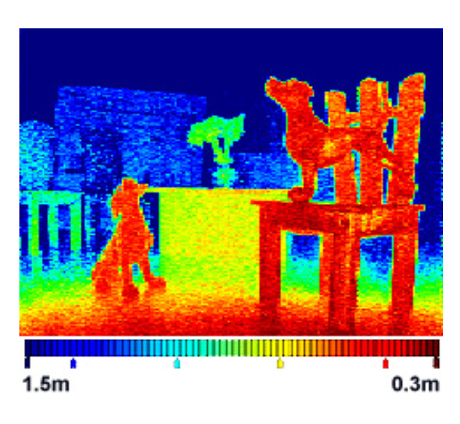

​                                                                   图 4-4-1：Range Image 示意图[^5]

看到这里大家可能会有疑问，三维点云中坐标的 xyz 数值也可以体现三维空间中的位置信息，从而计算出每个点到某个固定点的距离，为什么还需要深度图像来得知某个场景距离视点的远近呢？

区别在于：

① 三维点云含有的是每个点的坐标信息，该信息可以经过计算转化为每个点到视点的距离。但坐标信息与距离在没有转化之前是两种不同的信息；

② 正是因为三维点云有这些坐标信息，它才能跟深度图像相互转换；而转换后的深度图像在视觉上可以很明显体现哪里离我们近，哪里离我们远，而大部分点云无法做到仅凭一个角度的视图就看出距离我们远近的信息。

由于二者信息含量的不同，应用场景会有些差别，有兴趣的同学可以查阅相关资料，补充了解。


#### 4-4-1：Range Image 基础:

- **Range Image 的获取**

如何获取深度图像呢？

深度图像的获取一般有两种途径：**被动测距传感** **&** **主动深度传感**

**被动测距传感**：

被动测距传感常用的方法是双目立体视觉：使用两个相隔一定距离的摄像机（如图 4-4-2 中 $O_l$ 和 $O_r$）对同一场景（Object/$P_w$ ）进行拍摄，得到两幅图像。寻找两张图片中对应的像素点，计算两张图的视差信息。根据视差信息得到物体距离摄像机的距离，也就是深度信息。如图 4-4-2：


​                                                                  图 4-4-2：双目立体视觉原理图[^6]

**主动深度传感**：

主动深度传感常用的方法是 TOF（Time of Flight）、结构光、激光雷达扫描等。

**TOF：**通过向物体连续发射特定波长的红外光脉冲，再利用传感器接收目标物体传回来的信号，计算光线相位差，进而得到物体每个部位的深度信息。此种方法广泛应用在移动设备摄像头中。如图 4-4-3：

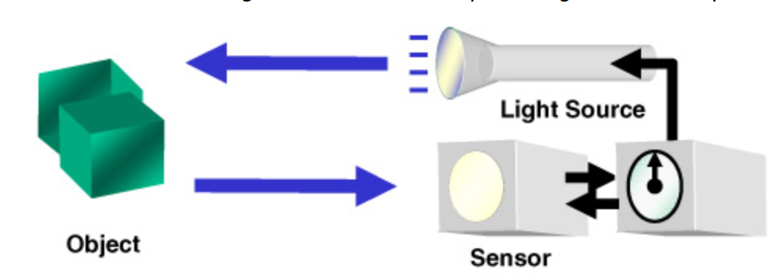

​                                                                       图 4-4-3：TOF 原理图[^5]

**结构光：**向目标物体发射结构光，再由红外摄像头进行采集光的信号，根据采集的信息计算出物体的深度信息。如图 4-4-4：

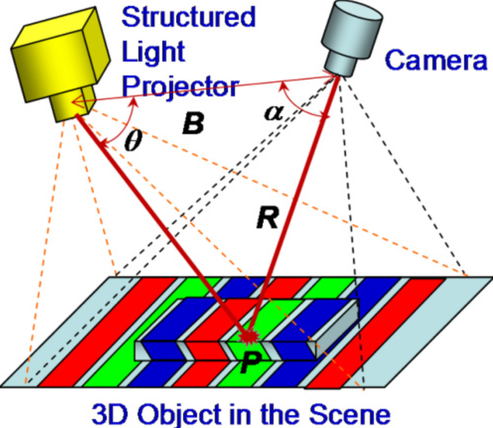

​                                                                         图 4-4-4：结构光示意图[^7]

**激光雷达扫描：**每隔一段时间向物体所在的场景空间发射激光，记录每个扫描点的信号从激光雷达到被测物体又反射回激光雷达的时间，最后计算出物体表面的深度信息。

- **Range Image 视图**

下面是 Range Image 的视图示例：

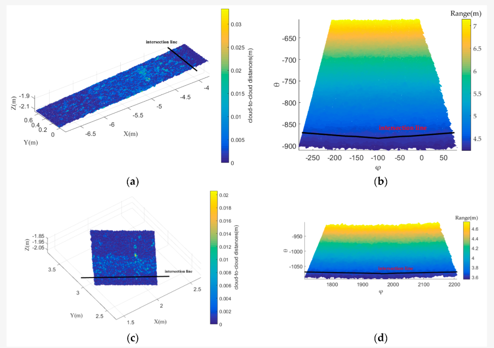

​                                                                图 4-4-5：Range Image 视图示例[^8]

如图 4-4-5 所示，(a) 和 (c) 分别是两个倾斜角度不同的坡形点云文件，(b) 和 (d) 分别是 (a) 和 (c) 对应的 Range Image，通过 Range(m) 图标我们可以看出，颜色从蓝色向黄色过渡的时候，距离从近到远，也即虽然视觉上我们看着 (b) 和 (d) 分别是两个梯形，但实际上，我们将深度信息加入该视图，会感觉到底部深蓝色部分比起上方的黄色区域距离**我们**（**或者摄像机**，这取决于我们的**视点依据**，这里只是举例说明深度为何意）更近。


#### 4-4-2：如何从点云中创建 Range Image：

有时我们现有的数据是点云数据，但是我们想利用三维图像的**深度信息**进行下一步的操作，此时我们就需要从点云数据中创建 Range Image（深度图像）来得到深度信息。本节就主要介绍**如何从点云数据中创建深度图像**。

##### 实例：

生成一个矩形点云的深度图像，完整代码 **create_rangeimage.cpp** 见 [附录—— 如何从点云中创建 Range Images](# 4.4.2：如何从点云中创建 Range Images：)

下面是代码详解：

下面两行代码是从点云中创建深度图像需要用到的头文件。


```c++
#include <pcl/range_image/range_image.h> // 深度图像头文件
#include <pcl/io/pcd_io.h>   // pcd 读写类相关的头文件
```

------


下面代码生成一个矩形点云，并保存在 **rectangle.pcd** 文件中，此点云文件在 CloudComapre 中的视图如图 4-4-6：


```c++
	// 创建点云对象 pointCloud
    pcl::PointCloud<pcl::PointXYZ> pointCloud;   
	// 生成矩形点云，保存在 rectangle.pcd 文件中
	for (float y = -0.5f; y <= 0.5f; y += 0.01f) {
		for (float z = -0.5f; z <= 0.5f; z += 0.01f) {
			pcl::PointXYZ point;
			point.x = 2.0f - y;      // 循环加入 x 的值
			point.y = y;             // 循环加入 y 的值
			point.z = z;             // 循环加入 z 的值
			pointCloud.points.push_back(point); // pushback 是指从当前末尾插入一个点
		}
	}
    // 设置宽度
	pointCloud.width = pointCloud.points.size(); 
    // 设置高度，从此处可以得知该点云文件是无序点云
	pointCloud.height = 1;   

	pcl::io::savePCDFileASCII(".../rectangle.pcd", pointCloud);
```


​                                                                     图 4-4-6 : 矩形点云视图（三个角度）

------


下面代码用来对深度图像进行参数设置，参数解释在代码块后*：


```c++
    // 深度图像参数的设置
    // 弧度1度
	float angularResolution = (float)(1.0f * (M_PI / 180.0f)); 
    // 弧度360度
 	float maxAngleWidth = (float)(360.0f * (M_PI / 180.0f)); 
    // 弧度180度
	float maxAngleHeight = (float)(180.0f * (M_PI / 180.0f)); 
	Eigen::Affine3f sensorPose = (Eigen::Affine3f)Eigen::Translation3f(0.0f, 0.0f, 0.0f);
	pcl::RangeImage::CoordinateFrame coordinate_frame = pcl::RangeImage::CAMERA_FRAME;
	float noiseLevel = 0.00;
	float minRange = 0.0f;
	int borderSize = 1;
```

*参数解释如下：

- **angularResolution**：传感器的角度分辨率，即每个像素对应的角度大小（用弧度表示）；

- **maxAngleWidth**：传感器的水平视角范围（用弧度表示）；

- **maxAngleHeight**：传感器的垂直视角范围（用弧度表示）；

- **sensorPose**：传感器姿态或采集位置；

- **coordinate_frame**：坐标系统，CAMERA_FRAME（默认）时为 X 轴向右，Y 轴向下，Z 轴向前，LASER_FRAME 为 X 轴向前，Y 轴向左，Z 轴向上；
- **noiseLevel**：近邻点距离查询点的最大距离，深度距离值就是通过查询点的近邻点计算出来的；

- **minRange**：最小可视深度 (默认为 0），当值大于 0 时，小于 minRange 数值的都是盲区；
- **borderSize**：点云边界的尺寸大小 (默认为 0)。

------


下面代码创建一个深度图像对象 rangeImage，并利用设置好的参数进行深度图像的创建，然后输出深度图像的内容，最后将创建的深度图像保存在一个新的 PCD 文件 **rectangle_range.pcd** 中。


```c++
    // 创建深度图像对象 rangeImage    
    pcl::RangeImage rangeImage; 

    // 对 rangeImage 使用之前设置的参数进行创建
	rangeImage.createFromPointCloud(pointCloud, angularResolution, maxAngleWidth, maxAngleHeight, sensorPose, coordinate_frame, noiseLevel, minRange, borderSize);

    // 输出深度图像内容
	std::cout << rangeImage << "\n"; 
    
    // 保存深度图像于一个新的 pcd 文件中
	pcl::io::savePCDFileASCII(".../rectangle_range.pcd", rangeImage); 
```

------


​                                                                   图 4-4-7 ：点云数据与深度图像视图

如图 4-4-7 所示，颜色与右侧 Range(m) 图标一致，说明蓝色部分距离视点比红色部分距离视点的距离更远。如果只看点云数据，我们会认为这是一个与纸面平行的长方形，而实际上，下方的点距离我们更近，上方的点距离我们更远。

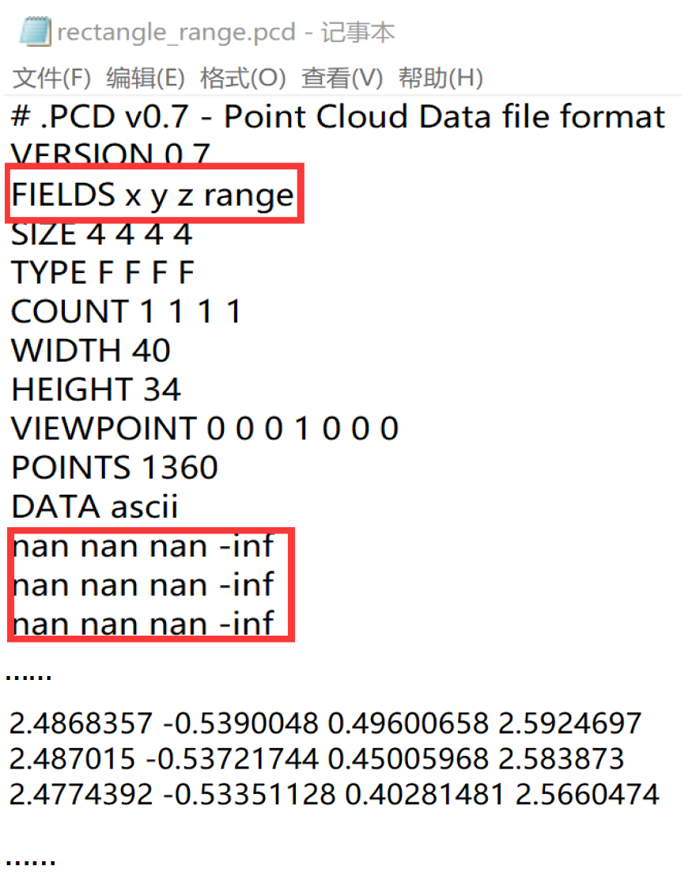

​                                                                  图 4-4-8：深度图像点云内容

如图 4-4-8 所示，生成的 **rectangle_range.pcd** 文件中包含的维度为 x，y，z，range，对应数据部分的四列分别就是每个点的 x，y，z 坐标值和 range 信息。深度图像的 PCD 文件中通常包含三类数据：

①：range 为大于零的数据，如图 4-4-8 下方的三行数据，说明这是**有效点**，也就是可以看到的点；

②：x，y，z 为 nan，range 为 -inf，如图 4-4-8 红框中的三行数据，说明这是点**不在当前视点范围内**；

③：x，y，z 为 nan， range 为 inf， 说明这些点距离视点**太远导致不可见**。

> 注意：第 ② 种和第 ③ 种要注意区分。点不在当前视点范围内并不意味着它距离视点太远，有可能它其实距离我们的视点很近，但视点有一个限定的角度，它超出了这个角度，因此称为不在当前视点范围内。

**rectangle_range.pcd** 中只出现了前面两种数据类型。


整体代码运行结果如图 4-4-9，打印出深度图像的宽、高、分辨率等信息：


​                                                                         图 4-4-9 :代码输出结果

对深度图像输出信息的解读：

**header** 是一个包括 seq、stamp、frame_id 的结构体，跟激光雷达获取数据有关，ROS 中常见：

- **seq：**扫描顺序增加的 id 序列；
- **stamp：**时间戳，一个代表时间的字符序列，标志着数据在某个特定时间之前已经存在、可验证；
- **frame_id：**数据名称，这里我们的数据是随机生成的，不是实际仪器获取的，因此没有设置名字；

**points[ ]：**是深度图像中点的总数；

**width & height：**分别是深度图像的宽和高，高不为 1，暗示深度图像对应了有序点云的结构；

**sensor_origin_：**对应参数设置部分的传感器位姿（位置坐标），因此数值是 0   0   0：

```
Eigen::Affine3f sensorPose =(Eigen::Affine3f)Eigen::Translation3f(0.0f, 0.0f, 0.0f);
```

**sensor_orientation_：**传感器朝向

**is_dense：**表示数据是否有限，这里取 0，意味着数据中包含 inf/NaN 数值；

**angular resolution：**输出了 XY 方向的角度分辨率。


#### 4-4-3 : 如何从 Range Image 中提取边界：

在图像处理中，**边界** 是一个非常重要的概念，人们可以通过边界去判断一个物体的大体范围甚至大体形状和结构，将其从周围物体或环境中切割出来，并为一些高效的算法提供处理范围。有时，一些非常关键的点往往也是边界点（见 4-5-1 : 关键点概念以及算法简介）。本节介绍如何从 Range Image 中提取边界。

##### 实例：

从创建的深度图像中提取边界。完整代码 **extract_rangeimageborder.cpp** 见 [附录 —— 4.4.3：从 Range Image 中提取边界](# 4.4.3：如何从 Range Image 中提取边界：)：

下面代码前四行是从 Range Image 中提取点云边界所需的头文件；

using namespace std；是使用命名空间 std；

typedef pcl::PointXYZ PointType;  是用 PointType 命名只包含坐标信息的 PointXYZ：


```C++
#include <iostream>    // 标准 C++ 库中的输入输出类相关头文件
#include <pcl/io/pcd_io.h>         // pcd 读写类相关的头文件
#include <pcl/range_image/range_image.h>   // 深度图像头文件
#include <pcl/features/range_image_border_extractor.h>  // 提取深度图像边界的头文件
using namespace std;   
typedef pcl::PointXYZ PointType;  
```

------


下面代码首先创建了一个矩形点云对象 point_cloud，通过两个 for 循环向 point_cloud 中填充点云数据。

```C++
    // --------------------
	// -----创建点云文件-----
	// --------------------
	pcl::PointCloud<PointType> point_cloud;
	std::cout << "Generating example point cloud.\n\n";

	for (float x = -0.5f; x <= 0.5f; x += 0.01f)
	{
		for (float y = -0.5f; y <= 0.5f; y += 0.01f)
		{
			PointType point;  
            point.x = x;  
            point.y = y;  
            point.z = 2.0f - y;
			point_cloud.points.push_back(point);
		}
	}

	point_cloud.width = point_cloud.points.size();
    point_cloud.height = 1;
```

------


下面代码实现了从点云文件中创建 Range Image ，参考 4-4-2：如何从点云中创建 Range Image：，并将其保存在 **rectangle_range.pcd** 中：

```C++
    // --从点云中创建 Range Image--
    float angular_resolution = 0.5f;
	Eigen::Affine3f scene_sensor_pose(Eigen::Affine3f::Identity());
    pcl::RangeImage::CoordinateFrame coordinate_frame = pcl::RangeImage::CAMERA_FRAME;
    bool setUnseenToMaxRange = false;
	float noise_level = 0.0;
	float min_range = 0.0f;
	int border_size = 1;
	pcl::RangeImage::Ptr range_image_ptr(new pcl::RangeImage);
	pcl::RangeImage& range_image = *range_image_ptr;
	range_image.createFromPointCloud(point_cloud, pcl::deg2rad(angular_resolution), pcl::deg2rad(360.0f), pcl::deg2rad(180.0f),
		scene_sensor_pose, coordinate_frame, noise_level, min_range, border_size);
	if (setUnseenToMaxRange)
		range_image.setUnseenToMaxRange();

	// 保存 Range Images
	pcl::io::savePCDFileASCII(".../rectangle_range.pcd", range_image);
```

*参数设置讲解：

- **angular_resolution**：相邻像素代表的两个光束的角度差（非弧度表示）；
- **scene_sensor_pose**：传感器姿态或采集位置；

- **coordinate_frame**：坐标系统，CAMERA_FRAME（默认）时为 X 轴向右，Y 轴向下，Z 轴向前，LASER_FRAME 为 X 轴向前，Y 轴向左，Z 轴向上；
- **setUnseenToMaxRange**：是否将所有不能观察到的点看作是最远距离的点。
- **noise_level**：近邻点距离查询点的最大距离，深度距离值就是通过查询点的近邻点计算出来的；
- **min_range**：最小可视深度 (默认为 0），当值大于 0 时，小于 minRange 数值的都是盲区；
- **border_size**：点云边界的尺寸大小 (默认为 0)。

------


下面代码首先创建一个针对深度图像 range_image 边界的提取对象 border_extractor，随后创建一个边界描述子对象 border_descriptions，最后计算边界提取对象的描述子并输出边界点的描述。


```c++
     // -------------------------
     // -----提取深度图像边界-------
     // -------------------------
     pcl::RangeImageBorderExtractor border_extractor(&range_image);
     pcl::PointCloud<pcl::BorderDescription> border_descriptions;
     border_extractor.compute(border_descriptions);

     // 输出边界点的描述
     
     cout << border_extractor.getBorderDescriptions() << endl;
```

------


图 4-4-10 为边界点的描述输出：


​                                                                      图 4-4-10：边界描述输出


### 4-5 ：Keypoints

Keypoints —— 关键点，又称兴趣点。指的是我们感兴趣的一些点。该概念在 2D 图像中非常常见，对图片进行旋转、尺寸放大缩小以及失真等操作后，Keypoints 在图像中的相对位置都是**近乎不变**的。鉴于这种特点，我们可以应用在 2D 姿态预测（**2D Pose estimation**）等场景中，如下图：


​                                                     图 4-5-1：2D Pose estimation 与 Keypoints[^10]

图 4-5-1 中右边拍摄的照片标出的红色点就是我们进行 2D Pose estimation 的关键点，这些点具有重要的信息。在 2D 计算机视觉中，代表性的 Keypoints 算法有 SIFT[^11]，SURF[^12]，MSER [^13], SUSAN[^14]。对应 2D 图像，Keypoints 在三维点云中的应用也越来越重要。

关键点（Keypoints）是点云的重要概念，提取关键点可以将需要分析的点从全部点转移了到点云中的一部分，通常这一部分可以代表整体点云。Keypoints 提取是点云中的低层次视觉（即还是以 “点“ 为单位，可以理解为 ”特征点“），进一步的还有更高层次视觉—— Feature 即特征（即由 ”点“ 组成的更复杂更高级的结构）（后面章节介绍）。将 Keypoints 与 Feature 结合在一起可以更有效地对原始点云进行处理，得到 Descriptor（即描述子），从而大大提高点云处理算法的效率。下图是点云中进行 Keypoints 检测的示意图，标注颜色部位是检测到的 Keypoints 区域：

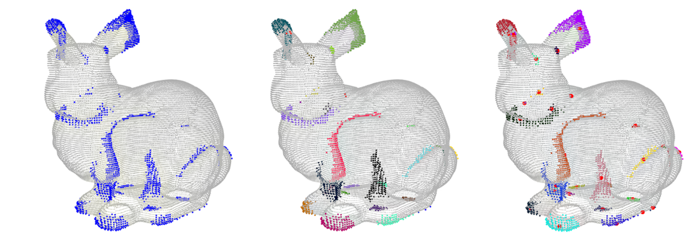

​                                                                图 4-5-2：Keypoints 检测示意图[^15]

当我们成功检测到某个点云的 Keypoints 时，基本上我们已经掌握了这个点云的一些重要信息，可以用来帮助我们继续提取更高级的特征，以便进行物体识别检测（Detection），物体分类（Classification），物体匹配（Matching）、点云配准（Registration）等。

常见的三维点云 Keypoints 提取方法有 ISS3D、Harris3D、NARF 等[^16]，其中 NARF 应用最为广泛，因此本节内容介绍 NARF，那么什么是 NARF ？NARF 又具有什么特点呢？


#### 4-5-1 : NARF 简介：

##### NARF：

NARF（Normal Aligned Radial Feature）主要应用在 Range Images 的物体识别中，主要针对 Range Images 中点的特征描述。如图 4-5-3 即为图中几何体的 NARF 示意图，可以看出这些 NARF 大部分出自几何体的**边界处**。


​                                                                         图 4-5-3：NARF 示意图[^17]

NARF 具有两个重要特征[^17]：

- NARF 的提取是在表面稳定区域（这样可以保证法线计算的可靠性），并且该区域的邻域变化幅度较大，这使得 NARF 多位于具有重要几何结构的局部区域中；

- NARF 的计算考虑了边界，边界对所产生的 Keypoints 有很大的影响。因为通过边界，我们可以大体得知一个物体的外部形态。

  

##### 算法步骤[^17]：

step1：将输入点云转化为深度图像；

step2：计算边缘区域点的法线；

step3：计算非边缘区域点的主要曲率；

step4：结合 step 2 & 3 计算兴趣点；

step5：得到 NARF Keypoints。


#### 4-5-2 : 如何从深度图像中提取 NARF 关键点：

本节介绍如何从深度图像中提取 NARF 关键点。边界会直接影响 NARF 的提取，因此要准确提取 NARF 关键点首先要准确提取深度图像中的边界（见 [4-4-3 : 如何从 Range Image 中提取边界](# 4-4-3 : '''''''如何从 Range Image 中提取边界：)）

##### 实例：

在提取 Range Image 边界点的基础上进行 NARF 关键点的提取，所用文件 **airplane.pcd**。


​                                                               图 4-5-4：**airplane.pcd** 视图

完整代码 **extract_NARF_Keypoints_rangeimage.cpp** 见 [附录 —— 4.5.2 : 如何从深度图像中提取 NARF 关键点：](#4.5.2 : 如何从 Range Images 中提取 NARF 关键点：  )

下面是代码详解：

下面代码前五行是从 Range Image 中提取 NARF 关键点需要用到的头文件。

typedef pcl::PointXYZ PointType; 是指用 PointType 命名只包含坐标信息的 PointXYZ 。

```c++
#include <iostream>     // 标准 C++ 库中的输入输出类相关头文件
#include <pcl/io/pcd_io.h>  // pcd 读写类相关的头文件
#include <pcl/range_image/range_image.h>  // 深度图像头文件
#include <pcl/features/range_image_border_extractor.h>  //  深度图像边界提取头文件
#include <pcl/keypoints/narf_keypoint.h>   // NARF 关键点头文件
typedef pcl::PointXYZ PointType;
```

------


下面代码创建点云对象 point_cloud，并将 **airplane.pcd**（见教程文件夹）导入 point_cloud 中：

```c++
    pcl::PointCloud<PointType> point_cloud;
	pcl::io::loadPCDFile(".../airplane.pcd", point_cloud);
```

------


下面代码创建存储深度图像信息的 range_image 对象：

```c++
	pcl::RangeImage range_image;
```

------


下面是创建深度图像过程中的参数设置，详情参考 [4-4-2：如何从点云中创建 Range Images](# 4-4-2：如何从点云中创建 Range Images：) 和 [4-4-3 : 如何从 Range Images 中提取边界](# 4-4-3 : '''''''如何从 Range Images 中提取边界：)：

```c++
    float angular_resolution = 0.5f;
	float support_size = 0.2f;
	pcl::RangeImage::CoordinateFrame coordinate_frame = pcl::RangeImage::CAMERA_FRAME;
	float noise_level = 0.0;
	float min_range = 0.0f;
	int border_size = 1;
	Eigen::Affine3f scene_sensor_pose(Eigen::Affine3f::Identity());
	bool setUnseenToMaxRange = true;
```

------


下面代码将上述设置参数写入创建深度图像的函数中，进行深度图像的创建和保存：

```c++
    range_image.createFromPointCloud(point_cloud, pcl::deg2rad(angular_resolution), pcl::deg2rad(360.0f), pcl::deg2rad(180.0f),
		scene_sensor_pose, coordinate_frame, noise_level, min_range, border_size);
	if (setUnseenToMaxRange)
		range_image.setUnseenToMaxRange();

	pcl::io::savePCDFileASCII(".../airplane_range.pcd", range_image);
```

------


下面代码实现从 Range Image 中提取 NARF 关键点：首先创建 Range Image 的边界提取对象 range_image_border_extractor，随后创建 NARF 检测对象 narf_keypoint_detector，最后计算得到 NARF 关键点，将其保存在 **airplane_narf.pcd** 中：

```c++
    // ------------------------
	// -----提取 NARF 关键点-----
	// ------------------------
	pcl::RangeImageBorderExtractor range_image_border_extractor;
	pcl::NarfKeypoint narf_keypoint_detector(&range_image_border_extractor);
	narf_keypoint_detector.setRangeImage(&range_image);
	narf_keypoint_detector.getParameters().support_size = support_size;

	pcl::PointCloud<int> keypoint_indices;
	narf_keypoint_detector.compute(keypoint_indices);
	std::cout << "Found " << keypoint_indices.points.size() << " key points.\n" << std::endl;
	pcl::io::savePCDFileASCII(".../airplane_narf.pcd", narf_keypoint_detector.getInterestPoints());
```

------


图 4-5-5 是代码运行结果，可以看到 **airplane.pcd** 一共检测出了 100 个 NARF 关键点：

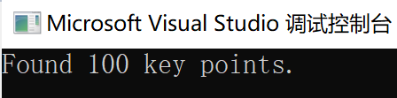

​                                                                              图 4-5-5：运行结果

图 4-5-6 是 **airplane_narf.pcd** 文件内部和 NARF 关键点视图（黑点为 NARF 关键点，彩色为深度图像），**airplane_narf.pcd** 中的 100 个点，就对应 NARF 视图中的黑色点。NARF 基本集中在边界区域，有些点是飞机机头、机尾或者两翼的上下表面。生成文件后大家可以在软件中转动查看。

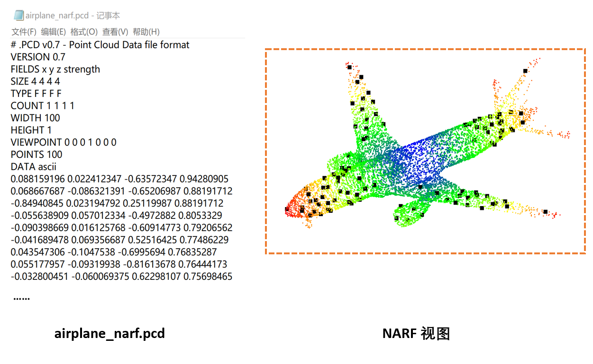

​                                                图 4-5-6：**airplane_narf.pcd** 文件与 NARF 关键点视图


### 4-6 ：Feature

对于人来说，看到一个点云，可以很容易的判断这是一只兔子，一座桥或是桥墩...... 因为我们能够利用常识和知识，通过经验得出结论。但对计算机来说，一个点云文件只是一堆三维坐标点，而没有其他更有意义的信息。我们需要创建一些判断规则，编写一些知识，告诉计算机如何去读懂点云，最终能自动分类切割点云。这些有判别力的判断准则和知识，就是 ”特征“，即 Feature，需要从点云中进一步提取。

之前介绍的 Keypoints 是提取点云**本身的关键点**，也可以理解为 ”特征点“，它的单位还是 ”点“。而本节开始介绍的 Feature（特征）是比 Keypoints 更高级的信息，需要**在点云本身点的基础上进行进一步的计算**。我们可以通过从点云中提取 Feature 来进行点云的识别、重建等。在识别问题上，点云特征的生成和提取对于识别点云中物体至关重要。越好的关键的特征具有越高的辨 (判) 别力，能将目标物体跟其他点云中的物体区分开。所以，如何设计好的 Feature，计算 Feature 是需要深入探讨的，这一节我们主要介绍几个常见的 Feature：法线（法向量）、PFH 描述子、FPFH 描述子、VFH 特征描述子。

> 注意：实际上，在很多资料中会将关键点称为特征点，我们只需明确提取 “点” 是一种较低级的信息，而在 “点” 的基础上进一步地计算得到的则是较高级的信息。我们会在第八章补充 PCL 之外跟特征点相关的知识。


#### 4-6-1：估计一个点云的表面法线：

##### 法线概念：

点云的表面法线是点云的重要属性，体现在 pcd 文件中为点云的维度（Fields）之一。同样可以作为维度的可以有颜色，光照强度（下面法线应用中会介绍）等。主要思路是通过寻找点所在切面，**计算切面法线作为该点法线**，切面的法线就是垂直于这个面的向量，如图 4-6-1：


​                                                                        图 4-6-1：法线示意图

##### 法线的应用：

1. 点云渲染，也称为着色（体现立体感）。反过来点云渲染可以作为检测法线方向正确性的一种方式。如图：

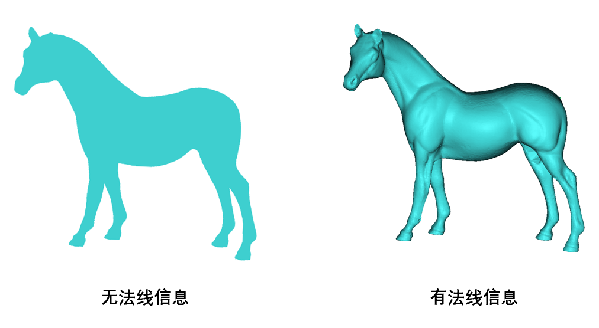

​                                                 图 4-6-2：点云渲染对比（左无法线信息，右有法线信息）

如图 4-6-2 所示：左侧为没有法线信息的渲染视图，可以看到这匹马只有平面感觉；而右侧的马由于多了法线的信息，看上去更加立体，在弯曲度较大的位置颜色更暗一些。

2. 点云切割：法线是向量，即带有方向，这是很重要的属性。我们可以利用点的方向来构建更高级的 feature，进而来达到对点云的切割。
3. 计算曲率：可以根据法线计算曲率。这里我们的实例求出的结果中会带有法线和曲率。曲率是表示弯曲程度的数值，表面变化幅度大的区域往往曲率值大。

##### 法线可视化：

为了更直观地将法线可视化，我们将法向量绘制在原始点云上。如图 4-6-3：左侧为原始点云，没有法线信息；右侧在原始点云的基础上计算了每个点的法向量并可视化，黑色带箭头的向量即为法向量：

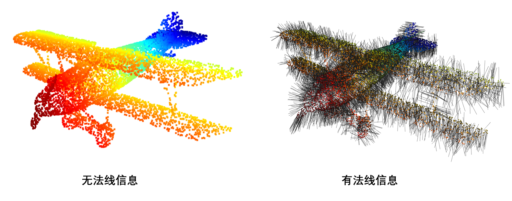

​                                                                      图 4-6-3：法向量可视化

##### 法线计算原理：

寻找点云中每个点（4-7：Search）的近邻点，并利用这些点拟合平面，计算拟合平面的法线作为该点法线。

其中平面拟合需要用到最小二乘法平面拟合估计，最小二乘法相关知识可参考下面链接：

-  http://mediatum.ub.tum.de/doc/800632/941254.pdf


根据最小二乘法可知拟合平面的过程实际是在求一个协方差矩阵的特征值和特征向量，该协方差的计算是根据选定点及其周围的邻域点进行的。对于每个点 $P_i$，协方差矩阵为：
$$
C=\frac{1}{k} \sum_{i=1}^{k} \cdot\left(P_{i}-\bar{P}\right) \cdot\left(P_{i}-\bar{P}\right)^{\mathrm{T}}, C \cdot \vec{v}_{j}=\lambda_{i} \cdot \vec{v}_{i}, j \in\{0,1,2\}
$$
$k$ 是 $P_i$ 近邻点中的全部数目，$\bar{P}$ 是近邻点的质心，$\lambda_{i}$ 是协方差矩阵的第 $i$ 个特征值，$v_j$ 是第 $j$ 个特征向量。根据上述求出的结果，还可以得到曲率 —— 曲率是表示**弯曲程度**的数值，表面变化幅度较大的区域往往曲率值大。对应的曲率 $\sigma$ 计算如下：
$$
\sigma=\frac{\lambda_{0}}{\lambda_{0}+\lambda_{1}+\lambda_{2}}
$$


##### 实例：

估计一个点云 **cuboid.pcd** （见教程文件夹）的表面法线：

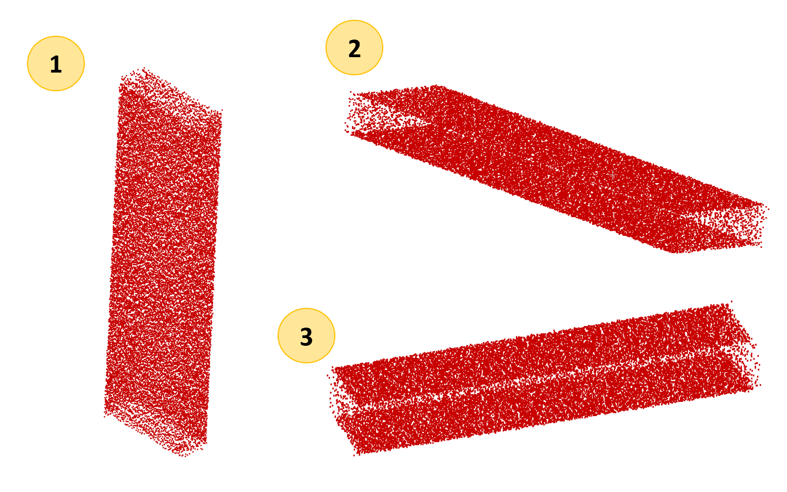

​                                                          图 4-6-4：**cuboid.pcd** 视图（三个角度）

完整代码 **estimate_normal.cpp** 见 [附录 —— 估计一个点云的表面法线](#4.6.1：估计一个点云的表面法线： )

下面是代码详解：

下面五行代码是估计一个点云表面法线需要用到的头文件。

```C++
#include <iostream>               // 标准 C++ 库中的输入输出类相关头文件
#include <pcl/io/pcd_io.h>        // pcd 读写类相关的头文件
#include <pcl/point_types.h>      // pcl 中支持的点类型的头文件
#include <pcl/search/kdtree.h>    // Kdtree 头文件
#include <pcl/features/normal_3d.h>   // 法线估计头文件
```

------


下面代码创建一系列在估计点云表面法线时需要用到的对象，包括输入原始点云 cloud，法线估计对象 ne，法线输出数据集对象 pcNormal，估计法线用到的 kdtree 对象 tree。

```C++
    // 创建点云对象 cloud，并将 pcd 加载到 cloud 中
    pcl::PointCloud<pcl::PointXYZ>::Ptr cloud(new pcl::PointCloud<pcl::PointXYZ>);
    pcl::io::loadPCDFile(".../cuboid.pcd", *cloud);
 
    // 创建法线估计对象 ne
    pcl::NormalEstimation<pcl::PointXYZ, pcl::Normal> ne;
 
    // 创建存储法线输出数据集 pcNormal
    pcl::PointCloud<pcl::Normal>::Ptr pcNormal(new pcl::PointCloud<pcl::Normal>);

    // 创建一个空的 kdtree 对象，并把它传递给法线估计对象
    pcl::search::KdTree<pcl::PointXYZ>::Ptr tree(new pcl::search::KdTree<pcl::PointXYZ>);
```

其中需要重点说明的是 **NormalEstimation** 法线估计类，上述代码中我们利用这个类创建了法线估计对象 ne，它的原理也就是计算点云表面法线的原理：

***step1：***找到点云中要计算法线的点 p 的近邻点（可以通过寻找 p 周围的 K 个点 **（K-NN）** 或者寻找距离 p 小于等于 R 长度的点**（Radius-NN）**得到近邻点集）；如下图中的 K-NN 和 Radius-NN，p 点就是两幅图中的红点，绿色的点是我们根据两种不同的方法得到的近邻点：


​                                                                  图 4-6-5：K-NN 与 Radius-NN

***step2：***对于这个近邻点集拟合平面（最小二乘平面拟合），计算该平面的法线；

***step3：***检测法线方向是否一致指向视点，如果不一致则进行翻转。

------


下面代码进行点云表面法线估计的实际计算部分：

```C++
	tree->setInputCloud(cloud);
	ne.setInputCloud(cloud);
	ne.setSearchMethod(tree);
	ne.setKSearch(50);  // 根据点周围50个点进行平面拟合（选取周围50个点作为近邻点）
    // 或者 ne.setRadiusSearch (0.03);// 使用半径在查询点周围3厘米范围内的所有近邻元素

	// 计算特征值
	ne.compute(*pcNormal);
```

其中：

- 将之前创建好的点云对象 cloud 输入到法线估计对象 ne 中；

- 设置 ne 的近邻搜索方法为 kdtree 对象 tree；

- 设置紧邻搜索的个数为 50，这里也可以通过设置近邻点半径的方法进行搜索；
- 计算法线这个特征值；

------


下面代码生成并存储带有**坐标信息**和**法线信息**的点云文件：

```C++
    // 合并带有法线信息的 pcNormal 和带有每个点x，y，z信息的 cloud    
	pcl::PointCloud<pcl::PointNormal>::Ptr cloud_with_normals(new pcl::PointCloud<pcl::PointNormal>);
	pcl::concatenateFields(*cloud, *pcNormal, *cloud_with_normals);
    
    // 将含有xyz和法线信息的点云 cloud_with_normals 存储在 cuboid.pcd 中
    pcl::io::savePCDFileASCII(".../cuboid_normal.pcd", *cloud_with_normals);
```

其中：

首先创建可以包含坐标信息和法线信息的 PointNormal 类型点云对象 cloud_with_normals；

随后将 cloud 和 pcNormal 使用 concatenateFields 连接在一起（见 4.3.3 IO_如何连接两个PCD文件），将连接后的结果点云存储到 cloud_with_normals 中；

最后将 cloud_with_normals 输出在 **cuboid_normal.pcd** 文件中；

------


至此，点云表面法线估计全部完成，生成法线信息后的点云文件 **cuboid_normal.pcd** 内容如下图：

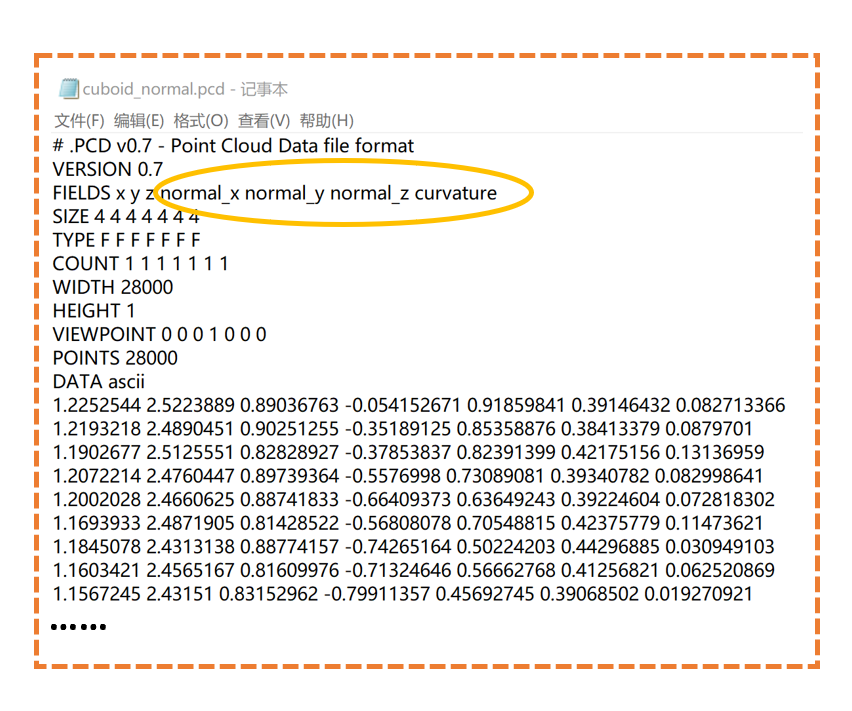

​                                                                图 4-6-6：**cuboid_normal.pcd**

计算法线后的 **cuboid_normal.pcd** 在 CloudCompare 中的视图如下：

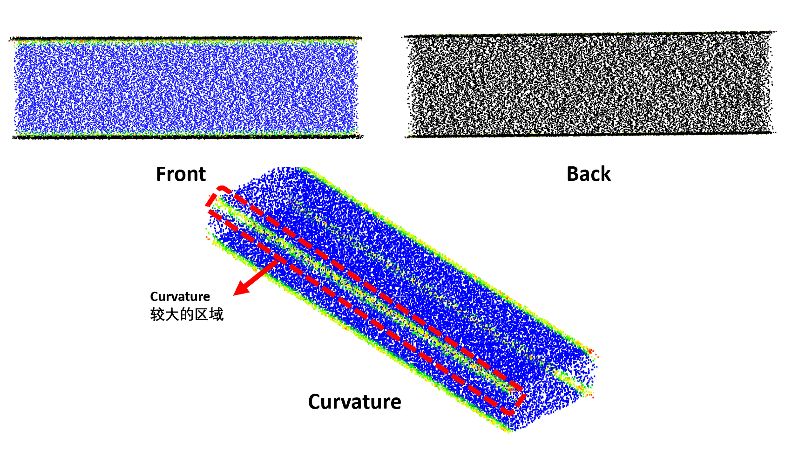

​                                                           图 4-6-7：**cuboid_normal.pcd** 视图

其中 Front 与 Back 是体现法线的重要视图，因为计算了法线信息后，等于这个几何体有了方向：Front 可以理解为被光线照射的一面（显示蓝色），Back 是光线照不到的一面（显示黑色）。

根据图 4-6-6，我们发现计算法线后的 **cuboid_normal.pcd** 中不仅有法线 normal_x、normal_y、normal_z 的信息，还有 curvature，也即曲率值。曲率是表示**弯曲程度**的数值，表面变化幅度较大的区域往往曲率值大。反映在图 4-6-7 中的 **Curvature** 中：即 curvature 大的区域颜色呈现绿色，而 curvature 较小的地方颜色为蓝色。**cuboid.pcd** 长方体的**棱**明显是表面变化幅度较大的区域，因此呈现绿色。由此看出，法线和曲率对于切割点云很有用，比如这里，我们可以继续利用曲率的大小变化将这个长方体按照棱边切割成 4 个面。


#### 4-6-2：使用积分图进行法线估计：

第三章中（3-1：PCD 文件）我们提到了无序点云和有序点云，对于有序点云，我们还可以通过积分图法进行法线的估计。注意：积分图法不适用于无序点云，因此进行处理之前要判断好自己的点云文件是有序还是无序。

为什么有序点云要引入积分图法来估计法线？因为要估计点云法线，首先需要找到估计点的近邻区域。而对于有序点云来说，近邻点的搜索相较无序点云更加方便，有序点云可以明显加快法线估计速度，积分图就是基于有序点云的这一特点引入的。

##### 积分图：

积分图（Integral Image）：积分图中每个点的值（含有灰度值的图像，不是深度图像，就是简单的 2D 图片）是**该点所在位置以及左上角的所有位置在原始2D图像中的像素值之和**。

如图 4-6-8 中 Integral image 中的 “9”，就是由 ”9“ 在原始图像 Image 中的位置（正中心）以及该位置左上角所有元素之和（积分图像，所谓积分，就是求和）。原始图像 Image 中的数值均为灰度值：
$$
2 + 3 + 3 + 1 = 9
$$
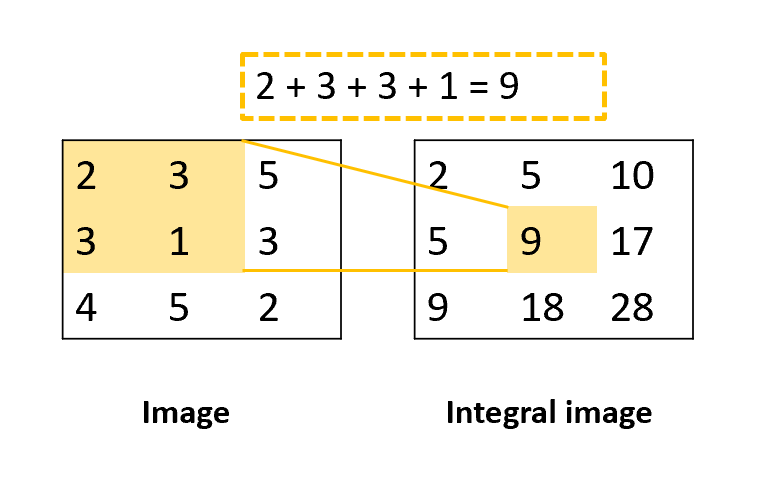

​                                                                               图 4-6-8：积分图示例

##### 实例：

我们利用 PCL 官方文档的 **table_scene_mug_stereo_textured.pcd** 文件（见教程文件夹）进行法线的估计。

**table_scene_mug_stereo_textured.pcd** 视图如下，该文件是一个有序点云：


​                                           图 4-6-9：**table_scene_mug_stereo_textured.pcd** 视图

完整代码 **estimate_integral_normal.cpp** 见 [附录 —— 使用积分图法进行法线估计](# 4.6.2：使用积分图进行法线估计： )

下面是代码详解：

下面三行代码是使用积分图进行法线估计使用的头文件。

```c++
#include <pcl/io/io.h>     // 读写类相关的头文件
#include <pcl/io/pcd_io.h>    // pcd 读写类相关的头文件
#include <pcl/features/integral_image_normal.h>    // 用积分图法计算法线的文件头
```

------


下面两行代码创建了一个点云对象 cloud，第二行将名为 **table_scene_mug_stereo_textured.pcd**  的点云文件读入已经创建好的 cloud 中。

```c++
pcl::PointCloud<pcl::PointXYZ>::Ptr cloud (new pcl::PointCloud<pcl::PointXYZ>);
pcl::io::loadPCDFile (".../table_scene_mug_stereo_textured.pcd", *cloud);
```

------


下面代码创建法线存储对象 normals、积分图法法线估计对象 ne、然后设置估计方法、最大深度变化系数、优化法线方向时考虑的邻域大小、输入的有序点云、执行法线估计、将结果存储到 normals 中。

```c++
// 估计法线
pcl::PointCloud<pcl::Normal>::Ptr normals (new pcl::PointCloud<pcl::Normal>);
pcl::IntegralImageNormalEstimation<pcl::PointXYZ, pcl::Normal> ne;
ne.setNormalEstimationMethod (ne.AVERAGE_3D_GRADIENT);  // 设置估计方法
ne.setMaxDepthChangeFactor(0.02f);      // 最大深度变化系数
ne.setNormalSmoothingSize(10.0f);       // 优化法线方向时考虑邻域大小
ne.setInputCloud(cloud);                // 输入点云，必须为有序点云 
ne.compute(*normals);                   // 执行法线估计存储结果到 normals
```


以下是可使用的法线估计方法*，上述代码中我们使用的是 **AVERAGE_3D_GRADIENT**：

```c++
enum NormalEstimationMethod
{
  COVARIANCE_MATRIX,
  AVERAGE_3D_GRADIENT,
  AVERAGE_DEPTH_CHANGE
};
```

*法线估计方法：

**COVARIANCE_MATRIX** 模式创建 9 个积分图，利用某个点局部邻域的协方差矩阵计算这个点的法线；

 **AVERAGE_3D _GRADIENT** 模式创建 6 个积分图，计算水平和垂直方向平滑后的三维梯度，并使用两个梯度间的向量积计算法线； 

**AVERAGE_DEPTH_CHANGE** 模式创建 1 个积分图，从平均深度的变化计算法线； 

------


下面代码将带有点 xyz 信息的 cloud 文件和带有法线信息的 normals 文件合并到 cloud_with_normals 中，并将 cloud_with_normals 存储到 **table_scene_mug_stereo_textured_normals.pcd** 中。

```c++
   pcl::PointCloud<pcl::PointNormal>::Ptr cloud_with_normals(new pcl::PointCloud<pcl::PointNormal>);
   pcl::concatenateFields(*cloud, *normals, *cloud_with_normals);
   pcl::io::savePCDFile(".../table_scene_mug_stereo_textured_normals.pcd", *cloud_with_normals);
```

下图是包含点的 xyz 和法线信息的文件 **table_scene_mug_stereo_textured_normals.pcd** 的 CloudCompare视图：

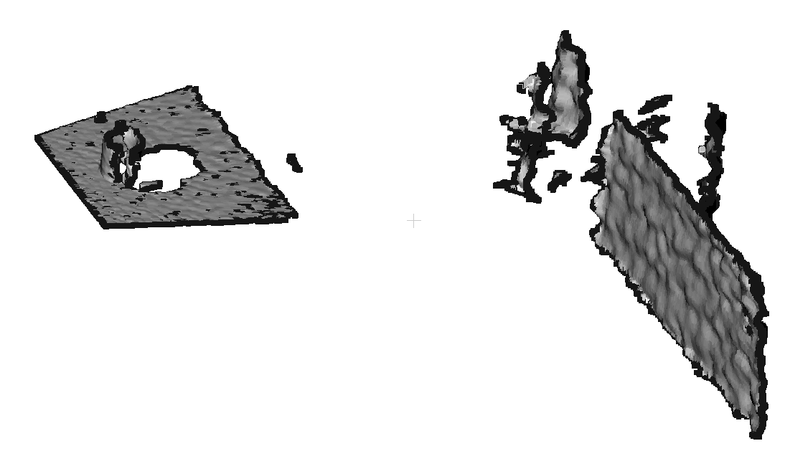

​                                                                图 4-6-10：计算法线后的视图

通过图 4-6-10 可以看出，边界（弯曲度较大）区域颜色比平面处深，视图看上去比原始视图图 4-6-9 更加立体，这便是添加法线后的直观效果。利用此方法进行法线估计只适用于有序点云，对于无序点云只能采用其他方法。


#### 4-6-3：点特征直方图描述子（PFH descriptors）:

点云表面的法线通过点的邻域进行计算可以快速得到。为了更好地描述和分析点云，我们还可以提取其他的特征 —— 在计算表面法线的基础上，我们可以进一步计算点特征直方图描述子（PFH descriptors）。

点特征直方图（PFH），全称为 Point Feature Histogram，它的本质是获得一个直方图。

##### 直方图：

什么是直方图？

直方图是反应数据分布的一种呈现方式。将数据的数值分为几个区间（bin 的范围），统计每个区间的数据个数，绘制直方图。下图 4-6-11 表示了 30 个数据，按照大小将它们划分在了不同的区间（即 1-5，15-20 等），并统计了落在每个区间数据的个数：

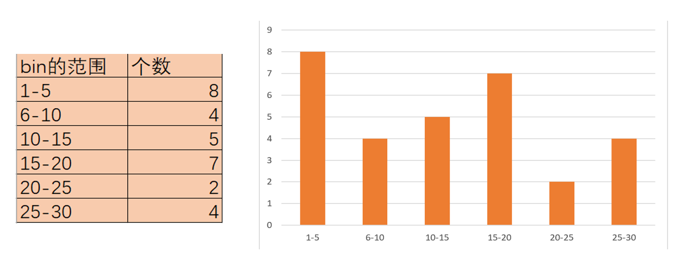

​                                                                      图 4-6-11：直方图示意图

将 1-30 均分为 6 个 bin，每个 bin 的范围如图 4-6-11 左侧表格中所示，每个 bin 的元素个数分别为：8、4、5、7、2、4。反应在右侧直方图中，横轴是 bin 范围，纵轴是每个 bin 对应的元素个数。

如图 4-6-12 中红色直方图，该直方图用来描述点云中某个点邻域的几何信息，目的是将这些几何信息转换到更高维的直方图中，得到的高维数据相较之前的法线可以提供更多的信息。注意，PFH 的计算将以法线的估计为基础（后面会具体解释），通过法线最大可能地去提取点云表面的变化情况，以描述它的几何特征。PFH 具有平移旋转不变性（即旋转平移点云都可以得到同样的描述子），并且 PFH 对点云的密度和噪声点也具有稳健性。


​                                                                            图 4-6-12：PFH 示意图[^18]

##### PFH 计算原理：

对于点云文件中的每个点选定它的邻域，对于这个邻域中的每两个点（一个是查询点，一个是查询点的邻域点）之间都进行如下配对和计算：


​                                                                图 4-6-13：PFH 计算对象示意图[^18]

如图 4-6-13 所示，当我们以 $P_q$ 为查询点找到虚线圈内的邻域时，这时我们对这个邻域里的每两个点之间都连接起来（如黑线所示），并进行如下操作：

首先根据两个点中的一个建立固定坐标系，为了计算两个点及二者法线之间的偏差，在其中一个点上定义了一个固定坐标系。

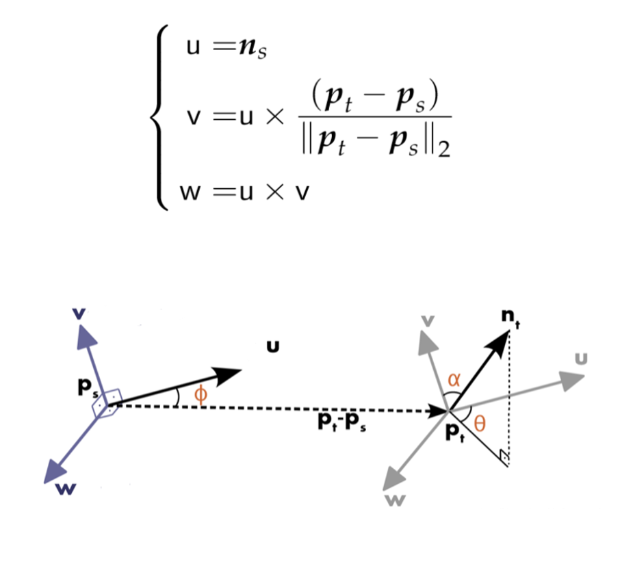

​                                                                     图 4-6-14：建立坐标系[^18]

关于指标的计算公式如下：
$$
\begin{array}{c}
d=\left\|p_{t}-p_{s}\right\|_{2} \\
\alpha=v \cdot n_{t} \\
\phi=u \cdot \frac{p_{t}-p_{s}}{\left\|p_{t}-p_{s}\right\|_{2}} \\
\theta=\arctan \left(w \cdot n_{t}, u \cdot n_{t}\right)
\end{array}
$$
如图 4-6-14 所示，我们以点 $P_s$ 和 $P_t$ 为例，以 $P_s$ 的法线方向 $n_s$为坐标系的 **u**，坐标系的 **v** 根据两点之间的距离得到，坐标系中的 **w** 根据 **u** 和 **v** 得到，将此坐标系平移到点 $P_t$，以点 $P_t$ 为原点，我们可以计算坐标系与 $P_t$ 法线的角度 **α**，**θ​**，以及 $P_s$ 的法线与两点连线矢量的夹角 **Φ**。现在，我们得到的三个角度元素，除此之外，加上 $P_s$ 和  $P_t$ 两点之间的欧氏距离 ​**d** ，**这四个元素构成了 PFH 描述子**。不过在某些情况下（比如用激光雷达进行扫描时），邻近点间的距离 d 会根据视点变化，在扫描中局部点密度影响特征时，实践证明省略 d 是有益的。

##### 实例：

以 **bridge_pier.pcd** 为例（见教程文件夹），完整代码 **pfh.cpp** 见 [附录 —— 点特征直方图描述子（PFH descriptors）](# 4.6.3：点特征直方图描述子（PFH descriptors）:)


​                                                             图 4-6-15：**bridge_pier.pcd** 示意图

下面是代码详解：

下面是提取点云的点特征直方图（PFH）描述子所需要的头文件。

```c++
#include <iostream>               // 标准 C++ 库中的输入输出类相关头文件
#include <pcl/io/pcd_io.h>        // pcd 读写类相关的头文件
#include <pcl/point_types.h>      // pcl 中支持的点类型的头文件
#include <pcl/search/kdtree.h>    // Kdtree 头文件
#include <pcl/features/normal_3d.h>   // 法线估计头文件
#include <pcl/features/pfh.h>     //PFH 特征估计类头文件
```

------


下面代码首先估计 **bridge_pier.pcd** 的法线，见 4-6-1：估计一个点云的表面法线 ，为后面计算 PFH 描述子提供法线信息。

```c++
    pcl::PointCloud<pcl::PointXYZ>::Ptr cloud(new pcl::PointCloud<pcl::PointXYZ>);
	pcl::io::loadPCDFile(".../bridge_pier.pcd", *cloud);

	// 创建法线估计对象 ne
	pcl::NormalEstimation<pcl::PointXYZ, pcl::Normal> ne;
	// 存储法线输出数据集 pcNormal
	pcl::PointCloud<pcl::Normal>::Ptr pcNormal(new pcl::PointCloud<pcl::Normal>);
	// 创建一个空的 kdtree 对象，并把它传递给法线估计对象
	// 基于给出的输入数据集，kdtree 将被建立
	pcl::search::KdTree<pcl::PointXYZ>::Ptr tree1(new pcl::search::KdTree<pcl::PointXYZ>);
	tree1->setInputCloud(cloud);
	ne.setInputCloud(cloud);
	ne.setSearchMethod(tree1);
	ne.setRadiusSearch(0.03);// 使用半径在查询点周围3厘米范围内的所有近邻元素
	//或者 ne.setKSearch(50);  根据点周围50个点进行平面拟合（选取周围50个点作为近邻点）

	// 计算特征值
	ne.compute(*pcNormal);

	// 合并带有法线信息的 pcNormal 和带有每个点x，y，z信息的 cloud    
	pcl::PointCloud<pcl::PointNormal>::Ptr cloud_with_normals(new pcl::PointCloud<pcl::PointNormal>);
	pcl::concatenateFields(*cloud, *pcNormal, *cloud_with_normals);
```

------


从这部分开始就进入 PFH 的计算阶段，下面前三行代码首先创建一个 PFH 估计对象 pfh：

```c++
	// 下面进行 PFH 的计算
	// 创建 PFH 估计对象 pfh，并将输入点云数据集 cloud 和法线 normals 传递给它 
	pcl::PFHEstimation<pcl::PointXYZ, pcl::Normal, pcl::PFHSignature125> pfh;
	pfh.setInputCloud(cloud);
	pfh.setInputNormals(pcNormal);

    // 创建一个空的 Kd 树表示法，并把它传递给 PFH 估计对象
	pcl::search::KdTree<pcl::PointXYZ>::Ptr tree2(new pcl::search::KdTree<pcl::PointXYZ>());
	pfh.setSearchMethod(tree2);

	// 创建存放 PFH 信息的对象 pfhs
	pcl::PointCloud<pcl::PFHSignature125>::Ptr pfhs(new pcl::PointCloud<pcl::PFHSignature125>());
```

这里创建 PFH 估计对象时用的是 PFHSignature125 。

**为什么是 PFHSignature125？**这里我们选取了三个角度作为每个点对的描述子，每个角度都会有一个直方图，PCL 中默认每个直方图 bin 个数为 5。也即可以理解为三个维度，每一维都是一个坐标轴，每个坐标轴划分为 5 个子区间，PFH 描述空间转换为 $5^3  = 125$  个子空间，然后分别统计落在每个空间的点的信息，即将三个角度看作坐标值记录在对应的小立方体中，随后平摊整个立方体，得到 $5^3  = 125$ 个结果数据（计算一个点时，它的邻域中的每个点对都会被计算，假设邻域有 K 个点，则最终会计算出 $K ^2$ 个 [$\alpha, \theta, \phi$]，我们需要做的是将这些数据分别对应坐标轴投放到相关立方体）:

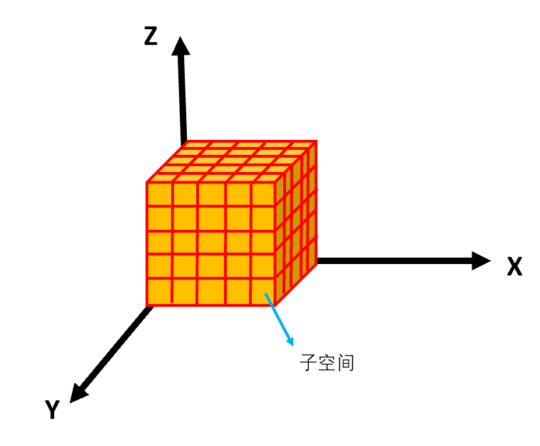

​                                                             图 4-6-16：125 个子空间示意图

用图 4-6-16 中的 XYZ 轴分别对应选取的三个角度，每个轴划分为五个子区间。125 个立方体代表125 个子空间，之后将点云对象 cloud 和法线对象 pcNormal 传入 pfh 中。随后创建第二个 kdtree 对象（注意：与之前法线估计的 tree1 区分）tree2，并设置近邻搜索方法为 tree2。最后创建存放 PFH 信息的对象 pfhs。

**PFHEstimation 类：**

step1：得到选定点 p 的最近邻；

step2：对于每个配对点对进行三个角度的计算；

step3：把所有的结果分布到直方图中。

------


下面代码首先设置搜索半径，如代码中标注，这里的半径一定要大于前一步计算法线的半径，随后计算 PFH 特征值，最后将 PFH 信息保存在 **bridge_pier_pfh.pcd** 中：

```c++
   	// 使用半径在 5cm 范围内的所有邻元素。注意：此处使用的半径必须要大于估计表面法线时使用的半径!! 在这里我们计算表面法线的半径是 0.03
	pfh.setRadiusSearch(0.05);

	// 计算 PFH 特征值
	pfh.compute(*pfhs);

	//保存含有 PFH 的点云文件
	pcl::io::savePCDFileASCII(".../bridge_pier_pfh.pcd", *pfhs);
```

下图是生成的 **bridge_pier_pfh.pcd** 内部信息：


​                                                      图 4-6-17 ： **bridge_pier_pfh.pcd** 内部信息

**bridge_pier_pfh.pcd** 文件中每一行代表一个点，每个点有 125 个 PFH 值。


#### 4-6-4 : 快速点特征直方图描述子（FPFH descriptors）：

上一节介绍了点特征直方图描述子（PFH descriptors），本节介绍在 PFH 基础上更进一步的快速点特征直方图描述子 FPFH （Fast Point Feature Histograms）。下图 4-6-18 展示了一个 FPFH 的示例：

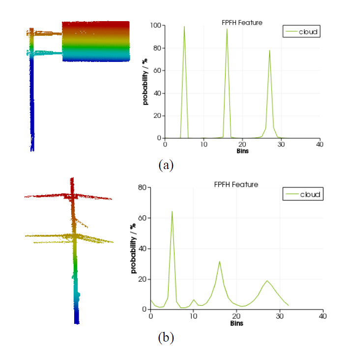

​                                                                   图 4-6-18：FPFH 示意图[^19]

之所以引入 FPFH 是因为 PFH 存在以下不足：

① **计算复杂度很高。**如果点云中有 n 个点，假设每个点在它的邻域半径 r 内平均可以选到 k 个近邻点。由于两两点之间都要进行连接。实际点云数量众多，导致计算量巨大。

② **大量重复计算。**由于是两两点进行配对后再计算 PFH，也就是说所有点都被不止一次地重复进行计算，如图 4-6-19 中被红线连接的点对：

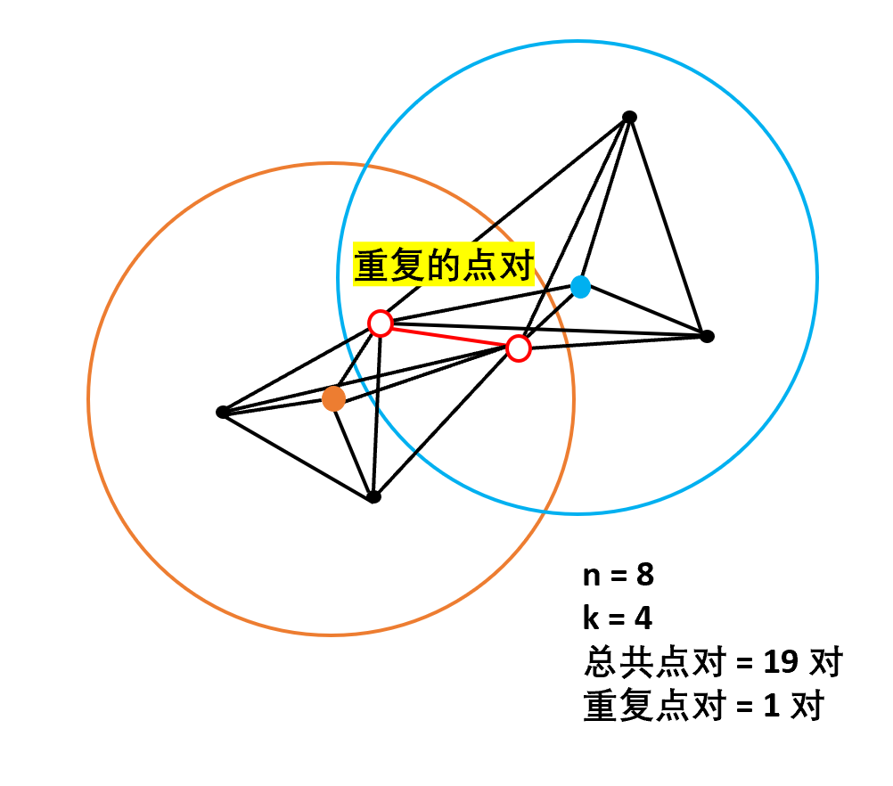

​                                                                    图 4-6-19：重复点对示意图

上图展示了分别以橙色点为中心的橙色框和以蓝色点为中心的蓝色框内的点对连接情况。我们可以看到，在两个圆圈相交的区域，有两个点（被标注为红框白心圆）被包含了两次，因此它们之间会被重复计算。

##### FPFH 计算原理：

因此我们需要对 PFH 进行改进，就出现了 FPFH：

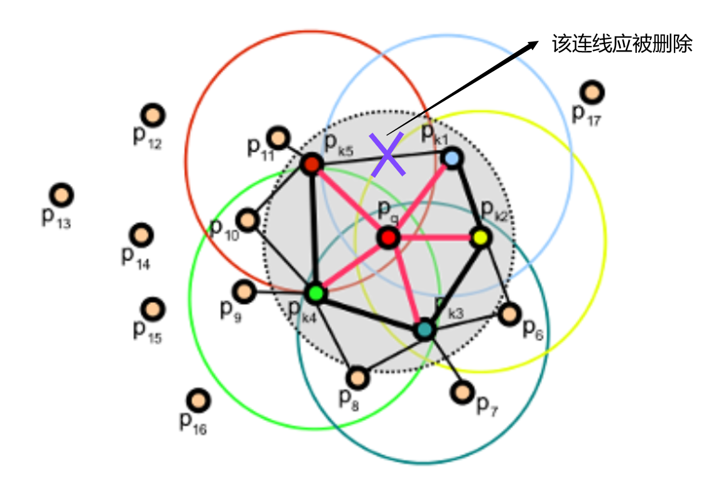

​                                                             图 4-6-20：FPFH 计算对象示意图[^20]

FPFH 不再对每个点（这里选  $p_q$ 为查询点）的邻域内两两点之间进行计算，而是只对每个点与其邻域点进行配对计算（如图 4-6-20 中红线所示），大大降低了计算的复杂度。

这种缺少邻域点与邻域点之间的两两相互连接关系被称作简化的点特征直方图（Simple Point Feature Histogram），简称 SPFH。这样就得到了 $p_q$ 及其邻域点 $p_k$ 的 SPFH，最终 $p_q$ 的 FPFH 计算公式为：

​                                                 $FPFH (p_q) = SPFH (p_q) + \frac{1}{k}\sum_{i=1}^{k}{\frac{1}{w_k} SPFH (p_k)}$

其中，$ w_k$ 是 $p_q$ 和其邻近点 $p_k$ 之间的距离，作为权重[^21]。

> 注意：图 4-6-20 中有的线被加粗是因为被计算了两次。
>
> 其中被紫色叉号标注的 $p_{k5}$ 与 $p_{k1}$的连线应被删除，因为不包含在相应半径的查找区域内。


##### 实例：

计算 **bridge_pier.pcd** 文件的 FPFH，完整代码 **fpfh.cpp** 见 [附录 —— 快速点特征直方图描述子](# 4.6.4：快速点特征直方图描述子（FPFH descriptors）：)

下面是代码详解：

下面六行代码是提取 FPFH 描述子需要用到的头文件。

```c++
#include <iostream>              // 标准 C++ 库中的输入输出类相关头文件
#include <pcl/io/pcd_io.h>       // pcd 读写类相关的头文件
#include <pcl/point_types.h>     // pcl 中支持的点类型的头文件
#include <pcl/features/fpfh.h>   // FPFH 特征估计类头文件声明 
#include <pcl/search/kdtree.h>   // Kdtree 头文件
#include <pcl/features/normal_3d.h>   // 法线估计头文件
```

------


下面代码首先估计 **bridge_pier.pcd** 的法线，见 4-6-1：估计一个点云的表面法线 ，为后面计算 FPFH 描述子提供法线信息。

```c++
	pcl::PointCloud<pcl::PointXYZ>::Ptr cloud(new pcl::PointCloud<pcl::PointXYZ>);
	pcl::io::loadPCDFile(".../bridge_pier.pcd", *cloud);

	// 创建法线估计对象 ne
	pcl::NormalEstimation<pcl::PointXYZ, pcl::Normal> ne;

	// 存储法线输出数据集 pcNormal
	pcl::PointCloud<pcl::Normal>::Ptr pcNormal(new pcl::PointCloud<pcl::Normal>);

	// 创建一个空的 kdtree 对象，并把它传递给法线估计对象
	pcl::search::KdTree<pcl::PointXYZ>::Ptr tree1(new pcl::search::KdTree<pcl::PointXYZ>);
	tree1->setInputCloud(cloud);
	ne.setInputCloud(cloud);
	ne.setSearchMethod(tree1);
	ne.setRadiusSearch(0.03);// 使用半径在查询点周围 3 厘米范围内的所有近邻元素
	//或者 ne.setKSearch(50);  根据点周围 50 个点进行平面拟合（选取周围 50 个点作为近邻点）

	// 计算特征值
	ne.compute(*pcNormal);

	// 合并带有法线信息的 pcNormal 和带有每个点 x，y，z 信息的 cloud    
	pcl::PointCloud<pcl::PointNormal>::Ptr cloud_with_normals(new pcl::PointCloud<pcl::PointNormal>);
	pcl::concatenateFields(*cloud, *pcNormal, *cloud_with_normals);
```

------


与计算 PFH 类似，得到法线信息之后进入 FPFH 的正式计算，下面三行代码首先创建一个 FPFH 估计对象 fpfh，这里创建 FPFH 估计对象时用的是 FPFHSignature33 。

```c++
	// 创建 FPFH 估计对象 fpfh，并把输入数据集 cloud 和法线 normals 传递给它 
	pcl::FPFHEstimation<pcl::PointXYZ, pcl::Normal, pcl::FPFHSignature33> fpfh;
	fpfh.setInputCloud(cloud);
	fpfh.setInputNormals(pcNormal);

    // 创建一个空的 Kd 树对象 tree2，并把它传递给 FPFH 估计对象． 
	pcl::search::KdTree<pcl::PointXYZ>::Ptr tree2(new pcl::search::KdTree<pcl::PointXYZ>);
	fpfh.setSearchMethod(tree2);

	// 创建输出数据集
	pcl::PointCloud<pcl::FPFHSignature33>::Ptr fpfhs(new pcl::PointCloud<pcl::FPFHSignature33>());
```

**为什么是 FPFHSignature33？**

这里 FPFH 还是包括我们在讲解 PFH 时涉及的三个角度，每个角度作为一个维度的坐标轴，它所在的区间进行 11 （默认）份分割，然后简单合并，得到一个 33 个元素的特征向量。注意：与 PFH 的计算不同，这里的直方图是每个维度单独计算，最后连接在一起，而 PFH 直接计算三个不同维度的联合直方图，因此 PFH 是 $5^3  =125$，而 FPFH 是 $11 * 3 =33$。大家可以对照图 4-6-18，每个点对应的直方图有三个峰，实际反映了该直方图是由三个小直方图合并在一起的。

之后将点云对象 cloud 和法线对象 pcNormal 传入 fpfh 中。随后创建 Kdtree 对象 tree2（与之前计算法线的 tree1 区分），将 fpfh 的近邻搜索方法设置为 tree2，创建输出对象 fpfhs。

------


下面代码演示具体计算 FPFH 的过程：首先设置搜索半径，如代码中标注，这里的半径一定要大于前一步计算法线的半径，将点的 FPFH 信息输出，最后将 PFH 信息保存在 **bridge_pier_fpfh.pcd** 中。

```c++
	// 使用所有半径在 5 cm 范围内的邻元素。注意：此处使用的半径必须要大于估计表面法线时使用的半径！！！
	fpfh.setRadiusSearch(0.05);

	// 计算获取特征向量 
	fpfh.compute(*fpfhs);

    // 仅输出第一个点的 fpfh 中的第一个元素
	cout << fpfhs->points[0].histogram[0] << endl;
	// 输出所有 fpfh 元素
	/*for (int i = 0; i < fpfhs->size(); i++) {
		pcl::FPFHSignature33 descriptor = fpfhs->points[i];
		cout << descriptor << endl;
	}*/
    
	//保存含有 PFH 的点云文件
	pcl::io::savePCDFileASCII(".../bridge_pier_fpfh.pcd", *fpfhs);
```

------

下图是生成的 **bridge_pier_fpfh.pcd** 内部信息：

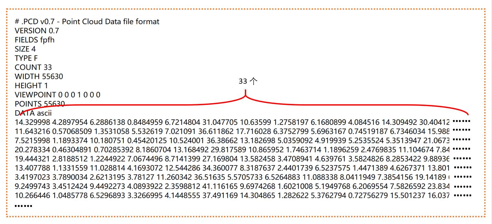

​                                                         图 4-6-21 ： **bridge_pier_fpfh.pcd** 内部信息

**bridge_pier_fpfh.pcd** 文件中每一行代表一个点，每个点有 33 个 FPFH 值。

##### FPFH 与 PFH 之间的区别[^21]：

- FPFH 只是对查询点与邻域点之间进行特征计算，可能相较 PFH 会漏掉一些重要点对；
- 由于使用 $w_k$ 权重将邻域点 $p_k$ 的 SPFH 补充在公式中，因此可以重新捕获近邻点的重要信息；
- 降低 PFH 的复杂性，在实际生活中应用更为广泛；
- 通过分解三元组简化直方图，对于每个特征维度单独绘制，然后进行连接。


#### 4-6-5 : 估计一个点云的 VFH 特征：

##### VFH 简介：

在 FPFH 描述子计算的基础上，新的特征表示形式诞生了，它就是 **VFH（Viewpoint Feature Histogram）描述子**，又称**视点特征直方图描述子**。通过它的名称我们可以知道该特征描述子的计算需要用到**视点变量**；又因为基于 FPFH 描述子，因此计算过程中还会用到**法线估计信息**。

##### VFH 的应用：

VFH 一般会用在点云聚类识别，位姿估计。其中，点云聚类识别会在后面介绍，这里不做过多解释；位姿估计是计算机视觉中的重要内容，主要用于检测物体的位置或方向[^22]。

为了能够进行点云的目标识别和位姿估计，采取了下列两方面来计算 VFH：

① 源于 FPFH 并扩展 FPFH：从一个局部的点集扩展到整个点云文件。之前计算 FPFH 是计算一个点的邻域，而这里是在计算 FPFH 时以点云中心点（空间坐标 xyz 平均值可计算得到）与点云物体表面其他所有点之间的两两点对作为计算单元，体现在图 4-6-22 中：

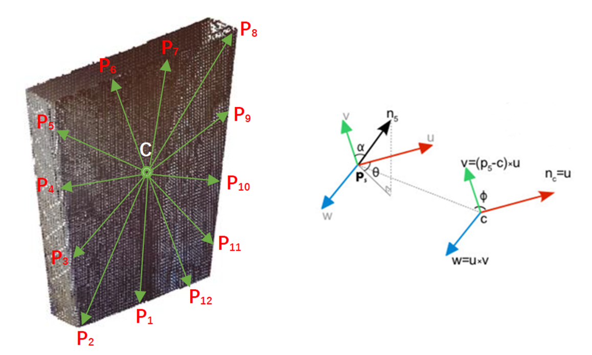

​                                                             图 4-6-22：扩展 FPFH 到整个点云示意图

通过图 4-6-22 我们可以看到选定点云中心点 $C$ 后，计算 $C$ 与其他点之间所有点对的 FPFH，右侧坐标体现了 $C$ 和其中一个点之间的 FPFH 坐标系设定以及三个角度指标的计算示意。

② 在 FPFH 的计算中将视点变量加入相对法线角计算中，体现在图 4-6-23 中：


​                                                                  图 4-6-23：视点与法线示意图

如图 4-6-23，$V_p$ 为中心点 $C$ 的视点变量，我们需要计算的是点云中每个点与 $V_p$ 连接向量与该点法线之间的角度。在上图中我们以点 $P_8$ 为例，$P_8 - V_p$ 向量与 $n_8$ 之间的夹角为 α，也就是我们所说的法线与每个点与 $V_p$ 连线的夹角。

因此，VFH 其实包括两部分特征：一部分是扩展版的 FPFH 角度，一部分是视点与每个点之间的法线的夹角。二者组成了 VFH 特征，如图 4-6-24。VFH 与 PFH 描述子、 FPFH 描述子之间的主要区别是：一个点云文件只有一个 VFH 特征，而 PFH 和 FPFH 特征的个数与点云的点数相等。


​                                                                          图 4-6-24：VFH 示意图[^23]

##### 实例：

以 **bridge_pier.pcd** 文件为例，完整代码 **vfh.cpp** 见 [附录 —— 估计点云的 VFH 特征](# 4.6.5：估计一个点云的 VFH 特征：)

下面代码是估计一个点云文件的 VFH 特征需要用到的头文件。

```c++
#include <iostream>              // 标准 C++ 库中的输入输出类相关头文件
#include <pcl/io/pcd_io.h>       // pcd 读写类相关的头文件
#include <pcl/point_types.h>     // pcl 中支持的点类型的头文件
#include <pcl/features/vfh.h>    // VFH 特征估计类头文件
#include <pcl/search/kdtree.h>   // Kdtree 头文件
#include <pcl/features/normal_3d.h>   // 法线估计头文件
```

------


下面代码分别创建点云对象 cloud，法线估计对象 ne，法线输出对象 normals 以及近邻搜索 kdtree 对象 tree1：

```c++
    // 创建一个点云对象 cloud ，并将 bridge_pier.pcd 加载到 cloud 中   
    pcl::PointCloud<pcl::PointXYZ>::Ptr cloud(new pcl::PointCloud<pcl::PointXYZ>);
	pcl::io::loadPCDFile(".../bridge_pier.pcd", *cloud);

	// 创建法线估计对象 ne
	pcl::NormalEstimation<pcl::PointXYZ, pcl::Normal> ne;

	// 存储法线输出数据集 normals
	pcl::PointCloud<pcl::Normal>::Ptr normals(new pcl::PointCloud<pcl::Normal>());

	// 创建一个空的 kdtree 对象 tree1
	pcl::search::KdTree<pcl::PointXYZ>::Ptr tree1(new pcl::search::KdTree<pcl::PointXYZ>);
```

------


下面代码设置法线估计的输入点云，输入法线对象，近邻搜索对象和近邻搜索半径，最后计算法线特征值：

```c++
    // 将法线对象输入到 tree1 中 ，分别设置近邻搜索对象和搜索半径（或近邻搜索个数）  
    tree1->setInputCloud(cloud);
	ne.setInputCloud(cloud);
	ne.setSearchMethod(tree1);
	ne.setRadiusSearch(0.03);// 使用半径在查询点周围 3 厘米范围内的所有近邻元素
	//或者 ne.setKSearch(50);  根据点周围 50 个点进行平面拟合（选取周围 50 个点作为近邻点）

	// 计算特征值
	ne.compute(*normals);
```

------


下面代码是真正开始估计 VFH 的代码部分：首先创建一个 VFH 估计对象 vfh，并把输入数据集 cloud 和法线 normals 传递给它；创建一个空的 kd-tree 对象 tree2（区分与之前估计法线时的 tree1），并把它传递给 VFH 估计对象 vfh；创建 VFH 信息的输出数据对象 vfhs；计算特征值，最后将含有 VFH 信息的对象 vfhs 保存在 **bridge_pier_vfh.pcd** 中。在结果文档中只有一个 VFH 信息结果，这一个 VFH 信息包含 308 个数据，对应 VFHSignature308 中的 308：

```c++
    // 创建 VFH 估计对象 vfh，并把输入数据集 cloud 和法线 normals 传递给它 
	pcl::VFHEstimation<pcl::PointXYZ, pcl::Normal, pcl::VFHSignature308> vfh;
	vfh.setInputCloud(cloud);
	vfh.setInputNormals(normals);

	// 创建一个空的 kd-tree 对象，并把它传递给 VFH 估计对象
	pcl::search::KdTree<pcl::PointXYZ>::Ptr tree2(new pcl::search::KdTree<pcl::PointXYZ>());
	vfh.setSearchMethod(tree2);

	// 输出数据集 
	pcl::PointCloud<pcl::VFHSignature308>::Ptr vfhs(new pcl::PointCloud<pcl::VFHSignature308>());

	// 计算特征值
	vfh.compute(*vfhs);

	// 保存 VFH 信息
	pcl::io::savePCDFile(".../bridge_pier_vfh.pcd", *vfhs);
```

为什么是 VFHSignature308？VFH 包含两部分内容，一方面是 FPFH 的扩展，默认是 45 个子区间，每个子区间计算 4 个特征（三个角度加上查询点和近邻点之间的距离），含有 $4* 45 = 180$ 个元素；另一方面是视点与每个点之间的法线的特征，默认是 128 个子区间，因此含有 128 个元素。最终合并后一共是 $180+128 = 308$ 。

------

下图是 **bridge_pier_vfh.pcd** 内部信息：

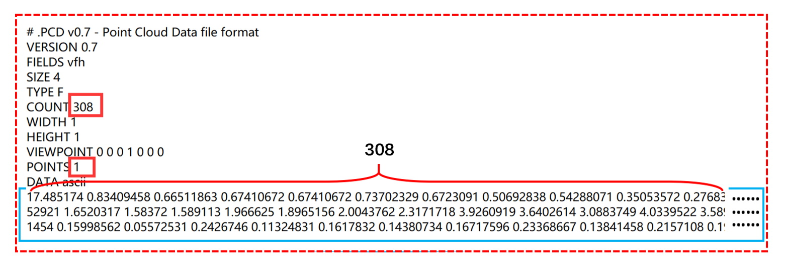

​                                                   图 4-6-25： **bridge_pier_vfh.pcd** 内部信息

如图 4-6-25，虽然数据部分显示了三行，并不意味着有三个点对应的 VFH，而是一个包含 308 个元素的 VFH 值，排成了三行。同样地，我们也可以看图中红框内的 POINTS 1 以及 COUNT 308（回顾之前介绍 pcd 文件内部信息时对这些文件头的介绍）。


### 4-7：Registration

#### 背景介绍：

当我们使用扫描仪获取数据时，每次扫描是从一个固定角度和方位进行的，只能捕捉到场景（即被扫描物体）的一部分。而且，很多时候场景周围由于地势和实际情况等，导致场景的某些部分被遮挡，或者存在死角。所以，要拥有尽量覆盖场景的点云，通常我们就需要多机位，多个角度和方位去围绕扫描场景一周这样去进行扫描。每个角度方位扫描一次就会得到一个 scan，这样整个场景扫描完会有一系列的 scans。如下图所示：

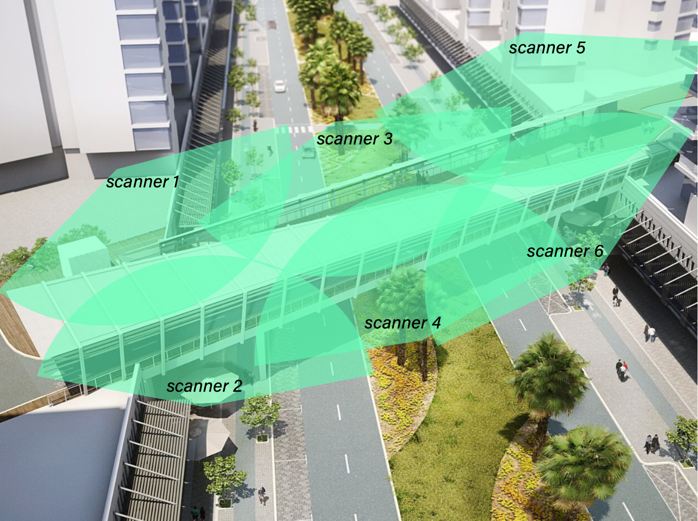

​                                                             图 4-7-1：扫描仪获取 scans 示意图[^24]

对于一个目标物体，我们在其周围从不同角度进行多次扫描（通常扫描是每次都默认 360 度全视角扫。上图中的绿色扇形区域是每个扫描仪所在机位的 scan 范围（它们不是360度全视角扫描，因为区域是扇形））。

要得到一个完整的场景点云，就需要通过找 scan 与 scan 之间的 overlap —— 重叠部分进行拼接，即我们所谓的registration —— 配准。Registration 的结果就是所有 scans 拼接好后整体的场景点云。拼接的过程（即registration）是需要复杂的变换（后面有所提及），因为每个角度方位和得到的 scans 之间的旋转程度都不同。

图 4-7-2 中将 (a) 和 (b) 通过配准后拼接到 (c) 中的完整建筑：


​                                                                    图 4-7-2：Registration 示意图[^25]

总的来说，registration 其实就是找 scans 中的重叠部分 overlap, 然后进行拼接/合并 scans 得到一个整体的点云的过程。

#### 配准的大体思路：

通过旋转、平移等一系列操作，将多个点云数据整合到一个统一的坐标系下，我们需要计算的是操作过程中的旋转矩阵和平移向量。

> 注意：本章节算法涉及机器视觉的知识，读者需自行补充，这里不做详细讲解。


#### 4-7-1 : PCL 中与配准相关的概念：

##### ① 两两配准（pairwise registration）：

顾名思义，就是两个点云之间的配准，如图 4-7-3：两只空间位置不同并且几何结构有差异的兔子进行点云配准。

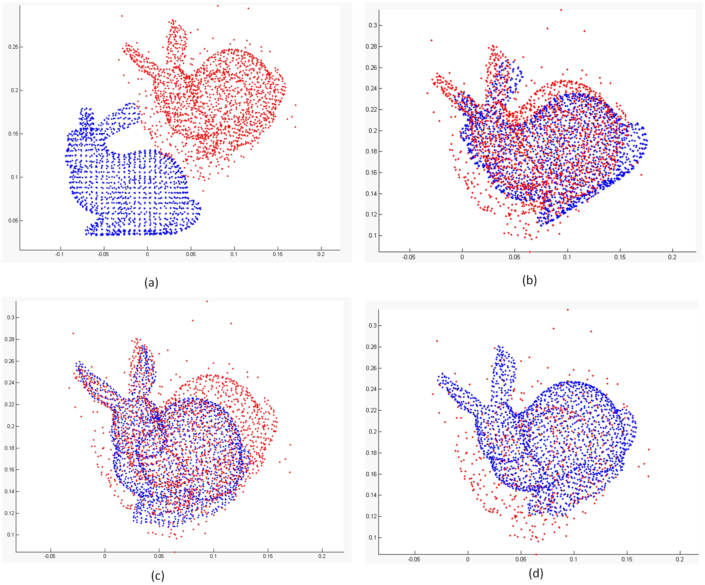

​                                                                       图 4-7-3：两两配准示意图[^26]

具体实现步骤：

step1：按照**一致的关键点选取标准**从两个点云中提取 NARF 关键点；

step2：对选择的所有关键点计算其 NARF 特征描述子；

step3：根据两个点云的 NARF 特征描述子位置的相似度估算对应关系，得到对应点对的初步估计；

step4：降噪，将错误的点对（对应关系）去除；

step5：根据剩下的正确的对应点对估计刚体变换 —— 即平移和旋转操作（其中，step1 和 step2 的关键点和特征描述子的提取对于这里的刚体变换非常重要，前面的提取准确会使得刚体变换计算的无误性提高），后面会简单介绍刚体变换，配准至此完成。

##### ② 对应估计（correspondences estimation）：

使用 PCL 搜索进行配准的点云之间的对应关系，也即两两配准步骤中的 step3，根据特征的相似度进行对应关系的估算，如图 4-7-4：


​                                                                          图 4-7-4：对应估计示意图[^27]

对应估计有两种：

1. 直接对应估计（默认）：为点云 A 中的每一个点搜索另一个点云 B 中的对应点；

2. 相互对应估计：先为点云 A 中的每一个点搜索另一个点云 B 中的点；再反过来，为点云 B 中的每一个点搜索点云 A 中的对应点，最后取二者交集。


对应关系的估算要根据特征的类型使用不同的方法，特征有两种：一种是点的坐标特征，一种是点的邻域特征。下面是两种情况的估算方法：

- 点的坐标特征，使用点的 xyz 坐标为特征值：

​       (1) 穷举配准（brute force matching）；

​       (2) Kdtree 最近邻查询（FLANN）；

​       (3) 在有序点云数据的图像空间中查找；

​       (4) 在无序点云数据的索引空间中查找。

- 点的邻域特征，由点的邻域确定，如法向量等：

​       (1) 穷举配准（brute force matching）；

​       (2) Kdtree 最近邻查询（FLANN）；

##### ③ 对应关系去除（correspondences rejection）：

在点云数据中会存在大量的噪声，如果我们保留了噪声造成的错误点对，会对于后来刚体变换的估算产生不利影响，因此错误对应关系的去除是十分必要的。这样既可以提高最后刚体变换的准确度，也可以通过减少对应点对来提高运算的效率。常用的对应关系去除方法有随机采样一致性（Random Sample Consensus, RANSAC）估计。

注意：遇到有一对多的对应关系，即目标模型中的一个点对应源中的若干个点与之对应。可以通过只取与其距离最近的对应点或者根据一些滤波方法过滤掉其他伪对应关系。[^21]

##### ④ 变换矩阵估算（transformation estimation) ：

这里的变换矩阵就是之前我们提到的刚性变换，也即配准中极为关键的一环，只有这个对原始点云做出转换的矩阵计算准确，我们才能最终配准成功，具体步骤如下：

step1：在计算对应关系的基础上评估一些错误的度量标准；

step2：在摄像机位姿和最小化度量标准下估算一个刚体变换；

step3：优化点的结构；

step4：使用计算得到的刚体变换把原始点云旋转或平移，使得要配准的所有点云在同一个坐标系下，进行内部 ICP 循环（ICP 见 4-7-2）；

step5：使用 ICP 循环进行迭代，直到符合收敛判断标准为止。


#### 4-7-2 ：迭代最近点（ICP）算法：

##### 迭代最近点算法（Iterative Closest Point，简称 ICP 算法）：

ICP 算法是点云配准常用的算法：根据配准的定义，寻找满足收敛条件的最优刚性变换（旋转矩阵和平移矩阵），使得来自不同视点（即不同观察点）的点云可以转换到统一坐标系下。

ICP 算法具体步骤：

step1：将多个点云分为源点云和目标点云（目标点云所在的坐标系也就是我们最终配准需要统一到的坐标系，只能有一个，而源点云可以有多个），对于目标点云中的每个点，搜索源点云中的对应点，也即差异最小的点，得到大量对应点对；

step2：求刚体变换，使得 step1 中得到的对应点对的均方根（root mean square，RMS）最小，利用该刚体变换来进行点云坐标的转换；

step3：迭代，重复上述操作，直到相邻两次迭代的均方根差的绝对值小于某一阈值，终止算法。得到最终满足收敛条件的刚性变换。

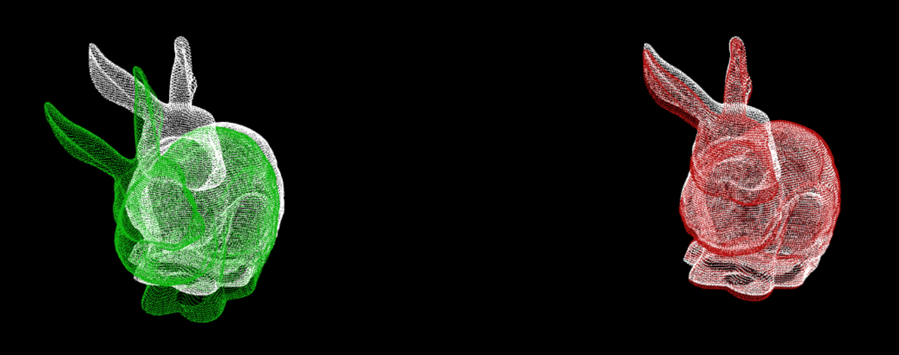

​                                                                       图 4-7-5：点云配准示意图[^28]

如图 4-7-5 所示，左侧白色兔子点云（配准的目标点云）和绿色兔子点云（源点云）为两个需要配准的点云，右侧为使用 ICP 后配准的结果，红色即为配准后的点云，可见与白色兔子相差较小。

> 关于 “源点云” 和 “目标点云”：
>
> - 源点云是我们要进行旋转平移的操作点云，是要被进行配准的；
> - 目标点云是我们要配准到的点云，是我们配准的目标；
> - 我们最终希望看到的，是源点云从当前的位置被配准到目标点云的位置，并实现相同部位的重合。


##### 实例：

利用 **bunny3.pcd** 和 **bunny4.pcd** （见教程文件夹）来进行点云配准（应用 ICP），完整代码 **ICP_registration.cpp** 见 [附录 —— ICP 点云配准](# 4.7.2：如何使用迭代最近点（ICP）算法：)。

原始点云 **bunny3.pcd** 放入 CloudCompare 中进行视图：


​                                                                 图 4-7-6：**bunny3.pcd** 视图

原始点云 **bunny4.pcd** 放入 CloudCompare 中进行视图：


​                                                                 图 4-7-7：**bunny4.pcd** 视图

可以看到 **bunny3.pcd** 缺失兔子尾巴，**bunny4.pcd** 缺失兔子耳朵，并且二者在空间上并不重合。我们接下来要做的是将 **bunny3.pcd** （源点云）配准到 **bunny4.pcd** （目标点云）所在的坐标系中，使得二者拼接成一个完整的兔子。

下面是代码详解：

下面四行代码是使用 ICP 进行点云配准所需的头文件。

```c++
#include <iostream>                // 标准输入输出头文件
#include <pcl/io/pcd_io.h>         // I/O 操作头文件
#include <pcl/point_types.h>       // 点类型定义头文件
#include <pcl/registration/icp.h>  // ICP 配准类相关的头文件
```

------


下面代码创建两个点云对象 cloud1 和 cloud2，分别将 **bunny3.pcd** 和 **bunny4.pcd** 加载到这两个点云对象中：

```c++
    pcl::PointCloud<pcl::PointXYZ>::Ptr cloud1(new pcl::PointCloud<pcl::PointXYZ>);
	pcl::PointCloud<pcl::PointXYZ>::Ptr cloud2(new pcl::PointCloud<pcl::PointXYZ>);

	pcl::io::loadPCDFile(".../bunny3.pcd", *cloud1);
	pcl::io::loadPCDFile(".../bunny4.pcd", *cloud2);
```

------


下面代码分为两部分，第一部分进行 ICP 算法的实际操作（包括 ICP 对象 icp 的创建和参数的设置）；第二部分创建点云对象来存储配准后的结果点云。设置参数在代码块后*

```c++
    // 进行 ICP 算法，设置参数
    pcl::IterativeClosestPoint<pcl::PointXYZ, pcl::PointXYZ> icp;
	icp.setInputSource(cloud1);
	icp.setInputTarget(cloud2);
	icp.setMaxCorrespondenceDistance(1.5);
	icp.setMaximumIterations(100);
	icp.setTransformationEpsilon(1e-10);
	icp.setEuclideanFitnessEpsilon(0.01);
    
    // 创建点云对象用来存储配准后的结果点云
	pcl::PointCloud<pcl::PointXYZ> Final;
	icp.align(Final);
```

*其中，需要设置的参数有[^29]

**setInputSource**：将源点云 cloud1 输入到 icp 中；

**setInputTarget**：将目标点云 cloud2 输入到 icp 中；

**setMaxCorrespondenceDistance**：在此范围内的点将被选入对应点对的考虑范围；

**setMaximumIterations**：第一个约束，迭代次数，几十上百都可能出现；

**setTransformationEpsilon**：第二个约束，一般设为 1e - 6 或者更小；

**setEuclideanFitnessEpsilon**：第三个约束，前后两次迭代误差的差值；

最后，得到的配准结果点云通过 icp.align 得到。

------


下面代码输出设置好参数后的 ICP 算法对于我们输入的点云进行配准的评分结果：getFitnessScore 的值越大代表效果越差，因为这个值代表配准后的点云与目标点云坐标的距离，距离越小，说明配准越准确。随后创建矩阵对象 transformation 来存储刚性变换矩阵并将其输出，最后将配准结果保存到 **bunny_registration.pcd** 中。

```c++
    std::cout << "has converged:" << icp.hasConverged() << " score: " <<
		icp.getFitnessScore() << std::endl;

	Eigen::Matrix4f transformation = icp.getFinalTransformation();
	std::cout << transformation << std::endl;

	pcl::io::savePCDFile(".../bunny_registration.pcd", Final);
```

------

下图是配准结果：紫色对应 **bunny3.pcd**，蓝色对应 **bunny4.pcd**，黑色对应 **bunny_registration.pcd**，也即 **bunny3.pcd** 经过配准后的输出结果点云。我们将结果拉入CloudCompare展示，可以看到，经过点云配准后的 **bunny_registration.pcd** 与 **bunny4.pcd** 大部分地方重合并且在一定程度上补充了 **bunny4.pcd** 所缺失的耳朵部分，但结果出现了双墙现象（4-11 会介绍，这里不做重点展开）。


​                                                                     图 4-7-8：点云的配准结果

通过图 4-7-8 可以看出，目标点云 **bunny4.pcd** 与 配准后的结果点云 **bunny_registration.pcd** 在一定程度上重合（没有完全重合，有双墙）。同样地，我们可以通过该代码输出 ICP 算法评分和刚性变换矩阵，如图 4-7-9：


​                                                         图 4-7-9：运行结果中评分和矩阵部分

通过图 4-7-9 可知，此次 ICP 算法配准的评分为红框中的 2.75078e-05，较小，因此配准结果粗略可以。图中黄框内即为刚性变换的矩阵。

4 × 4 的刚体变换矩阵，即代表旋转和平移的量，其结构可以拆分为：
$$
\left(\begin{array}{cc}\boldsymbol{R}_{3 \times 3} & \boldsymbol{t}_{3 \times 1} \\ \mathbf{0}_{1 \times 3} & 1\end{array}\right)
$$
$\boldsymbol{R}_{3 \times 3}$ 为旋转矩阵，$\boldsymbol{t}_{3 \times 1}$ 为平移向量。具体计算可以参照 https://zhuanlan.zhihu.com/p/35901184

计算刚体变换矩阵后，从一个点  $Q(q_{x},q_{y},q_{z})$  移动到另一个点  $P(p_{x},p_{y},p_{z})$ 公式如下：
$$
\left(\begin{array}{l}q_{x} \\ q_{y} \\ q_{z} \\ 1\end{array}\right)=\left(\begin{array}{cc}\boldsymbol{R}_{3 \times 3} & \boldsymbol{t}_{3 \times 1} \\ \mathbf{0}_{1 \times 3} & 1\end{array}\right)\left(\begin{array}{c}p_{x} \\ p_{y} \\ p_{z} \\ 1\end{array}\right)
$$


### 4-8 ：Search

三维点云数据与一维数据以及二维的图像信息不同：

一维数据是根据向左或向右平移当前位置查找其他位置的点，如图 4-8-1：

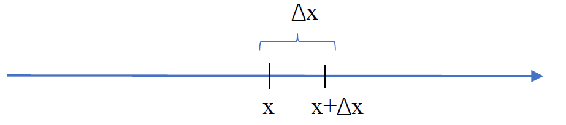

​                                                                         图 4-8-1：一维状态下索引

二维图像是根据像素位置进行索引，如图 4-8-2：


​                                                                          图 4-8-2：二维状态下索引[^30]

三维点云的数据不规则（散乱分布的点），没有 “次序” 来进行检索。因此我们引进点云空间索引方法，即通过点的邻域进行搜索。比较常用的索引方法有 Octree 和 Kdtree，在介绍它们之前，我们先对最近邻搜索 Nearest Neighbor Search 以及二叉树 Binary Search Tree 进行初步了解。


#### 4-8-1：Nearest Neighbor Search（NNS)：

提到搜索，值得一提的是最近邻搜索（Nearest Neighbor Search，NNS）。NNS 的应用广泛，通常被用在法线的估计（Normal estimation），噪声滤波（Noise filtering），采样（Sampling），聚类（Clustering），深度学习（Deep learning），特征检测/描述（Feature detection/description）等场景中。NNS 一般包括两种搜索方法：K-NN，Fixed Radius-NN。

##### K-NN：

在空间 $M$ 中有一堆点集 $S$ ，对于 $M$ 中的一个查询点 $q$，找到它在点集 $S$ 中距离最近的 $K$ 个点：

如图 4-8-3，红色点即为查询点 $q$。当 K = 3 时，我们搜索的是给定点集 $S$ （也即图中全部蓝色和绿色点）中距离 $q$ 最近的 3 个点，也就是图中标绿的三个点。

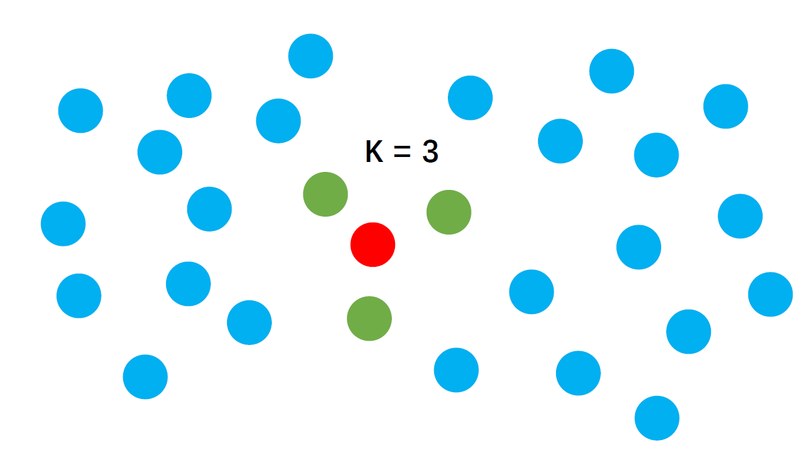

​                                                                          图 4-8-3：K-NN 示意图


##### Fixed Radius-NN：

在空间 $M$ 中有一堆点集 $S$ ，对于 $M$ 中的一个查询点 $q$，找到它在点集 $S$ 中与 $q$ 的距离小于等于 $R$ 的点，其中 $R$ 是搜索半径：

如图 4-8-4，为 Fixed Radius-NN 示意图。红色点为查询点 $q$，绿色点为点集 $S$ 中与 $q$ 距离小于等于 $R$ 的点，也即我们使用 Fixed Radius-NN 搜素到的符合条件的点。


​                                                                图 4-8-4：Fixed Radius-NN 示意图


#### 4-8-2：Binary Search Tree（BST)：

上一节我们介绍了最近邻搜索（NNS），这种搜索方法被广泛地应用在很多问题中。但是对于点云来说，最近邻搜索存在一些困难：

- 对于二维图像来说，一个像素的近邻 neighbor 就是该点坐标分别添加一个变量 $x+\Delta x,  y+\Delta y$	

  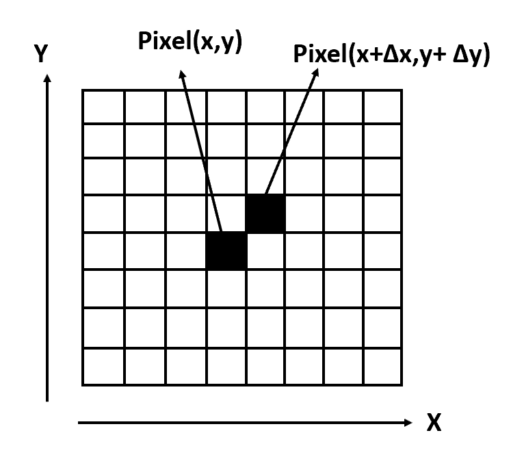

  ​                                                                  图 4-8-5：像素示意图

- 但是对于点云来说：1  点云不规则，不是基于网格进行排列的

  ​                                   2  大部分点云文件数据众多，使得运算次数过多

为了更加方便地利用 NNS 进行点云的搜索，我们引进了两种树状结构数据 tree —— Octree 和 Kdtree，使得我们在海量点面前可以快速查找近邻 neighbors。而二叉树 Binary Search Tree（BST）又是进行 Kdtree 的基础。下面我们介绍一下 BST。

##### BST 概念：

tree（树）：一种数据结构，它是由 n（n>=1）个有限节点组成一个具有层次关系的集合。把它叫做 “树” 是因为它看起来像一棵倒挂的树，也就是说它是根朝上，而叶朝下的。它具有以下的特点：每个节点有 0 个或多个子节点；没有父节点的节点称为根节点；每一个非根节点有且只有 1 个父节点；除了根节点外，每个子节点可以分为多个不相交的子树。[^31]

Binary Search Tree（BST），即我们所说的二叉树搜索方法，主要用来处理一维数据，是 Kdtree 的思想基础。BST 是一种基于 node（节点）的树状数据结构，如图 4-8-6 所示：


​                                                                          图 4-8-6：“野生倒挂二叉树”[^32]

图 4-8-6 是一个形象的例子，用一棵恰好每个分叉都是二分叉的自然界的树来加深对于二叉树的理解。

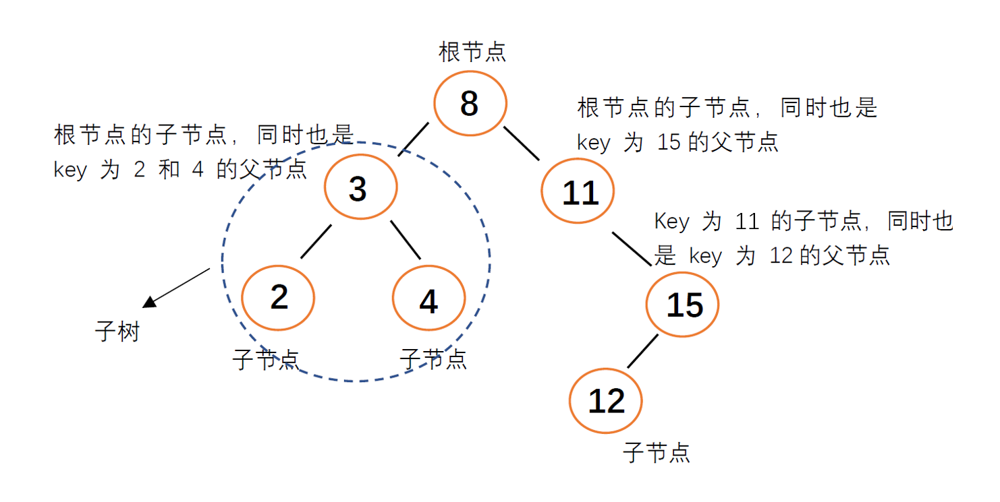

​                                                                            图 4-8-7：BST 示意图

图 4-8-7 是一个 BST 例子，它便是图 4-8-6 的近似倒挂的呈现。其中橙色的圆圈叫做 node（节点）；node 上的数字为该 node 的 key；最上方 key 为 8 的 node 称为根节点，它下一级的 node 称为它的子节点；key 为 3 的子节点和它本身的子节点（key 为 2，key 为 4）组成根节点子树（subtree）。其他子节点和子树以此类推。

##### BST 规则：

BST 遵循以下规则：

- node 左边的子树 subtree 包含的 key 小于该 node 的 key；
- node 右边的子树 subtree 包含的 key 大于该 node 的 key；
- node 左边/右边的 subtree 也是一个 BST；

如图 4-8-7 所示：根节点的 key 为 8，左侧 subtree 的 key 为 3，小于 8；3 左侧 subtree 的 key 为 2，小于 3；3 右侧 subtree 的 key 为 4，大于 3。其他 subtree 的节点以此类推。

##### BST 计算：

下面举例介绍 BST 的计算：

已知一列排好序的数据：[80, 20, 400, 15, 25, 30]，下面构造 BST。图 4-8-8 为构造过程示意图：


​                                                                    图 4-8-8：BST 构造过程示意图

如图 4-8-8 所示，由于我们的数据已经按顺序排好，因此我们按照数据本身的排列方式开始 BST 的构造：

首先第一个数据 80 就作为 BST 的根节点；

接下来看第二个数据 20，根据 BST 的三个原则，20<80，因此 key 为 20 的子节点应该在根节点的左侧；

接下来第三个数据 400>80，因此在根节点的右侧；

第四个数据 15<80，向根节点左侧走，发现此时的根节点左侧子节点已被 key 为 20 的子节点占位，则继续向 20 的子节点前进，由于 15<20，因此 key 为 15 的子节点在 key 为 20 的节点的左侧；

其他子节点以此类推，最终得到最右边的最终版 BST，也即我们所要求的给定数据的 BST。


#### 4-8-3 ： Kdtree：

前面两节介绍了点云中搜索的基本知识—— NNS（最近邻搜素）和 BST（二叉树），其中 BST 是本节内容 Kdtree 的基础。之所以这样说，是因为 Kdtree 实际是在每个维度都进行一次 BST。

##### Kdtree 概念 ：

“K” 是指 K 维，“d” 是 “dimensional” 的第一个字母，也就是维度的意思。Kdtree 也即 K 维树，通常依据数据在分割轴上的中位数进行划分（中位数体现在后续讲述 Kdtree 建立的过程中）。

作为一种基于空间划分的数据结构，常被用在高维的搜索中，如果只将点云的空间坐标作为维度，那么在点云中应用 Kdtree 时实际是 3 维树。之前介绍的 BST 的划分结果是叶子节点中只有一个数据或没有数据，但 Kdtree 有一个 leaf_size，也就是可以设置最后划分结束时叶子节点中的数据个数。leaf_size = n 说明最后子节点里如果包含的数据小于等于 n，则为叶子节点，不再继续划分这个子节点，否则继续划分。

##### Kdtree 构建 ：

Kdtree 的建立有两种约定：

**A.** 划分时划分界限经过数据；

**B.** 划分时划分界限绕开数据；

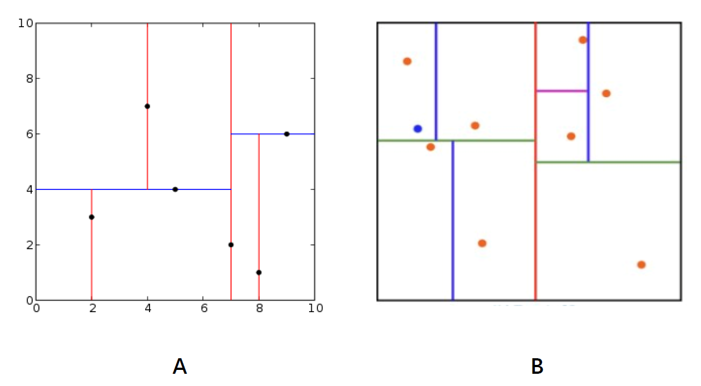

​                                                                   图 4-8-9：Kdtree 建立的两种约定[^33]

由于二维视图方便，因此这里我们用二维树（Kdtree 中的 K 为 2）作为例子进行阐述。如图 4-8-9 所示，左侧为 A 类约定下的划分，可以看到每次划分的界限（蓝色和红色的线段）都贯穿我们的数据点；而右侧的 B 类约定则恰好全部绕过数据点进行划分。这里我们选取 A 类约定进行讲解。

Kdtree 的建立过程中涉及到每次分割所选择的分割轴问题，这里介绍两种选择方法：

- 自适应（adaptive），选择方差最大的维度，也就是我们视觉上数据分布最分散的那个轴（最宽的轴）


​                                                            图 4-8-10：自适应划分的两个例子

如图 4-8-10 所示，左侧例子中 Y 轴方向上的数据比 X 轴的数据更加分散，如果我们计算数据在每个轴上的方差，则为 Y 轴的方差大，因此分割 Y 轴，分割线是图中红色虚线，右侧与之相反。一般最开始的那个分割轴的选取是基于这种自适应的方法。

- 轮流切换坐标轴，比如我们数据是二维的，分割轴的选择顺序可以是 x-y-x-y-x ……；如果数据是三维的，分割轴的选择顺序可以是 x-y-z-x-y-z-x ……

接下来介绍 Kdtree 建立过程（以 Kdtree 的维基百科解释中的实例为例）：

给定一列二维数据：{ (2, 3)，(5, 4)，(9, 6)，(4, 7)，(8, 1)，(7, 2)}，leaf_size = 1。图 4-8-11 是我们对于给定二维数据建立的 Kdtree（右侧） 以及平面划分示意图（左侧）：

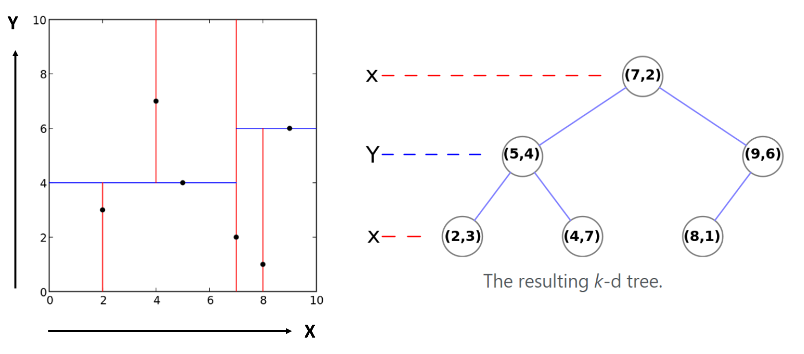

​                                                              图 4-8-11：Kdtree 构建示意图[^33]

其中，由于 X 轴方向的方差比 Y 轴大，因此第一个分割轴为 X 轴，六个数据的 X 值的中位数为 7，因此第一条划分线是左侧图中贯穿 (7, 2) 的红线，(7, 2) 也就是我们所说的根节点；划分结束后，根节点的左子树包括 { (2, 3)，(5, 4)，(4, 7)}，右子树包括  {(9, 6)，(8, 1)}；接着进行子树的划分，此时分割轴切换为 Y 轴，左子树 Y 值的中位数为 4，因此分割轴为左侧图中经过 (5, 4) 的蓝线，此时(5, 4) 的左右子树都只包含一个数据，满足 leaf_size 的设置，因此划分结束。根节点右子树的划分以此类推。呈现在树结构中即为图 4-8-11 右侧示意图。

##### Kdtree 搜索 ：
4-8-1 Search_Nearest Neighbor Search 中介绍了最近邻搜索方法，包括 K-NN 和 Fixed Radius-NN， Kdtree 搜索也可以应用这两种方法：

实例：对随机生成的点云数据进行 Kdtree 搜索（对 K-NN 和 Fixed Radius-NN 两种搜索思路都有体现） 

完整代码 **kdtree.cpp** 见 [附录 —— Kdtree](# 4.8.3：Kdtree：)，下面是代码详解：

下面五行代码是进行 Kdtree 搜索时需要用到的头文件：

```C++
#include <pcl/point_cloud.h>          // 点云头文件
#include <pcl/kdtree/kdtree_flann.h>  // Kdtree 头文件
#include <iostream>                   // 标准 C++ 库中的输入输出类相关头文件
#include <vector>                     // 表示引用了vector类的头文件
#include <ctime>                      // 获取和操作日期和时间的头文件 
```

------


下面一行代码意思是设置随机数的种子，在这里 srand () 中参数是 time，因此种子数会随着电脑内置时间的变化而变化，所以每次生成的随机数都不同：

```C++
	srand(time(NULL));
```

------


下面代码利用随机数和 for 循环创建一个点云文件，点云总数为 1000：

```C++
	pcl::PointCloud<pcl::PointXYZ>::Ptr cloud(new pcl::PointCloud<pcl::PointXYZ>);

	// Generate pointcloud data
	cloud->width = 1000;
	cloud->height = 1;
	cloud->points.resize(cloud->width * cloud->height);

	for (std::size_t i = 0; i < cloud->points.size(); ++i)
	{
		cloud->points[i].x = 1024.0f * rand() / (RAND_MAX + 1.0f);
		cloud->points[i].y = 1024.0f * rand() / (RAND_MAX + 1.0f);
		cloud->points[i].z = 1024.0f * rand() / (RAND_MAX + 1.0f);
	}
```

------


下面代码首先创建一个 Kdtree 对象 kdtree；然后将之前生成的点云 cloud 作为接下来要用 Kdtree 搜索的输入点云；再创建一个包含 xyz 信息的点 searchPoint，也就是我们进行搜索时的搜索点。我们要搜索的是该点的近邻点，searchPoint 也是通过随机数的方式产生：

```C++
	pcl::KdTreeFLANN<pcl::PointXYZ> kdtree;
	kdtree.setInputCloud(cloud);
	pcl::PointXYZ searchPoint;
	searchPoint.x = 1024.0f * rand() / (RAND_MAX + 1.0f);
	searchPoint.y = 1024.0f * rand() / (RAND_MAX + 1.0f);
	searchPoint.z = 1024.0f * rand() / (RAND_MAX + 1.0f);
```

------


下面是使用 K-NN 进行搜索的具体代码实现：首先设置 K-NN 中的 K，也就是我们要搜索 searchPoint 周围的 K 个点，这里是要搜索 10 个点；然后创建 K-NN 搜索结果点的索引向量 pointIdxNKNSearch 和 K-NN 搜索结果点与 searchPoint 距离平方的向量 pointNKNSquaredDistance；最后输出 searchPoint 的 xyz 值以及 K 值：

```C++
    // K nearest neighbor search
	int K = 10;
	std::vector<int> pointIdxNKNSearch(K);
	std::vector<float> pointNKNSquaredDistance(K);
	std::cout << "K nearest neighbor search at (" << searchPoint.x
		<< " " << searchPoint.y
		<< " " << searchPoint.z
		<< ") with K=" << K << std::endl;
```

------


下面通过将 searchPoint，K，pointIdxNKNSearch，pointNKNSquaredDistance 输入 kdtree.nearestKSearch ()；执行 K 近邻查找，判断是否查找成功，如果成功则函数返回值 > 0，输出每个搜索结果点的 xyz 值以及它们每个点与 searchPoint 距离的平方：

```C++
    if (kdtree.nearestKSearch(searchPoint, K, pointIdxNKNSearch, pointNKNSquaredDistance) > 0)
	    {
		    for (std::size_t i = 0; i < pointIdxNKNSearch.size(); ++i)
			    std::cout << "    " << cloud->points[pointIdxNKNSearch[i]].x
			    << " " << cloud->points[pointIdxNKNSearch[i]].y
			    << " " << cloud->points[pointIdxNKNSearch[i]].z
			    << " (squared distance: " << pointNKNSquaredDistance[i] << ")" <<     std::endl;
	    }
```

------


下面是使用 Fixed Radius-NN 进行搜索的具体实现代码：首先利用随机数设置进行搜索的 radius，然后创建每个搜索结果点索引向量 pointIdxRadiusSearch 和每个搜索结果点与 searchPoint 距离平方的向量 pointRadiusSquaredDistance，输出 searchPoint 的 xyz 值以及 radius 值：

```C++
    // Neighbors within radius search
	float radius = 256.0f * rand() / (RAND_MAX + 1.0f);
	std::vector<int> pointIdxRadiusSearch;
	std::vector<float> pointRadiusSquaredDistance;
	std::cout << "Neighbors within radius search at (" << searchPoint.x
		<< " " << searchPoint.y
		<< " " << searchPoint.z
		<< ") with radius=" << radius << std::endl;
```

------


下面通过将 searchPoint，radius，pointIdxRadiusSearch，pointRadiusSquaredDistance输入 kdtree.nearestKSearch ()，执行 Radius 近邻查找，判断是否查找成功；如果成功则函数返回值 > 0，输出每个搜索结果点的 xyz 值以及它们每个点与 searchPoint 距离的平方：

```C++
    if (kdtree.radiusSearch(searchPoint, radius, pointIdxRadiusSearch, pointRadiusSquaredDistance) > 0)
	    {
	    	for (std::size_t i = 0; i < pointIdxRadiusSearch.size(); ++i)
			    std::cout << "    " << cloud->points[pointIdxRadiusSearch[i]].x
			    << " " << cloud->points[pointIdxRadiusSearch[i]].y
			    << " " << cloud->points[pointIdxRadiusSearch[i]].z
			    << " (squared distance: " << pointRadiusSquaredDistance[i] << ")"     << std::endl;
	    }
```

------

图 4-8-12 为代码运行结果：


​                                                             图 4-8-12：Kdtree 搜索代码运行结果

如图 4-8-12 所示：红色部分为 K-NN 的搜索结果：第一行指明随机生成的 searchPoint 为（681.344，313.063，365.844）。因为 K 设置的是 10，因此一共搜索到该 searchPoint 的近邻点十个，每个点与 searchPoint 距离的平方在每个点后面的括号中输出；蓝色部分为 Fixed Radius-NN 的搜索结果，第一行指明随机生成的 searchPoint 也为（681.344，313.063，365.844），因为我们在代码中只设置了一次 searchPoint，因此两种搜索方法的 searchPoint 是一样的，利用该方法搜索到的近邻点有两个，它们距离 searchPoint 的距离都小于 radius（93.3203）。同样，每个点与 searchPoint 距离的平方在每个点后面的括号中输出。


#### 4-8-4 : Octree：

除了上一节介绍的 Kdtree 外，Octree 也是搜索的重要方法。

##### Octree 概念：

八叉树，利用立方体进行空间划分的数据结构。

##### Octree 特点：

- 每个节点最多有 8 个子节点，这一点与之前介绍的 BST 不同， BST 每个节点最多包含 2 个子节点；
- 应用在三维场景中（因为 Octree 是对每个维度进行分割。对立方体的每个维度切一刀，三维数据最终切割结果是 $2^3 = 8$，所以叫 “八” 叉树）
- Octree 的划分基本单元是 octant，也就是小立方体。

图 4-8-13 和图 4-8-14 是 Octree 的两个示意图，图 4-8-13 可以看出每个节点最多有八个子节点，并在右侧绘制了八叉树的树状结构；图 4-8-14 左侧可以看到在每次划分时的每个小立方体状的子节点，在每次划分时为立方体绘制了不同的颜色，是 Octree 划分三维空间的直观体现。


​                                                                     图 4-8-13：Octree 示意图 1


​                                                                  图 4-8-14：Octree 示意图 2[^34]


##### Octree 搜索：

与 BST 和 Kdtree 一样，Octree 也可以利用 K-NN 和 Fixed Radius-NN 的搜索方法；除此之外，由于 Octree 本身利用小立方体进行划分的这一特点，它还有自己独特的一种搜索方法：体素（也就是每次划分的小立方体）内近邻搜索（Neighbours within Voxel Search），下面利用实例进行代码实现：

实例：利用随机数生成点云，并分别采取三种搜索方式进行 Octree 近邻点搜索，三种方法分别是：

- 体素（也就是每次划分的小立方体）内近邻搜索（Neighbours within Voxel Search） 
- K-NN 搜索
- Fixed Radius-NN 搜索

完整代码 **Octree.cpp** 见 [附录 —— Octree](# 4.8.4：Octree：) ，下面是代码详解：

下面几行代码是实现 Octree 搜索需要的头文件：

```c++
#include <pcl/point_cloud.h>            // 点云头文件
#include <pcl/octree/octree_search.h>   // Octree 搜索需要用到的头文件
#include <iostream>                     // 标准 C++ 库中的输入输出类相关头文件
#include <ctime>                        // 获取和操作日期和时间的头文件 
```

------


下面一行代码意思是设置随机数的种子，在这里 srand () 中参数是 time，因此种子数会随着电脑内置时间的变化而变化，所以每次生成的随机数都不同：

```C++
	srand(time(NULL));
```

------


下面代码利用随机数和 for 循环创建一个点云文件，点云总点数为 1000：

```C++
	pcl::PointCloud<pcl::PointXYZ>::Ptr cloud(new pcl::PointCloud<pcl::PointXYZ>);

	// Generate pointcloud data
	cloud->width = 1000;
	cloud->height = 1;
	cloud->points.resize(cloud->width * cloud->height);

	for (std::size_t i = 0; i < cloud->points.size(); ++i)
	{
		cloud->points[i].x = 1024.0f * rand() / (RAND_MAX + 1.0f);
		cloud->points[i].y = 1024.0f * rand() / (RAND_MAX + 1.0f);
		cloud->points[i].z = 1024.0f * rand() / (RAND_MAX + 1.0f);
	}
```

------


下面代码首先设置 Octree 小立方体（也就是小体素）的边长 resolution 为 128.0 f；随后输入该边长并据此创建 Octree 搜索对象 octree；将之前利用随机数生成的点云输入 octree 中；并将输入点云的点添加到 octree 对象中；创建包含 xyz 坐标值的查找点对象 searchPoint；该查找点的 xyz 坐标也是通过随机数生成：

```C++
    float resolution = 128.0f;
	pcl::octree::OctreePointCloudSearch<pcl::PointXYZ> octree(resolution);
	octree.setInputCloud(cloud);
	octree.addPointsFromInputCloud();
	pcl::PointXYZ searchPoint;
	searchPoint.x = 1024.0f * rand() / (RAND_MAX + 1.0f);
	searchPoint.y = 1024.0f * rand() / (RAND_MAX + 1.0f);
	searchPoint.z = 1024.0f * rand() / (RAND_MAX + 1.0f);
```

------


- **体素（也就是每次划分的小立方体）内近邻搜索（Neighbours within Voxel Search）** 

下面是体素内近邻搜索（Neighbours within Voxel Search）的具体代码：首先创建一个搜索结果点索引的向量 pointIdxVec；然后将 searchPoint 和 pointIdxVec 输入到 octree.voxelSearch () 函数中执行体素内近邻搜索，判断是否查找成功；如果成功则输出 searchPoint 的 xyz 坐标值，并循环输出搜索结果点的 xyz 坐标值：

```C++
    // Neighbors within voxel search
	std::vector<int> pointIdxVec;
	if (octree.voxelSearch(searchPoint, pointIdxVec))
	{
		std::cout << "Neighbors within voxel search at (" << searchPoint.x
			<< " " << searchPoint.y
			<< " " << searchPoint.z << ")"
			<< std::endl;
		for (std::size_t i = 0; i < pointIdxVec.size(); ++i)
			std::cout << "    " << cloud->points[pointIdxVec[i]].x
			<< " " << cloud->points[pointIdxVec[i]].y
			<< " " << cloud->points[pointIdxVec[i]].z << std::endl;
	}
```

------


从这部分开始，便是 K-NN 和 Fixed Radius-NN 搜索方法的实现，与之前 Kdtree 的代码基本类似：

- **K-NN 搜索**

下面是使用 K-NN 进行搜索的具体代码实现：首先设置 K-NN 中的 K，也就是我们要搜索 searchPoint 周围的 K 个点，这里是要搜索 10 个点；然后创建 K-NN 搜索结果点的索引向量 pointIdxNKNSearch 和 K-NN 搜索结果点与 searchPoint 距离平方的向量 pointNKNSquaredDistance；最后输出 searchPoint 的 xyz 值以及 K 值：

```C++
    // K nearest neighbor search
	int K = 10;
	std::vector<int> pointIdxNKNSearch;
	std::vector<float> pointNKNSquaredDistance;
	std::cout << "K nearest neighbor search at (" << searchPoint.x
		<< " " << searchPoint.y
		<< " " << searchPoint.z
		<< ") with K=" << K << std::endl;
```


下面通过将 searchPoint，K，pointIdxNKNSearch，pointNKNSquaredDistance 输入 octree.nearestKSearch ()，执行 K 近邻查找，判断是否查找成功；如果成功则函数返回值 > 0，输出每个搜索结果点的 xyz 值以及它们每个点与 searchPoint 距离的平方：

```C++
  if (octree.nearestKSearch(searchPoint, K, pointIdxNKNSearch, pointNKNSquaredDistance) > 0)
	{
		for (std::size_t i = 0; i < pointIdxNKNSearch.size(); ++i)
			std::cout << "    " << cloud->points[pointIdxNKNSearch[i]].x
			<< " " << cloud->points[pointIdxNKNSearch[i]].y
			<< " " << cloud->points[pointIdxNKNSearch[i]].z
			<< " (squared distance: " << pointNKNSquaredDistance[i] << ")" << std::endl;
	}
```

------


- **Fixed Radius-NN 搜索**

下面是使用 Fixed Radius-NN 进行搜索的具体实现代码：首先利用随机数设置进行搜索的 radius；然后创建每个搜索结果点索引向量 pointIdxRadiusSearch 和每个搜索结果点与 searchPoint 距离平方的向量 pointRadiusSquaredDistance，输出 searchPoint 的 xyz 值以及 radius 值：

```C++
    // Neighbors within radius search
	float radius = 256.0f * rand() / (RAND_MAX + 1.0f);
	std::vector<int> pointIdxRadiusSearch;
	std::vector<float> pointRadiusSquaredDistance;
	std::cout << "Neighbors within radius search at (" << searchPoint.x
		<< " " << searchPoint.y
		<< " " << searchPoint.z
		<< ") with radius=" << radius << std::endl;
```


下面通过将 searchPoint，radius，pointIdxRadiusSearch，pointRadiusSquaredDistance输入 octree.radiusSearch ()，执行 Radius 近邻查找，判断是否查找成功；如果成功则函数返回值 > 0，输出每个搜索结果点的 xyz 值以及它们每个点与 searchPoint 距离的平方：

```C++
    if (octree.radiusSearch(searchPoint, radius, pointIdxRadiusSearch, pointRadiusSquaredDistance) > 0)
	    {
		    for (std::size_t i = 0; i < pointIdxRadiusSearch.size(); ++i)
			    std::cout << "    " << cloud->points[pointIdxRadiusSearch[i]].x
			    << " " << cloud->points[pointIdxRadiusSearch[i]].y
			    << " " << cloud->points[pointIdxRadiusSearch[i]].z
			    << " (squared distance: " << pointRadiusSquaredDistance[i] << ")" << std::endl;
	    }
```

------

下图是代码运行结果：

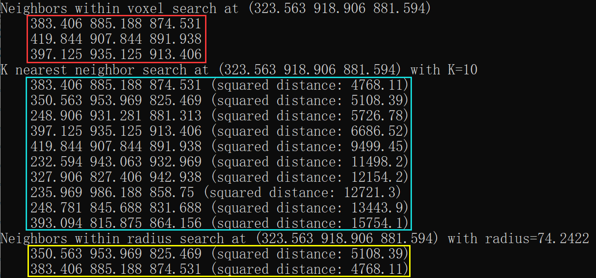

​                                                         图 4-8-15：Octree 搜索代码运行结果

如图 4-8-15 所示：

红色部分为体素内近邻搜索（Neighbours within Voxel Search）的搜索结果，第一行指明随机生成的 searchPoint 为（323.563，918.906，881.594），红框中表明在我们设置的体素边长 resolution 的范围内共搜索到了三个点；

蓝色部分为 K-NN 的搜索结果，第一行指明我们随机生成的 searchPoint 同样为（323.563，918.906，881.594），因为 K 设置的是 10，因此一共搜索到十个该 searchPoint 的近邻点，每个点与 searchPoint 距离的平方在每个点后面的括号中输出；

黄色部分为 Fixed Radius-NN 的搜索结果，第一行指明随机生成的 searchPoint 也为（323.563，918.906，881.594）。因为我们在代码中只设置了一次 searchPoint，因此三种搜索方法的 searchPoint 是一样的，利用该方法搜索到的近邻点有两个，它们距离 searchPoint 的距离都小于 radius（74.2422），同样，每个点与 searchPoint 距离的平方在每个点后面的括号中输出。


### 4-9 ： Filtering

点云滤波（Filtering），顾名思义，就是使用一些特定的过滤方法对点云进行过滤操作。由于：

- **原始点云多含噪音点和无关点。**我们获取点云的设备精度，操作环境以及被测物体本身的结构特点等因素会使得最终得到的点云文件产生一些噪声点（noise）（如图 4-9-1，左侧原始点云噪声点很多，右侧是过滤后的噪声点较少的点云图像）或者离群点（outlier）（如图 4-9-2，Outlier 明显跟下面的点相差过远），这对于我们后续展开点云的进一步处理和分析会造成不利影响；

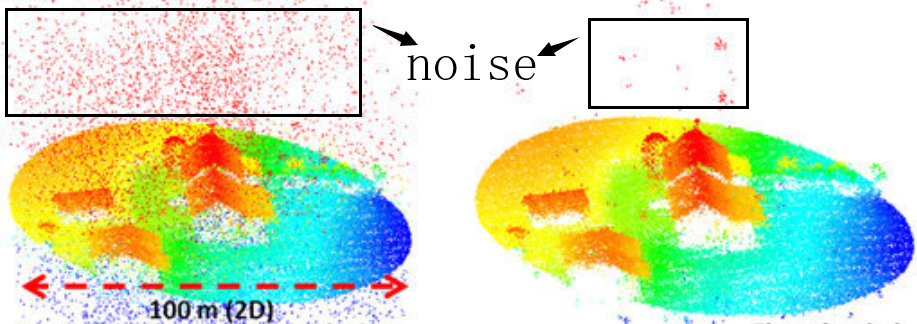

​                                                  图 4-9-1：noise 示意图（左侧 noise 较右侧多）[^35]


​                                                                       图 4-9-2：Outlier 示意图[^36]

- **原始点云庞大。**所以通常我们要对庞大的点云文件进行降采样（第二章 CloudCompare 中介绍过点云降采样的背景），提高运算效率；
- **我们的 ROI 是当前点云的一部分，**即我们我们只需当前点云文件的一部分，因此需要对点云进行裁剪操作（第二章 CloudCompare 中介绍过点云裁剪的背景）。

所以我们在进行点云的进一步处理之前往往要对点云进行预处理，也就是点云的过滤。PCL 中用来进行点云过滤的模块提供了很多滤波算法，每种滤波算法都依赖滤波器实现过滤算法，主要有以下几种滤波器：直通滤波器（PassThrough Filter），体素格滤波器（VoxelGrid Filter），统计滤波器（Statistical Filter），半径滤波器（Radius Filter）等。

其中，直通滤波器（PassThrough Filter）多用于对点云进行大面积裁剪；体素格滤波器（VoxelGrid Filter）多用于对点云进行数目精简（类似于降采样效果的重采样）；统计滤波器（Statistical Filter）多用于对点云进行离群点过滤；半径滤波器（Radius Filter）也多用于对点云进行离群点过滤。

#### 4-9-1 ： PassThrough Filter：

##### 概念：

直通滤波（PassThrough Filter），就是选定要进行过滤的坐标轴（X 轴或 Y 轴或 Z 轴），然后设定要保留或滤除的该轴范围，主要用来对点云进行一个粗略的过滤。类似于我们在 CloudCompare 中学习的大面积裁剪。

##### 实例：

使用 **airplane.pcd** （图 4-9-3）为需要过滤的点云文件，然后对该点云进行直通滤波过滤，过滤轴为 z 轴，预期最终结果是 z 轴方向会被切掉一段：

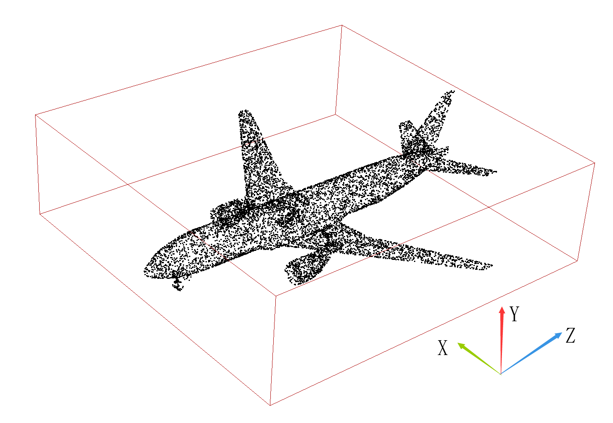

​                                         图 4-9-3：**airplane.pcd** 在 CloudCompare 中的视图

完整代码 **passthrough.cpp** 见 [附录 —— passthrough](# 4.9.1：Passthrough：)

下面是代码详解：

下面几行代码是使用直通滤波器进行过滤所需要的头文件：

```c++
#include <pcl/io/pcd_io.h>            // pcd 读写类相关的头文件
#include <pcl/point_types.h>          // pcl 中支持的点类型的头文件
#include <pcl/filters/passthrough.h>  // 直通滤波器头文件
```

------


下面代码创建两个点云对象：cloud 和 cloud_filtered：前者用来存储原始输入点云（待过滤），后者存放过滤后点云。输出原始点云个数以及每个点的维度（x，y，z），然后将 **airplane.pcd** 加载到点云对象 cloud 中：

```c++
pcl::PointCloud<pcl::PointXYZ>::Ptr cloud(new pcl::PointCloud<pcl::PointXYZ>);
pcl::PointCloud<pcl::PointXYZ>::Ptr cloud_filtered(new pcl::PointCloud<pcl::PointXYZ>);
pcl::io::loadPCDFile(".../airplane.pcd", *cloud);
std::cout << "PointCloud before filtering: " << cloud->width * cloud->height
		<< " data points (" << pcl::getFieldsList(*cloud) << ")." << std::endl;
```

------


下面是具体实现直通滤波过滤的部分：首先创建一个 PassThrough 对象 pass；然后将原始点云（待过滤）cloud 输入到 pass 中，设置过滤轴为 “z“ （setFilterFieldName），将该轴的保留范围设置为（0.0，1.0）；然后执行过滤 pass.filter，将过滤结果存放在 cloud_filtered 中，输出过滤后点云个数以及每个点的维度（x，y，z）；最后将过滤结果保存在 **airplane_passthourgh.pcd** 中，有关参数设置介绍见本段代码后方*：

```c++
// Create the filtering object
pcl::PassThrough<pcl::PointXYZ> pass;
pass.setInputCloud(cloud);
pass.setFilterFieldName("z");
pass.setFilterLimits(0.0, 1.0);
//pass.setFilterLimitsNegative (true);  // 已被注释，相当于 setFilterLimitsNegative 为默认参数 false
pass.filter(*cloud_filtered);
std::cout << "PointCloud after filtering: " << cloud_filtered->width * cloud_filtered->height
		<< " data points (" << pcl::getFieldsList(*cloud_filtered) << ")." << std::endl;
pcl::io::savePCDFileASCII(".../airplane_passthourgh.pcd", *cloud_filtered);
```

*参数设置介绍：

**setFilterFieldName：**设置限定过滤的轴（X / Y / Z）

**setFilterLimits：**设置过滤限制条件，格式为（最小值，最大值）

**setFilterLimitsNegative：**设置最终过滤结果的点云是将 setFilterFieldName 和 setFilterLimits 圈定的部分过滤掉还是保留下来，如果参数设置为 true，则圈定部分会被过滤，反之则被保留，默认参数是 false，因此在上述代码中，当我们未设置该参数时（注释所在行 pass.setFilterLimitsNegative (true);），过滤结果就是保留 z 轴（0.0，1.0）范围的点。

------

下面是运行结果，可以看出原始点数 10000，过滤后为 4696 个点：


​                                                                      图 4-9-4：代码运行结果

图 4-9-5 是过滤前后视图：

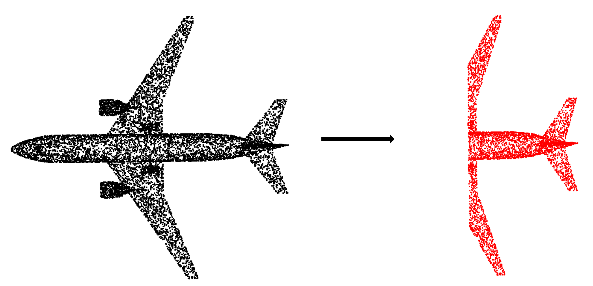

​                                                          图 4-9-5：过滤前（左）和过滤后（右）视图

如图 4-9-5 所示：左侧是原始未被过滤的 **airplane.pcd** 文件，右侧是通过设置过滤轴以及轴上范围后，执行直通滤波后的结果，可以看到它被整齐地保留了右侧机翼以及机尾部分，通过查看 **airplane_passthourgh.pcd**，我们可以看到，所有点的 z 坐标值都在（0.0，1.0）范围内。因此，直通滤波就像是在某个方向整齐地切掉一部分，因此常被用来粗略的对点云进行过滤的预处理，更精细的过滤还需要其他过滤方法实现。


#### 4-9-2 ： VoxelGrid Filter：

##### 概念：

体素栅格滤波（VoxelGrid Filter）：顾名思义，利用小体素对点云进行过滤，小体素就是小立方体，其边长是我们进行体素格过滤时要设置的参数。VoxelGrid 主要起到一种点云降采样的效果。

首先根据原始点云建立一个三维体素栅格（体素栅格即三维立方体的集合，如图 4-9-6（a）是八个小体素组成的体素栅格），求出每个小体素内所有点（图 4-9-6（b）以标红小体素为例）的重心（图 4-9-6（c）），保留重心，将其他点过滤。

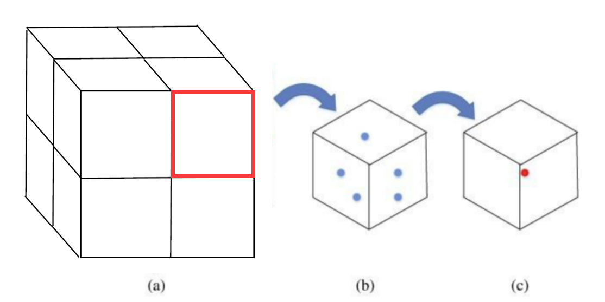

​                                                                     图 4-9-6：VoxelGrid Filter示意图 1[^37]

这样，每个体素以前的点都被该体素的重心代替，在一定程度上达到了降采样的效果。这里需要注意的是，与前一节介绍的直通滤波不同，体素格滤波主要是用来对点云进行降采样效果（减少点数）的重采样，因为最后得到的点有可能不是原始点云中的点（重心不一定是原始点云中的点）。

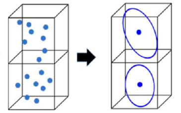

​                                                               图 4-9-7：VoxelGrid 滤波示意图 2 [^38]

如图 4-9-7 所示，左侧蓝色点为我们需要过滤的原始点云，我们根据它建立一个三维体素栅格（这里是两个小体素），所以最终过滤后的点为两个小体素原始点的重心，因此最终过滤结束后得到两个点。

##### 实例：

用 **chair.pcd** （见教程文件夹）进行 VoxelGrid 过滤，也即进行减少点数的重采样，图 4-9-8 是原始点云示意图：


​                                                       图 4-9-8：**chair.pcd** 在 CloudCompare 中视图

完整代码 **voxelgrid.cpp** 见 [附录 —— VoxelGrid](# 4.9.2：VoxelGrid：) ，下面是代码详解：

下面几行代码是进行 VoxelGrid 过滤所需要的头文件：

```c++
#include <iostream>                 // 标准 C++ 库中的输入输出类相关头文件
#include <pcl/io/pcd_io.h>          // pcd 读写类相关的头文件
#include <pcl/point_types.h>        // pcl 中支持的点类型的头文件
#include <pcl/filters/voxel_grid.h> // VoxelGrid 滤波头文件
```

------


下面创建两个点云对象 cloud 和 cloud_filtered，将 **chair.pcd** 加载到 cloud 中，最后输出该点云总点数以及每个点包含的维度（x，y，z）：

```c++
pcl::PointCloud<pcl::PointXYZ>::Ptr cloud(new pcl::PointCloud<pcl::PointXYZ>);
pcl::PointCloud<pcl::PointXYZ>::Ptr cloud_filtered(new pcl::PointCloud<pcl::PointXYZ>);
pcl::io::loadPCDFile(".../chair.pcd", *cloud);
std::cout << "PointCloud before filtering: " << cloud->width * cloud->height
		<< " data points (" << pcl::getFieldsList(*cloud) << ")."<< std::endl;
```

------


下面进行体素栅格滤波相关实现代码部分：首先创建 VoxelGrid 对象 sor，并将 cloud 输入到 sor 中；然后设置每个小体素的边长（setLeafSize）为 0.05 f；最后执行过滤操作：

```c++
// Create the filtering object
pcl::VoxelGrid<pcl::PointXYZ> sor;
sor.setInputCloud(cloud);
sor.setLeafSize(0.05f, 0.05f, 0.05f);
sor.filter(*cloud_filtered);
```

------


下面输出过滤后的点云文件的点数以及每个点包含的维度（在这里是 x，y，z），最后将过滤结果保存在 **chair_downsampling.pcd** 中：

```c++
std::cout << "PointCloud after filtering: " << cloud_filtered->width * cloud_filtered->height << " data points (" << pcl::getFieldsList(*cloud_filtered) << ")." << std::endl;
pcl::io::savePCDFileASCII(".../chair_downsampling.pcd", *cloud_filtered);
```

------

下面是代码运行结果：


​                                                                         图 4-9-9：代码运行结果

从图 4-9-9 我们可以看到：原始点云点数为 10000，过滤后点数为 752，因此可以说起到了精简点云的效果。但由于保留重心的操作使得最终点云中的点不全都是原始点云中的点（因为重心不一定在原始点云中），因此该操作实际上是一种重采样。

图 4-9-10 是原始点云与过滤后点云对比图：可以看到右侧过滤后点云相较左侧稀疏了很多，并且点的分布比较整齐，这是因为我们在建立体素栅格的时候是整齐创建的，每个体素保留原来点的重心，因此结果会稍微整齐一些：

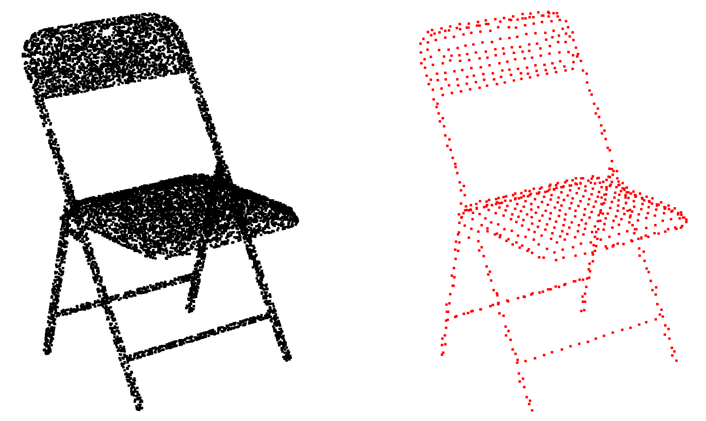

​                                                        图 4-9-10：原始点云（左）与过滤后点云（右）


#### 4-9-3 ： Statistical Filter：

##### 概念：

统计滤波（Statistical Filter）是利用统计学方法对点云中的离群点（outlier）进行过滤。正如之前介绍滤波时所说，由于获得点云的设备精度不同，操作人员操作方式不同，收集环境等多种因素，使得我们得到的第一手点云文件往往含有很多噪音点或离群点（偏离大部分点的特殊点），如图 4-9-11 ：


​                                                                       图 4-9-11：Outlier 示意图[^36]

统计滤波的主要操作思想是：基于每个点与其周围邻居点平均距离的分布，假设该分布是有特定均值和方差的高斯分布，如果某个点与邻居点的平均距离在分布的某个标准（由全局平均距离和方差决定）外，则将该点视为离群点（outlier）[^39]。

##### 实例：

对 **table.pcd** 点云文件（见教程文件夹）进行离群点（outlier）去除，如图 4-9-12（黑圈内为大致的 outlier 部分）：

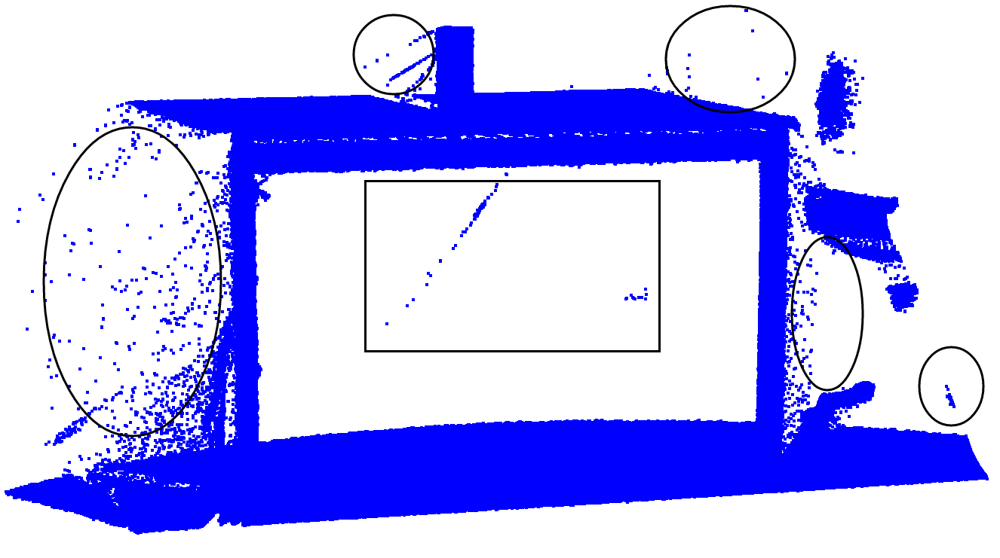

​                                                        图 4-9-12：**table.pcd** 以及 outlier 示意图

完整代码 **statistical.cpp** 见 [附录 —— Statistical](# 4.9.3：Statistical：)

下面是代码详解：

下面几行代码是进行统计滤波所需要的头文件：

```c++
#include <iostream>              // 标准 C++ 库中的输入输出类相关头文件
#include <pcl/io/pcd_io.h>       // pcd 读写类相关的头文件
#include <pcl/point_types.h>     // pcl 中支持的点类型的头文件
#include <pcl/filters/statistical_outlier_removal.h>     // 统计滤波头文件
```

------


下面首先创建两个点云对象 cloud（存放原始点云）和 cloud_filtered（存放过滤后的点云），然后将 **table.pcd** 加载到 cloud 中：

```c++
pcl::PointCloud<pcl::PointXYZ>::Ptr cloud(new pcl::PointCloud<pcl::PointXYZ>);
pcl::PointCloud<pcl::PointXYZ>::Ptr cloud_filtered(new pcl::PointCloud<pcl::PointXYZ>);
pcl::io::loadPCDFile(".../table.pcd", *cloud);
```

------


下面是进行统计过滤的具体操作代码：首先创建统计滤波器对象 sor；然后将 cloud 输入 sor 中，设置参数*，执行过滤操作；最后将 cloud_filtered （过滤掉 outlier 后的点云）存入 **table_inliers.pcd** 中：

```c++
// Create the filtering object
pcl::StatisticalOutlierRemoval<pcl::PointXYZ> sor;
sor.setInputCloud(cloud);
sor.setMeanK(50);
sor.setStddevMulThresh(1.0);
sor.filter(*cloud_filtered);
pcl::io::savePCDFile(".../table_inliers.pcd", *cloud_filtered, false);
```

*参数设置：

**setMeanK：** 这里设置为 50 的意思是每个点的近邻点集是离它最近的 50 个点；

**setStddevMulThresh：** 这里设置为 1 的意思是划分为 outlier 的判断标准如下

该点与它近邻点集的平均距离 > (全部点与其近邻点平均距离的 1 倍标准差 + 全部点与其近邻点平均距离)

------


下面保存我们刚才过滤掉的 outlier，执行过滤操作，将最终 outlier 保存在 **table_outliers.pcd** 中：

```c++
sor.setNegative(true);      // 本行代码设置接下来的 cloud_filtered 为过滤掉的 outlier
sor.filter(*cloud_filtered);
pcl::io::savePCDFile(".../table_outliers.pcd", *cloud_filtered, false);
```

------

图 4-9-13 是处理过程中的点云示意图：图 4-9-13(a) 是原始点云，其中黑圈内标注了 outlier 点；图 4-9-13(b) 是过滤掉 outlier 之后的 inlier 部分，可以看到之前黑圈内的离群点已被过滤；图 4-9-13(c) 是我们过滤掉的离群点 outlier，图 4-9-13(b) 和图 4-9-13(c) 合并在一起就是图 4-9-13(a)。


​                    图 4-9-13：**table.pcd**(a)    **table_inliers.pcd**(b)    **table_outliers.pcd**(c) 示意图


#### 4-9-4 ：Radius Filter：

##### 概念：

半径滤波器（Radius Filter）与统计滤波器（Statistical Filter）一样，主要用于 outlier 的过滤。不同之处在于半径滤波器的过滤方法不是借助于统计分布，而是借助于人为设置的半径和半径范围内的点数进行 outlier 与 inlier 的划分和过滤。

图 4-9-14 简单示意 Radius Filter 的原理：设置邻域半径 R，半径范围内最少点数为 K = 5，在某点半径为 R 范围内的点数小于 K，则将其视为 outlier。黄色点邻域内点数为 7 > 5；红色点邻域内点数为 1 < 5。因此红色点为 outlier ，应该被滤除。


​                                                                 图 4-9-14：Radius Filter 示意图


##### 实例：

通过 **table.pcd** （图 4-9-15，我们试图通过 Radius Filter 对黑圈部分进行过滤）进行设定半径和半径内点数的 outlier 半径过滤：


​                                                            图 4-9-15：**table.pcd** 与 outlier 示意图

完整代码 **radius.cpp** 见 [附录 —— Radius](# 4.9.4：Radius：)

下面是代码详解：

下面几行是进行半径过滤需要用到的头文件：

```c++
#include <iostream>             // 标准 C++ 库中的输入输出类相关头文件
#include <pcl/io/pcd_io.h>      // pcd 读写类相关的头文件
#include <pcl/point_types.h>    // pcl 中支持的点类型的头文件
#include <pcl/filters/radius_outlier_removal.h>   // 半径滤波头文件
```

------


下面创建两个点云对象 cloud 与 cloud_filtered，前者存放原始点云，后者存放过滤后点云，然后将 **table.pcd** 加载到 cloud 中：

```c++
pcl::PointCloud<pcl::PointXYZ>::Ptr cloud(new pcl::PointCloud<pcl::PointXYZ>);
pcl::PointCloud<pcl::PointXYZ>::Ptr cloud_filtered(new pcl::PointCloud<pcl::PointXYZ>);
pcl::io::loadPCDFile(".../table.pcd", *cloud);
```

------


下面进行半径过滤的具体代码实现：首先创建一个 RadiusOulierRemoval 对象 outrem，然后将 cloud 输入 outrem 中，设置半径过滤参数 setRadiusSearch 和 setMinNeighborsInRadius*，执行过滤操作，最后将过滤后的点云存放在 **table_RadiusOutlierRemoval.pcd** 中：

```c++
pcl::RadiusOutlierRemoval<pcl::PointXYZ> outrem;
// build the filter
outrem.setInputCloud(cloud);
outrem.setRadiusSearch(0.05);
outrem.setMinNeighborsInRadius(200);
// apply filter
outrem.filter(*cloud_filtered);	

pcl::io::savePCDFile(".../table_RadiusOutlierRemoval.pcd", *cloud_filtered);
```

*参数设置：

**setRadiusSearch：** 设置近邻搜索的半径；

**setMinNeighborsInRadius：**设置上述半径内最少点数，如果某个点该半径内的近邻点个数小于此值，则判断该点为 outlier。

------

图 4-9-16 是过滤前后的视图对比：可以看到，右侧视图比左侧视图更加干净，去除了左侧原始点云中大部分 outlier 点。


​                                                                 图 4-9-16：过滤前后视图对比


### 4-10 ：Segmentation：

#### 背景介绍：

本章主要介绍分割（Segmentation）相关内容。Segmentation 其实与分类 Classification、聚类 Clustering、检测 Detection 相关性很大，很多时候处理问题的方式都很类似。比如说我们要识别检测（Detection）一个场景里的物体 objects，并将其分类（Classification），类似于对该场景中的 objects 进行 Segmentation。下面我们重点来介绍一下分割。

在 2D 和 3D 场景中，分割 Segmentation 很重要，是理解图像和场景的重要组成部分：一张图片（识别图 4-10-1 中的Person1-Person5），或者一个 3D 物体（识别图 4-10-2 中每个物体的部件）。对于人眼来说很容易理解图片和 3D 物体里面的内容是什么，也很容易对图片或 3D 物体中包含的事物和部件进行划分和识别。计算机与我们接收的一样都是数据，但计算机本身没有知识储备和经验，所以不能直接判断理解接收到的数据并进行处理。对它来说，2D 图片就是一堆像素点。我们要做的是教会计算机理解 2D 和 3D 场景，因此，分割也通常理解为语义分割，需要编写很多规则来实现计算机的这一功能。

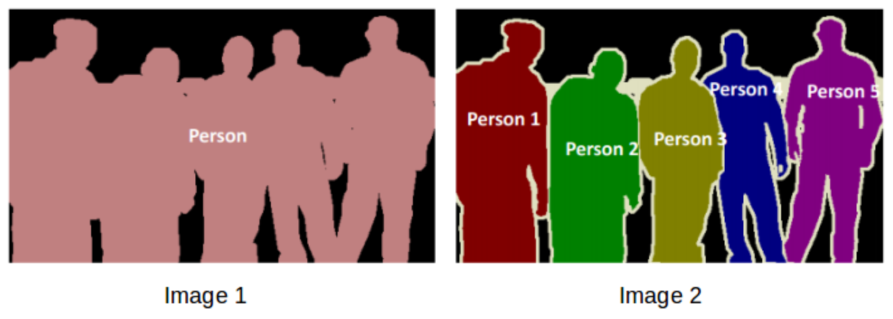

​                                                               图 4-10-1：2D 下的 Segmentation[^40]

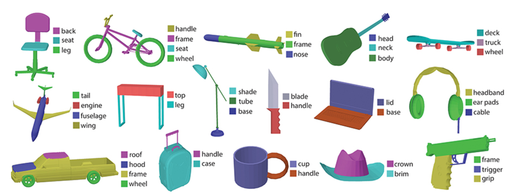

​                                                              图 4-10-2：3D 下的 Segmentation[^41]

语义分割中语义级别可以不同，如图 4-10-2 中每个物体不同部分用相应颜色标示，用来体现分割。从图中的分割结果来看，Segmentation 的语义级别可以是一个部件（最左侧飞机被划分成了尾部，发动机，机身，机翼），也可以是一个平面（左侧下方的汽车中红色为车顶的平面，紫色为车前部的平面）等。

跟 2D 和 3D 场景 Segmentation 问题类似，点云分割既是处理 3D 点云的重要方法也是目的。由于我们第一手获取的点云数据通常只是一堆数据点，不带有任何意义的语义信息，点云分割可以对点云进行分类归纳，赋予语义，帮助理解点云场景。具体一点来说，点云分割旨在根据点云的空间特征将点云按语义划分成小类，同一划分类的点云具有相似的特性。常用的分割方法有：基于随机采样一致性分割、聚类分割。


#### 分割的应用场景：

- 点云重建问题中，点云语义切割是最重要的一步；
- 无人驾驶小车视觉系统在进行道路识别时会依靠雷达系统来识别路障和行人，在这个处理过程中会用到类似于 Detection 或 Segmentation 的处理方法；
- 医疗图像分割，可以帮助医生更好地诊断疾病；
- 地质检测中，往往通过对卫星图像进行语义分割来检测地区的土地覆盖情况等问题[^42]；
- 在农业中，可以通过分割获取图像中的杂草和农作物来决定除草剂等产品的使用[^42]。

下面我们介绍几种常见的分割方法。


#### 4-10-1 ：基于随机采样一致性分割 ：

##### 随机采样一致性 Random Sample Consensus（RANSAC）：

RANSAC 是一种概率性的随机采样方法，是点云处理方法中很重要的一种算法，多用来对点云进行平面、曲面和一些简单几何元件的拟合以达到分割的目的。它可以从一组包含 outlier 的数据中，通过迭代方式估计数学模型的参数，不断地迭代，提高得到合理结果（即合理的模型参数）的概率。

图 4-10-3 是两个简单的例子：图中第一行是拟合一条直线，第二行是拟合抛物线。红色是最小二乘拟合的结果，绿色是 RANSAC 的结果。通过对比我们可以看出，RANSAC 更接近于大部分点的趋势，而最小二乘拟合会尽量包括所有的点，容易受到 outliers 的影响而偏离数据点本身的趋势。但是，RANSAC 的结果并不一定正确，由于它是一个概率性算法，为了使得我们的拟合结果更合理，我们必须提高迭代次数，谨慎设置算法参数。

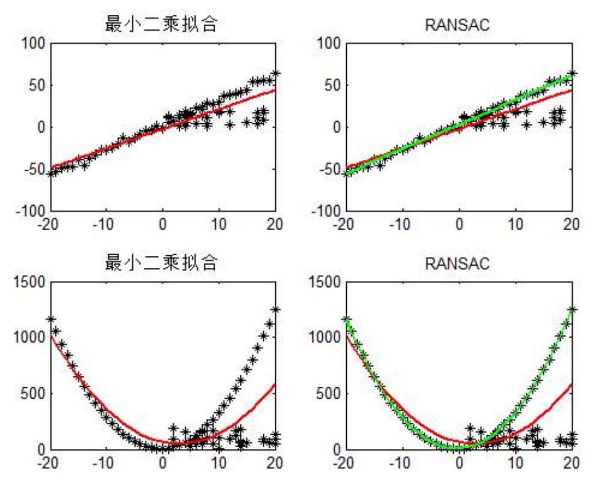

​                                                         图 4-10-3：RANSAC 与 最小二乘拟合对比图[^43]


##### RANSAC 步骤[^44]：

step1：从全部数据点中随机采样 K 个点作为 inliers；

step2：对 step1 选取的 K 个点进行模型拟合；

step3：计算剩余点到 step2 拟合的模型的距离，设置一个阈值，小于该阈值则包含在 inliers 中，用来扩充 inliers，然后统计 inliers 个数，大于阈值的点为 outliers；

step4：重复上述 step1-3 步骤 M 次，直到找到 inliers 点数最多的最佳模型；

step5：对 step4 找到的最佳模型包含的 inliers 重新进行模型的拟合。

下面以拟合直线为例进行图示，其中 step1 随机选取 K = 2 个点为初始 inliers，step2-5 对应上述步骤：

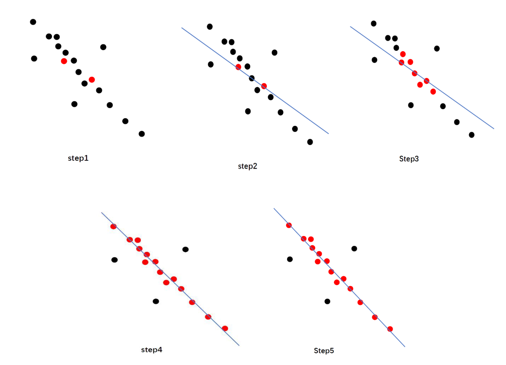

​                                                               图 4-10-4：RANSAC 进行直线拟合步骤图

##### 基于 RANSAC 的点云分割：

上面是关于 RANSAC 算法的介绍，下面通过一些实例来讲解基于 RANSAC 点云分割：

###### 实例一：平面模型分割

我们随机创建一个点云，该点云一部分点在一个平面上，一部分点是 outliers。该实例目的是利用 RANSAC 将该点云中隐藏的平面提取出来，将其与 outliers 分割：如图 4-10-5，是我们为了进行平面提取随机制造的点云，灰色为隐藏平面 z = 1，红圈内为我们人为设置的 outliers。


​                                                                图 4-10-5：利用随机数创建的点云示意图

完整代码 **extract_plane_ransac.cpp** 见 [附录 —— 基于 RANSAC 平面模型分割](# 4.10.1：基于 RANSAC 的分割（平面模型）：)

下面是代码详解：

下面几行是进行基于 RANSAC 进行平面模型分割时所需的头文件：

```c++
#include <iostream>                            // 标准 C++ 库中的输入输出类相关头文件
#include <pcl/io/pcd_io.h>                     // pcd 读写类相关的头文件
#include <pcl/point_types.h>                   // 点云类型头文件
#include <pcl/sample_consensus/method_types.h> // 采样方法头文件
#include <pcl/sample_consensus/model_types.h>  // 模型类型头文件
#include <pcl/segmentation/sac_segmentation.h> // RANSAC 头文件
```

------


下面创建点云对象 cloud，使用随机方法和 for 循环填充 x 和 y 坐标值，然后固定 z = 1，使得点云都在 z = 1 平面上：

```c++
pcl::PointCloud<pcl::PointXYZ> cloud;
// Fill in the cloud data
cloud.width = 15;
cloud.height = 1;
cloud.points.resize(cloud.width * cloud.height);
// Generate the data
for (size_t i = 0; i < cloud.points.size(); ++i)
{
	cloud.points[i].x = 1024 * rand() / (RAND_MAX + 1.0f);
	cloud.points[i].y = 1024 * rand() / (RAND_MAX + 1.0f);
	cloud.points[i].z = 1.0;   // 确保随机生成的点都在 z = 1 平面上
}
```

------


下面为上述生成的点云设置一些 outliers，使其偏离 z = 1 平面，也就是不在 z = 1 平面上的点（index 为 0，3，6 的点 z 坐标分别设置为 2.0，-2.0，4.0），然后输出 z 轴处理好后的 cloud 中每个点的坐标，以便与后续分割后的点云进行对比，将 cloud 中的点保存在 **random_sample.pcd** 中：

```c++
// Set a few outliers
cloud.points[0].z = 2.0;
cloud.points[3].z = -2.0;
cloud.points[6].z = 4.0;
std::cout << "Point cloud data: " << cloud.points.size() << " points" << std::endl;
for (size_t i = 0; i < cloud.points.size(); ++i)
	std::cout << "    " << cloud.points[i].x << " "
	<< cloud.points[i].y << " "
	<< cloud.points[i].z << std::endl;
pcl::io::savePCDFile(".../random_sample.pcd", cloud);
```

------


下面是基于随机一致性分割的具体实现部分：首先创建分割所需的模型系数对象 coefficients；然后创建存储 inliers 索引的集合对象 inliers；创建分割对象 seg；进行相关参数设置*；将 cloud 作为输入点云，执行分割操作，将分割后的 inliers 索引结果存储到 inliers 中，平面模型系数存储到 coefficients 中：

```c++
pcl::ModelCoefficients::Ptr coefficients(new pcl::ModelCoefficients);
pcl::PointIndices::Ptr inliers(new pcl::PointIndices);
// Create the segmentation object
pcl::SACSegmentation<pcl::PointXYZ> seg;
// Optional
seg.setOptimizeCoefficients(true);
// Mandatory
seg.setModelType(pcl::SACMODEL_PLANE);
seg.setMethodType(pcl::SAC_RANSAC);
seg.setDistanceThreshold(0.01);
seg.setInputCloud(cloud.makeShared());
seg.segment(*inliers, *coefficients);
```

*参数设置：

**setModelType：**分割的模型类型，这里选择的是平面模型 SACMODEL_PLANE，需要注意的是，当点云构成比较复杂时，比如点云中有很多噪声点，此时如果要从点云中分割出平面模型，要利用法线信息，使用的是SACMODEL_NORMAL_PLANE；

**setMethodType：** 随机参数估计方法，这里选择的是 RANSAC 算法；

**setDistanceThreshold：**距离阈值，数据点距离估计模型（在这里是 z = 1 平面模型）小于该阈值的视为 inliers，否则为 outliers。

------


下面是分割结果输出，首先输出平面模型系数，然后输出分割后的 inliers 点的坐标值：

```c++
std::cout << "Model coefficients: " << coefficients->values[0] << " "
	<< coefficients->values[1] << " "
	<< coefficients->values[2] << " "
	<< coefficients->values[3] << std::endl;

std::cout << "Model inliers: " << inliers->indices.size() << std::endl;
for (size_t i = 0; i < inliers->indices.size(); ++i)
	std::cout << inliers->indices[i] << "    " 
              << cloud.points[inliers->indices[i]].x << " " 
              << cloud.points[inliers->indices[i]].y << " "
              << cloud.points[inliers->indices[i]].z << std::endl;
```

------

下面是运行结果：


​                                                                       图 4-10-6：代码运行结果

从图 4-10-6 我们可以看出：红框内为我们要分割的点云，其中大部分点的 z 都是 1，而个别点 z 不是 1；绿框内为分割后的 inliers 点，可以看到它们的 z 值都为 1，也即我们成功分割出了原始点云中的 z = 1 平面部分；蓝框内为 z = 1 平面模型的系数，0，0，1，-1，对应为：$0*x + 0*y + 1*z - 1 = 0$，也就是 z = 1。

图 4-10-7 为分割前后虚拟示意图：灰色平面代表 z = 1，红圈内为 outliers；右侧为分割后点云视图，可以看出所有留下的点都在灰色 z = 1 平面上。

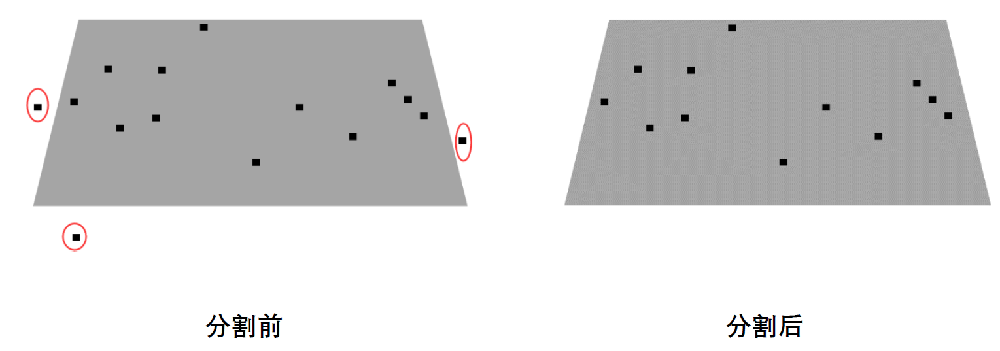

​                                                                       图 4-10-7：分割前后虚拟示意图


###### 实例二：圆柱体模型分割

从点云中分割出圆柱体模型：首先对原始点云进行一系列预处理（滤波过滤等），然后将 **table_scene_mug_stereo_textured.pcd** 中的圆柱体部分提取出来：

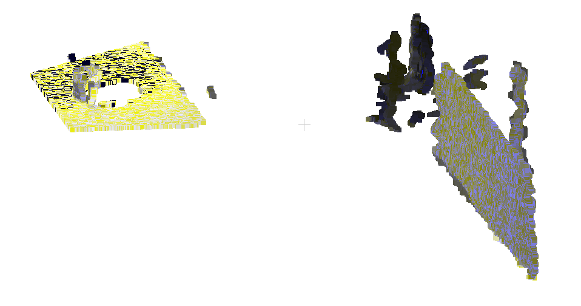

​                                            图 4-10-8：**table_scene_mug_stereo_textured.pcd** 视图

完整代码 **extract_cylinder_ransac.cpp** 见 [附录 —— 基于 RANSAC 圆柱体模型分割](# 4.10.1：基于 RANSAC 的分割（圆柱模型）：)

下面是代码详解：

下面几行是进行圆柱体模型分割所需头文件以及命名空间和重命名的设置：

```c++
#include <pcl/io/pcd_io.h>                // pcd 读写类相关的头文件
#include <pcl/point_types.h>              // pcl 中支持的点类型的头文件
#include <pcl/filters/extract_indices.h>  // 过滤所需头文件
#include <pcl/filters/passthrough.h>      // 直通滤波头文件
#include <pcl/features/normal_3d.h>       // 计算法线头文件
#include <pcl/sample_consensus/method_types.h>  // 采样方法头文件
#include <pcl/sample_consensus/model_types.h>   // 模型类型头文件
#include <pcl/segmentation/sac_segmentation.h>  // RANSAC 分割头文件
using namespace std;    // 命名空间 std
typedef pcl::PointXYZ PointT;   // 将 pcl::PointXYZ 重命名为 PointT
```

------


下面创建功能对象：读取点云对象 reader；直通滤波器对象 pass；法线估计对象 ne；从法线信息进行 RANSAC 分割对象 seg；写点云对象 writer；提取点云对象 extract；提取点云法线对象 extract_normals；Kdtree 搜索对象 tree：

```c++
// All the objects needed
pcl::PCDReader reader;
pcl::PassThrough<PointT> pass;
pcl::NormalEstimation<PointT, pcl::Normal> ne;
pcl::SACSegmentationFromNormals<PointT, pcl::Normal> seg;
pcl::PCDWriter writer;
pcl::ExtractIndices<PointT> extract;
pcl::ExtractIndices<pcl::Normal> extract_normals;
pcl::search::KdTree<PointT>::Ptr tree(new pcl::search::KdTree<PointT>());
```

------


下面创建代码实现所需要的数据对象：原始点云 cloud，直通滤波器过滤后的点云 cloud_filtered，计算法线的点云 cloud_normals，除去平面后的点云 cloud_filtered2，计算 cloud_filtered 法线后的点云 cloud_normals2，平面模型系数 coefficients_plane，圆柱模型系数 coefficients_cylinder，平面模型内点 inliers_plane，圆柱模型内点 inliers_cylinder：

```c++
// Datasets
pcl::PointCloud<PointT>::Ptr cloud(new pcl::PointCloud<PointT>);
pcl::PointCloud<PointT>::Ptr cloud_filtered(new pcl::PointCloud<PointT>);
pcl::PointCloud<pcl::Normal>::Ptr cloud_normals(new pcl::PointCloud<pcl::Normal>);
pcl::PointCloud<PointT>::Ptr cloud_filtered2(new pcl::PointCloud<PointT>);
pcl::PointCloud<pcl::Normal>::Ptr cloud_normals2(new pcl::PointCloud<pcl::Normal>);
pcl::ModelCoefficients::Ptr coefficients_plane(new pcl::ModelCoefficients), coefficients_cylinder(new pcl::ModelCoefficients);
pcl::PointIndices::Ptr inliers_plane(new pcl::PointIndices), inliers_cylinder(new pcl::PointIndices);
```

------


下面一行是利用读取点云对象 reader 读取 **table_scene_mug_stereo_textured.pcd** 到 cloud 中，并输出该点数信息：

```c++
// Read in the cloud data
reader.read(".../table_scene_mug_stereo_textured.pcd", *cloud);
cout << "PointCloud has: " << cloud->points.size() << " data points." << endl;
```

------


下面是对 z 轴利用直通滤波器（见 4-9-1 Filtering_PassThrough）进行过滤：将 cloud 作为直通滤波器 pass 的输入点云，过滤轴设置为 z 轴，过滤范围为 0-1.5，执行过滤，最后输出过滤后的点云个数：

```c++
// Build a passthrough filter to remove spurious NaNs
pass.setInputCloud(cloud);
pass.setFilterFieldName("z");
pass.setFilterLimits(0, 1.5);
pass.filter(*cloud_filtered);
cout << "PointCloud after filtering has: " << cloud_filtered->points.size() << " data points." << endl;
```

------


下面代码估计点云的法线信息（见 4-6-1 Features_估计一个点云的表面法线）：将 Kdtree 对象 tree 设置为近邻搜索方法，cloud_filtered 为要估计法线的点云，近邻搜索个数为 50，最后执行法线估计：

```c++
// Estimate point normals
ne.setSearchMethod(tree);
ne.setInputCloud(cloud_filtered);
ne.setKSearch(50);
ne.compute(*cloud_normals);
```

------


下面代码是对平面模型进行分割：首先设置参数*，然后将 cloud_filtered 也就是直通滤波后的点云作为分割对象 seg 的输入点云，将估计法线后的点云 cloud_normals 作为分割对象 seg 的输入法线信息：

```c++
// Create the segmentation object for the planar model and set all the parameters
seg.setOptimizeCoefficients(true);
seg.setModelType(pcl::SACMODEL_NORMAL_PLANE);
seg.setNormalDistanceWeight(0.1);
seg.setMethodType(pcl::SAC_RANSAC);
seg.setMaxIterations(100);
seg.setDistanceThreshold(0.03);
seg.setInputCloud(cloud_filtered);
seg.setInputNormals(cloud_normals);
```

*参数设置：

**setOptimizeCoefficients：**是否对估计的模型系数进行优化，true 代表要优化，false 代表不必优化；

**setModelType：**设置分割模型，这里使用的是 SACMODEL_NORMAL_PLANE，是平面模型，实例一中进行平面模型分割时用的是 SACMODEL_PLANE，这里点云构造较为复杂，因此我们选用基于法线的分割方法 SACMODEL_NORMAL_PLANE；

**setNormalDistanceWeight：**设置表面法线权重系数；

**setMethodType：**设置模型分割方法，这里是 RANSAC 算法；

**setMaxIterations：**设置最大迭代次数；

**setDistanceThreshold：**设置 inliers 到模型的距离允许最大值，大于这个阈值则为 outliers。

------


下面代码根据上部分代码设置的参数分别获取平面模型的系数和平面上的 inliers，然后输出平面系数：

```c++
// Obtain the plane inliers and coefficients
seg.segment(*inliers_plane, *coefficients_plane);
std::cout << "Plane coefficients: " << *coefficients_plane << std::endl;
```

------


下面代码进行平面的提取：创建 cloud_plane 点云对象来存储平面点；将输入点云设置为直通滤波过滤后的点云 cloud_filtered；设置分割后的内点为需要提取的点集；设置提取内点而非外点；执行提取：

```c++
// Extract the planar inliers from the input cloud
pcl::PointCloud<PointT>::Ptr cloud_plane(new pcl::PointCloud<PointT>());
extract.setInputCloud(cloud_filtered);
extract.setIndices(inliers_plane);
extract.setNegative(false);
extract.filter(*cloud_plane);
```

------


下面代码存储分割得到的平面上的点到点云文件，输出 cloud_plane 的点数，将分割出来的平面点写入 **table_scene_mug_stereo_textured_plane.pcd** 中：

```c++
// Write the planar inliers to disk
cout << "PointCloud representing the planar component: " << cloud_plane->points.size() << " data points." << endl;
writer.write(".../table_scene_mug_stereo_textured_plane.pcd", *cloud_plane, false);	
```

------


下面代码除去平面部分，提取剩下的部分：

```c++
//////把平面去掉，提取剩下的///////
// Remove the planar inliers, extract the rest
extract.setNegative(true);					// 设置提取外点
extract.filter(*cloud_filtered2);			// 提取输出存储到 cloud_filtered2
extract_normals.setNegative(true);
extract_normals.setInputCloud(cloud_normals);
extract_normals.setIndices(inliers_plane);
extract_normals.filter(*cloud_normals2);
```

------


下面代码是提取圆柱体部分的主要实现代码，参数设置如代码注释所示：

```c++
// Create the segmentation object for cylinder segmentation and set parameters
seg.setOptimizeCoefficients(true);        // 设置对估计的模型系数需要进行优化
seg.setModelType(pcl::SACMODEL_CYLINDER); // 设置分割模型为圆柱
seg.setMethodType(pcl::SAC_RANSAC);       // 设置采用 RANSAC 作为算法的参数估计方法
seg.setNormalDistanceWeight(0.1);         // 设置表面法线权重系数
seg.setMaxIterations(10000);              // 设置迭代的最大次数 10000
seg.setDistanceThreshold(0.05);           // 设置内点到模型的距离允许最大值
seg.setRadiusLimits(0, 0.1);              // 设置估计出的圆柱模型的半径范围
seg.setInputCloud(cloud_filtered2);       // 设置要分割出圆柱的点云为 cloud_filtered2
seg.setInputNormals(cloud_normals2);      // 设置输入的法线信息为 cloud_normals2
```

------


下面代码得到分割后的圆柱体部分和圆柱体模型系数，并输出圆柱体模型系数：

```c++
// Obtain the cylinder inliers and coefficients
seg.segment(*inliers_cylinder, *coefficients_cylinder);
cout << "Cylinder coefficients: " << *coefficients_cylinder << endl;
```

------


将圆柱体部分存储到 **table_scene_mug_stereo_textured_cylinder.pcd** 中，输出圆柱体模型的点数：

```c++
// Write the cylinder inliers to disk
extract.setInputCloud(cloud_filtered2);
extract.setIndices(inliers_cylinder);
extract.setNegative(false);
pcl::PointCloud<PointT>::Ptr cloud_cylinder(new pcl::PointCloud<PointT>());
extract.filter(*cloud_cylinder);
cout << "PointCloud representing the cylindrical component: " << cloud_cylinder->points.size() << " data points." << endl;
writer.write(".../table_scene_mug_stereo_textured_cylinder.pcd", *cloud_cylinder, false);
```

------

运行结果如图 4-10-9：


​                                                                    图 4-10-9：代码运行结果

如图 4-10-9 所示：原始点云总数为 307200，经过直通滤波后的点云总数为 139897，分割出的平面点云总数为 116300，圆柱点云总数为 11462；运行结果还输出了平面模型和圆柱模型的系数：

对于平面模型，结果为：$0.0161902*x - 0.837667*y - 0.545941*z + 0.528862 = 0$ ; 

对于圆柱模型，系数 values 按照从 0 到 6 的顺序代表的意思如下：values[0]，values[1]，values[2] 代表圆柱中心轴上的任意一点的坐标；values[3]，values[4]，values[5] 代表圆柱中心轴的方向向量；values[6] 代表圆柱半径。

下图 4-10-10 绘制虚拟分割前后示意图，方便理解：其中 (a) 代表原始点云，(b) 代表直通滤波处理过程，将不在设置的 z 轴范围内的灰色部分去除，保留左侧的蓝色平面和黄色杯子，(c) 代表直通滤波过滤后的结果，(d) 代表提取的平面部分，(e) 代表最终提取的圆柱体部分。

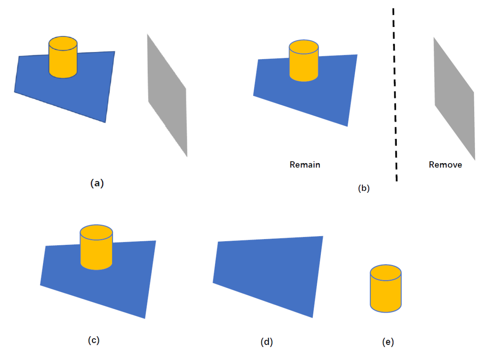

​                                                                 图 4-10-10：虚拟分割前后示意图

下面的图 4-10-11 是实际点云分割前后的视图对比：可以看到由于原始点云构造比较复杂，最终得到的圆柱不像虚拟示意图中一样完美，但实际点云的处理过程和最终目的与图 4-10-10 的示意图是一致的。

处理过程为：首先通过直通滤波器过滤掉原始点云 **table_scene_mug_stereo_textured.pcd** 右侧灰色部分，对于剩下的桌子和杯子进行平面和圆柱的分割，得到平面部分 **table_scene_mug_stereo_textured_plane.pcd** 和最终提取目标：圆柱体部分 **table_scene_mug_stereo_textured_cylinder.pcd** 。


​                                                              图 4-10-11：实际分割前后视图


#### 4-10-2 ：聚类分割 ：

##### 定义：

聚类分割，就是通过聚类的方法对点云进行分割。常见的聚类方法有 K-Means 法、最大似然法、模糊聚类、欧式聚类，其中 K-Means 在第五章会详细讲解。

##### 原理：

聚类分割的基本原理为：考察 m 个数据点，在 m 维空间内定义点与点之间某种性质的亲疏聚类。设 m 个数据点组成 n 类，然后将具有最小距离的两类合为一类，并重新计算类与类之间的距离，迭代直到任意两类之间的距离大于指定的阈值，或者类的个数小于指定的数目，分割完成[^21]。

这里我们使用的其实是欧式聚类，就是根据欧氏距离（两点间的直线距离）进行聚类，距离达到一定阈值的点聚为一类，否则为不同类别。

##### 实例：

以 **table.pcd** 为要分割的点云文件：首先通过 VoxelGrid 过滤点云，达到下采样效果，减少点云数目，提高精度；然后利用随机采样一致性将平面部分提取，再对剩下的部分进行分割。


​                                                                     图 4-10-12：**table.pcd** 视图

完整代码 **table_segmentation.cpp** 见 [附录 —— 桌子部件分割](# 4.10.2：聚类分割：)

下面是代码详解：

下面是对点云进行欧式聚类分割需要用到的头文件，注意：这其中也会用到基于 RANSAC 的分割：

```c++
#include <pcl/point_types.h>                   // 点云类型头文件
#include <pcl/io/pcd_io.h>                     // 点云读取头文件
#include <pcl/filters/extract_indices.h>       // 提取索引点头文件
#include <pcl/filters/voxel_grid.h>            // VoxelGrid 采样头文件
#include <pcl/features/normal_3d.h>            // 法线估计头文件
#include <pcl/kdtree/kdtree.h>                 // Kdtree 搜索头文件
#include <pcl/sample_consensus/method_types.h> // 采样方法头文件
#include <pcl/sample_consensus/model_types.h>  // 采样模型头文件
#include <pcl/segmentation/sac_segmentation.h> // RANSAC 分割头文件
#include <pcl/segmentation/extract_clusters.h> // 欧式聚类分割头文件
```

------


下面代码首先创建点云读取对象 reader；然后创建三个点云对象： cloud（原始点云）、add_cloud、cloud_f（后续分割中间输出结果点云）；将 **table.pcd** 内容加载到 cloud 中；最后输出 cloud 中的点数，即利用滤波过滤之前的点云点数：

```c++
pcl::PCDReader reader;
pcl::PointCloud<pcl::PointXYZ>::Ptr add_cloud(new pcl::PointCloud<pcl::PointXYZ>);
pcl::PointCloud<pcl::PointXYZ>::Ptr cloud(new pcl::PointCloud<pcl::PointXYZ>), cloud_f(new pcl::PointCloud<pcl::PointXYZ>);
reader.read(".../table.pcd", *cloud);
std::cout << "PointCloud before filtering has: " << cloud->points.size() << " data points." << std::endl; 
```

------


下面是利用 VoxelGrid 进行降采样：首先创建 VoxelGrid 对象 vg；然后创建点云对象 cloud_filtered 来存放过滤后的点云；将 cloud 作为 vg 的输入点云；设置 VoxelGrid 中的体素边长为 0.01m；执行过滤；最后输出过滤后的点云点数：

```c++
pcl::VoxelGrid<pcl::PointXYZ> vg;
pcl::PointCloud<pcl::PointXYZ>::Ptr cloud_filtered(new pcl::PointCloud<pcl::PointXYZ>);
vg.setInputCloud(cloud);
vg.setLeafSize(0.01f, 0.01f, 0.01f);
vg.filter(*cloud_filtered);
std::cout << "PointCloud after filtering has: " << cloud_filtered->points.size() << " data points." << std::endl; 
```

------


下面是从点云整体将平面模型分割出来的具体代码实现，也即从点云中提取平面模型（参考 4.10.1 Segmentation_随机采样一致性分割中的实例一）：首先创建 RANSAC 分割对象 seg；然后创建聚类的内点索引对象 inliers；创建平面模型系数对象 coefficients；创建点云对象 cloud_plane 用来存放提取出的平面模型部分。创建好平面模型分割对象后，进行参数设置*：

```c++
// 创建平面模型分割的对象
pcl::SACSegmentation<pcl::PointXYZ> seg;
pcl::PointIndices::Ptr inliers(new pcl::PointIndices); // 设置聚类的内点索引
pcl::ModelCoefficients::Ptr coefficients(new pcl::ModelCoefficients);// 平面模型系数
pcl::PointCloud<pcl::PointXYZ>::Ptr cloud_plane(new pcl::PointCloud<pcl::PointXYZ>());
// 设置参数
pcl::PCDWriter writer;
seg.setOptimizeCoefficients(true);
seg.setModelType(pcl::SACMODEL_PLANE);    // 分割模型
seg.setMethodType(pcl::SAC_RANSAC);       // 随机参数估计方法
seg.setMaxIterations(100);                // 最大的迭代的次数
seg.setDistanceThreshold(0.02);           // 设置阀值
```

*参数设置：

- **setOptimizeCoefficients** 为 true，也即进行系数的优化操作；
- **setModelType** 设置分割模型为平面模型 SACMODEL_PLANE；
- **setMethodType** 设置随机参数估计方法为 RANSAC；
- **setMaxIterations** 设置最大迭代次数为 100；
- **setDistanceThreshold **设置判断是否为内点的阈值为 0.02m。

------


下面利用 while 循环来逐个输出经过过滤后的点云中的平面部分：while 中的判断条件意思是，如果识别到的可能是平面模型部分的的点数大于最初只经过 VoxelGrid 过滤的 cloud_filtered 点数的 0.3 倍则循环继续，否则认为不属于平面模型；循环内部首先从当前的 cloud_filtered 中分割出最大的平面模型，得到内点对象 inliers 和平面模型系数对象 coefficients；得到平面模型并输出其包含的点数：

```c++
int i = 0, nr_points = (int)cloud_filtered->points.size();//剩余点云的数量
while (cloud_filtered->points.size() > 0.3 * nr_points)
{
	// 从剩余点云中再分割出最大的平面分量（因为我们要处理的点云的数据可以提取出两个平面）
	seg.setInputCloud(cloud_filtered);
	seg.segment(*inliers, *coefficients);

	// 从输入的点云中提取平面模型的内点
	pcl::ExtractIndices<pcl::PointXYZ> extract;
	extract.setInputCloud(cloud_filtered);
	extract.setIndices(inliers);        //提取内点的索引并存储在其中
	extract.setNegative(false);
    
	// 得到与平面表面相关联的点云数据
	extract.filter(*cloud_plane);
	std::cout << "PointCloud representing the planar component: " << cloud_plane->points.size() << " data points." << std::endl;
```

------


下面代码将前面提取出的平面模型分割出去；然后将剩余的点云加载给 cloud_filtered（注意：这里的 cloud_filtered 与一开始刚刚经过 VoxelGrid 过滤后的 cloud_filtered 不一样，此处的已经将第一个平面模型提取出来了）；然后输出并保存提取出的平面模型 **table_cloud_plane_i.pcd**（i 为平面索引），直到 while 判断条件不成立时终止循环。在本例中我们一共循环得到了两个平面（结果视图中会标注），经过此部分代码后的 cloud_filtered 为除去所有平面后的剩余点云：

```c++
// 移去平面局内点，提取剩余点云
extract.setNegative(true);
extract.filter(*cloud_f);
*cloud_filtered = *cloud_f;

std::stringstream ss1;
ss1 << ".../table_cloud_plane_" << i << ".pcd";
writer.write<pcl::PointXYZ>(ss1.str(), *cloud_plane, false); 
i++;
}
```

------


下面代码是对于除去平面后的剩余点云进行欧式聚类分割的具体代码实现：首先创建 Kdtree 近邻搜索对象 tree；将除去所有平面后的剩余点云 cloud_filtered（注意与最开始的 cloud_filtered 不同）作为搜索的输入点云；创建索引对象 cluster_indices；创建欧式聚类对象 ec；然后进行参数设置*；执行欧式聚类分割并将分割后的部分提取，将点云索引保存在 cluster_indices 中：

```c++
// 创建用于提取搜索方法的 kdtree 对象
pcl::search::KdTree<pcl::PointXYZ>::Ptr tree(new pcl::search::KdTree<pcl::PointXYZ>);
tree->setInputCloud(cloud_filtered);
std::vector<pcl::PointIndices> cluster_indices;
pcl::EuclideanClusterExtraction<pcl::PointXYZ> ec;   // 欧式聚类对象
ec.setClusterTolerance(0.02); // 一个 cluster 中点与点之间的最大距离为 2cm
ec.setMinClusterSize(100);    // 设置一个聚类需要的最少的点数目为 100
ec.setMaxClusterSize(25000);  // 设置一个聚类需要的最大点数目为 25000
ec.setSearchMethod(tree);     // 设置点云的搜索机制
ec.setInputCloud(cloud_filtered);
ec.extract(cluster_indices);  // 从点云中提取聚类，并将点云索引保存在 cluster_indices 中
```

*参数设置：

**setClusterTolerance：** 一个 cluster 中点与点之间的最大距离；

**setMinClusterSize：**一个 cluster 最少点数；

**setMaxClusterSize：**一个 cluster 最多点数。

------


下面代码通过 for 循环来循环 cluster_indices 按照索引开始到索引结尾的顺序将欧式聚类分割的结果依次输出并保存；同时输出了每个 cluster 的点数，将每个 cluster 保存在 **table_cloud_cluster_j.pcd** 中（j 是分割后每个 cluster 的索引）；将这几个 cluster 合并得到 **table_add_cloud.pcd**：

```c++
// 迭代访问点云索引 cluster_indices
int j = 0;
for (std::vector<pcl::PointIndices>::const_iterator it = cluster_indices.begin(); it != cluster_indices.end(); ++it)
{ // 迭代容器中的点云索引，并且分开保存索引的点云
	pcl::PointCloud<pcl::PointXYZ>::Ptr cloud_cluster(new pcl::PointCloud<pcl::PointXYZ>);
	for (std::vector<int>::const_iterator pit = it->indices.begin(); pit != it->indices.end(); ++pit)
		// 设置保存点云的属性问题
		cloud_cluster->points.push_back(cloud_filtered->points[*pit]); 
	cloud_cluster->width = cloud_cluster->points.size();
	cloud_cluster->height = 1;
	cloud_cluster->is_dense = true;
	std::cout << "PointCloud representing the Cluster: " << cloud_cluster->points.size() << " data points." << std::endl;
	std::stringstream ss2;
	ss2 << ".../table_cloud_cluster_" << j << ".pcd";
	writer.write<pcl::PointXYZ>(ss2.str(), *cloud_cluster, false); 
	j++;
	*add_cloud += *cloud_cluster;
	pcl::io::savePCDFileASCII(".../table_add_cloud.pcd", *add_cloud);
}
```

------

下面是代码运行结果：


​                                                                   图 4-10-13：代码运行结果

从图 4-10-13 我们可以获取的信息如下：

1. 利用 VoxelGrid 过滤之前（即原始点云）点数为 460400；
2. 利用 VoxelGrid 过滤之后点数为 41049；
3. 提取的第一个平面点数为 20536；
4. 提取的第二个平面点数为 12442；
5. 除去平面后进行欧式聚类分割得到的五个 cluster 点数分别为 4857、1386、321、291、123。

图 4-10-14 直观体现分割情况：

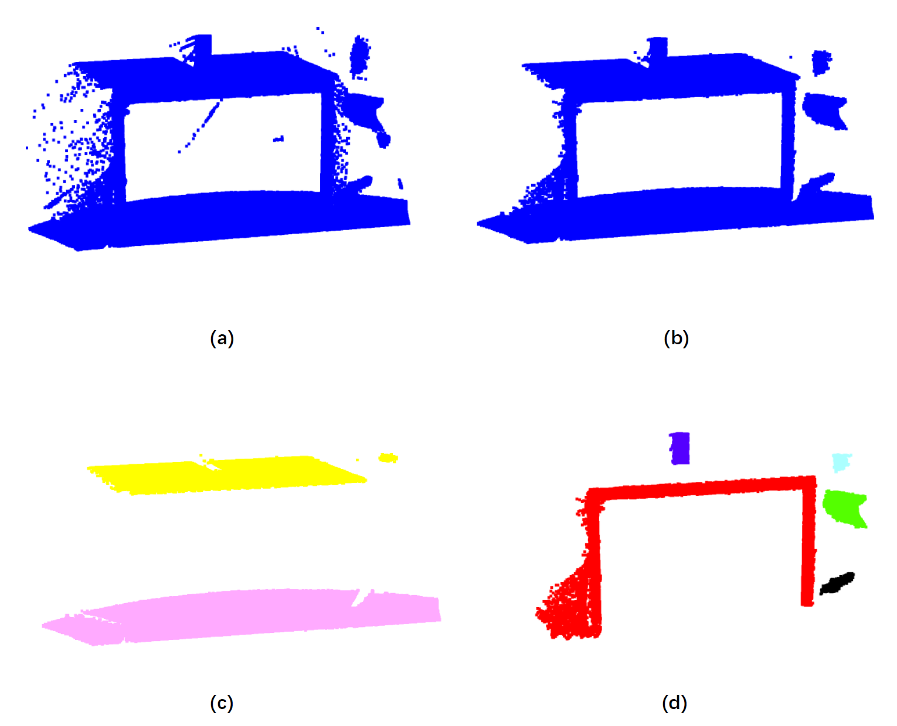

​                                                                图 4-10-14：欧式聚类分割视图

从上图我们可以看到：(a) 代表原始点云；(b) 代表经过 VoxelGrid 过滤后的点云；(c) 代表利用 RANSAC 分割后的两个平面部分（黄色粉色各为一个平面）；(d) 代表除去平面部分后剩余部分利用欧式聚类分割的结果。图中有五个颜色因此是划分成了五个 clusters（不同的颜色代表不同 cluster），可以看出，欧式聚类分割起到的作用主要是将距离较近的点聚集在一起归为一个 cluster。


### 4-11：Surface Reconstruction（表面重建）：

表面重建是三维点云处理的重要技术。主要思路是将点云从数据点，经过重建过程，升级到面（包括平面和曲面）。表面重建旨在使重建的面能够拟合原始点云，尽可能地逼近原始点云的几何形态。


​                                                             图 4-11-1：点云曲面重建示意图[^45]

如图 4-11-1 所示：左边两幅是人像的点云和曲面重建示意图，右边两幅图是小鸭子的点云和曲面重建示意图。可以看到，点云示意图都是些离散的点，而曲面重建的结果勾勒出了所代表几何体的表面形状。


#### 4-11-1：表面重建概念及算法：

本节首先介绍 PCL 中包含的用于表面重建的一些概念和现有算法。我们提到的概念包括 voronoi 图，介绍的算法包括 Ear Clipping 三角化算法、贪婪投影三角化算法（Greedy Projection Triangulation）、移动立方体算法（Marching Cubes Algorithm）、泊松曲面重建算法（Poisson Surface Reconstruction）

##### 概念：

voronoi 图：由相邻点连线的中垂线组成的连续多边形，是一个关于空间划分的基础数据结构[^46]，是表面重建过程中常会用到的结构。

如图 4-11-2 所示：X1 - X15 是十五个点，挑选黑圈内的 X5 和 X6 为例，其中红色为相邻点之间的连线，蓝色为相邻点之间连线的中垂线：


​                                                                        图 4-11-2：获得 voronoi 图[^47]

其他相邻点也根据这一规则进行连接，找寻中垂线，最终得到所有相邻点连线的中垂线并进行连接，最终蓝色部分就是 voronoi 图（如图 4-11-3）。

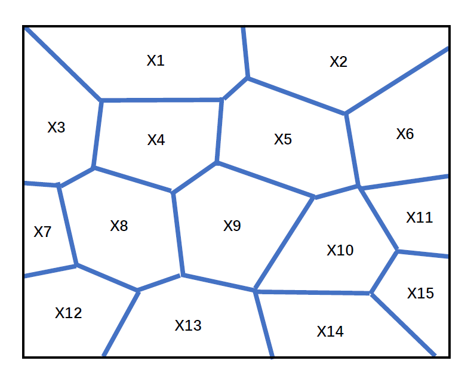

​                                                                           图 4-11-3：voronoi 图


##### 现有表面重建算法（surface reconstruction algorithms）：

下面我们介绍 4 种常见表面重建算法：

1. Ear Clipping 三角化算法；
2. 贪婪投影三角化算法（Greedy Projection Triangulation）；
3. 移动立方体算法（Marching Cubes Algorithm）；
4. 泊松表面重建算法（Poisson Surface Reconstruction）；

###### 一、Ear Clipping 三角化算法：

图 4-11-4 是 Ear Clipping 三角化算法过程的示意图。三角化算法就是由点云得到一些三角形的算法。之所以叫做 Ear Clipping 三角化，是因为三角化的过程就像在不断划分出 ear：


​                                                        图 4-11-4：Ear Clipping 三角化过程示意图[^48]

具体三角化的过程如下：

**(a)：**是初始状态；

**(b)：** 选择多边形的一个顶点与其相邻的两个点组成一个三角形。可以看到我们所选的点被标蓝，与其相邻点组成的三角形被用蓝色标出；

**(c)：** 显示上一步我们标出的三角形（一个 ear）被移除；

**(d) - (h)：**将剩余多边形也按照这一规则不断进行三角形的移除，重复操作；

**(i)：**直至最后只剩下三个顶点，组成最后的三角形为 Ear Clipping 三角化的结果。


###### 二、贪婪投影三角化算法（Greedy Projection Triangulation）：

贪婪投影三角化算法 Greedy Projection Triangulation 也是一种表面重建算法（图 4-11-5）：


​                                               图 4-11-5：Greedy Projection Triangulation 流程示意图[^49]

具体贪婪投影三角化的流程如下：

(a)：初始状态；

(b)：将所有点云投影在一个平面上；

(c)：根据 Delaunay（前苏联数学家）空间区域增长算法对投影的点进行平面三角化；

(d)：根据各个投影点之间的连接关系重新构建其拓扑结构。


###### 三、移动立方体算法（Marching Cubes Algorithm）：

移动立方体算法（Marching Cubes Algorithm）是一种根据等值面来表面重建的算法。其中涉及到 “等值面” 这个概念，等值面（图 4-11-6）是空间中的一个曲面，在该面上函数 $F(x,y,z)$ 为一个固定值，即在该面上函数值相等，所以叫等值面。如图 4-11-6：$K_L$ 就是我们所说的函数 $F(x,y,z)$ ，图中用不同颜色绘制了 $K_L = 0.5$，$K_L = 1.0$，$K_L = 1.5$，$K_L = 2.0$，$K_L = 2.5$ 五个等值面 。


​                                                                         图 4-11-6：等值面示意图[^50]

**Marching cubes algorithm 的基本思路是：**

**(a)：**首先将点云所在区域用整齐的小立方体进行空间划分（立方体边长为可设置的参数），如图 4-11-7；

**(b)：**找出所有与等值面（此时等值面并不直观存在，这里我们只有函数 $F(x,y, z)$ 为判断函数）相交的小立方体（这些小立方体也称为体素，在 4.8.4 Search_Octree 中提到过，相交的意思是该小立方体存在某些顶点在等值面内，某些顶点在等值面外的情况）；

**(c)：**计算等值面与小立方体的交点作为等值点，根据图 4-11-9 的剖分方式进行等值点之间三角形或多边形的连接，得到等值面。


​                                                 图 4-11-7：将点云按照小立方体整齐进行空间划分示意图

其中，每个点与等值面的关系如下（图 4-11-8 曲面为 $F(x,y,z) = H$）：

情况一：顶点的函数值大于等值面函数值，定义该顶点在等值面内（图 4-11-8 蓝色点）；

情况二：顶点的函数值小于等值面函数值，定义该顶点在等值面外（图 4-11-8 红色点）。


​                                                             图 4-11-8：等值面两侧点情况示意图

鉴于上述两种情况的判断准则，我们来分析将点云按照小立方体整齐划分后每个小立方体的每个顶点可能出现的情况（在等值面内还是等值面外）：每个小立方体有八个顶点，每个顶点有两种可能的结果（在等值面内或在等值面外），因此有 $2^8 = 256$ 种可能的组合，由于立方体本身的对称性，256 种情况可以归纳为 15 种，如图 4-11-9：


​                                              图 4-11-9：Marching cubes algorithm 15 种组合示意图[^51]

图 4-11-9 中：红色点为等值面外点（其值小于等值面的值），蓝色点为等值面内点（其值大于等值面的值），绿色面为根据每个顶点在等值面内或外绘制的等值面。


###### 四、泊松曲面重建算法（Poisson Surface Reconstruction）：

Poisson Surface Reconstruction 是一种基于隐式函数的三角网格重建算法，该类方法通过对点云数据进行最优化的插值处理来获得近似表面[^21]。这里简单提及该算法，不作详细解释。

Poisson Surface Reconstruction 的输入数据是包含法线信息的点云数据，假设所有点位于或者邻近一个未知模型的表面（设为 M ）。算法目标是估计模型的指示函数和提取等值面，再基于指示函数和等值面利用 Marching cubes algorithm 算法完成表面重建，最终输出为表面模型数据[^21]，如图 4-11-10 右侧：


​                                                 图 4-11-10：Poisson surface reconstruction 示意图[^52]


#### 4-11-2：基于 MLS （Moving Least Squares ）的点云平滑重采样 ：

原始点云有时不能直接拿来进行表面重建，在以下两种情况中我们需要先对原始点云进行预处理：

##### 情况一：

点云有时候会有局部噪音或 outlier（如图 4-11-11 (a)），会导致重建的表面含有漏洞或者不光滑。我们要对点云进行平滑处理，也叫平滑重采样。点云平滑常用的方法是移动最小二乘法（MLS）。

> 注意，在离散的点云中进行曲线或者曲面拟合，不能简单地直接连接这些点，如果我们知道曲线曲面的具体形式，比如为二次曲线等，可以简单地使用最小二乘法估计参数；但如果曲线曲面形式未知（大部分情况下是未知的），此时可以使用移动最小二乘法 （MLS）。关于该算法的数学表示涉及较多数学概念，感兴趣可以自行查找。

如图 4-11-11 所示：(a) 为我们采集到的一个杯子点云，图中红圈内的部分是噪声点（noise）。(b) 是经过点云平滑后得到的结果。可以看到相较于 (a)，(b) 的表面更加光滑，而且红圈内的噪声点也基本去除。


​                                                             图 4-11-11：点云平滑前后对比示意图[^53]


##### 情况二：

所有完整物体的点云都是配准得到的，除非只有一个 scan。点云配准的结果不理想，scans 之间的重叠部分不完全重合，很有可能出现 double walls （双墙/双影现象）。本来只有一个面的地方，经过配准后出现两个面甚至多个面且无法重合，如图 4-11-12 红圈内。double walls 会严重影响表面重建，需借助点云平滑重采样来预处理。


​                                                                 图 4-11-12：double walls 示意图


##### 实例：

下面对 **milk.pcd** （见教程文件夹）进行 MLS 点云平滑重采样，**milk.pcd** 并不是一个完整闭合的牛奶盒点云，它只包含牛奶盒的两面，如图 4-11-13。本例旨在对 **milk.pcd** 进行点云平滑重采样，使其表面比原始点云更加光滑，易于表面重建：

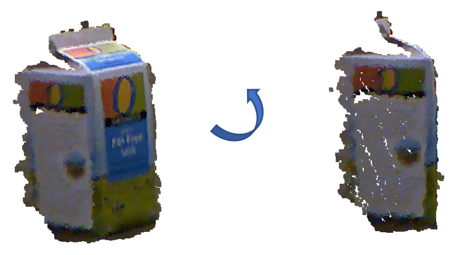

​                                                                图 4-11-13：**milk.pcd** 各方位视图

完整代码 **mls_smooth.cpp** 见 [附录 —— 基于 MLS 的点云平滑重采样](# 4.11.2：基于 MLS 的点云平滑重采样：)

下面是代码详解：

下面几行代码是进行基于 MLS 的点云平滑重采样所需的头文件：

```c++
#include <pcl/point_types.h>          // 点云类型头文件
#include <pcl/io/pcd_io.h>            // 读写点云头文件
#include <pcl/kdtree/kdtree_flann.h>  // Kdtree 头文件
#include <pcl/surface/mls.h>          // MLS 头文件
```

------


下面代码创建点云对象 cloud，将 **milk.pcd** 加载到 cloud 中：

```c++
    // Load input file into a PointCloud<T> with an appropriate type
	pcl::PointCloud<pcl::PointXYZRGB>::Ptr cloud(new pcl::PointCloud<pcl::PointXYZRGB>());
	pcl::io::loadPCDFile(".../milk.pcd", *cloud);
```

------


下面代码创建与点云平滑相关的对象：首先创建近邻搜索对象 tree（用来搜索每个点的近邻点，然后根据这些近邻点，利用 MLS 计算法线，实现平滑）；然后创建包含法线信息的点云对象 mls_points；最后创建 MLS 对象 mls ：

```c++
    // Create a KD-Tree
	pcl::search::KdTree<pcl::PointXYZRGB>::Ptr tree(new pcl::search::KdTree<pcl::PointXYZRGB>);
	// Output has the PointNormal type in order to store the normals calculated by MLS
	pcl::PointCloud<pcl::PointXYZRGBNormal> mls_points;
	// Init object (second point type is for the normals, even if unused)
	pcl::MovingLeastSquares<pcl::PointXYZRGB, pcl::PointXYZRGBNormal> mls;
```

------


下面代码首先利用 MLS 算法计算每个点的法线，将 cloud 作为要进行点云平滑的输入点云，然后设置 MLS 点云平滑的参数*，执行点云重采样，将平滑重采样结果保存在 **milk_mls.pcd** 中：

```c++
    mls.setComputeNormals(true);
	mls.setInputCloud(cloud);
	mls.setPolynomialFit(true);
	mls.setSearchMethod(tree);
	mls.setSearchRadius(0.05);
	mls.process(mls_points);
	// Save output
	pcl::io::savePCDFile(".../milk_mls.pcd", mls_points);
```

*参数设置：

**setPolynomialFit：**是否采用多项式拟合来提高精度，true 表示这里采取多项式拟合来提高精度；

**setSearchMethod：**设置近邻搜索方法；

**setSearchRadius：**设置搜索的近邻范围半径。

------


​                                                                  图 4-11-14：平滑前后对比示意图

从图 4-11-14 可以看出，**milk.pcd** 右侧红框内崎岖不平，存在影响点云重建的点，经过 MLS 平滑重采样后，**milk_mls.pcd** 右侧红框内变得非常平滑，这便是 MLS 平滑重采样的直观结果。


#### 4-11-3：无序点云的快速的三角化 ：

##### 原理：

本节主要介绍无序点云（见 3.1 pcd文件 中无序点云和有序点云的介绍）的快速三角化算法——贪婪投影三角化算法（Greedy Projection Triangulation）（见 4.11.1 表面重建概念及算法）。之前介绍过该算法的具体步骤，其大体思想主要是：将有向点云（计算法线后的点云）投影到二维平面（图 4-11-15 (b)），然后将二维平面的点进行三角化（Delaunay 空间区域增长算法）（图 4-11-15 (c)），再根据平面三角化结果的拓扑关系得到最终三角网格（图 4-11-15 (d)）。

注意：该算法也有一定的局限性，它更适用于采样点云来自于表面连续光滑的曲面且点云密度变化比较均匀的情况[^21]，无法在三角化的同时完成点云平滑或者是孔洞的填补；如果存在不平滑处或是密度变化较大的区域，那么根据平面三角化结果的拓扑关系得到三角网格的过程会不太准确。


​                                             图 4-11-15：Greedy Projection Triangulation 过程示意图[^49]

下面通过具体实例展示如何用 Greedy Projection Triangulation 来快速三角化无序点云，得到其三角网格结果，该结果以 vtk 文件的形式保存，因为 vtk 中可以保存关于多边形的信息（见 3.3 vtk 文件）：

##### 实例：

对 **bottle.pcd** （见教程文件夹）进行快速三角化，如图 4-11-16，**bottle.pcd** 是一个瓶子，该点云表面连续光滑且点云密度变化比较均匀。


​                                                                    图 4-11-16：**bottle.pcd** 示意图

完整代码 **greedy_projection_triangulation.cpp** 见 [附录 —— 无序点云的快速的三角化](# 4.11.3：无序点云的快速三角化：)

下面是代码详解：

下面几行是进行 Greedy Projection Triangulation 快速三角化所需的头文件：

```c++
#include <pcl/point_types.h>          // pcl 中所有点类型定义的头文件
#include <pcl/io/pcd_io.h>            // 打开关闭 PCD 文件的类定义的头文件
#include <pcl/kdtree/kdtree_flann.h>  // kdtree 搜索对象的类定义的头文件
#include <pcl/features/normal_3d.h>   // 法向量特征估计相关类定义的头文件
#include <pcl/surface/gp3.h>          // 贪婪投影三角化算法类定义的头文件
#include <pcl/io/vtk_io.h>            // 输入输出 vtk 文件的类定义的头文件
#include <iostream>
using namespace std;
```

------


下面代码首先创建点云对象 cloud 来存储原始点云 **bottle.pcd**，然后对其进行法线估计，创建法线估计对象 n，然后创建法线存储对象 normals，最后创建 Kdtree 近邻搜索对象 tree，将 cloud 作为 tree 的输入点云：

```c++
    //Load input file into a PointCloud<T> with an appropriate type
	pcl::PointCloud<pcl::PointXYZ>::Ptr cloud(new pcl::PointCloud<pcl::PointXYZ>); 
	pcl::io::loadPCDFile(".../bottle.pcd", *cloud);	
	//Normal estimation
	pcl::NormalEstimation<pcl::PointXYZ, pcl::Normal> n; 
	pcl::PointCloud<pcl::Normal>::Ptr normals(new pcl::PointCloud<pcl::Normal>); 
	pcl::search::KdTree<pcl::PointXYZ>::Ptr tree(new pcl::search::KdTree<pcl::PointXYZ>); 
	tree->setInputCloud(cloud); 
```

------


下面代码首先估计点云法线（设置参数 setInputCloud，setSearchMethod，setKSearch）（见 4.6.1 Features_估计一个点云的表面法线），将法线估计结果存储到 normals 中；然后将含有 xyz 信息的原始点云与计算出法线信息的 normals 合并在一起，得到包含 xyz 与法线信息的点云，存储在 cloud_with_normals 中：

```c++
    n.setInputCloud(cloud); //为法线估计对象设置输入点云
	n.setSearchMethod(tree); //设置搜索方法
	n.setKSearch(35); //设置k搜索的k值为35
	n.compute(*normals); //估计法线存储结果到normals中
	//Concatenate the XYZ and normal fields*
	pcl::PointCloud<pcl::PointNormal>::Ptr cloud_with_normals(new pcl::PointCloud<pcl::PointNormal>);
	pcl::concatenateFields(*cloud, *normals, *cloud_with_normals); 
```

------


下面代码首先创建新的 Kdtree 搜索对象 tree2，将包含法线信息的 cloud_with_normals 作为其输入点云进行近邻搜索；然后定义三角化模型：首先创建三角化对象 gp3，然后创建三角化网格模型结果存储对象 triangles：

```c++
    //Create search tree*
	pcl::search::KdTree<pcl::PointNormal>::Ptr tree2(new pcl::search::KdTree<pcl::PointNormal>);
	tree2->setInputCloud(cloud_with_normals); 
	//Initialize objects 定义三角化模型
	pcl::GreedyProjectionTriangulation<pcl::PointNormal> gp3; 
	pcl::PolygonMesh triangles; 
```

------


下面进入三角化网格计算的参数设计部分*：

```c++
    //Set the parameters
	gp3.setSearchRadius(1.0); 
	gp3.setMu(3.0);
	gp3.setMaximumNearestNeighbors(100); 
	gp3.setMaximumSurfaceAngle(M_PI / 4);
	gp3.setMaximumAngle(2 * M_PI / 3); 
	gp3.setMinimumAngle(M_PI / 18);
	gp3.setNormalConsistency(true);
```

*参数设置：

**setSearchRadius：** 设置最终得到的所有三角形的最大边长；

**setMu：**设置被样本点搜索其邻近点的最远距离；

**setMaximumNearestNeighbors：**设置样本可搜索的邻域个数；

**setMaximumSurfaceAngle：**设置某点法线方向偏离样本点法线方向最大角度，这里是 45 degrees；

**setMaximumAngle：**设置三角化后的三角形内角最大角度，这里是 120 degrees；

**setMinimumAngle：**设置三角化后的三角形内角最小角度，这里是 10 degrees；

**setNormalConsistency：**设置该参数保证法线是否朝向一致，true 代表一致，false 反之。

------


下面将 cloud_with_normals 作为 gp3 的输入点云，tree2 为 gp3 的搜索方法，执行三角化，将最终结果存储到 **bottle.vtk** 中：

```c++
    //Get result
	gp3.setInputCloud(cloud_with_normals); //设置输入点云为有向点云cloud_with_normals
	gp3.setSearchMethod(tree2); //设置搜索方式为tree2
	gp3.reconstruct(triangles); //重建提取三角化
	//Sava data and output
	pcl::io::saveVTKFile(".../bottle.vtk", triangles);
```

------


​                             图 4-11-17：Greedy Projection Triangulation 前后  CloudCompare 示意图

其中普通 vtk 示意图与 wireframe 示意图（见 3.3 vtk 文件 中关于 wireframe 的介绍）都是 Greedy Projection Triangulation 得到的结果，不过形式不同，其区别在于前者将三角形全都填充为绿色（如图 4-11-17），后者只是体现了三角形的轮廓，因此网状构造更加明显。 CloudCompare 中 vtk 文件示意图默认为绿色，因此 **bottle.vtk** 都显示绿色。

其中，我们将 wireframe 视图的 **bottle.vtk** 截取一半，然后局部放大，可以看到其由多个小三角形构成（如图 4-11-18）：

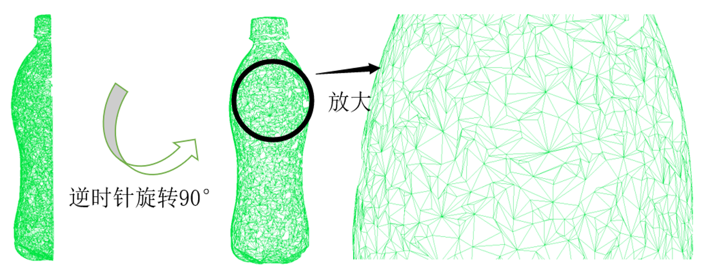

​                                                                图 4-11-18：Triangulation 示意图


> 以上是第四章的全部内容，接下来的章节我们将会介绍除了 PCL 之外处理点云的算法。
>


### 附录：

#### 4.3.1：如何读取 PCD 文件：

**pcd_read.cpp：**

```c++
#include <iostream>              // 标准 C++ 库中的输入输出类相关头文件
#include <pcl/io/pcd_io.h>       // pcd 读写类相关的头文件
#include <pcl/point_types.h>     // pcl 中支持的点类型的头文件

int
main ()
{
  pcl::PointCloud<pcl::PointXYZ>::Ptr cloud (new pcl::PointCloud<pcl::PointXYZ>);

  if (pcl::io::loadPCDFile<pcl::PointXYZ> (".../bunny.pcd", *cloud) == -1) //* load the file
  {
    PCL_ERROR ("Couldn't read file bunny.pcd \n");
    return (-1);
  }
  std::cout << "Loaded "
            << cloud->width * cloud->height
            << " data points from bunny.pcd with the following fields: "
            << std::endl;
  for (std::size_t i = 0; i < cloud->points.size (); ++i)
    std::cout << "    " << cloud->points[i].x
              << " "    << cloud->points[i].y
              << " "    << cloud->points[i].z << std::endl;

  return 0;
}
```


#### 4.3.2：如何写入 PCD 文件：

**pcd_write.cpp：**

```c++
#include <iostream>
#include <pcl/io/pcd_io.h>
#include <pcl/point_types.h>

int
main ()
{
  pcl::PointCloud<pcl::PointXYZ> cloud;

  // Fill in the cloud data
  cloud.width    = 5;
  cloud.height   = 1;
  cloud.is_dense = false;
  cloud.points.resize (cloud.width * cloud.height);

  for (std::size_t i = 0; i < cloud.points.size (); ++i)
  {
    cloud.points[i].x = 1024 * rand () / (RAND_MAX + 1.0f);
    cloud.points[i].y = 1024 * rand () / (RAND_MAX + 1.0f);
    cloud.points[i].z = 1024 * rand () / (RAND_MAX + 1.0f);
  }

  pcl::io::savePCDFileASCII (".../test_pcd.pcd", cloud);
  std::cout << "Saved " << cloud.points.size () << " data points to test_pcd.pcd." << std::endl;

  for (std::size_t i = 0; i < cloud.points.size (); ++i)
    std::cout << "    " << cloud.points[i].x << " " 
                        << cloud.points[i].y << " " 
                        << cloud.points[i].z << std::endl;
  return 0;
}
```


#### 4.3.3：如何连接两个 PCD 文件：

**pcd_combine.cpp：**

```c++
#include <iostream>
#include <pcl/io/pcd_io.h>
#include <pcl/point_types.h>

int
main()
{	
	pcl::PointCloud<pcl::PointXYZ> cloud_a, cloud_b, cloud_c;
	pcl::PointCloud<pcl::Normal> n_cloud_b;
	pcl::PointCloud<pcl::PointNormal> p_n_cloud_c;

	// Fill in the cloud data
	cloud_a.width = 5;
	cloud_a.height = cloud_b.height = n_cloud_b.height = 1;
	cloud_a.points.resize(cloud_a.width * cloud_a.height);
	
	cloud_b.width = 3;
	cloud_b.points.resize(cloud_b.width * cloud_b.height);
	
	n_cloud_b.width = 5;
	n_cloud_b.points.resize(n_cloud_b.width * n_cloud_b.height);
	
	for (std::size_t i = 0; i < cloud_a.points.size(); ++i)
	{
		cloud_a.points[i].x = 1024 * rand() / (RAND_MAX + 1.0f);
		cloud_a.points[i].y = 1024 * rand() / (RAND_MAX + 1.0f);
		cloud_a.points[i].z = 1024 * rand() / (RAND_MAX + 1.0f);
	}
	
	for (std::size_t i = 0; i < cloud_b.points.size(); ++i)
	{
		cloud_b.points[i].x = 1024 * rand() / (RAND_MAX + 1.0f);
		cloud_b.points[i].y = 1024 * rand() / (RAND_MAX + 1.0f);
		cloud_b.points[i].z = 1024 * rand() / (RAND_MAX + 1.0f);
	}

	for (std::size_t i = 0; i < n_cloud_b.points.size(); ++i)
	{
		n_cloud_b.points[i].normal[0] = 1024 * rand() / (RAND_MAX + 1.0f);
		n_cloud_b.points[i].normal[1] = 1024 * rand() / (RAND_MAX + 1.0f);
		n_cloud_b.points[i].normal[2] = 1024 * rand() / (RAND_MAX + 1.0f);
	}

	std::cout << "Cloud A: " << std::endl;
	for (std::size_t i = 0; i < cloud_a.points.size(); ++i)
		std::cout << "    " << cloud_a.points[i].x << " " 
                            << cloud_a.points[i].y << " " 
                            << cloud_a.points[i].z << std::endl;

	std::cout << "Cloud B: " << std::endl;
	for (std::size_t i = 0; i < cloud_b.points.size(); ++i)
		std::cout << "    " << cloud_b.points[i].x << " " 
                            << cloud_b.points[i].y << " " 
                            << cloud_b.points[i].z << std::endl;
	
	std::cout << "Cloud n_B: " << std::endl;
	for (std::size_t i = 0; i < n_cloud_b.points.size(); ++i)
		std::cout << "    " << n_cloud_b.points[i].normal[0] << " " 
                            << n_cloud_b.points[i].normal[1] << " " 
                            << n_cloud_b.points[i].normal[2] << std::endl;

	// Copy the point cloud data
	cloud_c = cloud_a;
	cloud_c += cloud_b;
    pcl::concatenateFields(cloud_a, n_cloud_b, p_n_cloud_c);

	std::cout << "Cloud C: " << std::endl;
	for (std::size_t i = 0; i < cloud_c.points.size(); ++i)
		std::cerr << "    " << cloud_c.points[i].x << " " 
                            << cloud_c.points[i].y << " " 
                            << cloud_c.points[i].z << " " << std::endl;	

	std::cout << "Cloud p_n_C: " << std::endl;
	for (std::size_t i = 0; i < p_n_cloud_c.points.size(); ++i)
		std::cout << "    " << p_n_cloud_c.points[i].x << " " 
                            << p_n_cloud_c.points[i].y << " " 
                            << p_n_cloud_c.points[i].z << " " 
                            << p_n_cloud_c.points[i].normal[0] << " " 
                            << p_n_cloud_c.points[i].normal[1] << " " 
                            << p_n_cloud_c.points[i].normal[2] << std::endl;

	return 0;
}
```


#### 4.3.4：TXT 向 PCD 转换：

**txt_to_pcd.cpp：**

```c++
#include <iostream>      // 标准 C++ 库中的输入输出类相关头文件
#include <fstream>       // 文件流
#include <pcl/io/pcd_io.h>   // pcd 读写类相关的头文件
#include <pcl/point_types.h>   // pcl 中支持的点类型的头文件
using namespace std;   // 命名空间 std

int main()
{
	fstream modelRead;
	pcl::PointCloud<pcl::PointXYZ> cloud;
	pcl::PointXYZ pclPnt;

	modelRead.open(".../chair.txt", ios_base::in);
	while (!modelRead.eof())
	{
		modelRead >> pclPnt.x >> pclPnt.y >> pclPnt.z;
		cloud.push_back(pclPnt);
	}
	modelRead.close();
	pcl::io::savePCDFile(".../chair.pcd", cloud);
	return 0;
}
```


#### 4.3.4：PCD 向 TXT 转换：

**pcd_to_txt.cpp：**

```c++
#include <iostream>      // 标准 C++ 库中的输入输出类相关头文件
#include <fstream>       // 文件流
#include <pcl/io/pcd_io.h>   // pcd 读写类相关的头文件
#include <pcl/point_types.h>   // pcl 中支持的点类型的头文件
using namespace std;           // 命名空间 std

int main()
{
	pcl::PointCloud<pcl::PointXYZ>::Ptr cloud(new pcl::PointCloud<pcl::PointXYZ>);
    pcl::io::loadPCDFile<pcl::PointXYZ>("File Path/airplane.pcd", *cloud);
    int Num = cloud->points.size();
    double *X = new double[Num] {0};
    double *Y = new double[Num] {0};
    double *Z = new double[Num] {0};
    for (size_t i = 0; i < cloud->points.size(); ++i)
	{
		X[i] = cloud->points[i].x;
		Y[i] = cloud->points[i].y;
		Z[i] = cloud->points[i].z;
	}
    ofstream zos(".../airplane.txt");
    for (int i = 0; i < Num; i++)
	{
		zos << X[i] << " " << Y[i] << " " << Z[i] << " " << endl;
	}
	return 0;
}
```


#### 4.4.2：如何从点云中创建 Range Images：

**create_rangeimage.cpp**

```c++
#include <pcl/range_image/range_image.h>
#include <pcl/io/pcd_io.h>

int
main() 
{
	pcl::PointCloud<pcl::PointXYZ> pointCloud;

	// 生成矩形点云，保存在 rectangle.pcd 文件中
	for (float y = -0.5f; y <= 0.5f; y += 0.01f) {
		for (float z = -0.5f; z <= 0.5f; z += 0.01f) {
			pcl::PointXYZ point;
			point.x = 2.0f - y;
			point.y = y;
			point.z = z;
			pointCloud.points.push_back(point);
		}
	}
	pointCloud.width = pointCloud.points.size();
	pointCloud.height = 1;

	pcl::io::savePCDFileASCII(".../rectangle.pcd", pointCloud);

    // 现在开始从点云中创建深度图像
    // 深度图像参数的设置
	float angularResolution = (float)(1.0f * (M_PI / 180.0f)); // 弧度1度
	float maxAngleWidth = (float)(360.0f * (M_PI / 180.0f)); // 弧度360度
	float maxAngleHeight = (float)(180.0f * (M_PI / 180.0f)); // 弧度180度
	Eigen::Affine3f sensorPose = (Eigen::Affine3f)Eigen::Translation3f(0.0f, 0.0f, 0.0f);
	pcl::RangeImage::CoordinateFrame coordinate_frame = pcl::RangeImage::CAMERA_FRAME;
	float noiseLevel = 0.00;
	float minRange = 0.0f;
	int borderSize = 1;

	pcl::RangeImage rangeImage; // 创建深度图像对象 rangeImage
	rangeImage.createFromPointCloud(pointCloud, angularResolution, maxAngleWidth, maxAngleHeight, sensorPose, coordinate_frame, noiseLevel, minRange, borderSize);

	std::cout << rangeImage << "\n";
    
    // 保存深度图像于一个新的 pcd 文件中
	pcl::io::savePCDFileASCII(".../rectangle_range.pcd", rangeImage); 
	return 0;
}
```


#### 4.4.3：如何从 Range Image 中提取边界：

**create_rangeimage.cpp**

```C++
#include <iostream>
#include <pcl/io/pcd_io.h>
#include <pcl/range_image/range_image.h>
#include <pcl/features/range_image_border_extractor.h>
using namespace std;
typedef pcl::PointXYZ PointType;

int
main()
{
	// --------------------
	// -----创建点云文件-----
	// --------------------
	pcl::PointCloud<PointType> point_cloud;
	std::cout << "Generating example point cloud.\n\n";
	for (float x = -0.5f; x <= 0.5f; x += 0.01f)
	{
		for (float y = -0.5f; y <= 0.5f; y += 0.01f)
		{
			PointType point;  point.x = x;  point.y = y;  point.z = 2.0f - y;
			point_cloud.points.push_back(point);
		}
	}
	point_cloud.width = (int)point_cloud.points.size();  point_cloud.height = 1;

	// ---------------------------
	// -----从点云中创建深度图像--
	// ---------------------------
	float angular_resolution = 0.5f;
	Eigen::Affine3f scene_sensor_pose(Eigen::Affine3f::Identity());
	pcl::RangeImage::CoordinateFrame coordinate_frame = pcl::RangeImage::CAMERA_FRAME;
	bool setUnseenToMaxRange = false;
	float noise_level = 0.0;
	float min_range = 0.0f;
	int border_size = 1;
	pcl::RangeImage::Ptr range_image_ptr(new pcl::RangeImage);
	pcl::RangeImage& range_image = *range_image_ptr;
	range_image.createFromPointCloud(point_cloud, pcl::deg2rad(angular_resolution), pcl::deg2rad(360.0f), pcl::deg2rad(180.0f),
		scene_sensor_pose, coordinate_frame, noise_level, min_range, border_size);
	if (setUnseenToMaxRange)
		range_image.setUnseenToMaxRange();

	//保存深度图像
	pcl::io::savePCDFileASCII(".../rectangle_range.pcd", range_image);

	// -------------------------
	// -----提取深度图像边界------
	// -------------------------
	pcl::RangeImageBorderExtractor border_extractor(&range_image);
	pcl::PointCloud<pcl::BorderDescription> border_descriptions;
	border_extractor.compute(border_descriptions);

	//输出边界点的描述
	cout << border_extractor.getBorderDescriptions() << endl;

	return 0;
}
```


#### 4.5.2：如何从 Range Image 中提取 NARF 关键点：

**extract_NARF_Keypoints_rangeimage.cpp**

```c++
#include <iostream>
#include <pcl/range_image/range_image.h>
#include <pcl/io/pcd_io.h>
#include <pcl/features/range_image_border_extractor.h>
#include <pcl/keypoints/narf_keypoint.h>
typedef pcl::PointXYZ PointType;


int
main()
{
	pcl::PointCloud<PointType> point_cloud;
	pcl::io::loadPCDFile(".../airplane.pcd", point_cloud);

	// ---------------------------
	// -----从点云中创建深度图像--
	// ---------------------------
	pcl::RangeImage range_image;

	float angular_resolution = 0.5f;
	float support_size = 0.2f;
	pcl::RangeImage::CoordinateFrame coordinate_frame = pcl::RangeImage::CAMERA_FRAME;
	float noise_level = 0.0;
	float min_range = 0.0f;
	int border_size = 1;
	Eigen::Affine3f scene_sensor_pose(Eigen::Affine3f::Identity());
	bool setUnseenToMaxRange = true;
	
	range_image.createFromPointCloud(point_cloud, pcl::deg2rad(angular_resolution), pcl::deg2rad(360.0f), pcl::deg2rad(180.0f),
		scene_sensor_pose, coordinate_frame, noise_level, min_range, border_size);
	if (setUnseenToMaxRange)
		range_image.setUnseenToMaxRange();

	pcl::io::savePCDFileASCII(".../airplane_range.pcd", range_image);

	// ------------------------
	// -----提取 NARF 关键点-----
	// ------------------------
	pcl::RangeImageBorderExtractor range_image_border_extractor;
	pcl::NarfKeypoint narf_keypoint_detector(&range_image_border_extractor);
	narf_keypoint_detector.setRangeImage(&range_image);
	narf_keypoint_detector.getParameters().support_size = support_size;

	pcl::PointCloud<int> keypoint_indices;
	narf_keypoint_detector.compute(keypoint_indices);
	std::cout << "Found " << keypoint_indices.points.size() << " key points.\n" << std::endl;
	pcl::io::savePCDFileASCII(".../airplane_narf.pcd", narf_keypoint_detector.getInterestPoints());

	return 0;
}
```


#### 4.6.1：估计一个点云的表面法线：

**estimate_normal.cpp**

```C++
#include <iostream>
#include <pcl/point_types.h>
#include <pcl/io/pcd_io.h>
#include <pcl/search/kdtree.h>    // Kdtree 头文件
#include <pcl/features/normal_3d.h>   // 法线估计头文件

int
main()
{
	pcl::PointCloud<pcl::PointXYZ>::Ptr cloud(new pcl::PointCloud<pcl::PointXYZ>);
	pcl::io::loadPCDFile(".../bridge_pier.pcd", *cloud);
    
    // 创建法线估计对象 ne
	pcl::NormalEstimation<pcl::PointXYZ, pcl::Normal> ne;
	// 存储法线输出数据集 pcNormal
	pcl::PointCloud<pcl::Normal>::Ptr pcNormal(new pcl::PointCloud<pcl::Normal>);
	// 创建一个空的 kdtree 对象，并把它传递给法线估计对象
	// 基于给出的输入数据集，kdtree 将被建立
	pcl::search::KdTree<pcl::PointXYZ>::Ptr tree(new pcl::search::KdTree<pcl::PointXYZ>);
	tree->setInputCloud(cloud);
	ne.setInputCloud(cloud);
	ne.setSearchMethod(tree);
    ne.setRadiusSearch (0.03);// 使用半径在查询点周围3厘米范围内的所有近邻元素
	//或者 ne.setKSearch(50);  根据点周围50个点进行平面拟合（选取周围50个点作为近邻点）

	// 计算特征值
	ne.compute(*pcNormal);

    // 合并带有法线信息的 pcNormal 和带有每个点x，y，z信息的 cloud    
	pcl::PointCloud<pcl::PointNormal>::Ptr cloud_with_normals(new pcl::PointCloud<pcl::PointNormal>);
	pcl::concatenateFields(*cloud, *pcNormal, *cloud_with_normals);
    
    // 将含有xyz和法线信息的点云 cloud_with_normals 存储在 bridge_normal.pcd 中
    pcl::io::savePCDFileASCII(".../bridge_pier_normal.pcd", *cloud_with_normals);

	return 0;
}
```


#### 4.6.2：使用积分图进行法线估计：

**estimate_integral_normal.cpp**

```c++
    #include <pcl/io/io.h>
    #include <pcl/io/pcd_io.h>
    #include <pcl/features/integral_image_normal.h>   // 用积分图法计算法线的文件头

     int
     main ()
     {
     // 加载点云文件
     pcl::PointCloud<pcl::PointXYZ>::Ptr cloud (new pcl::PointCloud<pcl::PointXYZ>);
     pcl::io::loadPCDFile (".../table_scene_mug_stereo_textured.pcd", *cloud);

     // 估计法线
     pcl::PointCloud<pcl::Normal>::Ptr normals (new pcl::PointCloud<pcl::Normal>);

     pcl::IntegralImageNormalEstimation<pcl::PointXYZ, pcl::Normal> ne;
     ne.setNormalEstimationMethod (ne.AVERAGE_3D_GRADIENT);
     ne.setMaxDepthChangeFactor(0.02f);
     ne.setNormalSmoothingSize(10.0f);
     ne.setInputCloud(cloud);
     ne.compute(*normals);

     //将点的xyz信息和normals中的法线信息合并到cloud_with_normals中
     pcl::PointCloud<pcl::PointNormal>::Ptr cloud_with_normals(new pcl::PointCloud<pcl::PointNormal>);
     pcl::concatenateFields(*cloud, *normals, *cloud_with_normals);
     pcl::io::savePCDFile(".../table_scene_mug_stereo_textured_normals.pcd", *cloud_with_normals);
  
     return 0;
  }
```


#### 4.6.3：点特征直方图描述子（PFH descriptors）:

**pfh.cpp**

```c++
#include <iostream>
#include <pcl/point_types.h>
#include <pcl/io/pcd_io.h>
#include <pcl/search/kdtree.h>    // Kdtree 头文件
#include <pcl/features/normal_3d.h>   // 法线估计头文件
#include <pcl/features/pfh.h>   //PFH 特征估计类头文件

int
main()
{
   pcl::PointCloud<pcl::PointXYZ>::Ptr cloud(new pcl::PointCloud<pcl::PointXYZ>);
   pcl::io::loadPCDFile(".../bridge_pier.pcd", *cloud);

   // 创建法线估计对象 ne
   pcl::NormalEstimation<pcl::PointXYZ, pcl::Normal> ne;
   // 存储法线输出数据集 pcNormal
   pcl::PointCloud<pcl::Normal>::Ptr pcNormal(new pcl::PointCloud<pcl::Normal>);
   // 创建一个空的 kdtree 对象，并把它传递给法线估计对象
	// 基于给出的输入数据集，kdtree 将被建立
	pcl::search::KdTree<pcl::PointXYZ>::Ptr tree1(new pcl::search::KdTree<pcl::PointXYZ>);
	tree1->setInputCloud(cloud);
	ne.setInputCloud(cloud);
	ne.setSearchMethod(tree1);
	ne.setRadiusSearch(0.03);// 使用半径在查询点周围3厘米范围内的所有近邻元素
	//或者 ne.setKSearch(50);  根据点周围50个点进行平面拟合（选取周围50个点作为近邻点）

	// 计算特征值
	ne.compute(*pcNormal);

	// 合并带有法线信息的 pcNormal 和带有每个点x，y，z信息的 cloud    
	pcl::PointCloud<pcl::PointNormal>::Ptr cloud_with_normals(new pcl::PointCloud<pcl::PointNormal>);
	pcl::concatenateFields(*cloud, *pcNormal, *cloud_with_normals);

	//下面进行 PFH 的计算
	// 创建 PFH 估计对象 pfh，并将输入点云数据集 cloud 和法线 normals 传递给它 
	pcl::PFHEstimation<pcl::PointXYZ, pcl::Normal, pcl::PFHSignature125> pfh;
	pfh.setInputCloud(cloud);
	pfh.setInputNormals(pcNormal);

	// 创建一个空的 Kd 树表示法，并把它传递给 PFH 估计对象
	// 基于已给的输入数据集，建立 kd-tree 
	pcl::search::KdTree<pcl::PointXYZ>::Ptr tree2(new pcl::search::KdTree<pcl::PointXYZ>());
	pfh.setSearchMethod(tree2);

	// 输出数据集
	pcl::PointCloud<pcl::PFHSignature125>::Ptr pfhs(new pcl::PointCloud<pcl::PFHSignature125>());

	// 使用半径在 5cm 范围内的所有邻元素． 
	// 注意：此处使用的半径必须要大于估计表面法线时使用的半径!! 在这里我们计算表面法线的半径是 0.03
	pfh.setRadiusSearch(0.05);

	// 计算 PFH 特征值
	pfh.compute(*pfhs)

	//保存含有 PFH 的点云文件
	pcl::io::savePCDFileASCII(".../bridge_pier_pfh.pcd", *pfhs);

	return 0;
}
```


#### 4.6.4：快速点特征直方图描述子（FPFH descriptors）：

**fpfh.cpp**

```c++
#include <iostream>
#include <pcl/point_types.h>
#include <pcl/io/pcd_io.h>
#include <pcl/features/fpfh.h>  // FPFH 特征估计类头文件声明 
#include <pcl/search/kdtree.h>    // Kdtree 头文件
#include <pcl/features/normal_3d.h>   // 法线估计头文件

int
main()
{
	pcl::PointCloud<pcl::PointXYZ>::Ptr cloud(new pcl::PointCloud<pcl::PointXYZ>);
	pcl::io::loadPCDFile(".../bridge_pier.pcd", *cloud);

	// 创建法线估计对象 ne
	pcl::NormalEstimation<pcl::PointXYZ, pcl::Normal> ne;
	// 存储法线输出数据集 pcNormal
	pcl::PointCloud<pcl::Normal>::Ptr pcNormal(new pcl::PointCloud<pcl::Normal>);
	// 创建一个空的 kdtree 对象，并把它传递给法线估计对象
	// 基于给出的输入数据集，kdtree 将被建立
	pcl::search::KdTree<pcl::PointXYZ>::Ptr tree1(new pcl::search::KdTree<pcl::PointXYZ>);
	tree1->setInputCloud(cloud);
	ne.setInputCloud(cloud);
	ne.setSearchMethod(tree1);
	ne.setRadiusSearch(0.03);// 使用半径在查询点周围3厘米范围内的所有近邻元素
	//或者 ne.setKSearch(50);  根据点周围50个点进行平面拟合（选取周围50个点作为近邻点）

	// 计算特征值
	ne.compute(*pcNormal);

	// 合并带有法线信息的 pcNormal 和带有每个点 x，y，z 信息的 cloud    
	pcl::PointCloud<pcl::PointNormal>::Ptr cloud_with_normals(new pcl::PointCloud<pcl::PointNormal>);
	pcl::concatenateFields(*cloud, *pcNormal, *cloud_with_normals);

	// 创建 FPFH 估计对象 fpfh，并把输入数据集 cloud 和法线 normals 传递给它 
	pcl::FPFHEstimation<pcl::PointXYZ, pcl::Normal, pcl::FPFHSignature33> fpfh;
	fpfh.setInputCloud(cloud);
	fpfh.setInputNormals(pcNormal);

	// 创建一个空的 Kd 树对象tree2，并把它传递给 FPFH 估计对象． 
	// 基于已知的输入数据集，建立 kdtree
	pcl::search::KdTree<pcl::PointXYZ>::Ptr tree2(new pcl::search::KdTree<pcl::PointXYZ>);
	fpfh.setSearchMethod(tree2);

	// 输出数据集
	pcl::PointCloud<pcl::FPFHSignature33>::Ptr fpfhs(new pcl::PointCloud<pcl::FPFHSignature33>());

	// 使用所有半径在 5 cm 范围内的邻元素 
	// 注意：此处使用的半径必须要大于估计表面法线时使用的半径！！！
	fpfh.setRadiusSearch(0.05);

	// 计算获取特征向量 
	fpfh.compute(*fpfhs);
    
    // 仅输出第一个点的 fpfh 中的第一个元素
	cout << fpfhs->points[0].histogram[0] << endl;
	// 输出所有 fpfh 元素
	/*for (int i = 0; i < fpfhs->size(); i++) {
		pcl::FPFHSignature33 descriptor = fpfhs->points[i];
		cout << descriptor << endl;
	}*/
    
	//保存含有 FPFH 的点云文件
	pcl::io::savePCDFileASCII(".../bridge_pier_fpfh.pcd", *fpfhs);

	return 0;
}
```


#### 4.6.5：估计一个点云的 VFH 特征：

**vfh.cpp**

```c++
#include <iostream>              // 标准 C++ 库中的输入输出类相关头文件
#include <pcl/io/pcd_io.h>       // pcd 读写类相关的头文件
#include <pcl/point_types.h>     // pcl 中支持的点类型的头文件
#include <pcl/features/vfh.h>    //VFH 特征估计类头文件
#include <pcl/search/kdtree.h>   // Kdtree 头文件
#include <pcl/features/normal_3d.h>   // 法线估计头文件

int
main()
{
    // 创建一个点云对象 cloud ，并将 bridge_pier.pcd 加载到 cloud 中   
    pcl::PointCloud<pcl::PointXYZ>::Ptr cloud(new pcl::PointCloud<pcl::PointXYZ>);
	pcl::io::loadPCDFile(".../bridge_pier.pcd", *cloud);

	// 创建法线估计对象 ne
	pcl::NormalEstimation<pcl::PointXYZ, pcl::Normal> ne;

	// 存储法线输出数据集 normals
	pcl::PointCloud<pcl::Normal>::Ptr normals(new pcl::PointCloud<pcl::Normal>());

	// 创建一个空的 kdtree 对象 tree1
	pcl::search::KdTree<pcl::PointXYZ>::Ptr tree1(new pcl::search::KdTree<pcl::PointXYZ>);
    
    // 将法线对象输入到 tree1 中 ，分别设置近邻搜索对象和搜索半径（或近邻搜索个数）  
    tree1->setInputCloud(cloud);
	ne.setInputCloud(cloud);
	ne.setSearchMethod(tree1);
	ne.setRadiusSearch(0.03);// 使用半径在查询点周围3厘米范围内的所有近邻元素
	//或者 ne.setKSearch(50);  根据点周围50个点进行平面拟合（选取周围50个点作为近邻点）

	// 计算特征值
	ne.compute(*normals);
    
    // 创建 VFH 估计对象 vfh，并把输入数据集 cloud 和法线 normals 传递给它 
	pcl::VFHEstimation<pcl::PointXYZ, pcl::Normal, pcl::VFHSignature308> vfh;
	vfh.setInputCloud(cloud);
	vfh.setInputNormals(normals);

	// 创建一个空的 kd-tree 对象，并把它传递给 VFH 估计对象
	pcl::search::KdTree<pcl::PointXYZ>::Ptr tree2(new pcl::search::KdTree<pcl::PointXYZ>());
	vfh.setSearchMethod(tree2);

	// 输出数据集 
	pcl::PointCloud<pcl::VFHSignature308>::Ptr vfhs(new pcl::PointCloud<pcl::VFHSignature308>());

	// 计算特征值
	vfh.compute(*vfhs);
	// vfhs->points.size () 的大小应该是 1 ，即 vfh 描述子是针对全局的特征描述

	// 保存 VFH 信息
	pcl::io::savePCDFile(".../bridge_pier_vfh.pcd", *vfhs);

	return 0;
}
```


#### 4.7.2：如何使用迭代最近点（ICP）算法：

 **ICP_registration.cpp**

```c++
#include <iostream>
#include <pcl/io/pcd_io.h>
#include <pcl/point_types.h>
#include <pcl/registration/icp.h>

int
main()
{
	pcl::PointCloud<pcl::PointXYZ>::Ptr cloud1(new pcl::PointCloud<pcl::PointXYZ>);
	pcl::PointCloud<pcl::PointXYZ>::Ptr cloud2(new pcl::PointCloud<pcl::PointXYZ>);

	pcl::io::loadPCDFile(".../bunny3.pcd", *cloud1);
	pcl::io::loadPCDFile(".../bunny4.pcd", *cloud2);

	pcl::IterativeClosestPoint<pcl::PointXYZ, pcl::PointXYZ> icp;
	icp.setInputSource(cloud1);
	icp.setInputTarget(cloud2);
	icp.setMaxCorrespondenceDistance(1.5);
	icp.setMaximumIterations(100);
	icp.setTransformationEpsilon(1e-10);
	icp.setEuclideanFitnessEpsilon(0.01);

	pcl::PointCloud<pcl::PointXYZ> Final;
	icp.align(Final);

	std::cout << "has converged:" << icp.hasConverged() << " score: " <<
		icp.getFitnessScore() << std::endl;

	Eigen::Matrix4f transformation = icp.getFinalTransformation();
	std::cout << transformation << std::endl;

	pcl::io::savePCDFile(".../bunny_registration.pcd", Final);

	return 0;
}
```


#### 4.8.3：Kdtree：

**kdtree.cpp**

```c++
#include <pcl/point_cloud.h>
#include <pcl/kdtree/kdtree_flann.h>
#include <iostream>
#include <ctime>

int
main ()
{
  srand (time (NULL));

  pcl::PointCloud<pcl::PointXYZ>::Ptr cloud (new pcl::PointCloud<pcl::PointXYZ>);

  // Generate pointcloud data
  cloud->width = 1000;
  cloud->height = 1;
  cloud->points.resize (cloud->width * cloud->height);

  for (std::size_t i = 0; i < cloud->points.size (); ++i)
  {
    cloud->points[i].x = 1024.0f * rand () / (RAND_MAX + 1.0f);
    cloud->points[i].y = 1024.0f * rand () / (RAND_MAX + 1.0f);
    cloud->points[i].z = 1024.0f * rand () / (RAND_MAX + 1.0f);
  }

  pcl::KdTreeFLANN<pcl::PointXYZ> kdtree;
  kdtree.setInputCloud (cloud);
  pcl::PointXYZ searchPoint;

  searchPoint.x = 1024.0f * rand () / (RAND_MAX + 1.0f);
  searchPoint.y = 1024.0f * rand () / (RAND_MAX + 1.0f);
  searchPoint.z = 1024.0f * rand () / (RAND_MAX + 1.0f);

  // K nearest neighbor search

  int K = 10;
  std::vector<int> pointIdxNKNSearch(K);
  std::vector<float> pointNKNSquaredDistance(K);
  std::cout << "K nearest neighbor search at (" << searchPoint.x 
            << " " << searchPoint.y 
            << " " << searchPoint.z
            << ") with K=" << K << std::endl;

  if ( kdtree.nearestKSearch (searchPoint, K, pointIdxNKNSearch, pointNKNSquaredDistance) > 0 )
  {
    for (std::size_t i = 0; i < pointIdxNKNSearch.size (); ++i)
      std::cout << "    "  <<   cloud->points[ pointIdxNKNSearch[i] ].x 
                << " " << cloud->points[ pointIdxNKNSearch[i] ].y 
                << " " << cloud->points[ pointIdxNKNSearch[i] ].z 
                << " (squared distance: " << pointNKNSquaredDistance[i] << ")" << std::endl;
  }

  // Neighbors within radius search

  std::vector<int> pointIdxRadiusSearch;
  std::vector<float> pointRadiusSquaredDistance;
  float radius = 256.0f * rand () / (RAND_MAX + 1.0f);
  std::cout << "Neighbors within radius search at (" << searchPoint.x 
            << " " << searchPoint.y 
            << " " << searchPoint.z
            << ") with radius=" << radius << std::endl;


  if ( kdtree.radiusSearch (searchPoint, radius, pointIdxRadiusSearch, pointRadiusSquaredDistance) > 0 )
  {
    for (std::size_t i = 0; i < pointIdxRadiusSearch.size (); ++i)
      std::cout << "    "  <<   cloud->points[ pointIdxRadiusSearch[i] ].x 
                << " " << cloud->points[ pointIdxRadiusSearch[i] ].y 
                << " " << cloud->points[ pointIdxRadiusSearch[i] ].z 
                << " (squared distance: " << pointRadiusSquaredDistance[i] << ")" << std::endl;
  }
  return 0;
}
```


#### 4.8.4：Octree：

**Octree.cpp**

```c++
#include <pcl/point_cloud.h>
#include <pcl/octree/octree_search.h>
#include <iostream>
#include <ctime>

int
main()
{
	srand(time(NULL));

	pcl::PointCloud<pcl::PointXYZ>::Ptr cloud(new pcl::PointCloud<pcl::PointXYZ>);

	// Generate pointcloud data
	cloud->width = 1000;
	cloud->height = 1;
	cloud->points.resize(cloud->width * cloud->height);

	for (std::size_t i = 0; i < cloud->points.size(); ++i)
	{
		cloud->points[i].x = 1024.0f * rand() / (RAND_MAX + 1.0f);
		cloud->points[i].y = 1024.0f * rand() / (RAND_MAX + 1.0f);
		cloud->points[i].z = 1024.0f * rand() / (RAND_MAX + 1.0f);
	}

	float resolution = 128.0f;
	pcl::octree::OctreePointCloudSearch<pcl::PointXYZ> octree(resolution);
	octree.setInputCloud(cloud);
	octree.addPointsFromInputCloud();
	pcl::PointXYZ searchPoint;
	searchPoint.x = 1024.0f * rand() / (RAND_MAX + 1.0f);
	searchPoint.y = 1024.0f * rand() / (RAND_MAX + 1.0f);
	searchPoint.z = 1024.0f * rand() / (RAND_MAX + 1.0f);

	// Neighbors within voxel search
	std::vector<int> pointIdxVec;
	if (octree.voxelSearch(searchPoint, pointIdxVec))
	{
		std::cout << "Neighbors within voxel search at (" << searchPoint.x
			<< " " << searchPoint.y
			<< " " << searchPoint.z << ")"
			<< std::endl;
		for (std::size_t i = 0; i < pointIdxVec.size(); ++i)
			std::cout << "    " << cloud->points[pointIdxVec[i]].x
			<< " " << cloud->points[pointIdxVec[i]].y
			<< " " << cloud->points[pointIdxVec[i]].z << std::endl;
	}

	// K nearest neighbor search
	int K = 10;
	std::vector<int> pointIdxNKNSearch;
	std::vector<float> pointNKNSquaredDistance;
	std::cout << "K nearest neighbor search at (" << searchPoint.x
		<< " " << searchPoint.y
		<< " " << searchPoint.z
		<< ") with K=" << K << std::endl;
	if (octree.nearestKSearch(searchPoint, K, pointIdxNKNSearch, pointNKNSquaredDistance) > 0)
	{
		for (std::size_t i = 0; i < pointIdxNKNSearch.size(); ++i)
			std::cout << "    " << cloud->points[pointIdxNKNSearch[i]].x
			<< " " << cloud->points[pointIdxNKNSearch[i]].y
			<< " " << cloud->points[pointIdxNKNSearch[i]].z
			<< " (squared distance: " << pointNKNSquaredDistance[i] << ")" << std::endl;
	}

	// Neighbors within radius search
	float radius = 256.0f * rand() / (RAND_MAX + 1.0f);
	std::vector<int> pointIdxRadiusSearch;
	std::vector<float> pointRadiusSquaredDistance;
	std::cout << "Neighbors within radius search at (" << searchPoint.x
		<< " " << searchPoint.y
		<< " " << searchPoint.z
		<< ") with radius=" << radius << std::endl;
	if (octree.radiusSearch(searchPoint, radius, pointIdxRadiusSearch, pointRadiusSquaredDistance) > 0)
	{
		for (std::size_t i = 0; i < pointIdxRadiusSearch.size(); ++i)
			std::cout << "    " << cloud->points[pointIdxRadiusSearch[i]].x
			<< " " << cloud->points[pointIdxRadiusSearch[i]].y
			<< " " << cloud->points[pointIdxRadiusSearch[i]].z
			<< " (squared distance: " << pointRadiusSquaredDistance[i] << ")" << std::endl;
	}
	return 0;
}
```


#### 4.9.1：Passthrough：

**passthrough.cpp**

```c++
#include <pcl/point_types.h>
#include <pcl/io/pcd_io.h>
#include <pcl/filters/passthrough.h>

int
main()
{
	pcl::PointCloud<pcl::PointXYZ>::Ptr cloud(new pcl::PointCloud<pcl::PointXYZ>);
	pcl::PointCloud<pcl::PointXYZ>::Ptr cloud_filtered(new pcl::PointCloud<pcl::PointXYZ>);
    pcl::io::loadPCDFile(".../airplane.pcd", *cloud);

    std::cerr << "PointCloud before filtering: " << cloud->width * cloud->height
		<< " data points (" << pcl::getFieldsList(*cloud) << ")." << std::endl;


	// Create the filtering object
	pcl::PassThrough<pcl::PointXYZ> pass;
	pass.setInputCloud(cloud);
	pass.setFilterFieldName("z");
	pass.setFilterLimits(0.0, 1.0);
	//pass.setFilterLimitsNegative (true);
	pass.filter(*cloud_filtered);
    std::cerr << "PointCloud after filtering: " << cloud_filtered->width * cloud_filtered->height
		<< " data points (" << pcl::getFieldsList(*cloud_filtered) << ")." << std::endl;

	pcl::io::savePCDFileASCII(".../airplane_passthourgh.pcd", *cloud_filtered);

	return 0;
}
```


#### 4.9.2：VoxelGrid：

**voxelgrid.cpp**

```c++
#include <iostream>
#include <pcl/io/pcd_io.h>
#include <pcl/point_types.h>
#include <pcl/filters/voxel_grid.h>

int
main()
{
	pcl::PointCloud<pcl::PointXYZ>::Ptr cloud(new pcl::PointCloud<pcl::PointXYZ>);
	pcl::PointCloud<pcl::PointXYZ>::Ptr cloud_filtered(new pcl::PointCloud<pcl::PointXYZ>);

	pcl::io::loadPCDFile(".../chair.pcd", *cloud);

	std::cerr << "PointCloud before filtering: " << cloud->width * cloud->height
		<< " data points (" << pcl::getFieldsList(*cloud) << ")." << std::endl;

	// Create the filtering object
	pcl::VoxelGrid<pcl::PointXYZ> sor;
	sor.setInputCloud(cloud);
	sor.setLeafSize(0.05f, 0.05f, 0.05f);
	sor.filter(*cloud_filtered);

	std::cerr << "PointCloud after filtering: " << cloud_filtered->width * cloud_filtered->height
		<< " data points (" << pcl::getFieldsList(*cloud_filtered) << ")." << std::endl;

	pcl::io::savePCDFileASCII(".../chair_downsampling.pcd", *cloud_filtered);

	return 0;
}
```


#### 4.9.3：Statistical：

 **statistical.cpp**

```c++
#include <iostream>
#include <pcl/io/pcd_io.h>
#include <pcl/point_types.h>
#include <pcl/filters/statistical_outlier_removal.h>

int
main()
{
	pcl::PointCloud<pcl::PointXYZ>::Ptr cloud(new pcl::PointCloud<pcl::PointXYZ>);
	pcl::PointCloud<pcl::PointXYZ>::Ptr cloud_filtered(new pcl::PointCloud<pcl::PointXYZ>);

	pcl::io::loadPCDFile(".../table.pcd", *cloud);

	// Create the filtering object
	pcl::StatisticalOutlierRemoval<pcl::PointXYZ> sor;
	sor.setInputCloud(cloud);
	sor.setMeanK(50);
	sor.setStddevMulThresh(1.0);
	sor.filter(*cloud_filtered);

	pcl::io::savePCDFile(".../table_inliers.pcd", *cloud_filtered, false);

	sor.setNegative(true);
	sor.filter(*cloud_filtered);
	pcl::io::savePCDFile(".../table_outliers.pcd", *cloud_filtered, false);

	return 0;
}
```


#### 4.9.4：Radius：

**radius.cpp**

```c++
#include <iostream>
#include <pcl/io/pcd_io.h>
#include <pcl/point_types.h>
#include <pcl/filters/radius_outlier_removal.h>

int
main()
{
	pcl::PointCloud<pcl::PointXYZ>::Ptr cloud(new pcl::PointCloud<pcl::PointXYZ>);
	pcl::PointCloud<pcl::PointXYZ>::Ptr cloud_filtered(new pcl::PointCloud<pcl::PointXYZ>);

	pcl::io::loadPCDFile(".../table.pcd", *cloud);

	pcl::RadiusOutlierRemoval<pcl::PointXYZ> outrem;
	// build the filter
	outrem.setInputCloud(cloud);
	outrem.setRadiusSearch(0.05);
	outrem.setMinNeighborsInRadius(200);
	// apply filter
	outrem.filter(*cloud_filtered);
		
	pcl::io::savePCDFile(".../table_RadiusOutlierRemoval.pcd", *cloud_filtered);

	return 0;
}
```


#### 4.10.1：基于 RANSAC 的分割（平面模型）：

**extract_plane_ransac.cpp** 

```c++
#include <iostream>
#include <pcl/io/pcd_io.h>
#include <pcl/point_types.h>
#include <pcl/sample_consensus/method_types.h>
#include <pcl/sample_consensus/model_types.h>
#include <pcl/segmentation/sac_segmentation.h>

int main()
{
	pcl::PointCloud<pcl::PointXYZ> cloud;

	// Fill in the cloud data
	cloud.width = 15;
	cloud.height = 1;
	cloud.points.resize(cloud.width * cloud.height);

	// Generate the data
	for (size_t i = 0; i < cloud.points.size(); ++i)
	{
		cloud.points[i].x = 1024 * rand() / (RAND_MAX + 1.0f);
		cloud.points[i].y = 1024 * rand() / (RAND_MAX + 1.0f);
		cloud.points[i].z = 1.0;
	}

	// Set a few outliers
	cloud.points[0].z = 2.0;
	cloud.points[3].z = -2.0;
	cloud.points[6].z = 4.0;

	std::cout << "Point cloud data: " << cloud.points.size() << " points" << std::endl;
	for (size_t i = 0; i < cloud.points.size(); ++i)
		std::cout << "    " << cloud.points[i].x << " "
		<< cloud.points[i].y << " "
		<< cloud.points[i].z << std::endl;

	pcl::io::savePCDFile(".../random_sample.pcd", cloud);

	pcl::ModelCoefficients::Ptr coefficients(new pcl::ModelCoefficients);
	pcl::PointIndices::Ptr inliers(new pcl::PointIndices);
	// Create the segmentation object
	pcl::SACSegmentation<pcl::PointXYZ> seg;
	// Optional
	seg.setOptimizeCoefficients(true);
	// Mandatory
	seg.setModelType(pcl::SACMODEL_PLANE);
	seg.setMethodType(pcl::SAC_RANSAC);
	seg.setDistanceThreshold(0.01);

	seg.setInputCloud(cloud.makeShared());
	seg.segment(*inliers, *coefficients);

	std::cout << "Model coefficients: " << coefficients->values[0] << " "
		<< coefficients->values[1] << " "
		<< coefficients->values[2] << " "
		<< coefficients->values[3] << std::endl;

	std::cout << "Model inliers: " << inliers->indices.size() << std::endl;
	for (size_t i = 0; i < inliers->indices.size(); ++i)
		std::cout << inliers->indices[i] << "    " << cloud.points[inliers->indices[i]].x << " "
		<< cloud.points[inliers->indices[i]].y << " "
		<< cloud.points[inliers->indices[i]].z << std::endl;

	return 0;
}
```


#### 4.10.1：基于 RANSAC 的分割（圆柱模型）：

**extract_cylinder_ransac.cpp** 

```c++
#include <pcl/io/pcd_io.h>
#include <pcl/point_types.h>
#include <pcl/filters/extract_indices.h>
#include <pcl/filters/passthrough.h>
#include <pcl/features/normal_3d.h>
#include <pcl/sample_consensus/method_types.h>
#include <pcl/sample_consensus/model_types.h>
#include <pcl/segmentation/sac_segmentation.h>
using namespace std;
typedef pcl::PointXYZRGB PointT;

int main()
{
	// All the objects needed
	pcl::PCDReader reader;
	pcl::PassThrough<PointT> pass;
	pcl::NormalEstimation<PointT, pcl::Normal> ne;
	pcl::SACSegmentationFromNormals<PointT, pcl::Normal> seg;
	pcl::PCDWriter writer;
	pcl::ExtractIndices<PointT> extract;
	pcl::ExtractIndices<pcl::Normal> extract_normals;
	pcl::search::KdTree<PointT>::Ptr tree(new pcl::search::KdTree<PointT>());

	// Datasets
	pcl::PointCloud<PointT>::Ptr cloud(new pcl::PointCloud<PointT>);
	pcl::PointCloud<PointT>::Ptr cloud_filtered(new pcl::PointCloud<PointT>);
	pcl::PointCloud<pcl::Normal>::Ptr cloud_normals(new pcl::PointCloud<pcl::Normal>);
	pcl::PointCloud<PointT>::Ptr cloud_filtered2(new pcl::PointCloud<PointT>);
	pcl::PointCloud<pcl::Normal>::Ptr cloud_normals2(new pcl::PointCloud<pcl::Normal>);
	pcl::ModelCoefficients::Ptr coefficients_plane(new pcl::ModelCoefficients), coefficients_cylinder(new pcl::ModelCoefficients);
	pcl::PointIndices::Ptr inliers_plane(new pcl::PointIndices), inliers_cylinder(new pcl::PointIndices);

	// Read in the cloud data
	reader.read(".../table_scene_mug_stereo_textured.pcd", *cloud);
	std::cout << "PointCloud has: " << cloud->points.size() << " data points." << std::endl;

    // Build a passthrough filter to remove spurious NaNs
	pass.setInputCloud(cloud);
	pass.setFilterFieldName("z");
	pass.setFilterLimits(0, 1.5);
	pass.filter(*cloud_filtered);
	cout << "PointCloud after filtering has: " << cloud_filtered->points.size() << " data points." << endl;

	// Estimate point normals
	ne.setSearchMethod(tree);
	ne.setInputCloud(cloud_filtered);
	ne.setKSearch(50);
	ne.compute(*cloud_normals);

	// Create the segmentation object for the planar model and set parameters
	seg.setOptimizeCoefficients(true);
	seg.setModelType(pcl::SACMODEL_NORMAL_PLANE);
	seg.setNormalDistanceWeight(0.1);
	seg.setMethodType(pcl::SAC_RANSAC);
	seg.setMaxIterations(100);
	seg.setDistanceThreshold(0.03);
	seg.setInputCloud(cloud_filtered);
	seg.setInputNormals(cloud_normals);

	// Obtain the plane inliers and coefficients
	seg.segment(*inliers_plane, *coefficients_plane);
	std::cout << "Plane coefficients: " << *coefficients_plane << std::endl;

	// Extract the planar inliers from the input cloud
	pcl::PointCloud<PointT>::Ptr cloud_plane(new pcl::PointCloud<PointT>());
	extract.setInputCloud(cloud_filtered);	    // 设置输入点云
	extract.setIndices(inliers_plane);			// 设置分割后的内点为需要提取的点集
	extract.setNegative(false);					// 设置提取内点而非外点
	extract.filter(*cloud_plane);				// 提取输出存储到 cloud_plane

	// Write the planar inliers to disk
	std::cout << "PointCloud representing the planar component: " << cloud_plane->points.size() << " data points." << std::endl;
	writer.write(".../table_scene_mug_stereo_textured_plane.pcd", *cloud_plane, false);

	// Remove the planar inliers, extract the rest
	extract.setNegative(true);					// 设置提取外点
	extract.filter(*cloud_filtered2);			// 提取输出存储到 cloud_filtered2
	extract_normals.setNegative(true);
	extract_normals.setInputCloud(cloud_normals);
	extract_normals.setIndices(inliers_plane);
	extract_normals.filter(*cloud_normals2);

    // Create the segmentation object for cylinder segmentation and set parameters
	seg.setOptimizeCoefficients(true);        // 设置对估计的模型系数需要进行优化
	seg.setModelType(pcl::SACMODEL_CYLINDER); // 设置分割模型为圆柱型
	seg.setMethodType(pcl::SAC_RANSAC);       // 设置采用 RANSAC 作为算法的参数估计方法
	seg.setNormalDistanceWeight(0.1);         // 设置表面法线权重系数
	seg.setMaxIterations(10000);              // 设置迭代的最大次数10000
	seg.setDistanceThreshold(0.05);           // 设置内点到模型的距离允许最大值
	seg.setRadiusLimits(0, 0.1);              // 设置估计出的圆柱模型的半径范围
	seg.setInputCloud(cloud_filtered2);
	seg.setInputNormals(cloud_normals2);

	// Obtain the cylinder inliers and coefficients
	seg.segment(*inliers_cylinder, *coefficients_cylinder);
	std::cout << "Cylinder coefficients: " << *coefficients_cylinder << std::endl;

    // Write the cylinder inliers to disk
	extract.setInputCloud(cloud_filtered2);
	extract.setIndices(inliers_cylinder);
	extract.setNegative(false);
	pcl::PointCloud<PointT>::Ptr cloud_cylinder(new pcl::PointCloud<PointT>());
	extract.filter(*cloud_cylinder);
	if (cloud_cylinder->points.empty())
		std::cout << "Can't find the cylindrical component." << std::endl;
	else
	{
		std::cout << "PointCloud representing the cylindrical component: " << cloud_cylinder->points.size() << " data points." << std::endl;
		writer.write(".../table_scene_mug_stereo_textured_cylinder.pcd", *cloud_cylinder, false);
	}
	return 0;
}
```


#### 4.10.2：聚类分割：

**table_segmentation.cpp**

```c++
#include <pcl/point_types.h>
#include <pcl/io/pcd_io.h>
#include <pcl/filters/extract_indices.h>
#include <pcl/filters/voxel_grid.h>
#include <pcl/features/normal_3d.h>
#include <pcl/kdtree/kdtree.h>
#include <pcl/sample_consensus/method_types.h>
#include <pcl/sample_consensus/model_types.h>
#include <pcl/segmentation/sac_segmentation.h>
#include <pcl/segmentation/extract_clusters.h>

int
main()
{
	// 读取文件
	pcl::PCDReader reader;
	pcl::PointCloud<pcl::PointXYZ>::Ptr add_cloud(new pcl::PointCloud<pcl::PointXYZ>);
	pcl::PointCloud<pcl::PointXYZ>::Ptr cloud(new pcl::PointCloud<pcl::PointXYZ>), cloud_f(new pcl::PointCloud<pcl::PointXYZ>);
	reader.read(".../table.pcd", *cloud);
	std::cout << "PointCloud before filtering has: " << cloud->points.size() << " data points." << std::endl; 
	// 下采样，体素边长为 0.01
	pcl::VoxelGrid<pcl::PointXYZ> vg;
	pcl::PointCloud<pcl::PointXYZ>::Ptr cloud_filtered(new pcl::PointCloud<pcl::PointXYZ>);
	vg.setInputCloud(cloud);
	vg.setLeafSize(0.01f, 0.01f, 0.01f);
	vg.filter(*cloud_filtered);
	std::cout << "PointCloud after filtering has: " << cloud_filtered->points.size() << " data points." << std::endl; 									 
    // 创建平面模型分割的对象并设置参数
	pcl::SACSegmentation<pcl::PointXYZ> seg;
	pcl::PointIndices::Ptr inliers(new pcl::PointIndices); // 设置聚类的内点索引
	pcl::ModelCoefficients::Ptr coefficients(new pcl::ModelCoefficients);// 平面模型的因子
	pcl::PointCloud<pcl::PointXYZ>::Ptr cloud_plane(new pcl::PointCloud<pcl::PointXYZ>());
	pcl::PCDWriter writer;
	seg.setOptimizeCoefficients(true);
	seg.setModelType(pcl::SACMODEL_PLANE);    // 分割模型
	seg.setMethodType(pcl::SAC_RANSAC);       // 随机参数估计方法
	seg.setMaxIterations(100);                // 最大的迭代的次数
	seg.setDistanceThreshold(0.02);           // 设置阀值

	int i = 0, nr_points = (int)cloud_filtered->points.size(); // 剩余点云的数量
	while (cloud_filtered->points.size() > 0.3 * nr_points)
	{
		// 从剩余点云中再分割出最大的平面分量 （因为我们要处理的点云的数据是两个平面的存在的）
		seg.setInputCloud(cloud_filtered);
		seg.segment(*inliers, *coefficients);
		// 从输入的点云中提取平面模型的内点
		pcl::ExtractIndices<pcl::PointXYZ> extract;
		extract.setInputCloud(cloud_filtered);
		extract.setIndices(inliers);        // 提取内点的索引并存储在其中
		extract.setNegative(false);
		// 得到与平面表面相关联的点云数据
		extract.filter(*cloud_plane);
		std::cout << "PointCloud representing the planar component: " << cloud_plane->points.size() << " data points." << std::endl;
		// 移去平面局内点，提取剩余点云
		extract.setNegative(true);
		extract.filter(*cloud_f);
		*cloud_filtered = *cloud_f;
		std::stringstream ss1;
		ss1 << "table_cloud_plane_" << i << ".pcd";
		writer.write<pcl::PointXYZ>(ss1.str(), *cloud_plane, false); 
		i++;
	}
	// 创建用于提取搜索方法的kdtree树对象
	pcl::search::KdTree<pcl::PointXYZ>::Ptr tree(new pcl::search::KdTree<pcl::PointXYZ>);
	tree->setInputCloud(cloud_filtered);
	std::vector<pcl::PointIndices> cluster_indices;
	pcl::EuclideanClusterExtraction<pcl::PointXYZ> ec;   
	ec.setClusterTolerance(0.02);                    
	ec.setMinClusterSize(100);               
	ec.setMaxClusterSize(25000);              
	ec.setSearchMethod(tree);                    
	ec.setInputCloud(cloud_filtered);
	ec.extract(cluster_indices);          
	// 迭代访问点云索引 cluster_indices,直到分割处所有聚类
	int j = 0;
	for (std::vector<pcl::PointIndices>::const_iterator it = cluster_indices.begin(); it != cluster_indices.end(); ++it)
	{ // 迭代容器中的点云的索引，并且分开保存索引的点云
		pcl::PointCloud<pcl::PointXYZ>::Ptr cloud_cluster(new pcl::PointCloud<pcl::PointXYZ>);
		for (std::vector<int>::const_iterator pit = it->indices.begin(); pit != it->indices.end(); ++pit)
			// 设置保存点云的属性问题
			cloud_cluster->points.push_back(cloud_filtered->points[*pit]); 
		cloud_cluster->width = cloud_cluster->points.size();
		cloud_cluster->height = 1;
		cloud_cluster->is_dense = true;
		std::cout << "PointCloud representing the Cluster: " << cloud_cluster->points.size() << " data points." << std::endl;
		std::stringstream ss2;
		ss2 << "table_cloud_cluster_" << j << ".pcd";
		writer.write<pcl::PointXYZ>(ss2.str(), *cloud_cluster, false); 
		j++;
		*add_cloud += *cloud_cluster;
		pcl::io::savePCDFileASCII(".../table_add_cloud.pcd", *add_cloud);
	}
	return 0;
}
```


#### 4.11.2：基于 MLS 的点云平滑重采样：

**mls_smooth.cpp**

```c++
#include <pcl/point_types.h>
#include <pcl/io/pcd_io.h>
#include <pcl/kdtree/kdtree_flann.h>
#include <pcl/surface/mls.h>

int
main()
{
	// Load input file into a PointCloud<T> with an appropriate type
	pcl::PointCloud<pcl::PointXYZRGB>::Ptr cloud(new pcl::PointCloud<pcl::PointXYZRGB>());
	pcl::io::loadPCDFile(".../milk.pcd", *cloud);
	// Create a KD-Tree
	pcl::search::KdTree<pcl::PointXYZRGB>::Ptr tree(new pcl::search::KdTree<pcl::PointXYZRGB>);
	// Output has the PointNormal type in order to store the normals calculated by MLS
	pcl::PointCloud<pcl::PointXYZRGBNormal> mls_points;
	// Init object (second point type is for the normals, even if unused)
	pcl::MovingLeastSquares<pcl::PointXYZRGB, pcl::PointXYZRGBNormal> mls;

	mls.setComputeNormals(true);
	mls.setInputCloud(cloud);
	mls.setPolynomialFit(true);
	mls.setSearchMethod(tree);
	mls.setSearchRadius(0.05);
	mls.process(mls_points);
	// Save output
	pcl::io::savePCDFile(".../milk_mls.pcd", mls_points);

	return 0;
}
```


#### 4.11.3：无序点云的快速三角化：

**greedy_projection_triangulation.cpp**

```c++
#include<pcl/point_types.h>
#include<pcl/io/pcd_io.h>
#include<pcl/kdtree/kdtree_flann.h>
#include<pcl/features/normal_3d.h>
#include<pcl/surface/gp3.h>
#include<pcl/io/vtk_io.h>
#include<iostream>

int
main()
{
	//Load input file into a PointCloud<T> with an appropriate type
	pcl::PointCloud<pcl::PointXYZ>::Ptr cloud(new pcl::PointCloud<pcl::PointXYZ>); 
	pcl::io::loadPCDFile(".../bottle.pcd", *cloud);	
	//Normal estimation
	pcl::NormalEstimation<pcl::PointXYZ, pcl::Normal> n; 
	pcl::PointCloud<pcl::Normal>::Ptr normals(new pcl::PointCloud<pcl::Normal>); 
	pcl::search::KdTree<pcl::PointXYZ>::Ptr tree(new pcl::search::KdTree<pcl::PointXYZ>); 
	tree->setInputCloud(cloud); 
	n.setInputCloud(cloud); 
	n.setSearchMethod(tree); 
	n.setKSearch(35);
	n.compute(*normals);
	//Concatenate the XYZ and normal fields*
	pcl::PointCloud<pcl::PointNormal>::Ptr cloud_with_normals(new pcl::PointCloud<pcl::PointNormal>);
	pcl::concatenateFields(*cloud, *normals, *cloud_with_normals); 
	//Create search tree*
	pcl::search::KdTree<pcl::PointNormal>::Ptr tree2(new pcl::search::KdTree<pcl::PointNormal>);
	tree2->setInputCloud(cloud_with_normals);
	//Initialize objects 定义三角化模型
	pcl::GreedyProjectionTriangulation<pcl::PointNormal> gp3;
	pcl::PolygonMesh triangles; 
	//Set the parameters
	gp3.setSearchRadius(1.0); 
	gp3.setMu(3.0); 
	gp3.setMaximumNearestNeighbors(100); 
	gp3.setMaximumSurfaceAngle(M_PI / 4); 
	gp3.setMaximumAngle(2 * M_PI / 3); 
	gp3.setMinimumAngle(M_PI / 18);  
	gp3.setNormalConsistency(true); 
	//Get result
	gp3.setInputCloud(cloud_with_normals); 
	gp3.setSearchMethod(tree2); 
	gp3.reconstruct(triangles); 
	//Sava data and output
	pcl::io::saveVTKFile(".../bottle.vtk", triangles);
	//Finish
	return 0;
}
```


### 参考文献：

[^1]: https://cmake.org/
[^2]: 谭浩强 ． C程序设计（第4版） ：清华大学出版社，2010.6
[^3]: 李普曼 ． C++ Primer中文版 ： 电子工业出版社，2013.9
[^4]: https://blog.csdn.net/weixin_42018112/article/details/82357002
[^5]:http://www.idl.rie.shizuoka.ac.jp/study/project/tof/index_e.html
[^6]: Zhao, H., Xu, L., Shi, S., Jiang, H., & Chen, D. (2018). A high throughput integrated hyperspectral imaging and 3D measurement system. *Sensors*, *18*(4), 1068.
[^7]: https://images.app.goo.gl/U4HYCGerEATQh1oTA
[^8]: Shen, Yueqian; Wang, Jinguo; Lindenbergh, Roderik; Hofland, Bas; G. Ferreira, Vagner. 2018. "Range Image Technique for Change Analysis of Rock Slopes Using Dense Point Cloud Data." *Remote Sens.* 10, no. 11: 1792.
[^9]:https://vml.sakura.ne.jp/koeda/PCL/tutorials/html/range_image_border_extraction.html
[^10]:https://nanonets.com/blog/human-pose-estimation-2d-guide/
[^11]:Lowe, D. G. (2004). Distinctive image features from scale-invariant keypoints. *International journal of computer vision*, *60*(2), 91-110.
[^12]: Bay, H., Tuytelaars, T., & Van Gool, L. (2006, May). Surf: Speeded up robust features. In *European conference on computer vision* (pp. 404-417). Springer, Berlin, Heidelberg.
[^13]:Matas, J., Chum, O., Urban, M., & Pajdla, T. (2004). Robust wide-baseline stereo from maximally stable extremal regions. *Image and vision computing*, *22*(10), 761-767.
[^14]:Smith, S. M., & Brady, J. M. (1997). SUSAN—a new approach to low level image processing. *International journal of computer vision*, *23*(1), 45-78.
[^15]: https://www.fernuni-hagen.de/mci/research/2_CompVis/keypoints
[^16]: https://blog.csdn.net/xiaoxiaowenqiang/article/details/79575126
[^17]: Hänsch, R., Weber, T., & Hellwich, O. (2014). Comparison of 3D interest point detectors and descriptors for point cloud fusion. *ISPRS Annals of the Photogrammetry, Remote Sensing and Spatial Information Sciences*, *2*(3), 57.

[^18]: http://pointclouds.org/documentation/tutorials/pfh_estimation.php#pfh-estimation
[^19]: Yang, B., Liu, Y., Liang, F., & Dong, Z. (2016). USING MOBILE LASER SCANNING DATA FOR FEATURES EXTRACTION OF HIGH ACCURACY DRIVING MAPS. *International Archives of the Photogrammetry, Remote Sensing & Spatial Information Sciences*, *41*.
[^20]: http://pointclouds.org/documentation/tutorials/fpfh_estimation.php#fpfh-estimation
[^21]: 朱德海. (2012). *点云库PCL学习教程*. 北京航空航天大学出版社.
[^22]: https://paperswithcode.com/task/pose-estimation
[^23]: https://pcl-tutorials.readthedocs.io/en/latest/vfh_estimation.html#vfh-estimation
[^24]: https://www.o2a-studio.com/?attachment_id=11992
[^25]: Pan, Y. (2019). Target-less registration of point clouds: A review. *arXiv preprint arXiv:1912.12756*.
[^26]: Zhang, X., Jian, L., & Xu, M. (2018). Robust 3D point cloud registration based on bidirectional Maximum Correntropy Criterion. *PloS one*, *13*(5).
[^27]: Hsieh, C. T. (2012, November). An efficient development of 3D surface registration by Point Cloud Library (PCL). In *2012 International Symposium on Intelligent Signal Processing and Communications Systems* (pp. 729-734). IEEE.
[^28]: https://blog.csdn.net/wokaowokaowokao12345/article/details/73741957
[^29]: https://blog.csdn.net/u012337034/article/details/38307219
[^30]: https://images.app.goo.gl/gJ7dsanK1eEchcai9
[^31]: https://zhihu.com/topic/19680489
[^32]: https://www.zhihu.com/question/35161407/answer/61772020
[^33]: https://en.m.wikipedia.org/wiki/K-d_tree
[^34]: https://images.app.goo.gl/Cbgb4Uzz6GLKstHp8
[^35]: Swatantran, Anu, Hao Tang, Terence Barrett, Phil DeCola, and Ralph Dubayah. "Rapid, high-resolution forest structure and terrain mapping over large areas using single photon lidar." *Scientific reports* 6 (2016): 28277.
[^36]: http://mres.uni-potsdam.de/index.php/2017/02/14/outliers-and-correlation-coefficients/
[^37]: https://images.app.goo.gl/Xks7Dt2WB8ZhkGph9
[^38]: https://images.app.goo.gl/XEeJmHcWigfwA46U6
[^39]: http://pointclouds.org/documentation/tutorials/statistical_outlier.php
[^40]:  https://images.app.goo.gl/iMKqKx9bfp7QNdXu8
[^41]: https://images.app.goo.gl/AeGVaoXyfJuS82FGA
[^42]: https://www.jianshu.com/p/77ebf030e9cb
[^43]: https://ss2.bdstatic.com/70cFvnSh_Q1YnxGkpoWK1HF6hhy/it/u=3548411807,1471078261&fm=26&gp=0.jpg
[^44]: https://zhuanlan.zhihu.com/p/45532306
[^45]: https://images.app.goo.gl/4o99TPGa5p8QMhzYA
[^46]: 刘金义, 刘爽. Voronoi图应用综述[J]. 工程图学学报, 2004(02):131-138.
[^47]:  https://images.app.goo.gl/vXyRShSQsKLE117F9
[^48]: https://images.app.goo.gl/r5YjEZ1jtdnYr9jW8
[^49]: https://images.app.goo.gl/XrPoxAPqTcW7SXDC6
[^50]: https://www.youtube.com/watch?v=KEsCklTuBWs
[^51]: Custodio, L., Pesco, S., & Silva, C. (2019). An extended triangulation to the Marching Cubes 33 algorithm. *Journal of the Brazilian Computer Society*, *25*(1), 1-18.
[^52]: https://doc.cgal.org/latest/Poisson_surface_reconstruction_3/index.html
[^53]: https://images.app.goo.gl/cbbkeUY1pJRqQAUX8