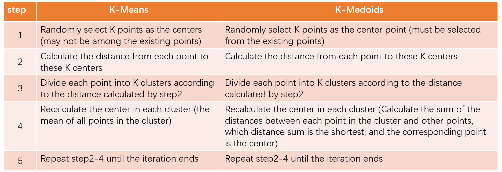
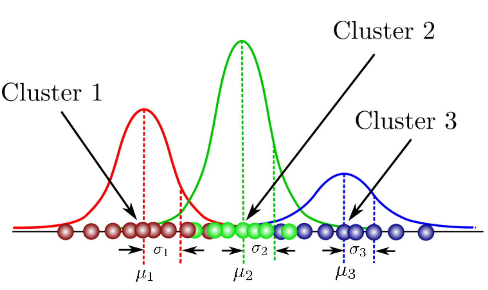
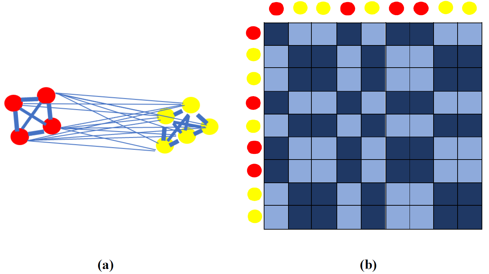
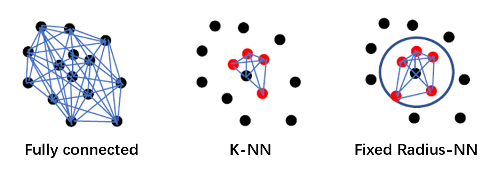
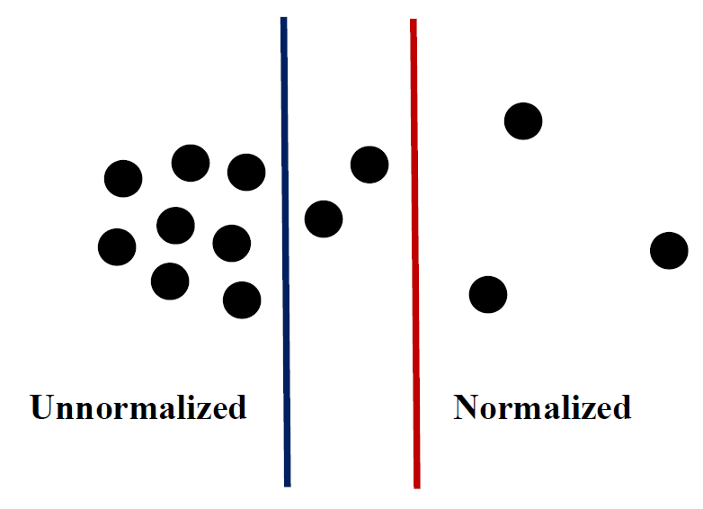
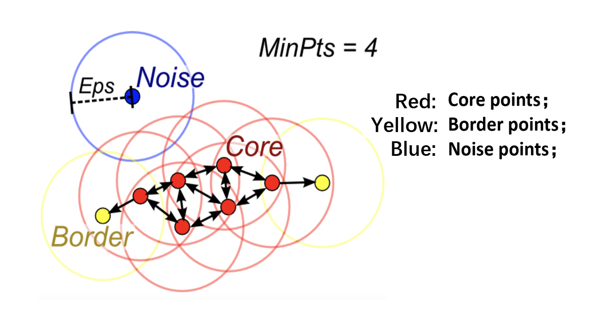

[TOC]

## Chapter5   Clustering

From this chapter, we will supplement the point cloud related algorithms. This chapter mainly introduces the clustering algorithm: clustering, as the name suggests, is to gather points with similar properties together and group them into one category. Through clustering, we can classify the original point cloud according to specific rules.

This chapter mainly introduces the following clustering methods:

​                                      **K-Means, GMM, Spectral Clustering, Mean shift & DBSCAN**

### 5-1 ：K-Means

K-Means is our most commonly used clustering algorithm based on Euclidean distance. The similarity between points is measured by Euclidean distance. The smaller the distance, the greater the similarity.

##### Definition

Given data {$x_1, ...,x_N$}, $x_N \in R^D$, find $\mu_k$ ($k = 1,..., K$) and $(r_n)_k \in $ {0, 1}, making $J$ the smallest:                                 
$$
J = \sum_{n=1}^N\sum_{k=1}^K {r_n}_k || x_n - \mu_k||^2
$$
$\mu_k$ ($k = 1,..., K$) are K center points, and ${r_n}_k \in $ {0, 1} indicates whether the nth point belongs to the cluster where the kth center point is located, if it exists, it is 1, otherwise it is 0.

##### Steps

**step1**: K points are randomly selected as K centers (not necessarily existing points. K is artificially given). That is, we will classify all points into K clusters. The blue cross and red cross in Fig.5.1.1(a) are the two centers we randomly selected, which means that we will group the green points into two categories next;

**step2**: For each point, find which center point it is closest to, and classify it as the cluster where the center point is located. As shown in Fig.5.1.1(b), according to each point's distance from the center point selected in step1, the green point is divided into two parts: blue and red. This is the preliminary division of 2 clusters;

**step3**: Recalculate the center of each cluster divided to replace the randomly selected center in step1. The blue cross and red cross in Fig.5.1.1(c) are the center points that we recalculate based on the cluster obtained in step2;

**step4**: The loop iterates step2 and step3 (as shown in Fig.5.1.1(d)-(h) are the above operations in the iterative loop) until the termination condition is reached (Fig.5.1.1(i)). The termination conditions generally have three situations:

① The center points of the two calculations are the same, or the change range is less than a certain threshold;

② The cluster to which each point belongs will no longer change;

③ The center point oscillates, and the former and later center points have been jumping between several values (this situation is infrequent).

*Fig.5.1.1:   K-Means[^1]*

##### K-Medoids

Although K-Means is widely used in dealing with clustering problems, it is very sensitive to outliers, so we introduce the next clustering method-K-Medoids. This method is relatively robust to outlier:

Here we introduce K-Medoids by comparing steps, as shown in the following table:

*Table.5.1.1:   Comparison between K-Means and K-Medoids*

The center point selected by K-Means is not necessarily existing, and the center point selected by K-Medoids must be an existing point. Step3 reflects that K-Means will calculate the mean value of all points in the cluster when calculating the center point. Therefore, the outlier will affect K-Means, while K-Medoids calculates which point is the closest to other points. In this way, for the outlier, the sum of the distances from other points in the cluster must be large, so it will not be selected as the center point, and it will avoid being affected by the outlier, as shown in Fig.5.1.2:

*Fig.5.1.2:   K-Means and K-Medoids*

As shown in Fig.5.1.2: The left one is K-Means, and the right one is K-Medoids. The blue points are outliers. Red points are centers. Black points are sample points in the cluster. It can be seen that the red point in K-Means is biased to the left and is more affected by the outlier, while the red point in K-Medoids is in the middle of most black points, so K-Medoids is less affected by the outlier.

##### The advantages and disadvantages of K-Means and K-Medoids

- K-Medoids takes a longer time to run, especially when the amount of data is large. K-Medoids is not as efficient as K-Means, because it calculates the sum of the distances between each point in the cluster and the other points, while K-Means only need to calculate the average value of all points in the cluster;

- K-Means is greatly affected by outliers, which will make the center point judgment inaccurate, but when the sample size is large, the outlier will not affect the center point very much, so K-Means is usually used more.

### 5-2 ：GMM

##### Definition

Gaussian Mixture Model (GMM) is the second clustering algorithm we will introduce in this Chapter. Unlike the previously introduced K-Means that uses a center point to cluster through Euclidean distance iteration, GMM uses a Gaussian model $N(μ,σ)$ to cluster, which reflects the probability that each point belongs to a certain class.

The formula for Gaussian distribution is expressed as follows, where D is the dimension:
$$
 N(x|μ，Σ) = \frac{1}{(2Π)^{D/2}} \frac{1}{(Σ)^{1/2}} exp{-\frac{1}{2}(x-μ)^TΣ^{-1}(x-μ)}
$$
GMM is shown in Fig.5.2.1, where the curves of different colors represent different Gaussian models (parameters $μ, σ$ are different), that is, different clusters: red represents Cluster1, green represents Cluster2, and blue represents Cluster3 :

*Fig.5.2.1:   GMM[^2]*

Generally, GMM is linearly combined with multiple Gaussian models, as shown below:
$$
 p(x) = \sum_{k=1}^{K}{\pi_kN(x|μ_k,Σ_k)}
$$
Among them, $\pi_k$ is the weight of each Gaussian model, and K is the number of clusters, which is artificially given. Therefore, a GMM parameter is {$\pi_k,μ_k,Σ_k$}, knowing these three parameters can determine a GMM and generate points that conform to the model.                                                              

##### Steps

The following figure shows the process of GMM:

*Fig.5.2.2:   The process of GMM[^3]*

**step1**: Initialize the GMM parameters {$\pi_k,μ_k,Σ_k$}. In the figure, the two circles in a represent the two initialized clusters, because the variances in all directions of the circles are the same;

**step2**: Predict which cluster each point belongs to, as shown in b in Fig.5.2.2, we can see that there is a transition color between red and blue, which is different from the K-Means introduced earlier (the color is distinct, there is no transition color). Because the color here represents the probability that each point belongs to a certain cluster, so it is not absolute red or blue;

**step3**: Recalculate the GMM parameters {$\pi_k,μ_k,Σ_k$}, at this time, the circle becomes an ellipse;

**step4**: Repeat step 2 and step 3, those are d, e, f in Fig.5.2.2, until the final cluster result is obtained (L is the number of iterations).

##### GMM features (just understand):

The advantages:

- We can know the probability that each point belongs to a certain cluster;
- As the probability is known, it is more stable to noises;

The disadvantages:

- Need to provide K (the number of clusters) based on experience;

- Some Gaussian models may collapse (the Gaussian model only fits one point and the variance is zero), which can be avoided by specific settings in actual engineering operations;

  

### 5-3：Spectral Clustering

##### Definition

Spectral Clustering is the third clustering algorithm we will introduce in Chapter 5. Different from K-Means and GMM, Spectral Clustering is not based on Euclidean space, while it cares about the connection between points. As shown in Fig.5.3.1, K-Means and GMM can not divide two circles well since they are both based on Euclidean distance, while Spectral Clustering is NOT. If we look at the Euclidean distance, the yellow point is close to the red point. Therefore, both K-Means and GMM classify red and yellow as a cluster. The red and black are connected to a circle, so Spectral Clustering classifies red and black into one category: the connectivity of points.

*Fig.5.3.1:   Comparison among K-Means, GMM, and Spectral Clustering[^4]*

Spectral Clustering uses the concept of undirected graph: Each point in the undirected graph is connected. The closer the distance between the two points, the greater the weight (the thicker the connection), as shown in Fig.5.3.2(a). Fig.5.3.2(b) is a similarity graph, the darker color indicates greater similarity, and the lighter color indicates less similarity:

*Fig.5.3.2:   Spectral Clustering*

##### Matrix in Spectral Clustering

- Establish a similarity matrix $W$ according to the similarity, $w_{ij}$ represents the similarity between $i$ and $j$, here set $w_{ii} = 0$.

- Calculate the Degree Matrix $D$ according to the similarity matrix $W$: It is a diagonal matrix, and the value $d_{ii}$ on the diagonal is the sum of all weights in the $i$ row of $W$.

- Calculate the Laplacian matrix $L$ (unnormalized) according to the similarity matrix $W$ and Degree Matrix $D$: $L = D-W$

- Normalized Laplacian matrix (there are two types):

  $L_{sym} = D^{-\frac{1}{2}}LD^{-\frac{1}{2}} = I - D^{-\frac{1}{2}}WD^{-\frac{1}{2}}$

  $L_{rw} = D^{-1}L = I - D^{-1}W$

The normalization mentioned therein has two goals:

​       ① Convert data to decimals within (0,1)

​       ② Convert dimension representation to dimensionless representation

There are generally three ways to connect between points, as shown in Fig.5.3.3:

- Fully connected, all points are connected;

- Connect between neighbors according to K-NN;

- Connect between neighbors according to Fixed Radius-NN;

  

  *Fig.5.3.3:   Connection*

##### Unnormalized Spectral Clustering

**step1**: Connect the points and build a similarity matrix $W$;

**step2**: Calculate Laplacian matrix $L$;

**step3**: Calculate the $k$ smallest eigenvectors of the Laplacian matrix $L$ ($k$ is the final number of clusters), denoted as $v_1,v_2,...,v_k$;

**step4**: $v_1,v_2,...,v_k$ as the $k$ columns of the matrix, the matrix is $n$ rows and $k$ columns, the $i$th row is recorded as $y_i$, and execute K-Means for $y_i$, if $y_i$ belongs to a certain cluster, the corresponding $x_i$ also belongs to that cluster.

##### Normalized Spectral Clustering (use $L_{rw}$)

**step1**: Connect the points and build a similarity matrix $W$;

**step2**: Calculate Laplacian matrix $L$;

**step3**: Calculate the $k$ smallest eigenvectors of the Laplacian matrix $L_{rw}$ ($k$ is the final number of clusters), denoted as $v_1,v_2,...,v_k$;

**step4**: $v_1,v_2,...,v_k$ as the $k$ columns of the matrix, the matrix is $n$ rows and $k$ columns, the $i$th row is recorded as $y_i$, and execute K-Means for $y_i$, if $y_i$ belongs to a certain cluster, the corresponding $x_i$ also belongs to that cluster.

##### The difference between normalized and unnormalized Spectral Clustering

The unnormalized Spectral Clustering focuses on the closeness of the number of points in each cluster. The normalized Spectral Clustering focuses on the closeness of each cluster's density, as shown in Fig.5.3.4.

The dark segment on the left is Unnormalized. The red segment on the right is Normalized because the number of two clusters divided by the dark segment is the same. Under the red segmentation, the density balance between the points on the right cluster itself is minimal. The density balance between the points on the left cluster is enormous.

*Fig.5.3.4:   normalized and unnormalized*

##### Spectral Clustering features

Advantages: There are no assumptions about the shape of the cluster, operations can be performed on data of any dimension, and the number of clusters $k$ is automatically discovered, without manual designation;

Disadvantages: The complexity is too high, which is $O(n^3)$, and $n$ is the number of data points.

### 5-4：Mean shift & DBSCAN

##### Mean shift

Mean shift is the fourth clustering algorithm we will introduce in Chapter 5. According to the name, we can roughly understand that this method's idea is a process of center movement. This algorithm does not need to set the number of clusters, only the position, and radius of a circle, as shown in Fig.5.4.1:

*Fig.5.4.1:   Mean shift[^5]*

##### Mean shift Steps

**step1**: Randomly select a circle and radius $R$ (for the radius, multiple experiments are required to select the most suitable value, where the most suitable is the most reasonable case of the final clustering result);

**step2**: For the points included in the initialized circle, calculate the average value of the coordinates to obtain a new center point;

**step3**: Repeat step 2 until it stops moving;

**step4**: Repeat steps 1-3 to remove the coincident circles (for the coincident circles, keep more points), get all the final circles (each circle corresponds to a cluster);

**step5**: For each point in the data, calculate the distance to the center of all circles in the result, and determine the closest circle as the cluster to which the point belongs (essentially Nearest Neighbor Search).

##### Mean shift features

Advantages:

- Automatically get the total number of clusters;
- The adjustable parameters are simple: the position and radius of the circle;
- Stable to outlier;

Disadvantages:

- It may be restricted to a certain local optimal solution, which can be avoided as much as possible by initializing many circles;
- It is not easy to process high-dimensional spatial data, but it is still suitable for 3-dimensional point cloud;

##### Density-Based Spatial Clustering of Applications with Noise (DBSCAN)

Compared with Mean shift, DBSCAN is more convenient and simple, similar to the flooding algorithm, as shown in Fig.5.4.2:

*Fig.5.4.2:   DBSCAN[^6]*

##### DBSCAN steps

**step1**: Mark all data as unprocessed, set the radius r and the minimum number of points in the cluster number_min;

**step2**: Randomly select data point p, calculate the number n of points in the circle with p as the center and r as the radius, and compare with number_min:

- If n > = number_min, then p is the core point, create cluster C, skip to step3, mark p has been processed;
- If n < number_min, then p is a noise, mark it as processed;

**step3**: Mark all the points in the circle with p as the center and r as the radius as points in cluster C. For the points in this cluster, calculate whether the number in the circle with each point as the center and r as the radius meets the conditions of the core point is met. If meets, step3 is executed again until all points are marked as processed;

**step4**: Remove the data in cluster C, go back to step1, and continue to execute the above operations until all points are processed.

Steps (1)-(8) in Fig.5.4.2 refer to steps1-3 in the above specific steps.

##### Core point & Border point & Noise

As shown in Fig.5.4.3: MinPts is number_min, and Eps is the radius r. Since the number of blue points in circle is less than 4, it will be marked as Noise. Randomly select one of the other points. If it meets the Core point rule, it will be marked in red, and cluster C will be created. The Border point is originally marked in cluster C, but the number of points in the circle where it is located is less than MinPts and has been marked as being in the cluster, so it is called Border point:

*Fig.5.4.3:   Core point & Border point & Noise[^7]*

##### DBSCAN features

Advantages:

- No requirement on the shape of the data category;
- Automatically determine the number of clusters;
- Stable to noise, it has Noise recognition;

Disadvantages:

- As long as there is a connection between points, they will be connected by DBSCAN;
- Mainly used in Euclidean space;
- The effect of high-dimensional space processing is not good, but because the point cloud is a 3-dimensional space, the effect of the DBSCAN method applied to the point cloud is not bad.

> The above is the introduction to the point cloud clustering algorithm in Chapter5.

### Reference

[^1]: Pattern Recognition and Machine Learning, Bishop Dataset: re-scaled Old Faithful dataset
[^2]: https://towardsdatascience.com/gaussian-mixture-models-explained-6986aaf5a95
[^3]: https://images.app.goo.gl/tKhJStPegWSxtwpw5
[^4]: https://www.thelearningmachine.ai/clustering
[^5]: https://images.app.goo.gl/87K2sBZoPHo8BgPR9
[^6]: http://www.francescogrigoli.it/tutorial/how-dbscan-clustering-algorithm-works-an-easy-guide-thorugh-sketches.html
[^7]: https://medium.com/@elutins/dbscan-what-is-it-when-to-use-it-how-to-use-it-8bd506293818