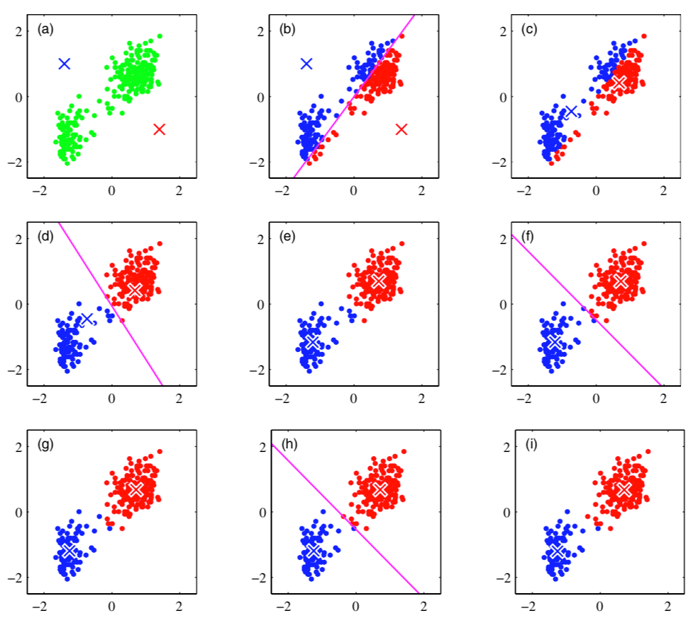
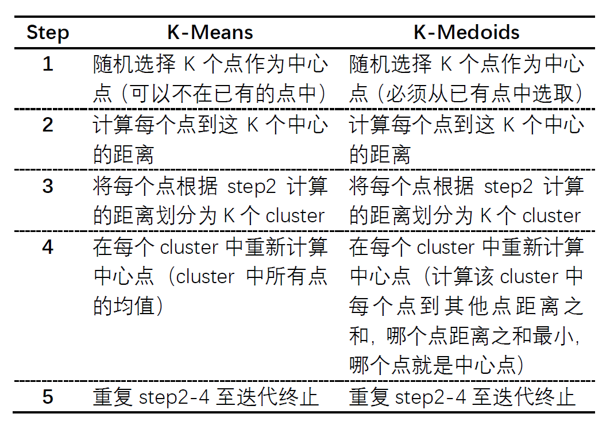
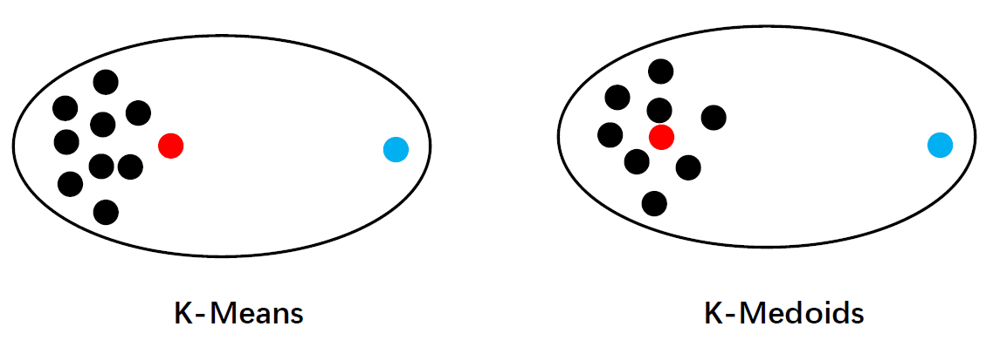
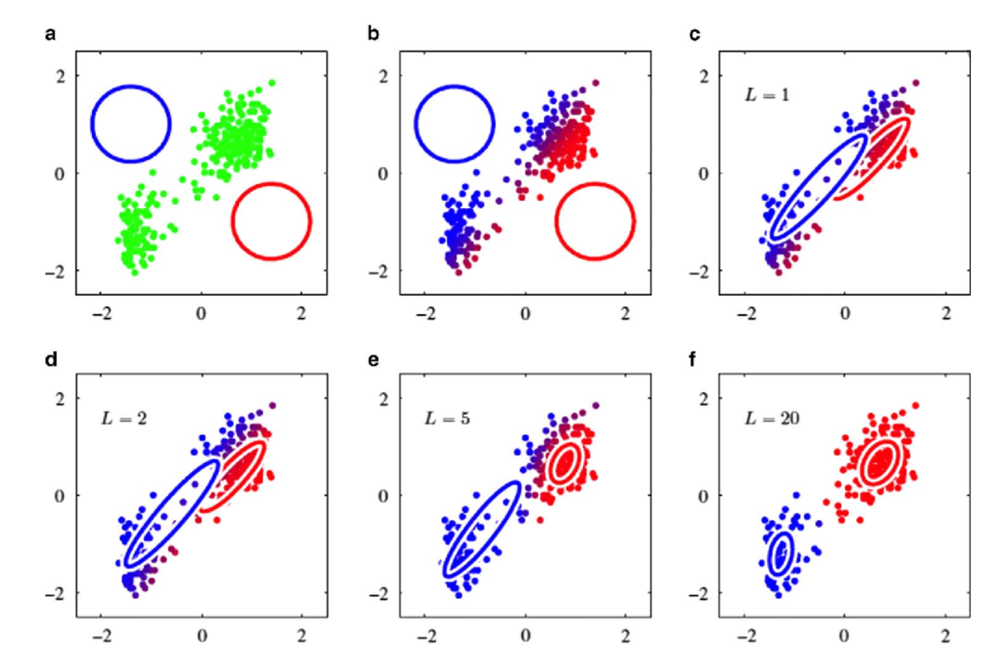
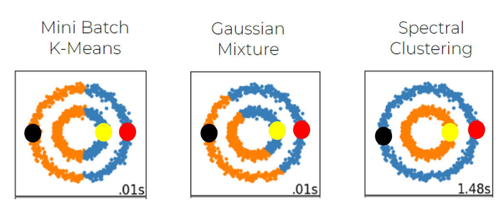
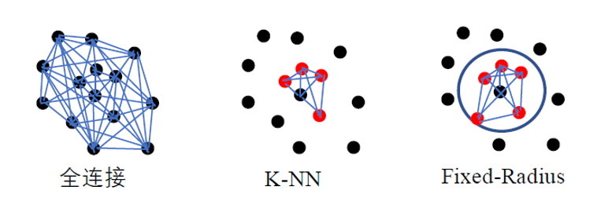
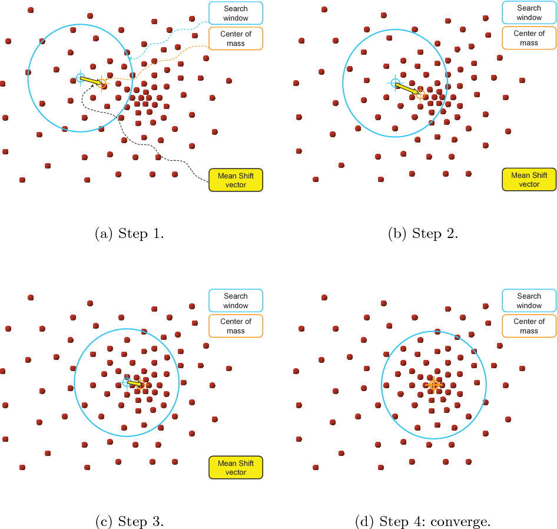
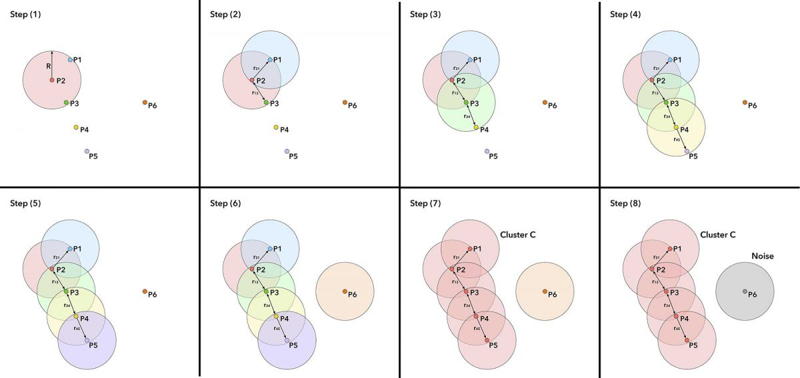
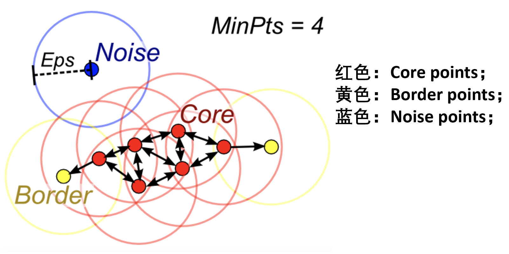

[TOC]

## 第五章   聚类 (Clustering)

从本章开始，我们进行点云相关算法的补充。本章主要介绍聚类算法：聚类，顾名思义，就是将性质或特征相似的点聚集到一起，归为一类。通过聚类我们可以将原始点云数据按一定规律或特性进行分类。

本章主要介绍以下几种聚类方法：K-Means，GMM，Spectral Clustering，Mean shift & DBSCAN

### 5-1 ：K-Means：

首先介绍的聚类算法是 K-Means，它是我们最常用的基于欧氏距离的聚类算法，点与点之间的相似度用欧氏距离来衡量。距离越小，说明相似度越大。

#### 定义：

给定数据 {$x_1, ...,x_N$}, $x_N \in R^D$, 求 $\mu_k$ ($k = 1,..., K$) 和 ${r_n}_k \in $ {0, 1}，使得 $J$ 最小：                                   

$$
J = \sum_{n=1}^N\sum_{k=1}^K {r_n}_k || x_n - \mu_k||^2
$$
其中，$\mu_k$ ($k = 1,..., K$) 是 K 个中心点，${r_n}_k \in $ {0, 1} 表示第 n 个点是否属于第 k 个中心点所在的 cluster，如果存在则为 1，否则为 0。

#### 具体步骤：

step1：随机选定 K 个点为 K 个中心（不一定是已有的点，K 是人为给定的），即我们将要将所有的点归为 K 个 clusters。如图 5-1-1(a) 中蓝叉和红叉，便是我们随机选中的 2 个中心点，意味着我们接下来会将绿点聚为 2 类；

step2：对于每个点，寻找其与哪个中心点最近，归为该中心点所在的 cluster。如图 5-1-1(b) 中根据每个点距离 step1 中选取的中心点距离的远近，将绿点划分为蓝红两部分，这是初步划分的 2 个 cluster；

step3：重新计算划分好的每个 cluster 的中心，代替 step1 中随机选出的中心。如图 5-1-1(c) 中蓝叉和红叉是我们根据 step2 中得到的 cluster 重新计算的中心点；

step4：循环迭代 step2 和 step 3（如图 5-1-1(d)-(h) 都是在迭代循环上述操作），直至到达终止条件（图 5-1-1(i)）。该终止条件一般有三种情况：

​             ① 前后两次计算的中心点一致或者变化幅度小于设定的某个阈值；

​             ② 每个点属于的 cluster 不再变化；

​             ③ 中心点发生震荡，前后中心点一直在几个值之间跳动（极少出现）。

​                                                                       图 5-1-1：K-Means 示意图[^1]

#### K-Medoids：

虽然 K-Means 在处理聚类问题中用的非常广泛，但是它对离群点（outlier）非常敏感，因此我们介绍接下来的一种聚类方法——K-Medoids（K-中心点法），该方法对 outlier 相对鲁棒：

这里我们采取对比 step 的方式引入 K-Medoids，如下表所示：

​                                                          表 5-1-1：K-Means 与 K-Medoids 对比表

K-Means 选取的中心点不一定是已有点，而 K-Medoids 选取的中心点一定在已有点中。其中，step3 体现 K-Means 在计算中心点时会将 cluster 中的所有点进行均值的计算，因此说 K-Means 会受到 outlier 的影响，而 K-Medoids 则是计算哪个点与其他点的距离之和最近。这样，对于 outlier，它距离 cluster 中其他点的距离之和肯定很大，因此不会被选为中心点，也就避免受到 outlier 的影响，如图 5-1-2 所示：

​                                                 图 5-1-2：K-Means 与 K-Medoids 对比示意图

左侧是 K-Means 的 cluster 示意图，右侧是 K-Medoids 的 cluster 示意图，蓝色为 outlier，红色为我们选中的中心点，黑色为 cluster 中的样本点。可以看到 K-Means 中红点偏向左侧，受 outlier 影响较大，而 K-Medoids 中红点在大部分黑点中间，因此 K-Medoids 受 outlier 影响较小。

#### K-Means 与 K-Medoids 的优缺点：

- K-Medoids 运行时间较长，特别是当数据量很大时，K-Medoids 效率不如 K-Means 高，因为它要计算 cluster 种每个点到其他个点之间的距离和；而 K-Means 只需要计算 cluster 中所有点的平均值即可；
- K-Means 受 outlier 影响较大，会使得中心点判断不够准确；但样本量很大时，outlier 对中心点的影响不会非常大，因此通常还是用 K-Means 较多。

### 5-2 ：GMM：

#### 定义：

GMM（Gaussian Mixture Model）即高斯混合模型，是我们本章介绍的第二种聚类方法。与之前介绍的 K-Means 用一个中心点，通过欧式距离迭代来聚类不同，GMM 是用一个高斯模型 $N(μ，σ)$来聚类，它体现了每个点属于某个类的概率（probability）。

高斯分布的公式表示如下，其中 D 是维度：

$$
 N(x|μ，Σ) = \frac{1}{(2Π)^{D/2}} \frac{1}{(Σ)^{1/2}} exp{-\frac{1}{2}(x-μ)^TΣ^{-1}(x-μ)}
$$
GMM 如图 5-2-1 所示，其中不同颜色的曲线代表不同的高斯模型（参数 $μ，σ$ 不同），也即代表不同的 cluster：红色代表 Cluster1，绿色代表 Cluster2，蓝色代表 Cluster3：

​                                                                        图 5-2-1：GMM 示例图[^2]

通常，GMM 由多个高斯模型线性组合在一起，如下所示：

$$
 p(x) = \sum_{k=1}^{K}{\pi_kN(x|μ_k,Σ_k)}
$$
其中，$\pi_k$ 是每个高斯模型的权重，K 是 cluster 个数，它是人为给定的。因此一个 GMM 参数为 {$\pi_k,μ_k,Σ_k$}，知道了这三个参数就可以确定一个 GMM ，也可以由此生成符合该模型的点。

#### 算法流程：

下面通过图像来展示 GMM 的过程：

​                                                                         图 5-2-2：GMM 过程图[^3]

step1：初始化 GMM 参数  {$\pi_k,μ_k,Σ_k$}，图中用 a 中两个圆代表两个初始化的 clusters，因为圆形各个方向方差一致；

step2：预测每个点属于哪个 cluster，如图 5-2-2 中的 b，可以看到红色跟蓝色中间还有过渡色，这一点与之前介绍的 K-Means 不同（颜色分明，没有过渡色），因为这里的颜色代表的是每个点属于某个 cluster 的概率，所以不是绝对的红色或蓝色；

step3：重新计算 GMM 参数  {$\pi_k,μ_k,Σ_k$}，此时圆形变成了椭圆形；

step4：重复 step2 和 step3，即图 5-2-2 中 d，e，f，直到得到最后 cluster 结果（L 是迭代次数）。

#### GMM 特点（了解即可）：

优点：

- 可以得知每个点属于某个 cluster 的概率；
- 由于概率可知，对噪声点更加稳定；

缺点：

- 需要人为根据经验提供 K（cluster 的个数）；

- 有的高斯模型会出现塌陷（该高斯模型只拟合一个点，方差为零），在实际工程操作中可以通过特定设置进行避免；

### 5-3：Spectral Clustering：

#### 定义：

Spectral Clustering（谱聚类），是本章我们介绍的第三种聚类算法。与 K-Means 和 GMM 不同的是，Spectral Clustering 不是严格在欧式空间上进行聚类，它关心点与点之间的连接性。如图 5-3-1，K-Means 和 GMM 都不能很好地将两个圆圈分开，因为它们都基于欧氏距离，而 Spectral Clustering 更注重点的连接：如果是看欧氏距离，则与红色点距离近地是黄色点，因此 K-Means 和 GMM 都将红色和黄色归为一个 cluster，而红色与黑色是连接在一个圆上，因此 Spectral Clustering 将红色与黑色归为一类，也即点的连接性。

​                                                                  图 5-3-1：三种聚类方法比较[^4]

Spectral Clustering 利用了无向图的概念：无向图中每个点进行连接，两个点之间的距离越近，权重越大（连线越粗），如图 5-3-2(a)。图 5-3-2(b) 是相似度图，颜色深表示相似度大，颜色浅的表示相似度小：

​                                                               图 5-3-2：Spectral Clustering 说明

#### Spectral Clustering 中用到的矩阵：

- 根据相似度建立相似度矩阵 $W$ ，$w_{ij}$ 代表 $i$ 与 $j$ 的相似度，这里设 $w_{ii} = 0$。

- 根据相似度矩阵 $W$ 计算 Degree Matrix $D$：它是一个对角矩阵，对角线上的值 $d_{ii}$ 是 $W$ 中第 $i$ 行所有权重之和。

- 根据相似度矩阵 $W$ 和 Degree Matrix $D$ 计算拉普拉斯矩阵 $L$（未归一化）： $L = D - W$

- 归一化的拉普拉斯矩阵 （有两种）：

  $L_{sym} = D^{-\frac{1}{2}}LD^{-\frac{1}{2}} = I - D^{-\frac{1}{2}}WD^{-\frac{1}{2}}$

  $L_{rw} = D^{-1}L = I - D^{-1}W$

其中所说的归一化有两个目标：

​       ① 将数据转化为 (0,1) 内的小数

​       ② 将有量纲表示转化为无量纲表示

一般通过三种方式进行点与点之间的连接，如图 5-3-3

- 全连接，所有的点之间进行连接；

- 根据 K-NN 进行近邻点之间的连接；

- 根据 Radius-NN 进行近邻点之间的连接。

  

  ​                                                                     图 5-3-3：点连接方式

#### 未归一化的 Spectral Clustering 步骤：

step1：连接点，建立相似度矩阵 $W$;

step2：计算拉普拉斯矩阵 $L$;

step3：计算拉普拉斯矩阵 $L$ 最小的 $k$ ( $k$ 即最终的 cluster 个数）个特征向量，记作 $v_1,v_2,...,v_k$;

step4：$v_1,v_2,...,v_k$ 作为矩阵的 $k$ 个列，该矩阵为 $n$ 行 $k$ 列，第 $i$ 行记为 $y_i$，对 $y_i$ 进行 K-Means，得到 $y_i$ 属于某一个 cluster，则对应的 $x_i$ 也属于那个 cluster。

#### 归一化的 Spectral Clustering 步骤 （用 $L_{rw}$）：

step1：连接点，建立相似度矩阵 $W$;

step2：计算拉普拉斯矩阵  $L_{rw}$;

step3：计算拉普拉斯矩阵 $L_{rw}$ 最小的 $k$ ( $k$ 即最终的 cluster 个数）个特征向量，记作 $v_1,v_2,...,v_k$;

step4：$v_1,v_2,...,v_k$ 作为矩阵的 $k$ 个列，该矩阵为 $n$ 行 $k$ 列，第 $i$ 行记为 $y_i$，对 $y_i$ 进行 K-Means，得到 $y_i$ 属于某一个 cluster，则对应的 $x_i$ 也属于那个 cluster。

#### 归一化与未归一化 Spectral Clustering 的区别：

未归一化的 Spectral Clustering 关注每个 cluster 中的点数基本接近，归一化的 Spectral Clustering  关注每个 cluster 的密度接近，如图 5-3-4 所示：

其中左侧深色分割为未归一化分割（Unnormalized），右侧红色分割是归一化分割（Normalized），因为深色分割划分的两个 cluster 个数基本均等，而红色分割下右侧 cluster 本身点与点之间的密度均衡，都很小；左侧 cluster 点与点之间的密度均衡，都很大。

​                                                         图 5-3-4：归一化与未归一化区别示意图

#### Spectral Clustering 特点：

优点：不会对 cluster 的形状有假设；可以对任何维度的数据进行操作；自动发掘 cluster 的个数 $k$，不需要人为指定；

缺点：复杂度过高，为 $O(n^3)$， $n$ 是数据点的个数。

### 5-4：Mean shift & DBSCAN：

#### Mean shift：

Mean shift 是本章介绍的第四种聚类方法。根据名称，可以大致了解该方法的思路是一个中心移动的过程。该算法不需要设置 cluster 个数，只需要设置一个圆的位置和半径即可，如图 5-4-1：

​                                                                  图 5-4-1：Mean shift 示意图[^5]

#### Mean shift 步骤：

step1：随机选择一个圆和半径 $R$ （对于半径，需要多次实验选定一个最合适的值，这里的最合适即最终聚类结果最合理的情况）;

step2：对于初始化的这个圆包括的点进行坐标平均值的计算，得到一个新的中心点；

step3：重复 step2 直到不再移动；

step4：重复 step1-3，将重合的圆去除（对于重合的圆，保留点数多的），得到最终所有的圆（每个圆对应一个 cluster）；

step5：对于数据中的每个点，计算与结果所有圆的圆心的距离，确定距离最近的圆作为该点所属的 cluster（实质是 Nearest Neighbor Search）。

#### Mean shift 特点：

优点：

- 自动得到 cluster 的总数；
- 可调节的参数简单，圆的位置和半径；
- 对 outlier 稳定；

缺点：

- 有可能被限制在某个局部最优解，可以通过初始化很多个圆来尽量避免；
- 不容易处理高维空间数据，但应用于三维点云数据还是合适的；

#### 基于密度的空间带噪聚类法   Density-Based Spatial Clustering of Applications with Noise（DBSCAN）

DBSCAN 相较于 Mean shift，更加方便简单，类似于漫水算法，如图 5-4-2：

​                                                                 图 5-4-2：DBSCAN 步骤示意图[^6]

#### DBSCAN 具体步骤：

step1：将所有数据标记为没有处理过，设置半径 r 和 cluster 里点的最小数目  number_min；

step2：随机选择数据点 p，计算以 p 为圆心，r 为半径的圆内点的个数 n，与 number_min 比较：

- 如果 n > = number_min，则 p 为 core point，创建 cluster C，跳至 step3，标记 p 已被处理；
- 如果 n < number_min，则 p 是一个噪声点，标记为已处理；

step3：将以 p 为中心，r 为半径的圆内的所有点标记为 cluster C 中的点，对于该 cluster 中的点，计算以每个点为圆心，r 为半径的圆内的个数是否符合 core point 的条件，如果符合，再次执行 step3，直到所有点被标记为已处理；

step4：将 cluster C 中的数据剔除，回到 step1，继续执行上述操作，直至所有的点都被处理。

图 5-4-2 中的 step（1）-（8）即上述具体步骤中的 step1-3。

#### Core point & Border point & Noise：

如图 5-4-3：MinPts 即 number_min，Eps 即半径 r，蓝色点所在的圆内的点数小于 4，所以判定为 Noise。在除此之外的其他点中随机选择一个，如果满足 Core point 规则则标记为红色，创建 cluster C。Border point 是原本标记在 cluster C 中的，但自身所在的圆内的点数小于 MinPts 且已被标记为在 cluster 中，因此称为 Border point：

​                                           图 5-4-3：Core point & Border point & Noise 点示意图[^7]

#### DBSCAN 特点：

优点：

- 对数据类别的形状无要求；
- 自动确定 cluster 个数；
- 对噪声稳定，本身有 Noise 的识别；

缺点：

- 只要点与点之间有连接，就会被 DBSCAN 连接在一起；
- 主要在欧式空间中进行；
- 对高维空间处理效果不好，但由于点云是三维空间，所以 DBSCAN方法应用在点云中效果还可以。

> 以上是第五章关于点云聚类的算法介绍。
>
> 主要参考自深蓝学院三位点云课程 https://www.shenlanxueyuan.com/course/262

### 参考文献

[^1]: Pattern Recognition and Machine Learning, Bishop Dataset: re-scaled Old Faithful dataset
[^2]: https://towardsdatascience.com/gaussian-mixture-models-explained-6986aaf5a95
[^3]: https://images.app.goo.gl/tKhJStPegWSxtwpw5
[^4]: https://www.thelearningmachine.ai/clustering
[^5]: https://images.app.goo.gl/87K2sBZoPHo8BgPR9
[^6]: http://www.francescogrigoli.it/tutorial/how-dbscan-clustering-algorithm-works-an-easy-guide-thorugh-sketches.html
[^7]:https://medium.com/@elutins/dbscan-what-is-it-when-to-use-it-how-to-use-it-8bd506293818