[TOC]


## Chapter6   Deep Learning in point cloud

This chapter aims to introduce readers to some basic knowledge of deep learning and its application in the point cloud and does not elaborate on mathematics and algorithms. Readers need to supplement the necessary mathematical knowledge and primary machine learning knowledge in advance, such as Deep Learning 500 Questions: https://github.com/scutan90/DeepLearning-500-questions, *Mathematics of Deep Learning*, etc.

Deep Learning (DL), we may be familiar with this term. In recent years, the rise of artificial intelligence (AI) has led to a series of developments such as machine learning (ML) and deep learning. The relationship between the three is shown in Fig.6.1:


*Fig.6.1:   AI & ML & DL[^1]*

As shown in Fig.6.1, the scope of artificial intelligence is the most extensive. Machine learning is a subset of artificial intelligence, and deep learning is a subset of machine learning.

We use an example to understand the origin and significance of deep learning. Three puppies with different shapes are shown in the figure below:


*Fig.6.2:   Three puppies*

Seeing the three pictures above, we will soon conclude that these are three puppies. This is natural, but it is not so easy for computers to perform such identification. This recognition is called pattern recognition. We are performing pattern recognition every day: for example, "that is a chair", "that is a table", "that is a TV" and so on.

For Fig.6.2, recognition of these three puppies, the computer's general idea for pattern recognition is to teach the computer the "features of dogs". However, dogs' characteristics are too many — the variety of types and different shooting angles will affect the computer's recognition. Later, Neural Network (NN) was born. Unlike the previous pattern recognition idea, the neural network allows the computer to observe many pictures by itself and then learn these features by itself. Deep learning is artificial intelligence implemented with neural networks[^2]. The self-study we mentioned here mainly involves some mathematical knowledge. This chapter will not explain it in detail.

First, we review the basics of deep learning and then briefly introduce several neural networks related to point cloud processing.


### 6-1：Introduction

To understand deep learning, we must first have a general understanding of the neural network. Among them, the neuron is the basic unit of the neural network.

##### Neuron

The concept of neural network is imitating the nervous system in biology. In biology, a neural network is composed of many neurons (nerve cells) and synapses. Fig.6.1.1 is a schematic diagram of the neuron structure:

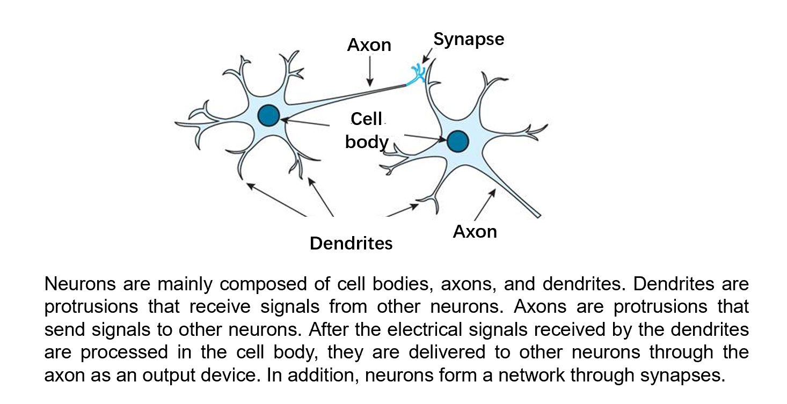

*Fig.6.1.1:   Neuron structure[^2]*

Fig.6.1.2 is a schematic diagram of the information transmission mechanism between neurons:

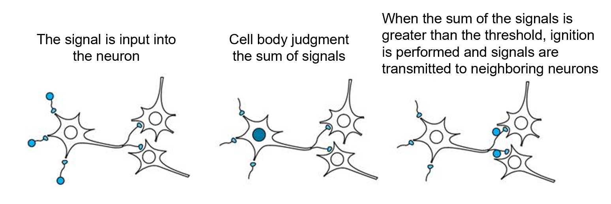

*Fig.6.1.2:   The information transmission mechanism between neurons[^2]*

Among them, the transmission of signals between neurons is conditional. Fig.6.1.2 "Cell Body Judgment the sum of signals" in the middle, when the sum is greater than a certain threshold, ignition is performed, and the signal is transmitted. However, if the sum is less than this threshold, the signal will not be transmitted. The "sum of signals" here is not necessarily a simple sum but a weighted sum. For the brain, the information transmitted by neurons in different parts of the brain has different effects on the nervous system's feedback. As shown in Fig.6.1.3, compare the size of $w_1x_1 + w_2x_2 + w_3x_3$ and $\theta$, and output a different $y$:

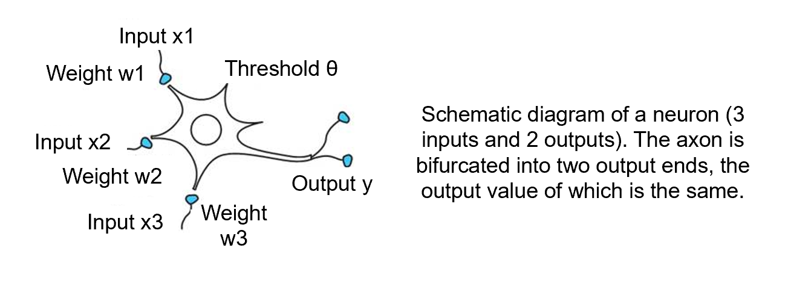

*Fig.6.1.3:   Weighted sum[^2]*

In biology, the output y has only two values: 0 or 1. The output range is fixed. 1 means signal output; 0 means no signal output.
$$
y = 0 : w_1x_1 + w_2x_2 + w_3x_3 - \theta < 0     
$$

$$
y = 1 : w_1x_1 + w_2x_2 + w_3x_3 - \theta >= 0
$$

The above two situations can be summarized as:

$$
y=u(w_1x_1 + w_2x_2 + w_3x_3 - \theta)
$$
The function $u(z)$ is:                      
$$
u(z)=0(z<0);     
$$

$$
u(z)=1(z>=0);
$$

Fig.6.1.4 is an abstract view of Fig.6.1.3:

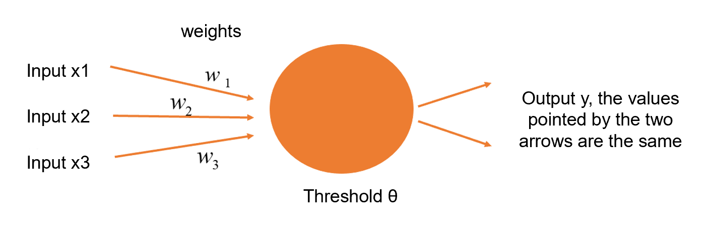

*Fig.6.1.4:   Abstraction weight summation[^2]*

The abstracted neurons are the components of the neural network in deep learning. Unlike neurons in biology, the output signal of artificial neurons is not necessarily 0 or 1 but can be other values. The reason why y has a value of 0 or 1 in the previous introduction is because there is a function $u(z)$. If we want to get more y values, we need to deal with this $u(z)$ function specially. This special processing function is called **activation function**, that is, $a(z)$ in the following formula:
$$
y=a(w_1x_1 + w_2x_2 + w_3x_3 - \theta)
$$
At this time, y can take any value that $a(z)$ can take. Regarding the activation function, this chapter will not expand it in detail. The main activation functions are Sigmoid function, tanh function, Relu function, etc.                      

Furthermore, in artificial neural networks, the threshold value $\theta$ is often converted into a bias $b$, because $\theta$ has a negative sign "-" in front of the formula, and the negative sign in mathematics can easily lead to calculations wrong and unsightly [^2], so the formula (6) is changed to:

$$
y=a(w_1x_1 + w_2x_2 + w_3x_3 + b)
$$
Fig.6.1.5 is the embodiment of formula (7):

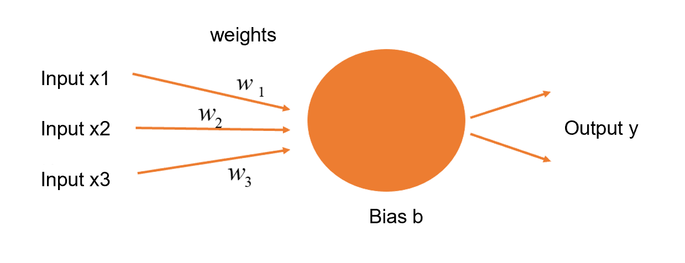

*Fig.6.1.5:   Change threshold to bias[^2]*

##### Neutral network

Above, we introduced the concept of neurons. A neural network is a network composed of many neurons. Here is an example of a hierarchical neural network:

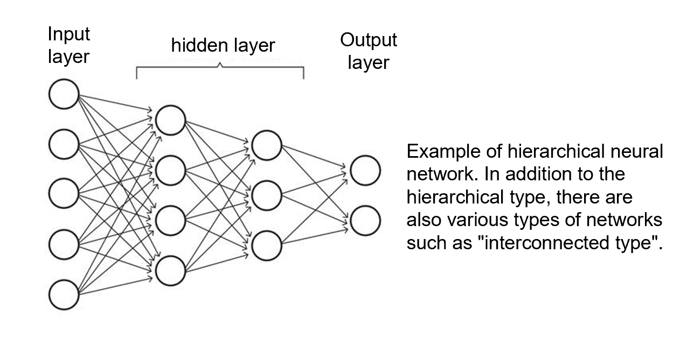

*Fig.6.1.6:   Hierarchical neural network[^2]*

The hierarchical neural network consists of three types of layers: input layer, hidden layer (also called middle layer), and output layer. Each layer performs its duties:

- The input layer mainly accepts some input data and directly inputs these data to the next layer without any changes;
- The hidden layer is the part that is processed, and the processing content of formula (7) is mainly carried out;
- The output layer is also processing formula (7) and outputting the final result.

##### Deep Learning

The so-called **deep** learning, this **deep** refers to the number of layers of neural networks. So deep learning is a neural network with superimposed layers. Fig.6.1.7 is an example of deep learning used to classify the left picture as a dog or cat:

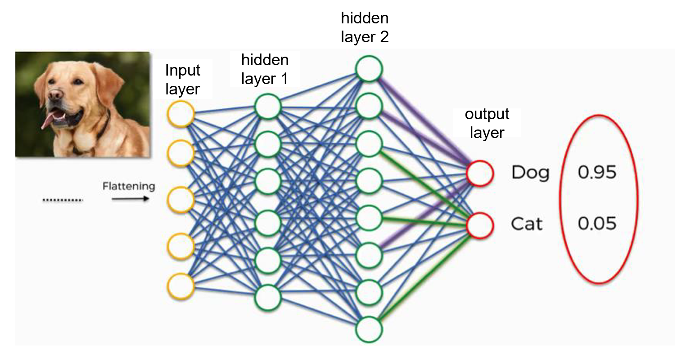

 *Fig.6.1.7:   Deep Learning[^3]*

As shown in Fig.6.1.7: In the middle neural network, the previous layer's neurons and the next layer's neurons are all connected. Such a neural network is called Fully Connected (FC), also called Multi Layer Perceptron (MLP), because the hidden layer has more than one layer (here are two layers).

##### Deep Learning in point cloud

At present, many types of research use the following two methods to process 3D point cloud:

- Process 3D point cloud directly;
- Project the 3D point cloud into 2D images with different angles, and process them according to the deep learning algorithm in the 2D scene;

------

Let us understand the development process of point cloud deep learning based on a review paper:

Article name: ***Deep Learning for 3D Point Clouds: A Survey***

Link: https://arxiv.org/pdf/1912.12033.pdf

The thesis involves three-dimensional shape classification, three-dimensional target detection, and three-dimensional point cloud segmentation.

Fig.6.1.8 is the development history of 3D classification:


*Fig.6.1.8:   Development history of 3D classification[^4]*

Fig.6.1.9 is the development history of 3D object detection:


*Fig.6.1.9:   Development history of 3D object detection[^4]*

Fig.6.1.10 and Fig.6.1.11 are the development history of 3D point cloud semantic segmentation and instance segmentation respectively:


*Fig.6.1.10:   Development history of 3D point cloud semantic segmentation[^4]*


*Fig.6.1.11:   Development history of 3D point cloud instance segmentation[^4]*

Through the development history chart extracted from the paper, we can roughly understand the development of deep learning in point cloud processing in recent years. We will introduce the deep learning algorithms in the follow-up.


### 6-2：PointNet

##### PointNet

PointNet is a neural network that specializes in processing point clouds. It is commonly used to process point cloud classification and segmentation, as shown in Fig.6.2.1:

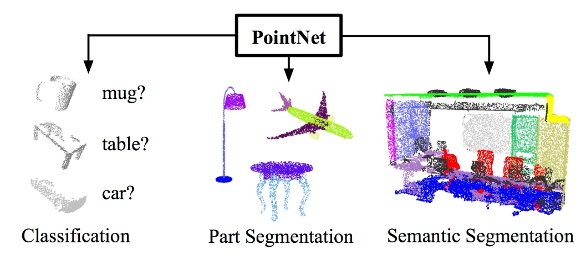

*Fig.6.2.1:   the application of PointNet[^5]*

PointNet was born because the point cloud itself has two characteristics:

1. Replacement invariance: the order of the points in the point cloud changes, and the nature of the original point cloud will not change;
2. Rotation invariance: When the point cloud is rotated, although the coordinates are changed, it represents the original point cloud object;

Based on the above two characteristics, the PointNet network came into being.

As shown in Fig.6.2.2:

- First, perform MLP twice on the input data to get the data of the n×1024 structure.
- Use max pool to convert n×1024 into 1×1024 because the two MLPs are done separately for each point, so the max pool must merge the point information.
- Use the maximum function to find each column's maximum value in the 1024 columns and record it as the final data, so 1024 data are obtained.


*Fig.6.2.2:   PointNet[^5]*

Among them, Max pool is to count the maximum value of each column. As shown in Fig.6.2.3, D corresponds to 1024 of the max pool in Fig.6.2.2 (n × **1024** → max pool → 1 × **1024**), but in the following example, D is 6, N is the total number of points in the point cloud, and each row is the information of one point. Record the maximum value of each column, which are 19, 18, 23, 17, 29, 42, respectively, and get the 6 data on the right side of the arrow in Fig.6.2.3:

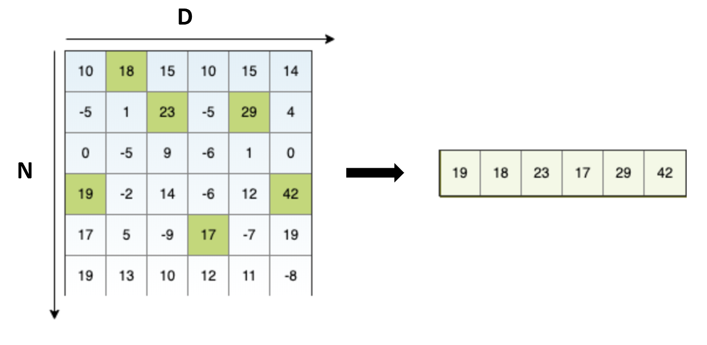

*Fig.6.2.3:   Max pool[^6]*

Max pool is the core idea of PointNet. Its result can represent the original point cloud, and it has no requirement for the order of point cloud data. The order of point cloud data changes and the result of Max pool will not change.

So, $PointNet  = shared MLP + Max pool$

##### Critical Points Set & Upper Bound Shape

Critical Points Set & Upper Bound Shape are two concepts in PointNet. As shown in Fig.6.2.4, Critical Points Set refers to the point where we have selected the maximum value in the Max pool, and the remaining points that are not selected are useless. They do not affect the global feature generated after the Max pool, so they are called Upper Bound Shape.


*Fig.6.2.4:   Critical Points Set & Upper Bound Shape[^6]*

Visualize the Critical Points Set & Upper Bound Shape, as shown in Fig.6.2.5, we can see that the Critical Points Set basically has some boundary points extracted:

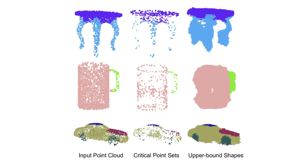

*Fig.6.2.5:   Critical Points Set & Upper Bound Shape visualization[^7]*


##### PointNet — Classification

The implementation here is dependent on win10 + CUDA 10.1+cuDNN 7.5 + python3.7.4 + tensorflow-gpu1.13:

PointNet code: https://github.com/charlesq34/pointnet

CUDA 10.1: https://developer.nvidia.com/cuda-toolkit-archive

cuDNN 7.5: https://developer.nvidia.com/rdp/cudnn-archive

tensorflow-gpu 1.13: https://github.com/fo40225/tensorflow-windows-wheel/tree/master/1.13.1/py37/GPU/cuda101cudnn75sse2

> NB: Strictly follow the version information. Otherwise, the code will run incorrectly.

Regarding the above installation, the detailed instructions are as follows:

###### CUDA 10.1

Click https://developer.nvidia.com/cuda-toolkit-archive:


*Fig.6.2.6:   Choose v 10.1*

After selecting the version information, download the installation package, as shown in Fig.6.2.7:


*Fig.6.2.7:   Download CUDA* 

Download , double click it, there will be Fig.6.2.8.

Fig.6.2.8 is for setting the temporary path. The path can be the default, or we can set it ourselves. There is no difference because the path will be automatically deleted after installation.

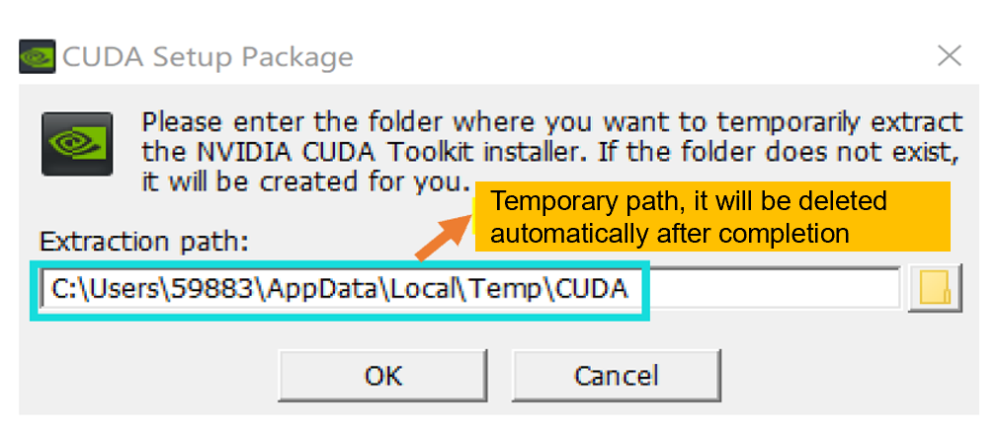

*Fig.6.2.8:   Temporary path*

Fig.6.2.9 shows the setup progress display. After completing this part, it will enter the installation part:

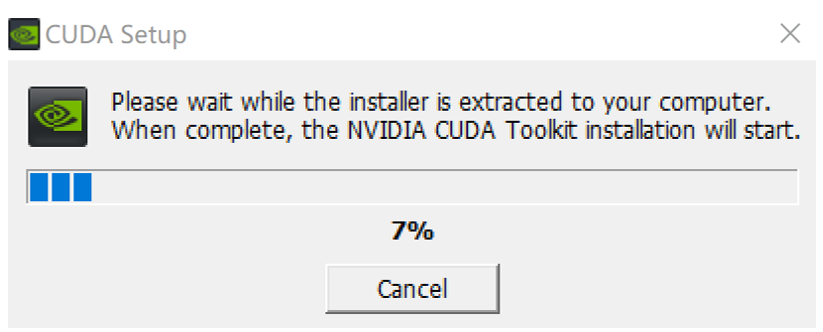

*Fig.6.2.9:   Setting progress*

Fig.6.2.10 is the installation part. Complete the system check, license agreement, options, installation, and end in sequence to complete the installation of CUDA 10.1.


*Fig.6.2.10:   Installation*

Select the "精简模式" in the option link. All components will be installed, as shown in Fig.6.2.11:


*Fig.6.2.11:   Choose "精简模式“*

Environment variables are automatically generated during the above installation process, so no special configuration is required. 

> NB: The computer needs to be restarted after installation.

###### cuDNN 7.5

Click https://developer.nvidia.com/rdp/cudnn-archive:


*Fig.6.2.12:   Choose v7.5.0, corresponding to CUDA v10.1*

Download and open:


Copy the bin, include, and lib folders in the compressed package to the path where CUDA was installed before (not the temporary path we set before. Generally, the path is "C:\Program Files\NVIDIA GPU Computing Toolkit\CUDA\v10.1"), as shown in Fig.6.2.13:

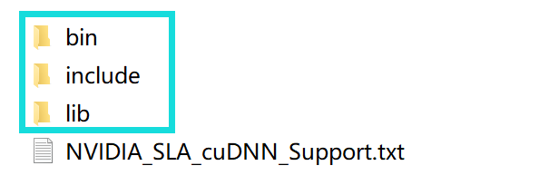

*Fig.6.2.13:   copy three folders*

WIN + R, open cmd, input `nvcc -V`, then press Enter to display the following interface, the installation is successful:

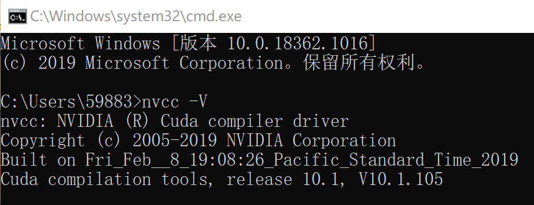

*Fig.6.2.14:   Successful installation*

###### tensorflow-gpu 1.13

Click https://github.com/fo40225/tensorflow-windows-wheel/tree/master/1.13.1/py37/GPU/cuda101cudnn75sse2, download tensorflow_gpu-1.13.1-cp37-cp37m-win_amd64.whl.

Find the environment variables of our computer's python (see in Chapter 4), as shown in the blue box in Fig.6.2.15:


*Fig.6.2.15:   python environment variables*

Copy the downloaded **tensorflow_gpu-1.13.1-cp37-cp37m-win_amd64.whl** to the path where the above python environment variables are located, then WIN + R to open cmd, enter `D:` and press Enter and then enter `cd MengjieXu\Software \anacondafile\Scripts` , press Enter, and then enter `pip install tensorflow_gpu-1.13.1-cp37-cp37m-win_amd64.whl` to install. After the interface shows that the installation is complete, enter `pip list` and press Enter to view all packages after successful installation.

Finally, verify that tensorflow is installed successfully:

Click WIN + R to open cmd, input python, and then test the following three statements:

```
# import tensorflow
import tensorflow as tf 

# gpu information
tf.test.gpu_device_name() 

# Test whether it can get gpu, return True
tf.test.is_gpu_available() 
```

We can get the following results:

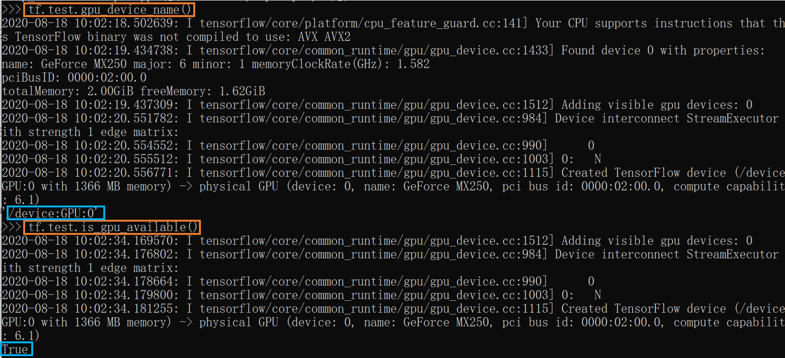

*Fig.6.2.16:   Test success*

###### Download data and run the code

Next, use the **modelnet40_ply_hdf5_2048** data set, the download path is https://shapenet.cs.stanford.edu/media/modelnet40_ply_hdf5_2048.zip, save it in pointnet-master/data/ under the PointNet code folder. Run **train.py** (in the PointNet code folder), the results are as follows:

```
**** EPOCH 000 ****
----0-----
2020-08-16 21:49:09.154348: I tensorflow/stream_executor/dso_loader.cc:152] successfully opened CUDA library cublas64_10.dll locally
mean loss: 4.107550
accuracy: 0.089844
----1-----
mean loss: 3.487081
accuracy: 0.113471
----2-----
mean loss: 3.341762
accuracy: 0.154297
----3-----
mean loss: 3.282955
accuracy: 0.146484
----4-----
mean loss: 3.197451
accuracy: 0.152344
----0-----
----1-----
eval mean loss: 5.180514
eval accuracy: 0.139789
eval avg class acc: 0.086250
Model saved in file: log\model.ckpt
... epoch1 - epoch 248 ommited here
**** EPOCH 249 ****
----0-----
mean loss: 0.485417
accuracy: 0.854004
----1-----
mean loss: 0.446717
accuracy: 0.861650
----2-----
mean loss: 0.509897
accuracy: 0.846191
----3-----
mean loss: 0.495065
accuracy: 0.847168
----4-----
mean loss: 0.502267
accuracy: 0.847168
----0-----
----1-----
eval mean loss: 5.743022
eval accuracy: 0.774311
eval avg class acc: 0.749837

Process finished with exit code 0
```

It can be seen that the accuracy of the operation has been continuously improved, indicating that the classification accuracy of PointNet is improving in continuous learning.

###### About code[^8]

First, introduce a few related concepts. These concepts are very common in deep learning code.

```
# Step: The number of steps to train the model
 
# Batch Size: The number of samples required to calculate the gradient. Too small will result in low efficiency and failure to converge. Too large will cause the memory to fail. When the Batch Size increases to a certain level, the drop direction changes very little, so the Batch Size is a very important parameter.
 
# Epoch (round): represents that all data in the sample set has undergone one training.
 
# Iteration: Iteration is the number of times the batch needs to complete an epoch.

Remember: in an epoch, the number of batches and the number of iterations are equal. For example, for a data set with 2000 training samples. Divide 2000 samples into batches of 500, so 4 iterations are required to complete an epoch
```

------

The following is a brief introduction to the functions related to Classification. Here we mainly refer to the explanation of https://www.cnblogs.com/gzr2018/p/12853555.html:

The input_transform_net function is the T-Net in Fig.6.2.2. Since the following explanation involves a lot of deep learning expertise (such as convolution, etc.), we are only a brief introduction, so I hope you can find and understand these notes by yourself

```python
def input_transform_net(point_cloud, is_training, bn_decay=None, K=3):
    """ Input (XYZ) Transform Net, input is BxNx3 gray image
        Return:
            Transformation matrix of size 3xK """
    # In the comment above, K represents the dimension of the data, and the input is a point cloud, so here is 3
    batch_size = point_cloud.get_shape()[0].value
    num_point = point_cloud.get_shape()[1].value

    input_image = tf.expand_dims(point_cloud, -1)  
    # Convert the point cloud data to a 4D tensor, -1 means adding one dimension at the end, such as shape[2,3]->shape[2,3,1]
    # Build T-Net model, 64--128--1024
    # The following tf_util.conv2d convolves the data, using the template convolution of [1,3], it becomes num_point*1*64. Generate 64 channels
    net = tf_util.conv2d(input_image, 64, [1,3],
                         padding='VALID', stride=[1,1],
                         bn=True, is_training=is_training,
                         scope='tconv1', bn_decay=bn_decay)
    # The size of each convolution kernel is [kernel_h, kernel_w,num_in_channels, num_output_channels]
    # Use the template convolution of [1,1]. Generate 128 channels
    net = tf_util.conv2d(net, 128, [1,1],
                         padding='VALID', stride=[1,1],
                         bn=True, is_training=is_training,
                         scope='tconv2', bn_decay=bn_decay)
    # Use the template convolution of [1,1]. Generate 1024 channels
    net = tf_util.conv2d(net, 1024, [1,1],
                         padding='VALID', stride=[1,1],
                         bn=True, is_training=is_training,
                         scope='tconv3', bn_decay=bn_decay)
    # Maximum pooling, template size [num_point,1], that is, only one feature is reserved for one channel of a group of points, achieving symmetry.
    net = tf_util.max_pool2d(net, [num_point,1],
                             padding='VALID', scope='tmaxpool')
    # Note that the above templates are all convolutions of a group of batches. The following sentence should be straightening the parameters. The previous size should be [batch_size, 1, 1024]
    net = tf.reshape(net, [batch_size, -1])
    # The size of net should be [bacth_size,1024], that is, only 1024 features are reserved for each group of points
    net = tf_util.fully_connected(net, 512, bn=True, is_training=is_training,
                                  scope='tfc1', bn_decay=bn_decay)
    net = tf_util.fully_connected(net, 256, bn=True, is_training=is_training,
                                  scope='tfc2', bn_decay=bn_decay)
    # Two fc (fully connected), and finally output 256-dimensional features
    # Generate point cloud rotation matrix T=3*3
    with tf.variable_scope('transform_XYZ') as sc:
        assert(K==3)
        # Create variables
        weights = tf.get_variable('weights', [256, 3*K],
                                  initializer=tf.constant_initializer(0.0),
                                  dtype=tf.float32)
        biases = tf.get_variable('biases', [3*K],
                                 initializer=tf.constant_initializer(0.0),
                                 dtype=tf.float32)

        biases += tf.constant([1,0,0,0,1,0,0,0,1], dtype=tf.float32)
        # [batch_size,256]*[256,3*k]->[bacth_size,3*k]
        transform = tf.matmul(net, weights)
        # Add bias
        transform = tf.nn.bias_add(transform, biases)

    transform = tf.reshape(transform, [batch_size, 3, K])
    return transform
```

------

The feature transform network structure is the same as the input transform. We can refer to the input transform to understand the feature transform —— feature_transform_net function.

```python
def feature_transform_net(inputs, is_training, bn_decay=None, K=64):
    """ Feature Transform Net, input is BxNx1xK
        Return:
            Transformation matrix of size KxK """
    batch_size = inputs.get_shape()[0].value
    num_point = inputs.get_shape()[1].value

    net = tf_util.conv2d(inputs, 64, [1,1],
                         padding='VALID', stride=[1,1],
                         bn=True, is_training=is_training,
                         scope='tconv1', bn_decay=bn_decay)
    net = tf_util.conv2d(net, 128, [1,1],
                         padding='VALID', stride=[1,1],
                         bn=True, is_training=is_training,
                         scope='tconv2', bn_decay=bn_decay)
    net = tf_util.conv2d(net, 1024, [1,1],
                         padding='VALID', stride=[1,1],
                         bn=True, is_training=is_training,
                         scope='tconv3', bn_decay=bn_decay)
    net = tf_util.max_pool2d(net, [num_point,1],
                             padding='VALID', scope='tmaxpool')

    net = tf.reshape(net, [batch_size, -1])
    net = tf_util.fully_connected(net, 512, bn=True, is_training=is_training,
                                  scope='tfc1', bn_decay=bn_decay)
    net = tf_util.fully_connected(net, 256, bn=True, is_training=is_training,
                                  scope='tfc2', bn_decay=bn_decay)

    with tf.variable_scope('transform_feat') as sc:
        weights = tf.get_variable('weights', [256, K*K],
                                  initializer=tf.constant_initializer(0.0),
                                  dtype=tf.float32)
        biases = tf.get_variable('biases', [K*K],
                                 initializer=tf.constant_initializer(0.0),
                                 dtype=tf.float32)
        biases += tf.constant(np.eye(K).flatten(), dtype=tf.float32)
        transform = tf.matmul(net, weights)
        transform = tf.nn.bias_add(transform, biases)

    transform = tf.reshape(transform, [batch_size, K, K])
    return transform
```

------

The following is the classification network model part, get_model function.

```python
def get_model(point_cloud, is_training, bn_decay=None):
    """ Classification PointNet, input is BxNx3, output Bx40 """
    batch_size = point_cloud.get_shape()[0].value
    num_point = point_cloud.get_shape()[1].value
    end_points = {}

    with tf.variable_scope('transform_net1') as sc:
        # Get input transform network
        transform = input_transform_net(point_cloud, is_training, bn_decay, K=3)
    # Matrix multiplication, transform to canonical space
    point_cloud_transformed = tf.matmul(point_cloud, transform)
    # Convert to 4D tensor
    input_image = tf.expand_dims(point_cloud_transformed, -1)
    # Convolution kernel [1,3], output channel 64
    net = tf_util.conv2d(input_image, 64, [1,3],
                         padding='VALID', stride=[1,1],
                         bn=True, is_training=is_training,
                         scope='conv1', bn_decay=bn_decay)
    # Convolution kernel [1,1], output channel 64
    net = tf_util.conv2d(net, 64, [1,1],
                         padding='VALID', stride=[1,1],
                         bn=True, is_training=is_training,
                         scope='conv2', bn_decay=bn_decay)
    # The second: feature change network
    with tf.variable_scope('transform_net2') as sc:
        transform = feature_transform_net(net, is_training, bn_decay, K=64)
    end_points['transform'] = transform
    net_transformed = tf.matmul(tf.squeeze(net, axis=[2]), transform)
    net_transformed = tf.expand_dims(net_transformed, [2])
    # Convolutional layer, [1,1] convolution kernel, output channel 64
    net = tf_util.conv2d(net_transformed, 64, [1,1],
                         padding='VALID', stride=[1,1],
                         bn=True, is_training=is_training,
                         scope='conv3', bn_decay=bn_decay)
    # Convolutional layer, [1,1] convolution kernel, output channel 128
    net = tf_util.conv2d(net, 128, [1,1],
                         padding='VALID', stride=[1,1],
                         bn=True, is_training=is_training,
                         scope='conv4', bn_decay=bn_decay)
    # Convolutional layer, [1,1] convolution kernel, output channel 1024
    net = tf_util.conv2d(net, 1024, [1,1],
                         padding='VALID', stride=[1,1],
                         bn=True, is_training=is_training,
                         scope='conv5', bn_decay=bn_decay)

    # Symmetric function: max pooling
    net = tf_util.max_pool2d(net, [num_point,1],
                             padding='VALID', scope='maxpool')

    net = tf.reshape(net, [batch_size, -1])
    # fc
    net = tf_util.fully_connected(net, 512, bn=True, is_training=is_training,
                                  scope='fc1', bn_decay=bn_decay)
    # dropout, prevent overfitting
    net = tf_util.dropout(net, keep_prob=0.7, is_training=is_training,
                          scope='dp1')
    net = tf_util.fully_connected(net, 256, bn=True, is_training=is_training,
                                  scope='fc2', bn_decay=bn_decay)
    net = tf_util.dropout(net, keep_prob=0.7, is_training=is_training,
                          scope='dp2')
    # 40, it should be 40 classification
    net = tf_util.fully_connected(net, 40, activation_fn=None, scope='fc3')
    # The return is the result of the classification network and the original features of n*64, we can use the segmentation network
    return net, end_points
```

------

Interested students can try to use PointNet to do point cloud segmentation (Segmentation).


#### VFE

VFE (Voxel Feature Encoding) is an enhanced version of PointNet. That is, two PointNets are superimposed together, as shown in Fig.6.2.17:


*Fig.6.2.17:   VFE[^9]*

The improvement effect of VFE is very obvious because the second PointNet combines the information of the first PointNet before Max pooling, making the neural network deeper and better.


##### The lack of PointNet

PointNet lacks layer-by-layer feature extraction. From n×1024 directly to 1024, some information will be lost, so we lead to PointNet++, which is the next section's content.


### 6-3 ：PointNet++

##### PointNet++

PointNet++ is a neural network structure introduced in response to the lack of PointNet. It cannot process the point cloud layer by layer and lose part of the point cloud information. PointNet++ draws on the ideas of CNN to realize feature extraction layer by layer (Fig.6.3.1).

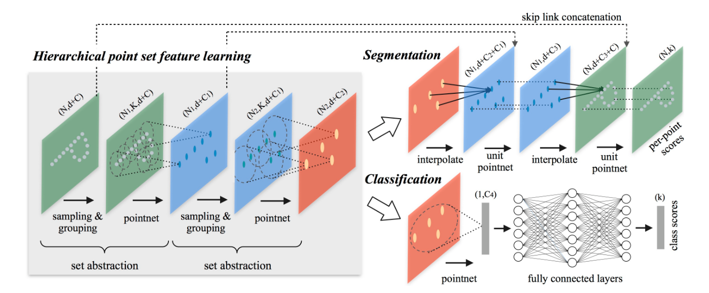

*Fig.6.3.1:   PointNet++[^10]*

The core is the gray Encoder part on the left, that is, Fig.6.3.2:


*Fig.6.3.2:   Encoder[^11]*

Encoder is an essential part of PointNet++ to make up for the deficiency of PointNet. Encoder can achieve layer-by-layer processing, consisting of multiple set abstractions, and each set abstraction includes three steps:

**sampling**: Use FPS (farthest point sampling) to downsampling the original point cloud (the number of points changes from more to less); 

**grouping**: Select neighbors through K-NN or Radius-NN. As a group, ensure that the number of points in each group is equal (Radius-NN can ensure the number of points is equal through random sampling, and K-NN can directly obtain groups with equal points);

**pointnet**: Run a pointnet for the points after grouping, where the points carry some features (such as normal, etc.). Enter the pointnet's coordinates d and some features C. Each pointnet must be standardized. The coordinates of the group's points must be subtracted from the coordinates of the points obtained by the sampling step in each group. Otherwise, it is easy to overfit.

The Classification part on the right side of Fig.6.3.1 is relatively simple: extract features layer by layer through the previous Encoder part, and then use a standard PointNet to summarize the global features to get the result of Classification. The Segmentation part is more complicated, starting from the points after downsampling, use interpolate to achieve up-sampling of the number of points, find the nearest neighbor based on the coordinates of the upper point, and perform the interpolation.

The following briefly introduces how to use PointNet++ for point cloud classification.

##### PointNet++ — Classification

Running PointNet is very simple. Just run the **train.py** code directly after the environment is configured. However, for PointNet++, some sh files need to be compiled, and sh files are more troublesome to compile under Windows, and Git needs to be installed. So we use Pytorch to run PointNet++.

###### What is Pytorch?

Pytorch is an open-source python machine learning library. For specific information, please refer to the official website link: https://pytorch.org/.

###### Install Pytorch

Click WIN + R to open cmd and check the python version, as shown in Fig.6.3.3: python version is 3.7.4.

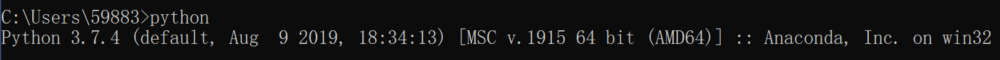

*Fig.6.3.3:   python version*

In addition, the CUDA version we installed before is 10.1. This information will be used when installing Pytorch later.

Next, build a virtual environment, 3.7.4 corresponds to the python version checked before.

```shell
conda create -n pytorch python=3.7.4
```

Activate the virtual environment:

```shell
activate pytorch
```

Installation, here we use CUDA version information:

```shell
conda install pytorch torchvision cudatoolkit=10.1 -c pytorch -c defaults -c numba/label/dev
```

Finally, check whether the installation is successful, enter python in cmd, enter the following code, and return "**True**" to complete the installation.

```shell
import torch
print(torch.cuda.is_available())
```

In the above installation process, we noticed that Pytorch is installed in a virtual environment, so why use it? What is a virtual environment?

###### Virtual environment

Every virtual environment is like a new operating system in which we can install files and configure the environment.

Why install Pytorch in a virtual environment? The main reason is not to install different versions of software repeatedly.

For example, Project A requires CUDA v9.1. Project B requires CUDA v10.1. When we proceed to Project A, we need to install CUDA v9.1, and to proceed to Project B, we have to uninstall CUDA v9.1 and reinstall CUDA v10.1, which is very troublesome. Therefore, we use virtual environment A to install CUDA v9.1 and virtual environment B to install CUDA v10.1. In this way, It will be very convenient and clear.

###### Code and data

Code:

https://github.com/yanx27/Pointnet_Pointnet2_pytorch

Data:

Classification： https://shapenet.cs.stanford.edu/media/modelnet40_normal_resampled.zip

Segmentation：https://shapenet.cs.stanford.edu/media/shapenetcore_partanno_segmentation_benchmark_v0_normal.zip

Semantic Segmentation： http://buildingparser.stanford.edu/dataset.html

Only the first dataset is used for classification. After downloading, create a new data folder in Pointnet_Pointnet2_pytorch-master, and save the data in this folder.

###### Run the code

Since we want to implement point cloud classification, just run **train_cls.py** here. It should be noted that we must use the virtual environment with Pytorch installed as the next compilation environment. The specific settings are as follows:


*Fig.6.3.4:   Python compilation environment settings*

The path in the red box of step3 is the path where Pytorch is installed.

In this way, we can run **train_cls.py** directly. If an error is reported "RuntimeError: CUDA error: unknown error", add torch.cuda.current_device() to the code, as shown in Fig.6.3.5:


*Fig.6.3.5:   Error response*

The following is the running result:

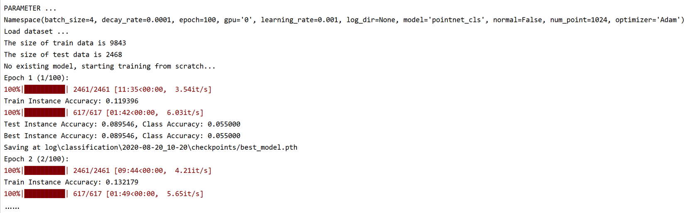

*Fig.6.3.6:   The result of running*

Among them, the classification accuracy will increase with the increase of epoch. Only part of the results of Epoch 1&2 are shown here.

Interested students can try point cloud segmentation and semantic segmentation.

##### PointNet and PointNet++

- PointNet is the first deep learning algorithm for processing point clouds;
- PointNet lacks layer-by-layer processing;
- PointNet++ imitates CNN and performs multi-layer feature extraction through sampling-grouping-pointnet, and the performance is significantly improved;
- To use PointNet or PointNet++ to process point clouds, the first step is to standardize the data to zero-mean and the standardization of each pointnet in the Encoder part of PointNet++.


### 6-4 ：DGCNN

In addition to the PointNet series of neural networks that can be used to process point clouds, other neural networks are based on different theories that can also be used in point cloud processing. The DGCNN introduced in this section is a graph-based neural network.

#### Graph

The Graph is a typical data structure (Graph here is not Image). It is mainly composed of vertices and edges:
$$
Graph -- G(V,E)
$$
V represents the set of vertices, and E represents the set of edges. Fig.6.4.1 is an example of a simple graph:


*Fig.6.4.1:   Graph*

Data expressed in graphs, such as social networks (Figure 6-4-2(a)), literature citation networks (Figure 6-4-2(b)), point clouds (Figure 6-4-2(c) )) and mesh files (Figure 6-4-2(d)), etc.


*Fig.6.4.2:   Data expressed by Graph [^12]*

In Fig.6.4.2, social networks, literature citation networks, and mesh files all have lines, while the point cloud does not have a line in the strict sense, only a series of points, which is not an expression of a natural graph (Graph). However, we can manually form such a line, such as through K-NN, Fixed Radius-NN to find neighbors, and connect them. Therefore, the point cloud data can be represented by a graph like this:

**V** in Graph, which is the vertex:

- Store the coordinate value of each spatial point in the point cloud;


**E** in Graph, which is the edge:

- If it is static, store the connection relationship obtained according to the nearest neighbor search (K-NN, Fixed Radius-NN, etc.);
- If it changes dynamically, use DGCNN. The connection between nodes is dynamic, and the connection of each layer in the neural network is different.


#### DGCNN

DGCNN (Dynamic Graph Convolutional Neural Networks), the network mainly considers the point cloud data's irregularities and is not neatly arranged in a grid like 2D pictures.

Fig.6.4.3 is the process of DGCNN (a brief understanding):


*Fig.6.4.3:   The process of DGCNN[^13]*

The input is n×3 point cloud data. After a spatial transform (similar to T-Net in PointNet), the point cloud data after rotation, translation, and scaling is obtained. EdgeConv, we will talk about later, will merge points' information with neighbors' information. Get features through maxpool to achieve classification. The semantic segmentation implemented according to DGCNN is basically the same as the segmentation process in PointNet.

The difference between DGCNN and PointNet is that in the part of PointNet that directly uses MLP, DGCNN uses EdgeConv and considers neighbors' information.


#### How to define Convolution on the Graph:

##### Image calculation convolution

An image is a way of data expression defined in Euclidean space, composed of a regular grid and pixel values. This is not the case with Graph. Compared with the Image, the position and number of neighbors of the Graph are unknown, so convolution and pooling defined on the Graph (convolution and pooling are the basic knowledge related to deep learning) are more complicated. In order to solve this problem, many people have developed different methods to deal with the characteristics of Graph, and these methods have combined into a graph-based neural network (this large type of network is called GCN (Graph Convolutional Network).

Calculating convolution in an image generally uses the following formula:
$$
x_{i}^{\prime}=x_{i} W_{0}+\sum_{j=1}^{k} x_{j} W_{j}
$$

Among them, $x_{i}$ is a certain point in the current image, $x_{j}$ is its neighbor, and $x_{i}^{\prime}$ is the value after convolution, as shown in Fig.6.4.4:


*Fig.6.4.4:   Convolution in image[^14]*

Among them, "99" in the purple Image Matrix can be used as $x_i$, the value of yellow Kernel Matrix is $W_j$, and the "89" in the green Output Matrix is $x_{i}^{\prime}$. If the convolution process of Fig.6.4.3 is represented by a Graph (Fig.6.4.5), it is equivalent to performing a calculation for each vertex and then summing. Each point in the Image Matrix has eight neighbors.


*Fig.6.4.5:   Analog to Graph*

For Graph, can we also use formula (9) for convolution calculation?

If formula (9) is feasible, then in Fig.6.4.6 below, (a) is a Graph, (b) is the process of calculating convolution, in which there will be connections that are considered neighbors, then $x_i $ is connected to its four neighbors:

> NB: $x_i$ can be figure or vector.


*Fig.6.4.6:   Convolution on Graph*

At this time, k in formula (9) is 4, but when $x_i$ changes, the number of neighbors k of the corresponding point is probably no longer 4, and k is a fixed value when processing images. Furthermore, in the Graph, the information carried by our artificially constructed lines may not be precisely the same. Some points and the connections between points carry more information, and some have different weights. The formula (2) does not consider these issues, so it cannot be used to calculate the Graph's convolution.

##### Calculate convolution by DGCNN

DGCNN solves the problem of the different number of neighbors in the Graph and how to determine the weight.

- For the number of neighbors: DGCNN fixes the number of neighbors, that is, sets the number of neighbors to a fixed value:

  Using feature-based K-NN, in the first layer of the neural network, the point cloud has no features, so this layer is the coordinate K-NN. As the number of layers increases, K-NN no longer selects neighbors for coordinates but based on different features generated by MLP. Therefore, the connection method of each layer and the formed Graph are different. Therefore, the neural network can adjust whether a certain point is connected to other points because the feature space results from its learning.

- For the connection weight problem: DGCNN artificial connections are added manually. Here it is considered that the weight of each edge is the same.

Fig.6.4.7 is the specific implementation method-also known as EdgeConv, which is one of the main contributions of DGCNN:


Fig.6.4.7:   EdgeConv[^13]

$x_i$ is the node we are studying. According to the calculation of convolution, $x_j$ is its neighbor. The convolution calculation formula is as follows:
$$
h_{\Theta}\left(x_{i}, x_{j}\right)=h_{\Theta}\left(x_{j}-x_{i}\right)+h_{\phi}\left(x_{i}\right) \quad x_{i}^{\prime}=\operatorname{maxpool}_{j}\left(h_{\Theta}\left(x_{i}, x_{j}\right)\right)
$$
Among them, $h_{\Theta}()$ is the MLP built on the training parameter $\theta$, and $h_{\phi}()$ is the MLP built on the training parameter $\phi$. $x_{j}-x_{i}$ is the difference between the feature of the neighborhood $x_j$ and the feature of the node $x_i$. $h_{\phi}\left(x_{i}\right)$ is the MLP transformation of $x_i$ itself, $h_{\theta}\left(x_{j}-x_{i}\right)$ is the MLP transformation of the feature difference between the node and the neighboring point. "maxpool" is the maximum pooling.


> The above is a brief introduction to deep learning in point cloud in this chapter.
>
> Mainly refer to the 3D point cloud course of Shenlanxueyuan https://www.shenlanxueyuan.com/course/262


### Reference

[^1]: https://xaltius.tech/artificial-intelligence-vs-machine-learning-vs-deep-learning/
[^2]: [深度学习的数学](https://baike.baidu.com/reference/49922090/79d5__ZAR5vyW1v9vYDB61qisnbXKyzq7lt9QMn4xuehK0DUkOpk9Wzsc8MmWIha2Af7WTAZOZ6ucRtfvVqAmo0Mz3XS1KlPS1uiYJrvOdqFtf5f5ep4krfZ4o5mbR6sJF2HsrLhhUbi8zGUB9ZhZA). 人民邮电出版社有限公司 [引用日期2020-09-16]
[^3]: https://www.superdatascience.com/blogs/convolutional-neural-networks-cnn-softmax-crossentropy
[^4]: https://arxiv.org/pdf/1912.12033.pdf
[^5]: http://stanford.edu/~rqi/pointnet/
[^6]:  https://www.inovex.de/blog/3d-deep-learning-tensorflow-2/
[^7]: https://www.arxiv-vanity.com/papers/1612.00593/
[^8]: https://www.cnblogs.com/gzr2018/p/12853555.html
[^9]: Kuang, H., Wang, B., An, J., Zhang, M., & Zhang, Z. (2020). Voxel-FPN: Multi-Scale Voxel Feature Aggregation for 3D Object Detection from LIDAR Point Clouds. *Sensors*, *20*(3), 704.
[^10]: http://stanford.edu/~rqi/pointnet2/
[^11]: https://papers.nips.cc/paper/7095-pointnet-deep-hierarchical-feature-learning-on-point-sets-in-a-metric-space.pdf
[^12]: https://medium.com/analytics-vidhya/social-network-analytics-f082f4e21b16
[^13]: https://arxiv.org/pdf/1801.07829.pdf
[^14]: https://embarc.org/embarc_mli/doc/build/html/MLI_kernels/convolution_2d.html

