[TOC]


## 第六章   点云中的深度学习

本章旨在给读者介绍一些深度学习及其在点云中应用的基本知识，不做数学和算法的详细阐述解析。读者需要预先自行补充必要的数理知识和基本的机器学习的知识，比如深度学习 500 问：https://github.com/scutan90/DeepLearning-500-questions，《深度学习的数学》等。

Deep Learning（DL），即深度学习，大家对这个名词可能并不陌生。近年来人工智能（Artificial Intelligence， AI）的兴起，带动了一系列诸如机器学习（Machine Learning，ML），深度学习的发展，他们三者之间的关系如图 6-1 所示：

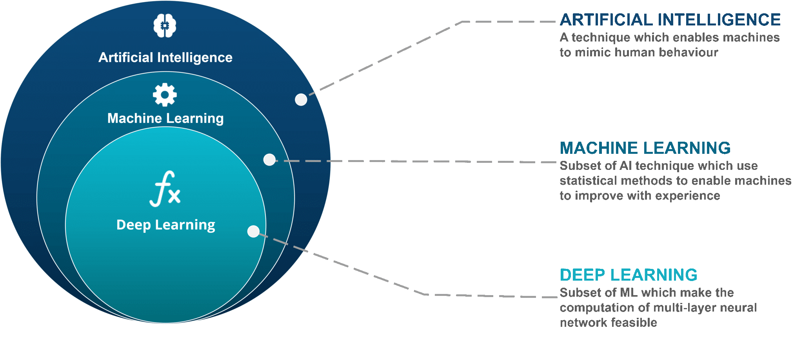

​                                                         图 6-1：AI & ML & DL 之间的关系示意图[^1]

如图 6-1，人工智能的范畴最广泛，机器学习是人工智能的子集，而深度学习又是机器学习的子集。

我们通过一个例子来理解深度学习的源起和重要意义。如下图三只形态不同的小狗：


​                                                                       图 6-2：三只形态不同的狗

看到上面的三张图片，我们很快便会得到这是三只小狗的结论，这是自然而然的，但对于计算机来说，要进行这样的识别并不是那么容易。实际上，这种识别叫做模式识别。我们每天都在进行模式识别：比如 ”那是椅子“、”那是桌子“、”那是电视“ 等等。

对于图 6-2 识别这三只狗来说，计算机做模式识别的大体思路是将 “狗的特征” 教给计算机。但是狗的特征实在是太多 —— 种类的多样性、拍摄角度的不同都会对计算机的识别产生影响。后来，神经网络（Neural Network，NN）产生了。不同于之前模式识别的思路，神经网络是让计算机自己观察大量图片，然后自己去学习这些特征。深度学习便是用神经网络实现的人工智能[^2]。这里我们提到的自己学习，主要是涉及一些数学知识，本章不作详细讲解。

下面我们首先回顾深度学习的基础知识和在点云处理领域的发展历史，然后简要介绍几种与点云处理相关的神经网络。


### 6-1：Introduction：

要了解深度学习，首先我们要对神经网络有一个大致认知。其中，神经元是构成神经网络的基本单位：

#### 神经元：

神经网络这个概念，其实是在模仿生物学中的神经系统。在生物学中，神经网络是由众多神经元（神经细胞）和突触组成。如图 6-1-1 是神经元结构示意图：

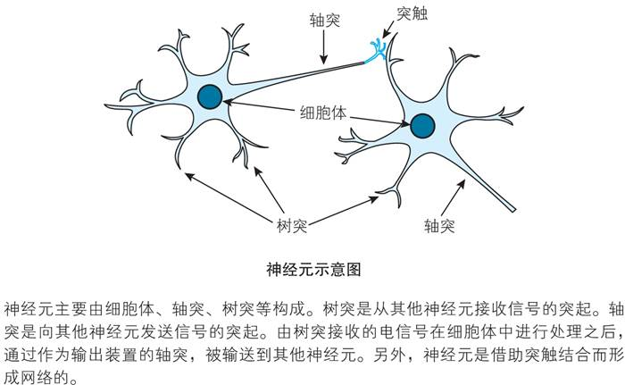

​                                                                            图 6-1-1：神经元结构[^2]

图 6-1-2 是神经元之间传递信息机制示意图：

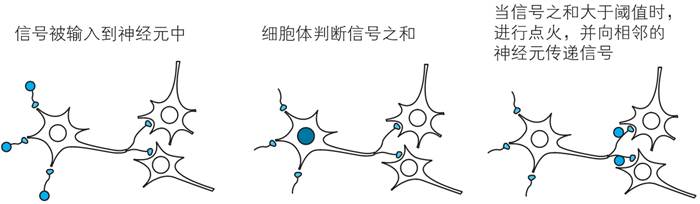

​                                                              图 6-1-2：神经元之间的工作机制[^2]

其中，信号在神经元之间的传递是有条件的。图 6-1-2 中间 “细胞体判断信号之和”，当求和值大于某个阈值时，进行点火，传递信号；然而如果求和值小于这个阈值，那么该信号不会被传递。这里的 “信号之和'' 并不一定是简单的加和，而是有权重地求和，因为对于大脑来说，不同部位神经元传递来的信息对于神经系统作出的反馈的影响是不同的。如图 6-1-3，比较 $w_1x_1 + w_2x_2 + w_3x_3$ 与 $\theta$ 的大小，输出不同的 y：

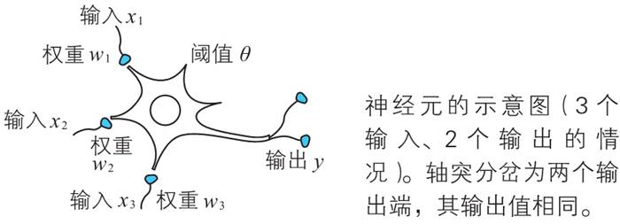

​                                                                          图 6-1-3：权重求和[^2]

在生物学中，输出 y 只有两个值可取：0 或 1。这个输出范围是固定的，1 代表有信号输出；0 代表无信号输出。
$$
y = 0 : w_1x_1 + w_2x_2 + w_3x_3 - \theta < 0     
$$

$$
y = 1 : w_1x_1 + w_2x_2 + w_3x_3 - \theta >= 0
$$

上述两种情况可以归纳为
$$
y=u(w_1x_1 + w_2x_2 + w_3x_3 - \theta)
$$
其中函数 $u(z)$ 为：      
$$
u(z)=0(z<0);
$$

$$
u(z)=1(z>=0);
$$

图 6-1-4 是将图 6-1-3 抽象化后的视图：

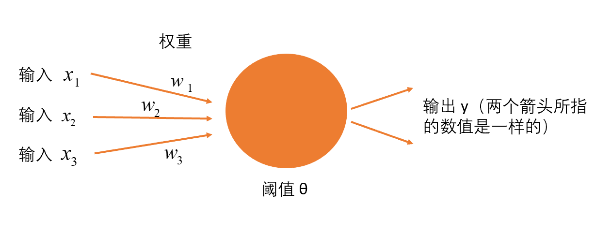

​                                                                     图 6-1-4：抽象化权重求和[^2]

抽象化后的神经元便是我们深度学习中神经网络的组成单元。与生物学中的神经元不同，人工神经元的输出信号不一定是 0 或 1，可以是其他数值。之前介绍之所以 y 有 0 或 1 的数值，是因为有一个函数 $u(z)$，如果我们想要得到更多情况的 y 值，就需要对这个 $u(z)$ 函数进行特殊处理，这个特殊处理的函数叫做 **激活函数（activation function）**，即下式中的 $a(z)$ ：
$$
y=a(w_1x_1 + w_2x_2 + w_3x_3 - \theta)
$$
此时的 y 可以取到 $a(z)$ 能取到的任意数值。关于激活函数，本章不作详细展开，主要的激活函数有 Sigmoid 函数、tanh 函数、Relu 函数等。

更进一步地，在人工神经网络中，常常将阈值 $\theta$ 转换为偏置 $b$，因为 $\theta$ 在公式中前面带了一个负号，在数学中带着负号容易导致计算错误，而且也不美观[^2]，因此将公式 (6) 改为：
$$
y=a(w_1x_1 + w_2x_2 + w_3x_3 + b)
$$
图 6-1-5 即公式 (7) 的体现：

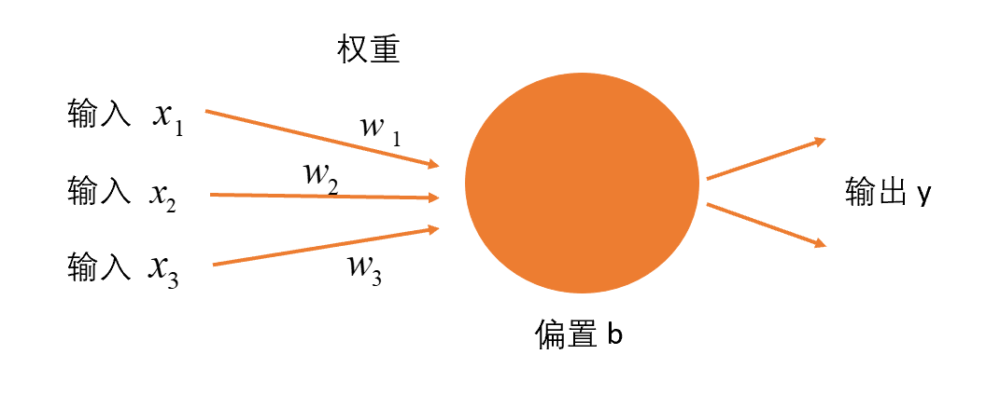

​                                                                    图 6-1-5：阈值改为偏置[^2]


#### 神经网络：

上面我们介绍了神经元的概念，神经网络就是由众多神经元组成的网络。这里以阶层型的神经网络为例：


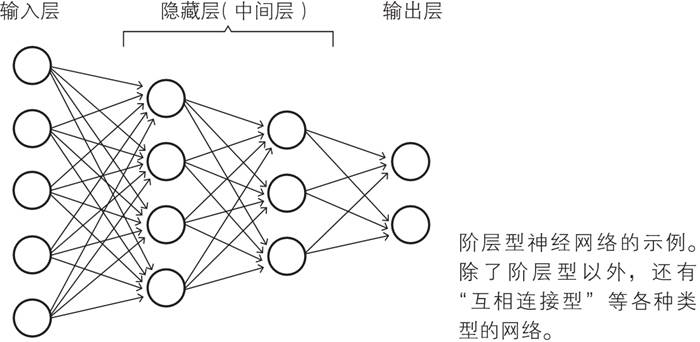


​                                                                       图 6-1-6：阶层型神经网络[^2]

阶层型神经网络由三种层组成：输入层、隐藏层（也叫中间层）、输出层。每层各司其职：

- 输入层主要是接收一些输入的数据并将这些数据不做任何改变地直接输入给下一层；
- 隐藏层是实际处理的部分，主要进行的是公式 (7) 的处理内容；
- 输出层也是在进行公式 (7) 的处理，并输出最终结果。


#### 深度学习：

所谓 **深度** 学习，这个深度实际就是指的神经网络的层数很多，所以深度学习是层数叠加的神经网络。如图 6-1-7 是一个用来给左边图片分类为狗或者猫的深度学习例子：

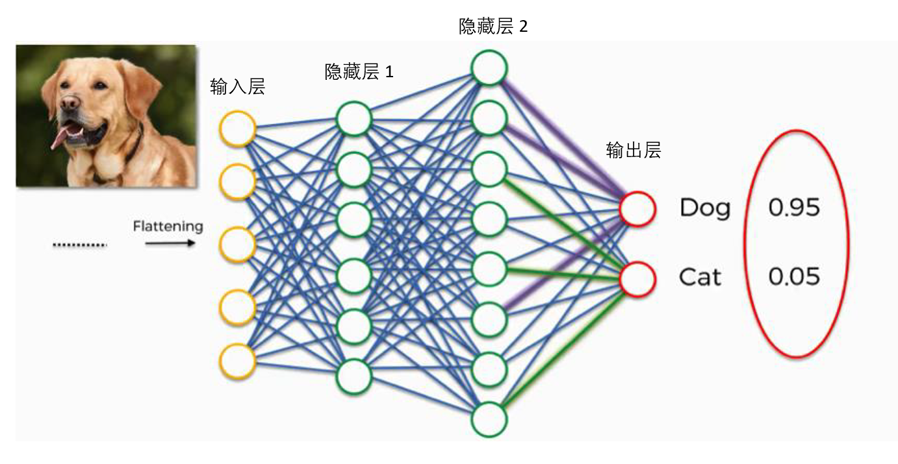

​                                                                        图 6-1-7：深度学习[^3]

图 6-1-7 中间的神经网络中，前一层的神经元与下一层的神经元都是相互连接的，这样的神经网络叫做全连接层（Fully Connected，FC），也叫做多层感知机（Multi Layer Perceptron，MLP），因为隐藏层不止一层（这里有两层）。


#### 点云中的深度学习：

目前很多研究都采用以下两种方法进行三维点云的处理：

- 直接对 3D 点云进行处理；
- 将 3D 点云投影成不同角度的 2D 图像，根据 2D 场景下的深度学习算法进行处理；

------

下面根据一篇综述论文一起来了解点云深度学习的发展历程：

文章名称：***Deep Learning for 3D Point Clouds: A Survey***

链接：https://arxiv.org/pdf/1912.12033.pdf

论文涉及三个方面：三维形状分类、三维目标检测和三维点云分割。

图 6-1-8 是三维形状分类的发展历程：


​                                                          图 6-1-8：三维形状分类发展历史[^4]

图 6-1-9 是三维目标检测的发展历程：


​                                                           图 6-1-9：三维目标检测发展历史[^4]

图 6-1-10 和图 6-1-11 分别是三维点云语义分割与实例分割的发展历史：


​                                                           图 6-1-10：三维点云语义分割发展历史[^4]


​                                                            图 6-1-11：三维点云实例分割发展历史[^4]

通过论文摘取的发展历史进程图，我们可以大致了解近年来深度学习在点云处理方面的发展，后续我们会对其中的深度学习算法展开介绍。


### 6-2：PointNet：

PointNet 是专门处理点云的神经网络， 常用来处理点云分类（Classification） 和点云分割（Segmentation），如图 6-2-1：


​                                                                 图 6-2-1：PointNet 应用示意图[^5]

PointNet 之所以诞生，是因为点云本身存在两个特点：

1. 置换不变性：点云中点的排列顺序改变，原始点云的性质不会变化；
2. 旋转不变性：将点云进行旋转，虽然坐标改变了，但代表的还是原本的点云物体；

根据以上两个特点，PointNet 网络应运而生。

如图 6-2-2 所示，首先对输入数据进行两次 MLP，得到 n×1024 结构的数据；然后利用 max pool 将 n×1024 转化为 1×1024，因为两次 MLP 是单独对每个点进行 MLP，因此 max pool 要将点的信息合并，利用 maximum 函数对 1024 列的数据求每列的最大值记为最终数据，因此得到 1024 个数据。

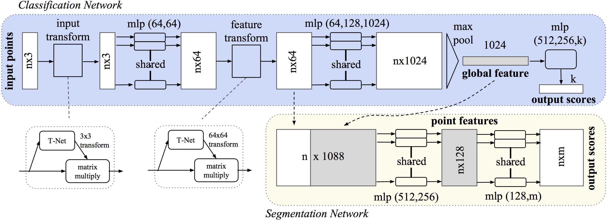

​                                                                 图 6-2-2：PointNet 结构示意图[^5]

其中，Max pool 是统计每一列的最大值。如图 6-2-3，D 对应我们在图 6-2-2 中 max pool 的 1024（n × **1024** max pool 为 1 × **1024**），不过在下面这个例子中 D 是 6；N 是点云总点数，每一行是一个点的信息。记录每一列的最大值，分别是 19，18，23，17，29，42，得到图 6-2-3 箭头右边的 6 个数据：


​                                                                   图 6-2-3：Max pool 示意图[^6]

Max pool 是 PointNet 的核心思想，它的结果可以代表原始点云，并且它对于点云数据的顺序没有要求，也即点云的数据顺序变化，Max pool 的结果不会变。

因此   $PointNet  = shared MLP + Max pool$


#### Critical Points Set & Upper Bound Shape：

Critical Points Set & Upper Bound Shape 是 PointNet 中的两个概念。如图 6-2-4，Critical Points Set 是指我们在 Max pool 中选定了最大值的点，剩下的没有被选到的是没有用的点，他们对于 Max pool 后生成的 global feature 没有用，被称为  Upper Bound Shape。

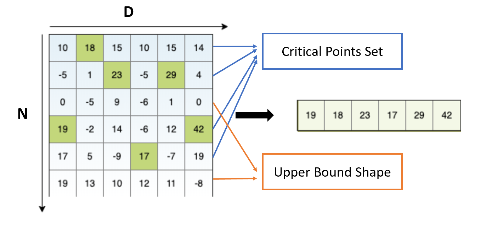

​                                            图 6-2-4：Critical Points Set & Upper Bound Shape 示意图[^6]

将 Critical Points Set & Upper Bound Shape 可视化，如图 6-2-5 中所示，可以看到 Critical Points Set 基本是一些边界点被提取出来：


​                                               图 6-2-5：Critical Points Set & Upper Bound Shape 可视化[^7]


#### PointNet 实现点云分类（Classification）：

这里的实现是依赖于 win10 + CUDA 10.1+cuDNN 7.5 + python3.7.4 + tensorflow-gpu1.13 执行的：

PointNet 源代码下载处： https://github.com/charlesq34/pointnet

CUDA 10.1 下载处：https://developer.nvidia.com/cuda-toolkit-archive

cuDNN 7.5 下载处：https://developer.nvidia.com/rdp/cudnn-archive

tensorflow-gpu 1.13 下载处：https://github.com/fo40225/tensorflow-windows-wheel/tree/master/1.13.1/py37/GPU/cuda101cudnn75sse2

> 注意：要严格遵循版本信息，否则代码运行会出错。

关于上述安装，详细说明如下：

##### CUDA 10.1：

点击 https://developer.nvidia.com/cuda-toolkit-archive，出现下面界面：


​                                                                        图 6-2-6：选择 v 10.1

选择版本信息后，下载安装包，如图 6-2-7：


​                                                                   图 6-2-7：CUDA 安装包下载

下载安装包  后，双击安装包，弹出图 6-2-8。

图 6-2-8 为设置临时路径。该路径可以默认，也可以自己设置，没有区别，因为安装后该路径会自动删除。

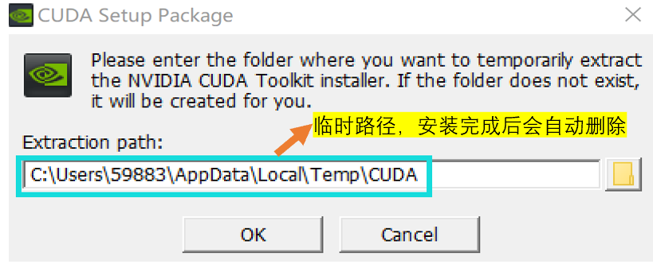

​                                                                         图 6-2-8：临时路径设置

图 6-2-9 为设置进度展示，完成该部分后会进入安装部分：


​                                                                             图 6-2-9：设置进度

图 6-2-10 为安装部分，依次将系统检查、许可协议、选项、安装、结束完成，就完成了 CUDA 10.1 的安装。


​                                                                           图 6-2-10：安装

在选项环节选择精简模式，会安装所有组件，如图 6-2-11：


​                                                               图 6-2-11：选项 —— 精简模式

上述安装过程中会自动生成环境变量，因此不需要特别配置。安装结束后需要重新启动计算机。

##### cuDNN 7.5

点击 https://developer.nvidia.com/rdp/cudnn-archive，出现下面界面：


​                                                      图 6-2-12：选择 v7.5.0，对应 CUDA v10.1 版本

下载并打开压缩包 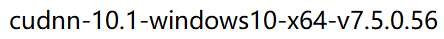

将压缩包内的 bin、include、lib 文件夹复制到之前安装 CUDA 的路径下（不是之前我们设置的临时路径，一般该路径是 C:\Program Files\NVIDIA GPU Computing Toolkit\CUDA\v10.1），如图 6-2-13：


​                                                                 图 6-2-13：复制三个文件夹

WIN + R，打开 cmd，输入 `nvcc -V`，然后回车，显示如下界面，则安装成功：


​                                                                           图 6-2-14：安装成功

##### tensorflow-gpu 1.13

点击 https://github.com/fo40225/tensorflow-windows-wheel/tree/master/1.13.1/py37/GPU/cuda101cudnn75sse2，下载 tensorflow_gpu-1.13.1-cp37-cp37m-win_amd64.whl 文件。

找到自己计算机 python 的环境变量（环境变量的查看参照第四章 PCL 环境配置），如图 6-2-15 中蓝框内：

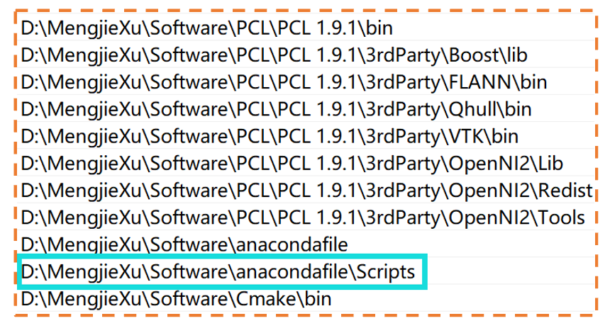

​                                                                      图 6-2-15：python 环境变量

将下载好的 tensorflow_gpu-1.13.1-cp37-cp37m-win_amd64.whl 复制到上述 python 环境变量所在的路径下，然后 WIN + R 打开 cmd，输入 `D:` 回车后再输入 `cd MengjieXu\Software\anacondafile\Scripts` 回车，再输入 `pip install tensorflow_gpu-1.13.1-cp37-cp37m-win_amd64.whl` 后即可进行安装。界面显示安装完成后，输入 `pip list` 回车，查看安装成功后的所有包。

最后验证 tensorflow 是否安装成功：

WIN + R 打开 cmd，输入 python，然后分别测试下面三个语句：

```
# 导入 tensorflow
import tensorflow as tf 

# gpu 信息
tf.test.gpu_device_name() 

# 测试是否能够获取 gpu 返回 True
tf.test.is_gpu_available() 
```

得到如下结果：


​                                                                         图 6-2-16：测试成功

##### 下载数据以及代码运行：

接下来，使用 modelnet40_ply_hdf5_2048 数据集，下载路径为 https://shapenet.cs.stanford.edu/media/modelnet40_ply_hdf5_2048.zip ，将其保存在 PointNet 代码文件夹下的 pointnet-master/data/ 中，在 python 中运行 **train.py**（已在 PointNet 代码文件夹下），运行结果如下：

```
**** EPOCH 000 ****
----0-----
2020-08-16 21:49:09.154348: I tensorflow/stream_executor/dso_loader.cc:152] successfully opened CUDA library cublas64_10.dll locally
mean loss: 4.107550
accuracy: 0.089844
----1-----
mean loss: 3.487081
accuracy: 0.113471
----2-----
mean loss: 3.341762
accuracy: 0.154297
----3-----
mean loss: 3.282955
accuracy: 0.146484
----4-----
mean loss: 3.197451
accuracy: 0.152344
----0-----
----1-----
eval mean loss: 5.180514
eval accuracy: 0.139789
eval avg class acc: 0.086250
Model saved in file: log\model.ckpt
... 此处省略 epoch1 - epoch 248
**** EPOCH 249 ****
----0-----
mean loss: 0.485417
accuracy: 0.854004
----1-----
mean loss: 0.446717
accuracy: 0.861650
----2-----
mean loss: 0.509897
accuracy: 0.846191
----3-----
mean loss: 0.495065
accuracy: 0.847168
----4-----
mean loss: 0.502267
accuracy: 0.847168
----0-----
----1-----
eval mean loss: 5.743022
eval accuracy: 0.774311
eval avg class acc: 0.749837

Process finished with exit code 0
```

可以看到运行准确率 accuracy 不断提高，说明 PointNet 在不断的学习中分类准确性在提升。

##### 关于代码[^8]：

首先介绍几个相关概念，这些概念在深度学习代码中很常见，大家需要掌握。

```
# Step: 训练模型的步数
 
# Batch Size（样本数量）： 计算梯度所需的样本数量，太小会导致效率低下从而无法收敛。太大会导致内存撑不住，当 Batch Size 增大到一定程度后，其下降方向变化很小了，所以 Batch Size 是一个很重要的参数。
 
# Epoch（回合）：代表样本集内所有的数据经过了一次训练。
 
# Iteration（迭代）：迭代是 batch 需要完成一个 epoch 的次数。

记住：在一个 epoch 中，batch 数和迭代数是相等的。比如对于一个有 2000 个训练样本的数据集。将 2000 个样本分成大小为 500 的 batch，那么完成一个 epoch 需要 4 个 iteration
```

------

下面简单介绍与分类（Classification）相关的函数，这里主要参考了 https://www.cnblogs.com/gzr2018/p/12853555.html 的讲解：

input_transform_net 函数即图 6-2-2 中的 T-Net。由于下面解释涉及较多深度学习专业知识（如卷积等），我们目前只是简单介绍，因此希望大家可以自行查找理解这些注释：

```python
def input_transform_net(point_cloud, is_training, bn_decay=None, K=3):
    """ Input (XYZ) Transform Net, input is BxNx3 gray image
        Return:
            Transformation matrix of size 3xK """
    # 上面注释中K表示数据的维数，输入是点云，所以这里是3
    batch_size = point_cloud.get_shape()[0].value
    num_point = point_cloud.get_shape()[1].value

    input_image = tf.expand_dims(point_cloud, -1)  
    # 将点云数据转为4D张量，-1表示在最后加入一维，比如shape[2,3]->shape[2,3,1]
    # 构建T-Net模型，64--128--1024
    # 下面的tf_util.conv2d是对数据做卷积，使用[1,3]的模板卷积，就变成了num_point*1*64。生成64个通道
    net = tf_util.conv2d(input_image, 64, [1,3],
                         padding='VALID', stride=[1,1],
                         bn=True, is_training=is_training,
                         scope='tconv1', bn_decay=bn_decay)
    # 每一个卷积核的大小为 [kernel_h, kernel_w,num_in_channels, num_output_channels]
    # 使用[1,1]的模板卷积。生成128个通道
    net = tf_util.conv2d(net, 128, [1,1],
                         padding='VALID', stride=[1,1],
                         bn=True, is_training=is_training,
                         scope='tconv2', bn_decay=bn_decay)
    # 使用[1,1]的模板卷积。生成1024个通道
    net = tf_util.conv2d(net, 1024, [1,1],
                         padding='VALID', stride=[1,1],
                         bn=True, is_training=is_training,
                         scope='tconv3', bn_decay=bn_decay)
    # 最大池化，模板大小[num_point,1]，也就是一组点的一个通道仅保留一个feature，实现对称。
    net = tf_util.max_pool2d(net, [num_point,1],
                             padding='VALID', scope='tmaxpool')
    # 注意上面模板都是对一组batch做的卷积，下面这句话应该就是参数拉直，之前大小应该是[batch_size，1，1024]做下面的fc层
    net = tf.reshape(net, [batch_size, -1])
    # net的大小应该是[bacth_size,1024]，即每组点只保留1024个feature
    net = tf_util.fully_connected(net, 512, bn=True, is_training=is_training,
                                  scope='tfc1', bn_decay=bn_decay)
    net = tf_util.fully_connected(net, 256, bn=True, is_training=is_training,
                                  scope='tfc2', bn_decay=bn_decay)
    # 两个fc（全连接），最后输出256维特征
    # 生成点云旋转矩阵 T=3*3
    with tf.variable_scope('transform_XYZ') as sc:
        assert(K==3)
        # 创建变量
        weights = tf.get_variable('weights', [256, 3*K],
                                  initializer=tf.constant_initializer(0.0),
                                  dtype=tf.float32)
        biases = tf.get_variable('biases', [3*K],
                                 initializer=tf.constant_initializer(0.0),
                                 dtype=tf.float32)

        biases += tf.constant([1,0,0,0,1,0,0,0,1], dtype=tf.float32)
        # [batch_size,256]*[256,3*k]->[bacth_size,3*k]变化矩阵
        transform = tf.matmul(net, weights)
        # 加上bias
        transform = tf.nn.bias_add(transform, biases)

    transform = tf.reshape(transform, [batch_size, 3, K])
    return transform
```

------

feature transform 网络结构和 input transform 基本一样，大家可以参考 input transform 来理解 feature transform —— feature_transform_net 函数：

```python
def feature_transform_net(inputs, is_training, bn_decay=None, K=64):
    """ Feature Transform Net, input is BxNx1xK
        Return:
            Transformation matrix of size KxK """
    batch_size = inputs.get_shape()[0].value
    num_point = inputs.get_shape()[1].value

    net = tf_util.conv2d(inputs, 64, [1,1],
                         padding='VALID', stride=[1,1],
                         bn=True, is_training=is_training,
                         scope='tconv1', bn_decay=bn_decay)
    net = tf_util.conv2d(net, 128, [1,1],
                         padding='VALID', stride=[1,1],
                         bn=True, is_training=is_training,
                         scope='tconv2', bn_decay=bn_decay)
    net = tf_util.conv2d(net, 1024, [1,1],
                         padding='VALID', stride=[1,1],
                         bn=True, is_training=is_training,
                         scope='tconv3', bn_decay=bn_decay)
    net = tf_util.max_pool2d(net, [num_point,1],
                             padding='VALID', scope='tmaxpool')

    net = tf.reshape(net, [batch_size, -1])
    net = tf_util.fully_connected(net, 512, bn=True, is_training=is_training,
                                  scope='tfc1', bn_decay=bn_decay)
    net = tf_util.fully_connected(net, 256, bn=True, is_training=is_training,
                                  scope='tfc2', bn_decay=bn_decay)

    with tf.variable_scope('transform_feat') as sc:
        weights = tf.get_variable('weights', [256, K*K],
                                  initializer=tf.constant_initializer(0.0),
                                  dtype=tf.float32)
        biases = tf.get_variable('biases', [K*K],
                                 initializer=tf.constant_initializer(0.0),
                                 dtype=tf.float32)
        biases += tf.constant(np.eye(K).flatten(), dtype=tf.float32)
        transform = tf.matmul(net, weights)
        transform = tf.nn.bias_add(transform, biases)

    transform = tf.reshape(transform, [batch_size, K, K])
    return transform
```

------

下面是分类（Classification）网络模型部分，get_model 函数：

```python
def get_model(point_cloud, is_training, bn_decay=None):
    """ Classification PointNet, input is BxNx3, output Bx40 """
    batch_size = point_cloud.get_shape()[0].value
    num_point = point_cloud.get_shape()[1].value
    end_points = {}

    with tf.variable_scope('transform_net1') as sc:
        # 得到输入变换网络
        transform = input_transform_net(point_cloud, is_training, bn_decay, K=3)
    # 矩阵乘法，变换到规范空间
    point_cloud_transformed = tf.matmul(point_cloud, transform)
    # 转为4D张量
    input_image = tf.expand_dims(point_cloud_transformed, -1)
    # 卷积核[1,3]，输出通道64
    net = tf_util.conv2d(input_image, 64, [1,3],
                         padding='VALID', stride=[1,1],
                         bn=True, is_training=is_training,
                         scope='conv1', bn_decay=bn_decay)
    # 卷积核[1,1]，输出通道64
    net = tf_util.conv2d(net, 64, [1,1],
                         padding='VALID', stride=[1,1],
                         bn=True, is_training=is_training,
                         scope='conv2', bn_decay=bn_decay)
    # 第二个：特征变化网络
    with tf.variable_scope('transform_net2') as sc:
        transform = feature_transform_net(net, is_training, bn_decay, K=64)
    end_points['transform'] = transform
    net_transformed = tf.matmul(tf.squeeze(net, axis=[2]), transform)
    net_transformed = tf.expand_dims(net_transformed, [2])
    # 卷积层，[1,1]卷积核，输出通道64
    net = tf_util.conv2d(net_transformed, 64, [1,1],
                         padding='VALID', stride=[1,1],
                         bn=True, is_training=is_training,
                         scope='conv3', bn_decay=bn_decay)
    # 卷积层，[1,1]卷积核，输出通道128
    net = tf_util.conv2d(net, 128, [1,1],
                         padding='VALID', stride=[1,1],
                         bn=True, is_training=is_training,
                         scope='conv4', bn_decay=bn_decay)
    # 卷积层，[1,1]卷积核，输出通道1024
    net = tf_util.conv2d(net, 1024, [1,1],
                         padding='VALID', stride=[1,1],
                         bn=True, is_training=is_training,
                         scope='conv5', bn_decay=bn_decay)

    # Symmetric function: max pooling
    net = tf_util.max_pool2d(net, [num_point,1],
                             padding='VALID', scope='maxpool')

    net = tf.reshape(net, [batch_size, -1])
    # fc
    net = tf_util.fully_connected(net, 512, bn=True, is_training=is_training,
                                  scope='fc1', bn_decay=bn_decay)
    # dropout，防止过拟合
    net = tf_util.dropout(net, keep_prob=0.7, is_training=is_training,
                          scope='dp1')
    net = tf_util.fully_connected(net, 256, bn=True, is_training=is_training,
                                  scope='fc2', bn_decay=bn_decay)
    net = tf_util.dropout(net, keep_prob=0.7, is_training=is_training,
                          scope='dp2')
    # 40,应该是实现40分类
    net = tf_util.fully_connected(net, 40, activation_fn=None, scope='fc3')
    # return 的是分类网络的结果和n*64的原始特征，可以用分割网络
    return net, end_points
```

------

有兴趣的同学可以尝试用 PointNet 做点云分割（Segmentation）。


#### PointNet 加强版 —— VFE：

VFE (Voxel Feature Encoding)，是 PointNet 的加强版。就是两个 PointNet 叠加在一起，如图 6-2-17：

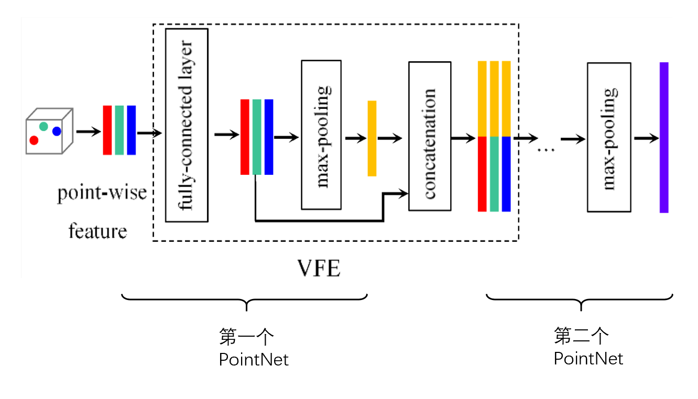

​                                                                         图 6-2-17：VFE 示意图[^9]

VFE 的提升效果非常明显，因为在第二个 PointNet 中它合并了第一次 PointNet 在 Max pooling 之前的信息，使得神经网络深度更深，效果更好。


#### PointNet 的不足：

PointNet 缺少逐层的特征提取，从 n×1024 直接到 1024，会损失一些信息，因此我们引出 PointNet++，也即下一节的内容。


### 6-3 ：PointNet++：

PointNet++ 是针对 PointNet 的不足即无法对点云进行逐层处理，会丢失部分点云信息而被引入的一种神经网络结构。PointNet++ 借鉴 CNN 的思想，实现逐层特征提取（如图 6-3-1）。


​                                                                       图 6-3-1：PointNet++[^10]

其中核心是左侧灰色 Encoder 部分，也即图 6-3-2：


​                                                                      图 6-3-2：Encoder 部分[^11]

Encoder —— 编码器，该部分是 PointNet++ 弥补 PointNet 不足的重要环节。Encoder 可以实现逐层的处理，由多个 set abstraction 组成，每一个 set abstraction 包括三步：

**sampling：**使用 FPS  (farthest point sampling）对原始点云进行 down sampling（点数从多变少）；

**grouping：**通过 K-NN 或者 Radius-NN 选取邻域点，作为一个 group，要保证每个 group 点数相等（Radius-NN 可以通过 random 采样来保证点数相等，K-NN 直接就可以得到点数相等的 group）；

**pointnet：**对 grouping 后的点做 pointnet，这里的点携带了一些特征（如法向量等），输入的 pointnet 包括点的坐标 d 和一些特征 C。每一个 pointnet 要进行标准化，也即 group 中的点坐标要减去每个 group 中由 sampling 步得到的点的坐标，否则容易过拟合。

图 6-3-1 右侧的 Classification 部分比较简单：通过前面 Encoder 部分逐层提取特征，再用一个标准的 PointNet 汇总全局特征即可得到 Classfication 的结果；Segmentation 部分较为复杂，从降采样后的点上采样到点数多的点云，用 interpolate 实现点数的上采样，根据上层点的坐标找 nearest neighbor，进行插值。

下面简单介绍如何使用 PointNet++ 进行点云分类（Classification）。


#### PointNet++ 实现点云分类（Classification）：

运行 PointNet 非常简单，环境配置好后直接运行 **train.py** 代码即可；但对于 PointNet++ 来说，需要编译一些 sh 文件，而 sh 文件在 Windows 下编译比较麻烦，需要安装 Git。因此我们借助 Pytorch 进行 PointNet++ 代码的运行。

##### 什么是 Pytorch？

Pytorch 是一个开源的 python 机器学习库，具体信息见官网链接：https://pytorch.org/

##### 安装 Pytorch：

WIN + R 打开 cmd，查看 python 版本，如下图，可得知这里的 python 为 3.7.4 版本：


​                                                                  图 6-3-3：python 版本

除此之外，之前我们安装的 CUDA 版本是 10.1，这个信息会在后面安装 Pytorch 时用到。

下面构建虚拟环境，3.7.4 对应之前查看的 python 版本。

```shell
conda create -n pytorch python=3.7.4
```

激活虚拟环境：

```shell
activate pytorch
```

安装，这里我们用到了 CUDA 的版本信息：

```shell
conda install pytorch torchvision cudatoolkit=10.1 -c pytorch -c defaults -c numba/label/dev
```

最后检验是否安装成功，在 cmd 中输入 python， 输入下列代码，返回 “**True**” 则安装成功。

```shell
import torch
print(torch.cuda.is_available())
```

在上面的安装过程中，我们注意到 Pytorch 其实是安装在虚拟环境中，那么为什么要用虚拟环境呢？什么是虚拟环境？

##### 虚拟环境：

每一个虚拟环境都像是一个新的操作系统，大家可以在里面安装文件，配置环境。

为什么要将 Pytorch 安装在虚拟环境中？主要是为了不重复安装不同版本的软件。

比如项目 A 需要 CUDA v9.1；项目 B 需要 CUDA v10.1。当我们进行项目 A 时要安装 CUDA v9.1，进行项目 B 又要卸载CUDA  v9.1，重新安装 v10.1 的 CUDA，非常麻烦。因此我们使用虚拟环境 A 安装 CUDA v9.1，虚拟环境 B 安装 CUDA v10.1，这样进行项目 A 时使用虚拟环境 A，进行项目 B 使用虚拟环境 B 即可。

##### 下载代码以及数据：

代码：

https://github.com/yanx27/Pointnet_Pointnet2_pytorch

数据：

Classification： https://shapenet.cs.stanford.edu/media/modelnet40_normal_resampled.zip

Segmentation：https://shapenet.cs.stanford.edu/media/shapenetcore_partanno_segmentation_benchmark_v0_normal.zip

Semantic Segmentation： http://buildingparser.stanford.edu/dataset.html

分类只用第一个数据集即可，下载好后在 Pointnet_Pointnet2_pytorch-master 中新建 data 文件夹，并将数据保存在该文件夹下。

##### 运行代码：

因为我们要实现点云分类，这里直接运行 **train_cls.py** 即可。需要注意的是，我们一定要使用安装了 Pytorch 的虚拟环境作为接下来的编译环境，具体设置如下：

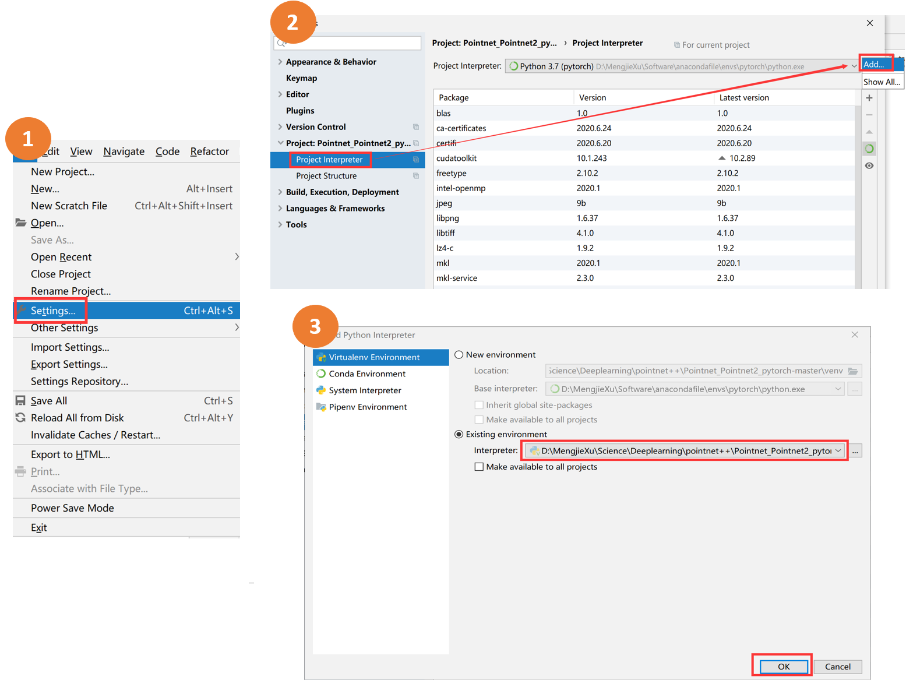

​                                                           图 6-3-4：python 编译环境设置

第三步红框内的路径即安装 Pytorch 的路径。

这样就可以直接运行 **train_cls.py** 了，如果在运行过程中报错 RuntimeError: CUDA error: unknown error，则将代码中添加 torch.cuda.current_device()，如图 6-3-5：

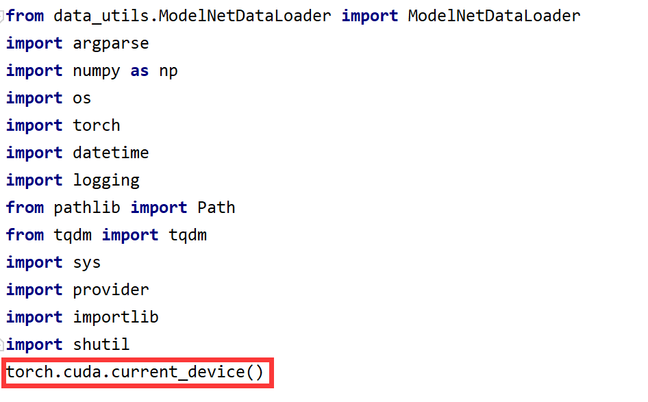

​                                                                            图 6-3-5：报错应对

代码运行结果如下：


​                                                                            图 6-3-6：运行结果

其中，分类准确度（accuracy）会随着 epoch 的增加而提高，这里只展示了 Epoch 1&2 的部分结果。

有兴趣的同学可以尝试点云分割（Segmentation）以及语义分割（Semantic Segmentation）。


#### PointNet 与 PointNet++：

- PointNet 是第一个用于处理点云的深度学习算法；
- PointNet 缺乏逐层处理；
- PointNet++ 模仿 CNN，通过 sampling-grouping-pointnet 做了多层特征提取，性能明显提高；
- 用 PointNet 或 PointNet++ 处理点云，首先要将数据标准化为 zero-mean，以及 PointNet++ 中 Encoder 部分每一个 pointnet 的标准化。


### 6-4 ：DGCNN：

除了 PointNet 系列的神经网络可以用来处理点云，还有其他基于不同理论的神经网络也可以应用在点云处理中。本节所介绍的 DGCNN 就是基于图（Graph）的神经网络。

> 为了防止混淆，出现图（Graph）这种数据结构时，我们会在后面附加其英文—— Graph。

#### 图（Graph）：

图（Graph）是一种常见的数据结构（这里的图（Graph）不是图像 (Image)）。主要由顶点（vertices）和边（edges）组成：
$$
Graph -- G(V,E)
$$
V 代表顶点的集合，E 代表边的集合。图 6-4-1 为一个简单的图（Graph）的示例：


​                                                                            图 6-4-1：图（Graph）

用图（Graph）表达的数据，比如社交网络（图 6-4-2(a)），文献引用网络（图 6-4-2(b)），点云（图 6-4-2(c)）以及 mesh 文件（图 6-4-2(d)）等。

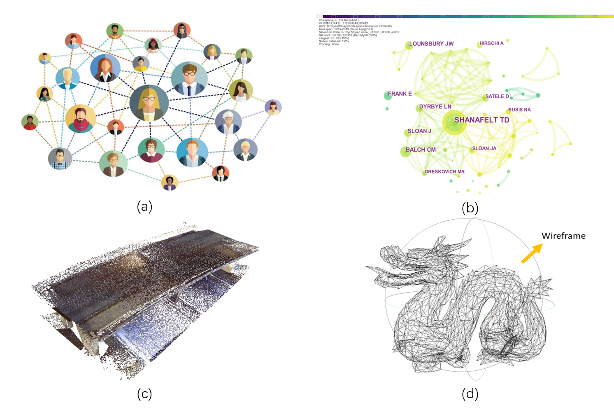

​                                                                图 6-4-2：用图（Graph）表达的数据[^12]

在图 6-4-2 中，社交网络、文献引用网络以及 mesh 文件都有线（line），而点云没有严格意义上的线，只有一系列点，不是天生的图（Graph）的表达形式。但我们可以通过人工形成这样的线，比如通过 K-NN，Fixed Radius-NN 找到近邻然后连接在一起。因此，点云数据可以这样用图（Graph）来表示：

**图（Graph）中的 V**，即顶点：

- 存放点云中的每个空间点的坐标值；

**图（Graph）中的 E**，即边：

- 如果是静态的，则存放根据近邻搜索（K-NN，Fixed Radius-NN 等）得到的连接关系；
- 如果是动态变化的，则使用 DGCNN，即节点之间的连接是动态的，神经网络中每一层的连接情况都不同。


#### DGCNN：

DGCNN（Dynamic Graph Convolutional Neural Networks），即动态图卷积神经网络。该网络主要是考虑到点云数据的不规则，不像 2D 图片那样整齐按照网格排列。

图 6-4-3 是 DGCNN 的过程（简单了解）：

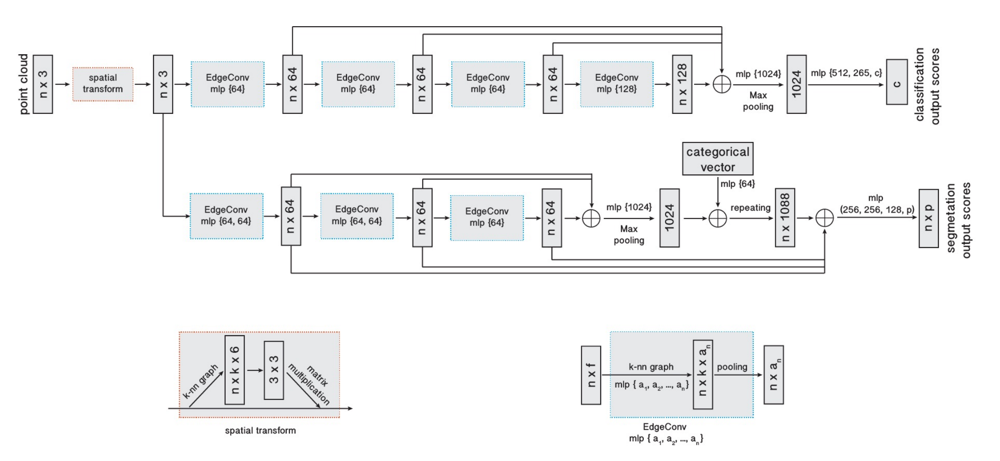

​                                                                   图 6-4-3：DGCNN 流程图[^13]

输入为 n×3 的点云数据，经过一个 spatial transform（类似于 PointNet 中的 T-Net），得到旋转平移缩放后的点云数据。EdgeConv 我们会在后面讲到，即将自己的信息与邻居的信息合并。通过 maxpool 得到特征，实现分类。根据 DGCNN 实现的语义分割与 PointNet 中的分割过程基本一致。

DGCNN 与 PointNet 的区别在于，PointNet 中直接使用 MLP 的部分，DGCNN 使用了 EdgeConv，考虑了近邻的信息。


#### 如何在图上定义卷积（Convolution）：

##### 图像计算卷积：

图像（image）是定义在欧氏空间中的数据表达方式，它是由规则的网格以及像素值组成的。而图（Graph）并不是这样。与图像（Image）相比，图（Graph）的近邻位置和数量都是未知的，因此在图（Graph）上定义卷积和池化（关于卷积和池化是深度学习相关的基础知识，大家可以自行查阅补充）是比较困难的。为了解决这一问题，很多人研究出了不同的方法应对图（Graph）的这种特点，这些方法共同汇聚成了基于图（Graph）的神经网络（这一大类网络被称为 GCN（Graph Convolutional Network）。

在图像中计算卷积一般使用如下公式：
$$
x_{i}^{\prime}=x_{i} W_{0}+\sum_{j=1}^{k} x_{j} W_{j}
$$


其中，$x_{i}$ 是当前图像中的某一个点，$x_{j}$ 是它的邻居，$x_{i}^{\prime}$ 是卷积后的数值，如图 6-4-4：

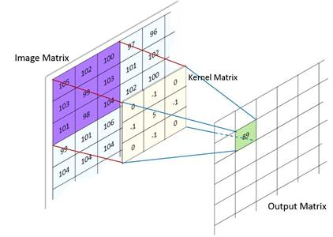

​                                                                    图 6-4-4：图像上的卷积[^14]

其中，紫色 Image Matrix 中的 “99” 可以作为 $x_i$，黄色 Kernel Matrix 的数值是 $W_j$ ，绿色 Output Matrix 中的 “89” 是 $x_{i}^{\prime}$ 。如果将图 6-4-3 的卷积过程用图（Graph）来表示（图 6-4-5），则相当于每个顶点都进行了一次计算然后求和。其中 Image Matrix 中的每个点都有 8 个邻居。


​                                                                     图 6-4-5：类比到图（Graph）

那么对于图（Graph）来说，我们是否也可以利用公式 (9) 进行卷积计算呢？

如果公式 (9) 可行，则下图 6-4-6 中，(a) 是一个图（Graph），(b) 是计算卷积的过程，其中将有连线的认为是邻居，则 $x_i$ 与它的 4 个邻居相连：

> 注意：$x_i$ 可以是数值，也可以是向量。


​                                                               图 6-4-6：图（Graph）的卷积运算

此时，公式 (9) 中的 k 为 4，但是当 $x_i$ 发生改变，则相应点的邻居个数 k 很可能不再是 4，而在处理图像时 k 是个固定值。并且在图（Graph）中我们人为构造的线所携带的信息可能并不完全一致，有的点与点之间的连线携带信息较多，有的反之，权重不同。而公式 (2) 没有考虑这些问题，因此它无法用来计算图（Graph）的卷积。

##### DGCNN 计算卷积：

DGCNN 一定程度上解决了图（Graph）存在的邻居个数不同以及权重如何确定的问题。

- 针对邻居个数问题：DGCNN 将邻居个数固定，即设定邻居个数为固定值：

  使用基于特征的 K-NN，在神经网络第一层，点云本身还没有特征，因此这一层就是坐标的 K-NN，随着层数增加，K-NN 不再是针对坐标选择近邻点，而是根据 MLP 生成的不同特征。所以每一层的连接方式和形成的图（Graph）都不一样。因此神经网络有自己调整某个点跟其他点是否连接的能力，因为特征空间是它的学习结果。

- 针对连线权重问题：DGCNN 人为连线是人工添加的，此处认为每个边的权重相同。

图 6-4-7 是具体实现方法 —— 又称 EdgeConv，是 DGCNN 的主要贡献之一：


​                                                                        图 6-4-7：EdgeConv 示意图[^13]

$x_i$ 是我们研究的节点，根据它进行卷积的计算，$x_j$ 是它的邻居。卷积计算公式如下：
$$
h_{\Theta}\left(x_{i}, x_{j}\right)=h_{\Theta}\left(x_{j}-x_{i}\right)+h_{\phi}\left(x_{i}\right) \quad x_{i}^{\prime}=\operatorname{maxpool}_{j}\left(h_{\Theta}\left(x_{i}, x_{j}\right)\right)
$$
其中，$h_{\Theta}()$ 是建立在训练参数 $\theta$ 上的 MLP，$h_{\phi}()$ 是建立在训练参数 $\phi$ 上的 MLP。$x_{j}-x_{i}$ 即邻域 $x_j$ 特征与节点 $x_i$ 特征之差。$h_{\phi}\left(x_{i}\right)$ 是对 $x_i$ 本身做的 MLP 变换，$h_{\theta}\left(x_{j} - x_{i}\right)$ 是对节点与邻域点之间特征差值做的 MLP 变换。maxpool 是最大池化。


> 以上是本章对于点云中的深度学习的简单介绍。
>
> 主要参考自深蓝学院三维点云课程 https://www.shenlanxueyuan.com/course/262


### 参考文献

[^1]: https://xaltius.tech/artificial-intelligence-vs-machine-learning-vs-deep-learning/
[^2]: [深度学习的数学](https://baike.baidu.com/reference/49922090/79d5__ZAR5vyW1v9vYDB61qisnbXKyzq7lt9QMn4xuehK0DUkOpk9Wzsc8MmWIha2Af7WTAZOZ6ucRtfvVqAmo0Mz3XS1KlPS1uiYJrvOdqFtf5f5ep4krfZ4o5mbR6sJF2HsrLhhUbi8zGUB9ZhZA). 人民邮电出版社有限公司 [引用日期2020-09-16]
[^3]: https://www.superdatascience.com/blogs/convolutional-neural-networks-cnn-softmax-crossentropy
[^4]: https://arxiv.org/pdf/1912.12033.pdf
[^5]:http://stanford.edu/~rqi/pointnet/
[^6]:  https://www.inovex.de/blog/3d-deep-learning-tensorflow-2/
[^7]: https://www.arxiv-vanity.com/papers/1612.00593/
[^8]: https://www.cnblogs.com/gzr2018/p/12853555.html
[^9]: Kuang, H., Wang, B., An, J., Zhang, M., & Zhang, Z. (2020). Voxel-FPN: Multi-Scale Voxel Feature Aggregation for 3D Object Detection from LIDAR Point Clouds. *Sensors*, *20*(3), 704.
[^10]:http://stanford.edu/~rqi/pointnet2/
[^11]:https://papers.nips.cc/paper/7095-pointnet-deep-hierarchical-feature-learning-on-point-sets-in-a-metric-space.pdf
[^12]: https://medium.com/analytics-vidhya/social-network-analytics-f082f4e21b16
[^13]: https://arxiv.org/pdf/1801.07829.pdf
[^14]:https://embarc.org/embarc_mli/doc/build/html/MLI_kernels/convolution_2d.html

