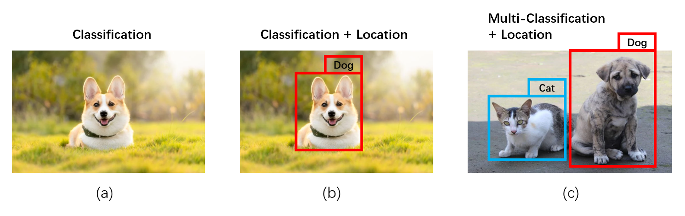

[TOC]

## Chapter7   Object Detection

### Concept

Object detection, which is also called target detection, is to detect specific objects or targets using computer vision technology, including categories, location, and so on. Object detection is an essential and fundamental topic in the field of computer vision. We do many detections each day, such as we can easily judge that a coming pedestrian is a stranger or acquaintance and his/her location. Besides, we tend to conclude the location, speed, brand, and appearance of a speeding car. Above all are the presentations of object detection. Specifically, what is object detection?

When we get a 2D picture, we can conclude that it is a dog, which is a process of ***classification*** (see in Fig.7.1(a));

When we compute and extract this dog's location in the picture, we can get a location box, which is a process of ***object detection*** (see in Fig.7.1(b));

When many objects in one picture need to be detected, it is the ***multi-object detection*** (see in Fig.7.1(c)).

*Fig.7.1:   2D Classification and object detection*

Above are the object detections with 2D pictures. There are also object detections in 3D space. However, the detection box changes from a rectangle to a cuboid, as the color boxes in Fig 7.2:

*Fig.7.2:   Object detection in 3D space[^1]*

### Application

The application of object detection is extensive. Such as Industrial production quality inspection, Smart precision medicine, and factory safety protection, and so on. (see in Fig.7.3)

*Fig.7.3:   The applications of object detection[^2]*

Now we learn it through several examples.

Commodity detection is usually used in the auto-retail field. As shown in Fig.7.4, the names and scores of detection are appearing in the specific boxes:

*Fig.7.4:   Commodity detection[^2]*

Road traffic detection aims at detecting unnormal situations on the road and adjusting traffic signals. It can also plan routes automatically to realize the consistency between vehicles and roads, as shown in Fig.7.5.

*Fig.7.5:   Road traffic detection[^3]*

### Development history

We can use traditional methods such as combining plan fitting, clustering, and classification to detect objects. Apart from this, the neural network in deep learning can also be used to accomplish this goal. First, we overview the development history of object detection algorithms: 

*Fig.7.6:   the development history of object detection algorithms[^4]*

In Fig.7.6, we can see that deep learning was introduced in object detection in 2014 by the time it got remarkable achievements in picture classification in 2012. Then it divides into two branches: One is One-stage, which is getting results just by inputting data; Another is Two-stage, that is, the classification and location we have already mentioned in Fig.7.1(b). In this case, what we are concerned about is the location and categories of objects. This idea prompts the appearance of RCNN (Region CNN), which is the pioneering work in object detection using deep learning. Until now, RCNN is still the main idea. There are more and more new networks are being created, which improve the precision and efficiency constantly.

### Difficulties

The following figure is about the problems and difficulties in object detection currently.

*Fig.7.7:   The difficulties in object detection*

------

In this chapter, we mainly introduce object detection algorithms in deep learning. Since deep learning is more refined than traditional methods, only one network structure can accomplish plane fitting, clustering, and classification. Besides, the results detected by deep learning is usually better. 

> NB: Although deep learning is more refined than traditional algorithms, it still has some problems with insufficient generalization ability. Thus, object detection in some specific situation depends on traditional algorithms. We are supposed to learn traditional methods, too.

### 7-1：Object detection based on image

Before we talk about object detection in high-dimensional space, we first introduce object detection in 2D space since the object detection in high-dimensional space is derived from that in 2D space.

#### Judgment indicators and related concepts

There are supposed to have consistent indicators to judge the results of object detection so that we first introduce some judgement indicators and related concepts. 

##### Ground Truth Bounding Box and Predicted Bounding Box

To judge the precision of object detection, we usually use two Bounding Boxes (see in Chapter 2) —— Ground Truth Bounding Box and Predicted Bounding Box, the former is the real box while the later is the box predicted by algorithms. In order to get a degree of accuracy, we need to compare these two Bounding Boxes. When Predicted Bounding Box is closer to Ground Truth Bounding Box, that is, the area of their overlap is bigger, then the detection result is better.

*Fig.7.1.1:   Ground Truth Bounding Box and Predicted Bounding Box*

##### IoU (Intersection over Union)

IoU is the ratio of the area of the intersection of two bounding boxes (in the field of object detection, one is Ground Truth Bounding Box and the other is Predicted Bounding Box) and the area of the union of the two bounding boxes, which reflects how closely the Predicted Bounding Box to Ground Truth Bounding Box, that is, whether the result is matching, as shown in Fig.7.1.2:

*Fig.7.1.2:   IoU*

There will be a threshold in algorithms. If the IoU is larger than the threshold, showing that the detection is efficient; otherwise, the detection is below standard.

##### TP,   FP,   TN,   FN

TP (True positives), FP (False positives), TN (True negatives), and FN (False negatives) are the fundamental concepts of the accuracy of object detection. Their meanings are following respectively.

Take the detection of people in the scene as an example, objects in green boxes are people, and objects in green boxes are other detected objects:

*Fig.7.1.3:   2D Object detection[^5]*

There are labels for each pixel in images, such as "people" is labelled in each pixel in human. Otherwise, it will be labelled as "background". Then we start to detect, classify them to different categories and calculate TP, FP, TN, and FN.

- TP (True positives): The objects are detected, and the real category is people;
- FP (False positives): The objects are detected, but the real category is not people;
- TN (True negatives): The objects are not detected, and the real category is not people;
- FN (False negatives): The objects are not detected, but the real category is people;

As shown in Fig.7.1.4:

*Fig.7.1.4:   TP, FP, TN, FN[^6]*

##### Precision and Recall

$$
Precision = TP/(TP+FP)
$$

$$
Recall = TP/(TP+FN)
$$

According to formula (1) and formula (2), we know that: Precision is used to measure the detected and correct proportion of all detected, that is, how much of the detected proportion is correct; Recall is used to measure the proportion of detected and correct persons in all real categories are people.

##### F-measure

It is challenging to get high Precision and Recall at the same time. It usually one is higher, another is lower. Thus, we introduce F-measure (the harmonic average of Precision and Recall). Since what we use is binary classification, the F1 score is chosen to judge the accuracy of the test.
$$
F_{1}=\frac{2}{\operatorname{Recall}^{-1}+\text {Precision }^{-1}}=2 \cdot \frac{\text { Precision } \cdot \text { Recall }}{\text { Precision }+\text { Recall }}=\frac{\mathrm{T} P}{\mathrm{TP}+\frac{1}{2}(\mathrm{FP}+\mathrm{FN})}
$$

##### Average Precision (AP) and mAP

Overall, we can get a judgement indicator —— Average Precision, which is used to assess whether the result of detection is up to standard. Each category will have its own AP, that is the ability of the neural network to detect this sort. Since we probably detect many sorts, mAP is generated, which is the average of AP. It is the overall skill for the neural network to detect objects.

Steps to calculate AP:

- step1: Set the threshold of IoU;
- step2: Set the threshold of confidence (the score given by neural network). To get the final P-R curve, we will choose different thresholds. P-R curve is the curve composed of Precision and Recall. The boxes whose confidence is lower than the threshold will be deleted;
- step3: For the remained boxes after step2, choose one box whose IoU is the biggest as the TP. Pay attention to that one Ground Truth Bounding Box has at most one TP;
- step4: The box whose confidence is below the threshold is FP;
- step5: Calculate Precision and Recall, we can get one point on the P-R curve at this time; 
- step6: Repeat step2-4, increasing the threshold of confidence. Finally, we will get the P-R curve;
- step7: Calculate the area of the enclosed space of the P-R curve and the coordinate system, that is the AP. As shown in Fig.7.1.5, the area of purple is 0.88 so that the AP is 0.88.

*Fig.7.1.5:   P-R curve and AP[^7]*

How to calculate mAP? The average of APs in all categories is the mAP.

##### Non-Maximum Suppression (NMS)

The neural network will generate many Predicted Bounding Boxes. If we do not deal with these problems, the AP will be worse. NMS can help us to choose better Predicted Bounding Box, which is required for object detection, usually in the later steps in algorithms.

Steps of NMS

- step1: Sort all Predicted Bounding Boxes belongs to one object by the confidence;
- step2: For all current Predicted Bounding Boxes, select the one with the highest confidence, remove it and add it to the output result list;
- step3: Perform loop processing on the remaining boxes after step2, calculate the IoU of the remaining boxes and the removed boxes of step2, if the IoU is greater than a certain threshold (the threshold is usually adjusted through multiple experiments), then move this box except;
- step4: Repeat step2 and step3 until all the boxes are removed; 
- step5: The output result list is the final result;

#### Two-stage

Let us first learn about Two-stage object detection. We will mainly introduce RCNN, Fast RCNN, and Mask RCNN.

##### RCNN

After understanding the judgment indicators and related concepts, let us take a look at the pioneering work of deep learning in object detection —— RCNN. The RCNN series is an essential representative of the Two-stage faction.

Fig.7.1.6 is the idea of RCNN:

*Fig.7.1.6:   RCNN*

RCNN has an obvious problem, that is each adjusted proposal will be put in a CNN. Since we will set approximately 2000 proposals, we need to run 2000 neural networks for each image. It slows down the process. Depends on this issue, the Fast RCNN is generated. 

##### Fast RCNN

Fast RCNN saves more time than RCNN. Fig.7.1.7 is the idea of Fast RCNN:

*Fig.7.1.7:   Fast RCNN*

At the beginning of Fast RCNN, there is a CNN for the whole image. Then we extract proposals from Feature map, which is projected from the original image. Replace the traditional zoom to ROI pooling, then the size of CNN and MLP will be smaller so that we can save our time.

###### ROI pooling

Now let us focus on the calculation principle of ROI pooling:

*Fig.7.1.8:   ROI pooling[^8]*

In the above ROI pooling process, the first red frame position we get is based on floating-point numbers, which does not happen to be located in the integer grid of the Feature map. So we use floor/round and other methods to get the black frame, but this will lose the frame's position accuracy. Therefore, the ROI Align is generated. The general idea is still to use the red floating-point frame as the candidate frame, divide equally according to the coordinates of the four vertices, and then interpolate in the small area obtained and take the maximum value. Finally, we can get the value of each area.

Fig.7.1.9 is the comparison between RCNN and Fast RCNN, including training time and testing time. As the name shows, Fast RCNN is faster than RCNN.

*Fig.7.1.9:   The comparison among different algorithms 1[^9]*

The blue part in the Test time table represents the traditional Regional proposal with time-consuming. We hope to use deep learning in the regional proposal so that the Faster RCNN is generated.

##### Faster RCNN

According to the time-consuming problem in the RCNN series, Faster RCNN uses Region Proposal Network (RPN) to extract regional proposals (mainly based on anchor, MLP, Classification, and Registration. Classification is a binary type: the box includes objects or not). The following figure shows the process of Faster RCNN:

*Fig.7.1.10:   Faster RCNN*

Similar to Fast RCNN, there is a CNN for the whole image firstly. Then we can get the Feature map. Use RPN to extract proposals, combined with Feature map. Then transform proposals into the same size by ROI pooling. Finally, use CMM and MLP to complete the Classification and Regression.

Fig.7.11 is the comparison of time among different algorithms. Faster RCNN improves the time significantly, which is only 0.2s, while R-CNN needs 49s, SPP-Net needs 4.3s, and Fast RCNN needs 2.3s.

*Fig.7.1.11:   The comparison among different algorithms 2[^9]*

##### Mask RCNN

Furthermore, Mask RCNN was produced. This network mainly uses ROI Align to improve the accuracy problems in ROI pooling. At the same time, it also trains the object detection model and the instance segmentation. Fig.7.1.12 is the performance of Mask RCNN:

*Fig.7.1.12:   Mask RCNN[^10]*

It can be seen that Mask RCNN not only performs well in classification but also achieves instance segmentation. The recognized targets in the scene are marked with different colors to indicate that they are different instances.

> NB: Semantic segmentation is distinguished from instance segmentation. Semantic segmentation is to classify the same category results as one result and label them with the same color, while instance segmentation is that each individual is a result, and the color of the label is different between individuals.
>

##### Summary

So far, we have understood the four powerful algorithms of the RCNN family: RCNN, Fast RCNN, Faster RCNN, and Mask RCNN. Let us compare their respective vital steps:

*Fig.7.1.13:   RCNN series*

#### One-stage

Compared with Two-stage, One-stage does not have a series of related operations such as RPN and ROI pooling but directly outputs the classification category and regression position. The common algorithms are SSD (Single Shot MultiBox Detector) and YOLO (You only look once). Now we talk about SSD (Understand).

##### SSD

SSD (Single Shot MultiBox Detector) shows that it is a One-stage algorithm through its name.

*Fig.7.1.14:   SSD[^11]*

Single Shot: It means that the positioning and classification of objects are realized in **one forward propagation** of the network;

MultiBox: This is the name of a bounding box regression method;

The characteristic of SSD is to convolve multiple Feature maps and then merge them. The number of Bounding Boxes corresponding to each Feature map can be different. Generally speaking, one-stage speed is faster than Two-stage, but the accuracy is often not as high as Two-stage.

### 7-2：Object detection based on point cloud

We have learned about object detection algorithms' history, concepts, and ideas based on the image. In this section, we will introduce object detection about point cloud. According to the characteristics of the point cloud, there are four ideas for this topic:

- Multi-view projection: The point cloud is projected into images of different orientations and then processed separately by the algorithm that processes the images. The representative algorithm is MV3D, which will not be described in detail in this section;
- VoxelGrid: Use VoxelGrid to convert the point cloud into a three-dimensional grid, and then use PointNet or other three-dimensional convolution algorithms to convert the three-dimensional grid into a two-dimensional feature map, and then use traditional image processing algorithms to process;
- Point-wise: Since PointNet and PointNet++ are already available, they can be considered as convolution operations on point clouds, so we can directly use point clouds for convolution operations;
- Combine point cloud and image: For example, project the point cloud to the picture or the picture color is assigned to the point cloud;

In this section, we will introduce VoxelNet, PointPillars, PointRCNN, and PointPainting.

#### VoxelNet

VoxelNet is based on VoxelGrid. Fig.7.2.1 is the process of VoxelNet:

*Fig.7.2.1:   VoxelNet[^12]*

① First, the point cloud is gridded by VoxelGrid, as shown in the Voxel Partition in Fig.7.2.1. There will be many points in each pink grid, but it hopes that the number of points in each grid is the same for the neural network. Therefore, random sampling is needed to achieve this effect. That is, Random Sampling —— set a value T. If the number of points in the current grid is greater than T, it will be randomly downsampled to T. However, if it is less than T, repeat the point in the current grid. Increase the number of points to T.

------

② At this time, use PointNet to transform these points into the feature vector. Thus, there will be a feature vector in each voxel. There are two PointNets —— VFE (see in Chapter 6).

However, for each of these Voxels, the VFE is run once, and the amount of calculation is immense. At the same time, many Voxels do not contain data, so the algorithm proposes the following processing measures.

Run VFE only in useful Voxel, not useless Voxel. As shown below:

*Fig.7.2.2:   Process Voxels[^12]*

**step1**: Build two containers —— Voxel Input Feature Buffer and Voxel Coordinate Buffer, the former includes points, and the latter includes the coordinate of each voxel. The parameters are:

K: The maximum number of the non-empty Voxel in the scene (need to be manually specified);

T: The maximum number of points that can be placed in each Voxel (need to be manually specified);

Thus, the number of points in Voxel Input Feature Buffer reduces to K × T × 7 (7 is the information of each point, such as the coordinate); the number of coordinate values of voxels in Voxel Coordinate Buffer is K × 3 (3 is the number of each coordinate value).

**step2**: Traverse each point, get the coordinates of the point corresponding to the Voxel, map it to one of the K voxels in step1 through the hash table, and gradually store the information in the two containers created in step1;

**step3**: Run K VFEs in Voxel Input Feature Buffer, then we can get feature vector;

**step4**: Use Voxel Coordinate Buffer to correspond back to the original Voxels, and put 0 in the Voxel without data.

------

③ After the above operations, a 3D convolution is used to convert Voxels into a 2D Feature map. Finally, detecting whether there is an object in the frame is obtained through RPN (Fig.7.2.3).

> NB: Only RPN is needed here, and subsequent classification networks are no longer needed because a VoxelNet only processes one category. We only need to know whether it is detected. Once detected, we know its category.

*Fig.7.2.3:   RPN[^12]*

As shown in Fig.7.2.3, we input a Feature map firstly. Then we can get the Probability score map and Regression map after a series of convolution operations for processing images.

#### PointPillars

PointPillars is a simpler detection algorithm than VoxelNet. As shown in Fig.7.2.4:

*Fig.7.2.4:   PointPillars[^1]*

The steps of PointPillars are divided into three parts: Pillar Feature Net, Backbone (2D CNN), and Detection Head (SSD). The mechanisms are the following[^13]:

***Pillar Feature Net:*** Responsible for processing the point cloud into image-like data. First, distribute the point cloud in Pillars. The original point cloud data point has four dimensions $(x,y,z,r)$, including coordinates and reflectivity. We extend it to 9 dimensions $(x,y,z,r,x_c,y_c,z_c,x_p,y_p)$, the subscript with $c$ is the deviation of the point relative to the center of the column, and the subscript with $p$ is the deviation of the point from the center of the grid. More than $N$ points in each column are sampled, and less than $N$ points are filled with 0. So a structure of $(D,P,N)$ is formed, where: $D = 9$, $N$ is the number of sampling points (set value) of each pillar, and $P$ is the total number of pillars, that is, $H * W $. Then convolve, get the structure of $(C,P,N)$, do max operation on the dimension of $N$, get the structure of $(C,P)$, deform to get the final $(C,H,W)$ structure;

***Backbone (2D CNN):*** Backbone network, we will do feature extraction in this part;

***Detection Head (SSD):*** see in section 7-1.

#### PointRCNN

PointRCNN is a type of network based on Point-wise, which performs detection on the native point cloud. The specific process is as follows:

*Fig.7.2.5:   PointRCNN[^14]*

PointRCNN includes three parts: PointNet++, RPN, and ROI pooling.

- ***PointNet++:*** Backbone, calculate feature vector for each point;
- ***RPN:*** Determine whether each point belongs to the front scenic spot according to the feature vector, equivalent to the binary Classification (whether it is the front scenic spot), and then extract 3D proposals from each front scenic spot. The front spot is the point in the Bounding Box in Ground truth.
- ***ROI pooling:*** The obtained Bin-based 3D Box Refinement is equivalent to Regression; Confidence Prediction is equivalent to Classification.

##### The first stage

We define PointNet++ and RPN as the first stage of PointRCNN.

The RPN here is different from that in the image processing network, as shown in Fig.7.2.6:

*Fig.7.2.6:   RPN in 2D (a) and 3D (b)[^14][^15]*

***Classification network:*** RPN in the case of 2D, that is, (a) uses sliding windows to create anchors of different sizes, and then obtains whether each sliding window contains the object to be detected through the classification network; and (b) in the case of 3D. When processing point cloud-related detection, it is also a two-classification network, but the classification result judges whether the point is a front scenic spot or a non-front scenic spot.

***Regression network:*** The regression of RPN in traditional image processing is to obtain a candidate box's size and position after regression. In the case of 3D, a Bin-based 3D box generation is proposed to obtain relevant information because the combination of regression and classification is better than just regression. We adopt classification plus regression for $x, z, \theta$, and direct regression for $y, l, w, h$. $x,y,z$ are the coordinates of the center point of the Bounding Box ($x,z$ are the axes of the horizontal plane), $l,w,h$ are the dimensions of the Bounding Box, and $\theta$ is the angle between the Bounding Box and the coordinate axis.

##### The second stage

Do Refinement for each proposal extracted in the first stage —— regression again to better predict the position and size and classify again to get the detection frame category. Specific steps are as follows:

First, perform an NMS. After the regional proposal is obtained through the first stage, the large number of front spots leads to slow ROI pooling. Therefore, during training, the first 300 regional proposals with the highest confidence are selected through NMS. Secondly, expand the regional proposals of the first stage because to determine the accurate position of an object requires the surrounding scene information as an aid, so here we also need surrounding information to optimize the algorithm:

- point coordinates
- point light intensity
- the distance between a point and the origin of coordinates
- the prediction of the foreground and background (whether it is the foreground or the background)

Put this comprehensive information into the MLP, and connect it with the feature vector of the point. Finally, we can get the classification and regression results.

#### PointPainting

Finally, a brief introduction to a detection algorithm that combines point cloud and image —— PointPainting, the process is as follows:

*Fig.7.2.7:   PointPainting[^16]*

After a semantic segmentation in the original image, objects of different categories are marked with different colors. Then project the point cloud into the image, and the semantically segmented tags are transferred to the point cloud. Finally, we can use PointPillars or PointRCNN to continue object detection.

> The above is an introduction to the knowledge points related to object detection in this chapter. Part of the algorithm code is open source. If you are interested, you can try to implement it yourself.
>
> This chapter mainly refers to the 3D point cloud processing course of Shenlanxueyuan https://www.shenlanxueyuan.com/course/262

### Reference

[^1]: Lang, A. H., Vora, S., Caesar, H., Zhou, L., Yang, J., & Beijbom, O. (2019). Pointpillars: Fast encoders for object detection from point clouds. In *Proceedings of the IEEE Conference on Computer Vision and Pattern Recognition* (pp. 12697-12705).
[^2]: https://aistudio.baidu.com/aistudio/education/group/info/1617
[^3]: https://towardsdatascience.com/object-detection-and-tracking-in-pytorch-b3cf1a696a98
[^4]: Zou, Z., Shi, Z., Guo, Y., & Ye, J. (2019). Object detection in 20 years: A survey. *arXiv preprint arXiv:1905.05055*.
[^5]: https://towardsdatascience.com/a-social-distancing-detector-using-a-tensorflow-object-detection-model-python-and-opencv-4450a431238
[^6]: https://en.wikipedia.org/wiki/Precision_and_recall
[^7]: https://sklearn.org/auto_examples/model_selection/plot_precision_recall.html
[^8]: https://deepsense.ai/region-of-interest-pooling-explained/
[^9]: http://cs231n.stanford.edu/2018/

[^10]: He, K., Gkioxari, G., Dollár, P., & Girshick, R. (2017). Mask r-cnn. In *Proceedings of the IEEE international conference on computer vision* (pp. 2961-2969).

[^11]: Liu, W., Anguelov, D., Erhan, D., Szegedy, C., Reed, S., Fu, C. Y., & Berg, A. C. (2016, October). Ssd: Single shot multibox detector. In *European conference on computer vision* (pp. 21-37). Springer, Cham.
[^12]: Zhou, Y., & Tuzel, O. (2018). Voxelnet: End-to-end learning for point cloud based 3d object detection. In *Proceedings of the IEEE Conference on Computer Vision and Pattern Recognition* (pp. 4490-4499).
[^13]: https://www.cnblogs.com/sdu20112013/p/12455629.html
[^14]: Shi, S., Wang, X., & Li, H. (2019). Pointrcnn: 3d object proposal generation and detection from point cloud. In *Proceedings of the IEEE Conference on Computer Vision and Pattern Recognition* (pp. 770-779).
[^15]: Ren, S., He, K., Girshick, R., & Sun, J. (2015). Faster r-cnn: Towards real-time object detection with region proposal networks. In *Advances in neural information processing systems* (pp. 91-99).
[^16]: Vora, S., Lang, A. H., Helou, B., & Beijbom, O. (2020). Pointpainting: Sequential fusion for 3d object detection. In *Proceedings of the IEEE/CVF Conference on Computer Vision and Pattern Recognition* (pp. 4604-4612).