[TOC]

## 第七章   物体检测

### 概念：

物体检测，又叫目标检测，就是用计算机视觉技术去识别场景中的某个物体或目标，包括识别物体的类别、位置等。在计算机视觉中，物体检测是一个非常重要并且基础的问题。其实我们每天都在进行着大量的物体检测，比如我们看到对面走来的行人，会自然而然地从周围场景中得到这个人的位置并且识别是陌生人还是熟人；我们看到飞驰而过的一辆车，会判断这辆车的位置、速度、品牌以及外观...... 这些都是物体检测的体现。具体来说，什么是物体检测呢？

当我们得到一张 2D 图片，我们得到它的分类是一只狗，那么这是一个**分类**的过程（如图 7-1(a)）；

当我们对于这张图片中狗的位置进行计算和提取，得到一个位置框，此时就是一个**物体检测**的过程（如图 7-1(b)）；

当一张图片中出现多个要进行检测的物体时，是**多物体的检测**（如图 7-1(c)）。

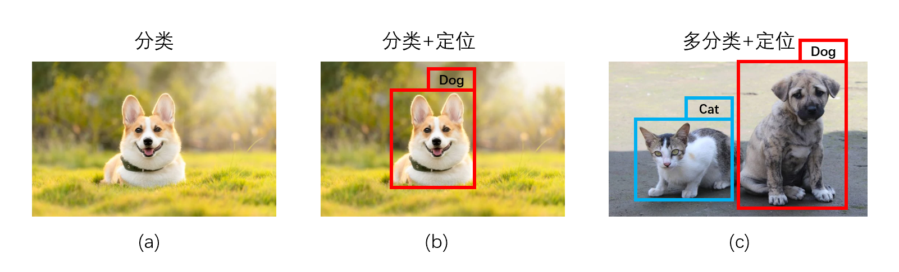

​                                                                     图 7-1：2D 分类以及物体检测

以上是通过 2D 图片来进行的物体检测，三维场景中也有相应的物体检测，不同的是，检测框由长方形变成了长方体，如图 7-2 中的彩色框：

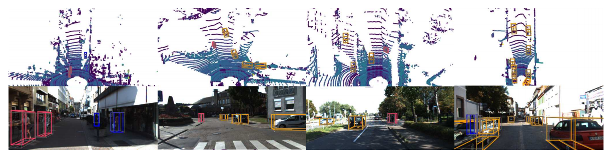

​                                                                图 7-2：3D 场景中的物体检测[^1]

### 应用：

物体检测的应用场景非常广泛，如图 7-3：工业生产质量检测、智慧精准医疗以及厂区安全防护等。

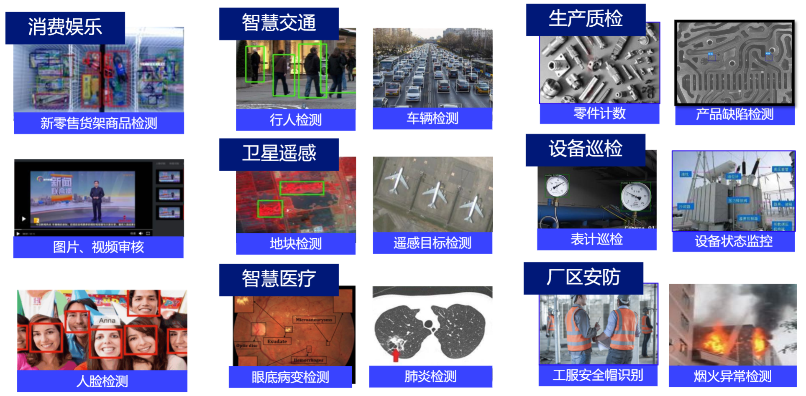

​                                                                      图 7-3：物体检测的应用场景[^2]

下面我们通过几个具体的例子感受一下：

商品检测，常常被用在自动零售领域。如下图，每种商品的名称以及检测打分出现在物体定位框中：

​                                                                              图 7-4：商品检测[^2]

道路交通检测，常常被用来检测路况异常，调整红绿灯控制，自动规划路径，实现车路协同等。如下图

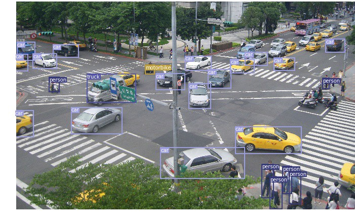

​                                                                         图 7-5：道路交通检测[^3]

### 发展历史：

要进行物体检测，可以使用传统的检测方法，比如将平面拟合，聚类，分类合起来可以做物体检测；也可以用深度学习中的神经网络来进行。我们先来大体浏览处理物体检测算法的发展历程：

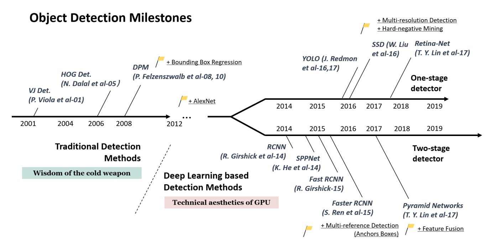

​                                                                    图 7-6：物体检测算法发展历程[^4]

从图 7-6 中我们看到，经过 2012 年深度学习在图像分类中取得巨大成功之后，2014 年也被引入到了目标检测领域，并形成了两个分支：一个是 One-stage，即输入物体数据后直接得到检测框以及结果；另一个是 Two-stage，即我们之前在图 7-1(b) 中提到的物体检测被分解为分类和定位，我们关心的是物体所处的位置以及物体的类别。这样的思考方式使得 RCNN（Region CNN）这一派别诞生，这一派别可以说是深度学习在物体检测领域应用的开山之作，至今 RCNN 思路依旧是主流思路。在随后的发展过程中，不断有新的网络被创建和改进，使得物体检测模型的精度和效率都在不断提高。

### 难点：

下图是目前物体检测存在的问题和难点：

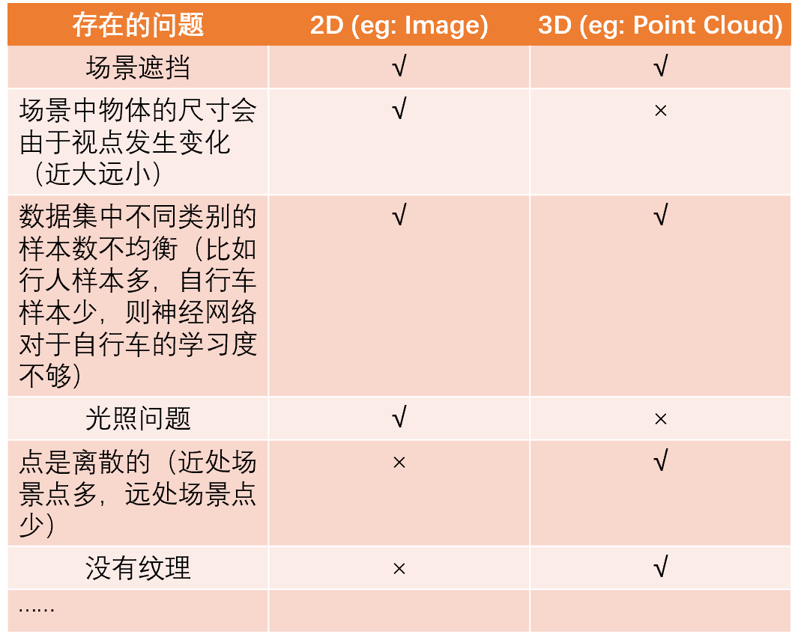

​                                                                          图 7-7：物体检测中的问题

------

本章我们主要介绍深度学习领域下的物体检测算法。因为深度学习算法相较传统算法步骤更精炼，只需一个网络结构就可以完成传统方法中拟合、聚类、分类合并的效果，并且深度学习的检测结果要更好。

> 注意：神经网络虽然算法简练，但是依旧存在泛化能力不足的问题，因此一些特殊场景下的物体检测依旧需要根据传统算法进行，传统的检测方法我们也应该掌握。

### 7-1：基于图像的物体检测：

在讲解对于高维点云的物体检测之前，我们还是先引入 2D 情况下图像的物体检测。因为更高维的物体检测基本是从 2D 图像物体检测中拓展得到的。

#### 判断指标以及相关概念：

物体检测的结果需要统一的指标来衡量，因此我们首先介绍一些判断指标以及与这些指标相关的术语概念。

##### Ground Truth Bounding Box 与 Predicted Bounding Box：

我们要判断物体检测效果是否准确，往往会用到两个 Bounding Box（见第二章）—— Ground Truth Bounding Box 以及 Predicted Bounding Box，前者是真实的物体框，后者是算法预测的物体框。要得到物体检测的准确度，我们就需要对这两个 Bounding Box 进行比较，Predicted Bounding Box 越接近 Ground Truth Bounding Box，即二者重叠面积越大，则检测效果越好。

​                                   图 7-1-1：Ground Truth Bounding Box 与 Predicted Bounding Box

##### IoU (Intersection over Union)：

IoU 是两个包围框（在物体检测领域其中一个是 Ground Truth Bounding Box，另一个是 Predicted Bounding Box）相交部分的面积与两个包围框并集的面积之比，反映了 Predicted Bounding Box 与 Ground Truth Bounding Box 是否接近，也即物体检测效果是否匹配真实情况。如图 7-1-2：

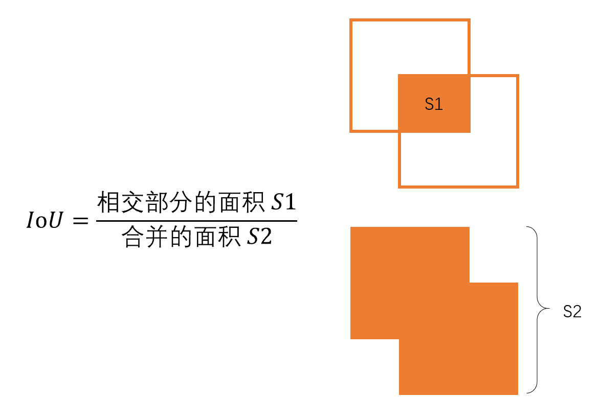

​                                                                         图 7-1-2：IoU 计算示意图

算法中会设置一个阈值（threshold），如果计算出的 IoU 大于该阈值，则说明检测有效，反之该检测准确度没有达到要求。

##### TP、FP、TN、FN：

TP (True positives)、FP (False positives)、TN (True negatives)、FN (False negatives) 是判断整个场景检测准确度的重要概念，它们各自的意义如下：

以检测场景中的人为例，红色和绿色为检测到的物体，绿色是人，红色为检测到的其他物体：

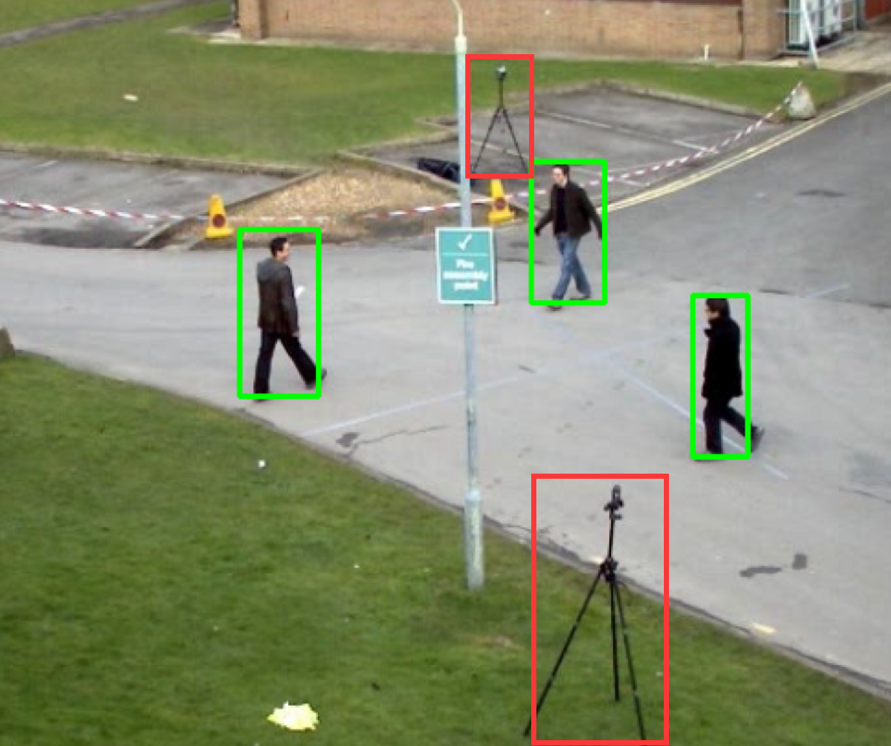

​                                                                            图 7-1-3：2D 检测[^5]

图片中的每一个像素都手动贴了标签，比如检测人的图片中每一个像素都贴上要么“人”，要么是 “背景” 的标签。然后进行检测，自动将该图片的像素进行分类，再计算 TP，FP，TN，FN：

- TP (True positives)：检测到了且真实类别是人；
- FP (False positives)：检测到了但真实类别不是人；
- TN (True negatives)：没有检测到，且真实类别确实不是人；
- FN (False negatives) ：没有检测到，但其真实类别是人；

如图 7-1-4 所示：

​                                                                 图 7-1-4：TP、FP、TN、FN 示意图[^6]

##### Precision 与 Recall：

$$
Precision = TP/(TP+FP)
$$

$$
Recall = TP/(TP+FN)
$$

根据公式 (1) 和公式 (2) 得知：Precision 是用来衡量检测到的并且正确的占所有检测到的比例，也即检测出的有多大比例是正确的；Recall 是用来衡量检测到的并且正确的占所有真实类别为人的比例。

##### F-measure：

Precision 与 Recall 很难达到二者都很高，往往一个偏高时另一个偏低，为此我们介绍 F-measure（Precision 和 Recall 的调和平均）。因为我们这里举的例子是二分类，所以对应的我们介绍 F1 score 来衡量测试的准确性。
$$
F_{1}=\frac{2}{\operatorname{Recall}^{-1}+\text {Precision }^{-1}}=2 \cdot \frac{\text { Precision } \cdot \text { Recall }}{\text { Precision }+\text { Recall }}=\frac{\mathrm{T} P}{\mathrm{TP}+\frac{1}{2}(\mathrm{FP}+\mathrm{FN})}
$$

##### Average Precision (AP) 与 mAP：

综合上述概念，我们可以得到一个评价指标 —— Average Precision，来评价物体检测的效果是否达到目标。每个类别都会得到自己对应的 AP，即使用的神经网络对于这种类别的检测能力。由于一个场景中我们可能会对多种类别的物体进行检测，所以诞生了一个新的指标 —— mAP，即将所有类别 AP 取平均值，得到神经网络对所有检测类别的整体物体检测能力，mAP 也是我们用来判断一个网络检测能力的终极标准。

计算 AP 的步骤：

- step1：设置 IoU 的阈值；
- step2：设置置信度（置信度是神经网络的打分）阈值（这里会依次选择不同的阈值，为了得到最终的 P-R 曲线，P-R 曲线就是 Precision 与 Recall 组成的曲线），小于该阈值的框删除；
- step3：对于 step2 处理后剩下的框，选择一个 IoU 最大的作为 TP，每一个 Ground Truth Bounding Box 最多只有一个 TP；
- step4：小于 IoU 阈值的框作为 FP；
- step5：计算 Precision 与 Recall，此时我们可以得到 P-R 曲线上的一个点；
- step6：重复 step2-4，不断递增置信度阈值，得到 P-R 曲线；
- step7：计算 P-R 曲线与坐标轴所围成区域的面积，即 AP，如图 7-1-5 中紫色区域面积为 0.88，因此 AP 为 0.88；

​                                                                        图 7-1-5：P-R 曲线以及 AP[^7]

计算 mAP：将所有类别的 AP 取平均即可。

##### Non-Maximum Suppression (NMS)：

Non-Maximum Suppression —— 非极大抑制。因为神经网络对于一个物体检测时，往往会得到多个预测框（Predicted Bounding Box），如果不处理这种问题会使得 AP 比较差。NMS 可以帮助我们筛出较好的预测框，它是物体检测必备的，往往出现在物体检测后面的步骤中。

NMS 步骤：

- step1：对于某个物体对应的所有的预测框按照置信度进行排序；
- step2：对于当前的所有预测框，选择一个置信度最高的，将其移除并添加到输出结果列表中；
- step3：对 step2 之后剩下的框进行循环处理，计算剩下的框与 step2 移除框的 IoU，如果该 IoU 大于某个阈值（该阈值一般通过多次实验进行调整得出），则将此框移除；
- step4：重复 step2 和 step3，直到所有框都被移除；
- step5：输出结果列表就是最终的结果；

#### Two-stage：

我们先来看 Two-stage 的物体检测算法，主要介绍 RCNN 系列的 RCNN、Fast RCNN、Faster RCNN、Mask RCNN。

##### RCNN：

了解了判断指标以及相关概念后，我们一起来看一下深度学习在物体检测中的开山之作 —— RCNN。RCNN 系列是 Two-stage 派别的重要代表。

图 7-1-6 是 RCNN 的算法思路：

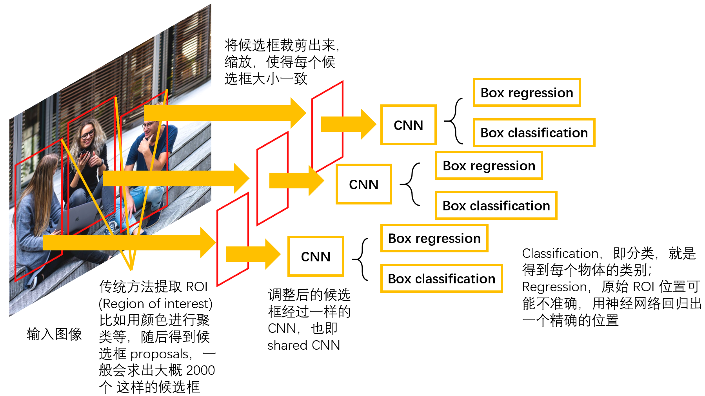

​                                                                            图 7-1-6：RCNN

RCNN 有一个很显然的问题，图 7-1-6 中每个调整后的候选框都会跑一个 CNN，由于我们一般设置 2000 个左右的候选框，则一张图片一般需要跑 2000 个网络，使得算法运行速度减慢，据此，产生了优化后的 Fast RCNN。

##### Fast RCNN：

鉴于 RCNN 对每张图片都要跑很多次神经网络，使得运行速度降低，Fast RCNN 应运而生，省去了很多计算量。

图 7-1-7 是 Fast RCNN 的算法思路：

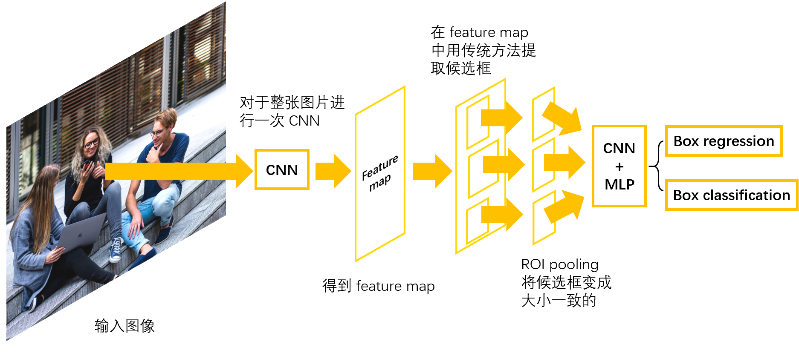

​                                                                            图 7-1-7：Fast RCNN

Fast RCNN 在一开始对整张图片进行了一次 CNN，之后再从得到的 Feature map 中提取候选框（该候选框是从原图中映射到 feature map 的），采取 ROI pooling 代替之前 RCNN 中的传统缩放，随后应用的 CNN 和 MLP 规模相对就小了很多，节省了计算时间。

###### ROI pooling：

现在我们来重点看一下 ROI pooling 的计算原理：

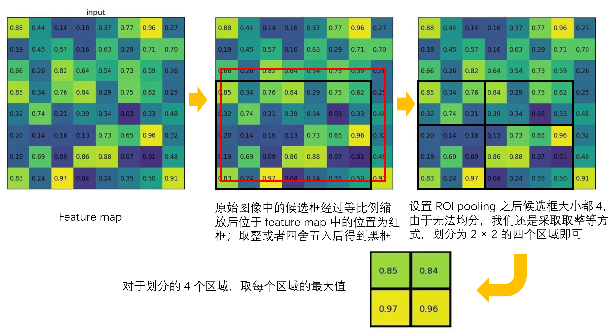

​                                                                         图 7-1-8：ROI pooling[^8]

上述 ROI pooling 的过程中，我们首先得到的候选框位置是浮点数，并不恰好位于 Feature map 的整数格内，因此我们采用 floor/round 等方式取整，得到黑色框，但这样一来会丢失候选框的位置精度，因此改进得到了 ROI Align，大体思路是依旧以红色浮点框为候选框，然后根据四个顶点的坐标进行均分，最终得到的小区域内进行插值然后取最大值，得到每个区域的数值。

图 7-1-9 是 RCNN 与 Fast RCNN 的算法比较，包括训练时间和测试时间，我们发现 Fast RCNN 名副其实，将运行时间缩短了很多：

​                                                                       图 7-1-9：物体检测算法比较[^9]

其中，Test time 表格中的蓝色部分代表的是使用传统的 Region proposal（得到候选框）时间成本很大，我们希望能将深度学习应用到候选框提取中，就有了更进一步的 Faster RCNN。

##### Faster RCNN：

Faster RCNN 针对之前 RCNN 系列中的候选框提取耗时长，使用了一种叫做 Region Proposal Network (RPN) 的神经网络来做候选框的提取（主要通过 anchor，MLP，Classification 以及 Regression 实现，其中 Classification 是二分类，结果有两种：该框包含物体，该框不包含物体）。下图是 Faster RCNN 的流程：

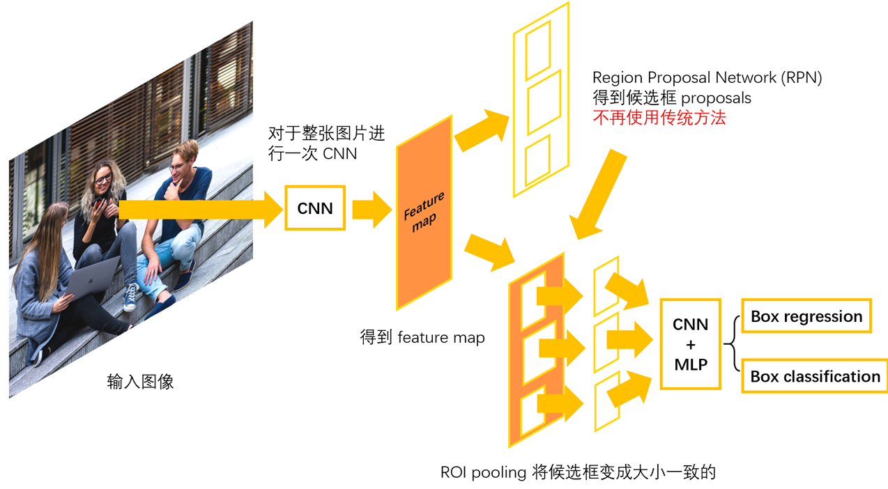

​                                                                          图 7-1-10：Faster RCNN

首先对于整张图片进行一次 CNN，得到 feature map，对 feature map 使用 RPN 提取出候选框，与 feature map 合并，然后通过 ROI pooling 调整图片大小一致，最后进行 CNN 和 MLP 实现分类和回归。

图 7-1-11 是几种不同算法时间成本的比较，Faster RCNN 将时间成本实现了很大改善，仅用时 0.2s：

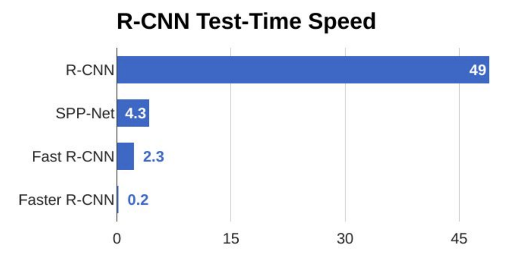

​                                                                     图 7-1-11：物体检测算法比较[^9]

##### Mask RCNN：

进一步地，又产生了 Mask RCNN。该网络主要是使用了 ROI Align 改进 ROI pooling 造成的精度缺失问题，同时，它还同时训练了物体检测和实例分割的网络模型。图 7-1-12 是 Mask RCNN 的效果图：

​                                                                     图 7-1-12：Mask RCNN 效果图[^10]

可以看到，Mask RCNN 不仅在分类上效果很好，而且还实现了实例分割，场景中的被识别目标都被标注了不同的颜色用来表明这是不同的实例。

> 注意：区分语义分割和实例分割，语义分割是将同属于一个类别的归为一个结果，标注为同一颜色；而实例分割是每个个体是一个结果，个体之间标注的颜色不同。

##### 总结：

到此我们已经了解了 RCNN 家族的四大算法：RCNN、Fast RCNN、 Faster RCNN 以及 Mask RCNN，下面来比较一下它们各自的关键步骤：

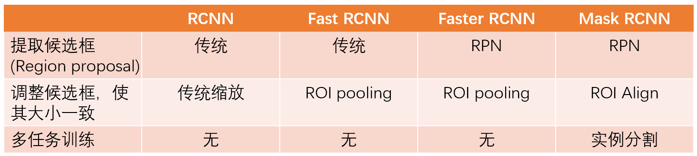

​                                                                图 7-1-13：RCNN 系列算法的比较

#### One-stage：

One-stage 相较于 Two-stage 来说没有了 RPN 以及 ROI pooling 等一系列相关操作，而是直接输出分类类别和回归位置。常见的算法系列有 SSD（Single Shot MultiBox Detector） 以及 YOLO（You only look once），下面我们一起来学习 SSD 这个经典算法（了解即可）。

##### SSD：

SSD (Single Shot MultiBox Detector)，通过标题我们也可以知道这是一个 One-stage 的算法。

​                                                                            图 7-1-14：SSD[^11]

Single Shot：意味着物体的定位和分类是在网络的**一次**前向传播中实现的；

MultiBox：这是一个边界框回归的方法名称；

SSD 的特点是对多个 feature map 进行卷积操作，然后合并。每个 feature map 对应的 Bounding Box 的个数可以不同。一般而言，One-stage 的速度是比 Two-stage 更快的，但准确率往往没有 Two-stage 高。

### 7-2：基于点云的物体检测：

7-1 节中我们已经了解了基于图像的物体检测算法发展历史，相关概念以及思路，这一节我们将会介绍基于点云的物体检测算法。根据点云本身的特点，该类算法大致有以下四种思路：

- 多角度投影 —— Multi-view projection，将点云投影成不同方位的图像，然后用处理图像的算法分别处理。代表算法有 MV3D，本节不作详细说明；
- 使用 VoxelGrid 将点云转化为三维网格，然后经过 PointNet 或者其他三维卷积算法将三维网格转换为二维的 feature map，继而使用传统处理图像的算法去处理；
- Point-wise 操作，由于 PointNet 和 PointNet++ 已经可以使用，它们可以被认为是在点云上的卷积操作，所以我们可以直接使用点云进行卷积操作；
- 将点云和图像融合，比如点云投影到图片或者将图片颜色赋予点云；

本节我们将会介绍以下用于点云物体检测的算法：VoxelNet、PointPillars、PointRCNN、PointPainting。

#### VoxelNet：

VoxelNet 是基于 VoxelGrid 的一种算法，图 7-2-1 是 VoxelNet 的流程图：

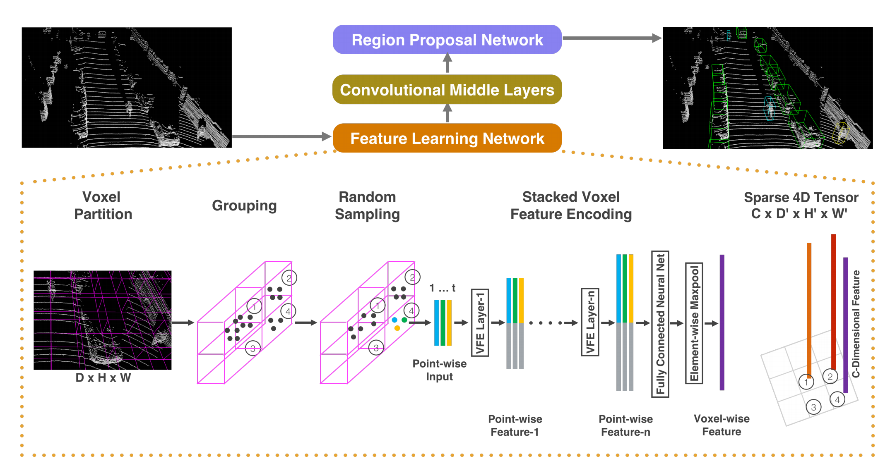

​                                                                    图 7-2-1：VoxelNet 流程[^12]

① 首先将点云通过 VoxelGrid 网格化，如图 7-2-1 中的 Voxel Partition，每个粉色格子中会落有很多点，但是对于神经网络来说，它希望每一个格子里的点数一致，因此需要一个随机采样达到这样的效果，即 Random Sampling —— 设置一个数值 T，如果当前格子内的点数大于 T，则随机降采样到 T；如果小于 T，则可以通过重复当前格子内的点来增加点数到 T。

------

② 此时使用 PointNet 将这些点转换成 feature vector，这样每个 voxel 里面就有一个 feature vector。这里其实是用了两个 PointNet 连在一起 —— VFE（加强版 PointNet，见第六章）。

然而对于这些 Voxels，每个都运行一次 VFE，计算量是非常大的。同时，有很多 Voxels 内部是不含数据的，因此该算法提出了以下处理措施：

只在有用的 Voxel 当中运行 VFE，无用的 Voxel 则不运行。如下图：

​                                                                    图 7-2-2：处理 Voxels 示意图[^12]

**step1**：建立两个容器 —— Voxel Input Feature Buffer 装的是每个点，Voxel Coordinate Buffer 装的是每个 voxel 的坐标。有以下参数：

K：场景中非空 voxel 个数的最大值（需人工指定）；

T：每个 voxel 中最多能放的点数（需人工指定）；

这样一来，Voxel Input Feature Buffer 中存放的点的数量减为 K × T × 7（每个点的 7 个信息，坐标等）；Voxel Coordinate Buffer 中存放的 voxel 坐标数量为 K × 3（坐标）。

**step2**：遍历每个点，得到该点对应 voxel 的坐标，通过哈希表映射到 step1 中的 K 个 voxel 中的一个，逐步将信息存放到 step1 创建的两个容器中；

**step3**：在容器 Voxel Input Feature Buffer 中跑 K 次 VFE，得到 feature vector；

**step4**：利用容器 Voxel Coordinate Buffer 对应回原来的 Voxels，没有数据的 Voxel 中放 0。

------

③ 经过上述操作后，再通过一个 3D 卷积，将 Voxels 转化成 2D feature map，最后通过 RPN （图 7-2-3）得到检测框内是否是物体的结果。

> 注意：这里只需要到 RPN 即可，不再需要后续的分类网络，因为一个 VoxelNet 只处理一个类别。我们只需要知道是否被检测到即可，因为一旦检测到就知道了它的类别。

​                                                                                图 7-2-3：RPN[^12]

如图 7-2-3，左边输入一个 feature map，经过中间一系列处理图像的卷积操作得到右侧的分类网络（Probability score map）以及回归网络（Regression map）。

#### PointPillars：

PointPillars 是一个比 VoxelNet 步骤简洁的检测算法。如图 7-2-4：

​                                                                           图 7-2-4：PointPillars[^1]

PointPillars 的步骤很明显地分为三部分：Pillar Feature Net、Backbone (2D CNN)、Detection Head (SSD)。所运行的机制分别如下[^13]:

Pillar Feature Net：负责将点云处理成类似图像的数据。首先将点云分配在柱子（Pillars）中。原始的点云数据point有 $(x,y,z,r)$ 4 个维度，包括坐标以及反射率。我们将其扩展为 9 个维度 $(x,y,z,r,x_c,y_c,z_c,x_p,y_p)$，带 c下标的是点相对于柱子中心的偏差，带 p 下标的是对点相对于网格中心的偏差。每个柱子中点多于 N 的进行采样，少于 N 的填充 0。于是就形成了 $(D,P,N)$ 的结构，其中：$D = 9$，N 为每个 pillar 的采样点数（设定值），P 为 pillar 总数目，也即 $H * W$。随后卷积，得到 $(C,P,N)$ 的结构，在 N 的维度上做 max operation，得到 $(C,P)$ 的结构，变形得到最后的 $(C,H,W)$ 的结构。

Backbone (2D CNN)：骨干网络，在此处完成特征提取；

Detection Head (SSD)：见 7-1。

#### PointRCNN：

PointRCNN 是基于 Point-wise 的一类网络，在原生点云上进行检测。具体流程如下图：

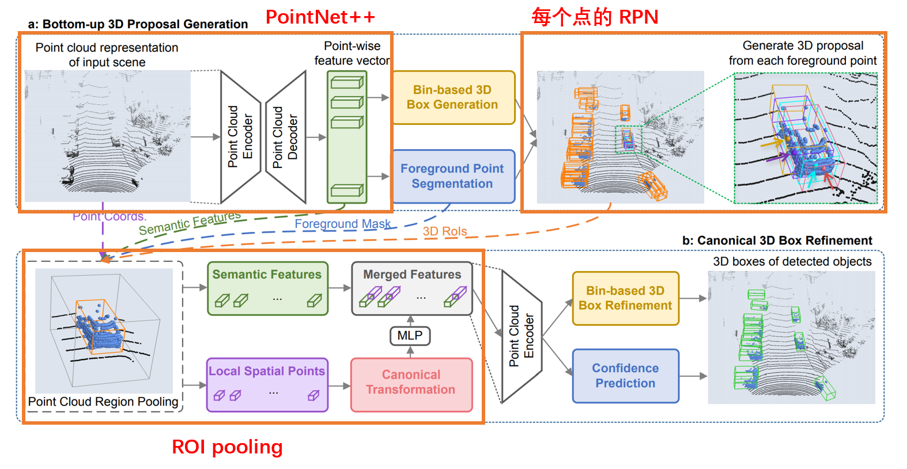

​                                                                         图 7-2-5：PointRCNN[^14]

PointRCNN 可以分为三块内容：PointNet++、RPN 以及 ROI pooling。

- PointNet++：骨干网络（Backbone），对每个点计算特征向量 feature vector；

- RPN：根据 feature vector 判断每个点是否属于前景点，相当于二分类（是否是前景点），然后从每个前景点中提取 3D proposals。前景点是指在 Ground truth 中的 Bounding Box 里的点。

- ROI pooling：得到的 Bin-based 3D Box Refinement 就相当于 Regression；Confidence Prediction 就相当于 Classification。

##### 第一阶段：

PointNet++ 与 RPN 部分统称为 PointRCNN 的第一阶段。

其中，这里的 RPN 与处理图像网络中的 RPN 不一样，如图 7-2-6：

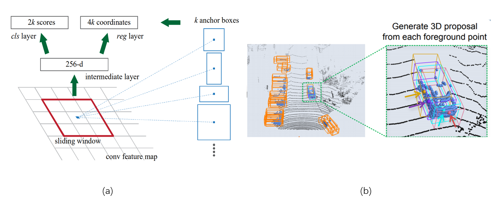

​                                                                图 7-2-6：2D 与 3D 中的 RPN[^14][^15]

分类网络：处理图像，也就是 2D 情况下的 RPN，即 (a) 是使用滑动窗口的方式，建立不同大小的 Anchor，然后通过分类网络得到每个滑动窗口中是否含有待检测物体；而 (b) ，3D 情况下处理点云相关的检测时，也是一个二分类网络，但分类结果是判断该点是前景点还是非前景点。

回归网络：传统图像处理中的 RPN 的回归是在回归得到一个候选框的大小以及位置；而 3D 情况下提出了一个 Bin-based 3D box  generation 来获得相关信息，因为将回归和分类结合起来比单纯只用回归效果要好，所以采取对于 $x, z, \theta$ 采用分类加回归，而对于 $y, l, w, h$ 采用直接回归。$x,y,z$ 是 Bounding Box 中心点坐标（$x,z$ 是水平面的轴），$l,w,h$ 是 Bounding Box 的尺寸，$\theta$ 是 Bounding Box 与坐标轴的夹角。

##### 第二阶段：

对于第一阶段提取出的每个候选框进行 refinement —— 再一次的回归，更好地预测位置和大小。再一次进行分类，得到检测框的类别。具体步骤如下：

首先进行一个 NMS，通过第一阶段得到候选框后，前景点数量大导致 ROI pooling 慢。因此训练时通过 NMS 取前 300 个置信度最高的候选框。其次扩大第一阶段的候选框，因为要判断一个物体的准确位置需要它周围的场景信息作为辅助，因此这里我们也需要周围信息来优化算法：点的坐标，点的光照强度，点离坐标原点的距离以及前景背景的预测（是前景还是背景），将这些扩展的信息放入 MLP 中，与点的特征向量 feature vector 连在一起，最终得到分类以及回归的结果。

#### PointPainting：

最后简单介绍一个将点云和图片融合在一起的检测算法 —— PointPainting，流程如下图：

​                                                                         图 7-2-7：PointPainting[^16]

首先在原始图片中经过一次语义分割（semantic segmentation），将不同类别的物体用不同颜色标出。随后将点云投到图片中，将语义分割后的标签转移到点云上。然后用 PointPillars 或者 PointRCNN 继续进行物体检测。

> 以上是本章对于物体检测相关知识点的介绍。部分算法代码开源，感兴趣可以自己尝试实现。
>
> 本章主要参考深蓝学院三维点云处理课程 https://www.shenlanxueyuan.com/course/262

### 参考文献：

[^1]:Lang, A. H., Vora, S., Caesar, H., Zhou, L., Yang, J., & Beijbom, O. (2019). Pointpillars: Fast encoders for object detection from point clouds. In *Proceedings of the IEEE Conference on Computer Vision and Pattern Recognition* (pp. 12697-12705).
[^2]: https://aistudio.baidu.com/aistudio/education/group/info/1617
[^3]: https://towardsdatascience.com/object-detection-and-tracking-in-pytorch-b3cf1a696a98
[^4]: Zou, Z., Shi, Z., Guo, Y., & Ye, J. (2019). Object detection in 20 years: A survey. *arXiv preprint arXiv:1905.05055*.
[^5]: https://towardsdatascience.com/a-social-distancing-detector-using-a-tensorflow-object-detection-model-python-and-opencv-4450a431238
[^6]: https://en.wikipedia.org/wiki/Precision_and_recall
[^7]: https://sklearn.org/auto_examples/model_selection/plot_precision_recall.html
[^8]: https://deepsense.ai/region-of-interest-pooling-explained/
[^9]: http://cs231n.stanford.edu/2018/

[^10]: He, K., Gkioxari, G., Dollár, P., & Girshick, R. (2017). Mask r-cnn. In *Proceedings of the IEEE international conference on computer vision* (pp. 2961-2969).

[^11]: Liu, W., Anguelov, D., Erhan, D., Szegedy, C., Reed, S., Fu, C. Y., & Berg, A. C. (2016, October). Ssd: Single shot multibox detector. In *European conference on computer vision* (pp. 21-37). Springer, Cham.
[^12]: Zhou, Y., & Tuzel, O. (2018). Voxelnet: End-to-end learning for point cloud based 3d object detection. In *Proceedings of the IEEE Conference on Computer Vision and Pattern Recognition* (pp. 4490-4499).
[^13]: https://www.cnblogs.com/sdu20112013/p/12455629.html
[^14]: Shi, S., Wang, X., & Li, H. (2019). Pointrcnn: 3d object proposal generation and detection from point cloud. In *Proceedings of the IEEE Conference on Computer Vision and Pattern Recognition* (pp. 770-779).
[^15]: Ren, S., He, K., Girshick, R., & Sun, J. (2015). Faster r-cnn: Towards real-time object detection with region proposal networks. In *Advances in neural information processing systems* (pp. 91-99).
[^16]: Vora, S., Lang, A. H., Helou, B., & Beijbom, O. (2020). Pointpainting: Sequential fusion for 3d object detection. In *Proceedings of the IEEE/CVF Conference on Computer Vision and Pattern Recognition* (pp. 4604-4612).