[TOC]

## 第八章   特征点

我们在第四章介绍过关键点（Keypoints）和特征（Feature），这些信息可以帮助我们更好地操作点云的识别、重建、SLAM 建图等，越好的越关键的信息具有越高的辨 (判) 别力，能将目标物体跟其他点云中的物体区分开。其中，关键点我们也常常称之为特征点，我们在操作和计算特征点时，往往是先提取/检测（detect）特征点/关键点，然后再对特征点进行描述（descript）—— 这里我们描述之后得到的信息就是第四章 PCL 介绍的特征（Feature），后期如果要应用到配准或重建等算法中时，还需要一个匹配操作（matching）。

在本章的介绍当中，我们将跳出 PCL 的范围，先从 2D 图像的特征点开始讲解，再逐渐拓展到点云领域的特征点。除此之外，处理特征点的算法也分为传统方法以及基于深度学习的方法，我们也会在本章加以介绍。

### 8-1：图像中的特征点：

#### 特征点提取（detection）：

特征点，就是本身含有特征信息的点，通常也在研究中被称为兴趣点、关键点，如下图：

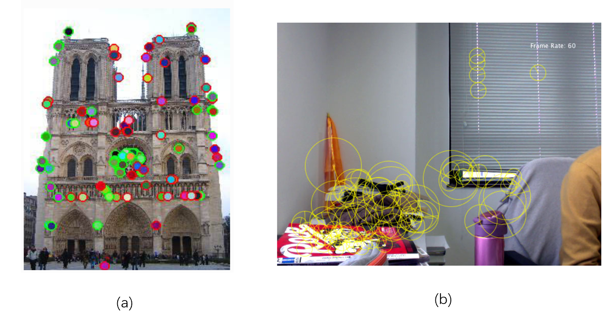

​                                                                          图 8-1-1：特征点[^1][^2]

如图 8-1-1，(a) 和 (b) 是两张图片，它们当中被不同颜色标出的边缘点以及某个区域的点，都叫做特征点，是我们用来捕捉数据信息的关键点。

#### 特征点描述（description）：

描述特征点往往是根据我们上一步提取的特征点以及其邻域进行信息的加工处理，比如得到一个直方图（第四章介绍的 PFH、FPFH、VFH）或得到一个向量（第四章介绍的法线）。

图 8-1-2 就是根据图像中的特征点得到其描述的直方图：

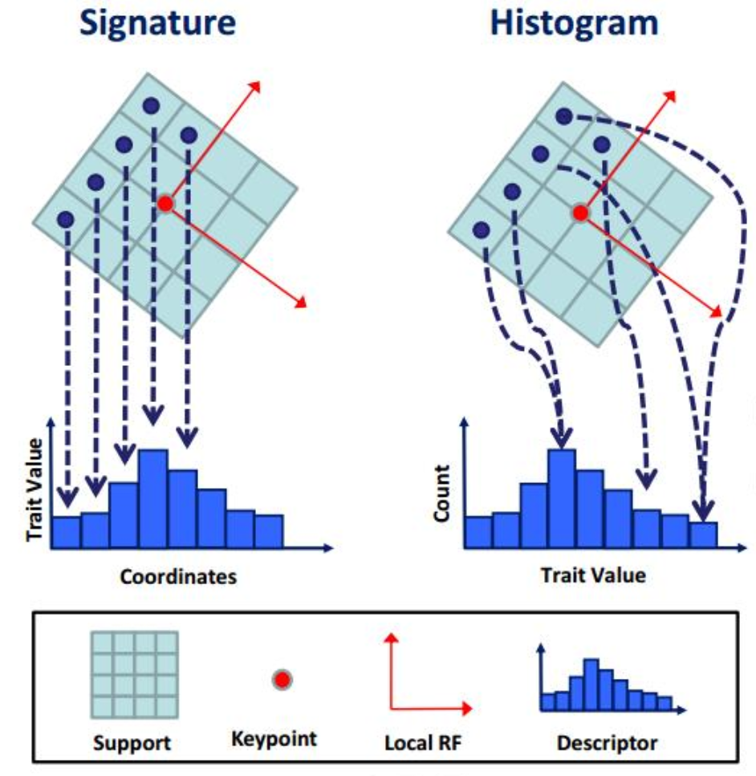

​                                                                            图 8-1-2：特征点描述[^3]

#### 特征描述匹配（matching）：

得到对于特征点的描述后，我们可以通过对比两个特征之间的相似度对点云进行匹配或配准。如下图：

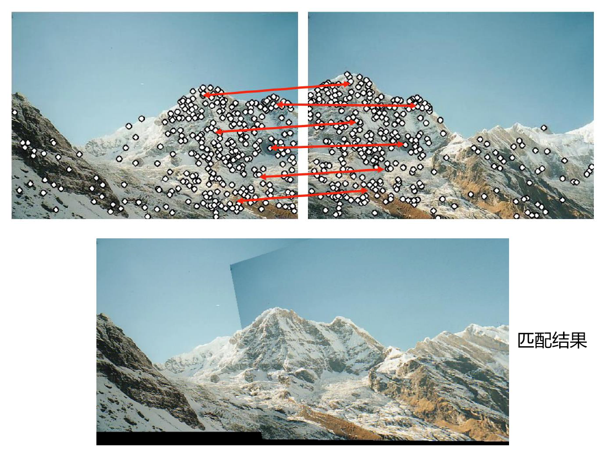

​                                                                             图 8-1-3：特征匹配[^4]

将图 8-1-3 上方的两张图像中的特征进行匹配（红线），经过一系列配准等操作，得到下方的匹配结果。

这种思路在我们日常生活中的应用也很常见，比如手机中拍摄得到的全景图等。

#### 应用：

图像中提取的特征点用途广泛，比如在 SLAM（Simultaneous Localization And Mapping）领域：我们选取图片中的特征点，利用特征点进行定位以及建图。SLAM 在处理过程中会得到图片的深度信息以及相机位置，根据这些信息可以将 2D 图像中的特征点映射到 3D 点中，如图 8-1-4。大家感兴趣可以查看以下网址 https://webdiis.unizar.es/~raulmur/orbslam/。

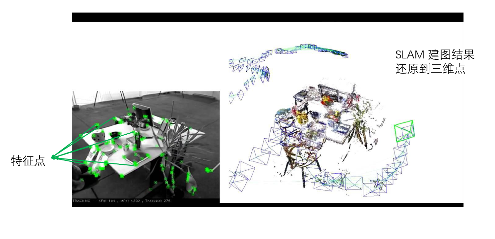

​                                                                              图 8-1-4：SLAM[^5]

#### Harris 2D：

了解关于图像中特征点的基础知识后，我们一起来学习一种特征点提取算法 —— Harris。该特征点算法可以扩充到三维。

Harris 的大体思路是源于 patch matching，就是图片中小区域的匹配。如下图：

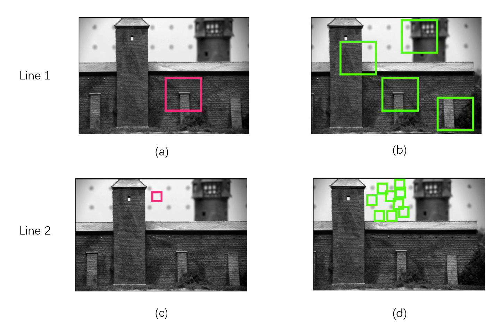

​                                                                     图 8-1-5：Patch matching[^6]

Line 1 中，我们很容易看到 (b) 中的四个绿色区域有一个是与 (a) 中的红色区域匹配的，但对于 Line 2 中 (d) 的绿色区域，我们很难判断哪一个是 (c) 的匹配区域，因为它们的内容太过相似，没有辨识度，也就是没有特征明显的信息，因此考虑匹配时选择角点/交界点区域。如下图：

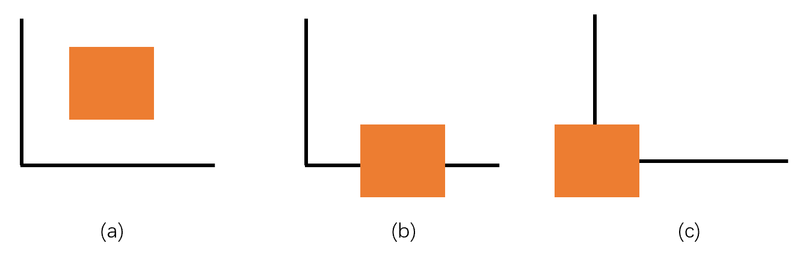

​                                                                               图 8-1-6：角点说明

我们在图片中放置了一个直角，当橙色图片在 (a) 所示的位置进行上下左右的小幅度平移时，图片内部的信息，比如颜色（这里标记为 Intensity）没有发生任何变化；而在 (b) 所示的位置进行上下的小幅度平移时，橙色图片中黑线的位置会变化，造成内部颜色信息发生变化，在左右方位上平移则不会；在 (c) 所示的位置进行上下左右小幅度平移时都会出现图片内部信息的变化，(c) 这种情况就是我们所要寻找的角点区域，包含了丰富的邻域信息。

综上，一个好的特征点提取部位就是随着滑动窗口（比如图 8-1-6 中的橙色图片）的平移，信息在时刻变化。

下面通过数学的方法来分析：给定一个图像，对于图像中小区域 $\Omega$ 内的点 (x，y)，通过 [$\Delta$x，$\Delta$y] 实现小区域的滑动，滑动后小区域的 intensity 相较之前的改变量为：
$$
E(\Delta x, \Delta y)=\sum_{x, y \in \Omega} w(x, y)[I(x+\Delta x, y+\Delta y)-I(x, y)]^{2}
$$
其中，$w(x, y)$ 是窗口函数，用来调整不同区域的权重，这里采取在区域 $\Omega$ 内值为 1，否则值为 0。由于 ${x, y \in \Omega}$，所以 $w(x, y) = 1$。如果某个小区域计算得到的 intensity 改变量较大，则可以说明这个区域是一个好的特征点提取部位。

**Q：如何选择 [$\Delta$x，$\Delta$y] ？** 

A：越小越好，越小越能近似成梯度问题。在这里，$w(x, y) = 1$，对上述公式 (1) 的推导如下：
$$
\begin{aligned}
E(\Delta x, \Delta y) &=\sum_{x, y \in \Omega}(I(x+\Delta x, y+\Delta y)-I(x, y))^{2} \\
& \approx \sum_{x, y \in \Omega}\left(I(x, y)+\Delta x I_{x}+\Delta y I_{y}-I(x, y)\right)^{2} \\
&=\sum_{x, y \in \Omega} \Delta x^{2} I_{x}^{2}+2 \Delta x \Delta y I_{x} I_{y}+\Delta y^{2} I_{y}^{2} \\
&=\sum_{x, y \in \Omega}\left[\begin{array}{cc}
\Delta x & \Delta y
\end{array}\right]\left[\begin{array}{cc}
I_{x}^{2} & I_{x} I_{y} \\
I_{x} I_{y} & I_{y}^{2}
\end{array}\right]\left[\begin{array}{c}
\Delta x \\
\Delta y
\end{array}\right]
\\
&=\left[\begin{array}{ll}
\Delta x & \Delta y
\end{array}\right]\left(\sum_{x, y \in \Omega}\left[\begin{array}{cc}
I_{x}^{2} & I_{x} I_{y} \\
I_{x} I_{y} & I_{y}^{2}
\end{array}\right]\right)\left[\begin{array}{l}
\Delta x \\
\Delta y
\end{array}\right]
\end{aligned}
$$

> 此处需要大家补充数学知识，如泰勒展开，导数、梯度等概念。

其中，矩阵 $\left[\begin{array}{cc}
I_{x}^{2} & I_{x} I_{y} \\
I_{x} I_{y} & I_{y}^{2}
\end{array}\right]$ 记为 $M$，也即 intensity 对于 x，y 方向的一阶导数组成的协方差矩阵，将点 $(x_i, y_i)$ 的 intensity 导数 $I_i$ 记为 $[I_{x_i}, I_{y_i}]^T$。我们可以通过分析协方差矩阵来分析数据的分布情况。

图 8-1-7 反映了导数与区域变化的关系。对于边缘情况，当我们在 x 轴方向移动时会使得 intensity 产生变化，因为颜色从黑色变成了灰色，而在 y 轴方向移动则没有变化，因此 y 轴导数为 0；对于平面情况，无论怎样移动，区域内颜色没有发生改变，因此 intensity 在 x 轴与 y 轴的导数都是 0；对于角点区域来说，无论在 x 轴还是 y 轴移动都会产生 intensity 变化，且两个方向有一个交点，该交点所处的位置 x，y 轴导数都非零，则该点可以作为特征点。所以特征点可以认为是两个方向导数都较大的位置。

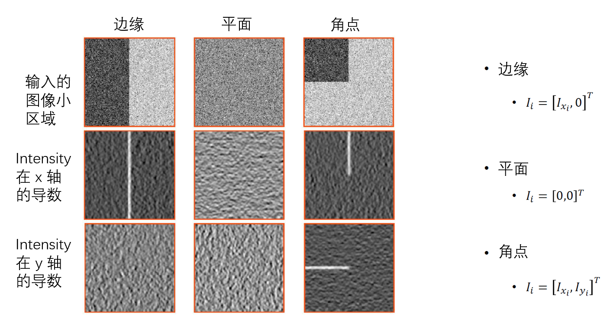

​                                                                    图 8-1-7：导数与区域的关系[^6]

但是我们不用每次都是判断每个轴的导数大小，我们可以直接通过 $M$ 这个协方差矩阵的特征值 $\lambda_1, \lambda_2$ 来分析。$\lambda_1, \lambda_2$ 都很大说明在两个特征向量方向上分布都很分散和均匀。因此可以这样来判断：

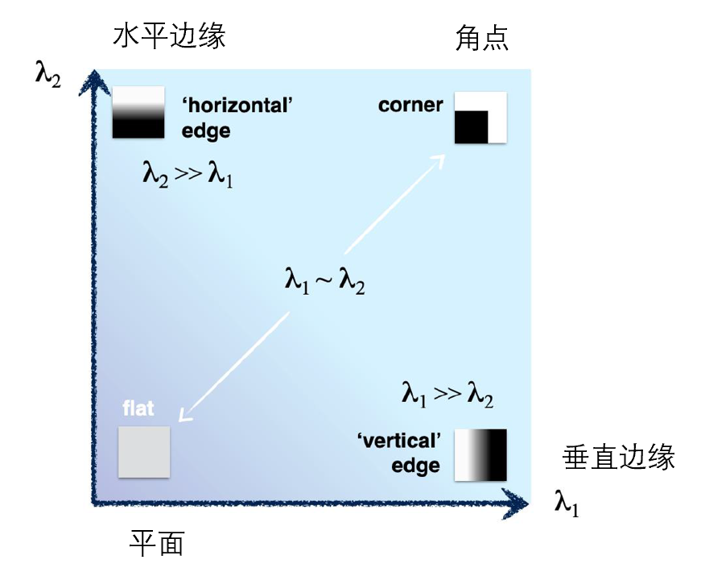

​                                                                         图 8-1-8：判断角点[^6]

- $\lambda_1, \lambda_2$ 都很大，说明是角点区域；
- $\lambda_1, \lambda_2$ 有一个远大于另一个，说明是边缘区域；
- $\lambda_1, \lambda_2$ 都很小，说明是平滑的平面区域。

因此我们可以通过设置 $\lambda$ 的阈值来判断大小程度。特征值现在有两个，但我们不一定非要将两个特征值都进行比较，常用的方法是选择最小的特征值 $min(\lambda_1,\lambda_2)$（又称为 response 函数）与某个阈值进行比较。

response 函数种类很多，$min(\lambda_1,\lambda_2)$ 是其中一种，我们简单列举常用的 response 函数：

​                                                                   图 8-1-9：response 函数

**实例：**

下图是两张图片进行 Harris 角点检测的过程图：① 是两张原始图片；② 是获取每个点以及邻域计算得到的 response 图像（越红越大）；③ 是提取的 Harris 角点示意图；④ 是经过 NMS（见第七章）之后的提取效果，因为 ③ 得到的 Harris 角点太多，因此通过 NMS 来筛选和精简。

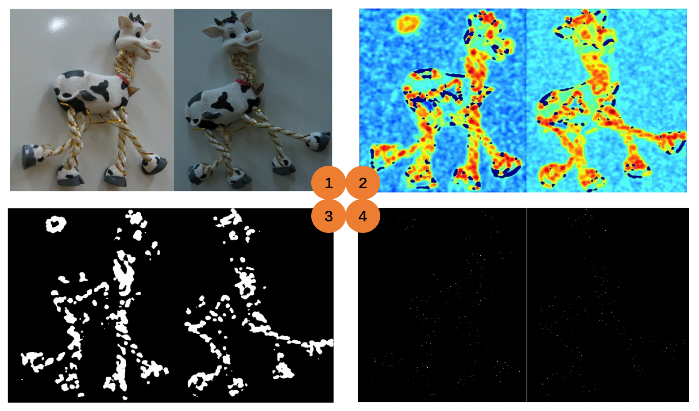

​                                                                图 8-1-10：图像中 Harris 角点检测 1[^7]

图 8-1-11 是将图 8-1-10 中最后得到 Harris 角点在原图上画出的效果（红点）：

​                                                                图 8-1-11：图像中 Harris 角点检测 2[^7]

### 8-2：点云中的特征点：

8-1 我们主要介绍了图像中 Harris 角点的检测和提取，Harris 角点也可以扩展到三维空间，本节就介绍三维点云中的特征点。首先了解 3D 特征点的应用场景：

- 配准：传统 ICP 也可以进行配准（见第四章），但是它需要一个比较好的初始解：旋转矩阵 R 和平移向量 T，且要求两个点云之间有足够高的重合率（overlap rate）；

  

  ​                                                                             图 8-2-1：配准[^8]

- 物体定位：给定一个模型，如何根据特征点预估其位置和姿态；

  

  ​                                                                    图 8-2-2：物体定位[^9]

- 数字人驱动：通过拍摄得到人的表情 —— 特征点，转移到三维数字人上，驱动三维数字人。应用在各大直播平台，短视频。点击链接感受 https://youtu.be/xMgoypPBEgw

  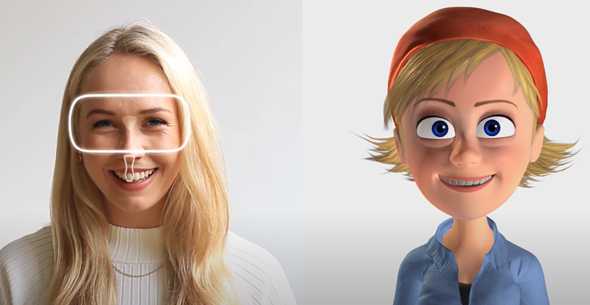

​                                                                           图 8-2-3：数字人虚拟[^10]

接下来我们会介绍传统和基于深度学习的特征点算法。

#### 8-2-1：特征点提取：

##### 传统算法：

###### Harris 3D：

类比图像中 Harris 2D 的推导过程，假设点云本身含有 intensity 信息。我们首先需要在点云中锁定一个区域 $\Omega$，可以利用之前学习过的 NNS 中的 Fixed Radius-NN 来确定一个近邻区域 $\Omega$，然后对于 $\Omega$ 中的（x，y，z）设定偏移量  [$\Delta$x，$\Delta$y，$\Delta$z] ，公式 (1) 变为：
$$
E(\Delta x, \Delta y,\Delta z)=\sum_{x, y, z \in \Omega} w(x, y, z)[I(x+\Delta x, y+\Delta y,z+\Delta z)-I(x, y,z)]^{2}
$$
 $w(x, y, z)$ 与之前定义一致，因为 x，y，z 都在 $\Omega$ 中，因此该函数值为 1，可以省去，变为 (3)：
$$
E(\Delta x, \Delta y,\Delta z)=\sum_{x, y, z \in \Omega}[I(x+\Delta x, y+\Delta y,z+\Delta z)-I(x, y,z)]^{2}
$$
经过与 2D 情况同样的公式推导（泰勒展开），得到 (4)：
$$
\left[\begin{array}{ll}
\Delta x & \Delta y & \Delta z
\end{array}\right]\left(\sum_{x, y, z \in \Omega}\left[\begin{array}{cc}
I_{x}^{2} & I_{x} I_{y} & I_{x} I_{z}\\
I_{x} I_{y} & I_{y}^{2} & I_{y} I_{z}\\
I_{x} I_{z} & I_{y} I_{z} & I_{z}^{2}
\end{array}\right]\right)\left[\begin{array}{l}
\Delta x \\
\Delta y \\
\Delta y
\end{array}\right]
$$
但是在点云中计算每个轴的导数比在图像中计算导数要困难（点云的离散性），因此我们采取如下方法：

假设我们要研究的是点云中的点 $p(p_x,p_y,p_z)$，那么在区域 $\Omega$ 内，有点 $q(q_{xi},q_{yi},q_{zi})$，设定向量 $e(e_x,e_y,e_z)$ 的方向是 intensity 变化最大的方向。得到如下等式：
$$
\left(q_{x1}-p_{x}\right) e_{x}+\left(q_{y1}-p_{y}\right) e_{y}+\left(q_{z1}-p_{z}\right) e_{z}=I\left(q_{x1}, q_{y1}, q_{z1}\right)-I\left(p_{x}, p_{y}, p_{z}\right)\\
\left(q_{x2}-p_{x}\right) e_{x}+\left(q_{y2}-p_{y}\right) e_{y}+\left(q_{z2}-p_{z}\right) e_{z}=I\left(q_{x2}, q_{y2}, q_{z2}\right)-I\left(p_{x}, p_{y}, p_{z}\right)\\
...\\
\left(q_{xi}-p_{x}\right) e_{x}+\left(q_{yi}-p_{y}\right) e_{y}+\left(q_{zi}-p_{z}\right) e_{z}=I\left(q_{xi}, q_{yi}, q_{zi}\right)-I\left(p_{x}, p_{y}, p_{z}\right)\\
...
$$

写成矩阵形式为：
$$
\begin{array}{l}
\mathbf{q}_{xi}^{\prime T} \mathbf{e}=\Delta I_{i} \\
\mathbf{q}_{xi}^{\prime}=\left[q_{xi}^{\prime}, q_{yi}^{\prime}, q_{zi}^{\prime}\right]^{T}=\left[q_{xi}-p_{x}, q_{yi}-p_{y}, q_{zi}-p_{z}\right]^{T}
\end{array}
$$

$$
A \mathbf{e}=\mathbf{b}, A=\left[\begin{array}{ccc}
q_{x1}^{\prime} & q_{y1}^{\prime} & q_{z1}^{\prime} \\
\vdots & \vdots & \vdots \\
q_{xi}^{\prime} & q_{yi}^{\prime} & q_{zi}^{\prime} \\
\vdots & \vdots & \vdots
\end{array}\right], \mathbf{b}=\left[\begin{array}{c}
\Delta I_{1} \\
\vdots \\
\Delta I_{i} \\
\vdots
\end{array}\right]
$$
根据 (7)，假设点的数量足够多，我们就可以得到 e 的数值，也就是 intensity 对于各个方向的一阶导数：
$$
\mathbf{e}=\left(A^{T} A\right)^{-1} A^{T} \mathbf{b}
$$
并且：
$$
\mathbf{e} = (I_x,I_y,I_z)
$$
因此，(4) 中的矩阵 $M$ 就可以求出。

------

我们还可以对这种方法进行优化：

将 $\mathbf{e}$ 投影到一个局部表面（local surface），来代替投影之前的 $\mathbf{e}$。我们用一个近似的平面方程来代表这个局部表面 $ax+by+cz+d=0$，则该面的法向量为：
$$
\mathbf{n}=\left[n_{x}, n_{y}, n_{z}\right]^{T}=\frac{[a, b, c]^{T}}{\left\|[a, b, c]^{T}\right\|_{2}}
$$
**为什么要将 $\mathbf{e}$ 投影到一个局部平面？**

因为点云中往往含有一些噪声点，如果直接使用 $\mathbf{e}$，可能特征向量方向会受到噪声点的影响而偏离，如下图中蓝色箭头代表 $\mathbf{e}$，绿色箭头代表投影后的方向，可以看到，蓝色箭头受到了右上方噪声点的影响。

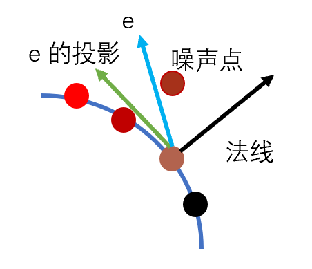

​                                                                                  图 8-2-4：投影

投影后的结果 $\mathbf{e}^{\prime}$ 为;
$$
\mathbf{e}^{\prime}=\mathbf{e}-\mathbf{n}\left(\mathbf{n}^{T} \mathbf{e}\right)=\mathbf{e}-\mathbf{n}\left(\mathbf{e}^{T} \mathbf{n}\right)
$$
据此，计算矩阵 $M$ 时，所使用的一阶导是我们根据局部表面投影后的 $\mathbf{e}^{\prime}$，降低对于噪声点的敏感度。

最后，我们得到特征值 $\lambda_1, \lambda_2,\lambda_3$ ，关于点云中 Harris 的 response 函数我们一般不取最小的特征值，因为这个特征值方向一般是 z 轴，对于路面等场景，z 轴方向的变化本来就不大，很容易漏判特征点，因此我们用排在中间的特征值作为 response 函数的值与与之进行比较。

------

**如果点云本身不含有 intensity 信息，该如何求得 Harris 角点？**

因为不含 intensity 信息，因此我们的公式 (3) 转变成：
$$
E(\Delta x, \Delta y,\Delta z)=\sum_{x, y, z \in \Omega}[f(x+\Delta x, y+\Delta y,z+\Delta z)-f(x, y,z)]^{2}
$$
其中，$f(x,y,z)=0$ 代表的是一个局部平面，即 $ax+by+cz+d=0$，根据泰勒展开，(12) 可以表示为：
$$
\left[\begin{array}{ll}
\Delta x & \Delta y & \Delta z
\end{array}\right]\left(\sum_{x, y, z \in \Omega}\left[\begin{array}{cc}
n_{x}^{2} & n_{x} n_{y} & n_{x} n_{z}\\
n_{x} n_{y} & n_{y}^{2} & n_{y} n_{z}\\
n_{x} n_{z} & n_{y} n_{z} & n_{z}^{2}
\end{array}\right]\right)\left[\begin{array}{l}
\Delta x \\
\Delta y \\
\Delta y
\end{array}\right]
$$
其中，$(n_x,n_y,n_z)$ 是 $ax+by+cz+d=0$ 的表面法线。此时 response 函数是特征值中的最小值 $\lambda_3$。

###### Harris 6D：

在 Harris 6D 中，点云本身包含 intensity，我们同时采用了法线信息，协方差矩阵为：
$$
M=\sum_{x, y, z \in \Omega}\left[\begin{array}{ccccc}
I_{x}^{2} & I_{x} I_{y} & I_{x} I_{z} & I_{x} n_{x} & I_{x} n_{y} & I_{x} n_{z} \\
I_{x} I_{y} & I_{y}^{2} & I_{y} I_{z} & I_{y} n_{x} & I_{y} n_{y} & I_{y} n_{z} \\
I_{x} I_{z} & I_{y} I_{z} & I_{z}^{2} & I_{z} n_{x} & I_{z} n_{y} & I_{z} n_{z} \\
n_{x} I_{x} & n_{x} I_{y} & n_{x} I_{z} & n_{x}^{2} & n_{x} n_{y} & n_{x} n_{z} \\
n_{y} I_{x} & n_{y} I_{y} & n_{y} I_{z} & n_{x} n_{y} & n_{y}^{2} & n_{y} n_{z} \\
n_{z} I_{x} & n_{z} I_{y} & n_{z} I_{z} & n_{x} n_{z} & n_{y} n_{z} & n_{z}^{2}
\end{array}\right]
$$
Harris 6D 的 response 函数选择 $\lambda_4$，即将特征值排序后第四小的。

###### ISS：

Harris 3D 以及 Harris 6D 是在图片 Harris 2D 基础上扩展得到的，点云本身也有自己的原生特征点，比如接下来我们要介绍的 ISS。

ISS (Intrinsic Shape Signatures) 大体思路如下：

① 关键点/特征点往往出现在点的变化较大区域；

② PCA 可以描述三个方向点的分布，对每个点的邻域建立协方差矩阵。其中，PCA (Principal component analysis) 是一种降维方法，通过旋转坐标轴的基使得数据分散在旋转后的两个坐标轴上。

PCA 详情请见 https://en.wikipedia.org/wiki/Principal_component_analysis

> ISS 在建立协方差矩阵时考虑了权重问题，点越近，权重越大。

③ 计算点 $p_i$ 的协方差矩阵特征值，得到 $\lambda_i^1,\lambda_i^2,\lambda_i^3$，且满足如下公式：
$$
\frac{\lambda_{i}^{2}}{\lambda_{i}^{1}}<\gamma_{21} \text { and } \frac{\lambda_{i}^{3}}{\lambda_{i}^{2}}<\gamma_{32}
$$
使得 $\lambda_i^1>\lambda_i^2>\lambda_i^3$，用以排除平面和线的情况（因为平面和线可能出现自己的两个特征值相等的情况）。

④ 通过 NMS 选择 $\lambda_i^3$。因为 NMS 的原理就是选择得分高的，其余的删除，因此通过 NMS 得到的 $\lambda_i^3$ 是比较大的，也即特征点对应的特征值。

------

###### 总结：

下面对于 Harris 2D，带 intensity 的点云计算的 Harris 3D、不带 intensity 的点云计算的 Harris 3D、 Harris 6D 以及 ISS 进行对比：

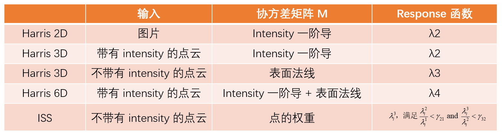

​                                                                  图 8-2-5：几种不同特征点比较

以上介绍的 Harris 以及 ISS 是传统特征点算法，在标准且干净的点云中表现较好，但它们对于噪声其实是比较敏感的，噪声会使得协方差矩阵符合条件，从而出现误判。因此我们引入了深度学习来解决这些问题。

##### 深度学习算法：

虽然我们希望通过深度学习来改进优化特征点的提取等操作，但这种研究还是存在难点，因为对于特征点的定义并不明确，且没有通用的数据集；点云本身的稀疏性等特点也会影响深度学习的操作。

我们接下来将会介绍一种使用深度学习进行特征点操作的算法 —— USIP。

###### USIP：

USIP (Unsupervised Stable Interest Point)，是一种无监督算法，下图红色点是该算法的检测效果：

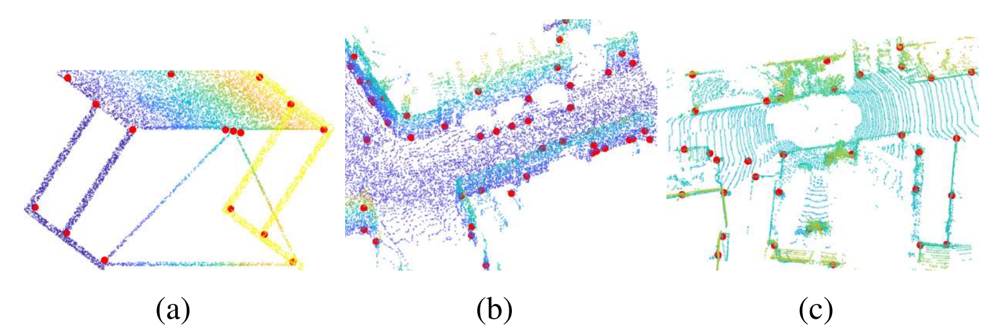

​                                                                 图 8-2-6：USIP 特征点检测效果[^11]

图 8-2-7 是使用 USIP 进行特征点描述以及匹配的效果：

​                                                                     图 8-2-7：描述以及匹配[^11]

USIP 是一种无监督学习的算法，因此哪个点是特征点是由网络自己决定的。思路如下：

1. 对于一个特征点来说，无论从哪个角度观察，它依旧是一个特征点；
2. 特征点概念与相对区域大小相关：如果我们要研究的是一个车轮，那么车轮上的花纹可能是特征点；如果我们要研究的是一整辆车，那么车轮上的花纹点可能因为相对区域太小而不被看做特征点。

算法流程如下：

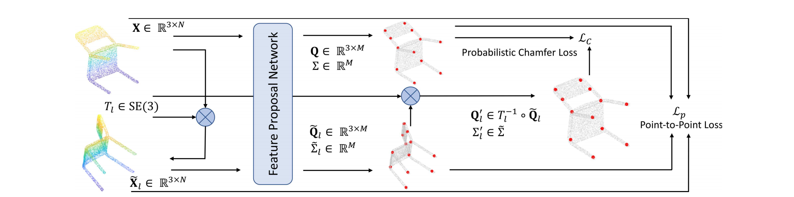

​                                                                                  图 8-2-8：USIP[^11]

USIP 的算法构架：首先输入是一个三维点云 $\mathbf X$，经过 Feature Proposal Network（可以是 PointNet++ 或 So-Net 等）得到 $M$ 个特征 $\mathbf Q$，每个特征点有一个数值来表达不确定性（>0)，这些不确定值构成 $\Sigma$；然后对于一开始输入的点云 $\mathbf X$，做一个随机的旋转平移 $T_l$ 得到 $\widetilde{\mathbf X}_l$，对于 $\widetilde{\mathbf X}_l$ 再进行一次 FPN，得到特征 $\widetilde{\mathbf Q}_l$ 和 $\widetilde{\mathbf \Sigma}_l$。因为一个特征点不管从哪个角度看都应该是特征点，所以我们两次得到的特征点应该就差一个旋转平移矩阵 $T_l$，将 $\widetilde{\mathbf Q}_l$ 经过 $T_l$ 映射到原始空间，与 $\mathbf Q$ 求损失函数，使得损失函数最小。

#### 8-2-2：特征点描述：

对于特征点的描述，有传统方法也有基于深度学习的方法。

##### 传统算法：

特征点描述的传统算法很多，我们在第四章介绍 PCL 时就已经接触过 PFH、FPFH 以及 VFH，这些都是对特征点的描述，我们又称其为描述子。本节将会补充 SHOT 相关概念。

###### SHOT：

SHOT (Signature of Histograms of OrienTations)，捕捉每个点坐标的信息，步骤如下：

*step1*：对每个点设定 Local Reference Frame (LRF)，使得不管物体如何旋转，LRF 是对应不变的。我们可以借助 PCA 得到的主成分，因为这些主成分的方向也是不会随着旋转平移发生变化的，是物体本身结构的反应。根据点的坐标以及邻域得到一个加权协方差矩阵（类似于 ISS），分解矩阵后得到三个主成分对应的轴，但是每个轴都会有正负两个方向，我们一般选择点分布较多的作为最终该轴的方向，确定了其中两个轴方向后，第三个轴通过另外两个轴方向的叉乘得到。

*step2*：得到 LRF 后，将这个 LRF 的区域空间（是特征点及其邻域，而不是整个点云）划分成小区域（small volumes），如下图，按照经纬度以及半径方向划分：

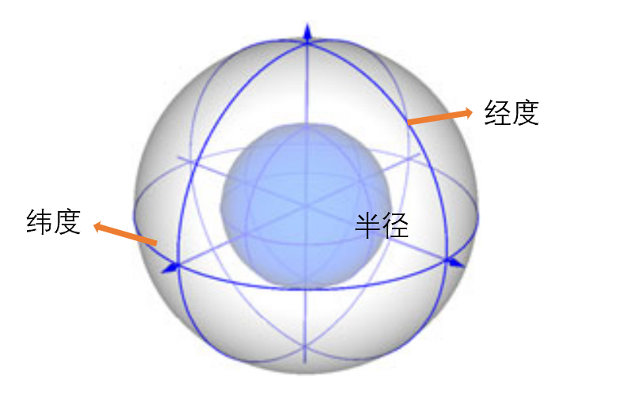

​                                                                 图 8-2-9：LRF 以及 SHOT 划分结构[^12]

- 经度方向划分八块，图 8-2-9 为了显示清晰，只划分了四块；
- 维度方向划分两块；
- 半径方向划分两块，即外面一个大球，里面一个紫色小球；

这样一共得到 $8× 2× 2 = 32$ 个小区域，在每个小区域中计算一个直方图，然后将这些小直方图拼接在一起，标准化得到特征描述子。

关于每个区域中直方图的计算：对于特征点及其邻域点组成的小区域，计算特征点及其邻域点的法线，分别记作 $n$ 以及 $n_i$，直方图中存放的信息就是 $cos\theta_i = n ·n_i$。PCL 中 SHOT 对应直方图默认划分 11 个子区间，因此得到的 SHOT 描述子长度为：$11×32=352$，所以 PCL 中的估计类为 *"pcl::SHOT352"*。

##### 深度学习算法：

基于深度学习的特征描述算法主要介绍四个：3DMatch、The Perfect Match、PPFNet、PPF-FoldNet。

##### 3DMatch：

3DMatch 构架如下图所示：

​                                                                        图 8-2-10：3DMatch[^13]

**(a)** 使用 RGB-D 数据集重建（可以通过 SLAM 等操作）得到的地图作为数据集，选取其中几个视点：蓝色、黄色、绿色，然后选取几个特征点（红点）；

**(b)** 是我们在 RGB-D 数据集中选取的三个角度的视图，作为三个 patch，这些 patch 中有一个作为基准（称为 anchor），另外一个（称为 positive）与第一个是同一个场景但不同角度，最后一个是不同场景的视图（称为 negative）；

**(c)** 分别以三个视图中的特征点为中心建立 VoxelGrid；

**(d)** 将三个视图的特征点描述进行比较，然后定义损失函数，使得 anchor 与 positive 的描述一致，而 anchor 与 negative 的描述不一致，从而达到训练网络的效果；

损失函数使用 Contrastive Loss：

首先定义 label —— $y_{ij}$ 表示 $i$ 与 $j$ 的特征描述是否一致，如果一致（positive）则为 1；否则（negative）为 0。

Contrastive Loss 为：
$$
\begin{array}{l}
L=\frac{1}{N} \sum_{n=1}^{N} y_{i j} d_{i j}^{2}+\left(1-y_{i j}\right) \max \left(\tau-d_{i j}, 0\right)^{2} \\
d_{i j}=\left\|f\left(x_{i}\right)-f\left(x_{j}\right)\right\|_{2}
\end{array}
$$
其中，$x_i$ 与 $x_j$ 表示不同的 patch，$f(x)$ 就是处理网络得到描述子，因此，$d_{ij}$ 是衡量 $x_i$ 与 $x_j$ 特征之间的差异度。如果 $x_i$ 与 $x_j$ 是 positive，则 $y_{ij} = 1$ 代入即最小化 $d_{ij}$；如果 $x_i$ 与 $x_j$ 是 negative，则定义一个阈值 $\tau$，如果 $d_{ij} > \tau$，则无需处理 $d_{ij}$，否则最小化 $\tau - d_{ij}$，即最大化 $d_{ij}$。

**(e)** 算法的应用。

图 8-2-11 是 3DMatch 的效果可视化图，它实现了将匹配为 positive 的 patch 聚类到一起，说明这些特征描述子是有区分能力的：

​                                                                    图 8-2-11：3DMatch 效果图[^13]

但 3DMatch 存在问题：

- 不能很好地对旋转等操作保持稳定；
- 损失函数太强，$d_{ij}$ 没有必要非得是 0 或者接近 $\tau$，因为距离的差异和相似是相对的。

鉴于 3DMatch 存在的问题，我们接下来介绍 The Perfect Match。

##### The Perfect Match：

The Perfect Match 改进了 3DMatch 的两个问题，对于旋转造成的影响，The Perfect Match 选择建立 LRF。

###### LRF 的建立：

与 SHOT 中建立 LRF 类似，计算特征点及其邻域的协方差矩阵（这里不需要加权），以特征点的法线为 z 轴，同样地，点数多的方向为 z 轴方向。将特征点的邻域点投影到特征点法线垂直的平面上，所有邻域点的投影的加权平均（越近权重越大）就是 x 轴方向，y 轴方向是 z 轴方向与 x 轴方向的叉乘。

对于损失函数太强的问题，The Perfect Match 使用了较弱的 Triplet Loss：

###### Triplet Loss：

Triplet Loss （三元组损失函数）的思想是：“远”、“近” 是相对的，只要 anchor 与 positive 的距离远大于 anchor 与 negative 的距离即可，不需要前者无限接近 0，后者接近 $\tau$。

​                                                                      图 8-2-12：Triplet Loss[^14]
$$
L=\sum_{i}^{N}\left[\left\|f\left(x_{i}^{a}\right)-f\left(x_{i}^{p}\right)\right\|_{2}^{2}-\left\|f\left(x_{i}^{a}\right)-f\left(x_{i}^{n}\right)\right\|_{2}^{2}+\alpha\right]_{+}
$$
最小化 L 的过程就是最小化 $\left\|f\left(x_{i}^{a}\right)-f\left(x_{i}^{p}\right)\right\|_{2}^{2}$，最大化 $\left\|f\left(x_{i}^{a}\right)-f\left(x_{i}^{n}\right)\right\|_{2}^{2}$，$\alpha$ 是阈值（也即图 8-2-13 中的 margin）。

但 Triplet Loss 也存在局限性：

- 损失函数的函数值接近 0，无法用来监督网络。这取决于我们如何去找寻 negative，如果在空间中随机采样 anchor 和 negative，那么二者大概率是相差很大的；
- 网络收敛慢；

如图 8-2-13：

​                                                              图 8-2-13：Triplet Loss 存在的问题[^15]

空心圆 a 代表 anchor，空心圆 p 代表 positive，二者之间的距离是点的特征描述子之间的距离。如果我们选择 negative 时落入绿色区域，也即 Easy negatives，则 negative 距离 anchor 的距离太大，损失函数为 0，对于网络来说太简单；但如果我们选择 negative 时落入红色区域，也即 Hard negatives，使得损失函数很大，无法很好收敛或收敛速度很慢。最好的情况是我们将 negative 选择在橙色区域，也即 Semi-hard negatives。

鉴于这种问题，出现了 ***Triplet Mining***，找出哪些三元组（anchor、positive 以及 negative）是足够好的，使得我们的损失函数既不会简单地为 0，也不会无法很好收敛。其三元组一般在 Semi-hard 或者 Hard 区域挑选，尽量不要选落在 Easy 区域的，否则网络不会被很好地监督。

##### PPFNet：

PPFNet (Point Pair Feature Network) 是一个基于 PointNet 的特征描述网络。

​                                                                           图 8-2-14：PPFNet[^16]

与 3DMatch 以及 The Perfect Match 不同的是，PPFNet 的输入不是每一个 patch，而是同一时刻点云的一个 frame。输入 frame 之后，可以通过采样技术得到很多 patch，这些 patch 会经过一个 shared PointNet，得到 Local Feature。对这些得到的 Local Feature 进行 Max Pooling 得到 Global Feature。随后将 Local Feature 与 Global Feature 拼接在一起，得到每个 patch 的信息以及 frame 的整体信息。然后输入 MLP，得到最终的特征描述子。

###### 创新点 1：PPFNet 的输入信息

PPFNet 输入的 patch 中不止有点云的坐标，还有点云的其他信息，比如法线，PFH 等。因为深度学习的输入越丰富，结果就相应地会好一些。下面介绍这些信息的组成，如下图：

​                                                                  图 8-2-15：PPFNet 创新点[^16]

其中，$x_r$ 是此 patch 的特征点，$n_r$ 是特征点的法线，$x_i$ 是邻域点，$n_i$ 是邻域点的法线。将每个邻域点都与特征点进行连线（与 SPFH 思路相似，见第四章）。每个邻域点与特征点组成的点对包含以下 PPF 四元组信息：
$$
\begin{array}{l}
\psi_{12}=\left(\|\mathbf{d}\|_{2}, \angle\left(\mathbf{n}_{1}, \mathbf{d}\right), \angle\left(\mathbf{n}_{2}, \mathbf{d}\right), \angle\left(\mathbf{n}_{1}, \mathbf{n}_{2}\right)\right) \\
\angle\left(\mathbf{v}_{1}, \mathbf{v}_{2}\right)=\operatorname{atan} 2\left(\left\|\mathbf{v}_{1} \times \mathbf{v}_{2}\right\|, \mathbf{v}_{1} \cdot \mathbf{v}_{2}\right)
\end{array}
$$
其中，$||\mathbf d||_2$ 是每个邻域点与特征点之间的距离；剩下三个角度分别是两个点各自法线与二者连线的夹角，以及两个法线之间的夹角。将特征点以及邻域点的坐标和法线以及我们刚刚得到的四元组合并在一个矩阵中就得到图 8-2-15 中右边的 $\mathbf F_r$。 由于点的坐标和法线都是三维，而每个邻域点与特征点计算的四元组是四维，$\mathbf F_r$ 中肯定会有缺失的地方，补零即可。写成矩阵形式后，就可以用 PointNet 处理。

###### 创新点 2：训练过程

之前介绍的 3DMatch 在训练损失函数的时候是二元组（Anchor 与 Positive 或 Anchor 与 Negative），The Perfect Match 使用的是三元组（Anchor 与 Positive，Negative），均为一个 patch。而 PPFNet 的输入是一个 frame，因此损失函数的训练也不同。

*N-tuple Loss：*

3DMatch 与 The Perfect Match 只考虑了一个 patch 中的信息，而 PPFNet 考虑一个 frame 中的 n（超参数，人为指定）个 patch 的信息，如下图三者思路的对比，红色是推开，表示不同；绿色是拉近，表示相似。(a) 和 (b) 中存在的问题是并没有把所有形状类似的都拉近，而 (c) 可以做到：

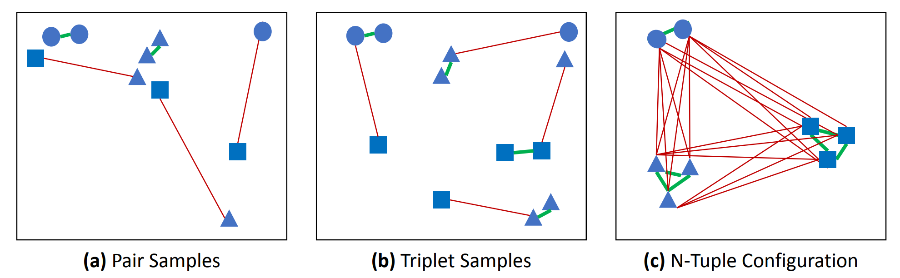

​                                                                图 8-2-16：损失函数建立思路对比[^16]

具体步骤：

**step1**：每个 frame 选择 n 个 patch，有两个 frame，记录 frame1 中特征点在特征空间的位置 $x_i$，frame2 中特征点在特征空间的位置 $y_i$。训练时，frame1 与 frame2 的旋转平移矩阵 $\mathbf T$ 已知。

**step2**：确定相应的 positive 与 negative，特征空间中距离相近的就是 positive，否则 negative。判断公式为：
$$
m_{i j}=\mathbb{1}\left(\left\|\mathbf{x}_{i}-\mathbf{T} \mathbf{y}_{j}\right\|_{2}<\tau\right)
$$
其中，$\mathbb{1}$ 是一个指示函数 。$m_{ij}$ 组成一个特征点相似度关系的矩阵 $\mathbf M$。

**step3**：计算特征距离矩阵 $\mathbf D$，其中 $f(·)$ 就是 PPFNet，矩阵每个元素计算公式如下：
$$
d_{i j}=\left\|f\left(\mathbf{x}_{i}\right)-f\left(\mathbf{y}_{j}\right)\right\|_{2}
$$
**step4**：得到 N-tuple Loss：
$$
L=\sum^{*}\left(\frac{\mathbf{M} \circ \mathbf{D}}{\|\mathbf{M}\|_{2}^{2}}+\alpha \frac{\max (\theta-(1-\mathbf{M}) \circ \mathbf{D}, 0)}{N^{2}-\|\mathbf{M}\|_{2}^{2}}\right)
$$

> 数学推导请大家自己补充，这里不再展开。

下图是 PPFNet 训练过程示意图：

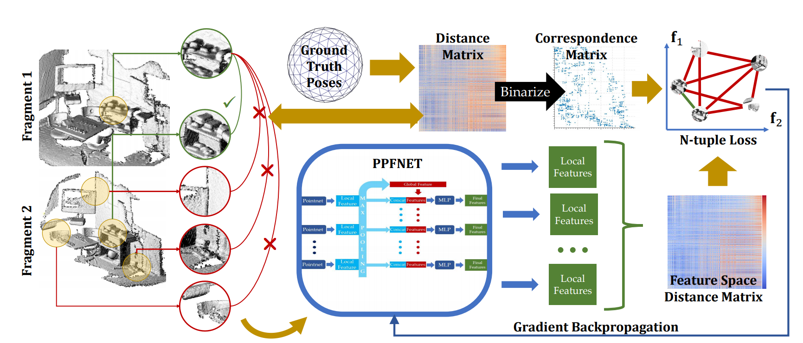

​                                                               图 8-2-17：PPFNet 训练过程[^16]

其中 ，Ground Truth Poses 就是 step1 中的 $\mathbf T$，Distance Matrix + Binarize（指示函数 $\mathbb 1$）得到的 Correspondence Matrix 就是 step2 中的矩阵 $\mathbf M$，Feature Space Distance Matrix 就是 step3 中的矩阵 $\mathbf D$。

下图是几种不同损失函数对比图，Pair 即 Contrastive Loss，Triplet 即 Triplet Loss，N-tuple 即 N-tuple Loss。紫色是 negative，红色是 positive，会发现 N-tuple Loss 对于 positive 和 negative 的区分度较好：positive 距离接近 0，negative 距离较大。

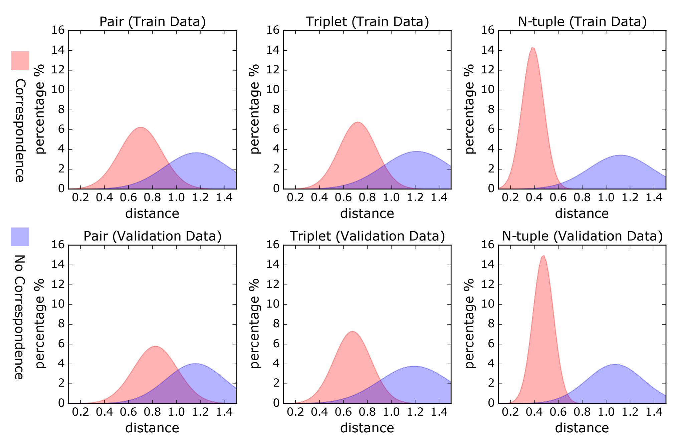

​                                                               图 8-2-18：几种损失函数对比示意图[^16]

##### PPF-FoldNet：

PPF-FoldNet 框架如图 8-2-19，输入仍为一个 patch：

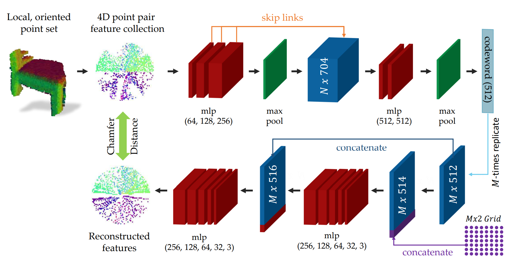

​                                                                   图 8-2-19：PPF-FoldNet[^17]

输入一个 patch，然后通过 PPF 来表达这个 patch（没有用点的坐标和法线，只有 PPF 四元组，所以是 4D），通过 encoder 得到 feature vector —— codeword，decoder 得到重建的 patch。原始 patch —— $\mathbf F$ 和重建的 patch —— $\hat{\mathbf F}$ 应该一致。损失函数为 Chamfer Loss：
$$
d(\mathbf{F}, \hat{\mathbf{F}})=\max \left\{\frac{1}{|\mathbf{F}|} \sum_{\mathbf{f} \in \mathbf{F}} \min _{\mathbf{f} \in \hat{\mathbf{F}}}\|\mathbf{f}-\hat{\mathbf{f}}\|_{2}, \frac{1}{|\hat{\mathbf{F}}|} \sum_{\mathbf{f} \in \hat{\mathbf{F}}} \min _{\mathbf{f} \in \mathbf{F}}\|\mathbf{f}-\hat{\mathbf{f}}\|_{2}\right\}
$$
图 8-2-20 是经过 T 次训练后与原始特征可视化图的对比，可以发现，在经过 70 轮训练后，重构后的特征可视化图与 Original PPF 已经非常接近了：

​                                                                   图 8-2-20：训练轮数与可视化效果[^17]

#### 8-2-3：特征描述匹配：

特征描述匹配，即点云之间的配准（Registration），最终目标是求一个旋转矩阵和平移向量组合在一起的刚性变换矩阵，我们在第二章和第四章介绍过 ICP 算法来配准。这里将配准与特征点的处理归纳在一起，促进大家对配准的进一步理解。

> 注：目前遇到的都是刚性匹配。非刚性会相对麻烦，这里不做拓展。

##### RANSAC 配准：

常见的配准算法，如 ICP、NDT (Normal Distribution Transformation，一种不同于 ICP 的传统配准算法，感兴趣可以自行查看，这里不作详细说明) 都需要有较好的初始解，否则配准效果可能不佳。但基于特征提取和描述的配准方法则可以解决这一问题。当然，基于特征的配准方法结果并不精确，因此我们往往将两种配准结合在一起，先通过基于特征的配准得到一个较好的初始解，然后再使用 ICP 或 NDT 得到较为精确的配准结果。

这里介绍的基于特征的配准即 RANSAC (Random Sample Consensus) 配准。步骤如下：

​                                                                            图 8-2-21：配准[^11]

**step1**：对源点云和目标点云进行特征提取和描述，得到特征描述子；

**step2**：进行对应关系估计（根据特征描述子之间的距离，这里的距离不是欧式距离，是特征空间的距离），如何建立这种对应关系呢？

首先输入目标点云和源点云的特征描述；其次，可以通过以下几种方法来寻找对应关系：

① 对于目标点云中的每个点，寻找源点云中特征最相似的点（注意，不是欧氏距离，是特征向量空间的相似）；

② 对于源点云中的每个点，寻找目标点云中特征最相似的点（注意事项同上）；

③ 将 ① 与 ② 结合在一起，双向寻找，满足二者之一的即可作为对应点对（注意事项同上）；

④ 将 ① 与 ② 结合在一起，双向寻找，但只有双向都对应才记为对应点。比如根据目标点云中的点 A 寻找到源点云中的点 B 特征最为相似，反过来寻找，源点云中的点 B 找到的对应点也是目标点云中的点 A，则 A 和 B 即为对应点对（注意事项同上）；

**step3**：进行 RANSAC 迭代，每次考虑 3 个点对，通过 Procrustes Transformation 估计旋转矩阵和平移向量，再根据每个点经过该变换后距离对应点的欧氏距离来确定 inliers；

**step4**：选择计算得到 inliers 最多的旋转矩阵和平移向量。

------

下面总结一个通用的点云配准方法：

- 数据预处理：降采样、降噪、过滤等；

- 寻找初始的旋转矩阵和平移向量，可以通过先验知识或者特征描述匹配得到的结果作为初始解；

- 得到初始解后，进行 ICP、NDT 等方法进一步优化旋转矩阵和平移向量。

  

> 以上是对本章特征相关知识的介绍。部分代码开源，感兴趣可以尝试。
>
> 另：本章参考深蓝学院三维点云处理课程 https://www.shenlanxueyuan.com/course/262

### 参考文献：

[^1]:http://cs.brown.edu/courses/cs143/2013/results/proj2/taparson/
[^2]: http://www.magicandlove.com/blog/2014/03/13/opencv-features2d-in-processing/#more-1252
[^3]: https://www.programmersought.com/article/86603333968/
[^4]: Computer Vision, Raquel Urtasun

[^5]:https://webdiis.unizar.es/~raulmur/orbslam/。
[^6]: CSE486, Penn State, Robert Collins
[^7]: 16-385 Computer Vision, CMU, Kris Kitani

[^8]: https://prs.igp.ethz.ch/research/completed_projects/automatic_registration_of_point_clouds.html
[^9]: http://www.fubin.org/research/Human_Pose_Estimation/Human_Pose_Estimation.html
[^10]: https://youtu.be/xMgoypPBEgw
[^11]: Li, J., & Lee, G. H. (2019). Usip: Unsupervised stable interest point detection from 3d point clouds. In *Proceedings of the IEEE International Conference on Computer Vision* (pp. 361-370).
[^12]: Tombari, F., Salti, S., & Di Stefano, L. (2010, September). Unique signatures of histograms for local surface description. In *European conference on computer vision* (pp. 356-369). Springer, Berlin, Heidelberg.
[^13]: Zeng, A., Song, S., Nießner, M., Fisher, M., Xiao, J., & Funkhouser, T. (2017). 3dmatch: Learning local geometric descriptors from rgb-d reconstructions. In *Proceedings of the IEEE Conference on Computer Vision and Pattern Recognition* (pp. 1802-1811).
[^14]: Schroff, F., Kalenichenko, D., & Philbin, J. (2015). Facenet: A unified embedding for face recognition and clustering. In *Proceedings of the IEEE conference on computer vision and pattern recognition* (pp. 815-823).
[^15]: https://omoindrot.github.io/triplet-loss
[^16]: Deng, H., Birdal, T., & Ilic, S. (2018). Ppfnet: Global context aware local features for robust 3d point matching. In *Proceedings of the IEEE Conference on Computer Vision and Pattern Recognition* (pp. 195-205).
[^17]: Deng, H., Birdal, T., & Ilic, S. (2018). Ppf-foldnet: Unsupervised learning of rotation invariant 3d local descriptors. In *Proceedings of the European Conference on Computer Vision (ECCV)* (pp. 602-618).

